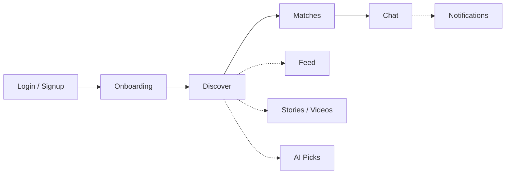
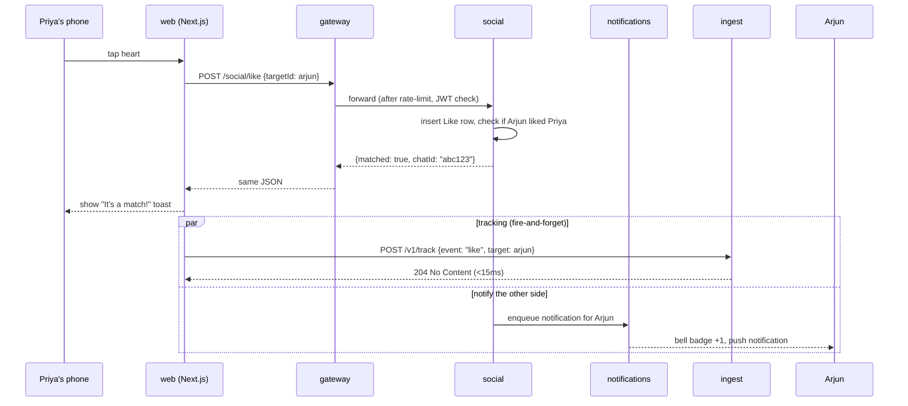
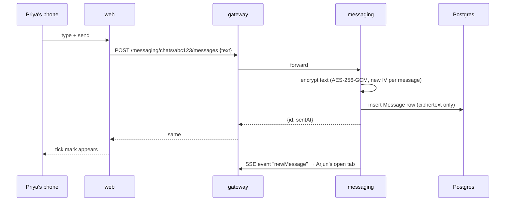
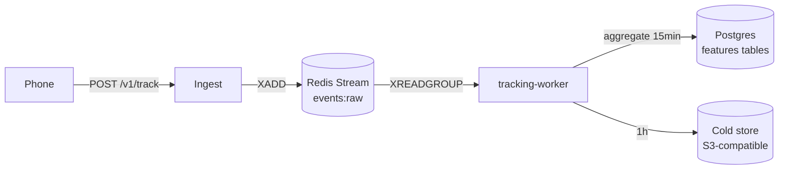
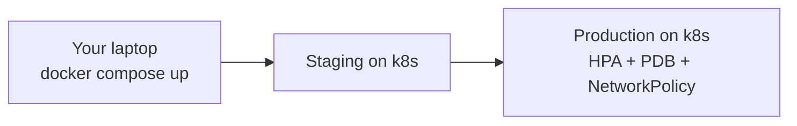

# Miamo — The Book

> Read this one file and you will understand the entire product.
> No prior knowledge needed.

It's 9:02pm on a Tuesday. Priya is on her sofa in Mumbai. She opens Miamo,
sees a photo of Arjun from Bangalore, smiles, and taps the heart. Two
seconds later Arjun's phone buzzes: *"You have a new match."* They start
chatting. By Friday they're planning a video call.

That tiny moment is what this entire repository exists to make possible —
fast, safely, fairly, for a million Priyas at the same time. This document
walks you through everything that happens between her tap and Arjun's
buzz, in plain English, with diagrams.

---

## Table of contents

1. [The product in 60 seconds](#1-the-product-in-60-seconds)
2. [The 9 screens Priya sees](#2-the-9-screens-priya-sees)
3. [What happens behind every tap](#3-what-happens-behind-every-tap)
4. [The 17 algorithms in plain English](#4-the-17-algorithms-in-plain-english)
5. [The tracking system in plain English](#5-the-tracking-system-in-plain-english)
6. [How we keep her data safe](#6-how-we-keep-her-data-safe)
7. [How we run it in production](#7-how-we-run-it-in-production)
8. [Glossary — every tech word, one line each](#8-glossary)
9. [What changed and why it's better](#9-what-changed-and-why-its-better)

---

## 1. The product in 60 seconds

Miamo is a dating app. People sign up, tell us about themselves, and we
help them meet someone they'll genuinely like. The product has four
core jobs:

| Job                     | What Priya feels                                          |
|-------------------------|-----------------------------------------------------------|
| **Discover**            | A stream of profiles tailored to her, not random          |
| **Match & chat**        | When both like each other, a private encrypted chat opens |
| **Stay engaged**        | Stories, short videos, daily picks keep the app alive     |
| **Get nudged kindly**   | A notification when there's a real reason — not spam      |

Under the hood, the app is split into **9 small services** (each does
one thing well) talking to **one database** (Postgres) and **one
message bus** (Redis). A 10th service — the **web app** — is what
Priya's phone actually shows.

---

## 2. The 9 screens Priya sees



| # | Screen        | What it does                                             | Lives in service |
|---|---------------|----------------------------------------------------------|------------------|
| 1 | Login         | Email + password, returns a session                      | auth             |
| 2 | Onboarding    | 12 questions about Priya's vibe (must complete before #3)| users            |
| 3 | Discover      | The main swipe stack — ranked candidates                 | social           |
| 4 | Matches       | The list of people who liked her back                    | social           |
| 5 | Chat          | Encrypted 1-to-1 conversation                            | messaging        |
| 6 | Feed          | Posts from people she's interested in                    | content          |
| 7 | Stories/Videos| 24h photo stories and short videos                       | content          |
| 8 | AI Picks      | One daily "we think you'll click" recommendation         | social           |
| 9 | Notifications | In-app bell with new matches, messages, story replies    | notifications    |

---

## 3. What happens behind every tap

Below are four real journeys. Read them and you'll know how data flows
in this app.

### 3.1 Priya taps "Like" on Arjun



Total wall time Priya feels: **~120ms** (the heart turns red instantly
because the UI is optimistic — the network round-trip just confirms).

### 3.2 Priya sends "Hey, where was that trek photo taken?"



The plaintext **never** touches the database. Even our DBAs can't read
the chat. (More on this in §6.)

### 3.3 Priya opens the Feed

```mermaid
sequenceDiagram
    participant P as Priya's phone
    participant W as web
    participant G as gateway
    participant C as content
    participant S as shared (algo lib)
    P->>W: tap "Feed" tab
    W->>G: GET /content/feed?cursor=0
    G->>C: forward
    C->>Db: fetch ~200 recent posts from followed users
    C->>S: feedAugment.rank(posts, viewer=Priya)
    S-->>C: re-ordered list (if flag on; else chronological)
    C-->>W: 20 posts + nextCursor
    W-->>P: render
```

### 3.4 Priya gets a "good morning" nudge

This one runs without Priya doing anything. At 7:55am the
**notifications** service checks who is likely to open the app between
8 and 9am (based on past activity), composes a friendly nudge ("Arjun
posted a new photo"), and schedules a push. If she hasn't opened the
app in 3 days, we go quiet — no badgering.

---

## 4. The 17 algorithms in plain English

All algorithms live in `services/shared/src/algo/`. Each is a pure
TypeScript function that takes Priya's signals and a candidate and
returns a number between 0 and 1. The bigger the number, the better
the match for *that specific screen*.

| #  | Name                   | Powers screen        | One-line intuition                                      |
|----|------------------------|----------------------|---------------------------------------------------------|
| 1  | `forYou`               | Discover             | Like a friend who knows your type — balances all signals|
| 2  | `aiPicks`              | AI Picks (daily)     | The single highest-confidence pick of the day           |
| 3  | `aiMatch`              | Match suggestions    | Symmetric — would *both* of them swipe right?           |
| 4  | `new`                  | Discover boost       | New joiners get a small visibility boost for 48h        |
| 5  | `active`               | Discover boost       | Online-now people surface first                         |
| 6  | `verified`             | Discover boost       | Verified profiles get +0.05 — trust signal              |
| 7  | `serious`              | Discover filter      | Intent score — filters out window-shoppers              |
| 8  | `cf`                   | Discover signal      | "People like Priya also liked…" — collaborative filter  |
| 9  | `dtm`                  | Daily This Match     | The one curated daily match (different from aiPicks)    |
| 10 | `moves`                | Discover signal      | Rewards reciprocity — Priya liked back ratio            |
| 11 | `messageSuggest`       | Chat                 | Suggests a great opener line based on Arjun's profile   |
| 12 | `beats`                | Chat → Beats         | Detects "vibe matches" in chat tempo                    |
| 13 | `notifyTiming`         | Notifications        | Picks the *exact minute* she's most likely to open      |
| 14 | `searchAugment`        | Search               | Reorders search results to put compat-likely first      |
| 15 | `feedAugment`          | Feed                 | Re-ranks the feed so meaningful posts surface           |
| 16 | `postImpressionRerank` | Feed (after impression)| Demotes posts she scrolled past without engaging      |
| 17 | `registry`             | Meta                 | Lists what's enabled, returns version + flag state      |

### A real worked example: how `forYou` ranks Arjun for Priya

Priya's signals (numbers between 0 and 1):
- `compatibility(Priya, Arjun)` = **0.78** (interests overlap a lot)
- `freshness(Arjun)` = **0.40** (last active 6h ago)
- `reciprocity(Priya, Arjun)` = **0.65** (similar users liked back at this rate)
- `verified(Arjun)` = **1.0**
- `activity(Priya, last 7d)` = **0.55** (medium engagement)

The formula (simplified from `services/shared/src/algo/forYou.ts`):

```
score = 0.40·compat + 0.20·fresh + 0.20·recip + 0.10·verified + 0.10·activity
```

Plug in the numbers:

```
score = 0.40·0.78 + 0.20·0.40 + 0.20·0.65 + 0.10·1.0 + 0.10·0.55
      = 0.312    + 0.080    + 0.130    + 0.100    + 0.055
      = 0.677
```

Arjun scores **0.677**. We do this for 200 candidates, sort descending,
return the top 10. Arjun lands at **position 2** — Priya sees him second.

Every one of the 17 algorithms is documented this way in
[docs/ALGORITHMS.md](docs/ALGORITHMS.md) — go there for full math.

### How we turn algorithms on or off without redeploying

Every algorithm sits behind a feature flag (an env var that reads `'0'`
or `'1'`):

```
ALGO_V4_RANK_ENABLED_DISCOVER=1
ALGO_V4_RANK_ENABLED_AIMATCH=0
ALGO_V4_WORKERS_ENABLED=1
```

Flip a flag, restart one pod, the algorithm is live. If it misbehaves,
flip back. No code deploy needed.

---

## 5. The tracking system in plain English

To make the algorithms smart, we need to know what Priya actually does:
which profiles she lingered on, which she skipped, when she's online,
what she ignores.

### 5.1 A real 30-second timeline

```
21:02:14  Priya opens Miamo                 → event "session_start"
21:02:15  Discover loads, she sees Arjun    → event "impression"      target=arjun
21:02:18  She taps Arjun's photo to expand  → event "card_open"       target=arjun, dwellMs=3000
21:02:24  She scrolls through 4 more photos → event "photo_view" × 4
21:02:31  She taps the heart                → event "like"            target=arjun
21:02:32  Match toast appears               → event "match_shown"
21:02:40  She opens the chat                → event "chat_open"       chatId=abc123
21:02:44  She types "Hey…"                  → event "compose_start"
```

8 events in 30 seconds. Multiply by 1M users and we're at ~270k events
per second at peak.

### 5.2 How we don't drown



- **Ingest** is a tiny stateless service. It validates the event,
  stamps an HMAC fingerprint of Priya's user id, drops it onto a
  Redis Stream (think: a conveyor belt that remembers order), and
  returns 204 in **under 15ms**. The phone never waits.
- **The Stream** holds events even if the worker is down — when it
  comes back, it picks up where it left off.
- **The worker** reads in batches, **rolls up** every 15 minutes into
  small aggregate rows, and writes them to Postgres tables that the
  algorithms read. After 1 hour, raw events are moved to cold storage.

### 5.3 The 15-minute rollup, with real numbers

In one 15-min bucket, Priya generated:
- 12 impressions, 4 card_opens, 1 like, 1 chat_open, 0 messages_sent

That's **18 raw rows**. After rollup, those 18 rows become **1 row** in
the `UserActivity15m` table:

```json
{
  "userHash": "a8f1c…",
  "bucket": "2026-05-27T21:00:00Z",
  "impressions": 12, "opens": 4, "likes": 1, "chats": 1, "sends": 0,
  "engagementScore": 0.31
}
```

Across 50k active users, 3.1M raw events became ~50k rollup rows. That
17,000× compression is what lets us keep features in Postgres without
the DB melting.

### 5.4 Privacy: we don't store "Priya"

Every event stores `userHash = HMAC-SHA256(TRACKING_HASH_SECRET, userId)`
— a one-way fingerprint. Even if someone steals the events table,
they can't reverse the fingerprint back to Priya's identity, and they
can't generate fingerprints for any other user without the secret.

More in [docs/TRACKING.md](docs/TRACKING.md).

---

## 6. How we keep her data safe

The 7 doors a hacker would try, and what stops them:

| Door                            | Defence                                                                |
|---------------------------------|------------------------------------------------------------------------|
| 1. Stealing her password        | `bcryptjs` cost 12 (≈250ms per guess — brute force impractical)        |
| 2. Hijacking her session        | JWT signed with `JWT_SECRET`, 15-min access, 30-day refresh, revocable |
| 3. Calling internal services    | `INTERNAL_SERVICE_KEY` required on all service-to-service calls         |
| 4. Spamming our endpoints       | Redis-backed rate-limit at the gateway (per-IP and per-user)            |
| 5. Reading her chats from DB    | Each message AES-256-GCM encrypted with per-message IV + auth tag       |
| 6. SQL injection / mass-assign  | Prisma + Zod schemas validate every input at the boundary               |
| 7. Leaking secrets in logs      | `services/shared/src/logger.ts` redacts; CSP strict on web              |

Full details in [docs/SECURITY.md](docs/SECURITY.md).

**Two secrets you must NEVER rotate** once data exists:
- `TRACKING_HASH_SECRET` — rotating it makes every old userHash unjoinable.
- `ENCRYPTION_KEY` + `ENCRYPTION_SALT` — rotating them makes every old
  message permanently unreadable.

---

## 7. How we run it in production



- **Local**: `docker compose up` — Postgres, Redis, all 10 services,
  one command, ~30s.
- **CI**: tests run on every push; 225 unit tests in shared/algo run
  in ~1.2s.
- **Staging**: same k8s manifests as prod, smaller replica counts.
- **Production**: Kubernetes with:
  - **HPA** (Horizontal Pod Autoscaler) — when CPU > 70% or memory > 80%,
    k8s adds pods automatically. Think of it as a thermostat for traffic.
  - **PDB** (Pod Disruption Budget) `minAvailable: 1` — during a node
    drain, at least one pod of each service stays up.
  - **NetworkPolicy** default-deny — services can only talk to the ones
    they're explicitly allowed to talk to.

Full ops in [docs/DEVOPS.md](docs/DEVOPS.md) and [docs/RUNBOOK.md](docs/RUNBOOK.md).

---

## 8. Glossary

Every tech term used anywhere in the repo, defined in one line:

- **API gateway** — the single front door; all client traffic goes through it.
- **App Router** — Next.js 14's file-based routing under `app/`.
- **AES-256-GCM** — a way to encrypt data so only someone with the key can read it.
- **bcrypt** — a slow hashing algorithm for passwords — slow on purpose.
- **CSP** — Content Security Policy — browser rule for what scripts may run.
- **Docker** — packs an app + its deps into a portable box (a container).
- **Embedding** — a list of numbers representing meaning (e.g. profile vibe).
- **HMAC** — a fingerprint of data that proves who made it.
- **HPA** — k8s autoscaler — adds/removes pods based on CPU/memory.
- **Idempotency** — same request twice = same outcome (safe to retry).
- **IV** (initialization vector) — a random number that makes each encryption unique.
- **JWT** — a signed token the client sends to prove who they are.
- **k8s / Kubernetes** — the system that runs and scales our containers.
- **Migration** — a versioned SQL change applied to the database.
- **NetworkPolicy** — k8s firewall rule between pods.
- **Next.js** — the React framework our web app is built on.
- **PDB** — Pod Disruption Budget — minimum pods that stay up during disruption.
- **Postgres** — our main database; rows, tables, SQL.
- **Prisma** — the typesafe ORM we use to talk to Postgres.
- **Rate-limit** — a cap on requests per second per IP/user.
- **Redis** — fast in-memory store; we use it for cache, rate-limit, streams.
- **Redis Stream** — an append-only log inside Redis, like a conveyor belt.
- **SSE** (Server-Sent Events) — one-way push from server to browser tab.
- **Standalone (Next.js)** — a Next build that includes only what it needs to run.
- **Tracking event** — a small JSON the phone sends saying "Priya did X".
- **Worker** — a process with no HTTP port; runs scheduled background jobs.
- **Zod** — runtime schema validator — checks JSON shape and types.

---

## 9. What changed and why it's better

**Before (v3)**
- Discover was a SQL `ORDER BY last_active DESC` — same order for everyone.
- No tracking — algorithms had no signal on what Priya actually did.
- Chats were stored in plaintext.
- Deploy of a new ranking idea required a full code release.

**After (v4)**
- 17 small algorithms in `services/shared/src/algo/`, each unit-tested,
  each behind a flag.
- A tracking pipeline (`ingest` → Redis Stream → `tracking-worker`)
  ingests events with `<15ms` user-facing latency and rolls them into
  features every 15 minutes.
- Chats end-to-end encrypted at rest with per-message IV + auth tag.
- New ranking ideas ship behind a flag; flip an env var to A/B test.

**Why Priya feels it**
- Her Discover feed is fresh and personal — the people she actually
  likes start appearing higher within ~30 minutes of using the app.
- Notifications stop pinging her at midnight and arrive when she
  actually checks her phone.
- Her chats are private even from us.
- When we ship something new, it rolls out to 1% first; if it hurts
  her experience we roll it back in 30 seconds, not 30 minutes.

---

Read next:
- [README.md](README.md) — the 2-minute orientation + quickstart
- [docs/ARCHITECTURE.md](docs/ARCHITECTURE.md) — the service-by-service map
- [docs/ALGORITHMS.md](docs/ALGORITHMS.md) — the 17 algorithms with math
- [docs/TRACKING.md](docs/TRACKING.md) — the event pipeline in detail
- [docs/SECURITY.md](docs/SECURITY.md) — the 7 doors a hacker would try
- [docs/DEVOPS.md](docs/DEVOPS.md) — how we ship and scale
- [docs/RUNBOOK.md](docs/RUNBOOK.md) — what to do at 2am when something breaks
