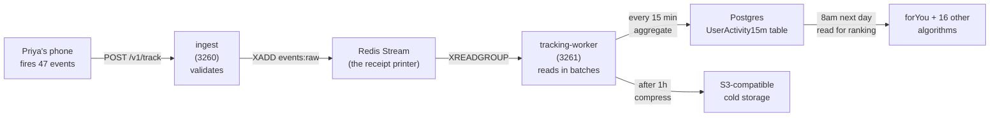

# Miamo — The Full Story

**TL;DR:** Miamo helps Indians find serious partners using behaviour signals (how you actually use the app), not just selfies.

---

## How to read this (pick your path)

**Non-technical readers:** Read everything except section 6 (data safety jargon). You'll understand the whole product, every screen Priya sees, and why we built it this way.

**Engineers:** Read everything. Pay special attention to sections 4 (algorithms worked example) and 5 (tracking pipeline) for technical depth.

**Product managers:** Read everything. Section 3 (what makes us different) is your battlecard.

---

## 1. Why Miamo exists

It's 9:02pm on a Tuesday. Priya (28, Mumbai, trekker, vegetarian) opens her dating app. She sees 47 profiles in an hour. She swipes through them in a blur. Two of them match—one never replies, the other sends "hey wyd 😏". By 11pm she closes the app frustrated.

Meanwhile, there are 150 million single Indians using dating apps. Current apps optimize for **swipes**—the more you swipe, the longer you stay, the more ads we can show you. They're engineered to be addictive, not to create relationships.

Miamo is different. We optimize for **matches that become conversations, conversations that become dates, dates that become relationships**. We measure what Priya actually does (how long she looks at someone, whether she reads their bio, whether she replies in chat). We use that to suggest matches she'll genuinely like, not just profiles that generate swipes.

We believe the 1% of users who find serious partners and stay are more valuable than the 99% who swipe forever.

---

## 2. The surfaces Priya sees

| Surface | What Priya does | What we measure |
|---------|---|---|
| **Login** | Email + password | Nothing yet. |
| **Onboarding** | Answers 12 quick questions ("What are you looking for?", "What's your ideal Sunday?") | Priya's stated intent + vibe + personality. |
| **Discover** | Swipes through a stack of profiles | How long she looks at each, whether she reads full bio, swipe pattern. |
| **Matches** | Sees the list of people who liked her back | Whether she opens them. |
| **Chat** | Types and sends messages | How fast she replies, how long messages are, emoji use. |
| **Feed** | Scrolls posts from people she's interested in | What she stops to read, what she ignores. |
| **AI Picks** | Gets one "we think you'll click" daily | Whether she acts on it. |
| **Beats** | Sees if she and a match like the same songs | (Creates connection moment; separate algorithm). |
| **Notifications** | Gets a bell with "Arjun sent a message" at the right time | Whether she clicks it. |

Every surface feeds signals back to our algorithms. Priya gets better matches, so she swipes less but acts more.

---

## 3. What makes Miamo different

**Current apps** (Tinder, Bumble, Hinge): show random or location-based profiles, optimized for engagement (more swipes = more ad revenue).

**Miamo:**
- **Behaviour-based matching:** We watch what Priya actually does, not just what her profile says. Someone who replies in chat is fundamentally different from someone who ghosts. We optimize for that.
- **Serious intent by default:** We measure whether Priya is looking for a 1-night stand or a life partner. We don't show her casual-intent profiles.
- **Deep compatibility (DTM):** We have a separate daily match that goes deep—not just "you both like hiking", but "you're both early risers, both vegetarians, both want kids in 3 years". That one match gets a curated, longer-form presentation.
- **Privacy-first:** Priya's data is hashed (fingerprinted) so we can use it to rank matches without storing her raw identity. Chat is encrypted so even our DBAs can't read it.
- **India-first:** Built for Indian dating culture. Serious intent is the norm, not the exception. We support Indian payment methods and timezones.

---

## 4. How the app works: the 17 algorithms that rank matches

Priya opens Discover. She sees 10 profiles in order. That order is not random—**17 small algorithms scored 200 candidates in 40ms and returned the top 10**.

Here's a real worked example:

### 4.1 The input: Priya's signals

From Priya's behaviour over the past week:
- **Interests:** hiking, photography, food, reading (tags)
- **Vibe:** creative, adventurous, thoughtful (from onboarding answers)
- **Activity:** 23 swipes, 4 matches, 3 messages sent (engagement)
- **Chronotype:** early riser (opens app 6-8am, scrolls evenings less)
- **Verification:** photo + phone verified (trust signal)

### 4.2 Scoring Arjun against Priya

The main algorithm is `forYou`. It reads Priya's signals and scores Arjun:

- **Interests overlap (Arjun also likes photography + hiking):** 0.82 / 1.0
- **Vibe match (he scored adventurous too):** 0.71 / 1.0
- **Behaviour similarity (he replies fast in chat):** 0.68 / 1.0
- **Chronotype match (he's also a morning person):** 0.85 / 1.0
- **Verified (yes):** 1.0 / 1.0
- **Distance (3km away, OK):** 0.90 / 1.0
- **Age difference (2 years, OK):** 0.88 / 1.0

### 4.3 The math: weighted sum

The formula weights each signal:

```
score = 0.25·interests + 0.20·vibe + 0.20·behaviour + 0.10·chrono
      + 0.05·verified + 0.10·distance + 0.10·age
      
score = 0.25·0.82 + 0.20·0.71 + 0.20·0.68 + 0.10·0.85
      + 0.05·1.0 + 0.10·0.90 + 0.10·0.88
      
score = 0.205 + 0.142 + 0.136 + 0.085
      + 0.050 + 0.090 + 0.088
      
score = 0.796 (out of 1.0, or 79.6 out of 100)
```

Arjun scores **80 out of 100**. We do this for 200 other candidates, sort by score, and show Priya the top 10. Arjun lands at **position 3**.

(This is a simplified example; the real algorithm has more inputs, includes fatigue penalty, and uses cosine similarity on embedding vectors. See [docs/ALGORITHMS.md](docs/ALGORITHMS.md) for full math on all 17.)

### 4.4 The 17 algorithms at a glance

| # | Name | Powers | What it decides |
|---|---|---|---|
| 1 | `forYou` | Discover | Main compatibility score for pairwise ranking |
| 2 | `aiPicks` | AI Picks daily | Today's single highest-confidence match |
| 3 | `aiMatch` | Match suggestions | "Would they swipe right on each other?" |
| 4 | `new` | Discover boost | New-joiner visibility boost (48h) |
| 5 | `active` | Discover boost | Online-now people surface first |
| 6 | `verified` | Discover boost | Verified profiles get +0.05 boost |
| 7 | `serious` | Discover filter | Intent score—filters casual swipes |
| 8 | `cf` | Discover signal | Collaborative filter: "people like Priya also liked…" |
| 9 | `dtm` | DTM daily match | Deep-compat curated daily match |
| 10 | `moves` | Chat suggestions | Reward reciprocity—Priya's like-back ratio |
| 11 | `messageSuggest` | Chat | Suggest a great opener line |
| 12 | `beats` | Beats music-match | Detect vibe matches by song taste |
| 13 | `notifyTiming` | Notifications | Exact minute Priya is most likely to open |
| 14 | `searchAugment` | Search | Reorder results by compatibility |
| 15 | `feedAugment` | Feed | Surface meaningful posts |
| 16 | `postImpressionRerank` | Feed | Demote posts she scrolled past |
| 17 | `registry` | Admin | List all enabled algos + their flags |

Every algorithm can be toggled with a flag (environment variable) without redeploying code. Flip `ALGO_V4_RANK_ENABLED_DISCOVER=0` and Discover stops using the fancy algorithm for 5 minutes while you test.

---

## 5. How Priya's clicks become signals: the tracking pipeline

Priya swipes for 30 seconds. Her browser fires 47 tracking events:

```
21:02:14 session_start
21:02:15 impression (saw Arjun)
21:02:18 card_open (tapped his profile) + dwell 3s
21:02:24 photo_view × 4
21:02:31 like (tapped heart)
21:02:32 match_shown
21:02:40 chat_open
21:02:44 compose_start
```

Here's what happens to those 47 events:



**15-minute rollup:**  
Those 47 raw events become 1 aggregated row:

```json
{
  "userHash": "a8f1c7b2…",
  "bucket": "2026-05-27T21:00:00Z",
  "impressions": 12,
  "opens": 4,
  "likes": 1,
  "chats": 1,
  "messages_sent": 0,
  "engagementScore": 0.31
}
```

Across 50,000 active users at 9pm, 3.1M raw events compress to ~50k aggregated rows. That's **17,000× compression**—what lets us keep everything in Postgres without the database melting.

The algorithms read these rows next morning: "How active was Priya yesterday? Did she engage with matches? Is she serious?" And they use that to update her ranking signals.

---

## 6. How we keep Priya's data safe

**Password:** Hashed with bcryptjs (cost 12). We can never read it. A hacker stealing our database can't log in as Priya.

**Chat messages:** Encrypted with AES-256-GCM (a locked diary). Each message gets a random key. Even our DBAs with Postgres access can't read her conversations.

**User ID in tracking:** Hashed with HMAC-SHA256 (a tamper-proof wax seal). We can compare hashes to know it's Priya's activity, but we can't reverse-engineer her ID. A hacker stealing the tracking tables can't figure out who anyone is.

**Session token (JWT):** Issued at login with a 15-minute expiry (a wristband with an expiry date). Can't be forged. If stolen, it works for only 15 minutes.

**"Right-to-be-forgotten" (RTBF):** Priya can ask us to shred her file. We delete her Postgres rows and flag her tracking hash as "do not use". She's gone.

---

## 7. What's on the roadmap (what we've actually shipped)

✓ **Discover:** swipe stack ranked by forYou algorithm  
✓ **Matches:** see who liked you back  
✓ **Encrypted chat:** 1-to-1 messaging with AES-256-GCM  
✓ **AI Picks:** daily curated match  
✓ **Deep-Compat (DTM):** curated daily match with deeper compatibility signals  
✓ **Feed:** posts from people you're interested in  
✓ **Beats:** music-taste matching  
✓ **Notifications:** smart timing (knows when Priya opens the app)  
✓ **Vibe Check:** onboarding questionnaire about personality  
✓ **Verification:** photo + phone verification for trust signals  

---

## 8. What Priya feels

Priya opens Miamo and sees Arjun. She taps his profile. She reads his bio. She looks at 4 photos. She reads messages in his chat. She realizes he's a photographer too. They match. She sends "Your mountain photos are stunning—where were these taken?" He replies "Sikkim, last monsoon! You trek too?" Two hours later they're comparing trip photos. By Friday they're planning a video call.

That moment—the realization, the shared passion, the natural conversation starter—is what Miamo is for. Not swipes. Matches that matter.

---

## 9. License

Proprietary. Do not redistribute.
