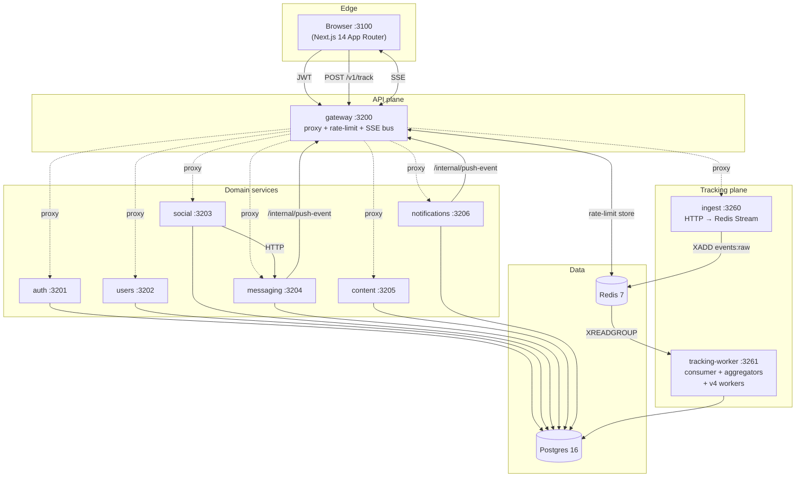
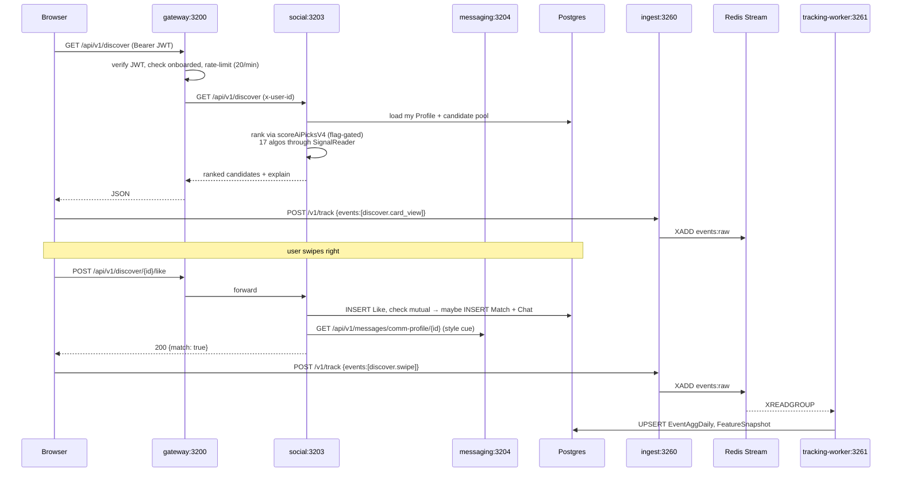
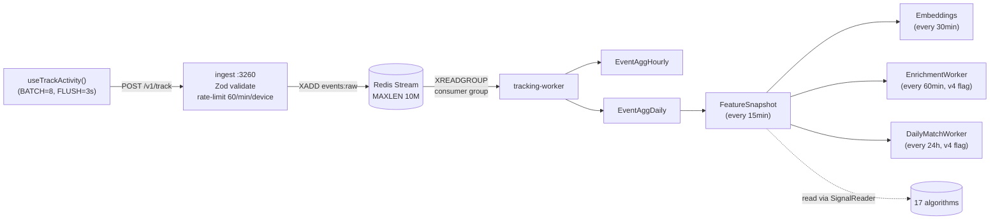

# MIAMO — The Single Document

> The file you read on a plane to understand the entire system. Everything that is not in here is a drill-down in [docs/](docs/) or [services/&lt;name&gt;/README.md](services/).

---

## 1. Product in one page

Miamo is two products in one codebase:

1. **Casual dating** — Discover-style swiping, matches, chats, voice "beats", short-form video, creativity feed.
2. **Date-to-Marry (DTM)** — A serious-intent matrimonial surface with bio-data, family/horoscope fields, access requests, and deep compatibility scoring.

Both share the same identity, the same tracking pipeline, and the same v4 ranking system. A single profile flag (`Profile.seriousMode`) routes the user between visual modes (rose-copper for casual, marigold for DTM).

### Surfaces the user sees

| Surface | Route | What it does |
|---|---|---|
| Discover | `/discover` | Swipe through ranked profile cards. Like / pass / Miamo Move. |
| Matches | `/matches` | Mutual likes, pinned/favorites, incoming likes inbox. |
| Messages | `/messages` | End-to-end (server-side) AES-256-GCM chats with reactions and smart suggestions. |
| Beats | `/beats` | Audio streak game between matched users. |
| Feed | `/feed` | Long-form posts from matches and following. |
| Stories | `/stories` | 7-day ephemeral content with view tracking. |
| Creativity | `/creativity` | Categorised user-generated art / poetry / music / fitness. |
| AI Match | `/ai-match` | One curated daily pick computed by `DailyMatchWorker`. |
| Compatibility | `/compatibility` | 16-dimension deep compat report (`dtmCompatibility`). |
| Love Language | `/love-language` | 5-language quiz; result feeds the `serious` ranker. |
| Vibe Check | `/vibe-check` | Mood + intent snapshot for the session. |
| Search | `/search` | Lexical + personalised re-rank (`searchAugment`). |
| Serious Mode | `/serious-mode` | DTM browsing surface with bio-data filters. |
| Profile / Settings / Safety / Premium | … | Standard self-service. |

---

## 2. System architecture



**Key boundaries**:

- **Browser ↔ Gateway**: the only ingress. Everything else is private.
- **Gateway → service**: HTTP proxy (`http-proxy-middleware`) with auth + onboarding gates injected as `x-user-id` / `x-internal-key` headers.
- **Service → service**: rare and explicit. Only `social → messaging` (for communication-style features) and any service → gateway (`/internal/push-event` for SSE fan-out).
- **Tracking is a side-channel**: events never block a user request. Browser → ingest → Redis Stream → worker → Postgres aggregates.

---

## 3. Request lifecycle — a worked example

**Scenario**: User opens Discover, sees a card, and swipes right.



**Latencies (measured locally)**:
- Discover read path: ~120ms p50 (cache warm), ~280ms p50 (cold).
- Like write path: ~45ms p50.
- Tracking is non-blocking from the user's perspective — `/v1/track` returns `204` in <15ms regardless of downstream.

---

## 4. The v4 algorithm system in plain English

There are **17 algorithms** living in [services/shared/src/algo/](services/shared/src/algo/). Each one:

1. Is a pure function: input plain numbers and vectors → output a score `0..100` and an `explain` map.
2. Reads data **only** through the `SignalReader` interface ([signals.ts](services/shared/src/algo/signals.ts)). No algorithm imports Prisma. That's how 17 algos earn 225 unit tests that run in ~1.2s with no database.
3. Self-registers with [registry.ts](services/shared/src/algo/registry.ts), so `/v4/status` on tracking-worker enumerates them at runtime.
4. Is gated by an env var per surface (`ALGO_V4_RANK_ENABLED_<SURFACE>`). Default off. Ramped independently.

### Tiny worked example — forYou

For user A scoring candidate B:

```ts
score = 100 * (
  0.25 * interestCos(A,B)   // hashed-tag cosine on Float32 LE vectors
+ 0.20 * vibeCos(A,B)        // mood/energy/intent overlap
+ 0.20 * behaviorCos(A,B)    // session-pattern embedding
+ 0.10 * chronoOverlap(A,B)  // peak-hour intersection
+ 0.10 * priorAffinity(A,B)  // capped log of past interactions
+ 0.05 * intentMatch(A,B)
+ 0.05 * distanceFit(A,B)
+ 0.05 * ageDeltaFit(A,B)
)
```

For A = `miamo3`, B = `miamo7` (seeded), all features in `[0,1]` and L2-normalised:

```
interestCos=0.62 vibeCos=0.48 behaviorCos=0.55 chrono=0.71
prior=0.10 intent=1.0 distance=0.80 age=0.92
→ score ≈ 100*(0.155+0.096+0.110+0.071+0.010+0.050+0.040+0.046) = 57.8
```

`aiPicks` then wraps `forYou` in an ensemble (30% forYou + 20% cf + 15% active + 10% serious + 10% explore + 10% match-history affinity + 5% vibe-momentum).

### The 17 algos at a glance

| Algo | Surface | Default weight headline |
|---|---|---|
| `forYou` | discover | core 8-factor pair score |
| `aiPicks` | discover | ensemble of 7 sub-scores |
| `aiMatch` | aiMatch | top-1 from aiPicks gated by score≥70 |
| `new` | discover | recency boost (40% recency / 30% forYou) |
| `active` | discover | reply-likelihood (35% liveness) |
| `verified` | discover | gated; 60% forYou + 25% id |
| `serious` | discover | intent-locked; 30% forYou + 25% DTM + 15% lovelang |
| `cf` | discover | item-item collaborative filtering |
| `dtm` | deepCompat | 16-dim topic cosine |
| `moves` | discover | Miamo Move opener picker |
| `messageSuggest` | messaging | smart-reply ranker |
| `beats` | beats | audio streak picker |
| `notifyTiming` | notifications | peak-hour scheduler |
| `searchAugment` | search | 55% lexical + 35% forYou + 10% freshness |
| `feedAugment` | feed | 50% source + 30% forYou + 20% recency |
| `postImpressionRerank` | discover | skipped-card fatigue penalty |
| _registry-only_ | — | the meta-algorithm `/v4/status` enumerates |

Full per-algo treatment in [docs/ALGORITHMS.md](docs/ALGORITHMS.md).

### Why deterministic ML-lite?

- **No GPU, no model server, no cold-start.** Every score is a closed-form composition of hashed-feature cosines and clamped scalars in TypeScript.
- **HMAC `uidHash`** (`TRACKING_HASH_SECRET`) lets us join behavioural data without storing raw user IDs in analytics tables.
- **Float32 little-endian** vectors are L2-normalised at write-time, so cosine = dot.
- **One file change** to swap the data backend (today Prisma, tomorrow a feature store) — the interface is `SignalReader`.

---

## 5. The tracking system in plain English

A single concept: **events are emitted by the browser, accepted by an edge service that does nothing but validate-and-stream, then chewed by a worker into a row-store the algorithms can read**.



### One event end-to-end

1. User opens Discover. `useTrackPageView('/discover')` queues `{action: 'page_view', targetType: 'page', metadata: {page: '/discover'}}`.
2. After 3s (or at 8 queued events) the browser POSTs to `/v1/track`.
3. Ingest validates the schema, rate-limits per-device, HMAC-hashes the uid, and `XADD events:raw` to Redis. Returns `204` in <15ms even if Redis is down (lossy at edge by design).
4. Tracking-worker `XREADGROUP`s in batches of up to 10k or every 30s. Aggregates into `EventAggHourly` and `EventAggDaily`.
5. The 15-min `FeatureAggregator` rolls daily counts into `FeatureSnapshot.raw` JSONB — peak hours, chronotype, reply rate, interest vector, vibe embedding.
6. `PrismaSignalReader.features(uidHash)` hits a 60s LRU cache + the snapshot table. Algorithms read this and never touch raw events.

Privacy: only `uidHash` (HMAC-SHA256 → base64url[:22]) lives in tracking tables. Consent is checked in the browser SDK and gated by `Do-Not-Track` and the global `TRACKING_KILL` env var.

Full taxonomy and event list in [docs/TRACKING.md](docs/TRACKING.md).

---

## 6. DevOps lifecycle

Three deploy modes, one source of truth:

| Mode | Command | Surface |
|---|---|---|
| Bare-metal local | `npm start` | Node processes on host, Postgres+Redis in docker. |
| Docker-compose | `npm run docker:up` | Full stack in one network, `--build` rebuilds. |
| Kubernetes | `npm run k8s:{dev,staging,prod}` | Applies `k8s/templates/*.yaml` with placeholders from `configuration/<env>/values.yaml`. |

Migrations are owned by [services/shared/prisma/](services/shared/prisma/) (multi-service monorepo pattern) and applied by the `migrate` compose service or the `migrate-job.yaml` K8s Job. The script [docker/migrate-and-seed.sh](docker/migrate-and-seed.sh) is idempotent: it always `prisma migrate deploy` and only seeds if `User` is empty.

Workloads in production:

- 3× gateway (HPA 70% CPU / 80% mem, scale up +2/60s, down −1/120s)
- 3× each domain service
- 2× ingest (`tier: edge`)
- 1× tracking-worker (`tier: worker`, single-replica to avoid double-aggregation)
- StatefulSets for Postgres (10Gi PVC) and Redis (2Gi PVC)
- PDB `minAvailable: 1` everywhere
- NetworkPolicy `default-deny` namespace-wide; only gateway + web have ingress from the world

Full deploy / rollback / scale playbook in [docs/DEVOPS.md](docs/DEVOPS.md).

---

## 7. Security & privacy posture

- **JWT HS256** for users (`JWT_SECRET`, 15-min access + 30-day refresh). Gateway validates format (cheap regex) before `jwt.verify`, rejects auth headers >2KB.
- **Internal service auth** via `INTERNAL_SERVICE_KEY` header (`openssl rand -hex 32`).
- **Message encryption**: AES-256-GCM with **per-message random IV** + authTag (`enc:<iv>:<tag>:<ciphertext>`). Plaintext fallback only for legacy/system messages.
- **Tracking pseudonymisation**: HMAC-SHA256(uid, `TRACKING_HASH_SECRET`) → base64url, truncated to 22 chars. Never rotate this secret — it breaks joins to historical aggregates.
- **Consent**: client-side banner + persisted state; backend honours `Do-Not-Track: 1`; emergency kill via `TRACKING_KILL=1`.
- **Rate limits** (gateway, distributed via Redis): global 5000/15min, auth 30/15min, forgot-password 5/h, refresh 60/15min, discover/search 20/min, feed 60/min, report 30/24h.
- **Helmet** strict CSP (no inline scripts, `base-uri none`). **CORS** allowlist; dev-only `CORS_BYPASS`.
- **Sanitisation** ([sanitize.ts](services/shared/src/sanitize.ts)) strips HTML, `javascript:`/`data:`/event-handlers, null bytes; recursive (max depth 5) for object inputs.
- **Headers**: Next.js sets HSTS, X-Frame-Options DENY, X-Content-Type-Options, Permissions-Policy `camera=() microphone=() geolocation=()`.

Full mapping to OWASP Top 10 in [docs/SECURITY.md](docs/SECURITY.md).

---

## 8. Glossary

| Term | Meaning |
|---|---|
| DTM | Date-to-Marry — the matrimonial surface (serious intent). |
| Beat | A streak game played in voice/photo snippets between matched users. |
| Miamo Move | A structured opener message (compliment, question, beat, gif) sent before a match. |
| Vibe Check | A self-reported mood/energy/intent snapshot used by the `forYou` and `aiPicks` rankers. |
| `uidHash` | HMAC-SHA256 of the user ID with `TRACKING_HASH_SECRET`, base64url[:22]. Used to join behavioural data without storing raw IDs. |
| `SignalReader` | The only interface algorithms use to read user/pair data. PrismaSignalReader in prod, FakeSignalReader in tests. |
| `FeatureSnapshot` | A row per `uidHash` containing rolled-up features (peak hours, chronotype, interest vec, vibe emb). Written every 15min by tracking-worker. |
| `PairCompatCache` | Per-(A,B) cached compatibility row (`interestCos`, `vibeCos`, `magnetCos`, `finalScore`) used by `forYou`. |
| Surface | A user-facing area the v4 system ranks (discover / messaging / beats / notifications / search / feed / aiMatch / deepCompat). |
| Flag | An env var of the form `ALGO_V4_RANK_ENABLED_<SURFACE>` (`'0'` or `'1'`) controlling whether that surface uses the v4 path. |
| Onboarding completion | `Profile.completionScore` 0..100. Gateway blocks main routes if below threshold (60 casual, 75 DTM). |
| Idempotency-Key | Header (8–128 chars alnum) on sensitive POSTs; Redis `SET NX EX 86400` dedupes. |

---

## 9. What changed & why it's good

- **Before:** Ranking was scattered across `services/social/src/server.ts` with inline Prisma queries, no per-surface flags, no unit tests, and a hard dependency on a live DB to exercise any ranker.
- **After:** 17 deterministic algorithms in `services/shared/src/algo/*` behind the `SignalReader` interface, self-registered, flag-gated per surface, with 225 unit tests that run in ~1.2s. Two background workers (`EnrichmentWorker`, `DailyMatchWorker`) keep features warm. A `/v4/status` endpoint on `tracking-worker` enumerates the live algo inventory and current flag values.
- **Why it matters:**
  1. **Safe rollout** — every surface can be enabled (or killed) independently with a one-line env change; no deploy needed.
  2. **Auditable** — every score returns an `explain` map, so support can answer "why did I see this card?" without firing up a debugger.
  3. **Cheap to evolve** — adding an algorithm is one file + one test; swapping the data backend is one class.
  4. **Privacy by construction** — tracking and ranking only ever see `uidHash`; raw IDs never leave the OLTP plane.
