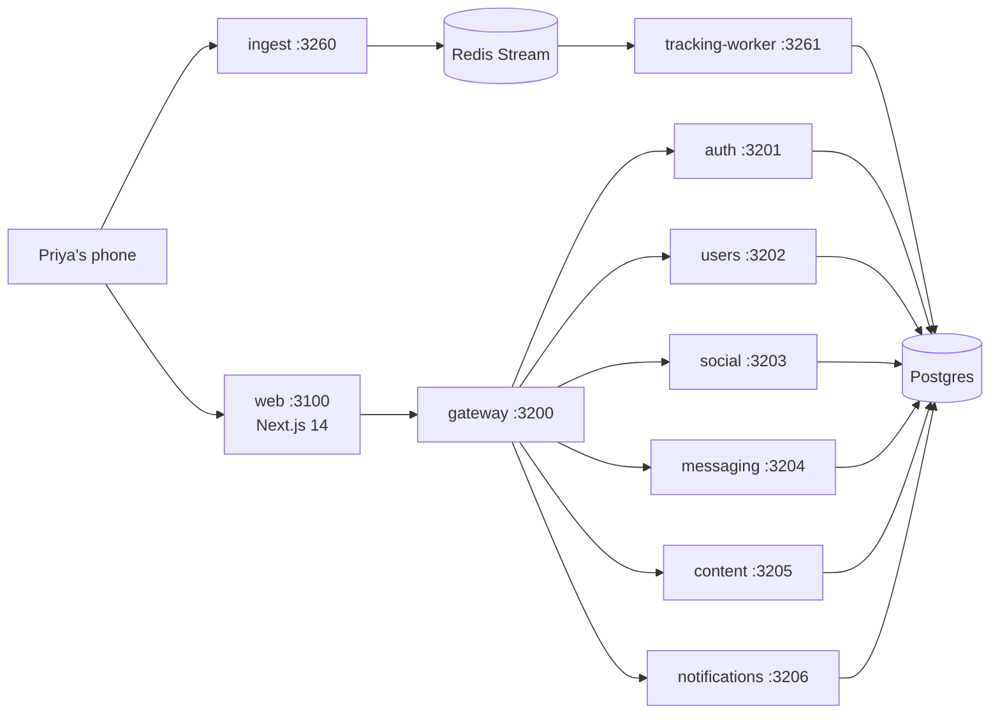

# Miamo

> A dating app that helps the right people meet — fast, safely, fairly.
> This file is your 2-minute orientation. For the full story read [MIAMO.md](MIAMO.md).

It's 9pm. Priya in Mumbai taps "Like" on Arjun in Bangalore. Two
seconds later his phone buzzes: *"You have a new match."* That moment
is what this repo exists to make possible — at peak traffic, for a
million Priyas, without leaking her data or running up the bill.

---

## Quickstart (5 minutes, one command)

```bash
git clone https://github.com/shashisingh007/Miamo.git
cd Miamo
cp .env.example .env          # fill in real secrets
docker compose up
```

- Web app: <http://localhost:3100>
- API gateway: <http://localhost:3200>
- Demo login: `demo@miamo.app` / `demo1234` (seeded by
  [scripts/seed-dtm.js](scripts/seed-dtm.js))

---

## What's in this repo



10 boxes. 1 database. 1 Redis. That's the entire system.

---

## Where do I read next?

| If you are…                          | Read                                              |
|--------------------------------------|---------------------------------------------------|
| A non-tech person who wants it all   | [MIAMO.md](MIAMO.md) — the book, ~300 lines       |
| A new engineer joining the team      | [MIAMO.md](MIAMO.md) then [docs/ARCHITECTURE.md](docs/ARCHITECTURE.md) |
| Curious about how Discover ranks     | [docs/ALGORITHMS.md](docs/ALGORITHMS.md)          |
| Working on tracking / analytics      | [docs/TRACKING.md](docs/TRACKING.md)              |
| A frontend dev                       | [docs/FRONTEND.md](docs/FRONTEND.md)              |
| A devops / SRE                       | [docs/DEVOPS.md](docs/DEVOPS.md) + [docs/RUNBOOK.md](docs/RUNBOOK.md) |
| Doing a security review              | [docs/SECURITY.md](docs/SECURITY.md)              |
| Touching one specific service        | `services/<name>/README.md` (every service has one)|

---

## Repository layout

```
Miamo/
├── README.md               ← you are here
├── MIAMO.md                ← the full book
├── docker-compose.yml      ← one-command local stack
├── docs/                   ← cross-cutting deep dives
│   ├── ARCHITECTURE.md
│   ├── ALGORITHMS.md
│   ├── TRACKING.md
│   ├── FRONTEND.md
│   ├── DEVOPS.md
│   ├── SECURITY.md
│   ├── RUNBOOK.md
│   └── DOCUMENTATION_PROMPT.md
├── k8s/                    ← Kubernetes manifests (prod + staging)
├── scripts/                ← seed, migrate, test helpers
└── services/               ← one folder per service, each with its own README
    ├── web/                ← Next.js 14 frontend  (port 3100)
    ├── gateway/            ← API gateway          (port 3200)
    ├── auth/               ← login / signup       (port 3201)
    ├── users/              ← profile / settings   (port 3202)
    ├── social/             ← discover / matches   (port 3203)
    ├── messaging/          ← encrypted chats      (port 3204)
    ├── content/            ← feed / stories       (port 3205)
    ├── notifications/      ← bell / push          (port 3206)
    ├── ingest/             ← tracking edge        (port 3260)
    ├── tracking-worker/    ← stream consumer      (port 3261)
    └── shared/             ← Prisma schema + 17 algorithms (library)
```

---

## Running tests

```bash
# algorithm tests (fast, no I/O) — 225 tests in ~1.2s
cd services/shared && npm test

# integration smoke test
./scripts/api-test.sh
```

---

## Conventions

- **TypeScript** everywhere except shell scripts.
- **Prisma** for all database access — no raw SQL outside migrations.
- **Zod** validates every request body at the service boundary.
- **No emoji in code, comments, or commit messages.**
- **Forward-only DB migrations.** Backwards-incompatible changes ship
  in three phases (add nullable → backfill → drop old).

---

## License

Proprietary. Do not redistribute.
