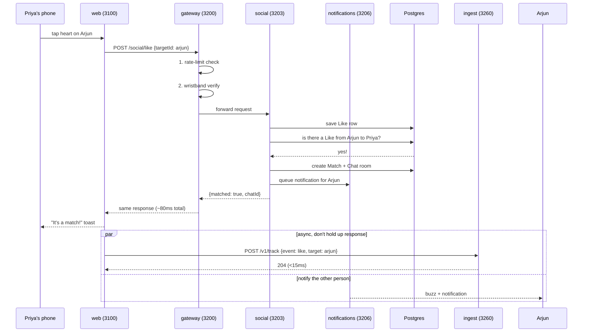

# Miamo

**TL;DR:** Miamo is a serious-dating app for India that uses behaviour-based signals (how you actually use the app) instead of just photos to suggest matches.

---

## How to read this (pick your path)

**If you're not technical** (parent, designer, PM): Read "What Miamo is" + "The 11 services" + "Local quickstart". You'll understand the whole story. Skip the Docker sections.

**If you write code** (backend dev, DevOps): Read everything. Start with "Local quickstart", then dive into `docs/ARCHITECTURE.md` for the technical deep dive.

**If you manage the product** (founder, PM): Read "What Miamo is" + "The 11 services", then read [MIAMO.md](MIAMO.md) for the full business story and Priya's experience.

---

## What Miamo is, in plain English

Imagine explaining dating apps to your mom. You'd say: "It shows you photos of people nearby who want to meet someone serious. You like them, they like you back, you chat."

That's Miamo. But we add one huge difference: **we measure what you actually do in the app**, not just your profile. We watch how long you look at someone's photos, whether you read their bio, how fast you reply in chat, whether you go on dates. Then we use that behaviour to suggest better matches.

It's India-first (built for how Indians date, with Indian rupees, Indian time zones, proper sorting of Indian names). And it's "serious intent" by default—optimizing for real relationships, not infinite swipes.

---

## The 11 services that run behind the scenes

| Service | What it does | Port | Read more |
|---------|-------------|------|-----------|
| **web** | Everything Priya sees on her phone | 3100 | `docs/FRONTEND.md` |
| **gateway** | The receptionist—every request goes through here (rate-limit + wristband check) | 3200 | — |
| **auth** | Login, signup, password reset, issues wristbands | 3201 | `services/auth/README.md` |
| **users** | Profile, settings, search, bookmarks, blocks | 3202 | `services/users/README.md` |
| **social** | Discover (the swipe stack), your matches, AI suggestions | 3203 | `services/social/README.md` |
| **messaging** | Encrypted 1-to-1 chats (locked diary—only you and them read it) | 3204 | `services/messaging/README.md` |
| **content** | Feed, stories, videos | 3205 | `services/content/README.md` |
| **notifications** | Smart push notifications (the bell) | 3206 | `services/notifications/README.md` |
| **ingest** | Where your clicks land (very fast: <15ms) | 3260 | `services/ingest/README.md` |
| **tracking-worker** | Reads your clicks and learns what you like | 3261 | `services/tracking-worker/README.md` |
| **shared** | Shared library: database schema + 53 algorithm modules (17 ranked, the rest are V6/V7 helpers like `dtmFeedV7`, `batchLadder`, `moveVoice`, `rightNow`, `surfaceLearner`) | (no port) | `services/shared/README.md` |

> **Owner-friendly walkthrough:** if you want one document that explains everything Miamo records, learns, and decides — including how a *Miamo Move* is chosen — read [docs/OWNER_GUIDE.md](docs/OWNER_GUIDE.md).

---

## How one "Like" actually works

It's 9:02pm. Priya sees Arjun. She taps the heart.



**What Priya feels waiting:** ~120ms (heart turns red instantly, network confirms it)

**What happened in 80ms:**
1. Gateway checked: is this request from too many places (rate-limit check on Redis)? Is her wristband real (JWT token)?
2. Social saved the Like to Postgres.
3. Social checked: did Arjun already like her? **Yes—match!**
4. Social created a Chat room.
5. Notifications queued a push for Arjun.
6. Returned `{matched: true}` to the phone.

(Separately and asynchronously: ingest recorded the tracking event, which tracking-worker will later process and use to learn Priya's preferences.)

---

## Local quickstart (5 minutes)

```bash
# Clone
git clone https://github.com/shashisingh007/Miamo.git
cd Miamo

# Copy secrets file
cp .env.example .env
# Fill in real secrets, or use defaults for local testing

# Start Postgres, Redis, and all 11 services
docker compose up
```

- **Web app:** <http://localhost:3100>
- **API:** <http://localhost:3200>
- **Demo login:** `demo@miamo.app` / `demo1234`

---

## Repo layout

```
Miamo/
├── README.md                           ← you are here
├── MIAMO.md                            ← the full story
├── docker-compose.yml                  ← start everything in one command
├── package.json                        ← monorepo: 11 services + shared lib
│
├── docker/                             ← 8 Dockerfiles
│   └── migrate-and-seed.sh
├── docs/                               ← deep dives
│   ├── OWNER_GUIDE.md                  ← owner-friendly walkthrough
│   ├── ARCHITECTURE.md
│   ├── ALGORITHMS.md                   ← ranking algorithms (17 ranked + V7)
│   ├── TRACKING.md                     ← how clicks become signals
│   ├── MIAMO_MOVE.md                   ← Move composer deep dive
│   ├── FRONTEND.md
│   ├── DEVOPS.md
│   ├── SECURITY.md
│   ├── RUNBOOK.md
│   └── DOCUMENTATION_PROMPT.md         ← style guide
│
├── k8s/                                ← Kubernetes for production
├── scripts/                            ← seed, migrate, test, verify
└── services/                           ← 11 services
    ├── web/                            ← Next.js 14
    ├── gateway/                        ← API gateway
    ├── auth/                           ← login/signup
    ├── users/                          ← profile/settings
    ├── social/                         ← discover/matches
    ├── messaging/                      ← chats
    ├── content/                        ← feed
    ├── notifications/                  ← push notifications
    ├── ingest/                         ← tracking edge
    ├── tracking-worker/                ← event processor
    └── shared/                         ← library
        ├── prisma/schema.prisma        ← 80+ database models
        └── src/algo/                   ← 17 ranking algorithms
```

---

## Where to read next

| For… | Read | Time |
|---|---|---|
| Full product story (why Miamo exists, all the screens Priya sees) | [MIAMO.md](MIAMO.md) | 15 min |
| How the 11 services talk to each other | [docs/ARCHITECTURE.md](docs/ARCHITECTURE.md) | 15 min |
| How we rank matches (17 algorithms explained plainly) | [docs/ALGORITHMS.md](docs/ALGORITHMS.md) | 20 min |
| How your clicks become ranking signals | [docs/TRACKING.md](docs/TRACKING.md) | 15 min |
| How to deploy to production | [docs/DEVOPS.md](docs/DEVOPS.md) + [docs/RUNBOOK.md](docs/RUNBOOK.md) | 20 min |
| Chat encryption and data privacy | [docs/SECURITY.md](docs/SECURITY.md) | 15 min |
| Next.js frontend architecture | [docs/FRONTEND.md](docs/FRONTEND.md) | 15 min |
| One specific service | `services/<name>/README.md` | 10 min |

---

## Running tests

```bash
# Algorithm tests (225 tests, pure functions, ~1.2s)
cd services/shared && npm test

# API smoke test
./scripts/api-test.sh
```

---

## Conventions

- **Language:** TypeScript (except shell scripts).
- **Database:** Prisma only—no raw SQL outside migrations.
- **Validation:** Zod on every endpoint.
- **Migrations:** Forward-only. To change something backwards-incompatibly: (1) add nullable column, (2) backfill, (3) drop old column.

---

## License

Proprietary.
