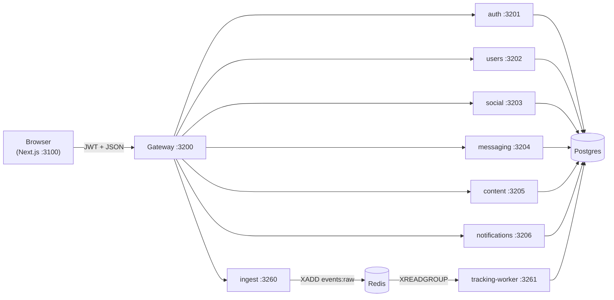

# Miamo

A premium dating + matrimonial platform built as a polyglot monorepo: a Next.js 14 web client on top of nine Express microservices, a Postgres + Redis data plane, and a deterministic ML-lite v4 ranking system that is fully flag-gated and ships with zero external ML dependencies.

## The 10-second mental model



## Quickstart

```bash
# 1. Prereqs (Node 20, Docker, openssl)
bash scripts/setup.sh

# 2. Start Postgres + Redis + all services in docker-compose
npm run docker:up

# 3. Or run locally (services in background, web in foreground)
npm start

# 4. Open the app
open http://localhost:3100
```

Demo accounts: `miamo1` … `miamo20` (password = username). Seeded by [services/shared/prisma/seed.ts](services/shared/prisma/seed.ts).

## Where to read next

| You want to… | Read |
|---|---|
| Understand the whole system in one sitting | [MIAMO.md](MIAMO.md) |
| Understand boundaries, ownership, sync vs async | [docs/ARCHITECTURE.md](docs/ARCHITECTURE.md) |
| Understand the Next.js frontend | [docs/FRONTEND.md](docs/FRONTEND.md) |
| Understand the v4 ranking system (17 algos) | [docs/ALGORITHMS.md](docs/ALGORITHMS.md) |
| Understand event tracking end-to-end | [docs/TRACKING.md](docs/TRACKING.md) |
| Deploy, migrate, scale | [docs/DEVOPS.md](docs/DEVOPS.md) |
| Audit JWT / encryption / consent | [docs/SECURITY.md](docs/SECURITY.md) |
| Diagnose an incident | [docs/RUNBOOK.md](docs/RUNBOOK.md) |
| Dig into one service | [services/](services/) → each has its own README |
| Regenerate every doc from scratch | [docs/DOCUMENTATION_PROMPT.md](docs/DOCUMENTATION_PROMPT.md) |

## Repo layout

```
.                            # workspace root
├── README.md                # this file
├── MIAMO.md                 # single-doc system overview
├── CHANGELOG.md
├── docker-compose.yml       # local + CI dev plane
├── package.json             # workspace scripts (npm start, test, k8s:*)
├── vitest.config.ts         # excludes services/web; 29 test files
├── assets/                  # marketing/static
├── configuration/           # env-layered values (dev/staging/prod) + pg/redis conf
├── docker/                  # per-service Dockerfiles + migrate-and-seed.sh
├── docs/                    # cross-cutting deep dives
├── k8s/templates/           # placeholder-templated manifests
├── scripts/                 # setup, start, db-check, test-*.py, codemods
├── services/
│   ├── auth/                # JWT issuance, sessions, password
│   ├── gateway/             # API router + rate-limit + SSE bus
│   ├── users/               # profile, settings, search, bookmarks
│   ├── social/              # discover, matches, likes, vibe-check, safety
│   ├── messaging/           # chats (AES-256-GCM), beats, suggestions
│   ├── content/             # feed, stories, videos, creativity
│   ├── notifications/       # in-app + scheduled push
│   ├── ingest/              # tracking edge (Redis Stream writer)
│   ├── tracking-worker/     # stream consumer + aggregators + v4 workers
│   ├── shared/              # Prisma schema, algos, middleware
│   └── web/                 # Next.js 14 App Router
└── tests/                   # algo end-to-end suites
```

## Status

Branch `main` carries the v4 algorithm rollout (Phases A–K). Tag `v4` marks the release. 225 algo tests pass; every v4 surface is flag-gated and defaults off.

## License

Proprietary. All rights reserved.
