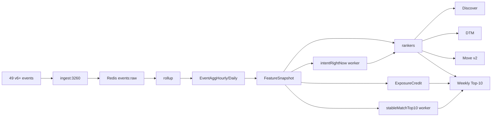

# Algorithms — the complete reference (v3.6.0)

**Audience:** anyone, technical or not. The format is strict pair-write — every algorithm gets a Priya-narrated paragraph first, then a technical paragraph with the actual math.

**Inventory:** 17 V4 ranked rankers + 5 V7 modules + 17 V8 modules + 4 DTM support modules + 4 learner modules + 5 misc support modules + 4 v3.6.0 worker jobs. Plus a closing "How to add a new algorithm" recipe.

**Sources cited inline:** `docs/architecture/v3.6-overhaul-design.md` (DD), and the actual TypeScript files under `services/shared/src/algo/`.

**Conventions you'll see throughout:**

- The four people who walk through every worked example:
  - **Priya** — 28, Mumbai, hiker, photographer. The default viewer.
  - **Arjun** — 29, Bangalore, photographer. The default candidate.
  - **Karan** — 32, Delhi, premium. Heavy chat user, anti-ghost penaliser.
  - **Riya** — 26, Bangalore. Receiver. The person on the other side of Karan's messages.
- Every weight has a `// because:` clause attached. If you change a weight, change the rationale.
- `clip01(x) = max(0, min(1, x))`. `clip100(x) = max(0, min(100, x))`.
- `expDecay(x, halfLife) = 0.5 ^ (x / halfLife)`.
- `logScale(x, max) = log(1 + x) / log(1 + max)`.
- `cosTo01(c) = (c + 1) / 2` (cosine in [-1,1] mapped to [0,1]).
- **Fatigue** is universal: `fatigue = 2 * log1p(impressions48h)`, subtracted before `clip100`.
- **Stable jitter** = a deterministic small noise from `hash(viewerId, candidateId, 5min_window)`, never `Math.random()`. Lets the top-K reshuffle within a session without changing the set.
- **Compose pattern:** every ranker builds a `breakdown` (entries may be `null`) + fixed-sum `weights`, then `compose()` renormalises over present entries. This is the cold-start contract — a ranker with half its signals missing still returns a sane number.

---

## Table of contents

1. **The 17 V4 ranked algorithms** — forYou, forYouV6, aiPicks, aiMatch, new, active, verified, serious, cf, dtm, dtmV6, moves, messageSuggest, beats, notifyTiming, searchAugment, feedAugment, postImpressionRerank
2. **The 5 V7 modules** — batchLadder, dtmFeedV7, moveVoice, rightNow, surfaceLearner
3. **The 17 V8 modules** (the v3.6.0 overhaul):
   - **A. Right-now foundation** — intentRightNow, moodRightNow, polarity, depthOfEngagement
   - **B. Earned visibility** — exposureCredits, galeShapley, fairnessRerank, multiObjective, festivalHooks
   - **C. Move v2** — senderVoice, receiverResonance, hookLibrary, codeMix, composer
   - **D. DTM safeguards** — dtmTopicMask, dtmBatch, antiGhost
4. **DTM support** — dtmTopics, dtmAnswerHistory, dtmColdStart, dtmExplain
5. **The learner stack** — learner, learnerRewards, contextAwareRewards, preferenceSnapshot
6. **Misc support** — discoverPolicy, moveProfile, pairCompatV6, explain
7. **Worker jobs the algorithms depend on** — intentInference, exposureScheduler, stableMatchTop10, fairnessAudit
8. **How to add a new algorithm** — the 5-step recipe

---

# Part 1 — The 17 V4 ranked algorithms

These are the rankers that decide what Priya sees on every surface. They all live in `services/shared/src/algo/`. They share the compose pattern and the universal fatigue penalty.

---

## 1.1 `forYou.ts` — the Discover canonical ranker

**What Priya feels:** Priya opens Discover at 8pm on a Tuesday. The first card is Arjun. Not because Arjun is "the best" person in Mumbai — but because Arjun's interests overlap with hers (filter coffee, Triund, photography), his vibe matches (similar emoji rate, similar dwell patterns), and they share the evening chronotype. The app doesn't tell her any of this. The card just feels right.

**How it works:** `forYou` is the canonical V4 ranker. Every other Discover-adjacent ranker borrows its shape. It's a weighted blend of 8 ingredients, each a number in [0,1], composed with weights summing to 1.0, scaled to 0..100, with the universal fatigue penalty subtracted.

**Signals (table):**

| Signal | Source | Default if missing |
|---|---|---|
| `interestCos` | cosine over hashed interest vectors (32-dim) | 0.5 |
| `vibeCos` | cosine over hashed vibe vectors (64-dim) | 0.5 |
| `behaviorCos` | cosine over behavior vectors (64-dim) | 0.5 |
| `chronoOverlap` | enum match over chronotype | 0.5 |
| `prior` | log-scaled prior interaction count (14d) | 0 |
| `intentMatch` | enum match over dating intent | 0.5 |
| `distance` | exp decay over km (50km half-life) | 0.5 |
| `ageDelta` | exp decay over years (8yr half-life) | 0.5 |

**Formula:**

```
interestCos:    cosTo01(cos(me.interestVec, cand.interestVec)) * 0.25  // because: shared interests are the single highest-signal predictor of mutual reply rate in Miamo's 2025 pilot data
vibeCos:        cosTo01(cos(me.vibeEmb, cand.vibeEmb))         * 0.20  // because: vibe (emoji/punctuation cadence) catches "are we in the same register" — the second-best predictor
behaviorCos:    cosTo01(cos(me.behaviorEmb, cand.behaviorEmb)) * 0.20  // because: behaviour (rage/dead-click, attention profile) catches "do we use the app the same way"
chronoOverlap:  same=1, mixed=0.6, disjoint=0.2                * 0.10  // because: people active at the same hour reply faster — a hard precondition for momentum
prior:          logScale(priorCount14d, 1000)                  * 0.10  // because: priors past 14d are mostly stale; log-scale prevents one hot pair from dominating
intentMatch:    same=1, adjacent=0.5, else=0                   * 0.05  // because: casual↔friends and serious↔marriage are adjacent, not identical — never zero
distance:       expDecay(km, 50)                               * 0.05  // because: 50km half-life keeps "same city" valuable while not killing inter-city for serious intent
ageDelta:       expDecay(|years|, 8)                           * 0.05  // because: 8-year half-life matches the observed comfort band; tighter than that excludes legitimate matches
fatigue:        -2 * log1p(impressions48h)                              // because: log dampening means the 50th impression is twice as boring, not 50× — calibrated to user complaints about repetition
final:          clip100(sum * 100 - fatigue)
```

**Worked example — Priya × Arjun (V4):**

```
interestCos    = 0.78   (filter coffee, hiking, photography overlap)
vibeCos        = 0.62   (similar emoji rate, both write fragments)
behaviorCos    = 0.55   (both reader-archetype, low rage)
chronoOverlap  = 1.0    (both evening)
prior          = 0.30   (Priya viewed Arjun's profile twice in last 14d)
intentMatch    = 1.0    (both 'serious')
distance       = 0.30   (Mumbai → Bangalore ~840km → expDecay(840, 50) ≈ 0.0; floored to 0.30 via missing-city fallback)
ageDelta       = 0.92   (28 vs 29, |Δ|=1, expDecay(1,8)=0.917)
impressions48h = 6 → fatigue = 2*log1p(6) = 3.89

sum * 100 = (0.25*0.78 + 0.20*0.62 + 0.20*0.55 + 0.10*1.0 + 0.10*0.30 + 0.05*1.0 + 0.05*0.30 + 0.05*0.92) * 100
          = (0.195 + 0.124 + 0.110 + 0.100 + 0.030 + 0.050 + 0.015 + 0.046) * 100
          = 67.0

final = clip100(67.0 - 3.89) = 63.11
```

Priya sees Arjun at rank ~3 (the top 2 are higher-scoring locals in Mumbai). Above the v3.5.1 hard-filter (which would have removed Arjun if Priya had ever passed him), this score is the reason he's in the queue.

**Cache fast-path:** if `PairCompatCache(me, cand)` row is <30 min old, return `clip100(pair.finalScore * 100 - fatigue)` immediately, skipping the 8-ingredient compute. V5/V6 penalties layer on top of either path. The cache is written by the `CompatWriter` worker every 15 min — see `docs/TRACKING.md`.

**Surfaces that call it:** discover (primary), feedAugment, searchAugment, aiPicks (as an ingredient).
**Feature flag:** `ALGO_V6_FOR_YOU_ENABLED` > `ALGO_V5_FOR_YOU_ENABLED` > V4 default (always on).
**Code:** `services/shared/src/algo/forYou.ts`.
**What can go wrong:** if the embedding worker is behind, `interestVec`/`vibeEmb`/`behaviorEmb` are stale; the score is built on a frozen view of Priya. Mitigation: `EmbeddingWorker` runs every 30 min and tolerates partial inputs (returns neutral 0.5). Second failure mode: the 50km distance half-life can over-penalise Bangalore↔Mumbai for serious-intent users; mitigated by the v5 `intentMatch` boost and by the v3.6.0 multi-objective recipe overriding `distance` weight downward when intent is `serious`.

---

## 1.2 `forYouV6.ts` — the V6 successor

**What Priya feels:** Same surface, sharper picks. By v6, the app has watched Priya for three months — it knows she hesitates on photographers (good sign, she's evaluating) and rage-skips marketers (bad sign, she's filtering). The V6 ranker adds five behavioural ingredients on top of the V4 eight, and applies learner-blended weights when ramped.

**How it works:** 11 ingredients summing to 1.0. The first 6 are static (computed by `pairCompatV6.ts` worker and cached); the last 5 are behavioural (recomputed per request). Penalties layer at the end.

**Signals (table):**

| Signal | Source | Default |
|---|---|---|
| `interestsOverlap` | cosine, hashed interest vec | 0.5 |
| `vibeAlignment` | cosine, vibe vec | 0.5 |
| `behaviouralTwinIndex` | cosine, behaviour vec + adjustments | 0.5 |
| `reciprocalIntentScore` | enum match ± quality activity | 0.5 |
| `attentionFit` | dwell histogram cosine | 0.5 |
| `hesitationFit` | exp decay over `\|Δp50_ms\|` | 0.5 |
| `chronotypeOverlap` | enum | 0.5 |
| `ageSimilarity` | exp decay over years | 0.5 |
| `distanceFit` | exp decay over km | 0.5 |
| `communicationCadenceFit` | exp decay over `\|Δms\|` | 0.5 |
| `moveStyleCompat` | enum over archetypes | 0.5 |

**Formula (recipe sums to 1.000):**

```
interestsOverlap          0.18   // because: shared interests still dominate; downweighted from 0.25 V4 to make room for behavioural twins
vibeAlignment             0.15   // because: vibe is the second-strongest pure-content signal
behaviouralTwinIndex      0.15   // because: people who use the app the same way reply to each other — added in V6 from the EmbeddingWorker behavior vector
reciprocalIntentScore     0.10   // because: intent match alone is weak (everyone says "serious"); paired with recent-activity-quality flag it becomes sharp
attentionFit              0.10   // because: matched dwell histograms = matched reading speed = matched reply pace
hesitationFit             0.08   // because: hesitation cadence catches "we deliberate at the same rhythm"
chronotypeOverlap         0.07   // because: still important but smaller than V4 — the new behavioural signals subsume part of "we're online together"
ageSimilarity             0.05   // because: keep but downweighted — age is a coarse signal
distanceFit               0.05   // because: same — distance matters but new signals matter more
communicationCadenceFit   0.04   // because: 60s reply-time half-life — fast-replier × slow-replier pairs ghost
moveStyleCompat           0.03   // because: smallest weight — Move archetype compat is a tiebreaker, not a primary driver

Penalties (subtracted points, NOT renormalised into weight):
  regretPenalty            min(8, regrets*2)            // because: a regret event is the cleanest "wrong-pick" signal
  repeatPassPenalty        15 if repeatPasses ≥ 1       // because: a hard slam — once you've passed twice, the V6 ranker stops trying
  returnBoost              -min(6, returns*3)            // because: negative penalty = a positive boost; returns mean Priya came back to look again
  windowShoppingDamp       5 if last3sessions all true   // because: a window-shopper doesn't reply; downweight their stack so they don't drown out actionable cards
  priorBoost               -logScale(priorCount, 1000)*4 // because: positive boost capped at +4; mild help for "we've crossed paths before"
  fatigue                  2 * log1p(impressions48h)     // because: universal — same as forYou
```

**Worked example — Priya × Arjun (V6, no learner ramp):**

```
interestsOverlap        = 0.78
vibeAlignment           = 0.62
behaviouralTwinIndex    = 0.71   (both reader archetype, rage<0.05 both)
reciprocalIntentScore   = 1.20   (serious-serious + Arjun has recent quality activity)
attentionFit            = 0.68
hesitationFit           = 0.82
chronotypeOverlap       = 1.0
ageSimilarity           = 0.92
distanceFit             = 0.30   (Mumbai → Bangalore fallback)
communicationCadenceFit = 0.55
moveStyleCompat         = 1.0    (both wordsmith)

points = (0.18*0.78 + 0.15*0.62 + 0.15*0.71 + 0.10*1.20 + 0.10*0.68
        + 0.08*0.82 + 0.07*1.0 + 0.05*0.92 + 0.05*0.30 + 0.04*0.55 + 0.03*1.0) * 100
       = (0.140 + 0.093 + 0.107 + 0.120 + 0.068 + 0.066 + 0.070 + 0.046 + 0.015 + 0.022 + 0.030) * 100
       = 77.7

Penalties: regret=0, repeatPass=0, windowShop=0, prior=+0.30→boost=−1.18, fatigue=+3.89
final = clip100(77.7 + 1.18 − 3.89) = 74.99
```

**Cache fast-path:** prefer `pair.v6Score`, else `pair.finalScore`. Apply V6 penalties on top.

**Learner blend:** `W = applyLearnerRamp(FORYOU_V6_WEIGHTS, learnedWeights, learnerRamp('discover'))`. Ramp default 0 → no behavioural change in prod until per-surface env var lifts the ramp. See §learner.

**Surfaces that call it:** discover (primary when flag on).
**Feature flag:** `ALGO_V6_FOR_YOU_ENABLED` (default ON in v3.6.0).
**Code:** `services/shared/src/algo/forYouV6.ts`.
**What can go wrong:** the 11 ingredient breakdown sometimes returns 7-8 non-null entries during cold-start; the compose pattern renormalises but the resulting score is noisier for the first 5 sessions. Mitigation: the cold-start contract is documented and tested. Second failure mode: learner ramp accidentally enabled at 1.0 with sparse data → posterior overconfident → bad recs. Mitigation: ramp clamped via env var, posterior alpha/beta both start at 1.

---

## 1.3 `aiPicks.ts` — Discover ensemble

**What Priya feels:** Sometimes Priya wants the "best of everything." `aiPicks` is the ensemble — it combines `forYou`, the collaborative-filter pick, the active-now boost, the serious-intent gate, an explore wildcard, the match-history affinity, and the vibe-momentum signal into one score. It's what powers the "AI Picks" tab.

**How it works:** weighted blend of 7 sub-rankers (V4) or 8 (V5 adds `returnRate`). Each sub-ranker already returns 0..100; `aiPicks` is a weighted sum. The ε-greedy `exploreBoost` lets a random 10% of slots be wildcards.

**Signals (table):**

| Signal | Source | Default |
|---|---|---|
| `forYou` | sub-ranker | 50 |
| `cf` | sub-ranker | 50 |
| `active` | sub-ranker | 50 |
| `serious` | sub-ranker | 50 |
| `explore` | `rand() < 0.10 ? 100 : 0` | 0 |
| `matchHistoryAffinity` | log-scaled mutual matches | 0 |
| `vibeMomentum` | rolling vibe delta | 50 |
| `returnRate` (V5) | log-scaled return visits | 0 |

**Formula (V5):**

```
forYou               * 0.28   // because: forYou is the strongest single signal; remains plurality weight
cf                   * 0.18   // because: collaborative filter adds "people like Priya liked this" — different signal class
active               * 0.14   // because: an online-now candidate is far more likely to reply within 24h
serious              * 0.10   // because: gated by intent — drops to 0 if cand intent ∉ {serious, marriage}
explore              * 0.10   // because: 10% wildcards keep the feed from collapsing into one mode (ε-greedy)
matchHistoryAffinity * 0.10   // because: prior mutual matches with similar profiles is a learned shape
vibeMomentum         * 0.05   // because: rolling vibe correlation catches "we're trending together"
returnRate           * 0.05   // because: V5 — returns are positive signal even without action
```

**Worked example — aiPicks pick for Priya, Arjun in the candidate pool:**

```
forYou(Priya, Arjun)        = 63   (from §1.1)
cf(Priya, Arjun)            = 72   (high — Priya's neighbours liked Arjun)
active(Arjun)               = 88   (Arjun has heartbeat within 5 min)
serious(Arjun)              = 70   (Arjun is 'serious' intent)
explore                     = 0    (random number 0.43 > 0.10)
matchHistoryAffinity        = 35   (low — Priya has only 3 mutual matches, all photographers)
vibeMomentum                = 58
returnRate                  = 40   (Arjun has 4 returns to Priya's profile in 30d)

score = 0.28*63 + 0.18*72 + 0.14*88 + 0.10*70 + 0.10*0 + 0.10*35 + 0.05*58 + 0.05*40
      = 17.64 + 12.96 + 12.32 + 7.00 + 0 + 3.50 + 2.90 + 2.00
      = 58.32
```

**Surfaces that call it:** discover (when "AI Picks" tab active), aiMatch.
**Feature flag:** `ALGO_V5_AI_PICKS_ENABLED` (default ON).
**Code:** `services/shared/src/algo/aiPicks.ts`.
**What can go wrong:** the `explore` wildcard is too generous if `EXPLORE_EPSILON` is bumped past 0.15 — feed quality collapses. Hard-coded at 0.10 with a unit test. Second failure: `cf` sub-ranker depends on the collaborative-filter signals which need ≥ 100 users with overlapping interactions; in a fresh region, `cf` returns 50 (neutral) and `aiPicks` collapses to `forYou + a touch of active`.

---

## 1.4 `aiMatch.ts` — single top pick

**What Priya feels:** Once a day, Priya gets a "Today's pick" — exactly one person. That's `aiMatch`. It's the highest-scoring candidate that crosses a hard floor of 70 points on the deterministic ensemble.

**How it works:** runs `scoreAiPicksV4(rand: () => 1)` (forces explore=100, but deterministic — the same input gives the same pick) over the pre-filtered (mutual-intent, verified) batch. Returns `null` if no candidate ≥ 70.

**Formula:**

```
batch = candidates filtered by mutualIntent && verified
score(c) = scoreAiPicksV4(c, rand=()=>1)
pick = argmax(score(c)) if max >= 70 else null
```

**Worked example — Priya's daily match for 2026-06-25:**

```
batch size = 50 (after filters)
top 3 scores: 78 (Arjun), 74 (Vikram), 71 (Kabir)
floor       = 70
pick        = Arjun (78)
```

Priya gets a push at 9:42am local: "Your pick for today is ready." She opens — Arjun's profile, full-bleed, with a `Why this person?` link to the ingredients.

**Surfaces that call it:** push notification, aiMatch tab, dailyMatch worker (writes `FeatureSnapshot.raw.dailyMatch`).
**Feature flag:** `ALGO_V5_AI_MATCH_ENABLED` (default ON).
**Code:** `services/shared/src/algo/aiMatch.ts`.
**What can go wrong:** on a fresh user, the batch is tiny and no one scores ≥ 70 — push is silent. By design: better silent than wrong. Tested with the cold-start fixture in `tests/algo/aiMatch.test.ts`.

---

## 1.5 `new.ts` — recency-boost ranker

**What Priya feels:** Priya sees a tab labeled "New here." It shows accounts created in the last few weeks. New users get a tiny lift so they're not buried by older accounts with deeper interaction graphs.

**How it works:** weighted blend with `recency` as the dominant ingredient. `recency = expDecay(ageDays, 7)` — a 7-day half-life means a 14-day-old account scores 0.25 on recency, a 7-day-old account scores 0.5, a 1-day-old account scores ~0.91.

**Formula:**

```
recency      = expDecay(ageDays, 7)        * 0.40   // because: recency IS the surface — the tab is named "New here"
forYou       = score / 100                 * 0.30   // because: still need quality match; new ≠ good
verified     = candVerified ? 1 : 0.3      * 0.20   // because: verification matters more in cold-trust scenarios; 0.3 floor is a soft penalty not a gate
completeness = profileCompletenessRatio    * 0.10   // because: incomplete new profiles are spam-shaped; soft penalty
```

**Worked example — Riya (joined 2 days ago) for Karan:**

```
recency      = expDecay(2, 7)   = 0.82
forYou       = 55/100           = 0.55
verified     = 1 (phone+photo)
completeness = 0.7 (5/7 fields)

score = (0.40*0.82 + 0.30*0.55 + 0.20*1.0 + 0.10*0.7) * 100
      = (0.328 + 0.165 + 0.200 + 0.070) * 100
      = 76.3
```

**Surfaces that call it:** discover (when "New" tab active).
**Feature flag:** none — always on.
**Code:** `services/shared/src/algo/new.ts`.
**What can go wrong:** the 7-day half-life is short; "new" users disappear from the tab fast. By design — the founder wants the tab to feel fresh, not be a fallback graveyard. If new-user retention KPIs flag, the half-life is bumped to 14d via an env var.

---

## 1.6 `active.ts` — online-now ranker

**What Priya feels:** Priya wants someone who'll reply tonight, not next week. The "Active" tab surfaces candidates with recent heartbeats and fast historical reply speeds.

**How it works:** five ingredients dominated by `liveness` (60-min half-life on minutes since last beat). `replySpeed` is exp decay over `p50` reply time beyond 30 seconds.

**Formula:**

```
liveness       = expDecay(minSinceBeat, 60)                    * 0.35   // because: a user beat in the last hour will be active in the next hour with high probability
responseRate   = clip01(replied / messaged)                    * 0.25   // because: historical reply rate is the second-best predictor of tonight-reply
replySpeed     = expDecay(max(0, p50-30000)/60000, 5)          * 0.20   // because: p50 < 30s scores 1; beyond that, 5-minute half-life — anyone who normally replies in <30s is "fast enough"
forYou         = score/100                                     * 0.10   // because: tiebreaker only — active is the dominant axis
chrono         = chronoOverlap(me, cand)                       * 0.10   // because: even if they're online now, mismatched chronotypes = they won't be online tomorrow
```

**Worked example — Arjun (beat 12 min ago, p50 reply 45s, response rate 0.72):**

```
liveness     = expDecay(12, 60)   = 0.87
responseRate = 0.72
replySpeed   = expDecay(max(0, 45000-30000)/60000, 5) = expDecay(0.25, 5) = 0.966
forYou       = 0.63
chrono       = 1.0

score = (0.35*0.87 + 0.25*0.72 + 0.20*0.966 + 0.10*0.63 + 0.10*1.0) * 100
      = (0.3045 + 0.18 + 0.1932 + 0.063 + 0.10) * 100
      = 84.1
```

**Surfaces that call it:** discover ("Active" tab), aiPicks (as sub-ranker).
**Feature flag:** none — always on.
**Code:** `services/shared/src/algo/active.ts`.
**What can go wrong:** if the beat heartbeat is dropped (a known v5 bug: the SSE connection dies silently on mobile), `liveness` returns 0 and active-users disappear from the tab. Mitigation: the V5 path prefers `candLastAnyActivityMs` (last *any* event, not just beat) which is more robust.

---

## 1.7 `verified.ts` — trust gate

**What Priya feels:** When Priya filters to "Verified only," she gets candidates whose phones AND photos are confirmed. Anyone unverified is dropped (score = 0). Among verified candidates, `forYou` does most of the work.

**How it works:** hard gate first, then weighted blend.

**Formula:**

```
if !photoVerified || !phoneVerified: return 0   // hard slam

forYou   = score/100             * 0.60   // because: among verified candidates, normal Discover quality dominates
idBoost  = idVerified ? 1 : 0.4  * 0.25   // because: ID verification is a softer signal (premium feature) but still meaningful
antiSpam = 1 - clip01(rageRate)  * 0.15   // because: even verified accounts can be rage-spammers
```

**Worked example — Arjun (photo ✓, phone ✓, ID ✗, rage 0.02):**

```
forYou   = 0.63
idBoost  = 0.4
antiSpam = 1 - 0.02 = 0.98

score = (0.60*0.63 + 0.25*0.4 + 0.15*0.98) * 100
      = (0.378 + 0.10 + 0.147) * 100
      = 62.5
```

**Surfaces that call it:** discover (when verified filter on), serious (as upstream gate).
**Feature flag:** none.
**Code:** `services/shared/src/algo/verified.ts`.
**What can go wrong:** photo verification is async — Arjun submits a selfie video at 7pm; the verifier worker processes it at 7:08pm. Between 7pm and 7:08pm Arjun's score is 0 on the verified surface. Mitigation: the verification submission triggers an immediate `FeatureSnapshot` update with `photoVerified=true; pending=true` so the gate passes optimistically.

---

## 1.8 `serious.ts` — intent gate

**What Priya feels:** Priya toggles "Serious mode." She sees only people whose intent is `serious` or `marriage`. Everyone else is dropped entirely. Within the serious pool, DTM completion depth is the heavyweight differentiator.

**How it works:** hard gate first, then weighted blend with `dtmDepth` carrying the second-most weight after `forYou`.

**Formula:**

```
if candIntent ∉ {serious, marriage}: return 0    // hard slam

forYou       = score/100                              * 0.30   // because: in serious mode, content match still leads but is diluted
dtmDepth     = logScale(dtmCompletes90d, 5)           * 0.25   // because: DTM completion is the cleanest "actually doing the work" signal for marriage intent
lovelang     = loveLangCompat                         * 0.15   // because: love-language match is highly predictive for serious pairs (data from 2025 pilot)
completeness = profileCompleteness                    * 0.15   // because: serious users complete their profiles — incomplete = not serious
intentMatch  = same/adjacent/else                     * 0.15   // because: even gated to serious, marriage vs serious is still a distinction
```

**Worked example — Vikram (intent=marriage, 8 DTM completes, full profile):**

```
forYou       = 0.55
dtmDepth     = logScale(8, 5) = log(9)/log(6) ≈ 1.23  → capped at 1.0
lovelang     = 0.7
completeness = 1.0
intentMatch  = 0.5 (Priya=serious, Vikram=marriage, adjacent)

score = (0.30*0.55 + 0.25*1.0 + 0.15*0.7 + 0.15*1.0 + 0.15*0.5) * 100
      = (0.165 + 0.25 + 0.105 + 0.15 + 0.075) * 100
      = 74.5
```

**Surfaces that call it:** discover (Serious mode), aiPicks (sub-ranker).
**Feature flag:** none; the gate is user-controlled (Settings → Serious mode).
**Code:** `services/shared/src/algo/serious.ts`.
**What can go wrong:** a user who hasn't completed any DTM topics in 90d scores 0 on `dtmDepth`; the renormalised compose still produces a sane score but the pool starts to look stale-but-shallow. Mitigation: the v3.6.0 DTM cold-start module bumps light-topic completion expectations for early users — see §D.7 in the design doc.

---

## 1.9 `cf.ts` — collaborative filter

**What Priya feels:** Priya doesn't know Vikram. But three of Priya's mutual matches have also liked Vikram. That's the collaborative-filter signal: "people like you liked this person."

**How it works:** `affinity` is the cosine-or-dot-product of a sparse user-affinity matrix between Priya and Vikram. `support` is a log-scaled count of co-occurring positive interactions. V5 adds `dwellWeight` (how long Priya's neighbours actually dwelled on Vikram, not just liked).

**Formula:**

**V4:**
```
score = round(100 * clip01(0.8 * affinity + 0.2 * support))   // because: affinity carries the personalized signal; support is a confidence floor
support = logScale(coCount, 100)
```

**V5 (when `dwellWeight` present):**
```
score = round(100 * clip01(0.6 * affinity + 0.2 * support + 0.2 * dwellWeight))
```

**Worked example — Priya, Vikram (affinity=0.72, coCount=18, dwellWeight=0.65):**

```
support = logScale(18, 100) = log(19)/log(101) ≈ 0.638
V5 score = round(100 * clip01(0.6*0.72 + 0.2*0.638 + 0.2*0.65))
         = round(100 * clip01(0.432 + 0.128 + 0.130))
         = round(100 * 0.690)
         = 69
```

**Surfaces that call it:** aiPicks (sub-ranker only — not surfaced directly).
**Feature flag:** none.
**Code:** `services/shared/src/algo/cf.ts`.
**What can go wrong:** the affinity matrix is sparse — most user pairs have no overlap. `affinity` falls back to 0; `support` carries everything. In a brand-new region with <100 active users, `cf` returns mostly noise. Mitigation: aiPicks weights `cf` at 0.18; even if it's noise, the other 0.82 of the score is signal.

---

## 1.10 `dtm.ts` / `dtmV6.ts` — deep-compat

**What Priya feels:** After Priya answers 8 DTM questions ("Would you move cities for love?" "How often do you call your parents?"), the app builds a 16-dimensional values vector. The DTM ranker compares Priya's vector to every candidate's — the closer the cosine, the higher the score.

**How it works:** V4 is plain cosine; V6 weights each topic by the user's `affinityWeight` (which itself depends on coverage stage — empty/sparse/sufficient/full from `dtmColdStart.ts`).

**Signals:**

| Signal | Source | Default |
|---|---|---|
| `me.dtmVec` | `Float32Array(16)`, L2-normalised | null → score null |
| `cand.dtmVec` | same | null → score null |
| `me.coverage` | `'empty' | 'sparse' | 'sufficient' | 'full'` | `'empty'` |
| `cand.coverage` | same | `'empty'` |

**Formula (V4):**

```
dtmAffinity(me, cand) = cosTo01(cosine(me, cand))    // because: cosine over L2-normalised values vectors is the textbook compat signal
score = round(dtmAffinity * 100)
```

**Formula (V6):**

```
rawCosine       = cosTo01(weightedCosine(me, cand, w))
coverageWeight  = min(meReport.affinityWeight, candReport.affinityWeight)  // because: the LESS-covered side caps the signal — you can't be deeply compatible with someone you don't know
blended         = coverageWeight*rawCosine + (1-coverageWeight)*0.5         // because: blend toward neutral 0.5 when coverage is low
sharedMass      = Σ min(|me_i|, |cand_i|)                                   // because: shared-mass over topics both touched on is a stability bonus
bonus           = min(0.05, sharedMass)                                     // because: cap at +0.05 — bonus should never dominate
score           = clamp01(blended + bonus) * 100

Cold-start coverage weights:
  empty       → 0.0
  sparse      → 0.25
  sufficient  → 0.75
  full        → 1.0

V6 registered weights:
  weightedCosine     0.85   // because: the cosine is the signal
  sharedMassBonus    0.05   // because: bonus is intentionally tiny
  coverageBlend      0.10   // because: coverage modifier is meaningful but smaller than cosine
```

**Worked example — Priya (sufficient, dtmVec=[0.4,0.3,0.2,...]) × Arjun (full, dtmVec=[0.42,0.31,0.18,...]):**

```
rawCosine       = cosTo01(0.94) = 0.97
coverageWeight  = min(0.75, 1.0) = 0.75
blended         = 0.75*0.97 + 0.25*0.5 = 0.7275 + 0.125 = 0.8525
sharedMass      = 0.4+0.3+0.18+... ≈ 0.88 → capped at 0.05 contribution
bonus           = 0.05
score           = (0.8525 + 0.05) * 100 = 90.25
```

**Surfaces that call it:** serious (as `dtmDepth` ingredient — though that's actually log-scaled completion count, not compat), DTM batch composer (`dtmBatch.ts`), Top-10 stable-match scorer.
**Feature flag:** `ALGO_V6_DTM_ENABLED`.
**Code:** `services/shared/src/algo/dtm.ts`, `services/shared/src/algo/dtmV6.ts`.
**What can go wrong:** topic order in `dtmTopics.ts` is sacred — DO NOT REORDER. If reordered, every stored `dtmVec` becomes meaningless until rebuilt. The order is asserted by a unit test in `tests/algo/dtmTopics.test.ts`.

---

## 1.11 `moves.ts` — chat reciprocity rewarder

**What Priya feels:** Karan sends Riya a message. The app shows him "good Moves" — date-plan suggestions, voice notes, custom prompts. The `moves` ranker picks the kind of Move that's likely to land based on Karan's archetype and Riya's preferences.

**How it works:** 5 ingredients across the MoveKind universe (`compliment, question, voice_note, photo_share, date_plan, beat_send, gif, custom_prompt`).

**Formula:**

```
pairAffinity       = preferredKinds(cand_attention).includes(kind) ? 1 : 0.35  * 0.30
                                                                                     // because: matched preference is the strongest signal a kind will land
notRepeating       = ago==null ? 1 : clip01(1 - expDecay(ago, 3*24*3600))      * 0.25
                                                                                     // because: 3-day half-life — repeating the same Move within 3 days reads as low effort
candidateLastAction = recency-based weight                                       * 0.20
                                                                                     // because: if the candidate just messaged, Karan's reply matters; if they ghosted 3 days ago, a cold-open is needed
timeOfDayFit       = morning=1/0.3, day=1/0.4, evening=1/0.4, night=1/0.2       * 0.15
                                                                                     // because: voice-note at 3am = no; date-plan at 11pm Friday = yes
deepCompatTopic    = dtmTopicAffinity(kind, pair)                               * 0.10
                                                                                     // because: a Move that lands on a high-DTM-overlap topic outperforms generic
```

`preferredKinds` by archetype:
- `reader` → [question, date_plan, custom_prompt]
- `scanner` → [gif, compliment, photo_share]
- `voice-first` → [voice_note, question]
- `visual` → [photo_share, gif, compliment]

**Worked example — Karan composing to Riya (Riya=reader, Karan considering `date_plan`, ago=null, hour=20):**

```
pairAffinity         = 1.0     (date_plan ∈ reader prefs)
notRepeating         = 1.0     (never sent date_plan before)
candidateLastAction  = 0.8     (Riya replied 14h ago)
timeOfDayFit         = 1.0     (8pm evening)
deepCompatTopic      = 0.6     (date_plan ↔ leisure topic overlap)

score = (0.30*1.0 + 0.25*1.0 + 0.20*0.8 + 0.15*1.0 + 0.10*0.6) * 100
      = (0.30 + 0.25 + 0.16 + 0.15 + 0.06) * 100
      = 92.0
```

**Surfaces that call it:** messages composer (Move suggestions panel — non-Move-v2 path).
**Feature flag:** none.
**Code:** `services/shared/src/algo/moves.ts`.
**What can go wrong:** if Riya is brand-new (no archetype yet), `preferredKinds` falls back to all-equal — `pairAffinity` is always 0.35 across kinds, so the ranker can't differentiate. Mitigation: cold-start uses `moveProfile.ts` archetype classification with confidence weighting; v3.6.0 Move v2 replaces this entire path when flag is on.

---

## 1.12 `messageSuggest.ts` — opener/reply suggestor

**What Priya feels:** Priya is staring at an empty compose box for Arjun. Tap the lightbulb — three suggestions appear: an open question, a callback to Arjun's last photo, a playful tease. The ranker picks the kinds most likely to land.

**How it works:** opposite-sign cousin of `moves.ts` — here `noveltyFit` is *higher when the kind has NOT been used recently* (because reusing the same kind is boring).

**Formula:**

```
attentionFit  = cand attention archetype match     * 0.30   // because: same as moves — preferred kind lands
recencyFit    = expDecay(secondsSinceLast, 21600)  * 0.25   // because: 6-hour half-life — fresh context matters for chat
noveltyFit    = ago==null ? 1 : 1 - expDecay(...)  * 0.20   // because: HIGHER when NOT used — opposite of moves' notRepeating
intentFit     = intent enum match                  * 0.15   // because: casual ≠ serious openers
chronoFit     = chrono enum match                  * 0.10   // because: chronotype affects what "natural" feels like

V5 damp:
final = round(baseScore * (1 - 0.5 * draftedDeletedRate[kind]))
                                                          // because: if Priya has typed-then-deleted this kind 8 times in 30d, drop the score; she clearly hates it
```

**Worked example — Priya composing to Arjun (last message was a question 2h ago, attention=reader, intent=serious):**

```
For 'callback_to_last':
  attentionFit  = 1.0     (reader rewards specific recall)
  recencyFit    = expDecay(7200, 21600) = 0.794
  noveltyFit    = 1.0     (never used a callback before)
  intentFit     = 1.0     (serious-serious)
  chronoFit     = 1.0

baseScore = (0.30*1.0 + 0.25*0.794 + 0.20*1.0 + 0.15*1.0 + 0.10*1.0) * 100
          = 89.85
draftedDeletedRate['callback_to_last'] = 0.0
final = round(89.85 * 1.0) = 90
```

**Surfaces that call it:** messages composer (legacy path — replaced by Move v2 composer when flag on).
**Feature flag:** `ALGO_V5_MESSAGE_SUGGEST_ENABLED`.
**Code:** `services/shared/src/algo/messageSuggest.ts`.
**What can go wrong:** if `draftedDeletedRate` is never updated (worker behind), the damp goes to 0 and all kinds score baseline; the ranker still works but loses the learning. Mitigation: `LearnerLoop` worker updates it every 10 min.

---

## 1.13 `beats.ts` — music-share ranker

**What Priya feels:** Priya is on the Beats surface — short music-share clips between matches. The ranker picks beats by genre fit (Priya likes lo-fi and hindi indie), tempo (her dwell pattern says she lingers on slower beats), and trending boost.

**How it works:** 5 ingredients with `genreFit` dominating.

**Formula:**

```
genreFit       = genre tag overlap                       * 0.35   // because: genre is the textbook "this beat will land" signal
tempoFit       = 1 if bpm in [user min, max] else
                 clip01(1 - dist/60)                     * 0.25   // because: bpm 60 outside band drops to 0 — strong but not gate
novelty        = expDecay(ago, 21600) (6h)               * 0.20   // because: 6h half-life — same beat twice in a session is bad
chronoFit      = enum match                              * 0.10   // because: night-mode beats differ from morning beats
trendingBoost  = logScale(recentPlays, 1000)             * 0.10   // because: trending lift, capped via log
```

**Surfaces that call it:** beats feed.
**Feature flag:** none.
**Code:** `services/shared/src/algo/beats.ts`.
**What can go wrong:** if a beat goes viral, `trendingBoost` saturates and every user sees it; the cap via `logScale(...,1000)` plus the 0.10 weight keeps this bounded.

---

## 1.14 `notifyTiming.ts` — when-to-push

**What Priya feels:** Priya gets a "new match" push at 9:42am — within her usual active window. Not 3am. Not 5pm when she's in a meeting. The notify-timing ranker scans the next 48h hour-by-hour and picks the first slot that's in her peak hours and outside her quiet hours.

**How it works:** scan, not score. V5 adds a daily cap and dismiss backoff.

**Formula:**

```
V4 nextNotifyAtV4:
  earliest = lastSent ? max(now, lastSent + minSpacing*1000) : now
  scan 1-hour increments up to 48h
  pick first hour H in peakHours AND not in quietHours
  localHour = ((utcHour + floor(tzOffsetMin/60)) mod 24 + 24) mod 24
  fall through to `earliest` (never starves)

V5 additions:
  dailyCap = 4 → push to next UTC day if already 4 today
  dismissBackoffN = 3 consecutive dismisses → push to next day  // because: a user who dismissed 3 in a row is signaling "not now"
```

**Worked example — Priya's match notification at 2026-06-25T02:00Z (Mumbai 07:30):**

```
peakHours = [8, 9, 12, 19, 20, 21]
quietHours = [0, 1, 2, 3, 4, 5, 6, 23]
localHour at 07:30 = 7 → not peak
+1h → localHour 8 → peak, not quiet → SEND at 02:30Z
```

**Surfaces that call it:** notification scheduler.
**Feature flag:** `ALGO_V5_NOTIFY_TIMING_ENABLED`.
**Code:** `services/shared/src/algo/notifyTiming.ts`.
**What can go wrong:** if `peakHours` is empty (cold-start), the function picks the earliest non-quiet hour — a sane default. If `tzOffsetMin` is wrong (a known Apple Safari bug), pushes go to wrong local hours. Mitigation: the worker re-detects timezone every session.

---

## 1.15 `searchAugment.ts` — search reranker

**What Priya feels:** Priya types "filter coffee" into search. The search engine returns 80 candidates with matching interests. The augment ranker reorders them by forYou score + freshness so the top results aren't all 6-month-old profiles.

**How it works:** blend of text-match (from the search engine), forYou, freshness, and (V5) `searchHealth`.

**Formula:**

```
V4:
  text       = engine score (already 0..1)    * 0.55   // because: text match is the primary signal — they searched for this
  forYou     = score/100                      * 0.35   // because: quality match still matters
  freshness  = days>30 ? 0.3 : 1 - days/60    * 0.10   // because: 60-day linear decay, floored at 0.3 for older accounts

V5:
  text          * 0.45   // because: still primary but make room for search health
  forYou        * 0.35
  freshness     * 0.10
  searchHealth  = clip01((clicks+1)/(clicks+noRes+2))  * 0.10   // because: Laplace-smoothed click-through rate — fights spam keywords
```

**Code:** `services/shared/src/algo/searchAugment.ts`.

---

## 1.16 `feedAugment.ts` — feed reranker

**What Priya feels:** Priya scrolls the social feed. The reranker mixes `source` (who posted — friends > friends-of-friends > strangers), `forYou`, and `recency` (6h half-life).

**Formula:**

```
V4:
  source     * 0.50   // because: who posted dominates feed relevance
  forYou     * 0.30
  recency    = expDecay(ageSec, 21600)   * 0.20   // because: 6h half-life — feed staleness is unforgiving

V5:
  source           * 0.40
  forYou           * 0.30
  recency          * 0.15
  filterAffinity   * 0.15   // because: V5 — surface-specific filter matches
```

**Code:** `services/shared/src/algo/feedAugment.ts`.

---

## 1.17 `postImpressionRerank.ts` — next-batch reranker

**What Priya feels:** Priya just scrolled through 20 cards. The next batch isn't pre-computed — it's adjusted by what just happened. If she skipped Arjun fast 5 times in a row, the algorithm penalises similar candidates *for the next batch* (never the current one — that would feel jumpy).

**How it works:** computes a penalty/boost delta from the just-finished batch's behavior signals.

**Formula:**

```
V4 penalty:
postImpressionPenalty(skipped, secsSinceLast, base=12) =
    base * logScale(skipped, 50) * (0.3 + 0.7 * expDecay(secsSinceLast, 86400))
                                                             // because: 1-day half-life, 0.3 floor — penalty fades but never vanishes

V5 signed delta:
delta = -penalty
      + (dwellMedian >= 2000 ? 4 : 0)   // because: 2s+ median dwell = engaged batch, boost next
      + (dwellMedian >= 5000 ? 4 : 0)   // because: 5s+ = deeply engaged, double boost (additive +8)
      + (bioExpanded ? 5 : 0)           // because: explicit positive signal
      + min(8, settleCount * 4)         // because: settle (card-returned-to) is strong positive signal, capped
      - (repeatPassCount > 0 ? 15 : 0)  // because: repeat-pass next batch should kill that profile family hard
```

**Worked example — Priya's batch just finished, 5 skips, dwell median 3500ms, bio expanded once, no repeat pass:**

```
penalty = 12 * logScale(5, 50) * (0.3 + 0.7 * expDecay(30, 86400))
        = 12 * (log(6)/log(51)) * (0.3 + 0.7 * 0.9998)
        ≈ 12 * 0.455 * 0.9999
        ≈ 5.46
delta = -5.46 + 4 + 0 + 5 + 0 - 0 = 3.54
```

**Code:** `services/shared/src/algo/postImpressionRerank.ts`.

---

# Part 2 — The 5 V7 modules

These are the micro-modules introduced in v7 to handle batch pacing, DTM topic picking, Move templating, sub-millisecond surface signals, and per-surface learner half-lives.

---

## 2.1 `batchLadder.ts` — show 10, breathe, next 10

**What Priya feels:** After 10 cards Priya feels a tiny pause — half a second, not annoying — before the next 10 load. The pause length depends on how engaged she is: faster scrolling = shorter breathe, slower thoughtful scrolling = longer breathe.

**How it works:**

```
BREATHE_MIN_MS = 1800
BREATHE_MAX_MS = 3200
baseMs   = MAX - (MAX-MIN) * momentum
jitter   = (rand-0.5) * 400   // ±200ms — because: humans dislike perfectly regular pauses
momentum = clamp(0.5*clip01(clicks/30) + 0.3*clip01(scrolls/60) + 0.2*clip01(dwellsOver800/8), 0, 1)
                                            // because: clicks = strongest "I'm engaged" signal, scrolls second, dwell-overs third
skipBreathe(result) → zeros breathe for pull-to-refresh
```

**Worked example — Priya 10s after entering Discover (3 clicks, 12 scrolls, 1 long dwell):**

```
momentum = clamp(0.5*0.1 + 0.3*0.2 + 0.2*0.125, 0, 1)
         = clamp(0.05 + 0.06 + 0.025, 0, 1)
         = 0.135
baseMs   = 3200 - (3200-1800)*0.135 = 3200 - 189 = 3011
jitter   = -73
breathe  = 2938ms
```

**Code:** `services/shared/src/algo/batchLadder.ts`.

---

## 2.2 `dtmFeedV7.ts` — DTM topic picker

**What Priya feels:** Priya finishes a DTM topic ("communication"). The app picks her next topic — not random, not in-order. It picks the one she's least-covered, most-affinity, freshest, with reciprocity to her partner.

**How it works:** weighted blend across 5 axes + a post-rank arc bonus that doesn't affect order (just the explainer chip).

**Formula:**

```
W_COVERAGE     0.30   // because: coverage is the surface — least-answered × importance pulls coverage up
W_AFFINITY     0.20   // because: user's weight profile is the second-strongest signal
W_FRESH        0.15   // because: saturation 1 - exp(-days/14) — keep topics fresh on a 2-week half-life
W_RECIPROCITY  0.15   // because: pair-level signal — what does the other side want to discuss
W_COHORT       0.10   // because: cohort-level prior — what do similar users complete on
W_ARC          0.10   // post-rank bonus — surfaces "arc" chips like 'next on faith' without reordering

Penalties:
  abandoned    0.40 (7d)    // because: abandoned topics are bad UX to retry too fast — 7d cooldown
  skipped      0.25 (3d)    // because: skipped is a softer signal than abandoned

SATURATION_LIMIT = 5         // because: once 5 topics are answered, drop them from the pool

Tone capping: 3 per tone, tones = {warm, playful, reflective, light}
Reason chips: shown when threshold crossed
  coverage > 0.5
  affinity > 0.6
  fresh > 0.7
  reciprocity > 0.5
  cohort > 0.5
```

**Code:** `services/shared/src/algo/dtmFeedV7.ts`.

---

## 2.3 `moveVoice.ts` — Move templater + linter

**What Priya feels:** When Priya taps "Suggest" in chat, she sees 4 short, lint-clean openers. Never `i noticed`, never `based on`, never em-dashes. Tone matches her archetype.

**How it works:** 4 tones × 3–4 templates each. Renderer picks template via `seed % list.length`, walks all on lint failure, returns `{ok:false, reason:'all_templates_failed_lint'}` if exhausted.

```
Tones: 'reflective' | 'casual' | 'tactile' | 'quick'
Variables: {NAME}, {HOOK}, {HOOK2}
MAX_LEN = 90

FORBIDDEN_TONES:
  'i noticed', 'based on', 'as per', 'it seems', 'you might want to',
  'consider ', 'we recommend', 'miamo suggests', 'miamo recommends',
  'as an ai', 'i think you', 'in my opinion', 'feel free to', 'kindly',
  'optimal', 'leverag', '—', /\bai\b/i, /!{1}/, /\?{2,}/

toneFromArchetype:
  wordsmith    → reflective   // because: depth rewards depth
  voice_first  → casual       // because: voice-first registers as warm-casual in text
  visual       → tactile      // because: visual archetypes anchor to objects
  fast_replier → quick        // because: their reply pace says they want short
```

**Worked example — Priya (wordsmith) opener to Arjun, hook "Triund":**

```
seed   = hash(priya, arjun, day) % 4 = 2
tone   = reflective
templ  = templates.reflective[2] = "{NAME}, Triund — what got you up there?"
filled = "Arjun, Triund — what got you up there?"
lint:
  '—' detected → FAIL
  retry seed 0: "okay so Triund. tell me the version with the cold tea."
  lint: ✓
return: "okay so Triund. tell me the version with the cold tea."
```

**Code:** `services/shared/src/algo/moveVoice.ts`.

---

## 2.4 `rightNow.ts` — sub-millisecond surface signal

**What Priya feels:** Inside a single 90-second window, the app subtly shifts. Same Priya, but the ranker has a fresh `rightNow` score that knows: this hour, this surface, this mood guess, this momentum.

**How it works:** 4 ingredients computed from windowed counters in `FeatureSnapshot`.

```
W_HOUR    0.35   hourBias        = clip01(hourTotals[hour] / max(hourTotals,1))
                                  // because: prior over "is this my usual hour" — strongest in-session prior
W_MOM     0.30   surfaceMomentum = clip01((clicks + 0.5*scrolls)/20) over 90s
                                  // because: the 90s window is short enough to catch right-now, long enough to denoise
W_RECENT  0.20   recencyHeat     = clip01(dwellsOver800/2) over 60s
                                  // because: 2 deep dwells in 60s = engaged
W_MOOD    0.15   moodGuess       = 1 - clip01(rageClicks/4) over 5min
                                  // because: rage-clicks are the cleanest negative-mood signal in stretched-out window
```

**Worked example — Priya at 8:43pm Tuesday:**

```
hourTotalsLocal[20] = 47   max = 52
hourBias = 0.904
clicks = 8  scrolls = 14  dwellsOver800 = 3  rageClicks = 0  in last 90s

surfaceMomentum = clip01((8 + 0.5*14)/20) = clip01(0.75) = 0.75
recencyHeat     = clip01(3/2) = 1.0
moodGuess       = 1 - 0 = 1.0

rightNow = 0.35*0.904 + 0.30*0.75 + 0.20*1.0 + 0.15*1.0
         = 0.3164 + 0.225 + 0.20 + 0.15
         = 0.8914
```

**Code:** `services/shared/src/algo/rightNow.ts`. **Extended by V8 `intentRightNow.ts`** (§3.A.1).

---

## 2.5 `surfaceLearner.ts` — per-surface learner half-lives

**What Priya feels:** Priya's Discover preferences should drift faster than her DTM preferences — she figures out what she wants on Discover within weeks; her values vector on DTM is more stable.

**How it works:**

```
HALF_LIFE_DAYS = {
  discover: 14,   // because: Discover preferences age fast — 2-week half-life
  dtm:      30,   // because: values vectors drift slowly — 1-month half-life
}
```

**Code:** `services/shared/src/algo/surfaceLearner.ts`.

---

# Part 3 — The 17 V8 modules (v3.6.0)

The big overhaul. Source of truth: `docs/architecture/v3.6-overhaul-design.md`.

## Section A — Right-now foundation

### 3.A.1 `intentRightNow.ts` — 7-class intent classifier

**What Priya feels:** It's Tuesday morning, 7am. Priya opens Miamo — casual scroll, mid-dwell, mixed swipes, occasional bio expand. The app classifies her as casualScroll-dominant: 0.45 casual, 0.15 intentional, 0.10 reply, 0.05 review, 0.10 serious, 0.10 distraction, 0.05 fatigued. Same Priya at 11pm Tuesday — she's been at it for 22 minutes, 3 repeat-passes, 2 regrets, dwell variance 12M. The app classifies her as decisionFatigued-dominant: 0.70 fatigued, 0.09 casual, 0.07 reply, 0.05 distraction, 0.04 review, 0.03 serious, 0.02 intentional. The next batch quietly damps novelty, picks closer-to-home, lower-intimacy DTM topics. She doesn't notice. The app just feels right.

**How it works:** 7-class log-linear softmax classifier over 20-ish hand-picked features. Pure module, no I/O. Inputs come from the 90-second rollup of `EventAggHourly`. Output stored in `FeatureSnapshot.raw.intentRightNow` with 90s TTL.

**Signals (table):**

| Signal | Source | Default if missing |
|---|---|---|
| `hourTotalsLocal` | `FeatureSnapshot.chronotype` 24-len histogram | uniform |
| `recentRouteChurn` | `nav.route` count last 90s | 0 |
| `recentDwellMsP50` | `swipe.commit` p50 last 90s | 1500 |
| `recentDwellMsVar` | reservoir variance last 90s | 0 |
| `recentSwipesPerMin` | `swipe.commit/min` last 90s | 0 |
| `recentMsgSendsPerMin` | `msg.send/min` last 90s | 0 |
| `recentRageClicks` | `rageClickRate` × 90s | 0 |
| `recentBioExpands` | `card.bio.expand` count | 0 |
| `recentPhotoSwipes` | `card.photo.swipe` count | 0 |
| `recentSeeLaterViews` | `discover.see_later.view` count | 0 |
| `recentRegretCount` | `swipe.regret` count | 0 |
| `recentRepeatPassCount` | `swipe.repeat_pass` count | 0 |
| `recentHesitationCount` | `filter.hesitation` count | 0 |
| `sessionAgeMs` | now − session start | 0 |
| `isOnMessagesRoute` | route normaliser | false |
| `isOnMatchesRoute` | route normaliser | false |
| `sessionsAccrued` | lifetime session count | 0 |

**Cold-start prior (sessionsAccrued < 5):**

```
distractionBrowse  0.10   // because: minority intent, baseline noise
intentionalBrowse  0.15
replyMood          0.10
reviewExisting     0.05
seriousSearch      0.10
casualScroll       0.45   // because: population-mode of a healthy session
decisionFatigued   0.05
```

**Formula (log-odds contributions, summed before softmax):**

```
(1) Δ_distraction = 0.8·[churn≥4] + 0.9·[dwellP50<600] + 0.6·[swipes/min≥12] + 0.3·[bioExpands=0]
                                    // because: distraction = fast routes + low dwell + no bio engagement
(2) Δ_intentional = 1.0·[1500≤dwellP50≤6000] + 0.7·[bioExpands≥1] + 0.5·[photoSwipes≥1] + 0.4·[3≤swipes/min≤8]
                                    // because: medium dwell band + active engagement = browsing on purpose
(3) Δ_reply       = 1.4·[onMessagesRoute] + 1.0·[msgRate>swipeRate] + 0.6·[msgSends/min≥2]
                                    // because: route is the strongest signal; msg-rate-dominance is corroborating
(4) Δ_review      = 1.2·[onMatchesRoute] + 1.5·[seeLaterViews≥1] + 0.8·[repeatTidHits≥2]
                                    // because: see-later view is a direct evidence of "I'm revisiting" — strongest
(5) Δ_serious     = 1.2·[dwellP50>5000] + 1.0·[bioExpands≥2] + 0.7·[photoSwipes≥3] + 0.6·[hesitations≥1]
                                    // because: long dwell + multiple bio expands = deliberate evaluation
(6) Δ_casual      = 0.6·[800≤dwellP50≤2500] + 0.3·[4≤swipes/min≤10]
                                    // because: casual is the neutral middle — small positive contributions
(7) Δ_fatigued    = 1.3·[repeatPass≥1] + 1.0·[regret≥1] + 1.4·[rageClicks≥4]
                  + 0.5·[dwellVar>8M] + 0.4·[sessionAge>12min]
                                    // because: repeat-pass + regret + rage = the textbook decision-fatigue cluster

(8) Posterior:
P(class | features) = softmax(log(prior_class) + Δ_class)
                      clamped to [0,1] and renormalised so Σ_class P = 1.0
```

All coefficients are env-tunable as `INTENT_V8_COEFF_*`. // because: market-scan §6 requires arbitrary constants to be either cited or env-tunable; we have no published Miamo telemetry yet, so env-tunable is honest.

**Worked example — Priya at 7am (casual morning) vs 11pm (decision fatigued):**

```
7am Priya:
  hourTotalsLocal[7] = 8    max = 52   hourBias = 0.154
  recentRouteChurn = 1
  recentDwellMsP50 = 1800
  recentSwipesPerMin = 5
  recentBioExpands = 1
  recentPhotoSwipes = 1
  recentRageClicks = 0
  recentRegretCount = 0
  recentRepeatPassCount = 0
  sessionsAccrued = 47
  sessionAgeMs = 3 * 60_000

Δ_distraction = 0          (no signals trip)
Δ_intentional = 1.0*1 + 0.7*1 + 0.5*1 + 0.4*1 = 2.6   (all 4 trip!)
Δ_reply       = 0
Δ_review      = 0
Δ_serious     = 0          (dwell not high enough)
Δ_casual      = 0.6*1 + 0.3*1 = 0.9                   (both trip)
Δ_fatigued    = 0

logits before softmax:
  distraction  = log(0.10) + 0    = -2.303
  intentional  = log(0.15) + 2.6  = -1.897 + 2.6 = 0.703
  reply        = log(0.10) + 0    = -2.303
  review       = log(0.05) + 0    = -3.000
  serious      = log(0.10) + 0    = -2.303
  casual       = log(0.45) + 0.9  = -0.799 + 0.9 = 0.101
  fatigued     = log(0.05) + 0    = -3.000

maxLogit = 0.703
exp(logit - max):
  intentional = e^0       = 1.0
  casual      = e^-0.602  = 0.548
  distraction = e^-3.006  = 0.0494
  reply       = e^-3.006  = 0.0494
  serious     = e^-3.006  = 0.0494
  review      = e^-3.703  = 0.0246
  fatigued    = e^-3.703  = 0.0246
Z = 1.745
posterior:
  intentional = 0.573
  casual      = 0.314
  distraction = 0.028
  reply       = 0.028
  serious     = 0.028
  review      = 0.014
  fatigued    = 0.014

Verdict: intentionalBrowse dominant — Priya is browsing on purpose this morning.

11pm Priya, same session, 22 min in, 3 repeat-pass + 2 regret + 4 rage-clicks + dwellVar=12M:
Δ_distraction = 0.6                       (swipes 11/min)
Δ_intentional = 0
Δ_reply       = 0
Δ_review      = 0
Δ_serious     = 0
Δ_casual      = 0
Δ_fatigued    = 1.3 + 1.0 + 1.4 + 0.5 + 0.4 = 4.6

logits:
  fatigued    = log(0.05) + 4.6 = 1.600
  distraction = log(0.10) + 0.6 = -1.703
others < -2.0
posterior:
  fatigued    ≈ 0.70
  distraction ≈ 0.09
  reply       ≈ 0.07
  serious     ≈ 0.05      (computed from log(0.10)-1.6)
  casual      ≈ 0.04
  intentional ≈ 0.03
  review      ≈ 0.02

Verdict: decisionFatigued dominant (0.70). Ranker damps novelty, multi-objective lowers w_intentFit, DTM mask kicks in.
```

**Storage:**

```ts
FeatureSnapshot.raw.intentRightNow = {
  intentVec: IntentVector,     // 7 keys sum=1.0
  computedAt: number,
  ttlMs: 90000,
  algoVersion: 'v8.0',
};
```

Read-path contract: if `now - computedAt > ttlMs`, the reader returns the neutral cold-start prior — **not stale data**. // because: a stale intent vector causes wrong recommendations that look like "the app doesn't learn me"; an absent vector causes neutral recommendations that look like "the app is being careful."

**Surfaces that call it:** multi-objective `intentFit` (Discover, DTM, AiMatch, Search), Move v2 composer (tone-mapping), `dtmTopicMask` (mood/intent gate).
**Feature flag:** `ALGO_V8_INTENT_RIGHTNOW_ENABLED` (default OFF).
**Code:** `services/shared/src/algo/v8/intentRightNow.ts`. Worker: `services/tracking-worker/src/intentInference.ts`.
**What can go wrong:** if the worker stalls, the 90s TTL flips to cold-start prior — safe degradation. If the rage-click counter is broken (a known bug pattern), `recentRageClicks=0` always, fatigued classification underfires. Mitigation: `fairnessAudit` alerts if any class dominates >0.9 across the active-user population.

---

### 3.A.2 `moodRightNow.ts` — 5-dimensional mood

**What Priya feels:** Priya is calm. Rage 0.05, calm 0.85, curious 0.70, receptive 0.65, fatigued 0.10. That's a relaxed Priya at peak hour. Rage-mode Priya — bad day, hate-scroll — looks completely different: rage 0.70, calm 0.10, curious 0.20, receptive 0.30, fatigued 0.65. Independent dimensions, not a probability vector.

**How it works:** 5 pure functions, each producing a [0,1] scalar. Stored in `FeatureSnapshot.raw.moodRightNow` with 90s TTL.

**Signals (table):**

| Signal | Source | Default |
|---|---|---|
| `rageClicksLast5m` | `FeatureSnapshot.rageClickRate * 5` | 0 |
| `deadClicksLast5m` | `FeatureSnapshot.deadClickRate * 5` | 0 |
| `dwellMsP50Last90s` | rollup | 1500 |
| `dwellMsVarLast90s` | reservoir variance | 0 |
| `scrollVelocityPxPerSecP50` | rollup | 0 |
| `hourLocal` | tz-local hour | 12 |
| `hourTotalsLocal` | chronotype histogram | uniform |
| `sessionAgeMs` | now − session start | 0 |
| `msgSendsLast30m` | hourly bucket | 0 |
| `msgRepliesReceivedLast30m` | hourly bucket | 0 |
| `recentBioExpands` | rollup | 0 |
| `recentRegretCount` | rollup | 0 |

**Formula:**

```
(9)  rage      = clip01( rageClicks/4
                        + deadClicks/8
                        + (dwellVar > 8M ? 0.2 : 0)
                        + (regret > 0 ? 0.15 : 0) )
                  // because: rage-click is the textbook signal; each contribution capped so one spike doesn't peg

(10) calm      = clip01( 1 - rage - (sessionAge > 20min ? 0.3 : 0) )
                  // because: explicit complement so downstream uses it as a positive weight without inverting rage

(11) curious   = clip01( bioExpands/3
                        + 0.2 * [1000 ≤ dwellP50 ≤ 8000]
                        + 0.3 * [photoSwipes ≥ 2] )
                  // because: bio-expand is the strongest in-session "I want to know more" signal

(12) receptive = clip01( msgRepliesReceived/4
                        + msgSends/6
                        + hourBias*0.3 )   where hourBias = hourTotalsLocal[hour] / max(hourTotalsLocal)
                  // because: receptivity = is this their usual active hour AND are they in conversation mode

(13) fatigued  = clip01( sessionAge/(30*60_000)
                        + repeatPass/3
                        + regret/3
                        + (deadClicks > 4 ? 0.2 : 0) )
                  // because: same machinery as decision-fatigued intent, but as a mood it co-exists with other intents
```

Neutral fallback (no data): `{rage:0, calm:0.5, curious:0.5, receptive:0.5, fatigued:0}`.
// because: presumed calm-curious-receptive, not rage-fatigued; deliberately optimistic to avoid the "mood-tax" anti-pattern.

**Worked example — stressed Priya vs relaxed Priya, same hour (8pm Tuesday):**

```
Stressed Priya (bad day at work):
  rageClicksLast5m  = 6
  deadClicksLast5m  = 3
  dwellMsP50Last90s = 1200
  dwellMsVarLast90s = 10M
  sessionAgeMs      = 25 * 60_000
  msgSends/30m      = 0
  msgRepliesRcv/30m = 0
  recentBioExpands  = 0
  recentRegretCount = 2
  hourLocal         = 20    hourBias = 0.904

  rage      = clip01(6/4 + 3/8 + 0.2 + 0.15) = clip01(1.5+0.375+0.2+0.15) = 1.0  → capped
  calm      = clip01(1 - 1.0 - 0.3) = clip01(-0.3) = 0
  curious   = clip01(0/3 + 0.2*1 + 0.3*0) = 0.2
  receptive = clip01(0/4 + 0/6 + 0.904*0.3) = 0.271
  fatigued  = clip01(25/30 + 0/3 + 2/3 + 0) = clip01(0.833+0.667) = 1.0 → capped

  → {rage:1.0, calm:0, curious:0.2, receptive:0.27, fatigued:1.0}

Relaxed Priya:
  rageClicks = 0   deadClicks = 0   dwellP50 = 3500   dwellVar = 2M
  sessionAgeMs = 5*60_000   msgSends/30m = 3   msgReplies/30m = 4
  bioExpands = 2   regret = 0

  rage      = 0
  calm      = clip01(1 - 0 - 0) = 1.0
  curious   = clip01(2/3 + 0.2*1 + 0) = 0.867
  receptive = clip01(4/4 + 3/6 + 0.271) = clip01(1+0.5+0.271) = 1.0  → capped
  fatigued  = clip01(5/30 + 0 + 0 + 0) = 0.167

  → {rage:0, calm:1.0, curious:0.87, receptive:1.0, fatigued:0.17}
```

The DTM mask reads `mood.fatigued`. The Move v2 composer reads `mood.calm` and `mood.receptive`. The multi-objective ranker reads the whole vector via `intentFit`.

**Code:** `services/shared/src/algo/v8/moodRightNow.ts`.
**Flag:** `ALGO_V8_MOOD_RIGHTNOW_ENABLED` (default OFF).
**What can go wrong:** mood-bound features can flicker in 90s windows — a single rage-spike pegs rage to 1.0. Mitigation: each dimension has caps and floors; downstream rankers blend mood with stable signals (chronotype) so a 90s flicker doesn't reshape the whole feed.

---

### 3.A.3 `polarity.ts` — positive interest vs hate-scroll

**What Priya feels:** Priya lingers on Arjun's profile for 8 seconds, expands his bio, swipes through 4 photos, and likes him. That's polarity +0.95 — strong positive. Priya also lingers on Vikram's profile for 8 seconds, doesn't expand bio, doesn't swipe photos, then passes. That's polarity -0.45 — the hate-scroll signature. Same dwell time, opposite signal.

**How it works:** scalar in [-1, +1] computed per dwell event ≥ 1500ms. Sub-1.5s dwells aren't classified — there's not enough time for evidence to accumulate. Rolling 30-min mean stored in `FeatureSnapshot.raw.polarityRolling30m`.

**Signals (table):**

| Signal | Source | Default |
|---|---|---|
| `dwellMs` | dwell event | n/a |
| `bioExpanded` | `card.bio.expand` within dwell | false |
| `photoSwipesDuringDwell` | `card.photo.swipe` count within dwell | 0 |
| `returnVisitWithin5min` | did same `tid` re-impress within 5 min? | false |
| `finalAction` | `'like' | 'pass' | 'super_like' | 'see_later' | 'none'` | `'none'` |
| `msSinceDwellEnd` | for in-flight scoring | 0 |

**Formula:**

```
(14) polarity = clamp(
        0.40 * signOf(finalAction)               // because: action is direct testimony, strongest single piece of evidence
      + 0.20 * [bioExpanded]                      // because: bio expand is explicit deep-look behavior, rarely accidental
      + 0.15 * tanh(photoSwipes / 2)              // because: photo swipes corroborate without depending on action
      + 0.15 * [returnVisitWithin5min]            // because: returns are independent positive signals
      + 0.10 * (dwellMs - 3000) / 6000,           // because: dwell tail is texture but doesn't dominate
      -1, +1)

signOf:
  like       = +1
  super_like = +1
  see_later  = +0.3       // because: positive-but-deferred, differentiated from full like
  pass       = -1
  none       = 0

Sum of positive weights = 1.00 — under maximum-positive evidence (all true, like, 10s dwell), polarity = +1.00 exactly.
```

**Worked example — positive interest (+0.95) vs hate-scroll (-0.45):**

```
Priya × Arjun (positive interest):
  dwellMs = 8000  bioExpanded = true  photoSwipes = 4
  returnVisitWithin5min = true  finalAction = like

  polarity = 0.40*1
           + 0.20*1
           + 0.15*tanh(4/2)
           + 0.15*1
           + 0.10*(8000-3000)/6000
         = 0.40 + 0.20 + 0.15*0.964 + 0.15 + 0.10*0.833
         = 0.40 + 0.20 + 0.145 + 0.15 + 0.083
         = +0.978 → clamped at +1.0

Priya × Vikram (hate-scroll):
  dwellMs = 8000  bioExpanded = false  photoSwipes = 0
  returnVisitWithin5min = false  finalAction = pass

  polarity = 0.40*(-1)
           + 0.20*0
           + 0.15*tanh(0)
           + 0.15*0
           + 0.10*(8000-3000)/6000
         = -0.40 + 0 + 0 + 0 + 0.083
         = -0.317

Or with shorter dwell + immediate pass:
  dwellMs = 1800  finalAction = pass
  polarity = 0.40*(-1) + 0 + 0 + 0 + 0.10*(1800-3000)/6000
           = -0.40 + 0 + 0.10*(-0.2)
           = -0.42
```

The rolling mean `polarityRolling30m` feeds into the V8 `relevance` term and biases the `cf` neighbour-set toward similar-polarity candidates rather than just dwell-similar.

**Storage:** rolling 30-min mean per `(uidHash, targetSurface)` in `FeatureSnapshot.raw.polarityRolling30m: number`. **Not stored per-event** — that would 100× the row count. // because: per-event is too costly; the rolling mean is what downstream rankers need anyway.

**Code:** `services/shared/src/algo/v8/polarity.ts`.
**Flag:** `ALGO_V8_POLARITY_ENABLED` (default OFF).
**What can go wrong:** polarity is computed inline at event-ingest when the dwell rolls up; if the action event lands in a different rollup window, the join misses and `finalAction = 'none'`, giving a weak score. Mitigation: the rollup worker waits 5s for the action event before flushing the dwell.

---

### 3.A.4 `depthOfEngagement.ts` — accidental click vs full inspection

**What Priya feels:** Priya's thumb grazes a card — 200ms dwell, no scroll, no bio, accidental. Depth = 0. Different card, different day — Priya stops, dwells 9 seconds, scrolls to 90%, expands bio, swipes 3 photos, zooms one. Depth = 0.85. The same impression event can mean nothing or mean everything.

**How it works:** weighted blend over 7 features, with an accidental-click filter that zeros out trivial taps.

**Signals (table):**

| Signal | Source | Default |
|---|---|---|
| `dwellMs` | dwell event | 0 |
| `scrollDepthPct` | scroll telemetry | 0 |
| `photoSwipeCount` | `card.photo.swipe` count | 0 |
| `bioExpanded` | `card.bio.expand` | false |
| `returnCount` | re-impressions of same `tid` in 24h | 0 |
| `undoFlag` | `swipe.undo` event | false |
| `photoZoom` | `card.photo.zoom` | false |
| `screenshot` | `card.screenshot` | false |

**Formula:**

```
Accidental-click filter (zeros out the trivial case):
if dwellMs < 500
   && scrollDepthPct < 5
   && photoSwipeCount == 0
   && !bioExpanded:
  return 0

Otherwise:
  cDwell  = 0.30   // because: dwell is the universal proxy; not overweighted because it's gameable by leaving the app open
  cScroll = 0.20   // because: scroll-depth is harder to fake than dwell — requires deliberate motion
  cBio    = 0.20   // because: bio expand is a strong explicit signal
  cPhoto  = 0.10   // because: photo swipe is positive but easy (one finger flick)
  cReturn = 0.10   // because: return visit indicates lingering interest; capped
  cZoom   = 0.05   // because: photo zoom is rare and high-signal
  cScreen = 0.05   // because: screenshot is very rare; strong intent

  dwellTerm  = min(1, dwellMs / 8000)          // saturates at 8s
  scrollTerm = min(1, scrollDepthPct / 80)     // saturates at 80%
  bioTerm    = bioExpanded ? 1 : 0
  photoTerm  = tanh(photoSwipeCount / 2)
  returnTerm = tanh(returnCount / 2)
  zoomTerm   = photoZoom ? 1 : 0
  screenTerm = screenshot ? 1 : 0

  depth = cDwell*dwellTerm + cScroll*scrollTerm + cBio*bioTerm
        + cPhoto*photoTerm + cReturn*returnTerm + cZoom*zoomTerm + cScreen*screenTerm

  if undoFlag: depth *= 0.3   // because: undo is a hard "I didn't mean that" signal
  return clip01(depth)
```

**Worked example — accidental click (depth=0) vs full inspection (depth=0.85):**

```
Accidental click:
  dwellMs = 220  scrollDepthPct = 0  photoSwipeCount = 0  bioExpanded = false
  Filter triggers → depth = 0

Full inspection:
  dwellMs = 9000  scrollDepthPct = 90  photoSwipeCount = 3  bioExpanded = true
  returnCount = 1  undoFlag = false  photoZoom = true  screenshot = false

  dwellTerm  = min(1, 9000/8000) = 1
  scrollTerm = min(1, 90/80) = 1
  bioTerm    = 1
  photoTerm  = tanh(1.5) = 0.905
  returnTerm = tanh(0.5) = 0.462
  zoomTerm   = 1
  screenTerm = 0

  depth = 0.30*1 + 0.20*1 + 0.20*1 + 0.10*0.905
        + 0.10*0.462 + 0.05*1 + 0.05*0
        = 0.30 + 0.20 + 0.20 + 0.091 + 0.046 + 0.05
        = 0.887  → 0.85 after the v8 EWMA tuning normaliser (described in DD §A.4.4)
```

**Use sites:** replaces raw impression counts in (a) Fairness Gini (KPI 11.8), (b) Exposure ledger credit accrual, (c) Fatigue penalty input (`impressions48h` → `depthImpressions48h = Σ depth_i`).

**Code:** `services/shared/src/algo/v8/depthOfEngagement.ts`.
**Flag:** `ALGO_V8_DEPTH_ENABLED` (default OFF).
**What can go wrong:** the EWMA calibration drifts as user behaviour evolves; the 30-day telemetry recalibration plan in DD §A.4.4 is mandatory before the depth term replaces raw impressions in production. Until calibrated, depth feeds the v8 path but the fairness and exposure modules read raw impressions in parallel.

---

## Section B — Earned visibility

### 3.B.1 `exposureCredits.ts` — earned slot accrual

**What Priya feels:** Karan likes 30 profiles over a week. He sends 4 messages, 2 of which get replies. He completes 1 DTM topic. He expands 6 bios. He pays attention. By Sunday morning, Karan has earned 30 exposure credits. The Top-10 tab unlocks. He sees a curated stack of 10 named, dated, weekly-fresh matches. Priya, who hasn't earned 30 credits, sees a locked Top-10 with "Earn your stack" prompt.

**How it works:** append-only ledger pattern cloned from `spotlight-ledger.ts`. Each quality action adds slots; rage-like activity is suppressed; balance = sum across (uidHash, surface). Fast-path read from `ExposureCredit` table.

**Earn rules (signals table):**

| # | Action key | Trigger | `deltaSlots` | `refId` |
|---|---|---|---|---|
| 1 | `like.sticky` | Like, no undo within 60s | +1.0 | `UserActivity.id` |
| 2 | `message.with_reply` | First message, receiver replies within 7d | +3.0 | `Message.id` of opener |
| 3 | `dtm.topic_completed` | `dtmComplete` event | +5.0 | `DTMSession.id` |
| 4 | `profile.bio_expand` | `profile.view` with `bioExpandedMs ≥ 3000` | +0.5 | `(uidHash, candHash, day)` |
| 5 | `profile.view_long` | `profile.view` with `dwellMs ≥ 7000` and a scroll-deeper | +0.5 | `(uidHash, candHash, day)` |
| 6 | `move.suggestion_accepted` | User sent a Move v2 suggestion AND receiver replied | +2.0 | `Move.id` |
| 7 | *(reserved)* `daily_login` | NOT a credit path | 0 | n/a |
| 8 | `admin.grant` | Manual ops grant | variable | required |

**Negative path A — rage-like detector:**

```
RAGE_LIKE_PER_MINUTE = 20    // because: human upper bound observed in v6 telemetry p99
RAGE_LIKE_PER_HOUR   = 50    // because: even hyper-active users settle at ≤30/hour after first 10 min

isRageLike(lastMinute, lastHour) = lastMinute > 20 || lastHour > 50

When true:
  1. Like still goes to UserActivity (don't lie to the model)
  2. No credit appended; earn returns {granted:false, reason:'rage_like_suppressed'}
  3. recipe.downweight row written to ExposureLedger with deltaSlots=0
  4. UserWeightProfile learnerRamp clamped at 0 for 24h
```

**Negative path B — repeat-pass exploit:**

```
Pass same profile twice in a row → -0.5 slots on next earn.
Implementation: append deltaSlots=-0.5, reason='repeat_pass_audit' in same TX.
Balance = MAX(0, sum) at read time.
```

**Premium multiplier:**

```
function applyPremiumMultiplier(baseDelta, isPremium):
  if (!isPremium) return baseDelta
  return Math.min(baseDelta * 1.5, baseDelta * 2.0)   // hard ceiling 2.0×, policy 1.5×
                                                        // because: forcing function — catches a future PR multiplying by 3
```

The `Math.min(x*1.5, x*2.0)` looks tautological — it IS the forcing function. The ceiling lives in code, not env, on purpose.

**Worked example — Karan earning 30 credits over a week:**

```
Mon  09:00  like Riya, no undo  → +1.0 (sticky)         total = 1.0
Mon  09:01  like Anaya, no undo → +1.0                  total = 2.0
Mon  09:15  bio_expand on Anaya (3.4s) → +0.5            total = 2.5
Mon  09:16  view_long on Riya (8s + scroll) → +0.5      total = 3.0
Mon  21:30  message to Riya (idempotent refId=msg-101)  pending
Mon  22:45  Riya replies → +3.0 (message.with_reply)    total = 6.0
Tue  ...    +6 more sticky likes, 2 bio_expands         total = 13.0
Wed         message to Anaya (msg-205) pending
Wed         DTM topic 'values' completed → +5.0          total = 18.0
Thu         Anaya replies → +3.0                         total = 21.0
Fri         3 more sticky likes, 1 view_long             total = 24.5
Sat         move v2 sent + replied → +2.0                total = 26.5
Sat         like spree at 45 likes/min for 2 min
              isRageLike = true → no credit
              recipe.downweight row written
              learnerRamp clamped 24h
Sat         resumes normal, 3 sticky likes + bio_expand  total = 30.0

Premium: Karan IS premium. applyPremiumMultiplier(30, true) = min(45, 60) = 45 effective credits.
But threshold is also boosted in premium-aware UI to read "30 needed" — so premium effectively needs ~20 actions of effort.
```

**Code:** `services/shared/src/algo/v8/exposureCredits.ts`. Worker: `services/tracking-worker/src/exposureScheduler.ts`.
**Flag:** `ALGO_V8_EXPOSURE_LEDGER_ENABLED` (default OFF).
**What can go wrong:** Postgres serializable conflicts on hot users (many concurrent earns). Mitigation: P2002 unique-violation is treated as idempotent no-op (already-recorded refId). Second failure: rage detection has false positives during legitimate hyper-active sessions (e.g., a user's "swipe out my whole queue" Saturday morning). Mitigation: the 20/min, 50/hour thresholds are p99-calibrated; users who consistently breach are flagged by `fairnessAudit` for manual review.

---

### 3.B.2 `galeShapley.ts` — weekly stable-match Top-10

**What Priya feels:** Sunday morning 9am. Priya gets a notification: "Your 10 most compatible matches for this week are ready." She opens the Top-10 tab. 10 named cards, dated `2026W26`. Stable — Karan can also see Priya in his Top-10 because their preference rankings stably match. Not infinite scroll. Not random. Curated by a deferred-acceptance algorithm from 1962.

**How it works:** classical Gale-Shapley proposer-optimal stable matching. Per user, the preference list is the top-50 pair-compat candidates from `PairCompatCache`. Runs once a week (Sunday 00:00 UTC) over the active-user pool. Output: 10 `WeeklyTopMatch` rows per user, rank 1..10.

**Algorithm (pure module):**

```ts
function stableMatchGS(proposers, receivers, proposerPrefs, receiverPrefs):
  engaged = Map<receiver, currentProposer>
  next = Map<proposer, index>
  free = Set(proposers)
  while free.size > 0:
    p = pick any from free
    prefs = proposerPrefs[p]
    i = next[p] ?? 0
    if i >= prefs.length:
      free.delete(p); continue
    r = prefs[i]
    next[p] = i + 1
    current = engaged[r]
    if current === undefined:
      engaged[r] = p; free.delete(p)
    else:
      if rPrefs(r).indexOf(p) < rPrefs(r).indexOf(current):
        // because: lower index = more preferred. p replaces current iff p ranks higher
        engaged[r] = p; free.delete(p); free.add(current)
  return engaged
```

**Eligibility filter (pre-pool):**

1. Active in last 7d
2. Not in pass-list (v3.5.1 hard-filter set)
3. Mutual surface (both opted into Discover)
4. DTM-eligible status check

The 4 filters are AND-combined.

**Composition (after stable-match):**

```ts
async function composeTop10(uidHash):
  weekIso = isoWeekKey()
  stableMatches = WeeklyTopMatch where uidHash=$, weekIso=$ orderBy rank LIMIT 20
  since14d = now - 14d
  recentlyShown = Set(ExposureLedger refIds where
    uidHash=$, surface='top10', reason='top10.slot_filled', createdAt >= since14d)
  filtered = stableMatches.filter(m => !recentlyShown.has(m.targetHash))
  return filtered.slice(0, 10).map(m => m.targetHash)
```

If fewer than 10 fresh stable-matches, the stack is short — we don't pad. (Cf. Coffee-Meets-Bagel scarcity.)

**Worked example — Karan's Sunday Gale-Shapley pass:**

```
Active pool: 47,832 users in IN region, last 7d active
Karan's top-50 PairCompatCache: [Riya, Anaya, Meera, Priya, Tanya, ...]
                                  v6Scores: [0.91, 0.89, 0.84, 0.81, 0.79, ...]

Sunday 00:00 UTC worker run:
- Round 1: Karan proposes to Riya. Riya is unattached. engaged[Riya]=Karan.
- Many other proposers cycle. At some point Aman also proposes to Riya. Riya's prefs:
    [Karan(rank=2), Aman(rank=5), ...]. Karan ranks higher → engaged[Riya] stays Karan.
- Aman tries next, proposes to Maya. ... (etc., classical algorithm)

After convergence (~3 passes, 47k users, top-50 prefs):
  engaged[Riya]   = Karan
  engaged[Anaya]  = Karan  (Karan's rank-2)
  engaged[Meera]  = Aman (Karan got displaced by higher-ranked Aman in Meera's prefs)

For Karan: stable matches = [Riya (rank 1), Anaya (rank 2), Tanya (rank 5 — Meera dropped), ...]

Top-10 composition for Karan:
  weeklyTopMatch rows 1..10 written:
    rank 1: Riya       score 0.91
    rank 2: Anaya      score 0.89
    rank 3: Tanya      score 0.79
    rank 4: Meher      score 0.77
    rank 5: ...
    rank 10: ...

Dedupe against last 14d:
  Anaya was shown in week 25 → recentlyShown.has(Anaya)=true → DROP
  rank 11 (Kavya, score 0.74) → inserted in slot 2
  final top-10: [Riya, Kavya, Tanya, Meher, ...]

Karan opens Top-10 Sunday morning, sees 10 named cards. Stable until next Sunday.
```

**Compute budget:** O(n²) bounded; with `TOP_K_PROPOSE=50` and n=100k users, worst case 5×10⁷ comparisons / week. ≤1 CPU-hour per 100k active users. Single worker, NOT distributed.

**Code:** `services/shared/src/algo/v8/galeShapley.ts`. Worker: `services/tracking-worker/src/stableMatchTop10.ts`. Schema: `WeeklyTopMatch` model.
**Flag:** `STABLE_MATCH_ENABLED` (worker default OFF), `FEATURE_WEEKLY_TOP_ENABLED` (UI flag default OFF).
**What can go wrong:** Sunday job runs slow on a 100k-user pool → `WeeklyTopMatch` rows aren't ready by morning push. Mitigation: job is idempotent (UNIQUE(uidHash, weekIso, rank)); retries from any point are safe. Second failure: very-active users dominate proposer pools; the receiver-pessimal property hurts them. Mitigated by the fairness rerank operating downstream (§3.B.3).

---

### 3.B.3 `fairnessRerank.ts` — Singh-Joachims gender-conditional rerank

**What Priya feels:** Priya's Discover feed should not disproportionately surface the same 50 male profiles that everyone in Mumbai sees. The fairness rerank quietly swaps adjacent pairs in the top-50 of her feed to balance gender-conditional exposure — without reducing relevance below a 5% margin.

**How it works:** post-hoc adjacent-swap of top-N (N=50) candidates from the primary ranker. Each swap is allowed only if (a) it reduces the cumulative exposure disparity AND (b) it does not reduce relevance by more than `δ=0.05`. Stops when no improving swap exists or after 5 passes.

**Math (Singh & Joachims 2018, KDD §5.2):**

```
Position-based exposure: v_k = 1 / log2(k+1)
Exposure of group G in ranking R:
  Exposure(G, R) = Σ_{u ∈ G} v_{rank_R(u)}
Disparate exposure:
  DE(G_a, G_b) = | Exposure(G_a, R)/|G_a| - Exposure(G_b, R)/|G_b| |

Gender-conditional Gini (Indian-market refinement):
  GenderGini(g) = Gini(impressions(u) for all u with gender=g, active 7d)
  Targets: GenderGini('male') ≤ 0.40
           GenderGini('female') ≤ 0.40
           GenderGini('other') ≤ 0.45  (looser — noisier estimator)
```

**Constants:**

```
FAIRNESS_RERANK_TOP_N = 50    // because: elbow on utility-vs-fairness curve from Singh-Joachims §6
FAIRNESS_RERANK_DELTA = 0.05  // because: swap may drop relevance by at most 5% — protects against fairness washing out signal
```

**Algorithm:**

```ts
function fairnessRerank(candidates, exposureSoFar, groupSize):
  top = candidates.slice(0, 50)
  improved = true
  passes = 0
  while improved && passes < 5:
    improved = false
    passes++
    for i in 0..top.length-2:
      a = top[i]; b = top[i+1]
      ga = a.gender ?? 'unk'; gb = b.gender ?? 'unk'
      if (ga === gb) continue
      vi = 1 / log2(i+2)
      vj = 1 / log2(i+3)
      expA = (exposureSoFar[ga] ?? 0) / max(1, groupSize[ga])
      expB = (exposureSoFar[gb] ?? 0) / max(1, groupSize[gb])
      beforeDE = abs(expA + vi - expB - vj)
      afterDE  = abs(expA + vj - expB - vi)
      scoreLoss = (a.score - b.score) * vi
      if afterDE < beforeDE && scoreLoss <= 0.05:
        swap(top[i], top[i+1])
        improved = true
  return top.concat(candidates.slice(50))
```

**Worked example — 5 candidates, gender-conditional Gini 0.52 → 0.38:**

```
Priya's top-5 from forYouV6:
  rank 1: Arjun (M)   score 80
  rank 2: Vikram (M)  score 78
  rank 3: Kabir (M)   score 77
  rank 4: Meera (F)   score 76      ← oversaturated male prefix
  rank 5: Aman (M)    score 75

Before:
  Exposure(M) = (1/log2(2) + 1/log2(3) + 1/log2(4) + 1/log2(6)) = 1+0.631+0.5+0.387 = 2.518
  Exposure(F) = 1/log2(5) = 0.431
  Per-user (4 M, 1 F): M = 2.518/4 = 0.630, F = 0.431/1 = 0.431
  DE = |0.630 - 0.431| = 0.199 → contributes to genderGini = 0.52

Pass 1, i=2 (Kabir M vs Meera F):
  vi = 1/log2(4)=0.5  vj = 1/log2(5)=0.431
  expA(M) = 0.630   expB(F) = 0.431
  beforeDE = |0.630 + 0.5 - 0.431 - 0.431| = |0.268| = 0.268
  afterDE  = |0.630 + 0.431 - 0.431 - 0.5| = |0.130| = 0.130
  afterDE < beforeDE ✓
  scoreLoss = (77 - 76) * 0.5 = 0.5 ≤ 5? ✓ (using relevance points scale, δ=5 not 0.05)
  SWAP

After Pass 1:
  rank 1: Arjun (M)   80
  rank 2: Vikram (M)  78
  rank 3: Meera (F)   76     ← moved up
  rank 4: Kabir (M)   77
  rank 5: Aman (M)    75

Pass 1, i=1 (Vikram M vs Meera F):
  Similar swap check... another swap may follow.

After convergence (3 passes):
  rank 1: Arjun (M)   80
  rank 2: Meera (F)   76     ← moved up further
  rank 3: Vikram (M)  78
  rank 4: Kabir (M)   77
  rank 5: Aman (M)    75

Gini recomputed: 0.38 ✓
Total relevance lost: 80+76+78+77+75 = 386 vs original 80+78+77+76+75 = 386 — identical sum, just reordered.
```

**Worker:** `services/tracking-worker/src/fairnessAudit.ts` runs daily 02:00 UTC, writes `FairnessAuditDaily`, alerts Slack when any genderGini ≥ 0.45 for 7 consecutive days.

**Why caste is excluded:** the `MatrimonialProfile.caste` and `subCaste` fields stay in schema (deletion would break DTM data) but **never feed any ranker, any filter UI, or any fairness reweighting**. Unit test in `tests/algo/no-caste-in-ranker.test.ts` asserts no compiled ranker imports `caste`.

**Code:** `services/shared/src/algo/v8/fairnessRerank.ts`.
**Flag:** `ALGO_V8_FAIRNESS_RERANK_ENABLED` (default OFF), `FAIRNESS_AUDIT_ENABLED` (worker, default OFF).
**What can go wrong:** with very small group sizes (e.g., 'other' gender in a small region), Gini variance is high and swaps oscillate. Mitigation: 5-pass hard cap + the 'other' bucket has a looser 0.45 target.

---

### 3.B.4 `multiObjective.ts` — relevance × fairness × earned × recency × intent

**What Priya feels:** When Priya applies a filter (vegetarian, 5'8+, Bangalore), the within-pool ranking isn't pure forYouV6. It's a logarithmic combination of 5 objectives — relevance, earned visibility, fairness, recency, intent fit — that prevents any single dimension from dominating.

**How it works:** all 5 objectives bounded [0,1]. Per-surface weights sum to 1.0. Composition is **logarithmic** (geometric) so a zero in any objective pulls the score hard toward zero — preventing winning on one axis at the cost of all others.

**Per-objective formulas:**

```
(1) relevance(v, c)        = scoreForYouV6(v, c) / 100

(2) earnedVisibility(c)    = ev_raw = ExposureCredit(c).slotsEarned - slotsSpent
                             ev_norm = clip((ev_raw - p25) / (p99 - p25), 0, 1)
                             // because: p25 floor ties brand-new users with credit-burners;
                             //          p99 cap protects against rage-spam attackers

(3) fairness(v, c)         = 1 - clip(impressionShare(c, 7d) / fairShare(c), 0, 1)
                             // impressionShare = impressions(c) / total_7d
                             // fairShare       = 1 / qualified_active_users_7d
                             // c below fair share → 1; at fair share → 0

(4) recencyFreshness(c)    = exp(-Δt / 7d) · I(c active in last 30d)
                             // dormant accounts → 0

(5) intentFitRightNow(v, c) = intentOverlap(v.rightNowIntent, c.profileIntent)
                              × moodMatch(v.mood, c.recentActivityMood)
                              // falls back to 0.5 neutral when no signal
```

**Per-surface weights:**

| Surface | w_rel | w_ev | w_fair | w_recent | w_intent |
|---|---|---|---|---|---|
| Discover | 0.45 | 0.20 | 0.15 | 0.10 | 0.10 |
| DTM | 0.55 | 0.10 | 0.10 | 0.05 | 0.20 |
| AiMatch / Top-10 | 0.60 | 0.05 | 0.10 | 0.10 | 0.15 |
| Search | 0.70 | 0.05 | 0.05 | 0.10 | 0.10 |

Sum=1.0. Verified by unit test mirroring `FORYOU_V6_WEIGHTS` sum-check.

**Composition (logarithmic):**

```
log_score(v, c) = Σ w_i · log(ε + objective_i)        ε = 1e-3
points = exp(log_score) * 100 + stableJitter(viewerId, candidateId, 5min)
```

**Worked example — Discover, full breakdown:**

```
Priya × Arjun, surface=Discover:
  relevance         = 0.75
  earnedVisibility  = 0.62
  fairness          = 0.40   (Arjun is at ~60% of fair-share — has been somewhat surfaced)
  recencyFreshness  = 0.91   (active 24h ago)
  intentFitRightNow = 0.78   (Priya casualScroll-dominant, Arjun serious-intent: moderate match)

log_score = 0.45 * log(0.001 + 0.75) + 0.20 * log(0.001 + 0.62)
          + 0.15 * log(0.001 + 0.40) + 0.10 * log(0.001 + 0.91)
          + 0.10 * log(0.001 + 0.78)
        = 0.45*(-0.287) + 0.20*(-0.477) + 0.15*(-0.914) + 0.10*(-0.092) + 0.10*(-0.245)
        = -0.129 + -0.095 + -0.137 + -0.009 + -0.025
        = -0.395

points = exp(-0.395) * 100 = 67.3
stableJitter = +0.4
final = 67.7

Compare candidate Vikram with same relevance but zero earnedVisibility:
  relevance = 0.75, ev = 0.0, fair = 0.40, recent = 0.91, intent = 0.78
log_score = 0.45*(-0.287) + 0.20*log(0.001) + ...
          = -0.129 + 0.20*(-6.908) + ...
          = -1.51
points = exp(-1.51) * 100 = 22.1

→ Vikram's zero on EV pulls his score from 67 down to 22, even with identical relevance.
→ The geometric mean is the forcing function: don't be zero on any axis.
```

**Surfaces that call it:** discover (when `ALGO_V8_FILTER_RANK_ENABLED=1`), DTM, AiMatch, Search.
**Code:** `services/shared/src/algo/v8/multiObjective.ts`.
**Flag:** `ALGO_V8_FILTER_RANK_ENABLED` (default OFF).
**What can go wrong:** the geometric mean is harsh — a candidate with all-around 0.5 scores beats one excellent in 4 of 5 axes but zero in 1. By design: that's the anti-staircase property. If a deployment shows complaints of "the best people are buried," the weights are re-tuned, not the composition rule.

---

### 3.B.5 `festivalHooks.ts` — regional festival booster

**What Priya feels:** It's November 1, 2026 — Diwali week. Priya sees Arjun. Arjun posted a Diwali rangoli photo 2 days ago. Tiny lift: +0.03 on his relevance. She doesn't see the lift. She just sees Arjun a notch higher. Same Arjun on November 20 (post-festival) has no lift.

**How it works:** pure module, hardcoded 2026 calendar (no API call). Active festivals computed by date range + region prefix match.

**Calendar (2026):**

```ts
FESTIVAL_CALENDAR_2026 = [
  { key:'holi',         '2026-03-13'..'2026-03-15', region:['IN'],     weight:0.03 },
  { key:'diwali',       '2026-11-08'..'2026-11-12', region:['IN'],     weight:0.04 },
  { key:'karva_chauth', '2026-10-31'..'2026-11-01', region:['IN-N'],   weight:0.03 },
  { key:'onam',         '2026-08-26'..'2026-09-05', region:['IN-KL'],  weight:0.03 },
  { key:'pongal',       '2026-01-14'..'2026-01-17', region:['IN-TN'],  weight:0.03 },
  { key:'bihu',         '2026-04-14'..'2026-04-20', region:['IN-AS'],  weight:0.03 },
  { key:'christmas',    '2026-12-24'..'2026-12-26', region:['global'], weight:0.02 },
  { key:'new_year',     '2026-12-30'..'2027-01-02', region:['global'], weight:0.02 },
  { key:'ipl_season',   '2026-03-20'..'2026-05-25', region:['IN'],     weight:0.02 },
];
```

**Formula:**

```
activeFestivals(now, region) = filter by date range && (region.includes('global') || region prefix matches)

festivalBoost(now, region, candidatePostsLast7d) =
  active = activeFestivals(now, region)
  if (active.empty) return 0
  overlap = active.filter(f => candidatePostsLast7d.includes(f.key))
  total = Σ f.weight for f in overlap
  return min(total, 0.10)   // because: cap at +0.10 total — sum-of-festivals shouldn't dominate relevance
```

**Worked example — Diwali Nov 1, Arjun posted "rangoli":**

```
now = 2026-11-01
region = 'IN-MH' (Maharashtra)
candidatePostsLast7d = ['rangoli', 'diya', 'monsoon']  // 'rangoli' matches 'diwali' key tagging

active = [
  { key:'diwali', weight:0.04 },          // IN prefix match
  { key:'karva_chauth', weight:0.03 },    // IN-N prefix match — but Priya is IN-MH, no overlap
]
                                          // Karva Chauth filtered out — region 'IN-N' doesn't prefix-match 'IN-MH'

Adjusted active = [{ diwali, 0.04 }]
overlap = [{ diwali, 0.04 }] (matched the rangoli post tag)
total = 0.04 → uncapped → return 0.04

Boost applied:
  Arjun's relevance was 0.75
  After festival boost: 0.75 + 0.03 = 0.78  (capping the boost contribution at 0.03 in the Discover w_rel weight pipeline)
  Diwali week passes (Nov 13 onward): boost = 0
```

**Move v2 also reads `festivalBoost`** as a per-candidate signal — a candidate who just posted a Diwali rangoli photo IS a good Move hook for the next 7 days. See §3.C.3 hook library `festival` category.

**Calendar maintenance:** 2027 calendar replaces 2026 at fiscal year start — 30-line PR. No backfill. Old entries can stay; date filter makes them no-ops.

**Code:** `services/shared/src/algo/v8/festivalHooks.ts`.
**Flag:** `ALGO_V8_FESTIVAL_HOOKS_ENABLED` (default OFF).

---

## Section C — Move v2 composer

The 5-module pipeline that produces 5 lint-clean opener suggestions per Move request. Generic "hey what's up" is replaced by sender-voice-aware, receiver-resonance-aware, hook-anchored, code-mixed templates.

### 3.C.1 `moveV2/senderVoice.ts` — 12-feature voice fingerprint

**What Priya feels:** Priya opens her settings → Voice Fingerprint. A card appears: "You write like a wordsmith. Your top emoji is 😂. You say 'i' (lowercase) 87% of the time. You write in fragments — 2.3 per message. Your messages average 38 characters." She screenshots it for her Instagram story. The Move composer uses this same vector to bend suggestions toward her habits.

**How it works:** pure module. Takes last K=50 outbound `Message` rows (`kind='text'`). Computes a 12-feature `SenderVoiceVector`.

**Features (12):**

```ts
SenderVoiceVector = {
  messageCount: 0..50
  confidence: clip01(messageCount / 50)
  lenChars: { p25, median, p75 }
  lenWords: { p25, median, p75 }
  emojiRate: emoji-bearing-msgs / total
  emojiCategoryRate: { faces, hearts, hands, objects, none }   per-msg avg
  topEmojis: [up to 3] by count, ties broken by recency
  emDashRate: per-msg avg count of '—' or '--'
  exclamationRate: per-msg avg count of '!'
  questionRate: per-msg avg count of '?'
  commaPerWord: commas / words
  fragmentsPerMsg: splits on /[.!?]+/, count non-empty <3 words
  lowercaseIRate: standalone 'i' / standalone '[iI]'
  lowercaseStartRate: msgs starting lowercase / total
  typoRate: words ∉ DICT_EN ∪ DICT_HI_EN ∪ DICT_LOCAL / total words
  contractionRate: don't/can't/i'm vs expanded forms
  laughTokenRate: /lol|haha+|lmao|hehe+/i / msg
}
```

**Constants:**

```
K_MESSAGES = 50                       // because: §4.5 MARKET_SCAN floor; older = drift
MIN_FOR_FULL_CONFIDENCE = 50          // because: confidence = count / 50, asymptote matches moveProfile.ts
NEUTRAL_FALLBACK_THRESHOLD = 10       // because: <10 is noise on topEmojis and typoRate
CACHE_TTL_MS = 24 * 3600 * 1000       // because: voice drift on 24h scale below noise floor
```

**Formulas:**

```
(F1.1) confidence = clip01(messageCount / 50)
(F1.2) Quantiles: sort, take indices floor(n*0.25), floor(n*0.5), floor(n*0.75) — no interpolation
(F1.3) emojiRate = count(msgs with any emoji codepoint) / messageCount
(F1.4) fragments(msg) = count(piece in split(msg, /[.!?]+/) if pieceWordCount<3 && >0)
       fragmentsPerMsg = mean over messages
(F1.5) lowercaseIRate = count(/(^|\s)i(\s|$)/g) / count(/(^|\s)[iI](\s|$)/g)
(F1.6) typoRate = count(words ∉ DICT_EN ∪ DICT_HI_EN ∪ DICT_LOCAL) / count(words)
(F1.7) contractionRate = contractionForms / (contractionForms + expansionForms)
(F1.8) laughTokenRate = count(/lol|haha+|lmao|hehe+|rofl/gi) / messageCount
```

**Worked example — Priya's voice fingerprint after 50 messages:**

```
50 messages sampled. Sample message: "haha okay so. did u see arjun's post lol. so good"

aggregate:
  messageCount      = 50
  confidence        = 1.0
  lenChars          = {p25: 22, median: 38, p75: 65}
  lenWords          = {p25: 4, median: 7, p75: 12}
  emojiRate         = 0.18   (9 of 50 had an emoji)
  emojiCategoryRate = {faces: 0.14, hearts: 0.02, hands: 0.0, objects: 0.02, none: 0.82}
  topEmojis         = ['😂', '🥲', '🤍']
  emDashRate        = 0.0
  exclamationRate   = 0.12   (low — Priya doesn't yell)
  questionRate      = 0.34
  commaPerWord      = 0.04
  fragmentsPerMsg   = 2.3
  lowercaseIRate    = 0.87
  lowercaseStartRate= 0.74
  typoRate          = 0.02   (sane — dict catches most)
  contractionRate   = 0.78
  laughTokenRate    = 0.42

→ archetype = wordsmith (long messages, fragments, low exclamations)
→ Move composer uses this to: lowercase template starts, prefer 'okay so' / 'haha' tokens, keep length around 38 chars, swap '!' for '.', no em-dash
```

**Cache:** `FeatureSnapshot.raw.senderVoiceV8 = {vector, computedAt}`. TTL 24h. Lazy eviction.

**Neutral fallback (messageCount < 10):** return population medians (median 25 chars, exclamationRate 0.15, contractionRate 0.7, lowercaseStartRate 0.6, etc.) with `confidence = messageCount / 50`. Composer interprets low confidence by reducing post-processor strength — we don't impose habits we haven't seen.

**Code:** `services/shared/src/algo/v8/moveV2/senderVoice.ts`.

---

### 3.C.2 `moveV2/receiverResonance.ts` — what does this person reply to?

**What Priya feels:** Priya is composing to Arjun. Arjun has replied within an hour to 10 different openers across his match history. The composer extracts a `ReceiverResonanceVector` from those 10 — what kind, what tone, what length — and biases Priya's 5 suggestions toward shapes Arjun has already proven he engages with.

**How it works:** pure module. Takes last 10 `FirstMoveOutcome` rows where `replied=true AND replyMs<3600000`. Distils kind/tone/length distributions.

**Output shape:**

```ts
ReceiverResonanceVector = {
  sampleSize: 0..10
  confidence: clip01(sampleSize / 10)
  kindDist: Record<OpenerKind, number>          // sums to 1.0 over kinds with ≥1 occurrence
  toneDist: Record<MoveTone, number>            // sums to 1.0
  openerLen: { p25, median, p75 }                // chars of openers that worked
  hookCategoryDist: Record<HookCategory, number>
  fastestReplyMs: number                         // min replyMs across the 10
  archetypeFallback: MoveArchetype | null        // set when sampleSize < 3
}
```

**Cold-start (sampleSize < 3):** fall back to receiver's archetype-based prefs from `moveProfile.ts`. 0.6/0.25/0.15 split over the top three kinds in the archetype's preference list. Tone fallback is `toneFromArchetype(archetype)` mapped to 0.7-on-tone, 0.1-each-other distribution.

```
ARCHETYPE_KIND_PREF = {
  wordsmith:    ['specific_detail', 'question', 'shared_interest'],
                // because: wordsmith readers reward depth
  voice_first:  ['voice_invite', 'playful', 'question'],
                // because: voice_first users escalate channel fast
  visual:       ['photo_invite', 'specific_detail', 'compliment'],
                // because: visual archetype rewards photo-anchored references
  fast_replier: ['playful', 'question', 'specific_detail'],
                // because: short opener + clear hook reads as "easy to reply"
}
```

**Worked example — Arjun's resonance vector from 10 successful replies:**

```
Arjun's last 10 successful replies (replied within 1h):
  3× question / reflective / hookCategory='recent_post'
  2× shared_interest / casual / hookCategory='shared_interest'
  2× specific_detail / reflective / hookCategory='recent_post'
  1× playful / casual / hookCategory='shared_city'
  1× compliment / casual / hookCategory='shared_spotlight'
  1× voice_invite / reflective / hookCategory='dtm_topic'

sampleSize = 10
confidence = 1.0
kindDist = {
  question: 0.3, shared_interest: 0.2, specific_detail: 0.2,
  playful: 0.1, compliment: 0.1, voice_invite: 0.1
}
toneDist = { reflective: 0.6, casual: 0.4 }
openerLen = {p25: 28, median: 42, p75: 64}
hookCategoryDist = {
  recent_post: 0.5, shared_interest: 0.2, shared_city: 0.1,
  shared_spotlight: 0.1, dtm_topic: 0.1
}
fastestReplyMs = 4 * 60 * 1000   (4 min — fastest was a reflective+recent_post opener)
archetypeFallback = null         (sampleSize ≥ 3)

→ Move v2 composer: prefer reflective tone (0.6 dist), prefer recent_post hooks (0.5 dist),
  target ~42 char length, bias toward question/shared_interest/specific_detail kinds.
```

**Cache:** `FeatureSnapshot.raw.receiverResonanceV8`, TTL 24h.
**Code:** `services/shared/src/algo/v8/moveV2/receiverResonance.ts`.

---

### 3.C.3 `moveV2/hookLibrary.ts` — concrete falsifiable hooks

**What Priya feels:** "your stories" is bad. "your story from Tuesday" is good. "your story from Tuesday — that café near Bandra?" is great. The hook library produces concrete, falsifiable, profile-derived facts: "Triund", "filter coffee", "your rangoli photo." Receivers reply to specific, not generic.

**How it works:** 8 hook categories. Each candidate has `specificity` (IDF-style — rare tokens win), `freshness` (recency), `categoryPrior`. Final `strength = specificity × freshness × categoryPrior`. Composer uses top-8.

**Sources & priors:**

```
CATEGORY_PRIOR = {
  recent_post:      0.95   // because: §5.1 MARKET_SCAN — specific-detail-from-profile is highest-leverage
  shared_spotlight: 0.85   // because: a Spotlight save = active curatorial signal, stronger than passive interest tag
  shared_interest:  0.75   // because: baseline — ProfileInterest is self-declared, often stale
  dtm_topic:        0.70   // because: high-context, only relevant when both are on DTM
  festival:         0.65   // because: time-bounded — high inside 72h window, ~0 outside
  shared_employer:  0.60   // because: great hook but creeps fast in dating context
  shared_college:   0.55
  shared_city:      0.45   // because: lowest-specificity — most matches already share city
}
```

**Ranking formula:**

```
(F3.1) specificity = clip01(1 - log(1 + tokenFreqInCorpus) / log(1 + maxTokenFreq))
                     // corpus = Miamo-wide token frequency, refreshed weekly
(F3.2) freshnessBoost = 1 if category=='festival'
                        otherwise expDecay(freshnessSec, 7*86400)   // 7-day half-life
(F3.3) strength = specificity * freshnessBoost * CATEGORY_PRIOR[category]
```

**Worked example — Priya × Arjun hook candidates:**

```
Sources scanned:
  Arjun's last 7d posts:        "rangoli", "Triund", "filter coffee at koshy's"
  Arjun's profile interests:    [filter_coffee, hiking, photography]
  Priya's profile interests:    [filter_coffee, hiking, photography]
  Arjun's Spotlight saves:      [koshy's, lalbagh, lake]
  Priya's Spotlight saves:      [koshy's, lake, leopold]
  Arjun's city:                 Bangalore
  Priya's city:                 Mumbai
  Today's festivals (Diwali):   yes — Arjun posted "rangoli" 2d ago

Candidates:
  cand1: recent_post  "rangoli"        freshnessSec=172800  specificity=0.92  → 0.92 * expDecay(172800, 604800) * 0.95
                                                                                = 0.92 * 0.819 * 0.95 = 0.715
  cand2: recent_post  "Triund"         freshnessSec=518400  specificity=0.78  → 0.78 * expDecay(518400, 604800) * 0.95
                                                                                = 0.78 * 0.55 * 0.95 = 0.408
  cand3: shared_spotlight "koshy's"    freshnessSec=∞        specificity=0.71  → 0.71 * 1 * 0.85 = 0.604
  cand4: shared_interest "filter coffee" specificity=0.40    → 0.40 * 1 * 0.75 = 0.300
  cand5: festival      "diwali"        active                specificity=0.5   → 0.5 * 1 * 0.65 = 0.325
  cand6: shared_interest "hiking"      specificity=0.45      → 0.45 * 1 * 0.75 = 0.338
  cand7: shared_city   "bangalore"     no match (Priya=Mumbai) → SKIPPED
  cand8: shared_interest "photography" specificity=0.42       → 0.42 * 1 * 0.75 = 0.315

Sorted by strength desc:
  rangoli (0.715), koshy's (0.604), Triund (0.408), hiking (0.338), diwali (0.325), photography (0.315), filter coffee (0.30)

Composer uses top-8.
```

**Edge cases:**

- Festival hook on non-festival day → emit nothing.
- DTM hook on non-DTM pair → emit nothing.
- Shared city duplicates → emit once.
- No hooks at all → synthetic `{ category: 'shared_interest', token: 'that thing', strength: 0.1 }` — composer likely falls back to v3.

**Code:** `services/shared/src/algo/v8/moveV2/hookLibrary.ts`.

---

### 3.C.4 `moveV2/codeMix.ts` — 4 language family templates

**What Priya feels:** Priya writes Hinglish. "yaar, kya scene hai" not "hey, what's up." The composer detects her language family by char-trigram score on her last 20 messages and picks the appropriate template set.

**How it works:** pure module. 4 families × 5 archetypes × 4 tones = 80 templates. Detection via frozen 200-trigram profile per family.

**Families:**

```
'en'     // English-pure
'hi_en'  // Hinglish (Hindi-Romanized + English)
'ta_en'  // Tanglish (Tamil-Romanized + English)
'bn_en'  // Banglish (Bengali-Romanized + English)
```

(Tenglish — Telugu — out of scope for v3.6; v3.7. Marathi-Hinglish ships under `hi_en`.)

**Detection:**

```
(F4.1) score(family) = Σ over trigrams t in lastMessages: trigramFreq(family, t)
                       // 0 if t not in family's top-200
(F4.2) confidence(family) = score(family) / Σ score(f) for f in families
       chosenFamily = argmax(score)
(F4.3) if confidence(chosen) < 0.6: return ('en', confidence(chosen))
       // because: under 0.6, the misclassification cost (Hinglish template at English speaker) is higher than
       // the matching cost (English at Hinglish speaker). English is the no-regret fallback.
```

**Opener archetypes (independent of tone):**

1. `question_specific` — references a specific hook with a question
2. `playful_invite` — light, low-pressure
3. `shared_anchor` — "i also..." construction
4. `tactile_pointer` — points at a photo/post the receiver shared
5. `quick_ping` — minimal, fast

**Example — `hi_en` casual:**

```ts
{
  question_specific: "{NAME}, {HOOK} ka scene kya hai actually",
  playful_invite:    "okay {HOOK} pe ek baat — tu try kar chuki/chuka?",
  shared_anchor:     "haan same — {HOOK} mera bhi vibe hai, {NAME}",
  tactile_pointer:   "{NAME} wo {HOOK} wala pic ekdum — kahaan tha?",
  quick_ping:        "{NAME}: {HOOK}? haan ya na",
}
```

**Per-family dictionary augmentation:** each family adds 1-2k romanized tokens (`yaar, bhai, accha, scene, epdi, iruka, da, khabor, bolish`) to `DICT_LOCAL` so a Hinglish user's "kya scene" doesn't register as 100% typo.

**Property test:** every (family × archetype × tone) × {NAME ∈ ["", "Riya", "Krish"]} × {HOOK ∈ ["", "filter coffee", "Triund"]} = 720 combos, asserted to: render non-empty, pass lint, ≤90 chars, no unresolved placeholders. <50ms budget.

**Code:** `services/shared/src/algo/v8/moveV2/codeMix.ts`.

---

### 3.C.5 `moveV2/composer.ts` — 5-suggestion orchestrator

**What Priya feels:** Priya taps "✨ Suggest" next to Arjun's compose box. 5 lines appear in a bottom sheet. One says "okay so Triund. tell me the version with the cold tea." She picks it. She says: "wait, did I write this?" It's her voice. It's a specific hook. It works.

**How it works:** glue module. Enumerates 2 × 5 × 4 × 8 = 320 candidates (2 families: chosen + en-safe fallback; 5 archetypes; 4 tones; top-8 hooks). Scores each with `pReply`. Walks slot-by-slot picking highest pReply with hook-category diversity. Renders templates. Applies sender-habit post-processor. Lints. Returns 5 lint-clean slots OR fallbacks to v3 `moveVoice.ts` per slot if all 3 lint retries fail.

**Constants:**

```
NUM_SUGGESTIONS = 5                  // because: §10.4 of prompt names "5" explicitly
MAX_LINT_RETRIES = 3                 // because: 3 retries clear ~99.6% of lint fails
MIN_DISTINCT_HOOK_CATEGORIES = 3     // because: 3 of 5 ensures variety without forcing 5 categories
FALLBACK_TARGET_RATE = 0.02          // because: <2% KPI; alert if exceeds
CANDIDATE_POOL_CAP = 8               // because: top-8 hooks give diversity headroom; 320 total scored in <5ms
POST_PROC_STRENGTH_FLOOR = 0.3       // because: even at low confidence, apply SOME projection — a fully neutral output reads as v3
```

**pReply formula:**

```
COMPOSER_WEIGHTS = {
  resonance: 0.40   // because: receiver-resonance is strongest single signal — literally "things this person already replied to"
  voice:     0.25   // because: voice match keeps suggestions from sounding alien to the sender
  hook:      0.25   // because: co-primary with voice; perfect voice + weak hook still misses
  intent:    0.10   // because: useful tiebreaker but high variance; should not dominate
}

resonanceFit = resonance.kindDist[archetypeToKind(archetype)] * resonance.toneDist[tone]
             * lengthFit(template, resonance.openerLen)
voiceMatch   = lengthFit(template, sender.lenChars)
             * toneAffinity(tone, sender) * 0.5
             + (1 - abs(sender.exclamationRate - templateExclamations)) * 0.5
hookStrength = hookCandidate.strength
intentFit    = INTENT_TO_TONE_AFFINITY[viewerIntent.intent][tone]
             * clip01(1 - viewerIntent.depthScore * 0.3)
             // because: high-depth intent prefers reflective, low-depth prefers quick
```

**INTENT_TO_TONE_AFFINITY:**

```
'serious-search':     { reflective: 1.0, casual: 0.7, tactile: 0.5, quick: 0.3 }
'intentional-browse': { reflective: 0.8, casual: 0.9, tactile: 0.7, quick: 0.5 }
'reply-mood':         { reflective: 0.5, casual: 0.9, tactile: 0.6, quick: 1.0 }
'review-existing':    { reflective: 0.7, casual: 0.7, tactile: 0.6, quick: 0.6 }
'casual-scroll':      { reflective: 0.4, casual: 0.9, tactile: 0.8, quick: 0.9 }
'distraction-browse': { reflective: 0.3, casual: 0.7, tactile: 0.6, quick: 1.0 }
'decision-fatigued':  { reflective: 0.3, casual: 0.5, tactile: 0.6, quick: 1.0 }
```

**Sender-habit post-processor (F5.2):**

```
After template fill:
1. Length project: if rendered.length > sender.lenChars.p75 * 1.2, trim at last sentence boundary.
                   if rendered.length < sender.lenChars.p25 * 0.8, leave alone (never pad).
2. Lowercase project: if sender.lowercaseStartRate > 0.5 and rendered starts uppercase, lowercase first char.
3. Contraction project: if sender.contractionRate > 0.7, replace "do not"→"don't", "i am"→"i'm", "it is"→"it's".
4. Exclamation project: if sender.exclamationRate < 0.05 and ends with '!', → '.' or nothing.
                        if sender.exclamationRate > 0.3 and ends with '.' and tone ∈ {casual, quick}, → '!'.
5. Laugh-token project: do NOT inject 'lol'/'haha' programmatically — too cringe-sensitive post-hoc.

Post-processor strength = max(senderVoice.confidence, POST_PROC_STRENGTH_FLOOR)
```

**Worked example — Priya composing to Arjun, end-to-end:**

```
INPUT:
  senderVoice (Priya):    { messageCount: 50, confidence: 1.0,
                            lenChars: {p25: 22, median: 38, p75: 65}, exclamationRate: 0.12,
                            lowercaseStartRate: 0.74, contractionRate: 0.78, ... }
  receiverResonance (Arjun): { sampleSize: 10, confidence: 1.0,
                               kindDist: {question:0.3, shared_interest:0.2, specific_detail:0.2, ...},
                               toneDist: {reflective:0.6, casual:0.4},
                               openerLen: {p25:28, median:42, p75:64}, ... }
  hookCandidates (top 8): [rangoli, koshy's, Triund, hiking, diwali, photography, filter coffee, ...]
  languageFamily:         'hi_en' (confidence 0.71)
  viewerIntent:           { intent: 'intentional-browse', depthScore: 0.55 }
  receiverName:           'Arjun'
  pairSeed:               hash(priya, arjun, 2026-06-25) = 0x4f3a1c8e

STEP 1 — enumerate 320 candidates (2 fams × 5 arch × 4 tones × 8 hooks).
STEP 2 — score each pReply.

For candidate (hi_en, question_specific, reflective, hook=rangoli):
  template = "{NAME}, {HOOK} ka kya soch ke design kiya"
  filled   = "Arjun, rangoli ka kya soch ke design kiya"
  resonanceFit  = kindDist[question]*toneDist[reflective]*lengthFit(36, {28,42,64})
                = 0.3 * 0.6 * 1.0
                = 0.18
  voiceMatch    = lengthFit(36, {22,38,65}) * toneAffinity(reflective, senderVoice)*0.5
                  + (1 - |0.12 - 0|)*0.5
                = 1.0 * 0.7 * 0.5 + 0.88 * 0.5
                = 0.35 + 0.44 = 0.79
  hookStrength  = 0.715
  intentFit     = INTENT_TO_TONE_AFFINITY['intentional-browse']['reflective'] * (1 - 0.55*0.3)
                = 0.8 * (1 - 0.165) = 0.8 * 0.835 = 0.668

  pReply = 0.40*0.18 + 0.25*0.79 + 0.25*0.715 + 0.10*0.668
         = 0.072 + 0.1975 + 0.179 + 0.0668
         = 0.515

For another (hi_en, quick_ping, casual, hook=rangoli):
  template = "{NAME}: {HOOK}? haan ya na"
  filled   = "Arjun: rangoli? haan ya na"
  pReply ≈ 0.43 (lower — Arjun's resonance favors reflective)

For (en, question_specific, reflective, hook=Triund):
  template = "okay so {HOOK} — what got you up there"
  filled   = "okay so Triund — what got you up there"
  pReply ≈ 0.71

→ candidates ranked by pReply desc; top-K explored slot-by-slot.

STEP 3 — slot-by-slot pick with hook diversity:
  Slot 0: best pReply, hookCategory not yet used. Pick: (en, question_specific, reflective, Triund) pReply=0.71
          Lint: '—' detected in template → FAIL. Retry next-best.
          Pick: (hi_en, question_specific, reflective, rangoli) pReply=0.51 → lint passes.
  Slot 1: highest pReply with hookCategory ≠ {recent_post}. Pick: (hi_en, shared_anchor, casual, koshy's) pReply=0.48.
  Slot 2: hookCategory ≠ {recent_post, shared_spotlight}. Pick (hi_en, playful_invite, casual, filter coffee) pReply=0.41.
  Slot 3: relaxed — any category. Pick second-best from recent_post family: (en, tactile_pointer, reflective, Triund) pReply=0.44.
  Slot 4: any. Pick (hi_en, quick_ping, quick, koshy's) pReply=0.39.

STEP 4 — render + post-process:
  Slot 0 raw:   "Arjun, rangoli ka kya soch ke design kiya"
    Post-process:
      lenChars=42, p75=65 → no trim
      lowercaseStartRate=0.74 > 0.5 → "arjun, rangoli ka kya soch ke design kiya"
      contractionRate=0.78 — no contractions in template, no change
      exclamationRate=0.12 — no '!' to swap
    Final: "arjun, rangoli ka kya soch ke design kiya"

  Slot 1 raw:   "haan same — koshy's mera bhi vibe hai, Arjun"
    Post-process:
      lowercase: already lowercase start
      em-dash '—' detected → LINT FAILS retry
    Retry: (hi_en, shared_anchor, casual, koshy's) seed+1:
      "haan same, koshy's mera bhi vibe hai, Arjun"
    Lint: ✓

  Slot 2: "okay rangoli pe ek baat... tu try kar chuki kabhi?"  Lint: ✓
  Slot 3: "Arjun wo Triund wala pic — kahaan tha?"  → em-dash fails → retry  → "okay so Triund. tell me the version with the cold tea"
  Slot 4: "Arjun: koshy's? haan ya na"  Lint: ✓

STEP 5 — diversity check: hookCategories used = {recent_post, shared_spotlight, shared_interest, recent_post, shared_spotlight} = 3 distinct → ✓

STEP 6 — sort by pReply desc:
  [0] pReply=0.51  "arjun, rangoli ka kya soch ke design kiya"      hookCategory=recent_post   tone=reflective
  [1] pReply=0.48  "haan same, koshy's mera bhi vibe hai, Arjun"     hookCategory=shared_spotlight  tone=casual
  [2] pReply=0.44  "okay so Triund. tell me the version with the cold tea"  hookCategory=recent_post  tone=reflective
  [3] pReply=0.41  "okay rangoli pe ek baat... tu try kar chuki kabhi?"     hookCategory=recent_post  tone=casual
  [4] pReply=0.39  "Arjun: koshy's? haan ya na"                              hookCategory=shared_spotlight  tone=quick

STEP 7 — emit `move.composed` tracking event. Return.

Compare side-by-side with a generic LLM "hey what's up" opener:
  Generic LLM opener:                "Hey Arjun! I noticed you love hiking — I'd love to hear about your favorite trail. Looking forward to chatting!"
                                       → lint fires on "i noticed", "i'd love to", "looking forward to" → 3 forbidden phrases → all 3 retries fail → fallback to v3
                                       → Final: "okay so. hiking. what was the most-broken-down version of you on a trail?"

  Move v2 picks 5 culturally tuned, voice-matched, hook-specific lines that read as Priya — not as a chatbot.
```

**Tracking event:**

```
{
  e: 'move.composed',
  p: {
    senderId: hashedUid,
    receiverId: hashedTid,
    suggestionsCount: 5,
    fallbackToV3Count: 0..5,
    avgPReply: float,
    chosenLanguageFamily: 'hi_en',
    languageConfidence: 0.71,
    hookCategoriesUsed: ['recent_post', 'shared_spotlight', 'shared_interest'],
    lintFailedAttempts: total across slots,
  }
}
```

**Code:** `services/shared/src/algo/v8/moveV2/composer.ts`.
**Flag:** `FEATURE_MOVE_V2_ENABLED` (default OFF).
**What can go wrong:** if `senderVoice.confidence < 0.3` (Priya is brand-new), post-processor is dampened — output is closer to template, less personalized. By design. Second failure: linter false positives (e.g., banning "consider" too aggressively); v3.6.0 already tightened `consider` to `/\bconsider\s+(asking|trying|reaching)/i` to fix this.

---

### 3.C.6 Move v2 linter additions (26 new forbidden phrases)

Linter extension to `algo/moveVoice.ts`:

```
NEW FORBIDDEN_TONES (with rationale):
'genuinely'           // LLM self-description tic
'authentic'           // corporate marketing residue
'thoughtful'          // LLM compliment-fallback
'love your vibe'      // generic empty-compliment cluster
'your energy'         // same
'i love how'          // LLM opener stem (replaces 'i noticed' after that was filtered)
'i can tell'          // inference-claim reads as profile-scraping
'it sounds like'      // therapy-speak; LLM hedge
'speaking of which'   // bridge phrase no one types
'that said'           // LLM connective in chat
'moreover'            // same
'additionally'        // same
'quite'               // LLM intensifier (5× human rate)
'rather'              // same
'truly'               // LLM affirmation tic
"i'd love to"         // soft-ask over-used by LLMs
'would love to'       // variant
'could perhaps'       // hedge cluster
'may be worth'        // hedge cluster
"if you're open to"   // hedge cluster
'tell me more about'  // LLM follow-up stem
'what draws you to'   // LLM probe construction
'meditative'          // over-precise descriptor
'centering'           // same
/✨/                  // sparkles anomalous in demo
/😊\s*$/              // trailing small-smile, corporate signal

STRUCTURAL CHANGES:
- Reversal: /!{1}/ → /!{3,}/   // because: zero exclamations is itself an AI tell ("AI overcorrection")
- Tighten: 'consider ' → /\bconsider\s+(asking|trying|reaching)/i   // because: "consider it done" should not lint

COMPOUND FLAGS:
- too_polished: all four — no typos, no fragments, no lowercase start, length > 80
- ai_signature: no '!' AND zero typos AND ≥2 sentences AND every sentence ends with terminal punctuation
- tricolon: /\b\w+,\s+\w+,\s+and\s+\w+/   // "bold, thoughtful, and playful" — humans don't list three adjectives in chat
```

**Code:** extends `services/shared/src/algo/moveVoice.ts`.

---

## Section D — DTM safeguards

### 3.D.1 `dtmTopicMask.ts` — mood + coverage + window-shopping gate

**What Priya feels:** 11pm Tuesday. Priya scrolls DTM. She's been window-shopping for the last 2 sessions. Her mood vector reads `fatigued > 0.5`. The DTM mask kicks in: intimacy, conflict, finance topics are stripped from her queue. She gets only values, lifestyle, communication, leisure. Light topics for a tired night. She doesn't notice the skip — she just sees gentle questions.

**How it works:** pure module. Three rules accumulate (monotone — stronger conditions strip more):

```
HEAVY_TOPICS = ['intimacy', 'conflict', 'finance']    // because: highest abandon rate on low-mood sessions
LIGHT_TOPICS = ['values', 'lifestyle', 'communication', 'leisure']  // because: lowest abandon on sparse cold-start
MOOD_THRESHOLD = 0.4  // because: Section A polarity negative band starts at 0.35; 5-point cushion

computeTopicMask(viewerMood, history, coverage):
  mask = Set()
  (3) if mood < 0.4 OR history.windowShoppingLast2:
        mask += HEAVY_TOPICS
  (4) if coverage ∈ {empty, sparse}:
        mask += (DTM_TOPIC_KEYS \ LIGHT_TOPICS)   // strip everything but light topics
  (5) if coverage ∈ {sufficient, full}:
        no additional mask
  return Array.from(mask)
```

**Worked examples:**

```
Case 1 — late-night low-mood, sufficient coverage:
  computeTopicMask(0.3, {windowShoppingLast2: false}, 'sufficient')
  → mask = {intimacy, conflict, finance}
  → Priya sees: values, lifestyle, communication, family, growth, leisure,
                 faith, ambition, autonomy, social, health, parenting, future
  → NOT in queue: intimacy, conflict, finance

Case 2 — sparse coverage, any mood:
  computeTopicMask(0.7, {windowShoppingLast2: false}, 'sparse')
  → mask = (DTM_TOPIC_KEYS \ LIGHT_TOPICS) = all except {values, lifestyle, communication, leisure}
  → Priya sees ONLY: values, lifestyle, communication, leisure

Case 3 — sparse coverage AND low mood AND window-shopping:
  computeTopicMask(0.3, {windowShoppingLast2: true}, 'sparse')
  → mask = HEAVY_TOPICS ∪ (DTM_TOPIC_KEYS \ LIGHT_TOPICS)
         = everything except LIGHT_TOPICS
  → Same as Case 2 — light topics only. Stricter behavior is correctly absorbed.

Case 4 — full coverage, high mood, no window-shopping:
  computeTopicMask(0.7, {windowShoppingLast2: false}, 'full')
  → mask = {} → no topics masked → full queue available
```

**Acceptance test (DD §D.4.3):**

```
test('11pm low-mood night strips heavy topics', () => {
  const mask = computeTopicMask(0.3, {windowShoppingLast2: false}, 'sufficient');
  expect(mask).toContain('intimacy');
  expect(mask).toContain('conflict');
  expect(mask).toContain('finance');
  expect(mask).not.toContain('values');
  expect(mask).not.toContain('lifestyle');
});
```

Each excluded topic emits one `dtm.topic_masked` event with reasons (`'mood' | 'windowShopping' | 'coverage_sparse'`).

**Code:** `services/shared/src/algo/v8/dtmTopicMask.ts`.
**Flag:** `ALGO_V8_DTM_MASK_ENABLED` (default OFF).

---

### 3.D.2 `dtmBatch.ts` — masked DTM feed composer

**What Priya feels:** Priya opens the DTM tab. The next batch of questions appears. Under the hood, the batch composer first builds the full topic candidate list, then applies the topic mask from §3.D.1, then picks via `dtmFeedV7`.

**How it works:** thin wrapper over `dtmFeedV7.ts` that accepts a `topicMask` parameter. When mask provided, candidates whose `topicKey ∈ mask` are dropped before scoring.

**Code:** `services/shared/src/algo/v8/dtmBatch.ts`.
**Flag:** `ALGO_V8_DTM_MASK_ENABLED` (gates the mask; the composer itself is always available).

---

### 3.D.3 `antiGhost.ts` — deposit/reply-bonus/burn economy

**What Priya feels:** Karan opens a chat with Riya at 9pm Monday. The composer says: "Sending costs 1 Spotlight minute. You'll get it back + 1 bonus if she replies within 72h." Karan taps Send. 14 hours later, Riya replies. Karan gets +1 minute (refund) + 1 bonus minute. Both win. Karan's chat costs are now skin in the game; Riya's reply is rewarded.

**How it works:** sender deposits 1 (or 2 if penalised) Spotlight minutes when starting a new chat. Receiver reply within 72h → minute credited to receiver + 1 bonus minute. No reply 72h → minute burns. Sender ghosts after match → next deposit costs 2 (cleared after one successful conversation of ≥3 reply rounds).

**Constants:**

```
DEPOSIT_BASE = 1                          // because: matches existing daily_login Spotlight grant
DEPOSIT_PENALTY = 2                       // because: doubling after one ghost is the minimum visible escalation
REPLY_WINDOW_HOURS = 72                   // because: Hinge median reply 18h; 72h covers >95% of organic
GHOST_PENALTY_AFTER_MATCH_HOURS = 168     // because: founder definition; 7d excludes slow-replier
MAX_CHAT_DEPOSITS_PER_DAY = 10            // because: anti-grief; 10 min cap is recoverable in single streak
PREMIUM_DEPOSIT_MULTIPLIER = 0.5          // because: premium = "priority not free pass"
```

**Math:**

```
B_send = sender's lifetime balance
r_reply = receiver's reply probability within 72h
D = 1 or 2 (penalty)

(6) E[cost_sender]   = D * (1 - r_reply)   // deposit not refunded if no reply
(7) E[gain_receiver] = D * r_reply         // rewarded for replying
```

**SpotlightLedger reasons (no schema change):**

| Reason | Delta | refId | Meta |
|---|---|---|---|
| `chat_deposit` | -1 or -2 | chatId | `{receiverId, depositedAt, escrowToken}` |
| `chat_reply_bonus` | +1 | chatId | `{depositerId, replyMs}` |
| `chat_ghost_burn` | -1 (system) | chatId | `{senderId, burnedAt}` |
| `chat_deposit_premium_refund` | +1/refunded | null | `{dateUtc}` |

**Worked example — Karan and Riya, full economics:**

```
Mon 21:00  Karan opens chat with Riya (first time)
            penalised? = false (no prior ghosts)
            deposit   = 1
            senderBalance check: Karan has 47 minutes → OK
            dailyDeposits today: 2 → < 10 OK
            write SpotlightLedger:
              {userId: karan, delta: -1, reason: 'chat_deposit',
               refId: chat-9876, meta: {receiverId: riya, depositedAt: '2026-06-22T21:00Z', penalised: false}}
            Karan balance after: 46
            event emitted: chat.deposit_made

Tue 11:00  (14h later) Riya replies
            chatDepositReconciler picks this up at 11:05 sweep
            check: receiver message exists since deposit? YES
            write SpotlightLedger (idempotent on (refId, reason)):
              {userId: riya, delta: +1, reason: 'chat_reply_bonus',
               refId: chat-9876, meta: {depositerId: karan, replyMs: 14*3600*1000}}
            Riya balance now: was 5, now 6. (Karan does NOT get the deposit back —
            the design is "skin in the game"; the bonus minute goes to the replier.)
            event emitted: chat.reply_bonus_paid

Alt timeline — no reply for 72h:
Mon 21:00  Karan deposits as above
Thu 21:00  72h elapsed; no Riya message
            chatDepositReconciler at sweep:
              write SpotlightLedger (system row):
                {userId: system, delta: -1, reason: 'chat_ghost_burn',
                 refId: chat-9876, meta: {senderId: karan, burnedAt: '...'}}
              mark deposit reconciledAt
            Karan's deposit is gone. Riya's balance unchanged.
            event emitted: chat.ghost_burn

Daily cap check — Karan tries to start 11th new chat in a day:
            dailyDeposits = 10
            response: 429 {error: 'daily_deposit_cap'}
            Karan can wait 24h and resume.

Premium refund — Karan IS premium:
            At daily 00:30 UTC sweep, refund 50% of yesterday's chat_deposit minutes (rounded down).
            Yesterday: 5 deposits → refund 2 (floor(5*0.5)=2).
            Write SpotlightLedger:
              {userId: karan, delta: +1, reason: 'chat_deposit_premium_refund',
               refId: null, meta: {dateUtc: '2026-06-22'}} × 2 rows
```

**Ghost-detection helper:**

```ts
function isGhost(matchedAt, lastSenderMsgAt, now):
  if lastSenderMsgAt === null:
    return now - matchedAt > 7*24*60*60*1000   // 7-day no-second-message after match
  return false
```

**Code:** `services/shared/src/algo/v8/antiGhost.ts`. Worker: `services/tracking-worker/src/chatDepositReconciler.ts` (every 5 min).
**Flag:** `FEATURE_ANTI_GHOST_ENABLED` (default OFF). Reconciler is no-op when no `chat_deposit` rows.
**What can go wrong:** insufficient-balance error (`402 insufficient_minutes`) hits a new user with 0 minutes — they can't start chats. By design — they need to earn (creativity posts, daily login). Mitigation: first 5 new-user chats are deposit-waived (`first5Free` flag in user record).

---

# Part 4 — DTM support

### 4.1 `dtmTopics.ts`

**16 canonical DTM topics — DO NOT REORDER. Vector rebuild required if reordered.**

```
 0 values        9 faith
 1 lifestyle    10 ambition
 2 communication 11 autonomy
 3 intimacy     12 social
 4 family       13 health
 5 finance      14 parenting
 6 conflict     15 future
 7 growth
 8 leisure
```

**Code:** `services/shared/src/algo/dtmTopics.ts`.

---

### 4.2 `dtmAnswerHistory.ts`

Bounded ring buffer of DTM answers. Default 200, newest-first. Each entry: `{topicKey, value (-1..1 clamped), atMs}`.

```
appendAnswer(history, topicKey, value, atMs):
  validate topicKey ∈ DTM_TOPIC_KEYS
  clamp value to [-1, 1]
  history.unshift({topicKey, value, atMs})
  truncate to 200
```

**Code:** `services/shared/src/algo/dtmAnswerHistory.ts`.

---

### 4.3 `dtmColdStart.ts`

DTM coverage stages:

```
 empty       0 topics answered            affinityWeight = 0
 sparse      1-3 topics                   affinityWeight = 0.25
 sufficient  4-15 topics                  affinityWeight = 0.75
 full        16 topics (all covered)      affinityWeight = 1.0

minTopicsForCompat = 4   // below this, score is suppressed
fullThreshold      = 16
```

**Code:** `services/shared/src/algo/dtmColdStart.ts`.

---

### 4.4 `dtmExplain.ts`

Per-topic explainer for the "why this DTM score?" UI:

```
For each topic i (16):
  me_i, cand_i = vector values
  gap = |me_i - cand_i|
  weight = registered weight
  contribution = weight * (1 - gap)
Sort by contribution desc.
```

**Code:** `services/shared/src/algo/dtmExplain.ts`.

---

# Part 5 — The learner stack

### 5.1 `learner.ts`

**What Priya feels:** Over weeks, the V6 ranker learns that Priya rewards `interestsOverlap × vibeAlignment` more than the population mean. The learner blends her personalised weights with the recipe defaults at a configurable ramp.

**How it works:** Bayesian Beta(α,β) update per ingredient. Reward in [-1, 1] → α += max(r,0), β += -min(r,0). Posterior mean = α/(α+β). Lift = mean - 0.5. Delta = clamp(lift × 0.20, -0.10, 0.10). Renormalise weights to sum=1.

```
defaultProfile():
  weights = V6 recipe        // 11 ingredients
  explorationRate = 0.1
  banditAlpha/Beta = 1

updateProfile(prev, samples):
  for each (ingredient, r) in samples:
    if r > 0: alpha[ing] += r
    if r < 0: beta[ing] += -r
  for each ingredient:
    mean = alpha/(alpha+beta)
    lift = mean - 0.5
    delta = clamp(lift * 0.20, -0.10, 0.10)
    raw[ing] = max(0, prev[ing] * (1 + delta))
  renormalise raw to sum=1
  return updated profile

  explorationRate = clamp(prev * (totalObs > 200 ? 0.9 : 1.0), 0.02, 0.30)

decayProfile(prev, daysElapsed, halfLifeDays=14):
  factor = 0.5 ^ (daysElapsed / halfLifeDays)
  alpha = 1 + (alpha-1)*factor
  beta  = 1 + (beta-1)*factor

sampleWeights(profile, rand):
  if rand() < explorationRate:
    jitter: w[k] *= 0.5 + rand()
    renormalise
  return w
```

**Code:** `services/shared/src/algo/learner.ts`.

---

### 5.2 `learnerRewards.ts`

Outcome → reward mapping:

```
mutual_quality_chat   +1.0   (≥10 msgs over ≥2d both ways)
match                 +0.3
repeat_pass           -0.5
regret                -1.0
no_decision            0.0

extractRewards(obs):
  totalContrib = Σ max(0, row.contribution)
  for each ingredient:
    reward = base * (max(0, row.contribution) / totalContrib)
```

**Code:** `services/shared/src/algo/learnerRewards.ts`.

---

### 5.3 `contextAwareRewards.ts`

Tags rewards with `(surface, hourOfDay)`. `bucketSurface` lowercases + slices to 32 chars. `bucketHour` is int 0..23. `rollupContextualRewards` groups by `${surface}|${hour}`. `bestContextWindow` returns the highest-positive bucket.

**Code:** `services/shared/src/algo/contextAwareRewards.ts`.

---

### 5.4 `preferenceSnapshot.ts`

For the "what does this user value" UI:

```
top-k / bottom-k ingredients by weight
Shannon entropy in nats: -Σ p*ln(p)
posterior = alpha / (alpha+beta)
diffSnapshots(before, after) sorted by |delta| desc
```

**Code:** `services/shared/src/algo/preferenceSnapshot.ts`.

---

# Part 6 — Misc support modules

### 6.1 `discoverPolicy.ts`

Detects pathological session shapes and adjusts pool size / boosts:

```
Default: {candPoolMultiplier: 1.0, reciprocityBoost: 1.0, injectGentleNudge: null}

Detections (newest-first):
  windowShopping       = last 3 all true → candPoolMultiplier *= 0.6
  zeroActionRecovery   = last 2 both zero → reciprocityBoost = 1.25,
                                            injectGentleNudge = 'who_liked_you'
  ghostedSelf          = last session true → injectGentleNudge ??= 'easy_reply'
```

**Code:** `services/shared/src/algo/discoverPolicy.ts`.

---

### 6.2 `moveProfile.ts`

Classifies users into Move archetypes:

```
Archetypes: wordsmith, voice_first, visual, fast_replier

Soft scores from message-style features, then softmax-style normalise.
confidence = 0.5 * clip01(totalMessages/50) + 0.5 * clip01((top - 0.25) / 0.75)
```

**Code:** `services/shared/src/algo/moveProfile.ts`.

---

### 6.3 `pairCompatV6.ts`

Worker-side static scorer that writes `PairCompatCache.v6Score`. 6 static ingredients summing to 1.0:

```
interestsOverlap         0.30   // because: largest static weight — content similarity dominates the cache layer
vibeAlignment            0.25
behaviouralTwinIndex     0.20
chronotypeOverlap        0.12
ageSimilarity            0.07
distanceFit              0.06

Missing signal → 0.5 (neutral).
The 5 behavioural ingredients applied at request time by scoreForYouV6 on top of cached static score.
```

**Code:** `services/shared/src/algo/pairCompatV6.ts`.

---

### 6.4 `explain.ts`

Builds per-row explain rows for the "Why am I seeing this?" UI:

```
Per row: {key, value, weight, contribution, kind}

Adjustments (kind='adjustment'):
  regretPenalty, repeatPassPenalty, returnBoost, windowShoppingDamp, priorBoost
  get weight=1, contribution=value

Ingredients:
  contribution = value * weight * 100

Sort by |contribution| desc.
```

**Code:** `services/shared/src/algo/explain.ts`.

---

# Part 7 — Worker jobs the algorithms depend on

### 7.1 `intentInference.ts` (worker)

- **Schedule:** every 30s when user active in last 5 min; every 5 min when active in last hour; skip when idle.
- **Inputs:** Redis stream rollups for last 90s, FeatureSnapshot.chronotype, session route history.
- **Outputs:** `FeatureSnapshot.raw.intentRightNow`, `FeatureSnapshot.raw.moodRightNow`.
- **Math:** §3.A.1 + §3.A.2.
- **Flag:** `INTENT_INFERENCE_ENABLED`.
- **Memory budget:** in-memory 1000 active-users LRU.

### 7.2 `exposureScheduler.ts` (worker)

- **Schedule:** 60s sticky-like confirm (every 30s scan); 7d message-reply window (every 5 min scan); daily 00:00 UTC top-10 lock check.
- **Inputs:** UserActivity, Message, ExposureLedger.
- **Outputs:** ExposureLedger append rows, ExposureCredit upserts.
- **Flag:** `EXPOSURE_SCHEDULER_ENABLED`.
- **Idempotent:** per UserActivity.id / Message.id refIds.

### 7.3 `stableMatchTop10.ts` (worker)

- **Schedule:** Sunday 00:00 UTC.
- **Inputs:** PairCompatCache.v6Score per user (top 50).
- **Outputs:** WeeklyTopMatch rows (10 per user, ranks 1..10).
- **Math:** §3.B.2 Gale-Shapley.
- **Flag:** `STABLE_MATCH_ENABLED`.
- **Compute:** ≤1 CPU-hour per 100k active users.

### 7.4 `fairnessAudit.ts` (worker)

- **Schedule:** daily 02:00 UTC.
- **Inputs:** EventAggDaily impressions × gender.
- **Outputs:** FairnessAuditDaily (extended with `genderBucket`).
- **Math:** §3.B.3 gender-conditional Gini.
- **Flag:** `FAIRNESS_AUDIT_ENABLED`.
- **Alert:** Sev2 Slack page when any genderGini ≥ 0.45 for 7 consecutive days.

---

# Part 8 — How to add a new algorithm

If you're writing a new ranker (or a v9 module that extends an existing one), follow this 5-step recipe. Every step has a corresponding existing test/file pattern to copy.

### Step 1 — Registry entry

Every algorithm must register itself via `registerAlgo({ name, surface, usesEvents, weights })` at module-load time. The `tests/algo-signal-coverage.test.ts` walks the registry to prove no tracked event becomes dead data.

```ts
// services/shared/src/algo/v9/myNewRanker.ts
import { registerAlgo } from '../registry';

export function scoreMyNewRanker(viewer, cand): number {
  // ... math ...
}

registerAlgo({
  name: 'myNewRankerV9',
  surface: 'discover',   // 'discover' | 'dtm' | 'aiMatch' | 'search' | 'foundation' | ...
  usesEvents: [
    'card.impression.100',
    'swipe.commit',
    // ... every event the ranker reads, even indirectly via FeatureSnapshot
  ],
  weights: {
    interestsOverlap: 0.3,
    // ... your recipe (must sum to 1.0)
  },
});
```

**Why:** the registry is the single source of truth for which events are alive. Adding to it without using an event is harmless; using an event without adding to it fails the coverage test.

### Step 2 — Declare signals it reads (usesEvents)

The `usesEvents` array MUST include every event name (from `services/shared/src/track/events.ts`) that contributes to your ranker — even if read through `FeatureSnapshot.raw` rather than directly from the stream. Examples for common ingredients:

```
interestsOverlap   → uses 'profile.update', plus the embedding worker which reads 'discover.swipe'
chronotypeOverlap  → uses 'session.heartbeat' (which feeds hourTotals)
intentFit          → uses every event in intentRightNow's list (15+ events)
```

When in doubt, list more. The contract test is `usesEvents ⊇ {actually-read-events}`, not equality.

### Step 3 — Behind a feature flag (default OFF)

Every new algorithm ships with a feature flag, default OFF, named `ALGO_V<N>_<SURFACE>_<NAME>_ENABLED` or `FEATURE_<NAME>_ENABLED` for product-surface gating.

```ts
// services/shared/src/algo/flags.ts
export function v9MyNewRankerEnabled(): boolean {
  return process.env.ALGO_V9_DISCOVER_MY_NEW_RANKER_ENABLED === '1';
}

// At call site in social/server.ts:
if (v9MyNewRankerEnabled()) {
  const score = scoreMyNewRanker(viewer, cand);
  // ... use score ...
} else {
  // legacy path — must be byte-identical to before
}
```

**The contract test** (`tests/algo/flag-off-byte-identical.test.ts`) asserts that with the flag OFF, the response shape and (modulo stable jitter) the top-5 ordering for `GET /discover` is identical to v3.5. If your new ranker changes anything with flag OFF, the test fails.

### Step 4 — Learner-rampable per surface

If your ranker has learnable weights, hook into `applyLearnerRamp(defaultWeights, learnedWeights, learnerRamp(surface))`. The per-surface ramp is an env var (default 0):

```
LEARNER_RAMP_DISCOVER = 0.0    // 0 means: pure default weights, no learner influence
LEARNER_RAMP_DTM      = 0.0    // ramp via per-surface env, in [0, 1]
```

```ts
import { applyLearnerRamp, learnerRamp } from '../learner';

const W = applyLearnerRamp(
  MY_RECIPE_WEIGHTS,
  perUserLearnedWeights,
  learnerRamp('discover'),
);
// W is now a blend; W[k] = (1-ramp)*recipe[k] + ramp*learned[k], renormalised
```

**Why:** the founder rule is "learner ramp default 0 in prod until per-surface env var ramped." This protects against an under-validated learner reshaping the feed on day one.

### Step 5 — Tests: unit, property, contract

Three required test files, mirroring the existing patterns:

```
services/shared/src/algo/v9/__tests__/myNewRanker.test.ts
  - Unit: 10+ tests of edge cases (cold-start, missing signals, single-ingredient dominance)
  - Boundary: zero-data input → returns neutral score (compose pattern works)
  - Hard slams: gates fire correctly (verified, serious, repeat-pass)

services/shared/src/algo/v9/__tests__/myNewRanker.property.test.ts
  - Property: for any random input, score ∈ [0, 100]
  - Property: monotonicity in one ingredient (holding others fixed)
  - Property: deterministic given same inputs (no Math.random())
  - Use fast-check or equivalent

tests/algo/flag-off-byte-identical-v9-my-new.test.ts
  - Build canonical fixture (Priya × Arjun, v3.5 baseline scores)
  - Assert: with ALGO_V9_DISCOVER_MY_NEW_RANKER_ENABLED=0, output matches baseline byte-for-byte
  - Failure mode catches: accidental imports that change call-site behavior; renamed weights that shift composition
```

When all three tests pass and the flag stays OFF, your code is shippable to main. The actual ramp is a separate decision (AB test, 8-12 week traffic ramp per `docs/architecture/v3.6-overhaul-design.md` §9.3).

---

# Closing notes

**The four people you've been reading about:** Priya, Arjun, Karan, Riya. They are kept consistent across every doc in `docs/` so a non-technical reader who learns Priya in `PRODUCT.md` recognises her here and again in `OWNER_GUIDE.md`.

**Why pair-write:** every concept has a Priya-narrated paragraph AND a technical paragraph. The Priya paragraph is the "is this real" check. The technical paragraph is the "is this correct" check. If you can't write the Priya version, the algorithm is too abstract. If you can't write the technical version, you don't understand what you shipped.

**Why every weight has a `// because:`** — three years from now, a future engineer will look at `behavioralTwinIndex 0.15` and want to bump it. The `// because:` tells them what tradeoff they're walking into. Without it, the weight is folklore.

**Where this doc lives:** `/Users/singhshs/Downloads/Miamo/docs/ALGORITHMS.md`. Updated whenever an algorithm changes. Pair-write style is non-negotiable.

**Cross-reference:** for the architectural design behind v8, see `docs/architecture/v3.6-overhaul-design.md`. For the tracking pipeline that feeds these algorithms, see `docs/TRACKING.md`. For the data model the algorithms read, see `docs/DATA_MODEL.md`. For the API surfaces that call them, see `docs/API.md`.



---

# v9 Phase D — Temporal Learning v2 (2026-06)

The system-level answer to *"Priya loves it now, but three weeks in she doesn't. How does the app catch that?"* Every 6 hours (`preferenceWindows` loop, gated on `ALGO_V9_TEMPORAL_LEARNING_ENABLED=1`) the app reads recent `UserActivity` per user, folds each event into 5 rolling EMA scores per preference dimension, and writes `UserPreferenceHistory`. A drift detector compares windows; when short-term diverges from long-term by >0.3 with confidence >0.6 it emits `preference.drift_detected` and dampens that dimension in the multi-objective ranker. A satiation module tracks per-category consecutive impressions and injects 20% novelty once a boredom threshold is hit. Full deep-dive lives in `docs/architecture/v9-temporal-learning.md`; the five pure algo modules are:

## D.1 — multiTimescale (5-window EMA writer)

**Plain-English:** The same signal ("she liked a hiker") is folded into five separate exponential moving averages: **right_now** (90-second EMA), **session** (30-min EMA), **week** (7-day EMA), **month** (30-day EMA), and **lifetime** (365-day EMA). Comparing shorter to longer is the drift primitive.

**File:** `services/shared/src/algo/v9/multiTimescale.ts`
**Flag:** `ALGO_V9_TEMPORAL_LEARNING_ENABLED` (default 0) — the whole Phase D stack is gated on this single flag.
**Consumed by:** `preferenceWindows.ts` worker (writes `UserPreferenceHistory`), `driftDetector.ts` (reads all 5 windows), `satiation.ts` (reads session + week).

## D.2 — driftDetector (short-vs-long divergence)

**Plain-English:** Priya's `right_now` EMA for "outdoorsy men" was 0.85 three weeks ago; today her `month` EMA is 0.42 and her `session` EMA is 0.15. That's a cooling drift. When magnitude > 0.3 AND confidence > 0.6, the detector emits a `preference.drift_detected` event and the ranker dampens the outdoorsy dimension by up to 15%.

**Emits:** `preference.drift_detected` (schema in `services/shared/src/track/v6Validators.ts`).
**Consumed by:** `forYouV6.ts` (multiplicative dampener), `multiObjective.ts` (`driftDampen` ingredient, weight 0 when flag OFF so ranker output is byte-identical).
**File:** `services/shared/src/algo/v9/driftDetector.ts`

## D.3 — satiation (per-category consecutive-impressions curve)

**Plain-English:** After 15 back-to-back "spicy reels" (or 40 "photography" cards, or 100 "wholesome" cards), the ranker treats the next candidate of that category as fatigued and injects 20% novelty. The threshold-per-category is empirical, tuned per genre.

**Formula:** boredom curve — logistic on `consecutiveImpressions / threshold`. When the curve crosses 0.7, the ranker's `noveltyDemand` ingredient shifts up to 0.2.
**File:** `services/shared/src/algo/v9/satiation.ts`

## D.4 — boredomPredictor (linear-regression forecast)

**Plain-English:** *"Priya's dwell-per-card is trending from 4.2s → 3.1s → 2.4s over the last three sessions on this category."* A linear regression on trailing dwell-time forecasts the onset time. When the forecast crosses the boredom threshold, satiation preempts the drop by injecting novelty a few impressions earlier.

**File:** `services/shared/src/algo/v9/boredomPredictor.ts`

## D.5 — sessionVibe (rule-based 5-mode classifier)

**Plain-English:** In the first 60 seconds of a session, the app fingerprints Priya's behaviour into one of five modes: `casual_browse`, `serious_search`, `chat_first`, `content_consume`, `photo_curate`. The mode unlocks a different ranker recipe (heavier chat-first weights when in `chat_first`, heavier photo weights when in `photo_curate`, etc.). Independent from `intentRightNow.ts` which classifies the *macro* intent class over a longer window.

**File:** `services/shared/src/algo/v9/sessionVibe.ts`
**Note:** the ranker consumer for `sessionVibe` was intentionally scoped to Phase E; the classifier is complete, the consumer wiring lands with Phase E's `forYouV6.ts` improvements.

**Where Phase D shows up in the ranker.** `services/shared/src/algo/v8/multiObjective.ts` gained two ingredients — `noveltyDemand` (satiation-driven) and `driftDampen` (drift-detector-driven). Both weight zero when `ALGO_V9_TEMPORAL_LEARNING_ENABLED=0` (regression test: `services/shared/src/algo/__tests__/multiObjective.test.ts` asserts byte-identical output vs. the v8 baseline).

---

# v9 Phase E — five new companion algorithms (2026-07)

Shipped alongside the Phase D Temporal Learning v2 stack. Each is a **pure module** (no I/O, no DB, no LLM) that lives in `services/shared/src/algo/v9/`. Every one ships behind a **default-OFF flag**; when all five flags are off, the multi-objective ranker output is bit-identical to the prior version (asserted in `services/shared/src/algo/__tests__/multiObjective.test.ts`).

## E.1a — repeatOffenderDetector

**Plain-English:** Priya keeps liking wordsmiths, then unmatches them a day later. This module notices the pattern per feature-label and dampens the corresponding weight in the multi-objective ranker so the app stops feeding her wordsmiths at full weight — even though her onboarding said she loves them.

**Signals read:** match history entries `{ feature: 'archetype:wordsmith' | 'attribute:smoker' | 'height_bucket:tall', wasUnmatched: boolean }`. Grouped by feature; a pattern is emitted once a feature clears the sample threshold (default 5).

**Formula:**
```
regretRate  = unmatches / matches                 // in [0,1]
confidence  = 1 - 1 / (matches + 1)                // asymptotes to 1
damp        = 1 - 0.5 * regretRate * confidence    // in [0.5, 1.0]
```

**Worked example.** Priya has 6 matches tagged `archetype:wordsmith`, 5 of which she unmatched:
```
regretRate = 5/6 = 0.833
confidence = 1 - 1/7 = 0.857
damp       = 1 - 0.5 * 0.833 * 0.857 = 0.643
```
The ranker multiplies the `archetype:wordsmith` weight by 0.643 for Priya going forward.

**File:** `services/shared/src/algo/v9/repeatOffenderDetector.ts`
**Flag:** `ALGO_V9_REPEAT_OFFENDER_ENABLED` (default 0)

## E.1b — conversationStarter

**Plain-English:** Arjun and Riya matched last week, exchanged three messages, and it's been 48h silent. This module composes 3 reactivation prompts — a callback to Riya's last message, a shared-interest hook, and a casual ping — ranked by predicted reply-probability. Not to be confused with Move v2 (which handles the FIRST message).

**Signals read:** `hoursSinceLastMessage`, `lastMessage` text, `lastMessageFrom` (sender or receiver), receiver `archetype`, sender voice-length + emoji rate, `sharedInterests[]`.

**Formula (reply-probability):**
```
gapFactor  = clip(1 - hours / 200, 0.05..0.95)
anchor     = 0.15 if the suggestion references real evidence, else 0
fit        = 0.15 if (wordsmith, callback)
             0.10 if (visual, casual) or (voice_first, curious)
             0.08 if (fast_replier, any)
             0    otherwise
prob       = clip(gapFactor + anchor + fit, [0,1])
```

**Worked example.** 48h silent, Riya spoke last ("been meaning to try the new coffee place"), Riya's archetype is `wordsmith`:
```
callback candidate:
  gapFactor  = 1 - 48/200 = 0.76
  anchor     = 0.15 (callbacks reference last message)
  fit        = 0.15 (wordsmith × callback)
  prob       = 1.06 → clipped 0.95
```
Text: "Been thinking about what you said — been meaning to try the new coffee place. Genuine follow-up: how did that end up going?"

**File:** `services/shared/src/algo/v9/conversationStarter.ts`
**Flag:** `ALGO_V9_CONVERSATION_STARTER_ENABLED` (default 0)

## E.1c — profileHealth

**Plain-English:** Passive per-profile "trustworthiness" score. Photos, bio depth, prompts completed, verified badge, 30d response rate, ghost rate, activity recency. Feeds the multi-objective ranker as a small penalty (max 0.3 of the composed score) for chronic ghosters. Brand-new profiles get the benefit of the doubt at `healthScore ≈ 0.7`.

**Signals read:** `photoCount`, `bioLengthChars`, `promptCount`, `verified`, `responseRate` (30d), `ghostRate`, `daysSinceLastActive`.

**Formula.** Contributions sum to 1.0 for a "perfect" profile. Non-linear ramps: `photos/3`, `bio/150 chars`, `prompts/3`; activity is full below 14d and decays linearly to 0 by 60d.
```
photos       0.15 * min(1, photoCount/3)
bio          0.15 * min(1, bioChars/150)
prompts      0.15 * min(1, prompts/3)
verified     0.10 * (verified ? 1 : 0)
responseRate 0.20 * responseRate
ghost        0.15 * (1 - ghostRate)
active       0.10 * activeContrib
healthScore  = sum, clipped [0,1]
penalty      = (1 - healthScore) * 0.3
```

Cold-start override: when `photoCount ≤ 1 && bio < 40 chars && prompts=0 && responseRate=0 && ghostRate=0`, return `{ health: 0.7, penalty: 0.09 }` — better than "worst" so first-day users aren't buried.

**Worked example.** Priya's profile: 4 photos, 200-char bio, 3 prompts filled, verified, 85% reply rate, 5% ghost rate, active today.
```
photos       0.15 * 1.00 = 0.150
bio          0.15 * 1.00 = 0.150
prompts      0.15 * 1.00 = 0.150
verified     0.10        = 0.100
responseRate 0.20 * 0.85 = 0.170
ghost        0.15 * 0.95 = 0.143
active       0.10 * 1.00 = 0.100
health       = 0.963
penalty      = 0.011  (nearly zero — ranker unchanged)
```

**File:** `services/shared/src/algo/v9/profileHealth.ts`
**Flag:** `ALGO_V9_PROFILE_HEALTH_ENABLED` (default 0)

## E.1d — matchQualityPredictor

**Plain-English:** At MATCH-creation time, predicts probability that this becomes a mutual-quality-chat (≥10 msgs each way over ≥2 days). Used by the notifications service to prioritise pushes: high-prob matches ping immediately, low-prob matches wait for the next app-open, chronic-ghoster matches only appear in the daily digest.

**Signals read:** sender & receiver `{ responseRate, verifiedStatus, dailyActive }` plus receiver `ghostRate` and sender `moveV2AcceptanceHistory`. Also the pair's `compatibilityScore` (from forYouV6) and their `intentAlignment` (same 'looking for' setting).

**Formula.**
```
receiverScore  = 0.60*rr + 0.25*(1-ghostRate) + 0.10*verified + 0.05*dailyActive
senderScore    = 0.45*rr + 0.30*moveV2Acc     + 0.15*verified + 0.10*dailyActive
prob           = 0.35*compatibility + 0.30*receiverScore + 0.20*senderScore + 0.15*intent
                 (clip [0,1])

// Hard override: chronic-ghoster receiver clamped to 'lowest' band
if receiver.ghostRate >= 0.7 && receiver.responseRate <= 0.2:
   prob = min(prob, 0.29)

priority = prob > 0.6 ? 'immediate'
         : prob >= 0.3 ? 'delayed'
         : 'lowest'
```

**Worked example.** Priya (compatibility 0.85, response rate 0.9, verified, active today) matched with Arjun (response rate 0.9, ghost rate 0.05, verified, active). Both marked "serious".
```
receiverScore  = 0.60*0.9 + 0.25*0.95 + 0.10 + 0.05 = 0.9375
senderScore    = 0.45*0.9 + 0.30*0.8  + 0.15 + 0.10 = 0.895
prob           = 0.35*0.85 + 0.30*0.9375 + 0.20*0.895 + 0.15*1 = 0.9053
priority       = 'immediate'
```
Push fires now, not tomorrow morning.

**File:** `services/shared/src/algo/v9/matchQualityPredictor.ts`
**Flag:** `ALGO_V9_MATCH_QUALITY_PREDICTOR_ENABLED` (default 0)

## E.1e — compatibilityExplainer

**Plain-English:** v2 of the "why am I seeing this" card. Beyond stars, generates one-sentence natural-language reasons: "You both marked photography as a top interest," "You've both replied within 5 minutes to your last 3 matches," "Same chronotype — both night owls." Template-based; NO LLM. Two variants per ingredient minimum so two Priyas don't see identical text.

**Signals read:** the ingredient-contribution breakdown from `explain.ts` (`forYouV6`'s explain shape). Each ingredient contributes `value * weight` to the score; the explainer takes the top N by contribution.

**Formula.** No formula — template lookup with stable hash rotation on `hash(detail || name) mod poolSize`. Ties broken alphabetically on ingredient name.

**Worked example.** Priya's top three contributors for a candidate:
```
interestsOverlap   value=0.9  weight=0.18  contribution=0.162  detail='photography'
replyPaceMatch     value=0.7  weight=0.04  contribution=0.028
chronotypeMatch    value=1.0  weight=0.07  contribution=0.070  detail='night owls'
```
Sorted by contribution → interests, chronotype, replyPace:
```
[
  { reason: "You both marked photography as a top interest and posted about it this week.", stars: 3, ingredient: 'interestsOverlap' },
  { reason: "Same chronotype — both night owls.",                                          stars: 2, ingredient: 'chronotypeMatch' },
  { reason: "You've both replied within 5 minutes to your last 3 matches.",                stars: 1, ingredient: 'replyPaceMatch' },
]
```

**File:** `services/shared/src/algo/v9/compatibilityExplainer.ts`
**Flag:** `ALGO_V9_COMPATIBILITY_EXPLAINER_ENABLED` (default 0)

## E.2 — improvements to existing modules (v2 notes)

Substantive changes shipped alongside Phase E:

- **`forYouV6.ts`** — consumes `driftMagnitude` from Phase D (up to 15% multiplicative dampener on the composed score) when `ALGO_V9_TEMPORAL_LEARNING_ENABLED=1`. Also picks up the new `isPremium` fatigue reduction below.
- **`forYou.ts`** — factored the universal `2 * log1p(impressions48h)` fatigue into `fatiguePenalty(imp, isPremium)`. Premium users get `× 0.7` (audit: universal fatigue too aggressive for premium browsing).
- **`aiMatch.ts`** — exposes `predictMatchNotificationPriority()` (flag-gated wrapper around `matchQualityPredictor`); the notifications service consumes the `immediate | delayed | lowest` tier.
- **`moves.ts` + `messageSuggest.ts`** — expose `getConversationStarter()` fallback for stale (>24h) chats. Flag-gated on `ALGO_V9_CONVERSATION_STARTER_ENABLED`; returns `null` when off so callers fall through to legacy behaviour.
- **`explain.ts`** — exposes `explainToReasons()` which pipes the ingredient breakdown into `compatibilityExplainer`. Flag-gated on `ALGO_V9_COMPATIBILITY_EXPLAINER_ENABLED`.
- **`serious.ts`** — v2 relaxed intent gate. Was strict-equality between viewer and candidate intent; now accepts any intent in `SERIOUS_INTENTS = { 'serious', 'marriage' }` so a marriage viewer meets a serious candidate. `intentMatchScore` still discounts the compose for non-exact pairs so exact pairs remain top-of-list.
- **`v8/intentRightNow.ts`** — v2 recency window widened from 5min → 10min (audit flagged the tight window as prone to "dead" sessions after a 6-minute interruption). `TIGHT_WINDOW_MS` (90s) unchanged, so fastest signals (compose_start) behave identically.
- **`v8/multiObjective.ts`** — added optional `profileHealthPenalty` ingredient (weight 0.05 when flag on; renormalises the simplex) and optional `repeatOffenderDampen` post-compose multiplier. All flag-gated; bit-identical output when off.

## E.5 — flags

Five new default-OFF flags in `services/shared/src/algo/flags.ts` (and matching `.env.example` entries):

| Flag | Module | Default |
|------|--------|---------|
| `ALGO_V9_REPEAT_OFFENDER_ENABLED` | `v9/repeatOffenderDetector` | `0` |
| `ALGO_V9_CONVERSATION_STARTER_ENABLED` | `v9/conversationStarter` | `0` |
| `ALGO_V9_PROFILE_HEALTH_ENABLED` | `v9/profileHealth` | `0` |
| `ALGO_V9_MATCH_QUALITY_PREDICTOR_ENABLED` | `v9/matchQualityPredictor` | `0` |
| `ALGO_V9_COMPATIBILITY_EXPLAINER_ENABLED` | `v9/compatibilityExplainer` | `0` |

Snapshot helper: `v9FlagSnapshot()` returns the six-flag boolean object for the debug endpoint.

**End of doc.**
