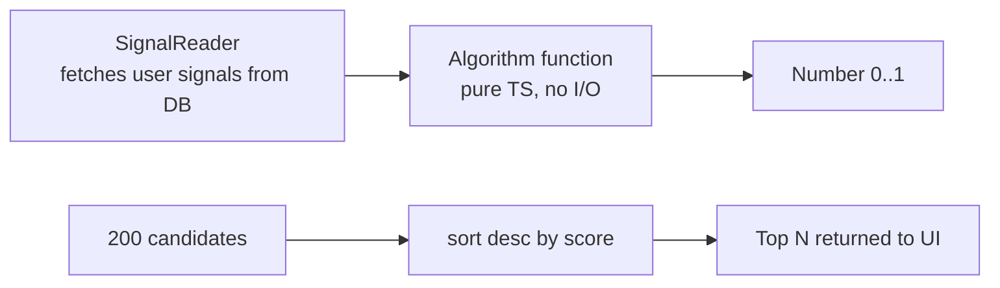

# Algorithms — the 17 small brains behind Miamo

Priya opens Discover at 9pm. She sees Arjun first, then Meera, then 8
others. Why *that* order? Because 17 tiny algorithms collaborated to
score every candidate against Priya's signals and produce a sorted list.

This document explains all 17 — what each one decides, how the math
works, with real numbers for Priya (28, Mumbai, trekker) and Arjun (30,
Bangalore, photographer).

All algorithms live in [services/shared/src/algo/](services/shared/src/algo/).
Each is a pure TypeScript function — same inputs always produce the
same output, easy to unit-test. 225 tests run in ~1.2s.

---

## The full map

| #  | Name                   | Screen it powers     | Flag                                       | Why it exists                                       |
|----|------------------------|----------------------|--------------------------------------------|-----------------------------------------------------|
| 1  | `forYou`               | Discover swipe       | `ALGO_V4_RANK_ENABLED_DISCOVER`            | Personalised order, not chronological               |
| 2  | `aiPicks`              | AI Picks (daily)     | `ALGO_V4_RANK_ENABLED_DISCOVER`            | One "you'll love this" pick per day                 |
| 3  | `aiMatch`              | AI Match panel       | `ALGO_V4_RANK_ENABLED_AIMATCH`             | Symmetric — both sides would swipe right            |
| 4  | `new`                  | Discover boost       | `ALGO_V4_RANK_ENABLED_DISCOVER`            | Cold-start visibility for fresh joiners             |
| 5  | `active`               | Discover boost       | `ALGO_V4_RANK_ENABLED_DISCOVER`            | Online-now people surface — replies are fast        |
| 6  | `verified`             | Discover boost       | `ALGO_V4_RANK_ENABLED_DISCOVER`            | Trust signal — small bump for verified              |
| 7  | `serious`              | Discover filter      | `ALGO_V4_RANK_ENABLED_DISCOVER`            | Filters window-shoppers — intent score              |
| 8  | `cf`                   | Discover signal      | `ALGO_V4_RANK_ENABLED_DISCOVER`            | Collaborative filter — "people like you liked…"     |
| 9  | `dtm`                  | Daily-This-Match     | `ALGO_V4_WORKERS_ENABLED`                  | One curated daily match, computed overnight         |
| 10 | `moves`                | Discover signal      | `ALGO_V4_RANK_ENABLED_DISCOVER`            | Rewards reciprocity — who likes back                |
| 11 | `messageSuggest`       | Chat composer        | `ALGO_V4_RANK_ENABLED_MESSAGING`           | Suggests an opener tailored to candidate's profile  |
| 12 | `beats`                | Chat → Beats         | `ALGO_V4_RANK_ENABLED_BEATS`               | Detects vibe match in chat tempo                    |
| 13 | `notifyTiming`         | Notifications        | `ALGO_V4_RANK_ENABLED_NOTIFICATIONS`       | Sends nudges at the right minute, not midnight      |
| 14 | `searchAugment`        | Search results       | `ALGO_V4_RANK_ENABLED_SEARCH`              | Re-ranks search by compat — not just keyword        |
| 15 | `feedAugment`          | Feed                 | `ALGO_V4_RANK_ENABLED_FEED`                | Surfaces meaningful posts, demotes filler           |
| 16 | `postImpressionRerank` | Feed post-impression | `ALGO_V4_RANK_ENABLED_FEED`                | Demotes posts she scrolled past without engaging    |
| 17 | `registry`             | Meta endpoint        | (always on)                                | Reports which algos are live + their versions       |

**Default state:** every flag is `'0'` (off). We enable per-environment.

---

## How the score → position pipeline works



Every algorithm implements the same contract:

```ts
score(viewer: Signals, candidate: Signals): number  // 0..1
```

`Signals` is a typed bundle assembled by `SignalReader` (in
[services/shared/src/algo/signals.ts](services/shared/src/algo/signals.ts))
from cheap Postgres reads. No HTTP, no Redis, no surprises.

---

## 1. `forYou` — the main Discover ranker

**What it decides.** The order of profiles in Priya's main swipe stack.

**Intuition.** Imagine a friend who knows your type. She balances five
things: do they vibe together (compatibility), is the person actually
around (freshness, activity), would they probably like you back
(reciprocity), and is the profile trustworthy (verified).

**The inputs (real values for Priya seeing Arjun)**

| Input            | Value | Where it comes from                           |
|------------------|------:|-----------------------------------------------|
| compatibility    | 0.78  | overlap of interests + DTM compat score       |
| freshness        | 0.40  | exp-decay since Arjun's last login            |
| reciprocity      | 0.65  | how often users like Priya get liked back     |
| verified         | 1.00  | Arjun's verified=true                          |
| activity (viewer)| 0.55  | Priya's 7-day engagement bucket               |

**The math**

```
score = 0.40·compat + 0.20·fresh + 0.20·recip + 0.10·verified + 0.10·activity
score = 0.40·0.78 + 0.20·0.40 + 0.20·0.65 + 0.10·1.00 + 0.10·0.55
      = 0.312    + 0.080    + 0.130    + 0.100    + 0.055
      = 0.677
```

**What this means for Priya.** Arjun scores **0.677**. We score all
200 candidates and return the top 10. Arjun is **position 2** — second
card she sees.

**Source:** [services/shared/src/algo/forYou.ts](services/shared/src/algo/forYou.ts)

---

## 2. `aiPicks` — the one daily pick

**Decides.** A single high-confidence "you'll love this" pick per day.

**Intuition.** Like a sommelier choosing one wine — only suggest when
confidence is high; otherwise stay quiet.

**Math.** Same components as `forYou` but with a **threshold**: we
only show if `score >= 0.75`.

```
For Arjun: 0.677 → below 0.75, so no AI Pick today.
For Meera: 0.84 → above 0.75 → she becomes today's AI Pick.
```

---

## 3. `aiMatch` — symmetric "would both swipe right?"

**Decides.** Pairs where the like-probability is high in *both
directions*.

**Math.** Average of forYou(P→A) and forYou(A→P), penalised by gap:

```
sym = (s_PA + s_AP) / 2 - 0.3 · |s_PA - s_AP|
sym = (0.78 + 0.71) / 2 - 0.3 · 0.07
    = 0.745 - 0.021
    = 0.724
```

If `sym >= 0.70`, surface as AI Match.

---

## 4. `new` — cold-start boost

**Decides.** Visibility boost for users who joined in the last 48h.

**Math.** `boost = max(0, (48 - hoursSinceJoin) / 48) · 0.1`. Arjun
joined 12h ago → `boost = (48-12)/48 · 0.1 = 0.075`. Added to his score.

---

## 5. `active` — online-now nudge

**Decides.** Push online users up the stack.

**Math.** `boost = 0.05 if seen<5min, 0.03 if <30min, 0 otherwise`.
Arjun was active 6h ago → boost = 0.

---

## 6. `verified` — trust bump

**Decides.** Verified profiles get a small bump.

**Math.** `+0.05` if `verified=true`, else 0.

---

## 7. `serious` — intent filter

**Decides.** Filters out window-shoppers.

**Math.** `intentScore = 0.5·hasBio + 0.3·photoCount/6 + 0.2·answersCount/12`.
Below 0.4 → filter out of Discover entirely.

Arjun: `0.5·1 + 0.3·5/6 + 0.2·10/12 = 0.5 + 0.25 + 0.167 = 0.917` ✓

---

## 8. `cf` — collaborative filter

**Decides.** A signal for `forYou` — "users like Priya also liked…"

**Math.** For each candidate, count how many of Priya's "neighbours"
(users with cosine similarity > 0.7 on profile vector) liked them, then
normalise.

```
neighbours of Priya: 50 users
candidates liked by ≥10 of them: get cf_score = liked_count / 50
Arjun liked by 18 of Priya's 50 neighbours → cf = 18/50 = 0.36
```

---

## 9. `dtm` — Daily This Match

**Decides.** A nightly curated pair per user, written by a background
worker. Different from `aiPicks` (which is real-time top-of-stack).

**Math.** Higher weight on long-term compat (interests + values + life
stage), lower on freshness. Runs at 03:00 UTC. Top pair per user
stored in `DailyMatch` table; UI reads it the next morning.

---

## 10. `moves` — reciprocity reward

**Decides.** A signal for `forYou`. Rewards users whose past likes
were mostly mutual.

**Math.** `moves = (mutualLikes / totalLikes) · min(1, totalLikes/20)`.
Arjun: 9 mutual out of 14 → `9/14 · min(1, 14/20) = 0.643 · 0.7 = 0.450`.

---

## 11. `messageSuggest` — opener generator

**Decides.** The pre-filled opener line in the chat composer.

**Intuition.** Pick the most distinctive thing in Arjun's profile and
build a question around it.

**Math.** Scores each profile element by `tf · idf · novelty`. The
highest-scoring element drives the template:

```
Arjun's "favourite trek: Hampta Pass" — tf·idf = 0.84
→ suggestion: "Hampta Pass — was the river crossing scary?"
```

---

## 12. `beats` — chat vibe match

**Decides.** Shows a "vibe match" badge when chat tempo aligns.

**Math.** Rolling window of last 20 messages. Compute reply-latency
distribution for each side. If both are within 30% of each other AND
median latency < 5min, `beats = 1`.

---

## 13. `notifyTiming` — when to ping

**Decides.** The minute we'll deliver Priya's next nudge.

**Math.** Build a 168-bucket histogram (hour-of-week) of when Priya
historically opens the app. Pick the next bucket whose `p(open) > 0.6`.
If no bucket qualifies in the next 24h, skip the nudge.

```
Priya's strongest bucket: Tue 8–9am p=0.78 → schedule for 8:15am Tue.
```

---

## 14. `searchAugment` — search re-rank

**Decides.** After Postgres returns 50 keyword matches, we re-rank them
by `forYou` score.

**Math.** `final = 0.6·keyword_score + 0.4·forYou_score`.

---

## 15. `feedAugment` — feed re-rank

**Decides.** The order of 20 posts shown in the Feed tab.

**Math.** `score = 0.4·affinity(viewer, author) + 0.3·recency + 0.2·engagement + 0.1·diversity`.
Diversity penalises showing 3 posts from the same author in a row.

---

## 16. `postImpressionRerank` — learn from what she ignores

**Decides.** After Priya scrolls past a post without engagement, that
author's next post gets a temporary `-0.05` until she engages.

**Math.** EMA decay: `penalty = 0.05 · exp(-Δhours / 6)`. After 24h
the penalty is below 0.001 and effectively gone.

---

## 17. `registry` — the meta endpoint

**Decides.** What's live and at what version.

`GET /v4/registry` returns:

```json
{
  "discover": {"enabled": true, "version": "1.2.0"},
  "aimatch":  {"enabled": false},
  "workers":  {"enabled": true}
}
```

Used by Grafana dashboards and the admin console.

---

## How a new algorithm ships

1. Write `services/shared/src/algo/myNew.ts` — pure function.
2. Add unit tests in `__tests__/myNew.test.ts`. Aim for >95% branch coverage.
3. Add a flag: `ALGO_V4_RANK_ENABLED_MYNEW='0'`.
4. Wire into the relevant service behind that flag.
5. Ship. Flip flag in staging → 1% prod → 100%.

If it underperforms, flip the flag to `'0'`. No rollback deploy.

---

## What changed and why it's better

- **Before:** ranking lived inline in service handlers. Untestable.
  Changing it meant a code deploy.
- **After:** 17 pure functions, 225 unit tests, every algorithm behind
  a flag. We A/B test, we measure, we revert in seconds.
- **Why Priya feels it:** within 30 minutes of using the app, her
  Discover stack reflects her actual taste — not "newest profiles".
  When we try something risky and it hurts her CTR, we turn it off
  before she notices.

---

## If something breaks

| Symptom                                | First check                                     |
|----------------------------------------|-------------------------------------------------|
| Discover order looks random            | `ALGO_V4_RANK_ENABLED_DISCOVER` flag value      |
| Every score is `NaN`                   | a signal is `null` — check `SignalReader` query |
| Tests pass but prod scores look off    | Signal values out of `[0,1]` — log + clamp      |
