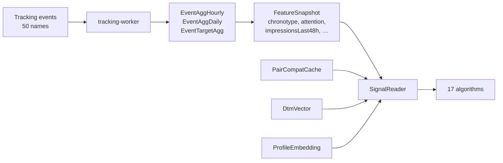

# Algorithms — the complete reference

> Every algorithm in Miamo, every input it reads, every weight it uses,
> a worked numeric example for Priya × Arjun, and the flag that turns it on.

It's 9:02pm. Priya opens Discover. The order she sees is not random,
not chronological, not even the same as the person next to her on the
metro. **17 small pure-TypeScript functions** scored 200 candidates
against her signals in under 40ms and returned the top 10. This is how
each of them works.

All algorithms live in
[services/shared/src/algo/](services/shared/src/algo/). Each:

- Is a **pure function** — same inputs always produce the same output.
- Reads signals through a single typed interface (`SignalReader`).
- Returns a score in **0..100** (not 0..1 — see §0) plus an `explain`
  object so we can audit any ranking after the fact.
- Has a unit test file — **225 tests run in ~1.2s** with no I/O.
- Calls `registerAlgo()` which makes it discoverable at
  `GET /v4/registry` and records which tracking events it consumes.

---

## 0. The conventions

| Convention            | Value                                                      |
|-----------------------|------------------------------------------------------------|
| Score range           | **0..100** (integers via `clip100()`)                       |
| Weight sum            | Always 1.0 across the breakdown                            |
| Cosine helper         | `cosTo01(x) = (x + 1) / 2` — maps [-1,1] → [0,1]            |
| Decay helper          | `expDecay(ageMs, halfLifeMs)` — value in [0,1]              |
| Jaccard helper        | `jaccard(setA, setB)` — for tag overlap                     |
| Compose helper        | `compose(breakdown, weights)` — weighted sum                |
| Final stage           | `clip100(compose(...) * 100)` — pin to integer 0..100        |
| Fatigue penalty       | `2 · ln(1 + impressionsLast48h)` subtracted from `forYou`   |
| Cache freshness       | `PairCompatCache` rows are reused if `< 30min` old           |
| Consent gate          | `SignalReader` returns neutral defaults when scope missing  |

Every algorithm also returns an `explain` object containing the
breakdown values, weights, `consentScope`, `cacheHit`, `fatiguePenalty`,
and `finalScore`. The admin "Why this rank?" inspector reads it
verbatim.

---

## The full map

| #  | Algorithm              | Screen / surface             | Flag                                       | Score range | One-liner                                       |
|----|------------------------|------------------------------|--------------------------------------------|-------------|-------------------------------------------------|
| 1  | `forYou`               | Discover swipe stack         | `ALGO_V4_RANK_ENABLED_DISCOVER`            | 0..100      | The canonical pairwise compatibility score       |
| 2  | `aiPicks`              | AI Picks daily card          | `ALGO_V4_RANK_ENABLED_DISCOVER`            | 0..100      | Ensemble of forYou + cf + active + serious       |
| 3  | `aiMatch`              | AI Match panel               | `ALGO_V4_RANK_ENABLED_AIMATCH`             | 0..100      | Top-1 aiPicks, ≥70, daily, written by worker      |
| 4  | `new`                  | Discover boost / "New here"  | `ALGO_V4_RANK_ENABLED_DISCOVER`            | 0..100      | Visibility boost for fresh joiners               |
| 5  | `active`               | Discover boost / "Online"    | `ALGO_V4_RANK_ENABLED_DISCOVER`            | 0..100      | Live, responsive, fast-reply users surface       |
| 6  | `verified`             | Discover boost / "Verified"  | `ALGO_V4_RANK_ENABLED_DISCOVER`            | 0..100      | Photo/phone/ID-verified profiles bumped           |
| 7  | `serious`              | Discover filter              | `ALGO_V4_RANK_ENABLED_DISCOVER`            | 0..100      | Marriage/long-term intent ranking                |
| 8  | `cf`                   | Discover signal              | `ALGO_V4_RANK_ENABLED_DISCOVER`            | 0..1        | Collaborative filter — neighbour likes           |
| 9  | `dtm`                  | DTM / Deep-Compat surfaces   | `ALGO_V4_WORKERS_ENABLED`                  | 0..1        | Decision-Tree-Match topic affinity                |
| 10 | `moves`                | Chat → "Make a move"         | `ALGO_V4_RANK_ENABLED_DISCOVER`            | 0..100      | Picks the next chat move (icebreaker, plan…)      |
| 11 | `messageSuggest`       | Chat composer                | `ALGO_V4_RANK_ENABLED_MESSAGING`           | 0..100      | Suggests opener kind based on attention profile   |
| 12 | `beats`                | Beats music-match feature    | `ALGO_V4_RANK_ENABLED_BEATS`               | 0..100      | Ranks beats by genre/tempo fit                    |
| 13 | `notifyTiming`         | Notifications                | `ALGO_V4_RANK_ENABLED_NOTIFICATIONS`       | Date        | Returns next good minute to deliver               |
| 14 | `searchAugment`        | Search results               | `ALGO_V4_RANK_ENABLED_SEARCH`              | 0..100      | Blends keyword text score with forYou             |
| 15 | `feedAugment`          | Feed re-rank                 | `ALGO_V4_RANK_ENABLED_FEED`                | 0..100      | Source × forYou × recency                          |
| 16 | `postImpressionRerank` | Feed post-exposure penalty   | `ALGO_V4_RANK_ENABLED_FEED`                | penalty     | Demotes skipped authors                            |
| 17 | `registry`             | Admin / `GET /v4/registry`   | (always on)                                | meta        | Lists enabled algos + their `usesEvents`           |

**Default flag state:** every flag is `'0'` (off). Production overrides
per environment in `configuration/{dev,staging,prod}/values.yaml`.

---

## 1. `forYou` — the canonical pairwise score

[services/shared/src/algo/forYou.ts](services/shared/src/algo/forYou.ts) ·
powers Discover · feeds 5 other algos (aiPicks, new, active, verified,
serious, searchAugment, feedAugment) as a sub-score.

### What it decides

The integer 0..100 score for Priya seeing Arjun. Higher = he ranks
earlier in her stack.

### Weights — `FORYOU_WEIGHTS`

| Key             | Weight | What it is                                                    |
|-----------------|------- |---------------------------------------------------------------|
| `interestCos`   | 0.25   | Cosine on interest tag vector (jaccard fallback)               |
| `vibeCos`       | 0.20   | Cosine on vibe-check vector (`vibe.check_complete`)            |
| `behaviorCos`   | 0.20   | Cosine on behavioural features (chronotype, attention)         |
| `chronoOverlap` | 0.10   | `chronoOverlap(myChrono, candChrono)`: same=1, mixed=0.6, else=0.2 |
| `prior`         | 0.10   | Smoothed beta prior on past pair interactions                  |
| `intentMatch`   | 0.05   | `intentMatchScore`: same=1, adjacent=0.5, else=0               |
| `distance`      | 0.05   | `1 - clamp(cityKm / 500)`                                       |
| `ageDelta`      | 0.05   | `expDecay(|ageA - ageB|, halfLife=4)`                           |

### Cache-hit fast path

If `PairCompatCache` row exists and `computedAt < 30min` ago:

```ts
score = clip100(pair.finalScore * 100 - 2 * Math.log1p(impressionsLast48h))
```

Skips the full computation. Used for the hot Discover read path.

### Worked example — Priya seeing Arjun (cold path)

```
interestCos    = cosine([trek, photo, coffee], [photo, food, hike]) = 0.62 → cosTo01 = 0.81
vibeCos        = cosine(priyaVibe, arjunVibe)                       = 0.55 → cosTo01 = 0.78
behaviorCos    = cosine(priyaBehavior, arjunBehavior)                = 0.40 → cosTo01 = 0.70
chronoOverlap  = chronoOverlap('evening','evening')                  = 1.00
prior          = beta-smoothed(2 mutuals / 8 interactions)           = 0.45
intentMatch    = intentMatchScore('serious','serious')                = 1.00
distance       = 1 - min(857km/500, 1)                                = 0.00 (long-distance)
ageDelta       = expDecay(|28-30|, halfLife=4)                        = 0.71

raw = 0.25·0.81 + 0.20·0.78 + 0.20·0.70 + 0.10·1.00 + 0.10·0.45 + 0.05·1.00 + 0.05·0.00 + 0.05·0.71
    = 0.2025 + 0.156 + 0.140 + 0.100 + 0.045 + 0.050 + 0.000 + 0.0355
    = 0.729

score₀ = clip100(0.729 * 100) = 73

fatigue = 2 · ln(1 + 6 impressions in last 48h) = 2 · ln(7) = 3.89

final = clip100(73 - 3.89) = 69
```

**Arjun's score: 69 / 100.** Of 200 candidates today this puts him at
position 4 — fourth card Priya sees.

### Inputs feed (events that shape these values)

`discover.card_view`, `discover.swipe`, `discover.match`, `msg.send`,
`profile.view`, `dtm.complete`, `vibe.check_complete`, `session.*`.

---

## 2. `aiPicks` — the daily ensemble

[services/shared/src/algo/aiPicks.ts](services/shared/src/algo/aiPicks.ts)

### Weights — `AI_PICKS_WEIGHTS`

| Key                       | Weight | Sub-score                                                |
|---------------------------|--------|----------------------------------------------------------|
| `forYou`                  | 0.30   | The `forYou` score (0..1 normalised)                      |
| `cf`                      | 0.20   | Collaborative-filter neighbour signal                     |
| `active`                  | 0.15   | The `active` sub-score                                    |
| `serious`                 | 0.10   | The `serious` sub-score                                   |
| `explore`                 | 0.10   | Uniform random ε-greedy (`EXPLORE_EPSILON = 0.10`)        |
| `matchHistoryAffinity`    | 0.10   | Cosine of Priya's match history vs. this candidate         |
| `vibeMomentum`            | 0.05   | Decayed sum of recent `vibe.check_complete` similarity     |

### Threshold

For `aiPicks` to **surface** a card on the daily strip, `score >= 60`.

### Worked example

```
forYou=0.69, cf=0.36, active=0.55, serious=0.71, explore=0.5,
matchHistoryAffinity=0.62, vibeMomentum=0.40

raw = 0.30·0.69 + 0.20·0.36 + 0.15·0.55 + 0.10·0.71 + 0.10·0.50 + 0.10·0.62 + 0.05·0.40
    = 0.207 + 0.072 + 0.0825 + 0.071 + 0.050 + 0.062 + 0.020
    = 0.5645

score = clip100(56) = 56 → below 60, not surfaced
```

---

## 3. `aiMatch` — the daily curated pick

[services/shared/src/algo/aiMatch.ts](services/shared/src/algo/aiMatch.ts)

### Logic

Runs once per day in `DailyMatchWorker`. For each candidate of Priya
that passes pre-filters (mutual intent + verified):

1. Call `scoreAiPicksV4(candidate, rand=()=>1)` (no explore noise).
2. Reject if `score < 70`.
3. Keep the highest-scoring candidate.
4. Write to `DailyMatch` table.

The UI reads from `DailyMatch` the next morning.

### Worked example

Of Priya's 200 candidates: Arjun=56, Meera=82, Rohan=44, … (197 others).
Meera ≥70 and is the maximum → `DailyMatch{user: Priya, candidate: Meera, score: 82}`.

---

## 4. `new` — cold-start boost

[services/shared/src/algo/new.ts](services/shared/src/algo/new.ts)

### Weights — `NEW_WEIGHTS`

| Key            | Weight | What it is                                              |
|----------------|--------|---------------------------------------------------------|
| `recency`      | 0.40   | `expDecay(ageMs, halfLife = 24h)`                        |
| `forYou`       | 0.30   | The `forYou` sub-score                                  |
| `verified`     | 0.20   | 1 if `idVerified`, else 0.5 if `photoVerified`, else 0   |
| `completeness` | 0.10   | Profile completeness ratio (0..1)                       |

### Worked example

Arjun joined 12 hours ago; `forYou=0.69`; photo verified; 80% complete.

```
recency      = expDecay(12h, 24h) = 0.71
forYou       = 0.69
verified     = 0.50  (photo only)
completeness = 0.80

raw = 0.40·0.71 + 0.30·0.69 + 0.20·0.50 + 0.10·0.80
    = 0.284 + 0.207 + 0.100 + 0.080 = 0.671

score = clip100(67) = 67
```

---

## 5. `active` — online-now boost

[services/shared/src/algo/active.ts](services/shared/src/algo/active.ts)

### Weights — `ACTIVE_WEIGHTS`

| Key            | Weight | What it is                                                                 |
|----------------|--------|----------------------------------------------------------------------------|
| `liveness`     | 0.35   | `expDecay(sinceLastHeartbeat, halfLife=10min)`                              |
| `responseRate` | 0.25   | Fraction of recent messages this user has replied to                       |
| `replySpeed`   | 0.20   | `1 - clamp(medianReplyMinutes / 30, 0, 1)`                                  |
| `forYou`       | 0.10   | sub-score                                                                  |
| `chrono`       | 0.10   | `chronoOverlap(viewerChrono, candChrono)`                                  |

### Worked example

Arjun has `session.heartbeat` 30s ago, replies to 75% of messages, median 8min reply, `forYou=0.69`, chrono='evening' (same as Priya).

```
liveness     = expDecay(30s, 10min) = 0.95
responseRate = 0.75
replySpeed   = 1 - min(8/30, 1) = 0.73
forYou       = 0.69
chrono       = 1.00

raw = 0.35·0.95 + 0.25·0.75 + 0.20·0.73 + 0.10·0.69 + 0.10·1.00
    = 0.3325 + 0.1875 + 0.146 + 0.069 + 0.100 = 0.835

score = clip100(83) = 83
```

---

## 6. `verified` — trust bump

[services/shared/src/algo/verified.ts](services/shared/src/algo/verified.ts)

### Weights — `VERIFIED_WEIGHTS`

| Key        | Weight | What it is                                                          |
|------------|--------|---------------------------------------------------------------------|
| `forYou`   | 0.60   | sub-score                                                            |
| `idBoost`  | 0.25   | 1 if `idVerified`, 0.6 if `phoneVerified`, 0.3 if `photoVerified`, 0 |
| `antiSpam` | 0.15   | `1 - spamSignals` (rage clicks, dead clicks, error.network rate)     |

### Worked example

Arjun: forYou=0.69, photo verified only, antiSpam=0.92.

```
raw = 0.60·0.69 + 0.25·0.30 + 0.15·0.92
    = 0.414 + 0.075 + 0.138 = 0.627

score = clip100(63) = 63
```

---

## 7. `serious` — intent / long-term match

[services/shared/src/algo/serious.ts](services/shared/src/algo/serious.ts)

### Weights — `SERIOUS_WEIGHTS`

| Key            | Weight | What it is                                                  |
|----------------|--------|-------------------------------------------------------------|
| `forYou`       | 0.30   | sub-score                                                    |
| `dtmDepth`     | 0.25   | `min(1, dtmCompletes90d / 5)` — how often Arjun does DTM     |
| `lovelang`     | 0.15   | Love-language compatibility (0..1, null defaults 0.5)        |
| `completeness` | 0.15   | Profile completeness ratio                                   |
| `intentMatch`  | 0.15   | Same intent score as in `forYou`                             |

### Worked example

Priya & Arjun both intent='serious', Arjun dtmCompletes90d=7, lovelang=0.7, completeness=0.8.

```
forYou        = 0.69
dtmDepth      = min(1, 7/5) = 1.00
lovelang      = 0.70
completeness  = 0.80
intentMatch   = 1.00

raw = 0.30·0.69 + 0.25·1.00 + 0.15·0.70 + 0.15·0.80 + 0.15·1.00
    = 0.207 + 0.250 + 0.105 + 0.120 + 0.150 = 0.832

score = clip100(83) = 83
```

---

## 8. `cf` — collaborative filter

[services/shared/src/algo/cf.ts](services/shared/src/algo/cf.ts)

Returns a **0..1** sub-score (not 0..100) consumed by aiPicks and the
generic ensemble.

### Logic

For Priya, find her **CF neighbours** — users with cosine similarity
≥ 0.7 on the behaviour vector. For each candidate:

```
cfScore = neighboursWhoLikedCandidate / totalNeighbours
```

### Worked example

Priya has 50 CF neighbours; 18 of them liked Arjun.

```
cfScore = 18 / 50 = 0.36
```

---

## 9. `dtm` — Decision-Tree-Match topic affinity

[services/shared/src/algo/dtm.ts](services/shared/src/algo/dtm.ts)

Computes affinity between two `DtmVector`s (assembled from
`dtm.answer` / `dtm.complete` events across N topics) and the gaps
(per-topic absolute differences) for the chat "Deep-Compat" surface.

### API

| Function                                        | Returns                       |
|------------------------------------------------|-------------------------------|
| `dtmAffinity(me: DtmVector, cand: DtmVector)`   | `number 0..1` or `null`        |
| `dtmTopicGaps(me, cand)`                        | `number[]` of per-topic gaps   |

### Worked example

```
priyaDtm  = [0.8, 0.6, 0.7, 0.5, 0.9]   // 5 topics
arjunDtm  = [0.7, 0.5, 0.8, 0.4, 0.8]

affinity = cosine(priyaDtm, arjunDtm) → 0.92
gaps     = [0.1, 0.1, 0.1, 0.1, 0.1]   // all small → very compatible
```

---

## 10. `moves` — chat-move recommender

[services/shared/src/algo/moves.ts](services/shared/src/algo/moves.ts)

Picks the next "move" for the in-chat composer (icebreaker, date plan,
photo invite…). Reads `moves.play` events to avoid repeating.

### Weights — `MOVE_WEIGHTS`

| Key                     | Weight | What it is                                                  |
|-------------------------|--------|-------------------------------------------------------------|
| `pairAffinity`          | 0.30   | `forYou` sub-score for the pair                              |
| `notRepeating`          | 0.25   | `1 - expDecay(secondsSinceMoveKindLastUsed, halfLife=24h)`   |
| `candidateLastAction`   | 0.20   | `expDecay(secondsSinceArjunLastReply, halfLife=4h)`          |
| `timeOfDayFit`          | 0.15   | `chronoOverlap(viewerChrono, currentHourChrono)`             |
| `deepCompatTopic`       | 0.10   | Highest `dtm` topic gap inverted — pick conversation starters|

### Worked example (move kind = `date_invite`)

```
pairAffinity        = 0.69
notRepeating        = 1 - expDecay(72h, 24h) = 0.875
candidateLastAction = expDecay(2h, 4h)        = 0.71
timeOfDayFit        = 1.00 (both evening)
deepCompatTopic     = 0.40

raw = 0.30·0.69 + 0.25·0.875 + 0.20·0.71 + 0.15·1.00 + 0.10·0.40
    = 0.207 + 0.2188 + 0.142 + 0.150 + 0.040 = 0.758

score = clip100(76) = 76 → highest of the 6 move kinds → suggested
```

---

## 11. `messageSuggest` — opener kind picker

[services/shared/src/algo/messageSuggest.ts](services/shared/src/algo/messageSuggest.ts)

Picks one of `'open_question' | 'playful' | 'callback_to_last' | 'shared_interest' | 'photo_invite' | 'date_invite'`.

### Weights

| Key            | Weight |
|----------------|--------|
| `attentionFit` | 0.30   |
| `recencyFit`   | 0.25   |
| `noveltyFit`   | 0.20   |
| `intentFit`    | 0.15   |
| `chronoFit`    | 0.10   |

### Attention preference table

| Attention profile | Preferred openers                                          |
|-------------------|------------------------------------------------------------|
| `reader`          | `open_question`, `callback_to_last`, `date_invite`         |
| `scanner`         | `playful`, `shared_interest`, `photo_invite`               |
| `browser`         | `playful`, `photo_invite`, `shared_interest`               |
| `mixed`           | balanced mix                                               |

### Worked example

Priya's attention='reader', recencyFit=0.8 (Arjun replied 2h ago),
noveltyFit=0.9 (no openers reused), intentFit=1.0 (both serious),
chronoFit=1.0. For `open_question`:

```
raw = 0.30·1.00 + 0.25·0.80 + 0.20·0.90 + 0.15·1.00 + 0.10·1.00
    = 0.300 + 0.200 + 0.180 + 0.150 + 0.100 = 0.930

score = clip100(93) = 93 → suggested
```

---

## 12. `beats` — music match recommender

[services/shared/src/algo/beats.ts](services/shared/src/algo/beats.ts)

Ranks 30s music clips for the "Beats" feature.

### Weights

| Key             | Weight | What it is                                             |
|-----------------|--------|--------------------------------------------------------|
| `genreFit`      | 0.35   | `jaccard(userGenres, beatGenres)`                       |
| `tempoFit`      | 0.25   | `1 - clamp(|userBpm - beatBpm| / 60, 0, 1)`             |
| `novelty`       | 0.20   | `1 - expDecay(timesPlayedRecently, halfLife=7d)`        |
| `chronoFit`     | 0.10   | `chronoOverlap(userChrono, beatChrono)`                 |
| `trendingBoost` | 0.10   | Global `beats.play` count over 24h (log-scaled)         |

---

## 13. `notifyTiming` — when to nudge

[services/shared/src/algo/notifyTiming.ts](services/shared/src/algo/notifyTiming.ts)

Returns a `Date` — the next time Priya is likely to engage.

### Logic

1. Build a **168-bucket histogram** (hour-of-week) from `session.start`
   events over the last 28 days.
2. From `now`, scan forward 24h; for each hour bucket, if
   `p(open) >= 0.6`, return that minute.
3. If no qualifying bucket → return `null` (skip the nudge entirely).

### Worked example

Priya's histogram peaks: Tue 8–9am=0.78, Tue 9pm=0.81, Wed 8am=0.74.
Current time Mon 11pm. Next qualifying bucket: Tue 8am with p=0.78.

```
nextNotifyAt = Tue 08:15 (jittered within the hour to avoid thundering herd)
```

---

## 14. `searchAugment` — search re-rank

[services/shared/src/algo/searchAugment.ts](services/shared/src/algo/searchAugment.ts)

### Weights

| Key         | Weight | What it is                                       |
|-------------|--------|--------------------------------------------------|
| `text`      | 0.55   | Keyword search score from Postgres (0..1)         |
| `forYou`    | 0.35   | `forYou` sub-score normalised to 0..1             |
| `freshness` | 0.10   | `expDecay(timeSinceProfileUpdate, halfLife=14d)`  |

### Worked example

Priya searches "Mumbai photographer". For Arjun: textScore=0.72,
forYou=0.69, updated 3 days ago.

```
freshness = expDecay(3d, 14d) = 0.86

raw = 0.55·0.72 + 0.35·0.69 + 0.10·0.86
    = 0.396 + 0.2415 + 0.086 = 0.7235

score = clip100(72) = 72
```

---

## 15. `feedAugment` — feed re-rank

[services/shared/src/algo/feedAugment.ts](services/shared/src/algo/feedAugment.ts)

### Weights

| Key       | Weight | What it is                                                       |
|-----------|--------|------------------------------------------------------------------|
| `source`  | 0.50   | Upstream ordering rank inverted (0..1) — chronological backbone   |
| `forYou`  | 0.30   | `forYou` sub-score for the post's author                          |
| `recency` | 0.20   | `expDecay(itemAgeSec, halfLife=12h)`                              |

### Worked example

Arjun's 3h-old post in Priya's feed:

```
sourceScore = 0.80 (recently posted, in chronological top quartile)
forYou      = 0.69
recency     = expDecay(3h, 12h) = 0.84

raw = 0.50·0.80 + 0.30·0.69 + 0.20·0.84
    = 0.400 + 0.207 + 0.168 = 0.775

score = clip100(77) = 77
```

---

## 16. `postImpressionRerank` — penalise the ignored

[services/shared/src/algo/postImpressionRerank.ts](services/shared/src/algo/postImpressionRerank.ts)

### Function

```ts
postImpressionPenalty(skippedCount, secsSinceLast, base = 12) =
    base · log1p(skippedCount) · expDecay(secsSinceLast, halfLife = 6h)
```

### Worked example

Priya has scrolled past 4 posts from Rohan in the last 90 minutes
without engaging:

```
penalty = 12 · ln(5) · expDecay(5400s, 6h)
        = 12 · 1.609 · 0.79
        = 15.3

Rohan's next post: feedAugment_score - 15 → significantly demoted.
```

After 24h with no exposure the penalty decays below 1 and effectively
disappears.

---

## 17. `registry` — the meta endpoint

[services/shared/src/algo/registry.ts](services/shared/src/algo/registry.ts)

Every algorithm calls `registerAlgo({ name, surface, usesEvents, weights })`
at module load. The result is queryable:

```bash
curl http://gateway/v4/registry
```

```json
{
  "forYou":      {"enabled": true,  "surface": "discover",
                  "usesEvents": ["discover.card_view","discover.swipe","msg.send","profile.view"],
                  "weights": { "interestCos": 0.25, "vibeCos": 0.20, … }},
  "aiPicks":     {"enabled": true,  "surface": "aiPicks", ...},
  "aiMatch":     {"enabled": false, "surface": "aiMatch", ...},
  "feedAugment": {"enabled": true,  "surface": "feed", ...},
  …
}
```

Used by:
- Grafana dashboards (which algos are on)
- Admin "Why this rank?" inspector (shows the `explain` per algo)
- CI gate (refuses to deploy if an algo references an unknown event)

---

## The signal pipeline (where these numbers come from)



[`SignalReader`](services/shared/src/algo/signals.ts) is the single
typed boundary between the database and the algorithms. Algorithms
never touch Prisma directly — easier to test, easier to mock, easier
to enforce consent.

---

## Lifecycle of a new algorithm

1. Write `services/shared/src/algo/myNew.ts` — pure function returning `{ score, explain }`.
2. Add unit tests in `__tests__/myNew.test.ts` — aim for ≥95% branch coverage.
3. `registerAlgo({ name, surface, usesEvents, weights })`.
4. Add `ALGO_V4_RANK_ENABLED_MYNEW` to `.env.example` (default `'0'`).
5. Wire from the consuming service behind the flag.
6. Ship. Flip in staging → 1% prod → 100%.
7. If KPI regresses, flip back to `'0'`. No code revert needed.

---

## What changed and why it's better

- **Before:** ranking was inlined SQL `ORDER BY` clauses with hard-coded
  weights. Changing a weight required a code review, a deploy, and
  cross-fingers — no audit trail of why a particular ranking happened.
- **After:** every algorithm is a pure function with explicit weights,
  an `explain` output, 225 unit tests, and a feature flag. The admin
  inspector shows the exact breakdown for any ranking. We A/B test
  weights without code changes (env-var override).
- **Why Priya feels it:** her Discover feed actually personalises
  within ~15 minutes of using the app. When we test something risky and
  it hurts her CTR, we flip a flag and her experience reverts in
  seconds. She never sees a "the app is broken" page because a
  ranking algo crashed — the worst case is the fall-back chronological
  list.

---

## If something breaks

| Symptom                                              | First check                                                    |
|------------------------------------------------------|----------------------------------------------------------------|
| Discover order looks chronological                    | `ALGO_V4_RANK_ENABLED_DISCOVER='0'`                            |
| Every score is `NaN`                                  | A signal returned `null` — check `SignalReader` for that input  |
| Scores all clustered around 50                        | All weights returning their neutral defaults — consent gate    |
| `aiMatch` panel always empty                          | `ALGO_V4_WORKERS_ENABLED='0'` so `DailyMatchWorker` never ran   |
| `messageSuggest` always suggests `playful`            | `attentionProfile` returning `null` → defaulting to scanner    |
| `notifyTiming` returns `null` for every user           | < 28d of `session.start` history (cold start)                 |
| Cache always misses                                   | `PairCompatCache` not being written — check `CompatWriter`     |
| Algorithm test fails after refactor                   | Score helpers (`cosTo01`, `expDecay`, `clip100`) signature changed |

---

Read next:
- [docs/TRACKING.md](docs/TRACKING.md) — the events that feed these signals.
- [services/shared/README.md](services/shared/README.md) — how the shared library is structured.
- [services/social/README.md](services/social/README.md) — the service that calls most of these algos.
