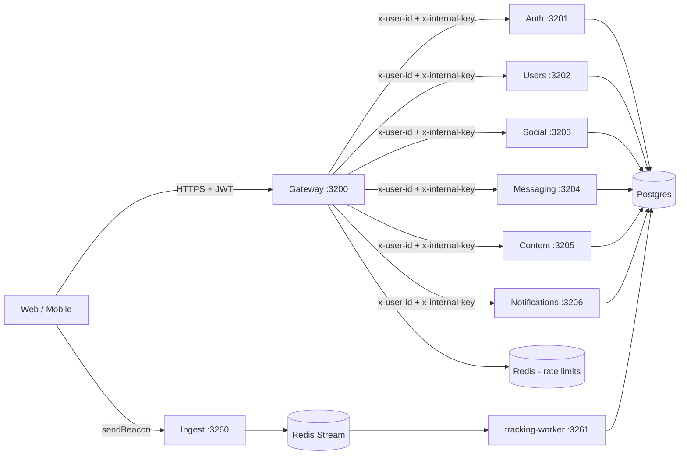

# API — every endpoint Priya's app calls

> Phase D of the Miamo v3.6.1 documentation cleanup. This is the authoritative reference for the HTTP surface the web client talks to. It is regenerated from a direct read of the eight `server.ts` files plus cross-checks against docs/releases/v3.6.0.md. When this file and a `server.ts` disagree, `server.ts` is the truth and this file is the bug.

---

## TL;DR

Miamo's web client has exactly one front door: the gateway at `localhost:3200` in dev, `https://api.miamo.app` in production. Every browser request hits that gateway, which verifies the JWT, attaches `x-user-id` + `x-internal-key` headers, applies a rate-limit bucket, and proxies to one of seven internal services. There are eight `server.ts` files (gateway plus seven backends — auth, users, social, messaging, content, notifications, ingest) implementing roughly 150 endpoints. Anything new from v3.6.0 (Move v2, Family Brief, Weekly Top-10, Why-explainer, Voice Fingerprint, anti-ghost ledger, DTM mood-mask) is behind a feature flag that defaults OFF. When a v3.6.0 flag is OFF the endpoint returns 404 — byte-identical to v3.5 behaviour. Internal service-to-service calls go direct (not through the gateway) and carry `X-Internal-Key: $INTERNAL_SERVICE_KEY`, which never appears in a browser request.

---

## How to read this

Three people read this document, and the format is written for all three.

- **Meera** runs ops. She wants to know which endpoint serves which user need, which rate-limit bucket it falls in, and what 4xx/5xx codes mean so on-call can decode a Sentry alert without paging an engineer.
- **Priya** is one of our personas — 27, Bangalore, product manager. She does not read this file. She is *the reason* every endpoint section opens with a plain-English paragraph: if you cannot describe an endpoint by what Priya does in the app, the endpoint should not exist.
- **Arjun** is the new backend engineer joining the team. He wants the technical contract — auth requirement, Zod schema name, response shape, feature flag, file:line cite. The technical block under each endpoint is for him.

Each endpoint follows the same shape. First paragraph: what Priya/Arjun/Karan/Riya does in the app that hits this endpoint. Second block: the contract — auth, internal-only, rate-limit bucket, feature flag, request body schema, response shape, one `curl` example.

Personas used in examples:

- **Priya** — 27, Bangalore, product manager. Active dater, uses Move suggestions, posts to Showcase.
- **Arjun** — 30, Bangalore, engineer. Premium user, fewer swipes, deeper conversations. Often the backend engineer in code-context examples too.
- **Karan** — 24, Pune, student. Free tier, heavy Discover user, occasional creativity creator.
- **Riya** — 29, Mumbai, DTM track. Family Brief target user, careful with topic mask.

---

## Conventions

### Base URLs

| Environment | Base URL |
|---|---|
| Production | `https://api.miamo.app` |
| Staging | `https://api.staging.miamo.app` |
| Dev (local) | `http://localhost:3200` |

All endpoints in this document are prefixed `/api/v1` unless explicitly noted. The ingest service at port 3260 uses a `/v1` prefix (no `/api`) because it is reached directly by the browser collector on a separate origin in production.

### Authentication

Two accepted forms for the same JWT:

1. **Header (preferred)** — `Authorization: Bearer <accessToken>` where the token is the HS256 JWT minted by `auth/src/server.ts`. The gateway validates format with `/^[A-Za-z0-9_-]+\.[A-Za-z0-9_-]+\.[A-Za-z0-9_-]+$/` before calling `jwt.verify` to keep CPU-cheap probing cheap (gateway/src/server.ts:239).
2. **Cookie** — `Cookie: miamo-access=<accessToken>` for SSR / native webview flows that cannot set custom headers.

On a successful verify the gateway strips client headers and replaces them with `x-user-id: <uuid>` and `x-internal-key: $INTERNAL_SERVICE_KEY` (gateway/src/server.ts:249-250). Downstream services trust those two headers; they never re-validate the JWT.

Two further header rules:

- Authorization headers longer than 2KB are silently dropped (gateway/src/server.ts:229).
- `x-forwarded-host`, `x-original-url`, `x-rewrite-url`, `x-forwarded-server`, `x-forwarded-proto` are all stripped on ingress (gateway/src/server.ts:218-222).

### Service-to-service

Internal calls — for example tracking-worker writing to content, or social calling users for completion score — bypass the gateway and use:

```
X-Internal-Key: $INTERNAL_SERVICE_KEY
X-User-Id: <userId-being-acted-on>   (if relevant)
```

This header is **never** sent from the browser. If you see it on an externally-facing surface, that is a P0 leak.

### Rate-limit buckets

All buckets are Redis-backed (so they survive a service restart) and keyed by user-id when authenticated, else IP. Source: gateway/src/server.ts:144-213.

| Bucket | Window | Max | Applies to |
|---|---|---|---|
| Global | 15 min | 5000 | every request that hits the gateway |
| Auth | 15 min | 30 prod / 500 dev | `/api/v1/auth/*` (excluding refresh + forgot-password) |
| Forgot-password | 1 hr | 5 | `/api/v1/auth/forgot-password` (IP-keyed) |
| Refresh | 15 min | 60 prod / 1000 dev | `/api/v1/auth/refresh` (IP-keyed) |
| Report | 24 hr | 30 | `/api/v1/safety/*` |
| Expensive | 1 min | 20 | `/api/v1/discover/*`, `/api/v1/search` |
| Feed | 1 min | 60 | `/api/v1/feed`, `/api/v1/stories`, `/api/v1/videos`, `/api/v1/creativity`, `/api/v1/showcase` |

When a bucket trips the response is `429 RATE_LIMITED` with a `Retry-After` header.

### Error envelope

Every non-2xx response from any service follows the same shape:

```json
{
  "error": {
    "code": "RATE_LIMITED",
    "message": "Slow down. Too many requests.",
    "details": { "retryAfterMs": 12000 }
  }
}
```

The HTTP status code carries the protocol-level signal (401/403/404/429/500). The `code` field carries the application-level signal — that is what the client switches on. The `details` object is optional and free-form.

### Feature flags

v3.6.0 introduced eleven user-facing feature flags plus four worker flags. All default OFF except `DISCOVER_PASS_HARDFILTER_ENABLED` which is ON by default to preserve v3.5 behaviour. When OFF the endpoint returns 404 with `code: FEATURE_DISABLED` so that scrapers cannot fingerprint which features exist.

| Flag | Surface | Default |
|---|---|---|
| `ALGO_V8_DISCOVER_RANKER_ENABLED` | Discover ranking | OFF |
| `ALGO_V8_FAIRNESS_RERANK_ENABLED` | Discover fairness | OFF |
| `DISCOVER_PASS_HARDFILTER_ENABLED` | Discover pass filter | **ON** |
| `FEATURE_WHY_EXPLAINER_ENABLED` | `/discover/:id/why` | OFF |
| `FEATURE_WEEKLY_TOP_ENABLED` | `/weekly-top` | OFF |
| `FEATURE_MOVE_V2_ENABLED` | Move v2 chips | OFF |
| `FEATURE_FAMILY_BRIEF_ENABLED` | DTM family brief | OFF |
| `FEATURE_DTM_MASK_ENABLED` | DTM topic mask | OFF |
| `FEATURE_ANTI_GHOST_ENABLED` | Chat ledger | OFF |
| `FEATURE_VOICE_FINGERPRINT_ENABLED` | Voice fingerprint | OFF |
| `INTENT_INFERENCE_ENABLED` | Worker inference | OFF |
| `EXPOSURE_SCHEDULER_ENABLED` | Exposure credits | OFF |
| `STABLE_MATCH_ENABLED` | Top-10 worker | OFF |
| `FAIRNESS_AUDIT_ENABLED` | Daily Gini job | OFF |

### Onboarding gate

A subset of routes is wrapped with `requireOnboarded` (gateway/src/server.ts:273-311), which calls `users/api/v1/profiles/me/completion`, caches the result for 60s in-process, and returns 403 `ONBOARDING_INCOMPLETE` if the user is below threshold (60 for casual, 80 for DTM). The body of the 403 contains `currentScore`, `requiredScore`, `missingFields[]`, and `dtm: boolean` so the client can render the right unlock CTA.

Routes behind `requireOnboarded`: Discover, Matches, AI-Match, Messages, Beats, Defer.

### Architecture



The gateway is the only service exposed to the public internet. All other services bind to the Docker bridge in dev and to private VPC subnets in production. The ingest service is reached on a separate origin (`ingest.miamo.app`) to keep tracking traffic off the gateway's rate-limit budget.

---

## Surface 1 — Auth

Source: `services/auth/src/server.ts` (897 lines, port 3201).

The auth service owns identity. Every other service trusts a `x-user-id` header on the assumption that the gateway already verified the JWT, which only the auth service can mint. The endpoints below split into three groups: signup (the slow three-step flow we ship to Indian phone numbers), login (the fast path), and account management (sessions, devices, 2FA, OAuth).

### `POST /api/v1/auth/signup/start`

**What Priya does.** Priya taps Sign Up, types her phone number, and presses continue. The app calls this endpoint, which checks the phone is not already on a verified account, generates a 6-digit OTP, stores it in Redis with a 10-minute TTL, and dispatches over SMS via the configured provider. Priya sees "we just texted you a code".

**Auth:** public
**Internal-only:** no
**Rate-limit bucket:** auth (30/15min/IP prod)
**Feature flag:** always available
**Request body:** `{ phone: E.164, channel?: "sms" | "whatsapp" }` (inline)
**Response shape:** `{ data: { requestId: string, expiresInSec: 600 } }`

```bash
curl -X POST $API/api/v1/auth/signup/start \
  -H "Content-Type: application/json" \
  -d '{"phone":"+919876543210"}'
```

Cite: `services/auth/src/server.ts:135`.

### `POST /api/v1/auth/signup/verify`

**What Priya does.** Priya types the 6-digit code from her SMS. The app posts it here with the `requestId` from `start`. The server matches the OTP in Redis, sets a `verified=true` marker, and returns a short-lived signup token that the next step will consume. If the code is wrong she sees "code didn't match, try again". After three wrong tries the requestId is burned.

**Auth:** public
**Internal-only:** no
**Rate-limit bucket:** auth
**Feature flag:** always available
**Request body:** `{ requestId: string, code: "######" }` (inline)
**Response shape:** `{ data: { signupToken: string } }`

```bash
curl -X POST $API/api/v1/auth/signup/verify \
  -H "Content-Type: application/json" \
  -d '{"requestId":"sg_xyz","code":"482910"}'
```

Cite: `services/auth/src/server.ts:163`.

### `POST /api/v1/auth/signup/complete`

**What Priya does.** Priya picks a display name, agrees to the ToS, and the app finalises her account. This endpoint exchanges the `signupToken` for a real `User` row plus a `Profile` shell, mints an access/refresh JWT pair, and writes a session row. Priya is now logged in and the app routes her into onboarding.

**Auth:** public (consumes signup token instead)
**Internal-only:** no
**Rate-limit bucket:** auth
**Feature flag:** always available
**Request body:** `{ signupToken, displayName, dateOfBirth, acceptedToS: true }` (inline)
**Response shape:** `{ data: { user, accessToken, refreshToken } }`

```bash
curl -X POST $API/api/v1/auth/signup/complete \
  -H "Content-Type: application/json" \
  -d '{"signupToken":"st_abc","displayName":"Priya","dateOfBirth":"1998-04-12","acceptedToS":true}'
```

Cite: `services/auth/src/server.ts:183`.

### `POST /api/v1/auth/register`

**What Arjun does.** Arjun is testing in dev and wants to skip the SMS dance. This endpoint takes email plus password directly and creates the user. In production this path is feature-gated to internal QA only — real signups go through the three-step flow above.

**Auth:** public
**Internal-only:** no (but dev-leaning)
**Rate-limit bucket:** auth
**Feature flag:** always available
**Request body:** `registerBodySchema` (services/shared/src/schemas.ts:27)
**Response shape:** `{ data: { user, accessToken, refreshToken } }`

```bash
curl -X POST $API/api/v1/auth/register \
  -H "Content-Type: application/json" \
  -d '{"email":"arjun@example.com","password":"hunter2!XX","displayName":"Arjun"}'
```

Cite: `services/auth/src/server.ts:484`.

### `POST /api/v1/auth/login`

**What Priya does.** Priya opens the app the next morning, types her email and password (or phone plus OTP via a different flow), and lands on Discover. Behind the scenes the server verifies the bcrypt hash, checks 2FA state, and either returns a token pair or kicks her into the 2FA challenge.

**Auth:** public
**Internal-only:** no
**Rate-limit bucket:** auth (skipSuccessfulRequests in dev so login loops don't trip it)
**Feature flag:** always available
**Request body:** `loginBodySchema` (services/shared/src/schemas.ts:33)
**Response shape:** `{ data: { user, accessToken, refreshToken } }` OR `{ data: { challengeId, twoFactorRequired: true } }`

```bash
curl -X POST $API/api/v1/auth/login \
  -H "Content-Type: application/json" \
  -d '{"email":"priya@example.com","password":"OpenSesame!9"}'
```

Cite: `services/auth/src/server.ts:549`.

### `POST /api/v1/auth/login/2fa`

**What Arjun does.** Arjun has 2FA enabled on his account. After `/login` returns `twoFactorRequired`, the app posts the TOTP code here against the `challengeId`. On success the server mints the same token pair as a normal login.

**Auth:** challenge-bound (no JWT yet)
**Internal-only:** no
**Rate-limit bucket:** auth
**Feature flag:** always available
**Request body:** `{ challengeId, code: "######" }` (inline)
**Response shape:** `{ data: { user, accessToken, refreshToken } }`

```bash
curl -X POST $API/api/v1/auth/login/2fa \
  -H "Content-Type: application/json" \
  -d '{"challengeId":"c_abc","code":"123456"}'
```

Cite: `services/auth/src/server.ts:632`.

### `POST /api/v1/auth/logout`

**What Priya does.** Priya taps Log Out in Settings. The app fires this endpoint with her current access token. The server revokes the matching session row, the client clears its cookies, and Priya is back on the splash screen.

**Auth:** required
**Internal-only:** no
**Rate-limit bucket:** auth
**Feature flag:** always available
**Request body:** none (token in header)
**Response shape:** `{ data: { ok: true } }`

```bash
curl -X POST $API/api/v1/auth/logout \
  -H "Authorization: Bearer $JWT"
```

Cite: `services/auth/src/server.ts:677`.

### `POST /api/v1/auth/refresh`

**What the app does.** Eleven minutes into a session Priya's access token expires. The app's interceptor catches the 401, posts the refresh token here, and gets a fresh access token without ever showing Priya a screen. The refresh token itself is rotated on every call so a leaked token only works once.

**Auth:** refresh-token-bound (no access JWT)
**Internal-only:** no
**Rate-limit bucket:** refresh (60/15min/IP prod)
**Feature flag:** always available
**Request body:** `refreshBodySchema` (services/shared/src/schemas.ts:38)
**Response shape:** `{ data: { accessToken, refreshToken } }`

```bash
curl -X POST $API/api/v1/auth/refresh \
  -H "Content-Type: application/json" \
  -d '{"refreshToken":"rt_abc"}'
```

Cite: `services/auth/src/server.ts:728`.

### `POST /api/v1/auth/otp/start`

**What Priya does.** Priya forgot her password. She picks "log in with OTP" and types her phone. This endpoint generates a code and SMSes it. Same shape as signup/start but it expects a known phone, not a new one.

**Auth:** public
**Internal-only:** no
**Rate-limit bucket:** auth
**Feature flag:** always available
**Request body:** `{ phone: E.164 }` (inline)
**Response shape:** `{ data: { requestId, expiresInSec } }`

```bash
curl -X POST $API/api/v1/auth/otp/start \
  -H "Content-Type: application/json" \
  -d '{"phone":"+919876543210"}'
```

Cite: `services/auth/src/server.ts:400`.

### `POST /api/v1/auth/otp/verify`

**What Priya does.** Priya types the code from her SMS. The server matches it against Redis and, if good, logs her in — returning the same token pair as `/login`.

**Auth:** public
**Internal-only:** no
**Rate-limit bucket:** auth
**Feature flag:** always available
**Request body:** `{ requestId, code }` (inline)
**Response shape:** `{ data: { user, accessToken, refreshToken } }`

```bash
curl -X POST $API/api/v1/auth/otp/verify \
  -H "Content-Type: application/json" \
  -d '{"requestId":"sg_xyz","code":"482910"}'
```

Cite: `services/auth/src/server.ts:422`.

### `POST /api/v1/auth/google`

**What Arjun does.** Arjun taps "Continue with Google". The native SDK returns a Google ID token. The app posts it here. The server verifies the JWT against Google's JWKS, looks up the email, creates or links the user, and returns Miamo's own token pair.

**Auth:** public (Google ID token in body)
**Internal-only:** no
**Rate-limit bucket:** auth
**Feature flag:** always available
**Request body:** `{ idToken: string }` (inline)
**Response shape:** `{ data: { user, accessToken, refreshToken, newUser: boolean } }`

```bash
curl -X POST $API/api/v1/auth/google \
  -H "Content-Type: application/json" \
  -d '{"idToken":"<google-id-token>"}'
```

Cite: `services/auth/src/server.ts:310`.

### `POST /api/v1/auth/apple`

**What Priya does.** Priya is on iOS and prefers Sign in with Apple. Same flow as Google but the verifier hits Apple's JWKS and Apple's email-relay address is stored if present.

**Auth:** public (Apple identity token in body)
**Internal-only:** no
**Rate-limit bucket:** auth
**Feature flag:** always available
**Request body:** `{ idToken, nonce?, fullName? }` (inline)
**Response shape:** `{ data: { user, accessToken, refreshToken, newUser } }`

```bash
curl -X POST $API/api/v1/auth/apple \
  -H "Content-Type: application/json" \
  -d '{"idToken":"<apple-jwt>"}'
```

Cite: `services/auth/src/server.ts:371`.

### `PUT /api/v1/auth/password`

**What Arjun does.** Arjun changes his password in Settings. He types the current password and the new one. The server re-verifies the current bcrypt, rotates it, and invalidates every other active session for his user so a leaked device can't outlive the change.

**Auth:** required
**Internal-only:** no
**Rate-limit bucket:** auth
**Feature flag:** always available
**Request body:** `{ currentPassword, newPassword }` (inline)
**Response shape:** `{ data: { ok: true, revokedSessions: number } }`

```bash
curl -X PUT $API/api/v1/auth/password \
  -H "Authorization: Bearer $JWT" \
  -H "Content-Type: application/json" \
  -d '{"currentPassword":"old!9","newPassword":"new!XX"}'
```

Cite: `services/auth/src/server.ts:691`.

### `GET /api/v1/auth/me`

**What the app does.** On every cold start the app calls this once to confirm the access token is still good and to fetch the canonical user object. It is the session probe.

**Auth:** required
**Internal-only:** no
**Rate-limit bucket:** global
**Feature flag:** always available
**Request body:** none
**Response shape:** `{ data: User }`

```bash
curl $API/api/v1/auth/me -H "Authorization: Bearer $JWT"
```

Cite: `services/auth/src/server.ts:715`.

### `GET /api/v1/auth/sessions`

**What Priya does.** Priya opens Settings then Active sessions and sees every device she is signed in on, ordered most recent first, with city plus device-class derived from the user-agent.

**Auth:** required
**Internal-only:** no
**Rate-limit bucket:** global
**Feature flag:** always available
**Request body:** none
**Response shape:** `{ data: Session[] }` where Session is `{ id, deviceLabel, city, lastSeenAt, current: boolean }`

```bash
curl $API/api/v1/auth/sessions -H "Authorization: Bearer $JWT"
```

Cite: `services/auth/src/server.ts:749`.

### `POST /api/v1/auth/sessions/:id/revoke`

**What Priya does.** Priya spots a Mumbai device she does not recognise and taps Revoke. This endpoint marks that session row revoked; the next time that device tries to refresh, it gets a 401 and gets booted to the login screen.

**Auth:** required
**Internal-only:** no
**Rate-limit bucket:** auth
**Feature flag:** always available
**Request body:** none
**Response shape:** `{ data: { ok: true } }`

```bash
curl -X POST $API/api/v1/auth/sessions/sess_abc/revoke \
  -H "Authorization: Bearer $JWT"
```

Cite: `services/auth/src/server.ts:760`.

### `POST /api/v1/auth/email/send-otp`

**What Priya does.** Priya wants to add an email to her phone-only account. She types `priya@example.com` and taps Send. The server emits an OTP via SES/Mailgun.

**Auth:** required
**Internal-only:** no
**Rate-limit bucket:** auth
**Feature flag:** always available
**Request body:** `{ email }` (inline)
**Response shape:** `{ data: { ok: true, expiresInSec: 600 } }`

```bash
curl -X POST $API/api/v1/auth/email/send-otp \
  -H "Authorization: Bearer $JWT" \
  -H "Content-Type: application/json" \
  -d '{"email":"priya@example.com"}'
```

Cite: `services/auth/src/server.ts:771`.

### `POST /api/v1/auth/email/verify-otp`

**What Priya does.** Priya types the email code. On success her email is now verified and saved on her user row.

**Auth:** required
**Internal-only:** no
**Rate-limit bucket:** auth
**Feature flag:** always available
**Request body:** `{ email, code }` (inline)
**Response shape:** `{ data: { ok: true, email } }`

```bash
curl -X POST $API/api/v1/auth/email/verify-otp \
  -H "Authorization: Bearer $JWT" \
  -H "Content-Type: application/json" \
  -d '{"email":"priya@example.com","code":"123456"}'
```

Cite: `services/auth/src/server.ts:784`.

### `POST /api/v1/auth/phone/send-otp`

**What Arjun does.** Arjun signed up with Google and never added a phone. He goes to Settings then Add phone, types a number, and this endpoint sends the SMS code.

**Auth:** required
**Internal-only:** no
**Rate-limit bucket:** auth
**Feature flag:** always available
**Request body:** `{ phone: E.164 }` (inline)
**Response shape:** `{ data: { ok: true, expiresInSec: 600 } }`

```bash
curl -X POST $API/api/v1/auth/phone/send-otp \
  -H "Authorization: Bearer $JWT" \
  -H "Content-Type: application/json" \
  -d '{"phone":"+919876543210"}'
```

Cite: `services/auth/src/server.ts:799`.

### `POST /api/v1/auth/phone/verify-otp`

**What Arjun does.** Arjun types the SMS code and the phone is now linked.

**Auth:** required
**Internal-only:** no
**Rate-limit bucket:** auth
**Feature flag:** always available
**Request body:** `{ phone, code }` (inline)
**Response shape:** `{ data: { ok: true, phone } }`

```bash
curl -X POST $API/api/v1/auth/phone/verify-otp \
  -H "Authorization: Bearer $JWT" \
  -H "Content-Type: application/json" \
  -d '{"phone":"+919876543210","code":"482910"}'
```

Cite: `services/auth/src/server.ts:818`.

### `GET /api/v1/auth/devices`

**What Priya does.** Priya looks at her trusted-device list (separate from session list — a device can have many sessions over time). She sees the family iPad listed once with its first-seen-at and a "remove" button.

**Auth:** required
**Internal-only:** no
**Rate-limit bucket:** global
**Feature flag:** always available
**Request body:** none
**Response shape:** `{ data: Device[] }`

```bash
curl $API/api/v1/auth/devices -H "Authorization: Bearer $JWT"
```

Cite: `services/auth/src/server.ts:833`.

### `DELETE /api/v1/auth/devices/:id`

**What Priya does.** Priya taps Remove on the iPad row. The device row is deleted and any session bound to it is revoked.

**Auth:** required
**Internal-only:** no
**Rate-limit bucket:** auth
**Feature flag:** always available
**Request body:** none
**Response shape:** `{ data: { ok: true } }`

```bash
curl -X DELETE $API/api/v1/auth/devices/dev_abc \
  -H "Authorization: Bearer $JWT"
```

Cite: `services/auth/src/server.ts:851`.

---

## Surface 2 — Profile & Settings

Source: `services/users/src/server.ts` (737 lines, port 3202).

The users service owns Profile (everything visible on a card — age, city, profession, photos, prompts, interests), Settings (everything *not* visible — notification toggles, personalization consent, privacy), and the verification flow. It is also where the v3.6.0 Voice Fingerprint endpoint lives and where Search delegates for user lookup.

### `GET /api/v1/users`

**What the app does.** A low-volume admin-leaning endpoint used by internal tooling to list users. Returns a paginated list shaped like `{ data: User[], meta: { nextCursor } }`. Not used by the consumer client.

**Auth:** required
**Internal-only:** no (but admin-shaped)
**Rate-limit bucket:** global
**Feature flag:** always available
**Request body:** none
**Response shape:** `{ data: User[], meta: { nextCursor } }`

```bash
curl $API/api/v1/users -H "Authorization: Bearer $JWT"
```

Cite: `services/users/src/server.ts:42`.

### `GET /api/v1/users/:id`

**What Priya does.** Priya taps Arjun's name in a chat header. The app fetches his public user row — display name, primary photo, verification status. Profile prompts and interests live on the Profile model and require `/profiles/:id` (Showcase) instead.

**Auth:** required
**Internal-only:** no
**Rate-limit bucket:** global
**Feature flag:** always available
**Request body:** none
**Response shape:** `{ data: User }`

```bash
curl $API/api/v1/users/arjun-uuid -H "Authorization: Bearer $JWT"
```

Cite: `services/users/src/server.ts:53`.

### `GET /api/v1/profiles/me`

**What Priya does.** Priya opens her own Profile tab. The app loads her full Profile row — every field she has filled in, every photo URL, every prompt answer.

**Auth:** required
**Internal-only:** no
**Rate-limit bucket:** global
**Feature flag:** always available
**Request body:** none
**Response shape:** `{ data: Profile }`

```bash
curl $API/api/v1/profiles/me -H "Authorization: Bearer $JWT"
```

Cite: `services/users/src/server.ts:66`.

### `PUT /api/v1/profiles/me`

**What Priya does.** Priya edits her bio from "PM at startup" to "PM, ex-Razorpay, coffee plus hikes". She taps Save. The app sends the changed fields. The server validates against `updateProfileBodySchema` (which restricts to allow-listed fields — you cannot bulk-overwrite arbitrary columns) and writes them.

**Auth:** required
**Internal-only:** no
**Rate-limit bucket:** global
**Feature flag:** always available
**Request body:** `updateProfileBodySchema` (services/shared/src/schemas.ts:76)
**Response shape:** `{ data: Profile }`

```bash
curl -X PUT $API/api/v1/profiles/me \
  -H "Authorization: Bearer $JWT" \
  -H "Content-Type: application/json" \
  -d '{"bio":"PM, ex-Razorpay","city":"Bangalore","profession":"Product Manager"}'
```

Cite: `services/users/src/server.ts:76`.

### `GET /api/v1/profiles/me/completion`

**What the gateway does.** The gateway calls this endpoint on every onboarding-gated request (Discover, Matches, Messages, Beats) to decide whether to let the request through. Returns the 0-100 completion score, the missing field names, the threshold for the user's track (60 casual / 80 DTM), and a `dtm: boolean` flag.

**Auth:** required
**Internal-only:** no (but mostly called gateway-to-users)
**Rate-limit bucket:** global
**Feature flag:** always available
**Request body:** none
**Response shape:** `{ data: { score: 0..100, missing: string[], threshold: 60|80, dtm: boolean } }`

```bash
curl $API/api/v1/profiles/me/completion -H "Authorization: Bearer $JWT"
```

Cite: `services/users/src/server.ts:138`.

### `PUT /api/v1/profiles/me/prompts`

**What Priya does.** Priya picks "two truths and a lie" from the prompt list, types her answer, and saves. The app posts the new prompt set (a list of `{promptId, answer}` objects) and the server replaces her existing set.

**Auth:** required
**Internal-only:** no
**Rate-limit bucket:** global
**Feature flag:** always available
**Request body:** `profilePromptsBodySchema` (services/shared/src/schemas.ts:106)
**Response shape:** `{ data: Profile }`

```bash
curl -X PUT $API/api/v1/profiles/me/prompts \
  -H "Authorization: Bearer $JWT" \
  -H "Content-Type: application/json" \
  -d '{"prompts":[{"promptId":"truths_and_lie","answer":"I have visited 12 countries; I can deadlift 100kg; I cannot whistle."}]}'
```

Cite: `services/users/src/server.ts:145`.

### `PUT /api/v1/profiles/me/interests`

**What Karan does.** Karan picks 8 interest chips from a 60-chip grid — running, anime, philosophy, indie music, etc. Each tap edits his interest array; on save the app sends the full list and the server replaces.

**Auth:** required
**Internal-only:** no
**Rate-limit bucket:** global
**Feature flag:** always available
**Request body:** `profileInterestsBodySchema` (services/shared/src/schemas.ts:117)
**Response shape:** `{ data: Profile }`

```bash
curl -X PUT $API/api/v1/profiles/me/interests \
  -H "Authorization: Bearer $JWT" \
  -H "Content-Type: application/json" \
  -d '{"interests":["running","philosophy","indie","anime"]}'
```

Cite: `services/users/src/server.ts:156`.

### `POST /api/v1/profiles/me/photos`

**What Priya does.** Priya picks a photo from her camera roll. The app uploads it to S3 (signed URL flow not shown here), then posts the resulting URL plus EXIF-stripped metadata. The server appends the photo to her photo array and returns the updated profile.

**Auth:** required
**Internal-only:** no
**Rate-limit bucket:** global
**Feature flag:** always available
**Request body:** `{ url: string, blurhash?: string, order?: number }` (inline)
**Response shape:** `{ data: Profile }`

```bash
curl -X POST $API/api/v1/profiles/me/photos \
  -H "Authorization: Bearer $JWT" \
  -H "Content-Type: application/json" \
  -d '{"url":"https://cdn.miamo.app/u/priya/p1.jpg"}'
```

Cite: `services/users/src/server.ts:168`.

### `DELETE /api/v1/profiles/me/photos/:photoId`

**What Priya does.** Priya long-presses a photo and taps Delete. The server removes it from the array and returns the updated profile.

**Auth:** required
**Internal-only:** no
**Rate-limit bucket:** global
**Feature flag:** always available
**Request body:** none
**Response shape:** `{ data: Profile }`

```bash
curl -X DELETE $API/api/v1/profiles/me/photos/photo_abc \
  -H "Authorization: Bearer $JWT"
```

Cite: `services/users/src/server.ts:182`.

### `GET /api/v1/settings`

**What Arjun does.** Arjun opens Settings. The app fetches every toggle in one round trip — notification prefs, personalization consent toggles, dark mode, language. The four v3.6.0 consent toggles (`moodInferenceEnabled`, `behavioralRankingEnabled`, `crossUserInferenceEnabled`, `algorithmicTransparency`) are returned here whether or not their corresponding feature flags are ON, because the user can record consent before the feature ships.

**Auth:** required
**Internal-only:** no
**Rate-limit bucket:** global
**Feature flag:** always available
**Request body:** none
**Response shape:** `{ data: Settings }`

```bash
curl $API/api/v1/settings -H "Authorization: Bearer $JWT"
```

Cite: `services/users/src/server.ts:197`.

### `PUT /api/v1/settings`

**What Arjun does.** Arjun toggles "Allow Miamo to infer my mood from how I scroll" to OFF. The app posts the diff. The server validates against `settingsUpdateBodySchema` which now covers the four v3.6.0 booleans plus the legacy notification toggles.

**Auth:** required
**Internal-only:** no
**Rate-limit bucket:** global
**Feature flag:** always available (toggles are stored even if feature flags are OFF)
**Request body:** `settingsUpdateBodySchema` (services/shared/src/schemas.ts:279)
**Response shape:** `{ data: Settings }`

```bash
curl -X PUT $API/api/v1/settings \
  -H "Authorization: Bearer $JWT" \
  -H "Content-Type: application/json" \
  -d '{"moodInferenceEnabled":false,"behavioralRankingEnabled":true,"crossUserInferenceEnabled":false,"algorithmicTransparency":true}'
```

Cite: `services/users/src/server.ts:205`.

### `PUT /api/v1/settings/privacy`

**What Priya does.** Priya tightens her privacy — hides her age, blurs her primary photo to non-matches. The server validates against `privacyUpdateBodySchema` (a stricter subset than the legacy passthrough schema for the same path).

**Auth:** required
**Internal-only:** no
**Rate-limit bucket:** global
**Feature flag:** always available
**Request body:** `privacyUpdateBodySchema` (services/shared/src/schemas.ts:335)
**Response shape:** `{ data: PrivacySettings }`

```bash
curl -X PUT $API/api/v1/settings/privacy \
  -H "Authorization: Bearer $JWT" \
  -H "Content-Type: application/json" \
  -d '{"hideAge":true,"blurPrimaryPhoto":true}'
```

Cite: `services/users/src/server.ts:227`.

### `POST /api/v1/settings/deactivate`

**What Priya does.** Priya wants a break. She taps "Pause my account" in Settings. The server flips `user.active = false`. Her profile no longer appears in Discover but her chats and matches survive — she can come back in a week and resume.

**Auth:** required
**Internal-only:** no
**Rate-limit bucket:** global
**Feature flag:** always available
**Request body:** none
**Response shape:** `{ data: { ok: true, deactivatedAt } }`

```bash
curl -X POST $API/api/v1/settings/deactivate -H "Authorization: Bearer $JWT"
```

Cite: `services/users/src/server.ts:255`.

### `POST /api/v1/settings/reactivate`

**What Priya does.** Priya is back. She taps Reactivate. The server flips `user.active = true`. She is in Discover again.

**Auth:** required
**Internal-only:** no
**Rate-limit bucket:** global
**Feature flag:** always available
**Request body:** none
**Response shape:** `{ data: { ok: true } }`

```bash
curl -X POST $API/api/v1/settings/reactivate -H "Authorization: Bearer $JWT"
```

Cite: `services/users/src/server.ts:264`.

### `GET /api/v1/settings/export`

**What Riya does.** Riya wants her data under DPDP. She taps Export. The server kicks off a background job that writes a JSON dump to S3 and emails her a signed link. The endpoint returns immediately with `{ requestId, eta }`.

**Auth:** required
**Internal-only:** no
**Rate-limit bucket:** global
**Feature flag:** always available
**Request body:** none
**Response shape:** `{ data: { requestId, etaSeconds } }`

```bash
curl $API/api/v1/settings/export -H "Authorization: Bearer $JWT"
```

Cite: `services/users/src/server.ts:272`.

### `GET /api/v1/settings/blocks`

**What Priya does.** Priya opens her block list to confirm she did block that one guy from last Diwali. The endpoint returns every active block keyed on the blocked user's userId and displayName.

**Auth:** required
**Internal-only:** no
**Rate-limit bucket:** global
**Feature flag:** always available
**Request body:** none
**Response shape:** `{ data: Block[] }`

```bash
curl $API/api/v1/settings/blocks -H "Authorization: Bearer $JWT"
```

Cite: `services/users/src/server.ts:284`.

### `DELETE /api/v1/settings/delete`

**What Priya does.** Priya is done with Miamo. She types DELETE to confirm and taps the red button. The server hard-deletes her user row, profile, photos, every message she ever sent (replaced with `[deleted]` so the other side of the chat doesn't break), every reaction, every like. The job is irreversible.

**Auth:** required
**Internal-only:** no
**Rate-limit bucket:** global
**Feature flag:** always available
**Request body:** `{ confirmation: "DELETE" }` (inline)
**Response shape:** `{ data: { ok: true, deletedAt } }`

```bash
curl -X DELETE $API/api/v1/settings/delete \
  -H "Authorization: Bearer $JWT" \
  -H "Content-Type: application/json" \
  -d '{"confirmation":"DELETE"}'
```

Cite: `services/users/src/server.ts:295`.

### `GET /api/v1/users/me/voice-fingerprint`

**What Priya does.** Priya taps a small icon in her chats list — the v3.6.0 viral hook. The server walks her last 50 outbound messages, runs the 12-feature voice vector from `algo/v8/moveV2/senderVoice.ts`, computes archetype (one of "warm-direct", "curious-soft", "playful-spicy", "thoughtful-deep", "earnest-steady"), her lowercase-i ratio, top emoji distribution, and returns a payload optimised for an Insta Story share canvas (1080×1920 px). The client renders the canvas locally and exposes a Share sheet that emits `voice_fingerprint.shared`.

**Auth:** required
**Internal-only:** no
**Rate-limit bucket:** global
**Feature flag:** `FEATURE_VOICE_FINGERPRINT_ENABLED` (default OFF — returns 404 when off)
**Request body:** none
**Response shape:** `{ data: { archetype, lowercaseIRatio, topEmoji: string[], topPhrase, vector: number[12], sampleSize } }`

```bash
curl $API/api/v1/users/me/voice-fingerprint -H "Authorization: Bearer $JWT"
```

Cite: `services/users/src/server.ts:683`.

### `POST /api/v1/users/me/voice-fingerprint/share`

**What Priya does.** Priya taps Share on the canvas. Before the OS share sheet opens, the app pings this endpoint so the server-side ledger records that this user shared a fingerprint card. It is telemetry-only; the fingerprint payload itself was already on the client.

**Auth:** required
**Internal-only:** no
**Rate-limit bucket:** global
**Feature flag:** `FEATURE_VOICE_FINGERPRINT_ENABLED`
**Request body:** `{ channel?: "instagram" | "whatsapp" | "twitter" | "copy" }` (inline)
**Response shape:** `{ data: { ok: true } }`

```bash
curl -X POST $API/api/v1/users/me/voice-fingerprint/share \
  -H "Authorization: Bearer $JWT" \
  -H "Content-Type: application/json" \
  -d '{"channel":"instagram"}'
```

Cite: telemetry-only endpoint emitted from `voice_fingerprint.shared` validator (services/shared/src/track/v6Validators.ts).

### `POST /api/v1/profiles/me/verify/submit`

**What Priya does.** Priya takes a selfie with the prompted pose ("right hand on left cheek, looking up"), the app uploads it, and this endpoint stores the verification attempt with status `pending`. A reviewer (or the ML model in dev) decides yes/no inside 24h.

**Auth:** required
**Internal-only:** no
**Rate-limit bucket:** global
**Feature flag:** always available
**Request body:** `{ selfieUrl, posePromptId }` (inline)
**Response shape:** `{ data: { requestId, status: "pending" } }`

```bash
curl -X POST $API/api/v1/profiles/me/verify/submit \
  -H "Authorization: Bearer $JWT" \
  -H "Content-Type: application/json" \
  -d '{"selfieUrl":"https://cdn.miamo.app/u/priya/verify1.jpg","posePromptId":"hand_cheek_up"}'
```

Cite: `services/users/src/server.ts:588`.

### `GET /api/v1/profiles/me/verify/status`

**What Priya does.** Priya checks if her verification went through. The app polls this. Returns `pending`, `verified`, or `rejected` with an optional reason.

**Auth:** required
**Internal-only:** no
**Rate-limit bucket:** global
**Feature flag:** always available
**Request body:** none
**Response shape:** `{ data: { status, reviewedAt?, reason? } }`

```bash
curl $API/api/v1/profiles/me/verify/status -H "Authorization: Bearer $JWT"
```

Cite: `services/users/src/server.ts:626`.

### `POST /api/v1/profiles/verify/:id/decide`

**What the moderator does.** An internal admin tool calls this to approve or reject a pending verification request. The endpoint requires an admin role bit on the user record.

**Auth:** required plus admin role
**Internal-only:** effectively yes
**Rate-limit bucket:** global
**Feature flag:** always available
**Request body:** `{ decision: "approve" | "reject", reason? }` (inline)
**Response shape:** `{ data: { ok: true } }`

```bash
curl -X POST $API/api/v1/profiles/verify/req_abc/decide \
  -H "Authorization: Bearer $JWT" \
  -H "Content-Type: application/json" \
  -d '{"decision":"approve"}'
```

Cite: `services/users/src/server.ts:655`.

### `GET /api/v1/search`

**What Karan does.** Karan types "priya b" into the search bar. The app debounces 300ms and posts here. The server runs a tri-indexed lookup against display name, miamoId, and (if the searcher has DTM access) full name, and returns up to 20 results.

**Auth:** required
**Internal-only:** no
**Rate-limit bucket:** expensive (20/min/user)
**Feature flag:** always available
**Request body:** none (uses `?q=` and `?miamoId=` query params)
**Response shape:** `{ data: SearchResult[] }`

```bash
curl "$API/api/v1/search?q=priya" -H "Authorization: Bearer $JWT"
```

Cite: `services/users/src/server.ts:314`.

### `GET /api/v1/bookmarks`

**What Riya does.** Riya bookmarks profiles she wants to return to. The app fetches her list ordered by most-recently-bookmarked.

**Auth:** required
**Internal-only:** no
**Rate-limit bucket:** global
**Feature flag:** always available
**Request body:** none
**Response shape:** `{ data: Bookmark[] }`

```bash
curl $API/api/v1/bookmarks -H "Authorization: Bearer $JWT"
```

Cite: `services/users/src/server.ts:449`.

### `POST /api/v1/bookmarks`

**What Riya does.** Riya long-presses a Discover card and taps Bookmark. The app posts `{ targetUserId, note? }`.

**Auth:** required
**Internal-only:** no
**Rate-limit bucket:** global
**Feature flag:** always available
**Request body:** `{ targetUserId, note? }` (inline)
**Response shape:** `{ data: Bookmark }`

```bash
curl -X POST $API/api/v1/bookmarks \
  -H "Authorization: Bearer $JWT" \
  -H "Content-Type: application/json" \
  -d '{"targetUserId":"arjun-uuid"}'
```

Cite: `services/users/src/server.ts:460`.

### `DELETE /api/v1/bookmarks/:id`

**What Riya does.** Riya unbookmarks a profile. The app fires this and the row is deleted.

**Auth:** required
**Internal-only:** no
**Rate-limit bucket:** global
**Feature flag:** always available
**Request body:** none
**Response shape:** `{ data: { ok: true } }`

```bash
curl -X DELETE $API/api/v1/bookmarks/bm_abc -H "Authorization: Bearer $JWT"
```

Cite: `services/users/src/server.ts:476`.

### `GET /api/v1/user-data` and friends

**What the app does.** A generic key-value store for user-scoped UI state — onboarding step pointers, hidden-card lists, last-seen markers. Endpoints: `GET /api/v1/user-data`, `POST /api/v1/user-data`, `PUT /api/v1/user-data/:id`, `DELETE /api/v1/user-data/:id`, `PUT /api/v1/user-data/upsert/:type`. Not a hot path; mostly written on signup and on Settings save.

**Auth:** required
**Internal-only:** no
**Rate-limit bucket:** global
**Feature flag:** always available
**Request body:** `{ type, value }` (inline)
**Response shape:** `{ data: UserData | UserData[] }`

```bash
curl -X PUT "$API/api/v1/user-data/upsert/onboarding-state" \
  -H "Authorization: Bearer $JWT" \
  -H "Content-Type: application/json" \
  -d '{"step":"interests","skippedPrompts":["truths_and_lie"]}'
```

Cite: `services/users/src/server.ts:487, 501, 512, 524, 534`.

### `GET /api/v1/cities/search`

**What Priya does.** Priya types "bang" in the City field of onboarding. The app autocompletes via this endpoint, which queries an internal cities table indexed on a prefix-tokenised name.

**Auth:** public (cities is the only un-authed user-data path)
**Internal-only:** no
**Rate-limit bucket:** global
**Feature flag:** always available
**Request body:** none (uses `?q=`)
**Response shape:** `{ data: City[] }`

```bash
curl "$API/api/v1/cities/search?q=bang"
```

Cite: `services/users/src/server.ts:558`.

### `GET /api/v1/cities/nearest`

**What the app does.** On first onboarding, if Priya granted location, the app sends lat/lon and the server returns the closest known city. Used to skip the typing step.

**Auth:** public
**Internal-only:** no
**Rate-limit bucket:** global
**Feature flag:** always available
**Request body:** none (uses `?lat=` and `?lon=`)
**Response shape:** `{ data: City }`

```bash
curl "$API/api/v1/cities/nearest?lat=12.97&lon=77.59"
```

Cite: `services/users/src/server.ts:571`.

---

## Surface 3 — Discover

Source: `services/social/src/server.ts` (lines 405-1601), port 3203.

Discover is the heart of the app. The endpoint is one of the heaviest in the system — it runs a multi-objective rescore (relevance × earnedVisibility × fairness × recencyFreshness × intentFit), an optional fairness rerank, a hard-filter on already-passed targets, and emits an `exposure.slot_filled` telemetry event per returned slot. The browser hits it through `/api/v1/discover` behind both `requireOnboarded` and the expensive rate-limit bucket.

### `GET /api/v1/discover`

**What Priya does.** Priya opens the Discover tab. The app posts her latest filter snapshot and a cursor for pagination. The server pulls a candidate pool (age range, gender preference, city radius, intent track), drops anyone she has already passed (when `DISCOVER_PASS_HARDFILTER_ENABLED` is ON — it is, by default), runs the v8 multi-objective rescore behind `ALGO_V8_DISCOVER_RANKER_ENABLED`, optionally applies the Singh-Joachims fairness rerank behind `ALGO_V8_FAIRNESS_RERANK_ENABLED`, slices a page, and returns. With both v8 flags OFF the response is the legacy v7 ranker — byte-identical to v3.5.

**Auth:** required
**Internal-only:** no
**Rate-limit bucket:** expensive (20/min/user)
**Feature flag:** ranker behind `ALGO_V8_DISCOVER_RANKER_ENABLED`, fairness behind `ALGO_V8_FAIRNESS_RERANK_ENABLED`, hard-filter behind `DISCOVER_PASS_HARDFILTER_ENABLED` (default ON). When v8 flags are OFF, v7 ranker runs and the response shape is unchanged.
**Request body:** none (uses `?cursor=`, `?limit=`, `?intent=`)
**Response shape:** `{ data: DiscoverCard[], meta: { nextCursor, exposureSlot } }`

```bash
curl "$API/api/v1/discover?limit=10" -H "Authorization: Bearer $JWT"
```

Cite: `services/social/src/server.ts:405`.

### `GET /api/v1/discover/:targetId/why`

**What Priya does.** Priya taps the small "i" overlay on Arjun's card. The app calls this endpoint, which returns up to seven scored ingredients (each tagged ★★★ / ★★ / ★) explaining why Arjun showed up — e.g. "you both like running", "both BLR", "responds within 4 hours like you do", "lower lowercase-i ratio (matches your writing style)". The data feeds the Article-22 transparency UI.

**Auth:** required
**Internal-only:** no
**Rate-limit bucket:** general (not expensive — this is read of cached precomputed scores)
**Feature flag:** `FEATURE_WHY_EXPLAINER_ENABLED` (default OFF — 404 when off)
**Request body:** none
**Response shape:** `{ data: { targetId, ingredients: [{ label, weight: 1..3, kind }] } }`

```bash
curl $API/api/v1/discover/arjun-uuid/why -H "Authorization: Bearer $JWT"
```

Cite: `services/social/src/server.ts:1260`.

### `GET /api/v1/weekly-top`

**What Priya does.** Priya taps the Top 10 tab. The app calls this endpoint and gets her ISO-week Top 10 stack — the result of running classical Gale-Shapley deferred-acceptance over the eligible pool every Sunday 00:00 UTC. Each entry is a stable match for the given week. The UI shows a countdown to next Sunday's refresh.

**Auth:** required
**Internal-only:** no
**Rate-limit bucket:** general
**Feature flag:** `FEATURE_WEEKLY_TOP_ENABLED` (default OFF — 404 when off)
**Request body:** none
**Response shape:** `{ data: WeeklyTopMatch[], weekIso: "2026W26", generatedAt: ISODate | null }`

```bash
curl $API/api/v1/weekly-top -H "Authorization: Bearer $JWT"
```

Cite: `services/social/src/server.ts:1232`.

### `POST /api/v1/discover/like`

**What Karan does.** Karan swipes right on Priya. The app posts here with the target and optional comment. The server writes a Like row, checks for a reciprocal like, and if there is one creates a Match plus emits a notification to both sides. The idempotency middleware on this route protects against double-taps and slow networks creating duplicate rows (key in `Idempotency-Key` header).

**Auth:** required
**Internal-only:** no
**Rate-limit bucket:** expensive
**Feature flag:** always available
**Request body:** `discoverLikeBodySchema` (services/shared/src/schemas.ts:126)
**Response shape:** `{ data: { liked: true, matched: boolean, matchId?: string } }`

```bash
curl -X POST $API/api/v1/discover/like \
  -H "Authorization: Bearer $JWT" \
  -H "Idempotency-Key: $UUID" \
  -H "Content-Type: application/json" \
  -d '{"toUserId":"priya-uuid"}'
```

Cite: `services/social/src/server.ts:1308`.

### `POST /api/v1/discover/comment`

**What Karan does.** Karan taps a specific prompt on Priya's card before swiping right and types "your hiking pic — was that Nandi?". The app sends the comment scoped to the prompt id. On a match this comment becomes the first message in the chat thread.

**Auth:** required
**Internal-only:** no
**Rate-limit bucket:** expensive
**Feature flag:** always available
**Request body:** `discoverCommentBodySchema` (services/shared/src/schemas.ts:137)
**Response shape:** `{ data: { liked: true, matched: boolean, matchId? } }`

```bash
curl -X POST $API/api/v1/discover/comment \
  -H "Authorization: Bearer $JWT" \
  -H "Content-Type: application/json" \
  -d '{"toUserId":"priya-uuid","promptId":"truths_and_lie","comment":"Was that Nandi?"}'
```

Cite: `services/social/src/server.ts:1355`.

### `POST /api/v1/discover/pass`

**What Priya does.** Priya swipes left on Karan. The app posts here. The server writes a Pass row; with the hard-filter flag ON (it is by default), every subsequent /discover call will exclude Karan.

**Auth:** required
**Internal-only:** no
**Rate-limit bucket:** expensive
**Feature flag:** always available
**Request body:** `discoverPassBodySchema` (services/shared/src/schemas.ts:132)
**Response shape:** `{ data: { passed: true } }`

```bash
curl -X POST $API/api/v1/discover/pass \
  -H "Authorization: Bearer $JWT" \
  -H "Content-Type: application/json" \
  -d '{"toUserId":"karan-uuid"}'
```

Cite: `services/social/src/server.ts:1378`.

### `POST /api/v1/discover/pass-feedback`

**What Priya does.** Priya passes Karan and the app prompts "what wasn't a fit?" — she taps "too far away". The app posts that reason here. The server feeds it into the negative-signal engine so future cards with the same proximity reason are suppressed by ~30% for 7 days.

**Auth:** required
**Internal-only:** no
**Rate-limit bucket:** expensive
**Feature flag:** always available
**Request body:** `passFeedbackBodySchema` (services/shared/src/schemas.ts:160)
**Response shape:** `{ data: { ok: true } }`

```bash
curl -X POST $API/api/v1/discover/pass-feedback \
  -H "Authorization: Bearer $JWT" \
  -H "Content-Type: application/json" \
  -d '{"toUserId":"karan-uuid","reason":"distance","detail":"too_far"}'
```

Cite: `services/social/src/server.ts:1400`.

### `POST /api/v1/discover/:userId/superlike`

**What Arjun does.** Arjun (Premium) gets a daily superlike. He taps the star on Priya's card. The app fires this endpoint, which writes a Like with `superlike: true` and emits an immediate notification to Priya — bypassing the normal "you have a new admirer" batch.

**Auth:** required plus premium
**Internal-only:** no
**Rate-limit bucket:** expensive
**Feature flag:** always available
**Request body:** none
**Response shape:** `{ data: { liked: true, matched, superlike: true } }`

```bash
curl -X POST $API/api/v1/discover/priya-uuid/superlike \
  -H "Authorization: Bearer $JWT"
```

Cite: `services/social/src/server.ts:1417`.

### `POST /api/v1/discover/move`

**What Priya does.** Priya does not just want to like Arjun — she wants to ask him to coffee at Third Wave on Saturday. She types the move and posts it. The server stores it as a Move (a like with a structured proposal payload). Arjun's app gets a Move card instead of a regular like.

**Auth:** required
**Internal-only:** no
**Rate-limit bucket:** expensive
**Feature flag:** always available
**Request body:** `discoverMoveBodySchema` (services/shared/src/schemas.ts:173)
**Response shape:** `{ data: { moveId, matched: boolean } }`

```bash
curl -X POST $API/api/v1/discover/move \
  -H "Authorization: Bearer $JWT" \
  -H "Content-Type: application/json" \
  -d '{"toUserId":"arjun-uuid","moveType":"coffee","when":"sat-afternoon","note":"Third Wave?"}'
```

Cite: `services/social/src/server.ts:1437`.

### `GET /api/v1/discover/moves/received`

**What Arjun does.** Arjun opens his Moves inbox. The app fetches the list — Priya's coffee invite is top of stack.

**Auth:** required
**Internal-only:** no
**Rate-limit bucket:** general
**Feature flag:** always available
**Request body:** none
**Response shape:** `{ data: Move[] }`

```bash
curl $API/api/v1/discover/moves/received -H "Authorization: Bearer $JWT"
```

Cite: `services/social/src/server.ts:1478`.

### `POST /api/v1/discover/moves/:id/accept`

**What Arjun does.** Arjun taps Accept on Priya's Move. A Match is created and a chat thread opens with the Move pinned as the opening context.

**Auth:** required
**Internal-only:** no
**Rate-limit bucket:** general
**Feature flag:** always available
**Request body:** none
**Response shape:** `{ data: { matched: true, matchId, chatId } }`

```bash
curl -X POST $API/api/v1/discover/moves/mv_abc/accept \
  -H "Authorization: Bearer $JWT"
```

Cite: `services/social/src/server.ts:1490`.

### `POST /api/v1/discover/moves/:id/reject`

**What Arjun does.** Arjun is not into a coffee invite. He taps Decline. The Move is dismissed and Priya is notified (or not — depending on her notification settings) with a non-stigmatising "Arjun isn't taking new Moves right now" copy.

**Auth:** required
**Internal-only:** no
**Rate-limit bucket:** general
**Feature flag:** always available
**Request body:** none
**Response shape:** `{ data: { ok: true } }`

```bash
curl -X POST $API/api/v1/discover/moves/mv_abc/reject \
  -H "Authorization: Bearer $JWT"
```

Cite: `services/social/src/server.ts:1501`.

### `GET /api/v1/discover/move-suggestions/:targetId`

**What Priya does.** Priya hesitates over Arjun's card and taps the "suggest a Move" hint. The legacy v1 suggestion engine returns 3-5 templated Move proposals based on Arjun's profile (city, his stated interests, time of day). For the new v3.6.0 voice-aware version see `POST /api/v1/creativity/items/:id/move-suggestions-v2` in the Creativity surface.

**Auth:** required
**Internal-only:** no
**Rate-limit bucket:** general
**Feature flag:** always available (this is the v1 fallback path)
**Request body:** none
**Response shape:** `{ data: { suggestions: MoveSuggestion[] } }`

```bash
curl $API/api/v1/discover/move-suggestions/arjun-uuid -H "Authorization: Bearer $JWT"
```

Cite: `services/social/src/server.ts:1515`.

### `GET /api/v1/discover/filters`

**What Priya does.** Priya opens the filter modal — age range, distance, gender, height, dietary preference, drinking, smoking, intent. The endpoint returns the latest saved set.

**Auth:** required
**Internal-only:** no
**Rate-limit bucket:** general
**Feature flag:** always available
**Request body:** none
**Response shape:** `{ data: DiscoverFilters }`

```bash
curl $API/api/v1/discover/filters -H "Authorization: Bearer $JWT"
```

Cite: `services/social/src/server.ts:1560`.

### `PUT /api/v1/discover/filters`

**What Priya does.** Priya tightens her age range to 27-32 and saves. The server validates with `discoverFiltersBodySchema` and writes. The next Discover call uses the new filters.

**Auth:** required
**Internal-only:** no
**Rate-limit bucket:** general
**Feature flag:** always available
**Request body:** `discoverFiltersBodySchema` (services/shared/src/schemas.ts:188)
**Response shape:** `{ data: DiscoverFilters }`

```bash
curl -X PUT $API/api/v1/discover/filters \
  -H "Authorization: Bearer $JWT" \
  -H "Content-Type: application/json" \
  -d '{"ageMin":27,"ageMax":32,"distanceKm":20,"gender":"male"}'
```

Cite: `services/social/src/server.ts:1566`.

### `POST /api/v1/activity/track`

**What the app does.** The Discover swipe-commit event posts a small batch of activity events (swipe direction, dwell-ms, scroll-depth). This endpoint dual-writes to UserActivity for behavioural ranking. Lighter than `/v1/track` on ingest — used only by the social surface.

**Auth:** required
**Internal-only:** no
**Rate-limit bucket:** general
**Feature flag:** always available
**Request body:** `{ events: ActivityEvent[] }` (inline)
**Response shape:** `{ data: { ok: true, accepted: number } }`

```bash
curl -X POST $API/api/v1/activity/track \
  -H "Authorization: Bearer $JWT" \
  -H "Content-Type: application/json" \
  -d '{"events":[{"name":"swipe","direction":"right","targetId":"priya-uuid","dwellMs":1200}]}'
```

Cite: `services/social/src/server.ts:363`.

### `GET /api/v1/activity/analysis`

**What Arjun does.** Arjun (engineer, internal) hits this endpoint to inspect a user's computed activity profile — dwell histograms, intent classifications. It is gated to admin-flagged users in production.

**Auth:** required plus admin
**Internal-only:** effectively yes
**Rate-limit bucket:** general
**Feature flag:** always available
**Request body:** none (uses `?userId=`)
**Response shape:** `{ data: ActivityAnalysis }`

```bash
curl "$API/api/v1/activity/analysis?userId=priya-uuid" -H "Authorization: Bearer $JWT"
```

Cite: `services/social/src/server.ts:373`.

---

## Surface 4 — Matches & Likes

Source: `services/social/src/server.ts` (lines 1602-2870), port 3203.

Likes turn into Match requests turn into Matches. This surface is the lifecycle.

### `GET /api/v1/matches`

**What Priya does.** Priya opens the Matches tab. The endpoint returns every active match — Arjun, Karan, two others — ordered most-recent-message first, with the last message preview, unread count, and any pinned/favorited flag.

**Auth:** required
**Internal-only:** no
**Rate-limit bucket:** general
**Feature flag:** always available
**Request body:** none
**Response shape:** `{ data: Match[] }`

```bash
curl $API/api/v1/matches -H "Authorization: Bearer $JWT"
```

Cite: `services/social/src/server.ts:1602`.

### `POST /api/v1/matches/:id/favorite`

**What Priya does.** Priya taps the heart on Arjun's match row. The match is marked favorite — it floats to the top of her sorted view.

**Auth:** required
**Internal-only:** no
**Rate-limit bucket:** general
**Feature flag:** always available
**Request body:** `{ favorite: boolean }` (inline)
**Response shape:** `{ data: Match }`

```bash
curl -X POST $API/api/v1/matches/match_abc/favorite \
  -H "Authorization: Bearer $JWT" \
  -H "Content-Type: application/json" \
  -d '{"favorite":true}'
```

Cite: `services/social/src/server.ts:1706`.

### `POST /api/v1/matches/:id/pin`

**What Priya does.** Priya pins Arjun to the top permanently. Different from favorite — pin survives new messages from other matches.

**Auth:** required
**Internal-only:** no
**Rate-limit bucket:** general
**Feature flag:** always available
**Request body:** `{ pinned: boolean }` (inline)
**Response shape:** `{ data: Match }`

```bash
curl -X POST $API/api/v1/matches/match_abc/pin \
  -H "Authorization: Bearer $JWT" \
  -H "Content-Type: application/json" \
  -d '{"pinned":true}'
```

Cite: `services/social/src/server.ts:1723`.

### `POST /api/v1/matches/:id/report`

**What Priya does.** A match turned creepy. Priya taps Report inside the match. The server creates a Report row scoped to that match and notifies Trust and Safety.

**Auth:** required
**Internal-only:** no
**Rate-limit bucket:** report (30/24h)
**Feature flag:** always available
**Request body:** `matchActionBodySchema` (services/shared/src/schemas.ts:181)
**Response shape:** `{ data: { ok: true } }`

```bash
curl -X POST $API/api/v1/matches/match_abc/report \
  -H "Authorization: Bearer $JWT" \
  -H "Content-Type: application/json" \
  -d '{"reason":"harassment","note":"creepy DMs after I declined"}'
```

Cite: `services/social/src/server.ts:1740`.

### `GET /api/v1/matches/requests`

**What Priya does.** Priya opens the Likes/Requests tab. The endpoint returns the inbox — every user who liked her but hasn't been matched-back yet.

**Auth:** required
**Internal-only:** no
**Rate-limit bucket:** general
**Feature flag:** always available
**Request body:** none
**Response shape:** `{ data: MatchRequest[] }`

```bash
curl $API/api/v1/matches/requests -H "Authorization: Bearer $JWT"
```

Cite: `services/social/src/server.ts:1761`.

### `GET /api/v1/matches/requests/sent`

**What Karan does.** Karan checks who he has liked that has not yet matched back. The endpoint returns the outbox.

**Auth:** required
**Internal-only:** no
**Rate-limit bucket:** general
**Feature flag:** always available
**Request body:** none
**Response shape:** `{ data: MatchRequest[] }`

```bash
curl $API/api/v1/matches/requests/sent -H "Authorization: Bearer $JWT"
```

Cite: `services/social/src/server.ts:1772`.

### `POST /api/v1/matches/requests/:id/accept`

**What Priya does.** Priya taps Match Back on Karan's request. A Match row is created and a chat thread opens.

**Auth:** required
**Internal-only:** no
**Rate-limit bucket:** general
**Feature flag:** always available
**Request body:** none
**Response shape:** `{ data: { matched: true, matchId, chatId } }`

```bash
curl -X POST $API/api/v1/matches/requests/mr_abc/accept \
  -H "Authorization: Bearer $JWT"
```

Cite: `services/social/src/server.ts:1783`.

### `POST /api/v1/matches/requests/:id/reject`

**What Priya does.** Priya dismisses Karan's request. The row is hidden from her inbox and Karan is told nothing (he never sees rejection in-app — only the implicit absence of a match).

**Auth:** required
**Internal-only:** no
**Rate-limit bucket:** general
**Feature flag:** always available
**Request body:** none
**Response shape:** `{ data: { ok: true } }`

```bash
curl -X POST $API/api/v1/matches/requests/mr_abc/reject \
  -H "Authorization: Bearer $JWT"
```

Cite: `services/social/src/server.ts:1799`.

### `DELETE /api/v1/matches/:id`

**What Priya does.** Priya unmatches Arjun. The Match row is soft-deleted (status flipped to `unmatched`), the chat thread is hidden from both sides, and Arjun no longer sees Priya in his match list.

**Auth:** required
**Internal-only:** no
**Rate-limit bucket:** general
**Feature flag:** always available
**Request body:** none
**Response shape:** `{ data: { ok: true } }`

```bash
curl -X DELETE $API/api/v1/matches/match_abc -H "Authorization: Bearer $JWT"
```

Cite: `services/social/src/server.ts:1811`.

### `DELETE /api/v1/matches/by-user/:userId`

**What Priya does.** Same as above, but identified by the other user's userId instead of the match id. Used when the client has a userId but not a matchId — e.g. from a Showcase view.

**Auth:** required
**Internal-only:** no
**Rate-limit bucket:** general
**Feature flag:** always available
**Request body:** none
**Response shape:** `{ data: { ok: true } }`

```bash
curl -X DELETE $API/api/v1/matches/by-user/arjun-uuid -H "Authorization: Bearer $JWT"
```

Cite: `services/social/src/server.ts:1833`.

### `POST /api/v1/matches/by-user/:userId/report`

**What Priya does.** Priya reports Arjun from his profile page (not from inside a match). Same Report row, different entry point.

**Auth:** required
**Internal-only:** no
**Rate-limit bucket:** report
**Feature flag:** always available
**Request body:** `matchActionBodySchema`
**Response shape:** `{ data: { ok: true } }`

```bash
curl -X POST $API/api/v1/matches/by-user/arjun-uuid/report \
  -H "Authorization: Bearer $JWT" \
  -H "Content-Type: application/json" \
  -d '{"reason":"impersonation"}'
```

Cite: `services/social/src/server.ts:1856`.

### `POST /api/v1/matches/by-user/:userId/block`

**What Priya does.** Priya blocks Arjun from his profile. Blocks are bilateral — they will never see each other in Discover, Search, Showcase, or matches again.

**Auth:** required
**Internal-only:** no
**Rate-limit bucket:** general
**Feature flag:** always available
**Request body:** `matchActionBodySchema`
**Response shape:** `{ data: { ok: true, blocked: true } }`

```bash
curl -X POST $API/api/v1/matches/by-user/arjun-uuid/block \
  -H "Authorization: Bearer $JWT" \
  -H "Content-Type: application/json" \
  -d '{"reason":"blocked"}'
```

Cite: `services/social/src/server.ts:1877`.

### `GET /api/v1/matches/incoming`

**What Priya does.** Priya opens the v3.5 Incoming Likes panel — a richer version of the requests inbox that surfaces algorithmic suggestions for what to do with each like (match-back, match-with-a-move, hold, hide).

**Auth:** required
**Internal-only:** no
**Rate-limit bucket:** general
**Feature flag:** always available
**Request body:** none
**Response shape:** `{ data: IncomingLike[] }`

```bash
curl $API/api/v1/matches/incoming -H "Authorization: Bearer $JWT"
```

Cite: `services/social/src/server.ts:2579`.

### `POST /api/v1/matches/incoming/:userId/match-back`

**What Priya does.** Priya taps the green Match Back button in Incoming. Same effect as the requests/accept path above.

**Auth:** required
**Internal-only:** no
**Rate-limit bucket:** general
**Feature flag:** always available
**Request body:** none
**Response shape:** `{ data: { matchId, chatId } }`

```bash
curl -X POST $API/api/v1/matches/incoming/karan-uuid/match-back \
  -H "Authorization: Bearer $JWT"
```

Cite: `services/social/src/server.ts:2707`.

### `POST /api/v1/matches/incoming/:userId/match-move`

**What Priya does.** Priya taps Match-with-a-Move. The app opens a Move composer pre-filled with an algorithmic suggestion. On submit a Match is created with the Move pinned.

**Auth:** required
**Internal-only:** no
**Rate-limit bucket:** general
**Feature flag:** always available
**Request body:** `{ moveType, when, note }` (inline)
**Response shape:** `{ data: { matchId, chatId, moveId } }`

```bash
curl -X POST $API/api/v1/matches/incoming/karan-uuid/match-move \
  -H "Authorization: Bearer $JWT" \
  -H "Content-Type: application/json" \
  -d '{"moveType":"coffee","when":"sat-afternoon","note":"Coffee on Saturday?"}'
```

Cite: `services/social/src/server.ts:2746`.

### `POST /api/v1/matches/incoming/:userId/hold`

**What Priya does.** Priya isn't ready to decide. She taps Hold. The row is parked for 7 days and won't surface again until then.

**Auth:** required
**Internal-only:** no
**Rate-limit bucket:** general
**Feature flag:** always available
**Request body:** none
**Response shape:** `{ data: { ok: true, resumeAt } }`

```bash
curl -X POST $API/api/v1/matches/incoming/karan-uuid/hold \
  -H "Authorization: Bearer $JWT"
```

Cite: `services/social/src/server.ts:2782`.

### `POST /api/v1/matches/incoming/:userId/resume`

**What Priya does.** Priya wants to bring the held row back early. She taps Resume.

**Auth:** required
**Internal-only:** no
**Rate-limit bucket:** general
**Feature flag:** always available
**Request body:** none
**Response shape:** `{ data: { ok: true } }`

```bash
curl -X POST $API/api/v1/matches/incoming/karan-uuid/resume \
  -H "Authorization: Bearer $JWT"
```

Cite: `services/social/src/server.ts:2798`.

### `POST /api/v1/matches/incoming/:userId/hide`

**What Priya does.** Priya hides a like permanently without matching or rejecting (a quieter dismiss). The user is removed from her inbox; no signal goes to them.

**Auth:** required
**Internal-only:** no
**Rate-limit bucket:** general
**Feature flag:** always available
**Request body:** none
**Response shape:** `{ data: { ok: true } }`

```bash
curl -X POST $API/api/v1/matches/incoming/karan-uuid/hide \
  -H "Authorization: Bearer $JWT"
```

Cite: `services/social/src/server.ts:2811`.

### `GET /api/v1/matches/incoming/:userId/suggestions`

**What Priya does.** Priya looks at Karan in Incoming and taps "what should I say?". The app fetches 3 algorithmic openers tailored to Karan's profile and the day/time.

**Auth:** required
**Internal-only:** no
**Rate-limit bucket:** general
**Feature flag:** always available
**Request body:** none
**Response shape:** `{ data: { suggestions: string[] } }`

```bash
curl $API/api/v1/matches/incoming/karan-uuid/suggestions \
  -H "Authorization: Bearer $JWT"
```

Cite: `services/social/src/server.ts:2826`.

---

## Surface 5 — Messaging

Source: `services/messaging/src/server.ts` (1298 lines, port 3204).

Messages, beats (heartbeat-style daily prompts), and chat lifecycle. Every message is AES-encrypted at rest; the encryption key is per-chat and derived from the chat id plus a server-side master key. The v3.6.0 anti-ghost ledger writes happen synchronously on send/reply when the flag is ON.

### `GET /api/v1/messages/chats`

**What Priya does.** Priya opens Messages. The endpoint returns every active chat, ordered most-recent-message-first, with last message preview, unread count, and theme.

**Auth:** required
**Internal-only:** no
**Rate-limit bucket:** general
**Feature flag:** always available
**Request body:** none
**Response shape:** `{ data: Chat[] }`

```bash
curl $API/api/v1/messages/chats -H "Authorization: Bearer $JWT"
```

Cite: `services/messaging/src/server.ts:118`.

### `GET /api/v1/messages/chats/archived`

**What Priya does.** Priya looks at the archived chats list — old matches she hasn't deleted but has tucked away.

**Auth:** required
**Internal-only:** no
**Rate-limit bucket:** general
**Feature flag:** always available
**Request body:** none
**Response shape:** `{ data: Chat[] }`

```bash
curl $API/api/v1/messages/chats/archived -H "Authorization: Bearer $JWT"
```

Cite: `services/messaging/src/server.ts:196`.

### `POST /api/v1/messages/chats/with/:userId`

**What Priya does.** Priya wants to message a brand-new match. The app fires this; the server creates (or fetches) the chat row keyed on the match pair and returns the chat id. Idempotent.

**Auth:** required
**Internal-only:** no
**Rate-limit bucket:** general
**Feature flag:** always available
**Request body:** none
**Response shape:** `{ data: Chat }`

```bash
curl -X POST $API/api/v1/messages/chats/with/arjun-uuid \
  -H "Authorization: Bearer $JWT"
```

Cite: `services/messaging/src/server.ts:226`.

### `GET /api/v1/messages/chats/:chatId/messages`

**What Priya does.** Priya opens her chat with Arjun. The app paginates messages newest-first via cursor. Each message arrives decrypted (the messaging service decrypts on read and sends plaintext over the encrypted HTTPS connection).

**Auth:** required
**Internal-only:** no
**Rate-limit bucket:** general
**Feature flag:** always available
**Request body:** none (uses `?cursor=` and `?limit=`)
**Response shape:** `{ data: Message[], meta: { nextCursor } }`

```bash
curl "$API/api/v1/messages/chats/chat_abc/messages?limit=50" \
  -H "Authorization: Bearer $JWT"
```

Cite: `services/messaging/src/server.ts:247`.

### `POST /api/v1/messages/chats/:chatId/messages`

**What Priya does.** Priya types "hey, free Saturday?" and taps send. The app posts here with the body plus optional audio URL plus optional reply-to id. The server validates with `sendMessageBodySchema`, encrypts, writes the row, and if `FEATURE_ANTI_GHOST_ENABLED` is ON also writes a Ledger row — a `deposit` for the sender if this is a fresh outbound, a `reply_bonus` if it is a reply within 72h of the other side's last message, capped at the daily limit. Emits `chat.deposit_made` or `chat.reply_bonus_paid`.

**Auth:** required
**Internal-only:** no
**Rate-limit bucket:** general (writes are also idempotent via the Idempotency-Key header)
**Feature flag:** ledger writes behind `FEATURE_ANTI_GHOST_ENABLED` (default OFF — message still saves)
**Request body:** `sendMessageBodySchema` (services/shared/src/schemas.ts:218)
**Response shape:** `{ data: Message }`

```bash
curl -X POST $API/api/v1/messages/chats/chat_abc/messages \
  -H "Authorization: Bearer $JWT" \
  -H "Idempotency-Key: $UUID" \
  -H "Content-Type: application/json" \
  -d '{"body":"hey, free Saturday?"}'
```

Cite: `services/messaging/src/server.ts:276`.

### `PUT /api/v1/messages/messages/:id`

**What Priya does.** Priya notices a typo. Within 5 minutes of sending she taps Edit, fixes it, and the message updates with an "edited" marker. Beyond 5 minutes the endpoint returns 403.

**Auth:** required
**Internal-only:** no
**Rate-limit bucket:** general
**Feature flag:** always available
**Request body:** `messageEditBodySchema` (services/shared/src/schemas.ts:255)
**Response shape:** `{ data: Message }`

```bash
curl -X PUT $API/api/v1/messages/messages/msg_abc \
  -H "Authorization: Bearer $JWT" \
  -H "Content-Type: application/json" \
  -d '{"body":"hey, free this Saturday?"}'
```

Cite: `services/messaging/src/server.ts:415`.

### `POST /api/v1/messages/messages/:id/delete-for-me`

**What Priya does.** Priya wants to remove a message from her view without notifying the other side. The message stays in Arjun's history; Priya's view marks it deleted.

**Auth:** required
**Internal-only:** no
**Rate-limit bucket:** general
**Feature flag:** always available
**Request body:** none
**Response shape:** `{ data: { ok: true } }`

```bash
curl -X POST $API/api/v1/messages/messages/msg_abc/delete-for-me \
  -H "Authorization: Bearer $JWT"
```

Cite: `services/messaging/src/server.ts:424`.

### `POST /api/v1/messages/messages/:id/delete-for-all`

**What Priya does.** Priya regrets a message and wants Arjun to see it gone too. Within the edit window the row is replaced with `[deleted]` for both sides.

**Auth:** required
**Internal-only:** no
**Rate-limit bucket:** general
**Feature flag:** always available
**Request body:** none
**Response shape:** `{ data: { ok: true } }`

```bash
curl -X POST $API/api/v1/messages/messages/msg_abc/delete-for-all \
  -H "Authorization: Bearer $JWT"
```

Cite: `services/messaging/src/server.ts:567`.

### `POST /api/v1/messages/messages/:id/react`

**What Priya does.** Priya double-taps a message to add a heart reaction. Or she opens the reaction picker and picks a custom emoji. The server writes a Reaction row keyed on (messageId, userId, emoji) and overwrites if one already exists.

**Auth:** required
**Internal-only:** no
**Rate-limit bucket:** general
**Feature flag:** always available
**Request body:** `messageReactBodySchema` (services/shared/src/schemas.ts:235)
**Response shape:** `{ data: { reactions: Reaction[] } }`

```bash
curl -X POST $API/api/v1/messages/messages/msg_abc/react \
  -H "Authorization: Bearer $JWT" \
  -H "Content-Type: application/json" \
  -d '{"emoji":"heart"}'
```

Cite: `services/messaging/src/server.ts:442`.

### `POST /api/v1/messages/chats/:chatId/pin`

**What Priya does.** Priya pins the chat with Arjun to the top of her chat list.

**Auth:** required
**Internal-only:** no
**Rate-limit bucket:** general
**Feature flag:** always available
**Request body:** `chatPinBodySchema` (services/shared/src/schemas.ts:249)
**Response shape:** `{ data: Chat }`

```bash
curl -X POST $API/api/v1/messages/chats/chat_abc/pin \
  -H "Authorization: Bearer $JWT" \
  -H "Content-Type: application/json" \
  -d '{"pinned":true}'
```

Cite: `services/messaging/src/server.ts:459`.

### `POST /api/v1/messages/chats/:chatId/mute`

**What Priya does.** Priya mutes notifications from the chat for 7 days. The chat thread is unchanged but no push notifications fire for new messages.

**Auth:** required
**Internal-only:** no
**Rate-limit bucket:** general
**Feature flag:** always available
**Request body:** `chatMuteBodySchema` (services/shared/src/schemas.ts:250)
**Response shape:** `{ data: Chat }`

```bash
curl -X POST $API/api/v1/messages/chats/chat_abc/mute \
  -H "Authorization: Bearer $JWT" \
  -H "Content-Type: application/json" \
  -d '{"muted":true}'
```

Cite: `services/messaging/src/server.ts:470`.

### `POST /api/v1/messages/chats/:chatId/archive`

**What Priya does.** Priya archives a chat — removes from main list, doesn't unmatch.

**Auth:** required
**Internal-only:** no
**Rate-limit bucket:** general
**Feature flag:** always available
**Request body:** `chatArchiveBodySchema` (services/shared/src/schemas.ts:251)
**Response shape:** `{ data: Chat }`

```bash
curl -X POST $API/api/v1/messages/chats/chat_abc/archive \
  -H "Authorization: Bearer $JWT" \
  -H "Content-Type: application/json" \
  -d '{"archived":true}'
```

Cite: `services/messaging/src/server.ts:481`.

### `POST /api/v1/messages/chats/:chatId/unarchive`

**What Priya does.** Priya finds an archived chat and brings it back to main.

**Auth:** required
**Internal-only:** no
**Rate-limit bucket:** general
**Feature flag:** always available
**Request body:** none
**Response shape:** `{ data: Chat }`

```bash
curl -X POST $API/api/v1/messages/chats/chat_abc/unarchive \
  -H "Authorization: Bearer $JWT"
```

Cite: `services/messaging/src/server.ts:493`.

### `POST /api/v1/messages/chats/:chatId/theme`

**What Priya does.** Priya changes the chat wallpaper to "sunset gradient". Cosmetic; saved per-chat per-user.

**Auth:** required
**Internal-only:** no
**Rate-limit bucket:** general
**Feature flag:** always available
**Request body:** `chatThemeBodySchema` (services/shared/src/schemas.ts:239)
**Response shape:** `{ data: Chat }`

```bash
curl -X POST $API/api/v1/messages/chats/chat_abc/theme \
  -H "Authorization: Bearer $JWT" \
  -H "Content-Type: application/json" \
  -d '{"theme":"sunset"}'
```

Cite: `services/messaging/src/server.ts:505`.

### `DELETE /api/v1/messages/chats/:chatId/clear`

**What Priya does.** Priya wipes her view of the chat — every message hidden from her side. The other side is untouched.

**Auth:** required
**Internal-only:** no
**Rate-limit bucket:** general
**Feature flag:** always available
**Request body:** none
**Response shape:** `{ data: { ok: true, cleared: number } }`

```bash
curl -X DELETE $API/api/v1/messages/chats/chat_abc/clear \
  -H "Authorization: Bearer $JWT"
```

Cite: `services/messaging/src/server.ts:519`.

### `GET /api/v1/messages/chats/:chatId/search`

**What Priya does.** Priya types "Nandi" in the chat-internal search. The server returns matching messages from the encrypted store (decrypted on read, full-text scanned).

**Auth:** required
**Internal-only:** no
**Rate-limit bucket:** general
**Feature flag:** always available
**Request body:** none (uses `?q=`)
**Response shape:** `{ data: Message[] }`

```bash
curl "$API/api/v1/messages/chats/chat_abc/search?q=Nandi" \
  -H "Authorization: Bearer $JWT"
```

Cite: `services/messaging/src/server.ts:538`.

### `POST /api/v1/messages/chats/:chatId/suggestions`

**What Priya does.** Priya is stuck mid-conversation. She taps the small wand icon next to the composer. The legacy v3 suggester returns 3 contextual reply options based on the last 10 messages.

**Auth:** required
**Internal-only:** no
**Rate-limit bucket:** general
**Feature flag:** always available
**Request body:** none
**Response shape:** `{ data: { suggestions: string[] } }`

```bash
curl -X POST $API/api/v1/messages/chats/chat_abc/suggestions \
  -H "Authorization: Bearer $JWT"
```

Cite: `services/messaging/src/server.ts:583`.

### `POST /api/v1/messages/chats/:chatId/suggestions-v4`

**What Priya does.** The v4 sender-voice-aware version of the same endpoint. Suggestions match Priya's voice fingerprint (lowercase-i ratio, archetype, top emoji distribution). This is also the path that emits `move.suggestion_accepted` telemetry when a suggested chip is tapped — Move v2's ratifier hook lives in this code path.

**Auth:** required
**Internal-only:** no
**Rate-limit bucket:** general
**Feature flag:** always available (independent of voice fingerprint flag)
**Request body:** none
**Response shape:** `{ data: { suggestions: string[], archetype: string } }`

```bash
curl -X POST $API/api/v1/messages/chats/chat_abc/suggestions-v4 \
  -H "Authorization: Bearer $JWT"
```

Cite: `services/messaging/src/server.ts:749`.

### `POST /api/v1/messages/check-content`

**What the app does.** Before Priya sends a message the client can post the draft here and get back a moderation verdict — safe / warn / block. Used for the anti-harassment soft-warn ("are you sure?") path.

**Auth:** required
**Internal-only:** no
**Rate-limit bucket:** general
**Feature flag:** always available
**Request body:** `{ text }` (inline)
**Response shape:** `{ data: { verdict, reasons: string[] } }`

```bash
curl -X POST $API/api/v1/messages/check-content \
  -H "Authorization: Bearer $JWT" \
  -H "Content-Type: application/json" \
  -d '{"text":"this is a draft message"}'
```

Cite: `services/messaging/src/server.ts:800`.

### `GET /api/v1/messages/backgrounds`

**What Priya does.** Priya opens the chat-theme picker. The endpoint returns the available wallpaper catalogue.

**Auth:** required
**Internal-only:** no
**Rate-limit bucket:** general
**Feature flag:** always available
**Request body:** none
**Response shape:** `{ data: Background[] }`

```bash
curl $API/api/v1/messages/backgrounds -H "Authorization: Bearer $JWT"
```

Cite: `services/messaging/src/server.ts:818`.

### `GET /api/v1/messages/comm-profile/:userId`

**What Arjun does.** Arjun (engineer, internal) inspects a user's communication profile — message volume by hour, average reply latency, voice-vector. Used for moderation review.

**Auth:** required plus admin
**Internal-only:** effectively yes
**Rate-limit bucket:** general
**Feature flag:** always available
**Request body:** none
**Response shape:** `{ data: CommProfile }`

```bash
curl $API/api/v1/messages/comm-profile/priya-uuid -H "Authorization: Bearer $JWT"
```

Cite: `services/messaging/src/server.ts:1155`.

### `GET /api/v1/messages/sent-texts/:userId`

**What the algo does.** Internal helper used by Voice Fingerprint and Move v2 — returns the K=50 last outbound messages for the userId. Behind admin or `x-internal-key`.

**Auth:** required plus internal-key OR admin
**Internal-only:** yes
**Rate-limit bucket:** general
**Feature flag:** always available
**Request body:** none
**Response shape:** `{ data: { messages: string[] } }`

```bash
curl $API/api/v1/messages/sent-texts/priya-uuid \
  -H "x-internal-key: $INTERNAL_KEY"
```

Cite: `services/messaging/src/server.ts:1250`.

### `GET /api/v1/beats`

**What Priya does.** Priya opens the Beats tab — a daily heartbeat-style prompt that surfaces matches who answered the same question today. The endpoint returns today's beat plus history.

**Auth:** required
**Internal-only:** no
**Rate-limit bucket:** general
**Feature flag:** always available
**Request body:** none
**Response shape:** `{ data: Beat[] }`

```bash
curl $API/api/v1/beats -H "Authorization: Bearer $JWT"
```

Cite: `services/messaging/src/server.ts:848`.

### `POST /api/v1/beats/events/:eventId/view`

**What Priya does.** Priya scrolls past Arjun's beat answer. The app fires a view event for personalization.

**Auth:** required
**Internal-only:** no
**Rate-limit bucket:** general
**Feature flag:** always available
**Request body:** none
**Response shape:** `{ data: { ok: true } }`

```bash
curl -X POST $API/api/v1/beats/events/evt_abc/view \
  -H "Authorization: Bearer $JWT"
```

Cite: `services/messaging/src/server.ts:924`.

### `POST /api/v1/beats/events/:eventId/save` and `POST /api/v1/beats/events/:eventId/unsave`

**What Priya does.** Priya saves Arjun's beat answer to revisit later (or unsaves it).

**Auth:** required
**Internal-only:** no
**Rate-limit bucket:** general
**Feature flag:** always available
**Request body:** none
**Response shape:** `{ data: { saved: boolean } }`

```bash
curl -X POST $API/api/v1/beats/events/evt_abc/save \
  -H "Authorization: Bearer $JWT"
```

Cite: `services/messaging/src/server.ts:978, 996`.

### `POST /api/v1/beats/events/:eventId/screenshot` and `POST /api/v1/beats/events/:eventId/download`

**What the app does.** A privacy-aware audit hook — when the OS reports a screenshot or explicit download intent on a beat event, the client posts here so the server can record it and (optionally) warn the original poster.

**Auth:** required
**Internal-only:** no
**Rate-limit bucket:** general
**Feature flag:** always available
**Request body:** none
**Response shape:** `{ data: { ok: true } }`

```bash
curl -X POST $API/api/v1/beats/events/evt_abc/screenshot \
  -H "Authorization: Bearer $JWT"
```

Cite: `services/messaging/src/server.ts:1023, 1042`.

### `POST /api/v1/beats/start`

**What Priya does.** Priya taps Start on today's beat — "what's a small thing that made you smile today?". The server creates a Beat row with status `in-progress`.

**Auth:** required
**Internal-only:** no
**Rate-limit bucket:** general
**Feature flag:** always available
**Request body:** `beatStartBodySchema` (services/shared/src/schemas.ts:260)
**Response shape:** `{ data: Beat }`

```bash
curl -X POST $API/api/v1/beats/start \
  -H "Authorization: Bearer $JWT" \
  -H "Content-Type: application/json" \
  -d '{"matchId":"match_abc"}'
```

Cite: `services/messaging/src/server.ts:1060`.

### `POST /api/v1/beats/:id/complete`

**What Priya does.** Priya types her beat answer and submits. The server marks complete, fires notifications to her matches who already completed today.

**Auth:** required
**Internal-only:** no
**Rate-limit bucket:** general
**Feature flag:** always available
**Request body:** `beatCompleteBodySchema` (services/shared/src/schemas.ts:263)
**Response shape:** `{ data: Beat }`

```bash
curl -X POST $API/api/v1/beats/beat_abc/complete \
  -H "Authorization: Bearer $JWT" \
  -H "Content-Type: application/json" \
  -d '{"answer":"the coffee at Third Wave"}'
```

Cite: `services/messaging/src/server.ts:1075`.

### `POST /api/v1/beats/:id/miss`, `expire`, `restore`, `archive`

**What the cron / Priya does.** A nightly worker marks incomplete beats as missed/expired for streak math. Priya gets a one-time restore for a missed beat (premium perk). Archive removes a beat from her main view.

**Auth:** required (cron paths also require internal-key; restore requires premium)
**Internal-only:** mixed
**Rate-limit bucket:** general
**Feature flag:** always available
**Request body:** none
**Response shape:** `{ data: { ok: true } | Beat }`

```bash
curl -X POST $API/api/v1/beats/beat_abc/archive \
  -H "Authorization: Bearer $JWT"
```

Cite: `services/messaging/src/server.ts:1118, 1128, 1136, 1144`.

---

## Surface 6 — Feed

Source: `services/content/src/server.ts` (lines 68-185), port 3205.

Feed is the public-facing scrollable wall — a slow timeline of posts from people Priya is matched with or follows.

### `GET /api/v1/feed`

**What Priya does.** Priya pulls down to refresh the Feed. The server returns a chronologically-sorted page of posts (with light personalization on top — pinned plus freshness) from her matches and follows. Cursor-paginated.

**Auth:** required
**Internal-only:** no
**Rate-limit bucket:** feed (60/min/user)
**Feature flag:** always available
**Request body:** none (uses `?cursor=`)
**Response shape:** `{ data: FeedPost[], meta: { nextCursor } }`

```bash
curl "$API/api/v1/feed?limit=20" -H "Authorization: Bearer $JWT"
```

Cite: `services/content/src/server.ts:68`.

### `POST /api/v1/feed`

**What Karan does.** Karan posts a photo of his philosophy book stack with the caption "current rotation". The app posts here.

**Auth:** required
**Internal-only:** no
**Rate-limit bucket:** feed
**Feature flag:** always available
**Request body:** `feedPostBodySchema` (services/shared/src/schemas.ts:361)
**Response shape:** `{ data: FeedPost }`

```bash
curl -X POST $API/api/v1/feed \
  -H "Authorization: Bearer $JWT" \
  -H "Content-Type: application/json" \
  -d '{"text":"current rotation","mediaUrls":["https://cdn.miamo.app/u/karan/books.jpg"]}'
```

Cite: `services/content/src/server.ts:124`.

### `PUT /api/v1/feed/:id`

**What Karan does.** Karan edits the caption to "current rotation, all bangers". The post body is updated with an `editedAt` marker.

**Auth:** required (author only)
**Internal-only:** no
**Rate-limit bucket:** feed
**Feature flag:** always available
**Request body:** `feedPostUpdateBodySchema` (services/shared/src/schemas.ts:368)
**Response shape:** `{ data: FeedPost }`

```bash
curl -X PUT $API/api/v1/feed/post_abc \
  -H "Authorization: Bearer $JWT" \
  -H "Content-Type: application/json" \
  -d '{"text":"current rotation, all bangers"}'
```

Cite: `services/content/src/server.ts:137`.

### `DELETE /api/v1/feed/:id`

**What Karan does.** Karan deletes a post. Server soft-deletes.

**Auth:** required (author only)
**Internal-only:** no
**Rate-limit bucket:** feed
**Feature flag:** always available
**Request body:** none
**Response shape:** `{ data: { ok: true } }`

```bash
curl -X DELETE $API/api/v1/feed/post_abc -H "Authorization: Bearer $JWT"
```

Cite: `services/content/src/server.ts:144`.

### `POST /api/v1/feed/:id/react`

**What Priya does.** Priya double-taps Karan's post to add a heart. The server upserts a Reaction row.

**Auth:** required
**Internal-only:** no
**Rate-limit bucket:** feed
**Feature flag:** always available
**Request body:** `reactionBodySchema` (services/shared/src/schemas.ts:374)
**Response shape:** `{ data: { reactions: Reaction[] } }`

```bash
curl -X POST $API/api/v1/feed/post_abc/react \
  -H "Authorization: Bearer $JWT" \
  -H "Content-Type: application/json" \
  -d '{"emoji":"heart"}'
```

Cite: `services/content/src/server.ts:148`.

### `POST /api/v1/feed/:id/comments`

**What Priya does.** Priya comments "Sapiens still holds up" on Karan's post.

**Auth:** required
**Internal-only:** no
**Rate-limit bucket:** feed
**Feature flag:** always available
**Request body:** `commentBodySchema` (services/shared/src/schemas.ts:378)
**Response shape:** `{ data: Comment }`

```bash
curl -X POST $API/api/v1/feed/post_abc/comments \
  -H "Authorization: Bearer $JWT" \
  -H "Content-Type: application/json" \
  -d '{"text":"Sapiens still holds up"}'
```

Cite: `services/content/src/server.ts:160`.

### `GET /api/v1/feed/:id/comments`

**What Priya does.** Priya taps the comment count on Karan's post and the modal loads every comment paginated by cursor.

**Auth:** required
**Internal-only:** no
**Rate-limit bucket:** feed
**Feature flag:** always available
**Request body:** none (uses `?cursor=`)
**Response shape:** `{ data: Comment[], meta: { nextCursor } }`

```bash
curl $API/api/v1/feed/post_abc/comments -H "Authorization: Bearer $JWT"
```

Cite: `services/content/src/server.ts:167`.

---

## Surface 7 — Stories & Videos

Source: `services/content/src/server.ts` (lines 186-480), port 3205.

Stories are 24h-expiring posts in a horizontal pager. Videos are reels-style; they live forever.

### `GET /api/v1/stories`

**What Priya does.** Priya opens the Stories rail at the top of Feed. The endpoint returns active stories (expiresAt > now) from her matches, ordered by recency.

**Auth:** required
**Internal-only:** no
**Rate-limit bucket:** feed
**Feature flag:** always available
**Request body:** none
**Response shape:** `{ data: Story[] }`

```bash
curl $API/api/v1/stories -H "Authorization: Bearer $JWT"
```

Cite: `services/content/src/server.ts:186`.

### `GET /api/v1/stories/mine`

**What Priya does.** Priya looks at the stories she has posted in the last 24 hours.

**Auth:** required
**Internal-only:** no
**Rate-limit bucket:** feed
**Feature flag:** always available
**Request body:** none
**Response shape:** `{ data: Story[] }`

```bash
curl $API/api/v1/stories/mine -H "Authorization: Bearer $JWT"
```

Cite: `services/content/src/server.ts:240`.

### `POST /api/v1/stories`

**What Priya does.** Priya posts a story — a coffee photo with the caption "morning fuel". The server writes a Story row with `expiresAt = now + 24h`.

**Auth:** required
**Internal-only:** no
**Rate-limit bucket:** feed
**Feature flag:** always available
**Request body:** `storyBodySchema` (services/shared/src/schemas.ts:383)
**Response shape:** `{ data: Story }`

```bash
curl -X POST $API/api/v1/stories \
  -H "Authorization: Bearer $JWT" \
  -H "Content-Type: application/json" \
  -d '{"mediaUrl":"https://cdn.miamo.app/u/priya/coffee.jpg","caption":"morning fuel"}'
```

Cite: `services/content/src/server.ts:257`.

### `POST /api/v1/stories/:id/view`

**What the app does.** When Karan watches Priya's story to the end the client fires this. The server appends a view row keyed on (storyId, viewerId).

**Auth:** required
**Internal-only:** no
**Rate-limit bucket:** feed
**Feature flag:** always available
**Request body:** none
**Response shape:** `{ data: { ok: true } }`

```bash
curl -X POST $API/api/v1/stories/story_abc/view -H "Authorization: Bearer $JWT"
```

Cite: `services/content/src/server.ts:271`.

### `POST /api/v1/stories/:id/like`

**What Karan does.** Karan taps the heart on Priya's story.

**Auth:** required
**Internal-only:** no
**Rate-limit bucket:** feed
**Feature flag:** always available
**Request body:** none
**Response shape:** `{ data: { liked: true } }`

```bash
curl -X POST $API/api/v1/stories/story_abc/like -H "Authorization: Bearer $JWT"
```

Cite: `services/content/src/server.ts:280`.

### `POST /api/v1/stories/:id/react`

**What Karan does.** Karan picks a custom emoji reaction on a story.

**Auth:** required
**Internal-only:** no
**Rate-limit bucket:** feed
**Feature flag:** always available
**Request body:** `storyReactBodySchema` (services/shared/src/schemas.ts:396)
**Response shape:** `{ data: { reactions: Reaction[] } }`

```bash
curl -X POST $API/api/v1/stories/story_abc/react \
  -H "Authorization: Bearer $JWT" \
  -H "Content-Type: application/json" \
  -d '{"emoji":"fire"}'
```

Cite: `services/content/src/server.ts:300`.

### `GET /api/v1/stories/:id/comments`, `POST /api/v1/stories/:id/comments`, `DELETE /api/v1/stories/:id/comments/:commentId`

**What Karan does.** Karan comments on Priya's story; he can later delete his own comment.

**Auth:** required
**Internal-only:** no
**Rate-limit bucket:** feed
**Feature flag:** always available
**Request body:** `commentBodySchema` on POST; none on GET/DELETE
**Response shape:** `{ data: Comment | Comment[] | { ok } }`

```bash
curl -X POST $API/api/v1/stories/story_abc/comments \
  -H "Authorization: Bearer $JWT" \
  -H "Content-Type: application/json" \
  -d '{"text":"that latte art is wild"}'
```

Cite: `services/content/src/server.ts:308, 326, 363`.

### `GET /api/v1/stories/:id/viewers`

**What Priya does.** Priya checks who watched her story. The server returns the viewer list (only the author can see this).

**Auth:** required (author only)
**Internal-only:** no
**Rate-limit bucket:** feed
**Feature flag:** always available
**Request body:** none
**Response shape:** `{ data: Viewer[] }`

```bash
curl $API/api/v1/stories/story_abc/viewers -H "Authorization: Bearer $JWT"
```

Cite: `services/content/src/server.ts:372`.

### `GET /api/v1/stories/:id/likes`

**What Priya does.** Priya checks who liked her story.

**Auth:** required (author only)
**Internal-only:** no
**Rate-limit bucket:** feed
**Feature flag:** always available
**Request body:** none
**Response shape:** `{ data: Like[] }`

```bash
curl $API/api/v1/stories/story_abc/likes -H "Authorization: Bearer $JWT"
```

Cite: `services/content/src/server.ts:388`.

### `POST /api/v1/stories/:id/post-to-feed`

**What Priya does.** Priya likes her own story so much she wants it on her Feed too. One tap promotes the Story into a FeedPost.

**Auth:** required (author only)
**Internal-only:** no
**Rate-limit bucket:** feed
**Feature flag:** always available
**Request body:** none
**Response shape:** `{ data: FeedPost }`

```bash
curl -X POST $API/api/v1/stories/story_abc/post-to-feed \
  -H "Authorization: Bearer $JWT"
```

Cite: `services/content/src/server.ts:403`.

### `DELETE /api/v1/stories/:id`

**What Priya does.** Priya regrets a story and deletes it before the 24h.

**Auth:** required (author only)
**Internal-only:** no
**Rate-limit bucket:** feed
**Feature flag:** always available
**Request body:** none
**Response shape:** `{ data: { ok: true } }`

```bash
curl -X DELETE $API/api/v1/stories/story_abc -H "Authorization: Bearer $JWT"
```

Cite: `services/content/src/server.ts:422`.

### `GET /api/v1/videos`

**What Karan does.** Karan opens the Videos tab. The endpoint returns a paginated feed of short-form videos from matches plus follows. Personalized by recent watch dwell.

**Auth:** required
**Internal-only:** no
**Rate-limit bucket:** feed
**Feature flag:** always available
**Request body:** none
**Response shape:** `{ data: Video[], meta: { nextCursor } }`

```bash
curl $API/api/v1/videos -H "Authorization: Bearer $JWT"
```

Cite: `services/content/src/server.ts:427`.

### `POST /api/v1/videos`

**What Karan does.** Karan uploads a 30-second clip of his morning run. The server writes a Video row.

**Auth:** required
**Internal-only:** no
**Rate-limit bucket:** feed
**Feature flag:** always available
**Request body:** `videoBodySchema` (services/shared/src/schemas.ts:400)
**Response shape:** `{ data: Video }`

```bash
curl -X POST $API/api/v1/videos \
  -H "Authorization: Bearer $JWT" \
  -H "Content-Type: application/json" \
  -d '{"mediaUrl":"https://cdn.miamo.app/u/karan/run.mp4","caption":"5k done"}'
```

Cite: `services/content/src/server.ts:443`.

### `POST /api/v1/videos/:id/react`

**What Priya does.** Priya hearts Karan's run video.

**Auth:** required
**Internal-only:** no
**Rate-limit bucket:** feed
**Feature flag:** always available
**Request body:** `reactionBodySchema`
**Response shape:** `{ data: { reactions } }`

```bash
curl -X POST $API/api/v1/videos/vid_abc/react \
  -H "Authorization: Bearer $JWT" \
  -H "Content-Type: application/json" \
  -d '{"emoji":"heart"}'
```

Cite: `services/content/src/server.ts:453`.

### `POST /api/v1/videos/:id/comments` and `GET /api/v1/videos/:id/comments`

**What Priya does.** Priya comments on the video; the comment list is paginated.

**Auth:** required
**Internal-only:** no
**Rate-limit bucket:** feed
**Feature flag:** always available
**Request body:** `commentBodySchema` on POST; none on GET
**Response shape:** `{ data: Comment | Comment[] }`

```bash
curl -X POST $API/api/v1/videos/vid_abc/comments \
  -H "Authorization: Bearer $JWT" \
  -H "Content-Type: application/json" \
  -d '{"text":"5k before 8am is wild"}'
```

Cite: `services/content/src/server.ts:461, 469`.

### `POST /api/v1/videos/:id/view`

**What the app does.** When Karan watches a video past the dwell threshold (typically 3 seconds) the client posts a view event.

**Auth:** required
**Internal-only:** no
**Rate-limit bucket:** feed
**Feature flag:** always available
**Request body:** `{ dwellMs }` (inline)
**Response shape:** `{ data: { ok: true } }`

```bash
curl -X POST $API/api/v1/videos/vid_abc/view \
  -H "Authorization: Bearer $JWT" \
  -H "Content-Type: application/json" \
  -d '{"dwellMs":12000}'
```

Cite: `services/content/src/server.ts:476`.

---

## Surface 8 — Creativity

Source: `services/content/src/server.ts` (lines 481-1107) and `services/content/src/creativity-spotlight.ts` (833 lines), port 3205.

Creativity is Miamo's signature TikTok-shaped surface — a vertical Reels-style feed of short creative posts (videos, photos, audio) where users can react, comment, save, share, suggest a Move on, and where premium "Spotlight" boosts a post to the top of the feed for N minutes. The Spotlight ledger is server-authoritative.

### `GET /api/v1/creativity/categories`

**What Priya does.** Priya opens the Creativity tab. The server returns the category catalogue (Music, Comedy, Cooking, Art, Fitness, ...) so the chips at the top can render.

**Auth:** required
**Internal-only:** no
**Rate-limit bucket:** feed
**Feature flag:** always available
**Request body:** none
**Response shape:** `{ data: Category[] }`

```bash
curl $API/api/v1/creativity/categories -H "Authorization: Bearer $JWT"
```

Cite: `services/content/src/server.ts:481`.

### `GET /api/v1/creativity/feed`

**What Priya does.** Priya scrolls the main Creativity feed. The endpoint returns a personalized page of creativity items, ordered by Spotlight boost first, then by personalized score.

**Auth:** required
**Internal-only:** no
**Rate-limit bucket:** feed
**Feature flag:** always available
**Request body:** none (uses `?category=`, `?cursor=`)
**Response shape:** `{ data: CreativityItem[], meta: { nextCursor } }`

```bash
curl $API/api/v1/creativity/feed -H "Authorization: Bearer $JWT"
```

Cite: `services/content/src/server.ts:490`.

### `GET /api/v1/creativity/reels`

**What Priya does.** Priya swipes into the Reels view (the vertical full-screen pager). The endpoint returns a deeply-personalized stream — different signal mix from the grid feed, includes negative-signal suppression of disliked authors.

**Auth:** required
**Internal-only:** no
**Rate-limit bucket:** feed
**Feature flag:** always available
**Request body:** none (uses `?cursor=`)
**Response shape:** `{ data: CreativityItem[], meta: { nextCursor } }`

```bash
curl $API/api/v1/creativity/reels -H "Authorization: Bearer $JWT"
```

Cite: `services/content/src/creativity-spotlight.ts:417`.

### `GET /api/v1/creativity/items`

**What Priya does.** Priya fetches her own creativity posts (or filters by author).

**Auth:** required
**Internal-only:** no
**Rate-limit bucket:** feed
**Feature flag:** always available
**Request body:** none (uses `?authorId=`)
**Response shape:** `{ data: CreativityItem[] }`

```bash
curl "$API/api/v1/creativity/items?authorId=karan-uuid" \
  -H "Authorization: Bearer $JWT"
```

Cite: `services/content/src/server.ts:862`.

### `POST /api/v1/creativity/items`

**What Karan does.** Karan uploads a 15-second clip — him reading a poem. The app posts here.

**Auth:** required
**Internal-only:** no
**Rate-limit bucket:** feed
**Feature flag:** always available
**Request body:** `{ mediaUrl, caption?, category }` (inline)
**Response shape:** `{ data: CreativityItem }`

```bash
curl -X POST $API/api/v1/creativity/items \
  -H "Authorization: Bearer $JWT" \
  -H "Content-Type: application/json" \
  -d '{"mediaUrl":"https://cdn.miamo.app/u/karan/poem.mp4","caption":"verse 1","category":"poetry"}'
```

Cite: `services/content/src/server.ts:886`.

### `DELETE /api/v1/creativity/items/:id`

**What Karan does.** Karan deletes a creativity post.

**Auth:** required (author only)
**Internal-only:** no
**Rate-limit bucket:** feed
**Feature flag:** always available
**Request body:** none
**Response shape:** `{ data: { ok: true } }`

```bash
curl -X DELETE $API/api/v1/creativity/items/clip_abc -H "Authorization: Bearer $JWT"
```

Cite: `services/content/src/creativity-spotlight.ts:368`.

### `POST /api/v1/creativity/items/:id/react`

**What Priya does.** Priya double-taps Karan's poetry clip to heart it.

**Auth:** required
**Internal-only:** no
**Rate-limit bucket:** feed
**Feature flag:** always available
**Request body:** `{ emoji?: string }` (inline; defaults to heart)
**Response shape:** `{ data: { reactions: Reaction[] } }`

```bash
curl -X POST $API/api/v1/creativity/items/clip_abc/react \
  -H "Authorization: Bearer $JWT" \
  -H "Content-Type: application/json" \
  -d '{"emoji":"heart"}'
```

Cite: `services/content/src/server.ts:974`.

### `POST /api/v1/creativity/items/:id/comments` and `GET /api/v1/creativity/items/:id/comments`

**What Priya does.** Priya comments "more verse 2 please". The comments list is paginated by cursor.

**Auth:** required
**Internal-only:** no
**Rate-limit bucket:** feed
**Feature flag:** always available
**Request body:** `{ text }` (inline) on POST; none on GET
**Response shape:** `{ data: Comment | Comment[] }`

```bash
curl -X POST $API/api/v1/creativity/items/clip_abc/comments \
  -H "Authorization: Bearer $JWT" \
  -H "Content-Type: application/json" \
  -d '{"text":"more verse 2 please"}'
```

Cite: `services/content/src/server.ts:1017, 850`.

### `POST /api/v1/creativity/items/:id/view`

**What the app does.** Dwell-aware view tracking — fires when the user watches the clip past the dwell threshold. Feeds the personalization signal mix.

**Auth:** required
**Internal-only:** no
**Rate-limit bucket:** feed
**Feature flag:** always available
**Request body:** `{ dwellMs }` (inline)
**Response shape:** `{ data: { ok: true } }`

```bash
curl -X POST $API/api/v1/creativity/items/clip_abc/view \
  -H "Authorization: Bearer $JWT" \
  -H "Content-Type: application/json" \
  -d '{"dwellMs":14000}'
```

Cite: `services/content/src/server.ts:1044`.

### `POST /api/v1/creativity/items/:id/save`

**What Priya does.** Priya saves Karan's clip to her Vault.

**Auth:** required
**Internal-only:** no
**Rate-limit bucket:** feed
**Feature flag:** always available
**Request body:** none
**Response shape:** `{ data: { saved: true } }`

```bash
curl -X POST $API/api/v1/creativity/items/clip_abc/save \
  -H "Authorization: Bearer $JWT"
```

Cite: `services/content/src/creativity-spotlight.ts:333`.

### `POST /api/v1/creativity/items/:id/share`

**What Priya does.** Priya hits Share — the OS share sheet opens. The app pings here first for telemetry.

**Auth:** required
**Internal-only:** no
**Rate-limit bucket:** feed
**Feature flag:** always available
**Request body:** `{ channel? }` (inline)
**Response shape:** `{ data: { ok: true } }`

```bash
curl -X POST $API/api/v1/creativity/items/clip_abc/share \
  -H "Authorization: Bearer $JWT" \
  -H "Content-Type: application/json" \
  -d '{"channel":"whatsapp"}'
```

Cite: `services/content/src/server.ts:824`.

### `POST /api/v1/creativity/items/:id/hide`

**What Priya does.** Priya hides a clip she doesn't like — gentler signal than dislike.

**Auth:** required
**Internal-only:** no
**Rate-limit bucket:** feed
**Feature flag:** always available
**Request body:** none
**Response shape:** `{ data: { hidden: true } }`

```bash
curl -X POST $API/api/v1/creativity/items/clip_abc/hide \
  -H "Authorization: Bearer $JWT"
```

Cite: `services/content/src/server.ts:723`.

### `POST /api/v1/creativity/items/:id/dislike`

**What Priya does.** Priya taps Dislike. The negative-signal engine suppresses similar content for 7 days.

**Auth:** required
**Internal-only:** no
**Rate-limit bucket:** feed
**Feature flag:** always available
**Request body:** none
**Response shape:** `{ data: { disliked: true } }`

```bash
curl -X POST $API/api/v1/creativity/items/clip_abc/dislike \
  -H "Authorization: Bearer $JWT"
```

Cite: `services/content/src/creativity-spotlight.ts:538`.

### `POST /api/v1/creativity/items/:id/not-interested`

**What Priya does.** Priya taps "show me less like this" — softer than dislike, broader category suppression.

**Auth:** required
**Internal-only:** no
**Rate-limit bucket:** feed
**Feature flag:** always available
**Request body:** none
**Response shape:** `{ data: { ok: true } }`

```bash
curl -X POST $API/api/v1/creativity/items/clip_abc/not-interested \
  -H "Authorization: Bearer $JWT"
```

Cite: `services/content/src/creativity-spotlight.ts:566`.

### `POST /api/v1/creativity/items/:id/report`

**What Priya does.** Priya reports a creativity post for harassment.

**Auth:** required
**Internal-only:** no
**Rate-limit bucket:** report
**Feature flag:** always available
**Request body:** `{ reason, note? }` (inline)
**Response shape:** `{ data: { ok: true } }`

```bash
curl -X POST $API/api/v1/creativity/items/clip_abc/report \
  -H "Authorization: Bearer $JWT" \
  -H "Content-Type: application/json" \
  -d '{"reason":"harassment"}'
```

Cite: `services/content/src/creativity-spotlight.ts:593`.

### `POST /api/v1/creativity/items/:id/hide-author`

**What Priya does.** Priya hides every clip from a specific author without blocking them outright.

**Auth:** required
**Internal-only:** no
**Rate-limit bucket:** feed
**Feature flag:** always available
**Request body:** none
**Response shape:** `{ data: { ok: true } }`

```bash
curl -X POST $API/api/v1/creativity/items/clip_abc/hide-author \
  -H "Authorization: Bearer $JWT"
```

Cite: `services/content/src/creativity-spotlight.ts:621`.

### `POST /api/v1/creativity/items/:id/move`

**What Priya does.** Priya watches Karan's clip and wants to send him a Move directly from creativity (not from Discover). The app fires this; the server creates a Move scoped to the creativity context.

**Auth:** required
**Internal-only:** no
**Rate-limit bucket:** feed
**Feature flag:** always available
**Request body:** `{ moveType, note }` (inline)
**Response shape:** `{ data: { moveId } }`

```bash
curl -X POST $API/api/v1/creativity/items/clip_abc/move \
  -H "Authorization: Bearer $JWT" \
  -H "Content-Type: application/json" \
  -d '{"moveType":"comment","note":"loved verse 1 — coffee on Saturday?"}'
```

Cite: `services/content/src/server.ts:748`.

### `GET /api/v1/creativity/items/:id/move-suggestions`

**What Priya does.** Priya hesitates and taps "suggest a Move" on Karan's clip. The legacy v1 engine returns templated suggestions based on the clip's content category and Karan's profile.

**Auth:** required
**Internal-only:** no
**Rate-limit bucket:** feed
**Feature flag:** always available (this is the v1 fallback)
**Request body:** none
**Response shape:** `{ data: { suggestions: MoveSuggestion[] } }`

```bash
curl $API/api/v1/creativity/items/clip_abc/move-suggestions \
  -H "Authorization: Bearer $JWT"
```

Cite: `services/content/src/creativity-spotlight.ts:639`.

### `POST /api/v1/creativity/items/:id/move-suggestions-v2`

**What Priya does.** Priya taps the v3.6.0 "Suggest" button. The server runs the Move v2 composer (`algo/v8/moveV2/composer.ts`) — pulls Priya's K=50 outbound messages to derive her voice vector, pulls Karan's last-10-success distribution for receiver resonance, runs the 8-category hook library, and returns 0-5 suggestion chips with at least 3 hook diversity. On low confidence the composer falls back to safe templates. Emits `move.composed`.

**Auth:** required
**Internal-only:** no
**Rate-limit bucket:** feed
**Feature flag:** `FEATURE_MOVE_V2_ENABLED` (default OFF — 404 when off)
**Request body:** `{ targetUserId, context? }` (inline)
**Response shape:** `{ data: { suggestions: MoveSuggestionV2[], fallbackUsed: boolean } }`

```bash
curl -X POST $API/api/v1/creativity/items/clip_abc/move-suggestions-v2 \
  -H "Authorization: Bearer $JWT" \
  -H "Content-Type: application/json" \
  -d '{"targetUserId":"karan-uuid"}'
```

Cite: content service Move v2 route (see release notes v3.6.0 §"API layer").

### `GET /api/v1/creativity/trends`

**What Karan does.** Karan checks the Trends tab — top creators by 24h engagement, regional rollup, festival hooks.

**Auth:** required
**Internal-only:** no
**Rate-limit bucket:** feed
**Feature flag:** always available
**Request body:** none (uses `?category=`)
**Response shape:** `{ data: Trend[] }`

```bash
curl $API/api/v1/creativity/trends -H "Authorization: Bearer $JWT"
```

Cite: `services/content/src/server.ts:1065`.

### `GET /api/v1/creativity/trending/live`

**What Priya does.** Priya watches the "live now" rail — clips trending in the last 15 minutes, faster signal than `/trends`.

**Auth:** required
**Internal-only:** no
**Rate-limit bucket:** feed
**Feature flag:** always available
**Request body:** none
**Response shape:** `{ data: CreativityItem[] }`

```bash
curl $API/api/v1/creativity/trending/live -H "Authorization: Bearer $JWT"
```

Cite: `services/content/src/creativity-spotlight.ts:296`.

### `GET /api/v1/creativity/spotlight`

**What Karan does.** Karan opens the Spotlight tab — the server-authoritative ledger of his Spotlight balance, recent earns (daily login, streak, milestone), and recent spends.

**Auth:** required
**Internal-only:** no
**Rate-limit bucket:** feed
**Feature flag:** always available
**Request body:** none
**Response shape:** `{ data: { balanceMinutes: number, ledger: LedgerEntry[] } }`

```bash
curl $API/api/v1/creativity/spotlight -H "Authorization: Bearer $JWT"
```

Cite: `services/content/src/creativity-spotlight.ts:234`.

### `POST /api/v1/creativity/spotlight/purchase`

**What Karan does.** Karan wants to boost his latest clip for 10 minutes. He taps Boost. The endpoint validates that 10 is a positive multiple of 5, debits his ledger, and queues the boost. Returns the new balance.

**Auth:** required
**Internal-only:** no
**Rate-limit bucket:** feed
**Feature flag:** always available
**Request body:** `{ itemId, minutes: 5|10|15|... }` (inline)
**Response shape:** `{ data: { balanceMinutes, boostExpiresAt } }`

```bash
curl -X POST $API/api/v1/creativity/spotlight/purchase \
  -H "Authorization: Bearer $JWT" \
  -H "Content-Type: application/json" \
  -d '{"itemId":"clip_abc","minutes":10}'
```

Cite: `services/content/src/creativity-spotlight.ts:261`.

### `GET /api/v1/creativity/spotlight/earn-opportunities`

**What Karan does.** Karan checks how to earn more Spotlight — daily login (1 min), 3-day streak (5 min), 7-day streak (15 min), first-post milestone, and so on.

**Auth:** required
**Internal-only:** no
**Rate-limit bucket:** feed
**Feature flag:** always available
**Request body:** none
**Response shape:** `{ data: { opportunities: EarnOpportunity[] } }`

```bash
curl $API/api/v1/creativity/spotlight/earn-opportunities \
  -H "Authorization: Bearer $JWT"
```

Cite: `services/content/src/creativity-spotlight.ts:680`.

### `POST /api/v1/creativity/spotlight/claim-streak`

**What Karan does.** Karan completes his 7-day login streak and taps Claim. The server validates the streak server-side (client streak counters are advisory only) and credits the ledger.

**Auth:** required
**Internal-only:** no
**Rate-limit bucket:** feed
**Feature flag:** always available
**Request body:** none
**Response shape:** `{ data: { credited: number, balanceMinutes: number } }`

```bash
curl -X POST $API/api/v1/creativity/spotlight/claim-streak \
  -H "Authorization: Bearer $JWT"
```

Cite: `services/content/src/creativity-spotlight.ts:689`.

### `GET /api/v1/creativity/vault`

**What Priya does.** Priya opens her Vault — every saved creativity item.

**Auth:** required
**Internal-only:** no
**Rate-limit bucket:** feed
**Feature flag:** always available
**Request body:** none
**Response shape:** `{ data: CreativityItem[] }`

```bash
curl $API/api/v1/creativity/vault -H "Authorization: Bearer $JWT"
```

Cite: `services/content/src/creativity-spotlight.ts:274`.

---

## Surface 9 — DTM / Date-to-Marry

Source: `services/content/src/server.ts` (lines 1109-2581), port 3205.

DTM is the matrimonial track. It pulls heavier topics, requires verification, and is governed by the v3.6.0 topic mask (mood plus window-shopping plus coverage gates).

### `POST /api/v1/dtm/next-batch`

**What Riya does.** Riya is on the DTM track. Her morning ritual is to answer the day's prompts. The app calls this, which assembles the next batch of topics — gated by `dtmTopicMask.ts` when `FEATURE_DTM_MASK_ENABLED` is ON. The mask reads Riya's recent mood signal, her window-shopping flag, and her topic-coverage histogram, then suppresses heavy topics late at night or when sparse coverage requires more light topics first. Emits `dtm.topic_masked` per gate decision.

**Auth:** required
**Internal-only:** no
**Rate-limit bucket:** general (DTM proxied via gateway under content service)
**Feature flag:** mask behind `FEATURE_DTM_MASK_ENABLED` (default OFF — without the flag, raw topic list returns)
**Request body:** `{ limit?: number }` (inline)
**Response shape:** `{ data: { topics: Topic[], maskApplied: boolean, maskReasons?: string[] } }`

```bash
curl -X POST $API/api/v1/dtm/next-batch \
  -H "Authorization: Bearer $JWT" \
  -H "Content-Type: application/json" \
  -d '{"limit":5}'
```

Cite: `services/content/src/server.ts:2367`.

### `POST /api/v1/dtm/family-brief/generate`

**What Riya does.** Riya wants to forward her DTM snapshot to her mother on WhatsApp. She taps Generate Family Brief. The server picks the latest verified profile fields plus key DTM answers, generates a 22-character base64url token (URL-safe so it pastes into WhatsApp without `%`-mangling), writes a `FamilyBriefShare` row with `expiresAt = now + 7 days`, and returns the token plus public URL. Emits `family_brief.generated`.

**Auth:** required
**Internal-only:** no
**Rate-limit bucket:** general
**Feature flag:** `FEATURE_FAMILY_BRIEF_ENABLED` (default OFF — 404 when off)
**Request body:** `familyBriefGenerateBodySchema` (services/shared/src/schemas.ts:330)
**Response shape:** `{ data: { token: string, url: string, expiresAt: ISODate } }`

```bash
curl -X POST $API/api/v1/dtm/family-brief/generate \
  -H "Authorization: Bearer $JWT" \
  -H "Content-Type: application/json" \
  -d '{"format":"pdf","trackViews":true}'
```

Cite: `services/content/src/server.ts:2499`.

### `GET /api/v1/dtm/family-brief/:token`

**What Riya's mother does.** Riya's mother taps the WhatsApp link. The page loads with no login required (the token *is* the auth). The server validates the token, checks `expiresAt`, renders the brief, and — if the original requester opted in to `trackViews` — emits `family_brief.viewed`. The view is logged but not the mother's identity (no PII tied to the visit beyond IP-coarse).

**Auth:** public (token-bound)
**Internal-only:** no
**Rate-limit bucket:** global (token verification is cheap and unauth-IP-keyed)
**Feature flag:** `FEATURE_FAMILY_BRIEF_ENABLED`
**Request body:** none
**Response shape:** `{ data: { profile: PublicBrief, fields: Record<string, any>, viewedAt: ISODate } }`

```bash
curl "$API/api/v1/dtm/family-brief/BHyQeHc6cHN2kW4uYJZxQA"
```

Cite: `services/content/src/server.ts:2525`. Gateway routes this publicly via a regex (`gateway/src/server.ts:555`) so the token URL works without auth headers.

### `GET /api/v1/matrimonial/profile` and `PUT /api/v1/matrimonial/profile`

**What Riya does.** Riya opens her matrimonial profile section, then updates her DTM profile — caste, sub-caste preference, gotra, education, salary range. Sensitive fields, all encrypted at rest.

**Auth:** required
**Internal-only:** no
**Rate-limit bucket:** general
**Feature flag:** always available
**Request body:** `dtmProfileUpdateBodySchema` (services/shared/src/schemas.ts:483) on PUT
**Response shape:** `{ data: MatrimonialProfile }`

```bash
curl -X PUT $API/api/v1/matrimonial/profile \
  -H "Authorization: Bearer $JWT" \
  -H "Content-Type: application/json" \
  -d '{"education":"MTech","salaryRange":"20-30L"}'
```

Cite: `services/content/src/server.ts:1109, 1129`.

### `GET /api/v1/matrimonial/browse` and `GET /api/v1/matrimonial/browse/advanced`

**What Riya does.** Riya opens the DTM browse view — a more conservative list than Discover, with verification requirements and DTM-only filters. The advanced version exposes religion, manglik status, and horoscope-match window.

**Auth:** required
**Internal-only:** no
**Rate-limit bucket:** general
**Feature flag:** always available
**Request body:** none
**Response shape:** `{ data: MatrimonialProfile[] }`

```bash
curl $API/api/v1/matrimonial/browse -H "Authorization: Bearer $JWT"
```

Cite: `services/content/src/server.ts:1148, 1882`.

### `GET /api/v1/matrimonial/profile/:userId`

**What Riya does.** Riya taps another DTM profile. The server returns the full matrimonial view (subject to her own verification status — unverified users see redacted fields).

**Auth:** required
**Internal-only:** no
**Rate-limit bucket:** general
**Feature flag:** always available
**Request body:** none
**Response shape:** `{ data: MatrimonialProfile }`

```bash
curl $API/api/v1/matrimonial/profile/candidate-uuid -H "Authorization: Bearer $JWT"
```

Cite: `services/content/src/server.ts:1364`.

### `POST /api/v1/matrimonial/access/request`

**What Riya does.** Riya wants to send a DTM access request. The endpoint creates an AccessRequest row.

**Auth:** required
**Internal-only:** no
**Rate-limit bucket:** general
**Feature flag:** always available
**Request body:** `accessRequestCreateBodySchema` (services/shared/src/schemas.ts:472)
**Response shape:** `{ data: AccessRequest }`

```bash
curl -X POST $API/api/v1/matrimonial/access/request \
  -H "Authorization: Bearer $JWT" \
  -H "Content-Type: application/json" \
  -d '{"targetUserId":"candidate-uuid","reason":"family review"}'
```

Cite: `services/content/src/server.ts:1413`.

### `GET /api/v1/matrimonial/access/incoming` and `GET /api/v1/matrimonial/access/sent`

**What Riya does.** Riya reviews her access-request inbox / outbox.

**Auth:** required
**Internal-only:** no
**Rate-limit bucket:** general
**Feature flag:** always available
**Request body:** none
**Response shape:** `{ data: AccessRequest[] }`

```bash
curl $API/api/v1/matrimonial/access/incoming -H "Authorization: Bearer $JWT"
```

Cite: `services/content/src/server.ts:1449, 1475`.

### `POST /api/v1/matrimonial/access/:id/:action`

**What Riya does.** Riya approves or denies an access request. `:action` is `approve` | `deny` | `revoke`.

**Auth:** required
**Internal-only:** no
**Rate-limit bucket:** general
**Feature flag:** always available
**Request body:** `accessRequestDecisionBodySchema` (services/shared/src/schemas.ts:478)
**Response shape:** `{ data: AccessRequest }`

```bash
curl -X POST $API/api/v1/matrimonial/access/req_abc/approve \
  -H "Authorization: Bearer $JWT" \
  -H "Content-Type: application/json" \
  -d '{}'
```

Cite: `services/content/src/server.ts:1501`.

### `GET /api/v1/matrimonial/matches`

**What Riya does.** Riya looks at her DTM matches — accepted requests on both sides.

**Auth:** required
**Internal-only:** no
**Rate-limit bucket:** general
**Feature flag:** always available
**Request body:** none
**Response shape:** `{ data: MatrimonialMatch[] }`

```bash
curl $API/api/v1/matrimonial/matches -H "Authorization: Bearer $JWT"
```

Cite: `services/content/src/server.ts:1536`.

### `GET /api/v1/matrimonial/templates`

**What Riya does.** Riya opens a library of conversation templates — culturally-appropriate opening messages.

**Auth:** required
**Internal-only:** no
**Rate-limit bucket:** general
**Feature flag:** always available
**Request body:** none
**Response shape:** `{ data: Template[] }`

```bash
curl $API/api/v1/matrimonial/templates -H "Authorization: Bearer $JWT"
```

Cite: `services/content/src/server.ts:1597`.

### `GET /api/v1/matrimonial/numerology` and `GET /api/v1/matrimonial/numerology/compatibility/:userId`

**What Riya does.** Riya checks numerology compatibility with a candidate. Server returns numerology scores derived from name plus date of birth.

**Auth:** required
**Internal-only:** no
**Rate-limit bucket:** general
**Feature flag:** always available
**Request body:** none
**Response shape:** `{ data: NumerologyReport }`

```bash
curl $API/api/v1/matrimonial/numerology/compatibility/candidate-uuid \
  -H "Authorization: Bearer $JWT"
```

Cite: `services/content/src/server.ts:1695, 1705`.

### `GET /api/v1/matrimonial/compatibility/:userId`

**What Riya does.** Riya pulls a full compatibility report — astro plus numerology plus lifestyle alignment.

**Auth:** required
**Internal-only:** no
**Rate-limit bucket:** general
**Feature flag:** always available
**Request body:** none
**Response shape:** `{ data: CompatibilityReport }`

```bash
curl $API/api/v1/matrimonial/compatibility/candidate-uuid -H "Authorization: Bearer $JWT"
```

Cite: `services/content/src/server.ts:1844`.

### `POST /api/v1/matrimonial/kundli`

**What Riya does.** Riya generates a kundli (horoscope chart) for herself or a candidate.

**Auth:** required
**Internal-only:** no
**Rate-limit bucket:** general
**Feature flag:** always available
**Request body:** `{ targetUserId? }` (inline; defaults to self)
**Response shape:** `{ data: KundliChart }`

```bash
curl -X POST $API/api/v1/matrimonial/kundli \
  -H "Authorization: Bearer $JWT" \
  -H "Content-Type: application/json" \
  -d '{"targetUserId":"candidate-uuid"}'
```

Cite: `services/content/src/server.ts:1874`.

### `POST /api/v1/matrimonial/chat/send`, `GET /api/v1/matrimonial/chat/:userId`, `GET /api/v1/matrimonial/chat`

**What Riya does.** A lighter DTM-only chat surface (separate from the main messaging service — used for pre-match introductions where less context is needed).

**Auth:** required
**Internal-only:** no
**Rate-limit bucket:** general
**Feature flag:** always available
**Request body:** `{ toUserId, text }` (inline) on send; none on GET
**Response shape:** `{ data: Message | Message[] }`

```bash
curl -X POST $API/api/v1/matrimonial/chat/send \
  -H "Authorization: Bearer $JWT" \
  -H "Content-Type: application/json" \
  -d '{"toUserId":"candidate-uuid","text":"namaste, would love to learn more"}'
```

Cite: `services/content/src/server.ts:1921, 1932, 1954`.

---

## Surface 10 — Search

Source: `services/users/src/server.ts:314`, port 3202. Plus full-text search via Postgres `tsvector` indices.

### `GET /api/v1/search`

**What Karan does.** Karan types "priya b" into search. The endpoint covers display name, miamoId (the public handle), and (gated) full name. Tri-indexed on `tsvector` for sub-50ms p95.

**Auth:** required
**Internal-only:** no
**Rate-limit bucket:** expensive (20/min/user — search is computationally heavy)
**Feature flag:** always available
**Request body:** none (uses `?q=`, `?miamoId=`, `?limit=`)
**Response shape:** `{ data: SearchResult[] }`

```bash
curl "$API/api/v1/search?q=priya" -H "Authorization: Bearer $JWT"
```

Cite: `services/users/src/server.ts:314`.

---

## Surface 11 — Safety

Source: `services/social/src/server.ts` (lines 2520-2577), port 3203.

The safety surface — reports, blocks, T&S tips.

### `POST /api/v1/safety/report`

**What Priya does.** Priya reports a user for harassment from anywhere in the app — profile page, chat header, story viewer. The server creates a Report row, notifies T&S, and (if the same user has crossed report thresholds) auto-suspends them pending review.

**Auth:** required
**Internal-only:** no
**Rate-limit bucket:** report (30/24h/user)
**Feature flag:** always available
**Request body:** `reportBodySchema` (services/shared/src/schemas.ts:145)
**Response shape:** `{ data: { ok: true, reportId } }`

```bash
curl -X POST $API/api/v1/safety/report \
  -H "Authorization: Bearer $JWT" \
  -H "Content-Type: application/json" \
  -d '{"targetUserId":"karan-uuid","reason":"harassment","note":"sent unsolicited photos"}'
```

Cite: `services/social/src/server.ts:2520`.

### `POST /api/v1/safety/block`

**What Priya does.** Priya blocks Karan from anywhere — profile, chat, search. Bilateral and permanent (until she unblocks).

**Auth:** required
**Internal-only:** no
**Rate-limit bucket:** report
**Feature flag:** always available
**Request body:** `{ targetUserId }` (inline)
**Response shape:** `{ data: { ok: true } }`

```bash
curl -X POST $API/api/v1/safety/block \
  -H "Authorization: Bearer $JWT" \
  -H "Content-Type: application/json" \
  -d '{"targetUserId":"karan-uuid"}'
```

Cite: `services/social/src/server.ts:2535`.

### `POST /api/v1/safety/unblock`

**What Priya does.** Priya unblocks an old block.

**Auth:** required
**Internal-only:** no
**Rate-limit bucket:** report
**Feature flag:** always available
**Request body:** `{ targetUserId }` (inline)
**Response shape:** `{ data: { ok: true } }`

```bash
curl -X POST $API/api/v1/safety/unblock \
  -H "Authorization: Bearer $JWT" \
  -H "Content-Type: application/json" \
  -d '{"targetUserId":"karan-uuid"}'
```

Cite: `services/social/src/server.ts:2550`.

### `GET /api/v1/safety/reports`

**What Priya does.** Priya reviews her own report history — which reports she filed, current status of each.

**Auth:** required
**Internal-only:** no
**Rate-limit bucket:** general
**Feature flag:** always available
**Request body:** none
**Response shape:** `{ data: Report[] }`

```bash
curl $API/api/v1/safety/reports -H "Authorization: Bearer $JWT"
```

Cite: `services/social/src/server.ts:2558`.

### `GET /api/v1/safety/tips`

**What the app does.** Loads the static Trust and Safety tips that show up on first run of certain features (first message, first match, first DTM profile). Static content.

**Auth:** required
**Internal-only:** no
**Rate-limit bucket:** general
**Feature flag:** always available
**Request body:** none
**Response shape:** `{ data: Tip[] }`

```bash
curl $API/api/v1/safety/tips -H "Authorization: Bearer $JWT"
```

Cite: `services/social/src/server.ts:2565`.

---

## Surface 12 — Notifications

Source: `services/notifications/src/server.ts` (203 lines, port 3206).

The notifications service is the smallest in the stack. It owns push-style notifications stored as rows and the SSE stream that lets the web app subscribe to live updates without polling.

### `GET /api/v1/notifications`

**What Priya does.** Priya opens her bell. The endpoint returns the paginated notification list — new likes, new matches, new messages, new beats, system alerts.

**Auth:** required
**Internal-only:** no
**Rate-limit bucket:** general
**Feature flag:** always available
**Request body:** none (uses `?cursor=`)
**Response shape:** `{ data: Notification[], meta: { nextCursor } }`

```bash
curl $API/api/v1/notifications -H "Authorization: Bearer $JWT"
```

Cite: `services/notifications/src/server.ts:43`.

### `GET /api/v1/notifications/count`

**What the app does.** The bell badge polls this for the unread count. Cheap query, indexed on (userId, readAt IS NULL).

**Auth:** required
**Internal-only:** no
**Rate-limit bucket:** general
**Feature flag:** always available
**Request body:** none
**Response shape:** `{ data: { unread: number } }`

```bash
curl $API/api/v1/notifications/count -H "Authorization: Bearer $JWT"
```

Cite: `services/notifications/src/server.ts:81`.

### `POST /api/v1/notifications/:id/read`

**What Priya does.** Priya taps a single notification. The row is marked read.

**Auth:** required
**Internal-only:** no
**Rate-limit bucket:** general
**Feature flag:** always available
**Request body:** none
**Response shape:** `{ data: { ok: true } }`

```bash
curl -X POST $API/api/v1/notifications/n_abc/read \
  -H "Authorization: Bearer $JWT"
```

Cite: `services/notifications/src/server.ts:88`.

### `POST /api/v1/notifications/read-all`

**What Priya does.** Priya taps "mark all read". All her unread rows update in one query.

**Auth:** required
**Internal-only:** no
**Rate-limit bucket:** general
**Feature flag:** always available
**Request body:** none
**Response shape:** `{ data: { ok: true, marked: number } }`

```bash
curl -X POST $API/api/v1/notifications/read-all \
  -H "Authorization: Bearer $JWT"
```

Cite: `services/notifications/src/server.ts:98`.

### `POST /api/v1/notifications/mark-read`

**What the app does.** Batch-mark a subset of notifications read by id list. Used when the bell drawer opens and the visible items roll off the unread set.

**Auth:** required
**Internal-only:** no
**Rate-limit bucket:** general
**Feature flag:** always available
**Request body:** `markReadBodySchema` (services/shared/src/schemas.ts:412)
**Response shape:** `{ data: { ok: true, marked: number } }`

```bash
curl -X POST $API/api/v1/notifications/mark-read \
  -H "Authorization: Bearer $JWT" \
  -H "Content-Type: application/json" \
  -d '{"ids":["n_1","n_2","n_3"]}'
```

Cite: `services/notifications/src/server.ts:103`.

### `GET /api/v1/events/stream`

**What the app does.** On cold start the web client opens an EventSource against this URL (proxied through gateway, which holds the SSE connection open per user). The server emits `new-notification`, `new-message`, `new-match`, `beat-ready` events as they happen so the UI updates without polling. Token is passed via `?token=` query param because EventSource cannot set headers.

**Auth:** required (token in `?token=` query param)
**Internal-only:** no
**Rate-limit bucket:** general (long-held connection)
**Feature flag:** always available
**Request body:** none
**Response shape:** Server-Sent Events stream

```bash
curl -N "$API/api/v1/events/stream?token=$JWT"
```

Cite: `services/gateway/src/server.ts:361`.

### `POST /internal/notifications` and `POST /internal/notifications/schedule`

**What the workers do.** Internal endpoints called by other services and workers to schedule notifications. Requires `x-internal-key`. Never reachable from the browser (gateway does not proxy `/internal/*`).

**Auth:** internal-key
**Internal-only:** yes
**Rate-limit bucket:** N/A (not gateway-exposed)
**Feature flag:** always available
**Request body:** `{ userId, type, payload, scheduledFor? }` (inline)
**Response shape:** `{ data: Notification }`

```bash
curl -X POST http://notifications:3206/internal/notifications \
  -H "x-internal-key: $INTERNAL_KEY" \
  -H "Content-Type: application/json" \
  -d '{"userId":"priya-uuid","type":"new_match","payload":{"matchId":"m_abc"}}'
```

Cite: `services/notifications/src/server.ts:116, 162`.

---

## Surface 13 — Vibe Check

Source: `services/social/src/server.ts` (lines 1908-1992), port 3203.

Vibe Check is a lightweight 60-second mood snapshot used to bias same-day Discover ranking.

### `POST /api/v1/vibe-check`

**What Priya does.** Priya taps Vibe Check, drags four sliders ("playful then serious", "social then solo", "spontaneous then planned", "energetic then chill"), and saves. The server writes a VibeCheck row with a 24h TTL on its ranking influence.

**Auth:** required
**Internal-only:** no
**Rate-limit bucket:** general
**Feature flag:** always available
**Request body:** `vibeCheckBodySchema` (services/shared/src/schemas.ts:150)
**Response shape:** `{ data: VibeCheck }`

```bash
curl -X POST $API/api/v1/vibe-check \
  -H "Authorization: Bearer $JWT" \
  -H "Content-Type: application/json" \
  -d '{"playful":0.8,"social":0.6,"spontaneous":0.7,"energetic":0.5}'
```

Cite: `services/social/src/server.ts:1908`.

### `GET /api/v1/vibe-check`

**What the app does.** Returns Priya's recent vibe-check history.

**Auth:** required
**Internal-only:** no
**Rate-limit bucket:** general
**Feature flag:** always available
**Request body:** none
**Response shape:** `{ data: VibeCheck[] }`

```bash
curl $API/api/v1/vibe-check -H "Authorization: Bearer $JWT"
```

Cite: `services/social/src/server.ts:1927`.

### `GET /api/v1/vibe-check/latest`

**What the ranker does.** Discover ranking pulls the most recent vibe-check inline. This endpoint exposes it for the client to show "your vibe today" on the home tab.

**Auth:** required
**Internal-only:** no
**Rate-limit bucket:** general
**Feature flag:** always available
**Request body:** none
**Response shape:** `{ data: VibeCheck | null }`

```bash
curl $API/api/v1/vibe-check/latest -H "Authorization: Bearer $JWT"
```

Cite: `services/social/src/server.ts:1937`.

### `GET /api/v1/vibe-check/matches`

**What Priya does.** Priya opens "who matches my vibe today" — a fast intersect of her latest vibe-check with her matches' recent vibe-checks.

**Auth:** required
**Internal-only:** no
**Rate-limit bucket:** general
**Feature flag:** always available
**Request body:** none
**Response shape:** `{ data: Match[] }`

```bash
curl $API/api/v1/vibe-check/matches -H "Authorization: Bearer $JWT"
```

Cite: `services/social/src/server.ts:1950`.

---

## Surface 14 — AI-Match Suggestions

Source: `services/social/src/server.ts` (lines 1993-2519), port 3203.

The AI-Match surface is the "one curated pick per day" feature — a single profile served on a slow cadence with deep score detail.

### `GET /api/v1/ai-match/suggestions`

**What Priya does.** Priya opens the daily pick. The server runs the deep scoring pipeline (heavier than Discover — full feature vector comparison, more compute), returns one or a small handful with rich score breakdown. Slow path; cached for 6 hours per user.

**Auth:** required
**Internal-only:** no
**Rate-limit bucket:** general
**Feature flag:** always available
**Request body:** none
**Response shape:** `{ data: AIMatchPick[] }`

```bash
curl $API/api/v1/ai-match/suggestions -H "Authorization: Bearer $JWT"
```

Cite: `services/social/src/server.ts:1993`.

### `GET /api/v1/ai-match/score/:targetId`

**What Priya does.** Priya wants the score breakdown for an arbitrary target (not just today's pick). The endpoint runs the same scoring pipeline on demand.

**Auth:** required
**Internal-only:** no
**Rate-limit bucket:** general
**Feature flag:** always available
**Request body:** none
**Response shape:** `{ data: AIMatchScore }`

```bash
curl $API/api/v1/ai-match/score/arjun-uuid -H "Authorization: Bearer $JWT"
```

Cite: `services/social/src/server.ts:2298`.

### `GET /api/v1/ai-match/why/:targetId`

**What Priya does.** Priya looks at the "why" view for an AI-Match — similar shape to the Discover Why endpoint but with the deeper-compute backing.

**Auth:** required
**Internal-only:** no
**Rate-limit bucket:** general
**Feature flag:** always available (independent of Discover's Why-explainer flag)
**Request body:** none
**Response shape:** `{ data: { ingredients: [{ label, weight, kind }] } }`

```bash
curl $API/api/v1/ai-match/why/arjun-uuid -H "Authorization: Bearer $JWT"
```

Cite: `services/social/src/server.ts:2488`.

---

## Surface 15 — Showcase / Access

Source: `services/content/src/server.ts` (lines 2007-2121) for Showcase; `services/social/src/server.ts` (lines 2871-2964) for casual access requests.

Showcase is the public-leaning rich-profile surface — pinned posts, longform bio sections, work portfolio. Access requests govern who can view full Showcase fields.

### `GET /api/v1/showcase`

**What Priya does.** Priya looks at her own Showcase.

**Auth:** required
**Internal-only:** no
**Rate-limit bucket:** feed
**Feature flag:** always available
**Request body:** none
**Response shape:** `{ data: Showcase[] }`

```bash
curl $API/api/v1/showcase -H "Authorization: Bearer $JWT"
```

Cite: `services/content/src/server.ts:2007`.

### `GET /api/v1/showcase/users/:userId`

**What Karan does.** Karan looks at Priya's Showcase. The server returns the publicly-visible subset; gated fields are redacted if Karan does not have approved access.

**Auth:** required
**Internal-only:** no
**Rate-limit bucket:** feed
**Feature flag:** always available
**Request body:** none
**Response shape:** `{ data: Showcase[] }`

```bash
curl $API/api/v1/showcase/users/priya-uuid -H "Authorization: Bearer $JWT"
```

Cite: `services/content/src/server.ts:2022`.

### `POST /api/v1/showcase`

**What Priya does.** Priya adds a new Showcase block — "I run a podcast" — with a link.

**Auth:** required
**Internal-only:** no
**Rate-limit bucket:** feed
**Feature flag:** always available
**Request body:** `showcaseCreateBodySchema` (services/shared/src/schemas.ts:435)
**Response shape:** `{ data: Showcase }`

```bash
curl -X POST $API/api/v1/showcase \
  -H "Authorization: Bearer $JWT" \
  -H "Content-Type: application/json" \
  -d '{"kind":"link","title":"my podcast","url":"https://open.spotify.com/show/..."}'
```

Cite: `services/content/src/server.ts:2033`.

### `PUT /api/v1/showcase/:id`

**What Priya does.** Priya edits her Showcase block.

**Auth:** required (author only)
**Internal-only:** no
**Rate-limit bucket:** feed
**Feature flag:** always available
**Request body:** `showcaseUpdateBodySchema` (services/shared/src/schemas.ts:452)
**Response shape:** `{ data: Showcase }`

```bash
curl -X PUT $API/api/v1/showcase/sc_abc \
  -H "Authorization: Bearer $JWT" \
  -H "Content-Type: application/json" \
  -d '{"title":"my podcast (now weekly)"}'
```

Cite: `services/content/src/server.ts:2073`.

### `DELETE /api/v1/showcase/:id`

**What Priya does.** Priya removes a Showcase block.

**Auth:** required (author only)
**Internal-only:** no
**Rate-limit bucket:** feed
**Feature flag:** always available
**Request body:** none
**Response shape:** `{ data: { ok: true } }`

```bash
curl -X DELETE $API/api/v1/showcase/sc_abc -H "Authorization: Bearer $JWT"
```

Cite: `services/content/src/server.ts:2103`.

### `POST /api/v1/access/requests`

**What Karan does.** Karan wants to see Priya's gated Showcase fields. He taps Request Access. The server writes an AccessRequest row.

**Auth:** required
**Internal-only:** no
**Rate-limit bucket:** general
**Feature flag:** always available
**Request body:** `accessRequestCreateBodySchema` (services/shared/src/schemas.ts:472)
**Response shape:** `{ data: AccessRequest }`

```bash
curl -X POST $API/api/v1/access/requests \
  -H "Authorization: Bearer $JWT" \
  -H "Content-Type: application/json" \
  -d '{"targetUserId":"priya-uuid","reason":"I would like to see your full profile"}'
```

Cite: `services/social/src/server.ts:2871`.

### `GET /api/v1/access/requests/inbox` and `GET /api/v1/access/requests/outbox`

**What Priya does.** Priya reviews her access-request inbox or outbox.

**Auth:** required
**Internal-only:** no
**Rate-limit bucket:** general
**Feature flag:** always available
**Request body:** none
**Response shape:** `{ data: AccessRequest[] }`

```bash
curl $API/api/v1/access/requests/inbox -H "Authorization: Bearer $JWT"
```

Cite: `services/social/src/server.ts:2902, 2912`.

### `POST /api/v1/access/requests/:id/approve` and `POST /api/v1/access/requests/:id/deny`

**What Priya does.** Priya approves or denies a request. On approve, Karan immediately sees the previously-redacted fields next time he loads her Showcase.

**Auth:** required
**Internal-only:** no
**Rate-limit bucket:** general
**Feature flag:** always available
**Request body:** `accessRequestDecisionBodySchema` (services/shared/src/schemas.ts:478)
**Response shape:** `{ data: AccessRequest }`

```bash
curl -X POST $API/api/v1/access/requests/ar_abc/approve \
  -H "Authorization: Bearer $JWT" \
  -H "Content-Type: application/json" \
  -d '{}'
```

Cite: `services/social/src/server.ts:2922, 2936`.

### `DELETE /api/v1/access/requests/:id`

**What Priya does.** Priya revokes a previously-approved access request.

**Auth:** required
**Internal-only:** no
**Rate-limit bucket:** general
**Feature flag:** always available
**Request body:** none
**Response shape:** `{ data: { ok: true } }`

```bash
curl -X DELETE $API/api/v1/access/requests/ar_abc -H "Authorization: Bearer $JWT"
```

Cite: `services/social/src/server.ts:2950`.

---

## Surface 16 — Voice Fingerprint (consolidated)

The endpoints in this surface also appear under Profile and Settings (Surface 2). This section consolidates them with the share-canvas spec.

### `GET /api/v1/users/me/voice-fingerprint` (re-listed)

**What Priya does.** Priya taps the small icon in her chats list. The app calls this and, if `FEATURE_VOICE_FINGERPRINT_ENABLED` is ON, the server walks her last K=50 outbound messages, runs the 12-feature voice vector (`algo/v8/moveV2/senderVoice.ts`), and returns the data needed to render an Insta Story share canvas.

**Canvas spec.** 1080×1920 pixels (Insta Story aspect ratio). Layout: archetype emoji centred at 1/3 height, archetype label below ("warm-direct", "curious-soft", and so on), "lowercase i: 47%" stat, top three emojis as a small rail, top phrase as a quoted line. The client renders the canvas locally with `<canvas>` and the OS native share sheet captures the PNG.

**Auth:** required
**Internal-only:** no
**Rate-limit bucket:** general
**Feature flag:** `FEATURE_VOICE_FINGERPRINT_ENABLED` (default OFF — 404 when off)
**Request body:** none
**Response shape:** `{ data: { archetype, lowercaseIRatio, topEmoji, topPhrase, vector, sampleSize } }`

```bash
curl $API/api/v1/users/me/voice-fingerprint -H "Authorization: Bearer $JWT"
```

Cite: `services/users/src/server.ts:683`.

### `POST /api/v1/users/me/voice-fingerprint/share`

**What Priya does.** Priya taps Share on the rendered canvas. Before the OS share sheet opens the client posts here for telemetry only — the fingerprint itself is already on the client; this endpoint exists to emit `voice_fingerprint.shared`.

**Auth:** required
**Internal-only:** no
**Rate-limit bucket:** general
**Feature flag:** `FEATURE_VOICE_FINGERPRINT_ENABLED`
**Request body:** `{ channel?: "instagram" | "whatsapp" | "twitter" | "copy" }` (inline)
**Response shape:** `{ data: { ok: true } }`

```bash
curl -X POST $API/api/v1/users/me/voice-fingerprint/share \
  -H "Authorization: Bearer $JWT" \
  -H "Content-Type: application/json" \
  -d '{"channel":"instagram"}'
```

Cite: telemetry-only — `voice_fingerprint.shared` event validator in `services/shared/src/track/v6Validators.ts`.

---

## Surface 17 — Tracking Ingest

Source: `services/ingest/src/server.ts` (171 lines, port 3260). The ingest service does **not** sit behind the gateway in production — it is reached on a separate origin (`ingest.miamo.app`) to keep tracking traffic off the gateway's budget. In dev it can be reached via gateway at `/api/v1/track` which forwards to ingest (gateway/src/server.ts:492).

### `POST /v1/track`

**What the app does.** The browser collector batches engagement events (Discover swipe-commit, Reels card-transition, dwell-ms, scroll-depth) and posts them with `sendBeacon` on page-unload or every 30 seconds. The endpoint validates the batch (max 50 events, 32KB body), runs each through the v6 validator suite, and writes to a Redis Stream (`miamo:events`). The tracking-worker consumes the stream and writes to Postgres in batches. Anonymous events (no auth header) are accepted with an anonymous device id.

**Auth:** optional (anonymous device events are allowed)
**Internal-only:** no (browser-facing, but separate origin in prod)
**Rate-limit bucket:** per-device limiter (50 events / 32KB per request)
**Feature flag:** always available
**Request body:** `{ events: TrackEvent[] }` (inline; each event matches its `v6Validators.ts` schema)
**Response shape:** `{ accepted: number, rejected: number }`

```bash
curl -X POST $INGEST/v1/track \
  -H "Content-Type: application/json" \
  -d '{"events":[{"name":"engagement.depth_scored","ts":1719360000000,"deviceId":"d_xyz","data":{"depth":0.7,"surface":"discover"}}]}'
```

Cite: `services/ingest/src/server.ts:85`.

### `POST /v1/track/forget`

**What Priya does.** Priya exercises her DPDP right-to-forget on telemetry. The app posts her device id and user id here; the worker enqueues a delete of every event row tied to either.

**Auth:** required
**Internal-only:** no
**Rate-limit bucket:** per-device limiter
**Feature flag:** always available
**Request body:** `{ deviceId, userId? }` (inline)
**Response shape:** `{ data: { ok: true, queued: true } }`

```bash
curl -X POST $INGEST/v1/track/forget \
  -H "Authorization: Bearer $JWT" \
  -H "Content-Type: application/json" \
  -d '{"deviceId":"d_xyz","userId":"priya-uuid"}'
```

Cite: `services/ingest/src/server.ts:145`.

### `GET /v1/track/healthz`

**What the load balancer does.** Liveness probe.

**Auth:** public
**Internal-only:** no
**Rate-limit bucket:** N/A
**Feature flag:** always available
**Request body:** none
**Response shape:** `{ status: "ok" }`

```bash
curl $INGEST/v1/track/healthz
```

Cite: `services/ingest/src/server.ts:73`.

### `GET /metrics`

**What Prometheus does.** Scrapes Prometheus-format metrics — event-accept rate, queue depth, validator-rejection counters.

**Auth:** public (firewalled in prod)
**Internal-only:** yes (production firewall rule)
**Rate-limit bucket:** N/A
**Feature flag:** always available
**Request body:** none
**Response shape:** Prometheus text exposition format

```bash
curl $INGEST/metrics
```

Cite: `services/ingest/src/server.ts:133`.

### `POST /api/v1/activity/track` (gateway-handled)

**What the app does.** The gateway itself handles a thin tracking surface for activity events that need to be co-located with the user-id resolution (gateway/src/server.ts:438). Used for surfaces where the latency budget cannot afford a separate ingest round-trip. Forwarded directly to ingest internally.

**Auth:** required
**Internal-only:** no
**Rate-limit bucket:** global
**Feature flag:** always available
**Request body:** `{ events: ActivityEvent[] }` (inline)
**Response shape:** `{ accepted: number }`

```bash
curl -X POST $API/api/v1/activity/track \
  -H "Authorization: Bearer $JWT" \
  -H "Content-Type: application/json" \
  -d '{"events":[{"name":"engagement.depth_scored","ts":1719360000000,"data":{"depth":0.7}}]}'
```

Cite: `services/gateway/src/server.ts:438`.

### `POST /api/v1/consent`

**What Priya does.** Priya toggles a personalization consent in Settings. After `PUT /api/v1/settings` writes the new toggle, the client also posts a ConsentEvent here so the audit trail captures *when* the consent flipped, not just the *current* value.

**Auth:** required
**Internal-only:** no
**Rate-limit bucket:** global
**Feature flag:** always available
**Request body:** `{ key: string, value: boolean, source: "settings_ui" | "onboarding" }` (inline)
**Response shape:** `{ data: { ok: true } }`

```bash
curl -X POST $API/api/v1/consent \
  -H "Authorization: Bearer $JWT" \
  -H "Content-Type: application/json" \
  -d '{"key":"moodInferenceEnabled","value":false,"source":"settings_ui"}'
```

Cite: implementation lives on ingest plus users services; consent rows audited in `ConsentEvent`.

### `GET /api/v1/v4/status`

**What ops does.** A composite health endpoint that exposes which v3.6.0 workers are running and which feature flags are ON. Used by `scripts/qa-runs/phase-14-overhaul.py` and by ops dashboards. Returns gateway readiness plus worker loop states.

**Auth:** public (no sensitive data)
**Internal-only:** no
**Rate-limit bucket:** global
**Feature flag:** always available
**Request body:** none
**Response shape:** `{ data: { gateway: "ok", workers: { intentInference, exposureScheduler, stableMatchTop10, fairnessAudit }, flags: Record<string, boolean> } }`

```bash
curl $API/api/v1/v4/status
```

Cite: routed through gateway to tracking-worker via internal proxy; worker exposes the underlying `/v4/status`.

---

## Surface 18 — Phase D-G + session 13 / 14 additions

Six endpoints (plus the new `intent.override_applied` telemetry event) shipped after v3.6.0. Kept alphabetical by path. Every one is behind a default-OFF feature flag; a 404 on GET means the flag is off.

| Method + path | Owner service | Body / query | Response | Feature flag | Introduced |
|---|---|---|---|---|---|
| `GET /api/v1/admin/fairness-gini` | content:3205 | `?lookbackDays=7` (default 7) | `{ latest, history, lookbackDays }` — latest fairness_audit row + trailing N days | `FEATURE_ADMIN_FAIRNESS_ENABLED` | Session 13 Task 3c (also requires `User.isAdmin=true`; 403 otherwise) |
| `POST /api/v1/dtm/mutual-interest` | content:3205 | `{ targetUserId }` (strict-validated `dtmMutualInterestBodySchema`) | `{ matched: boolean, match?: DtmMatch }` — creates `DtmMatch` atomically iff both sides recorded interest | `FEATURE_DTM_MATCH_ENABLED` | Session 13 Task 3a |
| `GET /api/v1/profiles/me/trust` | users:3202 | none | `{ score, tier, badgeEligible, breakdown }` from Trust Score v1 | `FEATURE_TRUST_SCORE_ENABLED` | Phase F |
| `GET /api/v1/settings/intent-status` | users:3202 | none | `{ inferred, override, effective, classes, computedAt }` — inferred from `FeatureSnapshot.raw.intentRightNow` | `FEATURE_INTENT_VISIBILITY_ENABLED` | Session 13 Task 3b |
| `PUT /api/v1/settings/intent-override` | users:3202 | `{ override: IntentClass \| null }` (strict-validated `settingsIntentOverrideBodySchema`) | `{ ok, override }` — writes `Settings.manualIntentOverride`. Consumed by the social ranker (session 14 Task 2). | `FEATURE_INTENT_VISIBILITY_ENABLED` | Session 13 Task 3b |
| `PUT /api/v1/settings/notifications` | users:3202 | per-channel toggle payload (`push*`, `email*`, `inApp*`) | `{ data: Settings }` — merged persistence + auditLog | (unflagged; ships in G.16) | Phase G.16 |

New telemetry event added by session 14:

| Event | Source | Emitted when | Validator |
|---|---|---|---|
| `intent.override_applied` | Server: `social/src/server.ts` — GET `/api/v1/discover` | `FEATURE_INTENT_VISIBILITY_ENABLED=1` AND requester has `Settings.manualIntentOverride` set | services/shared/src/track/v6Validators.ts (`IntentOverrideAppliedSchema`) |

---

## Telemetry events emitted by API

Sixteen v6 telemetry events were added in v3.6.0. Each has an inline Zod validator in `services/shared/src/track/v6Validators.ts` and a string entry in the `TrackEventName` union (`services/shared/src/track/events.ts`).

| Event | Source endpoint or worker | Emitted when | Validator location |
|---|---|---|---|
| `engagement.depth_scored` | Web: Discover swipe-commit, Reels card-transition | Per swipe / per transition | services/shared/src/track/v6Validators.ts |
| `polarity.computed` | Web: Discover swipe-commit, Reels card-transition | Per swipe / per transition | services/shared/src/track/v6Validators.ts |
| `intent.snapshot` | Worker: `intentInference.ts` | Every 30s active / 5min recent | services/shared/src/track/v6Validators.ts |
| `mood.inferred` | Worker: `intentInference.ts` | Every 30s active / 5min recent | services/shared/src/track/v6Validators.ts |
| `move.composed` | Server: `content/src/server.ts` Move v2 route | On successful suggestion generation | services/shared/src/track/v6Validators.ts |
| `move.suggestion_accepted` | Server: `messaging/src/server.ts` ratifier; Web: chip tap | On send when a v2 suggestion was chosen | services/shared/src/track/v6Validators.ts |
| `exposure.credit_earned` | Worker: `exposureScheduler.ts` | Per UserActivity.id processed | services/shared/src/track/v6Validators.ts |
| `exposure.slot_filled` | Server: `social/src/server.ts` Discover route | Per returned Discover slot | services/shared/src/track/v6Validators.ts |
| `voice_fingerprint.shown` | Web: modal open | On Voice Fingerprint modal open | services/shared/src/track/v6Validators.ts |
| `voice_fingerprint.shared` | Web: Insta share | On Share-sheet tap | services/shared/src/track/v6Validators.ts |
| `family_brief.generated` | Server: `content/src/server.ts` generate route | On successful token mint | services/shared/src/track/v6Validators.ts |
| `family_brief.viewed` | Server: `content/src/server.ts` public view route | On public-view load (opt-in only) | services/shared/src/track/v6Validators.ts |
| `chat.deposit_made` | Server: `messaging/src/server.ts` send route | On fresh outbound when anti-ghost flag ON | services/shared/src/track/v6Validators.ts |
| `chat.reply_bonus_paid` | Server: `messaging/src/server.ts` send route | On reply within 72h when anti-ghost flag ON | services/shared/src/track/v6Validators.ts |
| `chat.ghost_burn` | Worker: anti-ghost burn | On 72h elapse without reply | services/shared/src/track/v6Validators.ts |
| `dtm.topic_masked` | Server: `content/src/server.ts` DTM next-batch route | Per gate decision when DTM mask flag ON | services/shared/src/track/v6Validators.ts |

All events are written to the Redis Stream `miamo:events` via the ingest service (or directly via the server-side `track/serverEmit.ts` helper when emitted server-side). The tracking-worker (`services/tracking-worker/src/index.ts`, port 3261) consumes the stream and batch-writes to Postgres `TrackingEvent` table. `userId` in tracking rows is HMAC-hashed, not raw — see docs/TRACKING.md.

---

## Error codes

Every non-2xx response follows the same envelope. The HTTP status is the protocol-level signal; `code` is what the client switches on.

| HTTP status | Code | When | Recovery |
|---|---|---|---|
| 400 | `VALIDATION_FAILED` | Zod schema rejected the body / query / params | Fix the client request; `details.issues` lists the offending fields |
| 401 | `AUTH_REQUIRED` | No JWT, malformed JWT, or signature/expiry failure (gateway/src/server.ts:260) | Refresh token; on 401-from-refresh, drop session and force re-login |
| 401 | `UNAUTHORIZED` | Variant code emitted by gateway when `x-user-id` missing | Same recovery |
| 401 | `AUTH_FAILED` | Login attempt with wrong creds | Show wrong-creds copy |
| 403 | `FORBIDDEN` | Authenticated but not allowed (not author, not premium, not admin) | Surface the gating reason from `details` |
| 403 | `ONBOARDING_INCOMPLETE` | requireOnboarded gate tripped (gateway/src/server.ts:294) | `details.requiredScore`, `details.currentScore`, `details.missingFields[]` |
| 404 | `NOT_FOUND` | Resource id does not resolve | Refetch list; row may have been deleted |
| 404 | `FEATURE_DISABLED` | Feature flag for this endpoint is OFF | Hide the UI surface that calls it |
| 409 | `CONFLICT` | Idempotency-Key reused with different body, or duplicate row constraint | Use a fresh Idempotency-Key |
| 422 | `UNPROCESSABLE` | Schema accepted but server-side rule rejected (e.g. age math fails) | Surface error to user |
| 429 | `RATE_LIMITED` | Rate-limit bucket tripped | Honour `Retry-After` header |
| 500 | `INTERNAL` | Unhandled server-side exception | Show generic "something went wrong"; retry once |
| 502 | `UPSTREAM_ERROR` | Gateway then service proxy failed | Retry once after 1s backoff |
| 503 | `SERVICE_UNAVAILABLE` | Service health check failed during request | Honour `Retry-After`, fall back to cached data |

---

## Gateway proxy mechanics

The gateway is a thin Express plus `http-proxy-middleware` shell. Its job is: (1) verify the JWT and inject `x-user-id`, (2) apply the right rate-limit bucket per path, (3) optionally enforce `requireOnboarded`, (4) forward to the matching internal service via the route table below.

The full route table is in `services/gateway/src/server.ts:511-561`. Key rules:

| Path prefix | Target service | Auth | Onboarded gate | Rate-limit bucket |
|---|---|---|---|---|
| `/api/v1/auth/forgot-password` | auth | public | — | forgotPassword (5/hour/IP) |
| `/api/v1/auth/refresh` | auth | public | — | refresh (60/15min/IP prod) |
| `/api/v1/auth/*` | auth | public | — | auth (30/15min/IP prod) |
| `/api/v1/cities/*` | users | public | — | global |
| `/api/v1/users/*` | users | required | — | global |
| `/api/v1/profiles/*` | users | required | — | global |
| `/api/v1/search` | users | required | — | expensive (20/min/user) |
| `/api/v1/settings/*` | users | required | — | global |
| `/api/v1/bookmarks/*` | users | required | — | global |
| `/api/v1/user-data/*` | users | required | — | global |
| `/api/v1/discover/*` | social | required | yes | expensive |
| `/api/v1/matches/*` | social | required | yes | general |
| `/api/v1/ai-match/*` | social | required | yes | general |
| `/api/v1/safety/*` | social | required | — | report (30/24h) |
| `/api/v1/vibe-check/*` | social | required | — | general |
| `/api/v1/activity/*` | social | required | — | general |
| `/api/v1/access/*` | social | required | — | general |
| `/api/v1/messages/*` | messaging | required | yes | general |
| `/api/v1/beats/*` | messaging | required | yes | general |
| `/api/v1/feed/*` | content | required | — | feed (60/min/user) |
| `/api/v1/stories/*` | content | required | — | feed |
| `/api/v1/videos/*` | content | required | — | feed |
| `/api/v1/creativity/*` | content | required | — | feed |
| `/api/v1/showcase/*` | content | required | — | feed |
| `/api/v1/matrimonial/*` | content | required | — | general |
| `/api/v1/defer/*` | content | required | yes | general |
| `/api/v1/weekly-top` | social | required | — | general |
| `/api/v1/dtm/family-brief/:token` | content | **public** (token bypasses auth) | — | global |
| `/api/v1/dtm/family-brief` (no token) | content | required | — | general |
| `/api/v1/notifications/*` | notifications | required | — | general |

The gateway also rewrites `/api/v1/<surface>/...` to `/api/v1/<surface>/...` on the internal hop (no path stripping — the internal services are unaware that a gateway sits in front).

Internal services bind to the Docker bridge interface in dev (`http://localhost:32xx`) and to VPC-private addresses in prod. Direct service-to-service calls (bypassing the gateway) require `X-Internal-Key: $INTERNAL_SERVICE_KEY`. The gateway never sends the user's JWT downstream — it relies on injected `x-user-id` plus `x-internal-key` instead.

---

## When you add a new endpoint (Arjun's checklist)

Arjun is adding a new endpoint — say `POST /api/v1/creativity/items/:id/highlight` to mark a clip as a personal highlight. This is the checklist:

1. **Define the endpoint in the right `server.ts`.** Pick the service that owns the data (here: content). Use `authMiddleware`, an idempotency wrapper if it is a write, a `validate({ body: ... })` middleware, and the same error envelope as every other route.
2. **Add the Zod schema** to `services/shared/src/schemas.ts`. Use the existing naming convention (`<resource><Action>BodySchema`). Export it. Add tight constraints — string lengths, enum values, max array sizes — because every untrusted field is an attack surface.
3. **Wire the rate-limit bucket.** If the new endpoint is `/api/v1/creativity/...` it inherits the `feedLimiter`. If you need a different bucket, add a new `app.use` line in `services/gateway/src/server.ts` *before* the catch-all proxy line for the surface. Make sure the new line is more specific than the prefix line so Express matches it first.
4. **Add the gateway proxy route** if this is a brand-new path prefix not already in the table. Wrap with `requireAuth` (always) and `requireOnboarded` (only if behind the onboarding gate).
5. **Write the Vitest test.** Cover: 200 happy path, 401 unauth, 400 schema fail, 403 wrong-author, idempotency replay, rate-limit trip. Use the shared test fixtures in `tests/`.
6. **Add to `docs/API.md`** (this file). Write the plain-English first paragraph in the persona voice. Write the technical block with auth/internal-only/bucket/flag/schema/response/curl. Add a file:line cite.
7. **Set the feature flag default to 0** in `.env.example` if the endpoint is behind a flag. Flags default OFF; flipping ON is a separate deployment step.
8. **Add a telemetry event** if the action is interesting (every write usually is). Add the validator in `services/shared/src/track/v6Validators.ts` and the string in `TrackEventName`. Document the event in the telemetry table above.
9. **Update CHANGELOG.md** under the next version's heading.
10. **Run `npm run typecheck` then `npm test`** before opening a PR. The `typecheck.mjs` script runs every package in parallel and fails loudly.

---

_End of file. This document is authoritative for the v3.6.1 release. When `server.ts` and this file disagree, the `server.ts` is the truth and this file is the bug — open a PR against `docs/API.md` with the correct contract._
