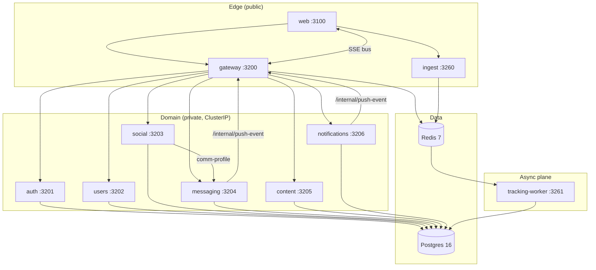

# Architecture

Boundaries, ownership, sync vs async paths, and where the seams are.

## 1. Topology

## 2. Data ownership matrix

Every Prisma model lives in [services/shared/prisma/schema.prisma](services/shared/prisma/schema.prisma) — one schema, many writers. Ownership is **operational**, not enforced:

| Model | Primary writer | Readers |
|---|---|---|
| `User`, `Session` | auth | users, gateway, all |
| `Profile`, `Profile*`, `Settings`, `PrivacySettings`, `Bookmark`, `SearchLog` | users | auth, social, gateway |
| `Like`, `Match`, `MatchRequest`, `MatchFeedback`, `MiamoMove`, `UserActivity`, `VibeCheck`, `Report`, `Block`, `DiscoverFilter` | social | messaging, notifications |
| `Chat`, `Message`, `Beat`, `BeatEvent` | messaging | social, notifications |
| `FeedPost*`, `Story*`, `Video*`, `Creativity*`, `Trend` | content | (read-only elsewhere) |
| `Notification`, `AuditLog` | notifications | all (via shared `audit.ts`) |
| `MatrimonialProfile`, `ShowcaseItem`, `AccessRequest`, `BioDataAccessRequest` | users + social | content (creativity matching) |
| `ConsentEvent`, `EventAggHourly`, `EventAggDaily`, `FeatureSnapshot`, `PairCompatCache`, `CfNeighbourCache` | tracking-worker | all algos via `SignalReader` |

**Why one schema?** Cross-service joins (e.g., social ranking a candidate's profile) are common and forcing them across HTTP would multiply latency. The trade-off is that breaking schema changes need coordinated deploys.

## 3. Sync vs async paths

| Path | Style | Why |
|---|---|---|
| User read/write (Discover, Messages, Profile) | **Sync** HTTP | <300ms p50 budget; user is waiting. |
| Notification fan-out (SSE) | **Pseudo-async** via gateway | `services/notifications/src/server.ts` calls `pushToUser()` → POSTs `/internal/push-event` → gateway emits SSE. Fire-and-forget from notifications' POV. |
| Tracking | **Fully async** via Redis Stream | Browser POSTs `/v1/track`; ingest XADDs; tracking-worker XREADGROUP. Events are lossy at the edge (return 204 even if Redis is down) but exactly-once downstream via consumer groups. |
| Feature materialisation | **Cron-like** in tracking-worker | 15-min `FeatureAggregator`, 30-min `EmbeddingWorker`, 60-min `EnrichmentWorker`, 24-h `DailyMatchWorker`. |
| Service → service calls | **Sync** HTTP, rare | Only `social → messaging` for comm-profile/sent-texts. |

## 4. Seams (where the system can be cut)

1. **Browser ↔ Gateway** — JSON over HTTPS. Versioned at `/api/v1/`. Can be replaced by mobile clients.
2. **Gateway ↔ Service** — internal-only HTTP. Replaceable with gRPC or a service mesh without touching the browser.
3. **Algorithm ↔ Data** — `SignalReader` interface ([signals.ts](services/shared/src/algo/signals.ts#L1)). Today `PrismaSignalReader`. Tomorrow could be a Redis feature store, a vector DB, or a remote feature service.
4. **Ingest ↔ Stream** — `XADD events:raw`. Could be swapped for Kafka with one file change in [services/ingest/src/stream.ts](services/ingest/src/stream.ts).
5. **Worker output ↔ Algorithm input** — `FeatureSnapshot.raw` JSONB column. Versioned via a `_v` field; readers tolerate missing keys.

## 5. Why microservices here (and not monolith)

Three reasons that justified the split:

- **Independent scaling**: ingest needs 2–10 small replicas (write-heavy, CPU-bound on JSON parse + HMAC); messaging needs few large replicas (long-lived SSE, sticky sessions); content is read-heavy and cacheable.
- **Fault isolation**: a runaway `dtm` ranker in social does not take down chats.
- **Deploy cadence**: the algo team ships tracking-worker and shared without touching auth.

The cost we accept: one schema and a shared Prisma client. We compensate with the data-ownership matrix above and code review on cross-service writes.

## 6. Cross-cutting concerns

- **AuthN**: JWT HS256 at gateway only. Domain services trust `x-user-id` + `x-internal-key`. See [docs/SECURITY.md](docs/SECURITY.md).
- **AuthZ**: in-handler checks (chat membership, match membership, bookmark ownership). Onboarding gate enforced at gateway via cached `GET /api/v1/profiles/me/completion`.
- **Rate limiting**: gateway only, Redis-backed, falls back to in-memory.
- **Idempotency**: `Idempotency-Key` header → Redis `SET NX EX 86400` ([services/shared/src/idempotency.ts](services/shared/src/idempotency.ts)). Used on message send and like.
- **Tracing**: `X-Request-ID` propagated by [requestId.ts](services/shared/src/requestId.ts).
- **Metrics**: Prometheus text endpoint on ingest (`/metrics`); other services use `prom-client` via [metrics.ts](services/shared/src/metrics.ts).
- **Logging**: structured JSON via [logger.ts](services/shared/src/logger.ts) with PII redaction.

## 7. What changed & why it's good

- **Before:** Ranking lived inside `social` with inline `prisma.user.findMany()` calls; tracking was synchronous DB writes from the browser path; one schema change required redeploying every service simultaneously.
- **After:** Algorithms are pure functions behind `SignalReader`; tracking is a Redis-Stream-buffered side channel that survives downstream outages; a 15-min `FeatureAggregator` decouples write latency from read latency.
- **Why it matters:** The user request path no longer carries any ML cost. Algorithms can be tested without a DB. Tracking can buffer 10M events during a Postgres incident and replay cleanly.
