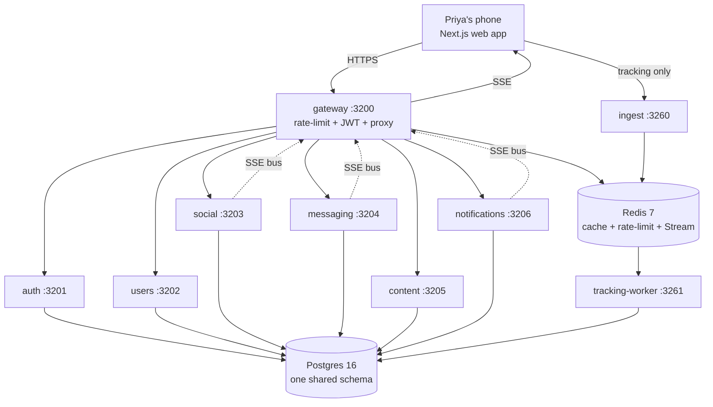
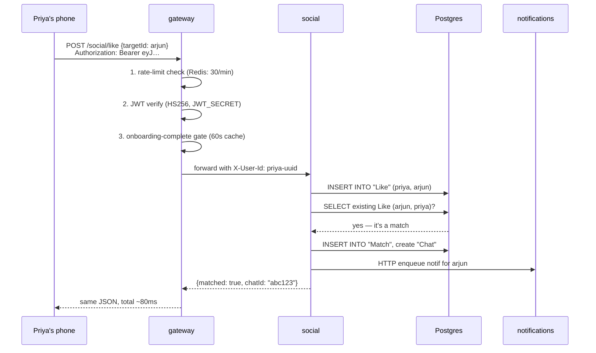

# Architecture — how the pieces fit

It's 9pm. Priya taps "Like" on Arjun. Her phone sends one HTTPS
request. Twelve milliseconds later, three different servers have
collaborated to record the like, check if Arjun liked her back, open
a chat room, queue a push notification, and fire a tracking event —
and her phone has been told "It's a match!" already.

This document explains the boxes and arrows that make that possible.

---

## 1. The whole picture in one diagram



That's it. **10 boxes** — 1 web app, 7 HTTP services, 1 ingest, 1 worker —
talking to **2 stores** (Postgres + Redis).

---

## 2. What each box owns, in one sentence

| Box                | Owns                                                          |
|--------------------|---------------------------------------------------------------|
| **web** (3100)     | Everything the user sees — Next.js 14 App Router              |
| **gateway** (3200) | The single front door — proxy + rate-limit + auth check + SSE |
| **auth** (3201)    | Signup, login, password reset, JWT issuance                   |
| **users** (3202)   | Profile, settings, search, bookmarks, blocks                  |
| **social** (3203)  | Discover, likes, matches, AI Match — the heart of dating      |
| **messaging** (3204)| Encrypted 1-to-1 chats, beats, suggested openers             |
| **content** (3205) | Feed, stories, videos, creativity prompts                     |
| **notifications**(3206)| In-app bell, push composition, nextNotifyAt scheduling   |
| **ingest** (3260)  | Edge endpoint for tracking events — validates and enqueues    |
| **tracking-worker**(3261)| Consumes the stream and rolls events into features      |
| **shared**         | Library (not a service) — Prisma schema, 17 algos, middleware |

---

## 3. Why we split it this way (four reasons in plain English)

1. **Independent deploy.** A bug fix in `messaging` ships without
   touching `auth`. Smaller blast radius, faster iteration.
2. **Blast radius.** If `content` starts crashing on a bad post, the
   feed degrades — but Priya can still log in, swipe, and chat.
3. **Scale only what's hot.** Discover gets 50× more traffic than
   password reset. We give `social` 10 pods and `auth` 2.
4. **Team ownership.** Each service has one CODEOWNERS team. A
   reviewer for `users` doesn't need to know how chats are encrypted.

---

## 4. The journey of one request, step by step

Priya taps Like. Here's exactly what happens:



Everything Priya does goes through this exact pattern:
**phone → gateway → service → Postgres → response**. The gateway is the
only thing exposed to the internet. Internal services bind to
`0.0.0.0` inside the cluster but are protected by NetworkPolicy.

---

## 5. Data lives in one Postgres, schema lives in `services/shared`

We use **one Postgres database** with **one schema** managed by Prisma
at [services/shared/prisma/schema.prisma](services/shared/prisma/schema.prisma).
80+ models. Each service connects with the same `DATABASE_URL` but only
queries the tables it owns.

Why one schema?
- **Joins are free** — `Match` joins `User` joins `Profile` in one SQL.
- **Migrations are atomic** — one `prisma migrate` command updates all.
- **Trade-off**: services aren't *truly* independent at the DB level.
  Acceptable for our scale; revisit if any service hits >100k req/s.

---

## 6. Redis does three jobs

| Job             | Used by         | Key shape                                |
|-----------------|-----------------|------------------------------------------|
| Rate-limit      | gateway         | `rl:{ip|user}:{route}` — TTL 60s         |
| Cache           | gateway, users  | `cache:onboard:{userId}` — TTL 60s       |
| Event stream    | ingest, worker  | `events:raw` — Redis Stream, consumer group `tw-rollup` |

The stream is the magic. Even if `tracking-worker` is down for an hour,
no events are lost — they queue on the conveyor belt. When it comes
back, it reads from the last acknowledged ID and catches up.

---

## 7. Real-time push (SSE)

When Arjun's chat tab is open and Priya sends a message, his screen
updates in **<200ms** without polling. This is done with
**Server-Sent Events** (one-way push from server to browser):

1. Arjun's tab opens `GET /events/sse` against the gateway.
2. Gateway keeps the connection open.
3. When `messaging` saves Priya's message, it `POST`s to a gateway
   internal endpoint `POST /internal/sse/publish` with `{userId, event}`.
4. Gateway pushes the event down Arjun's open SSE connection.
5. Arjun's tab renders the new message.

No WebSockets, no extra infra. SSE is enough for what we need today.

---

## 8. Run it locally in one command

```bash
docker compose up
```

That boots Postgres + Redis + all 10 services in dependency order. The
web app is at <http://localhost:3100>. Demo login `demo@miamo.app` /
`demo1234` (seeded by [scripts/seed-dtm.js](scripts/seed-dtm.js)).

---

## 9. What changed and why it's better

- **Before:** one monolith Express app with all routes mixed together.
  A bug in feed brought down login.
- **After:** 7 small HTTP services + 1 ingest + 1 worker, each
  independently deployable, each with its own CPU/memory budget.
- **Why Priya feels it:** when we ship a feed improvement we don't have
  to take login offline. When chat traffic spikes, only chat scales.
  No more "the app is down" because the wrong service caught fire.

---

## 10. If something breaks

| Symptom                              | First check                                     |
|--------------------------------------|-------------------------------------------------|
| Phone gets `502` on every request    | gateway pod healthy? `kubectl get pods -l app=gateway` |
| Login works but discover is empty    | social pod healthy + DB reachable from it       |
| Tracking events not affecting algos  | `tracking-worker` lag — `XINFO GROUPS events:raw` |

More in [RUNBOOK.md](RUNBOOK.md).
