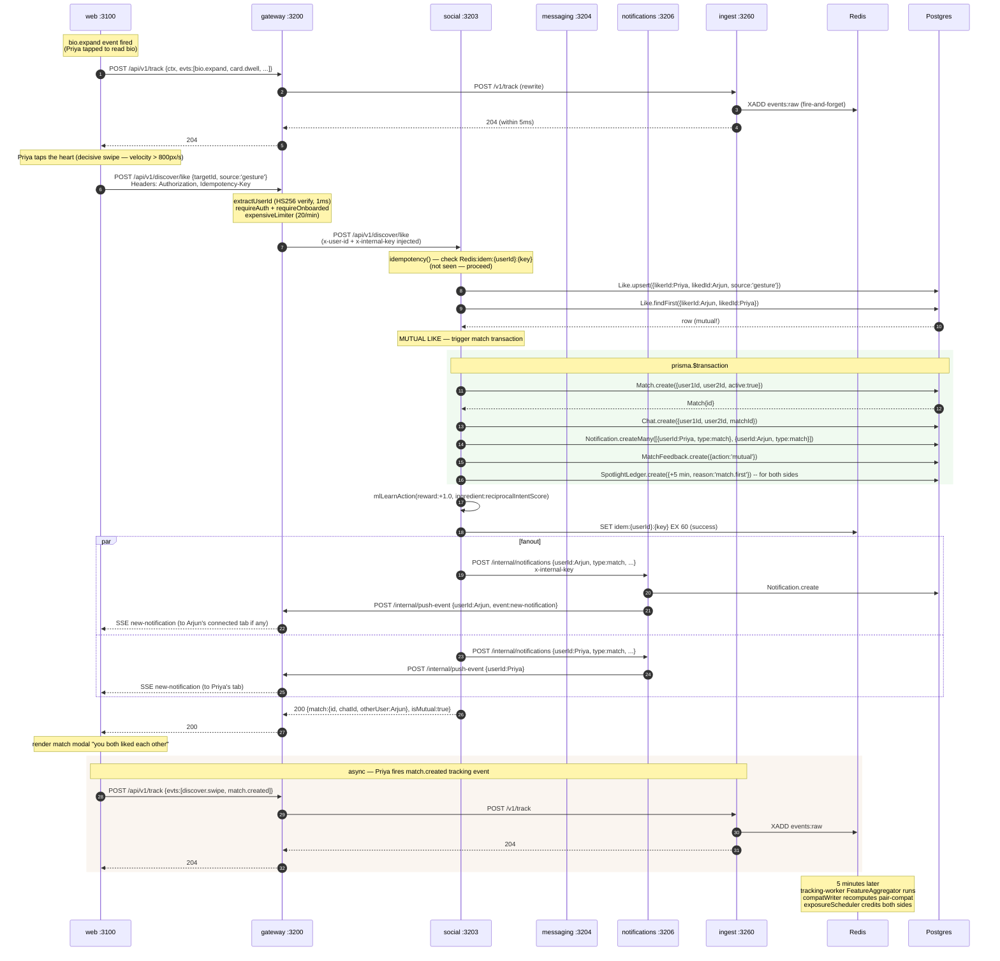
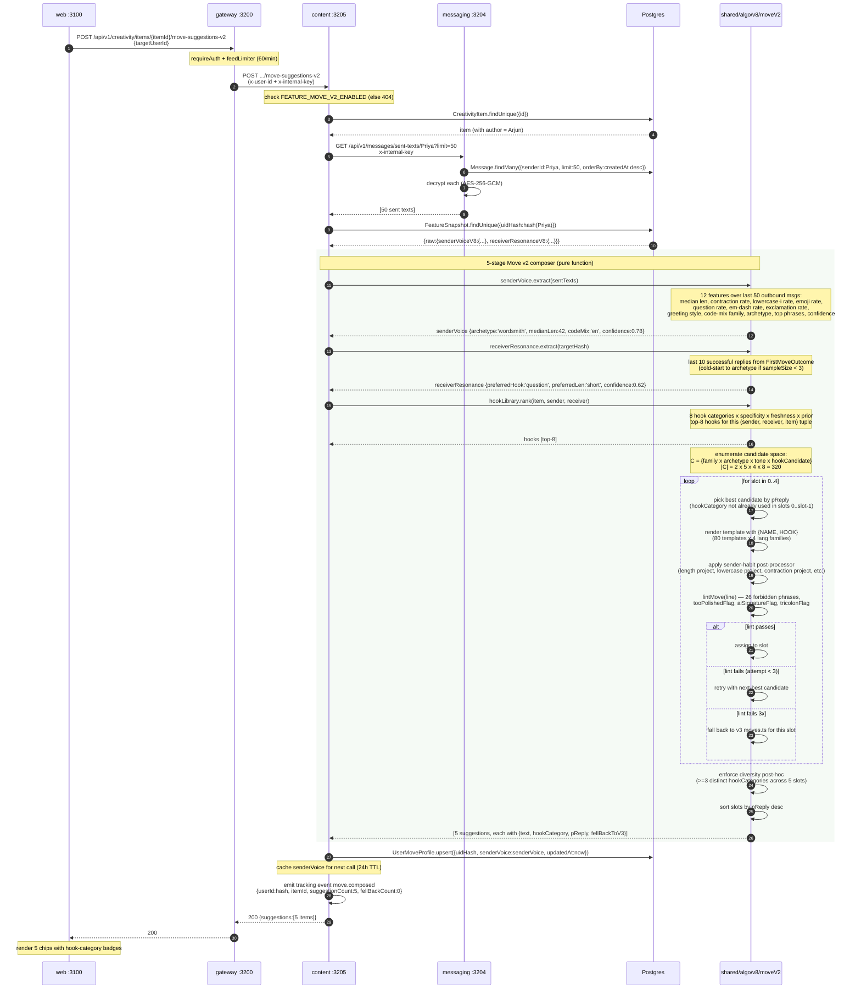
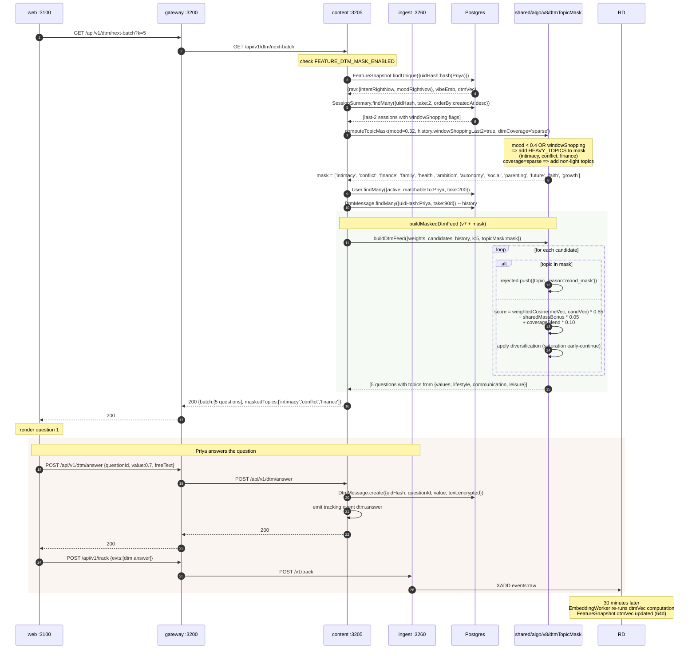
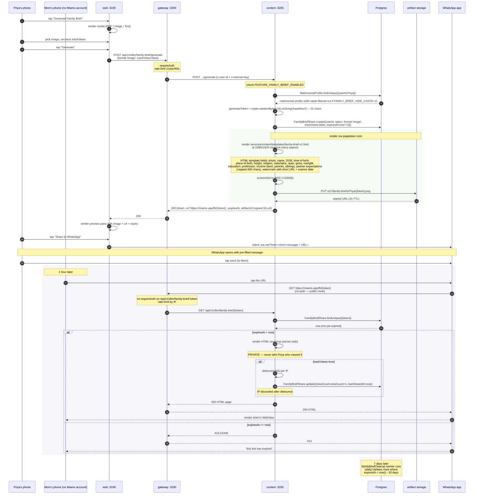
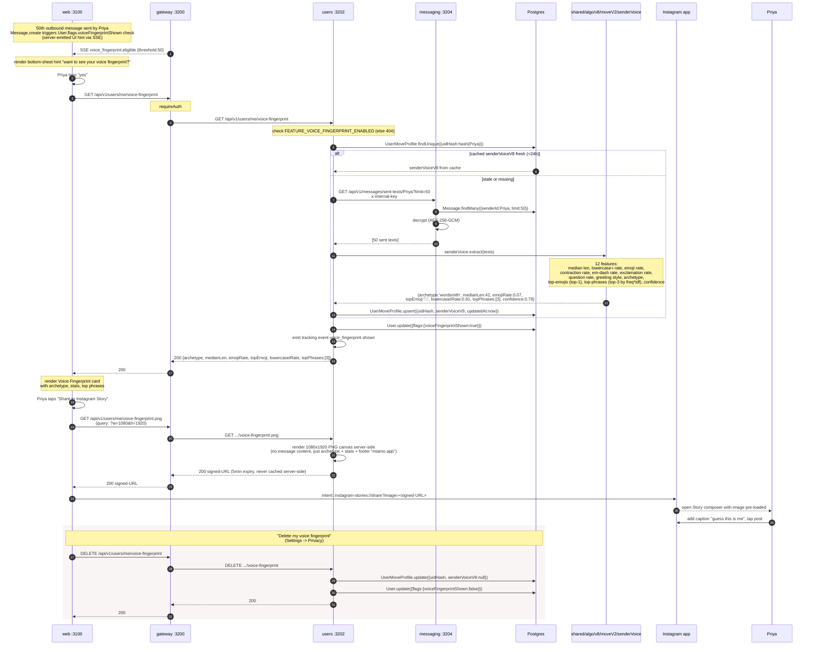

# Architecture — Miamo v3.6.0

> **Companion docs:** [`PRODUCT.md`](./PRODUCT.md) (what the app does), [`ALGORITHMS.md`](./ALGORITHMS.md) (how it ranks), [`TRACKING.md`](./TRACKING.md) (how it learns), [`DEVOPS.md`](./DEVOPS.md) (how it ships), [`SECURITY.md`](./SECURITY.md) (how it stays safe).

> **Tone note.** Every section in this document is **pair-written**: first the non-technical paragraph (what Priya, Arjun, Karan or Riya feels), then the technical paragraph (how the system does it). Read either half on its own; read both for the full picture.

---

## §1. Topology overview

### What Priya feels

It is 9:02pm on a Tuesday. Priya is in her bedroom in Powai. She taps a single heart on Arjun's photograph — the one of him backlit at Triund, holding a camera. Her thumb stays on the screen for less than a fifth of a second. From her side, the app is one piece of glass: one tap, one little animation, one moment of "did he like me back too." From the app's side, that one tap fans out across **eleven services**, three databases, a Redis stream, six middleware layers, four cache lookups, a JWT verify, a rate-limit check, a Prisma transaction that touches four tables, two SSE pushes, and seventeen tracking events. None of that complexity ever reaches her thumb. The app just feels right.

### How it works

Miamo is a **TypeScript monorepo of eleven services** sharing one Postgres 16 database, one Redis 7 cache, one canonical Prisma schema, and one tracking pipeline. The web app (Next.js 14 App Router) talks only to the **gateway** (port 3200) — never directly to a domain service. The gateway verifies the JWT, applies a stack of seven rate limiters, sets a strict CSP via helmet, then proxies the request to one of six domain services (auth, users, social, messaging, content, notifications). A separate **ingest** edge (port 3260) accepts tracking events from the same gateway origin, validates a 64-KB envelope, and writes to a Redis stream `events:raw`. A **tracking-worker** (port 3261) consumes the stream and runs **seventeen background loops** (13 from v3.5 + 4 new in v3.6.0) that fold raw events into hourly/daily aggregates, embeddings, pair-compat scores, exposure-credit ledgers, and weekly stable-match outputs. The **shared** library (no port) holds the canonical Prisma schema (71 models — 67 baseline + 4 new in v3.6.0), 53 v3.5 + 17 v3.6 = 70 algorithm modules, and every middleware primitive (validate, sanitize, errorHandler, requestId, idempotency, metrics, internal-auth).

The cardinal rules of this topology:

1. **No service calls Postgres except through its own `services/<name>/node_modules/.prisma/client`** — which is generated from `services/shared/prisma/schema.prisma`. (Operationally: all clients are generated from a single `services/shared && npx prisma generate`.)
2. **No service talks to another service directly except through the gateway** — except for two narrow service-to-service paths: `social → messaging` for comm-profile/sent-texts, and any service → `gateway POST /internal/push-event` for SSE fanout.
3. **No tracking event hits the DB synchronously** — ingest writes to a Redis stream, returns 204 within 5ms, and the worker materialises the signal asynchronously. Even if Redis is down, ingest still returns 204 (lossy by design).
4. **No raw user-id appears in tracking tables** — every uid is HMAC-SHA256 hashed to 22 base64url characters before persistence (`uidHash`). Rotating `TRACKING_HASH_SECRET` is the right-to-be-forgotten primitive.
5. **No feature ships without a flag.** Every v3.6.0 algorithm and surface is behind an `ALGO_V8_*` or `FEATURE_*` env flag. With all v3.6.0 flags off, the system is byte-identical to v3.5.

### Mermaid: the whole topology

```mermaid
flowchart LR
  subgraph Phone["Priya's phone"]
    P[Next.js 14 web app]
  end

  subgraph Edge["Edge"]
    GW[gateway :3200]
    ING[ingest :3260]
  end

  subgraph Domain["Domain services"]
    AU[auth :3201]
    US[users :3202]
    SO[social :3203]
    MS[messaging :3204]
    CO[content :3205]
    NO[notifications :3206]
  end

  subgraph Worker["Tracking pipeline"]
    TW[tracking-worker :3261]
  end

  subgraph Storage["Storage"]
    PG[(Postgres 16<br/>5432)]
    RD[(Redis 7<br/>6379<br/>streams + rate-limit)]
  end

  P -- "HTTPS /api/v1/*" --> GW
  P -- "HTTPS /api/v1/track" --> GW
  GW -- "/api/v1/auth/*" --> AU
  GW -- "/api/v1/users,profiles,settings,search,bookmarks,cities" --> US
  GW -- "/api/v1/discover,matches,ai-match,safety,vibe-check,access,weekly-top" --> SO
  GW -- "/api/v1/messages,beats" --> MS
  GW -- "/api/v1/feed,stories,videos,creativity,matrimonial,dtm,showcase,defer" --> CO
  GW -- "/api/v1/notifications" --> NO
  GW -- "/api/v1/track" --> ING
  ING -- "XADD events:raw" --> RD
  TW -- "XREADGROUP events:raw" --> RD
  TW -- "writes aggregates" --> PG
  AU --> PG
  US --> PG
  SO --> PG
  MS --> PG
  CO --> PG
  NO --> PG
  AU -. "rate-limit + idempotency" .-> RD
  US -. .-> RD
  SO -. .-> RD
  MS -. .-> RD
  CO -. .-> RD
  NO -. .-> RD
  GW -. "rate-limit + SSE state" .-> RD
  NO -- "POST /internal/push-event (SSE)" --> GW
  MS -- "POST /internal/push-event (SSE)" --> GW
  GW -- "SSE /api/v1/events/stream" --> P
```

Eleven services, two storage backends, one Redis stream, one set of HMAC-hashed user ids. That's the whole shape.

---

## §2. The 11 services

### What Priya feels

Priya never thinks about how the app is divided up. She sees Discover, Matches, Messages, DTM, Creativity, Notifications, and her own profile. Each of those is its own page; each loads in under a second; each remembers where she left off. The dividing lines that matter to engineers — between `users` and `social` and `messaging` and `content` — are invisible from her side.

### How it works

The repo's eleven services are split by **bounded context**: identity (auth), profile + preferences (users), the swipe stack (social), encrypted chat (messaging), feed / stories / videos / creativity / DTM (content), push delivery (notifications), the React shell (web), the proxy edge (gateway), the tracking edge (ingest), the asynchronous worker (tracking-worker), and the shared library (shared). All but `web`, `shared`, and `tracking-worker` are Express + Prisma microservices listening on a single port. The split is intentional — small enough that one engineer can hold a whole service in their head, large enough that we never have to do a distributed transaction across them.

### Top-level inventory

| Name | Port | Role |
|---|---|---|
| **web** | 3100 | Next.js 14 App Router — every screen Priya sees |
| **gateway** | 3200 | http-proxy gateway — rate-limit + JWT verify + CSP + CORS + SSE |
| **auth** | 3201 | Login, signup, OTP, refresh, trusted devices, OAuth (Google, Apple) |
| **users** | 3202 | Profile, settings, search, bookmarks, blocks, verification, **voice fingerprint (v3.6.0)** |
| **social** | 3203 | Discover (the swipe stack), matches, AI Match, **multi-objective ranking + fairness rerank + weekly Top-10 + why-explainer (v3.6.0)** |
| **messaging** | 3204 | Encrypted 1-to-1 chats (AES-256-GCM), Move suggestions, Beats, **anti-ghost (v3.6.0)** |
| **content** | 3205 | Feed, stories, videos, creativity, DTM, **Move v2 composer + Family Brief (v3.6.0)** |
| **notifications** | 3206 | Push notifications, intent-aware ranking, notifyTiming |
| **ingest** | 3260 | Tracking edge — validates 64-KB envelope and pushes to Redis Stream |
| **tracking-worker** | 3261 | 13 v3.5 worker loops + 4 new v3.6.0 loops = 17 total |
| **shared** | (no port) | Shared library: Prisma schema (71 models), 70 algo modules, middleware, schemas |

The non-web, non-shared services are all started by `scripts/start.sh` (local) or by the matching k8s Deployment in `k8s/templates/` (dev, staging, prod). The tracking pipeline (ingest + tracking-worker) is gated by `TRACKING_KILL=1` for emergency disable.

---

### §2.1 web (port 3100)

#### What Priya feels

She opens the app. The home tab is Discover. A swipe-able stack of cards is rendered before she's even put her phone down. She thumbs left and a card flies off; she thumbs right and a heart pulses. She drops into a chat; the messages are there before she scrolls. Everything feels native. Nothing buffers. That's the front door.

#### How it works

- **File:** `services/web/src/app/` (no `server.ts` — Next.js handles the listen)
- **Framework:** Next.js 14 App Router, React 18, TypeScript, Tailwind, shadcn/ui
- **Owned endpoints:** zero (all API calls go to the gateway via `services/web/src/lib/api.ts`)
- **Owned Prisma models:** none (no DB access from the web app; everything goes through gateway → service)
- **Internal dependencies:** **gateway only** — no direct calls to any domain service
- **External dependencies:** none beyond gateway (the SSE channel is also via gateway)
- **Notable middleware applied:** Next middleware in `services/web/src/middleware.ts` (CSP, auth-cookie redirect to `/login` for protected routes, request-id propagation header)
- **v3.6.0 surfaces added:**
  - `services/web/src/app/(main)/messages/components/VoiceFingerprint.tsx` — bottom-sheet for the 50-message reveal; canvas-rendered 1080×1920 share image
  - `services/web/src/app/(main)/messages/components/MoveV2Picker.tsx` — Move v2 composer (5 chips with hook-category badges)
  - `services/web/src/app/(main)/dtm/components/FamilyBrief.tsx` — Brief modal with PDF / Image / Text toggles + WhatsApp share
  - `services/web/src/app/(main)/discover/components/WhyCard.tsx` — "i" overlay with star ingredients + "show me less like this"
  - `services/web/src/app/(main)/discover/components/WeeklyTop10.tsx` — Sunday-curated Top-10 stack
  - `services/web/src/app/(main)/settings/page.tsx` — extended with 4 v3.6.0 consent toggles

The web app routes (under `services/web/src/app/(main)/`): `access, ai-match, beats, compatibility, creativity, date-ideas, date-planner, discover, dtm, feed, love-language, matches, messages, notifications, onboarding, premium, profile, safety, search, serious-mode, settings, showcase, stories, verify, vibe-check, videos`. Public surfaces: `/algorithm-transparency` (Article 22 GDPR), `/login`, `/signup`.

---

### §2.2 gateway (port 3200)

#### What Priya feels

She never sees it. The gateway is the doorman that nobody at the party meets. It checks her ticket (JWT), pats down her bag (CSP + sanitize headers), counts how many times she's been through the door (rate limiter), and quietly routes her to the right room. When she leaves, it makes sure the door closes behind her (SSE cleanup).

#### How it works

- **File:** `services/gateway/src/server.ts`
- **LOC:** 594 (verified `wc -l`)
- **Owned endpoints:** 6 first-party endpoints + ~28 proxy mounts
  - First-party: `GET /healthz`, `GET /readyz`, `GET /health` (legacy aggregator), `GET /api/v1/events/stream` (SSE), `POST /internal/push-event` (internal-key), `POST /api/v1/activity/track` (fire-and-forward)
  - Proxy mounts: tabulated in §8 below
- **Owned Prisma models:** none — the gateway never touches Postgres
- **Internal dependencies:** **all seven downstream services** plus ingest
- **External dependencies:** Redis (rate-limit store + SSE state), `JWT_SECRET`, in-memory SSE writer map
- **Notable middleware applied (in order):**
  1. `metricsMiddleware('gateway')` — Prometheus
  2. `requestId` — generates `x-request-id` if absent
  3. `helmet` with strict CSP (`defaultSrc 'self'`, `frameAncestors 'none'`, HSTS 1y preload, no inline scripts)
  4. `cors` — origin allowlist from `ALLOWED_ORIGINS` (default `http://localhost:3100`), credentials, 24h preflight
  5. `compression` — **skips `/api/v1/*` proxy paths** (already-compressed downstream responses)
  6. `cookieParser`
  7. `morgan('short')` (skipped in test)
  8. **`globalLimiter`** — 5000 req / 15 min, keyed by `x-user-id || req.ip`, Redis-backed (`rl:global:`)
  9. `sanitizeHeaders` — strips `x-forwarded-host/-original-url/-rewrite-url/-forwarded-server/-forwarded-proto`; validates `Authorization` length ≤ 2KB
  10. `extractUserId` — HS256 JWT verify via `JWT_SECRET`, injects `x-user-id` + `x-internal-key` headers for downstream
- **Per-route limiters:** `authLimiter` (30/15min prod, IP-keyed), `forgotPasswordLimiter` (5/hr), `refreshLimiter` (60/15min prod), `reportLimiter` (30/24h), `expensiveLimiter` (20/min — discover + search), `feedLimiter` (60/min — feed/stories/videos/creativity/showcase)
- **Per-route guards:** `requireAuth` (401 if no `x-user-id`), `requireOnboarded` (calls `users:/api/v1/profiles/me/completion`, 60s in-memory cache, 403 `ONBOARDING_INCOMPLETE` when score < threshold)
- **Kill switches:** `TRACKING_KILL=1` short-circuits `/api/v1/track` to 204 before proxying. `CORS_BYPASS=true` is a dev-only escape hatch.
- **SSE:** `sseClients = Map<userId, Set<Response>>`, max 10 connections/user (oldest evicted), 25s heartbeat (`: keepalive`), proactive `token-expired` 30s before JWT exp
- **Graceful shutdown:** closes all SSE writers on `SIGTERM`/`SIGINT` with a 10s hard kill

The gateway is the **only service web talks to**. It is also the only service exposed on the public internet. Downstream services live on a private network and trust the `x-internal-key` header that the gateway injects after JWT verification.

---

### §2.3 auth (port 3201)

#### What Priya feels

She signs up by tapping a phone number. An SMS arrives in three seconds with a six-digit code. She types it. A profile-setup wizard appears. Two minutes later she's swiping. If she goes back tomorrow on the same phone, she's not asked for the code again (trusted device). If she logs in from her sister's iPad, the app asks for 2FA. None of that ceremony is intrusive; all of it is auditable.

#### How it works

- **File:** `services/auth/src/server.ts`
- **LOC:** ~700 (not individually reported in KB; part of the 8,616-LOC `server.ts` total minus the four big ones)
- **Owned endpoints:** **23** routes under `/api/v1/auth/*`
  - Signup (3): `/signup/start`, `/signup/verify`, `/signup/complete`
  - OAuth (2): `/google`, `/apple`
  - OTP passwordless (2): `/otp/start`, `/otp/verify`
  - Email/password (3): `/register`, `/login`, `/login/2fa`
  - Session/device (5): `/logout`, `/sessions`, `/sessions/:id/revoke`, `/devices`, `DELETE /devices/:id`
  - Email verification (2): `/email/send-otp`, `/email/verify-otp`
  - Phone verification (2): `/phone/send-otp`, `/phone/verify-otp`
  - Misc (4): `/me`, `/refresh`, `PUT /password`, dev `/__dev/otp/peek`
- **Owned Prisma models:** `User`, `Otp`, `TrustedDevice`, `VerificationSubmission`, `Session`, `AuditLog` (writes). Reads from `Profile`, `Settings`, `PrivacySettings`, `ProfilePhoto` for `/me`.
- **Internal dependencies:** none (auth is a leaf — no downstream service calls)
- **External dependencies:** `google-auth-library` (lazy-loaded), `jose` (Apple JWKS, lazy-loaded), `bcrypt` (cost 12), `JWT_SECRET`, refresh-cookie domain
- **Notable middleware applied:** `applyBaseMiddleware(app, { jsonLimit: '1mb', rateLimitMax: 1000, serviceName: 'auth' })` — installs `helmet`, `requestId`, `metricsMiddleware`, `cors`, `express.json`, `cookieParser`, `morgan`, `rateLimit(2000/15min)`. Plus a **local** `authMiddleware` (not the shared internal-key one) — accepts EITHER `(x-user-id + x-internal-key)` for service-to-service OR `Authorization: Bearer <HS256 JWT>` for end-users. Plus `installHealthRoutes` and `errorHandler` tail.
- **Token model:** access JWT 15 min, refresh JWT 30 days. Refresh lives in **httpOnly cookie `miamo_rt`** (SameSite=none/secure prod, lax dev). Body fallback for legacy clients.
- **Timing-attack mitigation:** failed login still runs `bcrypt.compare` against a sentinel hash to equalise response time.
- **Audit:** every state-change writes via `auditLog(prisma, userId, action, meta)`.

---

### §2.4 users (port 3202)

#### What Priya feels

This is where she lives. Her profile photos, her prompts, her settings, her bookmarks, her search bar. The "Personalization & Privacy" toggle in Settings is new in v3.6.0 — it lets her turn off mood inference, behavioural ranking, cross-user inference, and algorithm transparency individually. The voice-fingerprint reveal modal is also a users-service surface: after fifty outbound messages, she sees a card that says "you write like a wordsmith — your top phrase is 'how was your day'." She can share it to Instagram. She can also delete it forever.

#### How it works

- **File:** `services/users/src/server.ts`
- **LOC:** ~900 (not individually reported)
- **Owned endpoints:** **31** routes (v3.5) + **2** v3.6.0 additions = **33**
  - Users (2), profiles/me (6), settings (8 — extended with 4 new consent toggles in v3.6.0), search (1), bookmarks (3), user-data (5), cities (2 public), verify (3), **voice-fingerprint (1) [v3.6.0]**
- **Owned Prisma models:** writes to `User`, `Profile`, `ProfilePhoto`, `ProfilePrompt`, `ProfileInterest`, `Settings`, `PrivacySettings`, `Block`, `Bookmark`, `UserData`, `SearchLog`, `VerificationSubmission`. Cascade-deletes `Notification`, `Session` on user delete.
- **Internal dependencies:** none for primary paths. Uses shared algo `rerankSearch` (flag-gated) and v6.8 personalization overlay.
- **External dependencies:** Redis (rate-limit, idempotency), in-memory cities dataset (sub-2ms search)
- **Notable middleware applied:** `applyBaseMiddleware(app, { jsonLimit: '10mb', serviceName: 'users' })` + `createInternalAuthMiddleware` on **all routes except `/api/v1/cities/*`** (cities is public — needed pre-login during onboarding) + `installHealthRoutes` + `errorHandler` tail.
- **v3.6.0 additions:**
  - **`PUT /api/v1/settings` extended** with four new consent fields: `moodInferenceEnabled`, `behavioralRankingEnabled`, `crossUserInferenceEnabled`, `algorithmicTransparency`, `sessionIntentEnabled`. Always-on (no flag — privacy controls are not feature-flagged).
  - **`GET /api/v1/users/me/voice-fingerprint`** (gated by `FEATURE_VOICE_FINGERPRINT_ENABLED`) — returns archetype + top emoji + lowercase-i rate + top phrases from `UserMoveProfile.senderVoice` / `FeatureSnapshot.raw.senderVoiceV8`. PNG share variant at `/api/v1/users/me/voice-fingerprint.png` (1080×1920, signed URL, 5-min expiry, never cached server-side).
- **Profile-completion engine:** `recomputeAndPersistCompletion` runs on every profile mutation. When score hits 100, awards one-time +10 minutes via `awardProfileComplete` (Spotlight ledger). Gateway's `requireOnboarded` calls this service's `/api/v1/profiles/me/completion` and caches the result for 60 seconds.
- **Verification:** in dev (`AUTO_APPROVE_VERIFY !== 0`), submitted selfies auto-approve via an in-process `setTimeout(3000)`. Prod requires a human reviewer or the internal admin endpoint.

---

### §2.5 social (port 3203) — the heart of v3.6.0

#### What Priya feels

This is where she meets Arjun. Discover is here. So is AI Match. So is the new Weekly Top-10 stack that refreshes every Sunday at midnight with ten profiles curated by a Gale-Shapley stable-matching algorithm. So is the new "why am I seeing this?" overlay — every card has a small `i` in the corner; tapping it reveals the top three reasons that card is in her stack ("shared interest: hiking — three stars", "similar reply pace — two stars", "chronotype match — one star"). There's also a "show me less like this" button that dampens the matching ingredient by 10% for the next seven days. The most important thing the social service does in v3.6.0 is **earned visibility**: the order of profiles she sees is no longer "who bought a boost" but "who earned exposure credits by being a thoughtful user this week."

#### How it works

- **File:** `services/social/src/server.ts`
- **LOC:** **2,985** (verified `wc -l`; up from 2,713 in v3.5 because of the four v3.6.0 routes)
- **Owned endpoints:** **54 v3.5 routes** + **3 v3.6.0 routes** + 1 split (`/discover` gains v8 rescore + fairness rerank as inline rescore stages) = **57+** routes
  - Discover (15 + v8 rescore): swipe-stack, like/pass/superlike, move, move-suggestions, filters
  - **`/weekly-top` [v3.6.0]**
  - **`/discover/:targetId/why` [v3.6.0]**
  - Matches (19): list/accept/reject/unmatch/report/block/incoming
  - Vibe-check (4), AI-match (3), Safety (5), Access (6), Activity (2)
- **Owned Prisma models:** writes to `Like`, `Match`, `MatchRequest`, `MatchFeedback`, `MiamoMove`, `Chat`, `Message` (creation only on match), `Notification`, `UserActivity`, `VibeCheck`, `DiscoverFilter`, `AccessRequest`, `Report`, `Block`. **v3.6.0 reads `WeeklyTopMatch`, `ExposureLedger`, `ExposureCredit`** to compose Top-10 and weight Discover.
- **Internal dependencies:** **messaging** (service-to-service `GET /api/v1/messages/comm-profile/:userId` + `/sent-texts/:userId` for AI Move generation) + shared spotlight `awardMatchMilestones`
- **External dependencies:** Redis (rate-limit + idempotency on `/discover/like`), ML state in `UserData` rows of type `ml_preferences` / `ml_bandit`
- **Notable middleware applied:** `applyBaseMiddleware(app, { jsonLimit: '10mb', serviceName: 'social' })` + `createInternalAuthMiddleware` + `idempotency()` on `POST /discover/like` + `validate({ body: ... })` on every body-bearing route + `installHealthRoutes` + `errorHandler` tail.
- **v3.6.0 flag set:**
  - `ALGO_V8_DISCOVER_RANKER_ENABLED=1` (also `ALGO_V8_DISCOVER_RAMP=<float>` for gradual rollout) — multi-objective rescore inside `/discover` (relevance × earnedVisibility × fairness × recencyFreshness × intentFit)
  - `ALGO_V8_FAIRNESS_RERANK_ENABLED=1` — Singh-Joachims adjacent-swap rerank of top-50 (`tests/algo/no-caste-in-ranker.test.ts` asserts caste is not used)
  - `FEATURE_WEEKLY_TOP_ENABLED=1` — exposes `GET /api/v1/weekly-top` (404 otherwise)
  - `FEATURE_WHY_EXPLAINER_ENABLED=1` — exposes `GET /api/v1/discover/:targetId/why`
- **Imports from `services/shared/src/algo/v8/`:** `multiObjective.scoreMultiObjective` + `MO_WEIGHTS`, `fairnessRerank.fairnessRerank` + `FairnessCandidate`, `exposureCredits.meetsDailyTop10Threshold`
- **Auto-match transaction:** on mutual like, the service runs `prisma.$transaction(() => createMatch + createChat + createNotificationsX2 + awardMatchMilestones)`. Tracking-worker downstream picks up the `match.created` event and recomputes both sides' compat caches on the next 15-min loop.

---

### §2.6 messaging (port 3204)

#### What Priya feels

The chat room. Arjun has matched her back. She opens the chat. The "✨ Suggest" button next to the composer is new in v3.6.0 — when she taps it, the Move v2 composer fires five hand-tailored opener lines that read like *she* would write them (her sender voice, her typical length, her code-mix of Hindi-English, her hook category mix). She picks "okay but the sunrise photos — what was the trek?" and hits send. Three days later, when Arjun has been silent, she sees something in the inbox: "Move expires in 4 hours — 1 Spotlight minute on the line." That's anti-ghost. She had skin in the game.

#### How it works

- **File:** `services/messaging/src/server.ts`
- **LOC:** **1,187**
- **Owned endpoints:** **34** routes (22 chat + 12 beats)
- **Owned Prisma models:** writes to `Chat`, `Message`, `Beat`, `BeatEvent`, `Notification`. **v3.6.0 extends `Message` with `audioUrl`, `audioDurationMs`, `transcript`, `transcriptStatus`** (voice messages, behind `FEATURE_VOICE_CHAT_ENABLED`).
- **Internal dependencies:** **gateway SSE** via `createPushToUser()` (POST to `/internal/push-event`) for `new-message`, `message-sent`, `new-notification`, `beat-*` events
- **External dependencies:** crypto AES-256-GCM (key derived via `scryptSync(env.encryptionKey, env.encryptionSalt, 32)`); stored format `enc:<iv_hex>:<authTag_hex>:<ciphertext_hex>`; random IV per message; plain-text fallthrough for legacy/system messages
- **Notable middleware applied:** `applyBaseMiddleware(app, { jsonLimit: '10mb', serviceName: 'messaging' })` + `createInternalAuthMiddleware` + `idempotency()` on `POST /chats/:chatId/messages` (only) + `installHealthRoutes` + `errorHandler` tail
- **v3.6.0 additions:**
  - **Anti-ghost** wired into `POST /chats/:chatId/messages` (behind `FEATURE_ANTI_GHOST_ENABLED`). When Karan sends the **first message** in a chat, the service:
    1. Calls `services/shared/src/algo/v8/antiGhost.ts` to compute a deposit (1 Spotlight minute by default; 1.5× for premium users)
    2. Writes the deposit row via `spotlight-ledger`
    3. Emits a `chat.deposit_made` tracking event
    4. Sets `Message.depositExpiresAt = now + 72h`
  - When Riya replies, the worker `chatDepositReconciler.ts` (every 5 min) writes a `+1 Spotlight bonus` and emits `chat.reply_bonus_paid`. If 72h passes without a reply, the deposit is burned (`chat.ghost_burn`).
- **Service-to-service exposure:** two endpoints accept either `(x-user-id + x-internal-key)` OR self-call: `GET /api/v1/messages/comm-profile/:userId` (aggregates last 100 messages → avgWordCount/emojiPerMessage/questionRatio/avgResponseTimeSec/formalityScore) and `GET /api/v1/messages/sent-texts/:userId` (last ≤30 decrypted sent texts for the user — used by AI Move generation in social and Move v2 composer in content).
- **Beats:** ephemeral streak messaging. Passive cleanups on every `GET /beats`: ephemeral snaps cleared at 1h, beats marked lost at 48h.

---

### §2.7 content (port 3205) — also heavy in v3.6.0

#### What Priya feels

This is the wider world of the app: Feed (long-form), Stories (24h), Videos, Creativity (talent showcase), DTM (the daily deep-compat match), Matrimonial bio-data, Showcase, and the new Family Brief in v3.6.0. In Creativity, when she taps "✨ Suggest" on Arjun's photo of the Sikkim ridge, the **Move v2 composer** generates five opener lines in her voice — that's a content-service surface because the source artefact (the photo) lives in Creativity. In DTM, the new "topic mask" quietly suppresses heavy topics (intimacy, conflict, finance) when her mood is below 0.4 or she's been window-shopping. And the Family Brief — that's the magic moment. She generates a one-page biodata PDF (or 1080×1920 image, or plain text) with one tap, and shares the link to her mother on WhatsApp. The link is a 22-char token; it expires in seven days; her mother never sees a Miamo login.

#### How it works

- **File:** `services/content/src/server.ts`
- **LOC:** **2,173** (v3.5) + new v3.6.0 surfaces
- **Owned endpoints:** **79 v3.5 routes** + **4 v3.6.0 endpoints** = **83**
  - Feed (7), Stories (13), Videos (6), Creativity main (12), Creativity-Spotlight (14), Matrimonial (18), Showcase (5), Defer (4)
  - **v3.6.0:** `POST /api/v1/creativity/items/:id/move-suggestions-v2`, `POST /api/v1/dtm/family-brief/generate`, `GET /api/v1/dtm/family-brief/:token` (public, no auth), `POST /api/v1/dtm/next-batch` extended with DTM mask
- **Owned Prisma models:** writes to `FeedPost`, `FeedReaction`, `FeedComment`, `Story`, `StoryView`, `StoryLike`, `StoryComment`, `Video`, `VideoReaction`, `VideoComment`, `CreativityItem`, `CreativityReaction`, `CreativityComment`, `CreativityView`, `CreativitySave`, `Trend`, `MatrimonialProfile`, `BioDataAccessRequest`, `DtmMessage`, `ShowcaseItem`, `DeferredItem`, `SpotlightLedger`, `SpotlightAward`, `TrendQueue`. **v3.6.0 owns `FamilyBriefShare`.**
- **Internal dependencies:** shared `spotlight-ledger`, `creativity-track`, in-process `startTrendingWorker` (a `setInterval`-style background loop inside the content service), `mountCreativitySpotlight` mount
- **External dependencies:** `puppeteer-core` (Family Brief PDF/PNG render, v3.6.0 only); shared crypto for `FamilyBriefShare.token` generation (`crypto.randomBytes(16).toString('base64url')`)
- **Notable middleware applied:** `applyBaseMiddleware(app, { jsonLimit: '10mb', serviceName: 'content' })` + `createInternalAuthMiddleware` (except `/api/v1/dtm/family-brief/:token` which is public) + `installHealthRoutes` + `errorHandler` tail. After `app.listen()`: `mountCreativitySpotlight(app, prisma, authMiddleware)` and `startTrendingWorker(prisma)`.
- **v3.6.0 additions:**
  - **`POST /api/v1/creativity/items/:id/move-suggestions-v2`** (behind `FEATURE_MOVE_V2_ENABLED`) — runs the 5-stage composer (`services/shared/src/algo/v8/moveV2/composer.ts`): extract sender voice, extract receiver resonance, pick hook, render template (across 80 templates × 4 language families), lint and return 5 suggestions with hook-category diversity (≥3 distinct categories across the 5 slots). Fallback to v3 (`moves.ts`) on lint failure ≥3 times.
  - **`POST /api/v1/dtm/family-brief/generate`** (behind `FEATURE_FAMILY_BRIEF_ENABLED`) — writes a `FamilyBriefShare` row, runs puppeteer-core to render PDF / 1080×1920 PNG / plain text, returns `{ token, url, expiresAt, artifactUrl (signed S3) }`. Rate limit: 1 generate per user per 60s.
  - **`GET /api/v1/dtm/family-brief/:token`** (public, no auth) — serves the rendered brief by token; debounced view tracking (60s per IP, IP discarded); 410 GONE after `expiresAt`.
  - **`POST /api/v1/dtm/next-batch` with DTM mask** (behind `FEATURE_DTM_MASK_ENABLED`) — caller computes `topicMask` via `computeTopicMask(mood, history, coverage)` and passes to `buildMaskedDtmFeed`. When flag is off, byte-identical to v3.5 v7 behaviour.

---

### §2.8 notifications (port 3206)

#### What Priya feels

Her badge says **3**. She taps it. Three notifications, ranked: the new match with Arjun first (intent: serious), a profile-view second (intent: casual), a marketing nudge buried at the bottom. The order is not chronological — it's relevance-aware. If she ignored the marketing pings yesterday, the system learned and pushed them down. If she opened every match-notif at 9pm sharp, the system noticed and started delivering match notifs only at 9pm.

#### How it works

- **File:** `services/notifications/src/server.ts`
- **LOC:** ~400
- **Owned endpoints:** **7** routes
  - `GET /api/v1/notifications` (paged), `GET /api/v1/notifications/count`, `POST /:id/read`, `POST /read-all`, `POST /mark-read` (bulk), `POST /internal/notifications` (s2s create), `POST /internal/notifications/schedule` (v4 flag-gated)
- **Owned Prisma models:** writes to `Notification`. Reads `FeatureSnapshot`, `EventAggDaily` via `PrismaSignalReader` for the v6.8 rerank.
- **Internal dependencies:** **gateway** for SSE fanout (`createPushToUser()` → POST `/internal/push-event`)
- **External dependencies:** Redis (rate-limit only)
- **Notable middleware applied:** `applyBaseMiddleware(app, { jsonLimit: '1mb', serviceName: 'notifications' })` + `createInternalAuthMiddleware` + `installHealthRoutes` + `errorHandler` tail
- **Ranking:** v6.8 personalization on list endpoint — `recency(48h half-life) × intentRelevance × readPenalty(0.3 if read)`. When `v4RankEnabled('notifications')`, `POST /internal/notifications` stamps `data.scheduledFor` via `nextNotifyAt({ peakHours, lastSent, minSpacingSec: 1800 })` (non-breaking — consumers may ignore).

---

### §2.9 ingest (port 3260)

#### What Priya feels

She never sees this either. Every action she takes — every card impression, every dwell, every scroll-stop, every Move-suggestion-accepted — fires a tracking event from the web app. The ingest service is what catches them. It doesn't care who she is (it sees only a HMAC hash); it doesn't slow her down (it returns 204 within 5ms whether the event was recorded or dropped); it never blocks her phone on a Redis outage (lossy at edge by design).

#### How it works

- **File:** `services/ingest/src/server.ts`
- **LOC:** ~200 (v3.1 tracking edge — intentionally minimal)
- **Owned endpoints:** 6 + catch-all
  - `POST /v1/track` — accept tracking envelope (the only path that matters)
  - `POST /v1/track/forget` — RTBF acknowledgement (202)
  - `GET /v1/track/healthz`, `GET /health`, `GET /readyz`, `GET /metrics`
- **Owned Prisma models:** **none directly.** Writes to Redis Stream `events:raw`. Downstream tracking-worker materialises into Postgres.
- **Internal dependencies:** none
- **External dependencies:** Redis Streams (XADD, fire-and-forget); `prom-client` for Prometheus counters; shared `hashUid` for HMAC-SHA256 reduction
- **Notable middleware applied:** **does NOT use `applyBaseMiddleware`.** Hand-rolled minimal stack:
  - `app.disable('x-powered-by')`
  - `helmet({ contentSecurityPolicy: false })`
  - `cors` — origin allowlist, methods `POST/GET/OPTIONS` only, no credentials
  - `express.json({ limit: '64kb' })` — tight body cap; anything bigger is abuse
  - **`perDeviceLimiter`** — 60/min/device, key = `X-Track-Device` || `body.ctx.did` || `req.ip`. **Silent drop on overflow (204) — never tells scrapers**.
- **Hard rules:** (1) No synchronous DB writes — XADD only. (2) **Always 204** — even on Redis outage, parse fail, kill switch, or `DNT: 1`. (3) Honors `TRACKING_KILL` env + `DNT: 1` header. (4) Rate-limited drops silently 204.
- **Envelope:** `SCHEMA_VERSION = 1`, `MAX_EVENTS_PER_BATCH = 50`, `MAX_ENVELOPE_BYTES = 32 * 1024`. Top-level `.strict()`: `{ctx: ContextHeader, evts: TrackEvent[1..50]}`. Stream record per evt: `{uidHash, did, sid, ts, evt, payload}`.

---

### §2.10 tracking-worker (port 3261)

#### What Priya feels

A quiet second mind. While she's scrolling through Discover, a background process every five minutes is folding her clicks into hourly buckets, recomputing her chronotype (she opens the app before 10am → morning archetype), updating her behavioural embedding, recomputing her top-20 pair-compat partners, deciding whether she's earned a Top-10 slot this week, checking whether the discover stack is showing too many men relative to women in her age band. None of that ever blocks her UI. None of it ever touches her UID in cleartext.

#### How it works

- **File:** `services/tracking-worker/src/index.ts` (entry) + 17 worker modules under `services/tracking-worker/src/`
- **Owned endpoints:** `GET /healthz`, `GET /v4/status` (returns full algo registry — 17 algos eagerly imported)
- **Owned Prisma models:** writes to `EventAggHourly`, `EventAggDaily`, `FeatureSnapshot`, `PairCompatCache`, `SessionSummary`, `FocusAffinityHourly`, `UserWeightProfile`, `UserMoveProfile`, `SafetyAgg`, `FirstMoveOutcome`, `DeferredItem`. **v3.6.0 writes `ExposureLedger`, `ExposureCredit`, `WeeklyTopMatch`** (plus reads `FairnessAuditDaily`).
- **Internal dependencies:** Redis Streams (`XREADGROUP events:raw`, group `rollup`)
- **External dependencies:** Postgres (the only persistence target)
- **Notable middleware applied:** none (worker process, no HTTP routes besides health)
- **Process gating:** `TRACKING_KILL=1` skips all loops; `ALGO_V4_WORKERS_ENABLED=1` gates Enrich + DailyMatch; the 4 v3.6.0 loops require their own flags (see §4)
- **Concurrency rules:** Ingest is stateless-horizontal. Rollup is shardable via Redis consumer group. **All other loops are NOT shardable** — double-write would double-count. Run single worker replica.

---

### §2.11 shared (no port)

#### What Priya feels

She never touches this. It's the library every other service `require`s. But every algorithm she experiences — every ranking, every Move suggestion, every "why" explanation, every fairness rerank — lives inside `services/shared/src/algo/`. Every Prisma query every service runs goes through the canonical schema in `services/shared/prisma/schema.prisma`. Every middleware (validate, sanitize, errorHandler, requestId, idempotency, metrics) lives in `services/shared/src/`. The shared library is the connective tissue.

#### How it works

- **File root:** `services/shared/src/` (with `prisma/schema.prisma` as the canonical schema)
- **Owned Prisma schema:** `services/shared/prisma/schema.prisma` — **71 models** as of v3.6.0 (67 baseline + 4 new: `ExposureLedger`, `ExposureCredit`, `WeeklyTopMatch`, `FamilyBriefShare`). Mirrored verbatim into `services/{content,social,users}/prisma/schema.prisma` (drift fixed in commit `add3721`).
- **Owned modules:**
  - **`algo/` — 70 algorithm modules**: 17 v3.5 ranked algos (`forYou`, `aiPicks`, `aiMatch`, `new`, `active`, `verified`, `serious`, `cf`, `dtm`, `moves`, `messageSuggest`, `beats`, `notifyTiming`, `searchAugment`, `feedAugment`, `postImpressionRerank`, `registry`) + V7 modules (`batchLadder`, `dtmFeedV7`, `moveVoice`, `rightNow`, `surfaceLearner`) + learners (`learner`, `learnerRewards`, `contextAwareRewards`, `preferenceSnapshot`) + helpers (`flags`, `hash`, `lru`, `math`, `seedRandom`, `signals`) + **v3.6.0 `algo/v8/` — 17 pure modules** (`intentRightNow`, `moodRightNow`, `polarity`, `depthOfEngagement`, `exposureCredits`, `galeShapley`, `fairnessRerank`, `multiObjective`, `moveV2/{senderVoice,receiverResonance,hookLibrary,codeMix,composer}`, `dtmTopicMask`, `dtmBatch`, `antiGhost`, `festivalHooks`).
  - **`track/`** — `events.ts` (canonical `TrackEventName` union), `hash.ts` (HMAC-SHA256 22-char base64url), `envelope.test.ts`, `routeNormalize.ts`, `v6Validators.ts` (41 Zod boundary validators)
  - **Middleware:** `validate.ts`, `sanitize.ts`, `errorHandler.ts`, `requestId.ts`, `idempotency.ts`, `metrics.ts`, `service.ts` (`createPrisma`, `applyBaseMiddleware`, `installHealthRoutes`, `createInternalAuthMiddleware`, `createPushToUser`)
  - **Domain helpers:** `completion.ts`, `dtmCompatibility.ts`, `spotlight-ledger.ts`, `creativity-track.ts`, `verification.ts`, `audit.ts`, `env.ts`, `schemas.ts` (Zod primitives), `logger.ts`, `visibility.ts`, `cities.ts`, `fieldMeta.ts`, **`exposure-ledger.ts` [v3.6.0]**, **`premium.ts` [v3.6.0]**
- **Internal dependencies:** none (it is the root)
- **External dependencies:** Prisma, Zod, `prom-client`, `crypto`, `bcrypt` (auth-adjacent only)
- **Notable middleware applied:** N/A (the library)

The crucial operational gotcha (from the MEMORY index): **all services load `@prisma/client` from `services/shared/node_modules`**. After any schema change, you must `cd services/shared && npx prisma generate` and restart every service. Mirror schemas in `services/{content,social,users}` are kept in sync manually.

---

## §3. Mermaid topology diagram (the canonical pin-up)

### What Priya feels

One tap, four databases, eleven services. She'll never know.

### How it works

The diagram below is the single canonical topology pin-up. Print it, paste it above your monitor, and refer back to it any time someone asks "where does X live."

```mermaid
flowchart TB
  subgraph Phone["Priya's phone (web client)"]
    P["Next.js 14 web :3100"]
  end

  subgraph Edge["Edge tier"]
    direction LR
    GW["gateway :3200<br/>helmet · CSP · CORS<br/>JWT verify · rate-limit ×7<br/>SSE fanout"]
    ING["ingest :3260<br/>64KB envelope · DNT honored<br/>silent-drop 204"]
  end

  subgraph Domain["Domain services (Express + Prisma)"]
    direction LR
    AU["auth :3201"]
    US["users :3202<br/>+ voice-fingerprint (v3.6)"]
    SO["social :3203<br/>+ v8 ranker / fairness / Top-10 / why (v3.6)"]
    MS["messaging :3204<br/>+ anti-ghost (v3.6)"]
    CO["content :3205<br/>+ Move v2 / Family Brief / DTM mask (v3.6)"]
    NO["notifications :3206"]
  end

  subgraph Worker["Async tracking pipeline"]
    direction LR
    TW["tracking-worker :3261<br/>17 loops (13 v3.5 + 4 v3.6)"]
  end

  subgraph Storage["Storage tier"]
    direction LR
    PG["(Postgres 16 :5432<br/>71 models)"]
    RD["(Redis 7 :6379<br/>streams · rate-limit · idempotency · SSE state · LRU)"]
  end

  P -- "HTTPS GET/POST /api/v1/*" --> GW
  P -- "HTTPS POST /api/v1/track" --> GW
  P -- "SSE GET /api/v1/events/stream" --> GW

  GW -- "JWT · /auth/*" --> AU
  GW -- "JWT · /users,/profiles,/settings,/search,/bookmarks,/cities" --> US
  GW -- "JWT · /discover,/matches,/ai-match,/safety,/vibe-check,/access,/weekly-top" --> SO
  GW -- "JWT · /messages,/beats" --> MS
  GW -- "JWT · /feed,/stories,/videos,/creativity,/matrimonial,/dtm,/showcase,/defer" --> CO
  GW -- "JWT · /notifications" --> NO
  GW -- "rewrite /api/v1/track -> /v1/track" --> ING

  ING -- "XADD events:raw" --> RD
  TW -- "XREADGROUP events:raw" --> RD
  TW -- "writes aggregates · 17 loops" --> PG

  AU --> PG
  US --> PG
  SO --> PG
  MS --> PG
  CO --> PG
  NO --> PG

  GW -. "rate-limit + SSE state" .-> RD
  AU -. "rate-limit + idempotency" .-> RD
  US -. .-> RD
  SO -. "+ idempotency on /like" .-> RD
  MS -. "+ idempotency on /messages" .-> RD
  CO -. .-> RD
  NO -. .-> RD

  MS -- "POST /internal/push-event (SSE fanout)" --> GW
  NO -- "POST /internal/push-event (SSE fanout)" --> GW
  SO -- "s2s GET /comm-profile, /sent-texts (x-internal-key)" --> MS

  GW -- "SSE new-message, new-notification, beat-*, token-expired" --> P
```

A few things to notice in the diagram that don't show up in code review:

1. **Web only ever talks to gateway** — the dashed lines from individual services to Redis are direct, but no service is reachable from the public internet except via the gateway.
2. **The two s2s edges** are explicit: `social → messaging` (comm-profile + sent-texts) and `* → gateway /internal/push-event` (SSE fanout). Everything else is gateway-mediated.
3. **Ingest is a leaf** — it writes only to Redis, never to Postgres. The materialisation lives in tracking-worker.
4. **All seven domain services share one Postgres database** — there is no per-service DB. The schema is partitioned by ownership convention, not by physical separation.

---

## §4. The 13+4 = 17 worker loops

### What Priya feels

She doesn't feel any of these — that's the point. The seventeen loops below are the app's slow heartbeat: every five minutes, every fifteen minutes, every thirty minutes, every six hours, every Sunday at midnight, the app quietly recomputes who she might like next, what mood she's been in, how much exposure she's earned this week, whether the gender mix in her stack has drifted past the fairness threshold. None of that happens on her thread. Her thread is busy with one job: showing her the next card in under 200ms.

### How it works

The tracking-worker process runs every loop below in parallel. Each is a `setInterval`-based loop (no external scheduler). Process-level gates: `TRACKING_KILL=1` skips everything; `ALGO_V4_WORKERS_ENABLED=1` gates the v4 enrichment loops; each v3.6.0 loop has its own `<NAME>_ENABLED=1` flag.

| # | Worker | File | Schedule | Flag | Reads | Writes |
|---|---|---|---|---|---|---|
| 1 | **Rollup** | `services/tracking-worker/src/rollupConsumer.ts` | continuous XREADGROUP + 5s flush | always | Redis stream `events:raw` | `EventAggHourly`, `EventAggDaily` |
| 2 | **Feature** | `services/tracking-worker/src/featureAggregator.ts` | 5 min | always | `EventAggHourly` (14d), `EventAggDaily` (30d) | `FeatureSnapshot` (chronotype, attentionProfile, rage/dead clickRate, dwellHistogram, hesitationP50Ms, regretRate, repeatPassRate) |
| 3 | **Compat** | `services/tracking-worker/src/compatWriter.ts` | 15 min | always | `FeatureSnapshot` (200 active), `EventAggDaily` (14d) | `PairCompatCache` top-20/user (score = 0.35·chrono + 0.25·behavior + 0.40·prior) |
| 4 | **Embedding** | `services/tracking-worker/src/embeddingWorker.ts` | 30 min | always | `EventAggDaily` (30d) | `FeatureSnapshot.interestVec` (32d), `vibeEmb` (64d), `behaviorEmb` (64d) — hashed-feature, no external model |
| 5 | **Enrich** | `services/tracking-worker/src/enrichmentWorker.ts` | 30 min | `ALGO_V4_WORKERS_ENABLED` | `EventAggHourly` (7d), `DtmMessage` (90d) | `FeatureSnapshot.raw.peakHours/cadenceVec/dtmVec` |
| 6 | **DailyMatch** | `services/tracking-worker/src/dailyMatch.ts` | 12h + 60s stagger | `ALGO_V4_WORKERS_ENABLED` | active users 7d, `EventAggDaily` 14d, `FeatureSnapshot` | `FeatureSnapshot.raw.dailyMatch = {bHash, score≥70, algo:'aiPicks-v4'}` |
| 7 | **SafetyRollup** | `services/tracking-worker/src/safetyRollup.ts` | 5 min | `SAFETY_ROLLUP_ENABLED` | `safety.block/.report`, `discover.unmatch`, `match.hold/.unhold` (2d) | `SafetyAgg` |
| 8 | **FirstMoveOutcome** | `services/tracking-worker/src/firstMoveOutcome.ts` | 30 min | `FIRST_MOVE_OUTCOME_ENABLED` | `EventAggDaily.meta.firstMove/reads` | `FirstMoveOutcome(aHash, bHash, sentAt, kind, replied, replyMs)` |
| 9 | **SessionSummary** | `services/tracking-worker/src/sessionSummary.ts` | 10 min | `SESSION_SUMMARY_ENABLED` | `EventAggHourly` (26h) | `SessionSummary` (windowShopping, ghostedSelf flags) |
| 10 | **FocusAffinity** | `services/tracking-worker/src/focusAffinity.ts` | 5 min | `FOCUS_AFFINITY_ENABLED` | `EventAggHourly` `intent.dwell` + `focus.element` (3h) | `FocusAffinityHourly` |
| 11 | **LearnerLoop** | `services/tracking-worker/src/learnerLoop.ts` | 10 min | `LEARNER_LOOP_ENABLED` | `EventAggDaily` (1d), batch 500 users | `UserWeightProfile` |
| 12 | **DeferPrune** | `services/tracking-worker/src/deferPrune.ts` | 6h | `DEFER_PRUNE_ENABLED` | `DeferredItem` >30d | DELETE on `resolvedAt IS NULL AND deferredAt < cutoff` |
| 13 | **ColdStore** | `services/tracking-worker/src/coldStore.ts` | 24h + on startup | always | `EventAggHourly/Daily`, `ConsentEvent` past 90d cutoff | NDJSON.gz files in `COLD_STORE_DIR`, then DELETE |
| **v3.6.0** | | | | | | |
| 14 | **IntentInference** | `services/tracking-worker/src/intentInference.ts` | 30s active / 5min recent / idle skip | `INTENT_INFERENCE_ENABLED` (also gated by per-user `Settings.moodInferenceEnabled` + `sessionIntentEnabled`) | `EventAggHourly` (1h), `UserActivity` (30min), `FeatureSnapshot.raw` | `FeatureSnapshot.raw.intentRightNow = {intentVec, computedAt, ttlMs:90000}` and `moodRightNow`. Emits `intent.snapshot` + `mood.inferred` events. **90s TTL — privacy-critical.** |
| 15 | **ExposureScheduler** | `services/tracking-worker/src/exposureScheduler.ts` | 5 min (three sub-loops: 30s like-confirm, 5min reply-window, daily Top-10 prewarm) | `ALGO_V8_EXPOSURE_LEDGER_ENABLED` | `UserActivity`, `Message`, `ExposureCredit` | `ExposureLedger` (append-only) + `ExposureCredit` (hot row, same TX). Reasons: `like_sticky_60s`, `message_first_reply_7d`, `dtm_topic_completed`, `bio_expand`, `profile_view_long`, `move_accepted` |
| 16 | **StableMatchTop10** | `services/tracking-worker/src/stableMatchTop10.ts` | Sun 00:00 UTC (weekly) | `ALGO_V8_EXPOSURE_LEDGER_ENABLED` | `PairCompatCache` (orderBy v6Score desc, take 50) — runs classical Gale-Shapley | `WeeklyTopMatch` — 10 rows per user (rank 1..10), idempotent via `WeeklyTopMatch_uniq_uid_week_rank` |
| 17 | **FairnessAudit** | `services/tracking-worker/src/fairnessAudit.ts` | 01:00 UTC (daily) | `ALGO_V8_EXPOSURE_LEDGER_ENABLED` | `ExposureLedger` impression rows, `User.gender` | `FairnessAuditDaily` (one row per day × genderBucket). Slack-pages on `GenderGini(g) >= 0.45` for 7 consecutive days, or `Exposure(female)/|female| < 0.5 × Exposure(male)/|male|` |

Supporting v3.6.0 workers (not in the canonical 17, but new in this release):
- `intentSnapshotSweeper.ts` — every 60s, deletes `FeatureSnapshot.raw.intentRightNow` / `moodRightNow` older than 90s TTL
- `chatDepositReconciler.ts` — every 5 min, reconciles anti-ghost deposits/refunds
- `familyBriefCleanup.ts` — daily, hard-deletes `FamilyBriefShare` where `expiresAt < now() - 30 days`
- `kpiDashboard.ts` — daily 03:00 IST, writes daily KPI aggregates
- `abGuardrailWatcher.ts` — every 6h, auto-rollback when a guardrail metric breaches

Compute budget for the v3.6.0 loops: ≤1 CPU-hour per 100k active users for Stable Match Top-10 (single worker, do NOT distribute). The other three are amortised across 5-min and 30-min ticks.

---

## §5. The 4 new v3.6.0 Prisma models

### What Priya feels

She'd never notice these. But they're the spine of everything new in v3.6.0:
- **`ExposureLedger`** — every time she earns a slot of visibility (writing a thoughtful first message, completing a DTM topic, spending real time reading bios), a row is appended here. Every time the app uses that slot to show her in someone's stack, another row is appended. It's a double-entry bookkeeping ledger for fairness.
- **`ExposureCredit`** — a single hot row per (user, surface) that summarises the ledger. The app reads from this in the swipe path; the ledger is the source of truth.
- **`WeeklyTopMatch`** — the ten profiles she sees in her Sunday Top-10 stack. Written once a week by the Gale-Shapley worker.
- **`FamilyBriefShare`** — the one row per share-link she's generated. Tokenised, time-boxed, opt-in tracked.

### How it works

All four models are mirrored verbatim into `services/{content,social,users}/prisma/schema.prisma` (Prisma mirror discipline — see §3 of the KB on schema drift). The canonical definitions live in `services/shared/prisma/schema.prisma`.

---

### §5.1 ExposureLedger

#### Pair-write

**What Priya feels:** every time she does something that costs effort (writing a real opener, sticking with a like for 60+ seconds, completing a DTM topic), the app quietly credits her. Every time the app puts her face in front of someone else, it quietly debits her. Over a week, her balance grows. The Top-10 stack opens when she crosses a threshold. Premium gives a 1.5x multiplier (hard ceiling at 2x). She never sees the ledger; she only sees the consequence.

**How it works:** append-only credit accrual ledger. Mirrors the SpotlightLedger pattern in `services/shared/src/spotlight-ledger.ts`. Every write is immutable. Reads are by `(uidHash, surface, createdAt DESC)`.

#### Schema

```sql
CREATE TABLE IF NOT EXISTS "ExposureLedger" (
  "id"          TEXT        PRIMARY KEY DEFAULT gen_random_uuid()::text,
  "uidHash"     TEXT        NOT NULL,
  "surface"     TEXT        NOT NULL,    -- 'discover' | 'dtm' | 'aiMatch' | 'top10'
  "slot"        TEXT,                    -- nullable: set on spend rows, not on earn rows
  "deltaSlots"  DOUBLE PRECISION NOT NULL,
  "reason"      TEXT        NOT NULL,
  "refId"       TEXT,                    -- nullable: source UserActivity / Match / Message id
  "meta"        JSONB,
  "createdAt"   TIMESTAMPTZ NOT NULL DEFAULT now()
);

-- Hot path: getBalance(uid, surface) and getRecent(uid, surface, since).
CREATE INDEX IF NOT EXISTS "ExposureLedger_uid_surface_created_idx"
  ON "ExposureLedger" ("uidHash", "surface", "createdAt" DESC);

-- Used by the rage-like auditor and the fairness Gini job.
CREATE INDEX IF NOT EXISTS "ExposureLedger_reason_idx"
  ON "ExposureLedger" ("reason");

-- Idempotency guard for "first message reply" / "completed DTM topic" earn
-- paths: a single refId can grant credit at most once.
CREATE UNIQUE INDEX IF NOT EXISTS "ExposureLedger_uniq_reason_ref"
  ON "ExposureLedger" ("uidHash", "reason", "refId")
  WHERE "refId" IS NOT NULL;
```

Prisma mirror:

```prisma
model ExposureLedger {
  id         String   @id @default(uuid())
  uidHash    String
  surface    String   // 'discover' | 'dtm' | 'aiMatch' | 'top10'
  slot       String?
  deltaSlots Float
  reason     String
  refId      String?
  meta       Json?
  createdAt  DateTime @default(now())

  @@index([uidHash, surface, createdAt(sort: Desc)])
  @@index([reason])
  @@unique([uidHash, reason, refId], name: "ExposureLedger_uniq_reason_ref")
}
```

#### Who reads, who writes

- **Writes:** `services/tracking-worker/src/exposureScheduler.ts` (the only writer) via the helper functions in `services/shared/src/exposure-ledger.ts` (`recordLikeSticky`, `recordMessageWithReply`, `recordDtmTopicCompleted`, `recordBioExpand`, `recordProfileViewLong`, `recordMoveAccepted`). Every write is wrapped in a `$transaction` that also updates `ExposureCredit`.
- **Reads:** `services/social/src/server.ts` `/discover` v8 rescore (impression bookkeeping), `services/tracking-worker/src/stableMatchTop10.ts` (recent-spend filter — last 14d), `services/tracking-worker/src/fairnessAudit.ts` (Gini computation).

#### Mirror notes

Mirrored verbatim into `services/{social,content,users}/prisma/schema.prisma`. The runtime truth is the shared schema (all services load `@prisma/client` from `services/shared/node_modules`). Mirror schemas exist for IDE type-checking; they're regenerated alongside the shared schema via the operational chore in MEMORY.md (`feedback_prisma_runtime`).

---

### §5.2 ExposureCredit

#### Pair-write

**What Priya feels:** the same balance, but visible in 1ms. When the swipe stack loads, it doesn't tally up every ledger row — that would be slow. It does one primary-key lookup into this hot row.

**How it works:** fast-balance cache. **Never read first as the source of truth.** Always read-then-aggregate(`ExposureLedger`) is canonical; this row is a hot accelerator only. Updated in the same `$transaction` that appends to `ExposureLedger`.

#### Schema

```sql
CREATE TABLE IF NOT EXISTS "ExposureCredit" (
  "uidHash"     TEXT        NOT NULL,
  "surface"     TEXT        NOT NULL,
  "slotsEarned" DOUBLE PRECISION NOT NULL DEFAULT 0,
  "slotsSpent"  DOUBLE PRECISION NOT NULL DEFAULT 0,
  "lastTopUp"   TIMESTAMPTZ NOT NULL DEFAULT now(),
  PRIMARY KEY ("uidHash", "surface")
);
```

```prisma
model ExposureCredit {
  uidHash     String
  surface     String
  slotsEarned Float    @default(0)
  slotsSpent  Float    @default(0)
  lastTopUp   DateTime @default(now())

  @@id([uidHash, surface])
}
```

#### Who reads, who writes

- **Writes:** same writers as `ExposureLedger` — every ledger append updates this row in the same TX.
- **Reads:** `services/tracking-worker/src/exposureScheduler.ts` daily Top-10 prewarm; `services/social/src/server.ts` `/discover` v8 rescore `earnedVisibility` objective; `services/shared/src/algo/v8/exposureCredits.ts` `meetsDailyTop10Threshold` predicate.

#### Mirror notes

Same as `ExposureLedger`. Note: this table has a composite primary key on `(uidHash, surface)` — there is no `id` column. A user has one row per surface they've ever earned in.

---

### §5.3 WeeklyTopMatch

#### Pair-write

**What Priya feels:** every Sunday at midnight, the app picks ten profiles for her. Not the next 100 random candidates; ten specific people who, according to the stable-match algorithm, are the best ten matches *given everyone else's preferences too*. It opens as a curated stack — named, dated, finite. Not infinite scroll. When she opens the Top-10 tab on Monday morning, the stack is already there.

**How it works:** weekly stable-match output written by `stableMatchTop10.ts` (Sun 00:00 UTC). Classical Gale-Shapley proposer-optimal deferred-acceptance. One row per `(uidHash, weekIso, rank)`. Read by the Top-10 UI surface.

#### Schema

```sql
CREATE TABLE IF NOT EXISTS "WeeklyTopMatch" (
  "id"          TEXT        PRIMARY KEY DEFAULT gen_random_uuid()::text,
  "uidHash"     TEXT        NOT NULL,
  "weekIso"     TEXT        NOT NULL,    -- isoWeekKey() format "2026W26"
  "rank"        INTEGER     NOT NULL,    -- 1..10
  "targetHash"  TEXT        NOT NULL,
  "score"       DOUBLE PRECISION NOT NULL,  -- pair-compat score at the time of run
  "computedAt"  TIMESTAMPTZ NOT NULL DEFAULT now()
);

CREATE UNIQUE INDEX IF NOT EXISTS "WeeklyTopMatch_uniq_uid_week_rank"
  ON "WeeklyTopMatch" ("uidHash", "weekIso", "rank");

CREATE INDEX IF NOT EXISTS "WeeklyTopMatch_uid_week_idx"
  ON "WeeklyTopMatch" ("uidHash", "weekIso");
```

```prisma
model WeeklyTopMatch {
  id         String   @id @default(uuid())
  uidHash    String
  weekIso    String
  rank       Int
  targetHash String
  score      Float
  computedAt DateTime @default(now())

  @@unique([uidHash, weekIso, rank])
  @@index([uidHash, weekIso])
}
```

#### Who reads, who writes

- **Writes:** `services/tracking-worker/src/stableMatchTop10.ts` only. Weekly run; idempotent on the `(uidHash, weekIso, rank)` unique index — re-runs are safe.
- **Reads:** `services/social/src/server.ts` `GET /api/v1/weekly-top` (joins to User+Profile, capped at 5000 users for the hash to userId resolution pass).

#### Mirror notes

Mirrored into `social` and `users` mirrors (the two services that need to project this; content does not). Note that the column is `computedAt`, not `generatedAt` — and the FK is `targetHash` (HMAC-hashed) not `targetUserId`. The resolver in `social/server.ts` lazily reverses the hash by scanning recent users.

---

### §5.4 FamilyBriefShare

#### Pair-write

**What Priya feels:** she opens DTM. Taps "Generate Family Brief." Three options: PDF (for printing), Image (1080x1920 for WhatsApp Status), or plain Text (for copy-paste into a chat). She picks Image. Three seconds later, a beautiful biodata-format share renders: her photo, her name, her DOB, her religion, her education, her parents' names, her partner preferences (capped at 600 chars). At the bottom: a watermark with a short URL that expires in seven days. She taps "Share to WhatsApp." Her mother in Pune opens the link an hour later. No Miamo login required.

**How it works:** one row per share-link. Token is 22-char base64url (`crypto.randomBytes(16).toString('base64url')`). TTL 7 days. Rate limit 1 generate per user per 60s. Public viewer route (`GET /api/v1/dtm/family-brief/:token`) is the only public-facing content-service endpoint — auth-free, rate-limited, debounced view tracking.

#### Schema

```prisma
model FamilyBriefShare {
  id            String   @id @default(uuid())
  userId        String
  user          User     @relation(fields: [userId], references: [id], onDelete: Cascade)
  token         String   @unique
  format        String   // 'pdf' | 'image' | 'text'
  sharedTo      String?
  trackViews    Boolean  @default(false)
  viewCount     Int      @default(0)
  generatedAt   DateTime @default(now())
  expiresAt     DateTime
  lastViewedAt  DateTime?

  @@index([userId, generatedAt])
  @@index([expiresAt])
}
```

```sql
CREATE TABLE "FamilyBriefShare" (
  "id"           TEXT PRIMARY KEY,
  "userId"       TEXT NOT NULL REFERENCES "User"("id") ON DELETE CASCADE,
  "token"        TEXT NOT NULL UNIQUE,
  "format"       TEXT NOT NULL,
  "sharedTo"     TEXT,
  "trackViews"   BOOLEAN NOT NULL DEFAULT false,
  "viewCount"    INTEGER NOT NULL DEFAULT 0,
  "generatedAt"  TIMESTAMP(3) NOT NULL DEFAULT CURRENT_TIMESTAMP,
  "expiresAt"    TIMESTAMP(3) NOT NULL,
  "lastViewedAt" TIMESTAMP(3)
);
CREATE INDEX "FamilyBriefShare_userId_generatedAt_idx"
  ON "FamilyBriefShare"("userId","generatedAt" DESC);
CREATE INDEX "FamilyBriefShare_expiresAt_idx" ON "FamilyBriefShare"("expiresAt");
```

#### Who reads, who writes

- **Writes:** `services/content/src/server.ts` on `POST /api/v1/dtm/family-brief/generate` (the only writer). Daily cleanup worker `familyBriefCleanup.ts` hard-deletes rows where `expiresAt < now() - 30 days` (audit window).
- **Reads:** `services/content/src/server.ts` on `GET /api/v1/dtm/family-brief/:token` (public). View tracking debounced 60s per IP; IP is discarded after debounce window.

#### Mirror notes

Owned by `content`. Cascades on User delete (DPDP/GDPR right-to-be-forgotten). Renders the brief via puppeteer-core against `services/content/templates/family-brief-v1.html`; the PDF and PNG share the same HTML at different viewports.

---

## §6. The 9 new v3.6.0 API endpoints (count caveat below)

### What Priya feels

Ten taps. Ten surfaces. Eight new flags. Across the four personas:
- **Priya** generates her Voice Fingerprint, picks a Move v2 suggestion, taps "why am I seeing this?" on a card, generates a Family Brief, browses her Weekly Top-10.
- **Arjun** sees Priya's profile rescored by the v8 multi-objective ranker; he sees the fairness rerank give him better gender balance.
- **Karan** triggers anti-ghost when he sends Riya the first message (1 Spotlight minute deposit, 72h window).
- **Riya** receives Karan's deposit-backed message, replies, earns the +1 reply bonus.

### How it works

The "9 endpoints" count from the v3.6.0 release notes is the **conventional count** — the `POST /dtm/family-brief/generate` and `GET /dtm/family-brief/:token` pair counts as one feature, and the anti-ghost wiring on `POST /chats/:chatId/messages` is an extension to an existing route. If you count strictly by URL × method, the table below has ten entries. Either count is defensible. The release notes call it 9; the route table is 10.

| # | Method | Path | Service | Flag | Purpose |
|---|---|---|---|---|---|
| 1 | `PUT` | `/api/v1/settings` (extended) | users | always (privacy) | Accepts 4 new consent toggles: `moodInferenceEnabled`, `behavioralRankingEnabled`, `crossUserInferenceEnabled`, `algorithmicTransparency`, `sessionIntentEnabled`. Zod schema `SettingsUpdateSchema.strict()`. |
| 2 | `GET` | `/api/v1/users/me/voice-fingerprint` | users | `FEATURE_VOICE_FINGERPRINT_ENABLED` | Returns archetype + lowercase-i rate + top-3 phrases + top emoji from `UserMoveProfile.senderVoice` / `FeatureSnapshot.raw.senderVoiceV8`. The `.png` variant (1080x1920) is signed-URL, 5-min expiry, never cached server-side. |
| 3 | `GET` | `/api/v1/discover` (v8 rescore) | social | `ALGO_V8_DISCOVER_RANKER_ENABLED` | Multi-objective rescore: `relevance × earnedVisibility × fairness × recencyFreshness × intentFit` — applied as a post-stage over the legacy or v4 ranker. Surface weights per `MO_WEIGHTS.discover = {0.45, 0.20, 0.15, 0.10, 0.10}`. Gradual rollout via `ALGO_V8_DISCOVER_RAMP=<float>`. |
| 4 | `GET` | `/api/v1/discover` (fairness rerank) | social | `ALGO_V8_FAIRNESS_RERANK_ENABLED` | Singh-Joachims adjacent-swap rerank of top-50 candidates. Position-based exposure `v_k = 1 / log_2(k+1)`. Max 5 passes. delta = 0.05 relevance margin. Caste-excluded (`tests/algo/no-caste-in-ranker.test.ts` asserts). |
| 5 | `GET` | `/api/v1/weekly-top` | social | `FEATURE_WEEKLY_TOP_ENABLED` | Returns the Sunday-curated Top-10 stack for the current ISO week. Reads `WeeklyTopMatch` filtered against `ExposureLedger` (last 14d, reason `top10.slot_filled`) — i.e., dedupes against profiles already shown. |
| 6 | `GET` | `/api/v1/discover/:targetId/why` | social | `FEATURE_WHY_EXPLAINER_ENABLED` | Article 22 GDPR — returns top-3 ingredients (shared_interest, reply_pace, chronotype, etc.) with star ratings (3-star >=30%, 2-star 15-30%, 1-star 5-15%) and plain-English explanations. Uses `MO_WEIGHTS` weights × per-objective scores. |
| 7 | `POST` | `/api/v1/creativity/items/:id/move-suggestions-v2` | content | `FEATURE_MOVE_V2_ENABLED` | Returns 5 opener suggestions. Five-stage composer: extract sender voice -> extract receiver resonance -> pick hook -> render template (across 80 templates x 4 language families) -> lint + return 5. Falls back to v3 (`moves.ts`) on lint failure >=3 times. |
| 8 | `POST` | `/api/v1/dtm/family-brief/generate` | content | `FEATURE_FAMILY_BRIEF_ENABLED` | Body `{ format: 'pdf'|'image'|'text', sharedTo?: string, trackViews: boolean }`. JWT-authed. Writes `FamilyBriefShare`. Renders via puppeteer-core. Rate limit: 1/user/60s. Returns `{ token, url, expiresAt, artifactUrl }`. |
| 9 | `GET` | `/api/v1/dtm/family-brief/:token` | content | same (`FEATURE_FAMILY_BRIEF_ENABLED`) | **Public** — no auth. Returns HTML page (or 410 GONE if expired). Side-effect: increments `viewCount` if `trackViews=true` (debounced 60s/IP, IP discarded). |
| 10 | `POST` | `/api/v1/dtm/next-batch` (DTM mask) | content | `FEATURE_DTM_MASK_ENABLED` | DTM batch route extended with `topicMask` parameter. Caller computes `computeTopicMask(mood, history, coverage)` and passes to `buildMaskedDtmFeed({ weights, candidates, history, k:5, topicMask })`. When flag off, byte-identical to v3.5 v7 behaviour. |

Plus the **anti-ghost wiring** on `POST /chats/:chatId/messages` (messaging service, `FEATURE_ANTI_GHOST_ENABLED`) — extending an existing route rather than a new one.

A few flag-name notes (for engineers reconciling code against design docs):
- Some design-doc internal names differ from the surface flag names listed above (`ALGO_V8_*` vs `FEATURE_*`). The release notes use `FEATURE_*` for user-facing toggles and `ALGO_V8_*` for ranking-algorithm toggles. This document follows the release notes convention.
- `ALGO_V8_DISCOVER_RAMP=<float>` is a separate-and-additive gradual rollout knob layered on top of `ALGO_V8_DISCOVER_RANKER_ENABLED=1`.
- All flags default to OFF. With all flags off, the v3.6.0 system is byte-identical to v3.5.

### Surface weights and the v8 multi-objective formula

The v8 multi-objective rescore (endpoint #3 above) combines five objectives into a single per-candidate score:

```
finalRankScore(viewer, candidate) =
    w1 * relevance
  + w2 * earnedVisibility
  + w3 * fairness
  + w4 * recencyFreshness
  + w5 * intentFitRightNow
```

Per-objective formulas (all bounded `[0, 1]`):

```
relevance(v, c)         = scoreForYouV6(v, c) / 100
ev_raw                  = ExposureCredit.slotsEarned(c, surface)
                        - ExposureCredit.slotsSpent(c, surface)
ev_norm                 = clip([ev_raw - p25] / [p99 - p25], 0, 1)
fairness(v, c)          = 1 - clip(impressionShare(c, last7d) / fairShare(c), 0, 1)
recencyFreshness(c)     = exp(-dt / 7d) * I(c was active in last 30d)
intentFitRightNow(v, c) = intentOverlap(v.rightNowIntent, c.profileIntent)
                        * moodMatch(v.mood, c.recentActivityMood)
```

Per-surface weights (sum to 1.0):

| Surface | w1 (rel) | w2 (ev) | w3 (fair) | w4 (recent) | w5 (intent) |
|---|---|---|---|---|---|
| Discover | 0.45 | 0.20 | 0.15 | 0.10 | 0.10 |
| DTM | 0.55 | 0.10 | 0.10 | 0.05 | 0.20 |
| AiMatch (Top-10) | 0.60 | 0.05 | 0.10 | 0.10 | 0.15 |
| Search | 0.70 | 0.05 | 0.05 | 0.10 | 0.10 |

The logarithmic combination guards against any one objective dominating: `log_score = sum(w_i * log(eps + objective_i))`, with `eps = 1e-3`. Then `points = exp(log_score) * 100 + stableJitter(viewerId, candidateId, 5min)`. Jitter is deterministic (same as forYouV6) — never `Math.random()`.

---

## §7. Sequence diagrams — six user flows

> Each flow is pair-written: a paragraph of "what Priya feels" then the mermaid `sequenceDiagram` then a technical paragraph that walks through the diagram. Timings are approximate and based on local dev measurements.

---

### §7.1 Sign-up flow

#### What Priya feels

She downloads the app, opens it, and sees a single field: "your phone number." She types it. An SMS arrives in three seconds. Six digits. She types them in. The next screen says "what should we call you?" — she types Priya. "Where do you live?" — she taps "Mumbai" from a dropdown. "What are you looking for?" — she taps "something serious." Two minutes of typing later, she's in Discover. The app remembers her phone forever after that.

#### Diagram

```mermaid
sequenceDiagram
  autonumber
  participant Web as web :3100
  participant GW as gateway :3200
  participant AU as auth :3201
  participant US as users :3202
  participant PG as Postgres
  participant RD as Redis

  Web->>GW: POST /api/v1/auth/signup/start {phone}
  Note over GW: authLimiter (30/15min IP)<br/>sanitizeHeaders
  GW->>AU: POST /api/v1/auth/signup/start {phone}
  AU->>PG: User.findFirst({phone})
  PG-->>AU: null (not signed up)
  AU->>PG: Otp.create({phone, code:hashed, expires:5m})
  AU->>AU: issueSignupStartToken() (signed envelope, 10min)
  AU-->>GW: 200 {signupToken, sentTo:'mas***05'}
  GW-->>Web: 200 {signupToken, sentTo}
  Note over Web: render "we sent you a code"

  rect rgb(245, 245, 245)
    Note over Web,AU: 30 seconds later — Priya types the 6-digit code
  end

  Web->>GW: POST /api/v1/auth/signup/verify {signupToken, code}
  GW->>AU: POST /api/v1/auth/signup/verify
  AU->>PG: Otp.findFirst({phone, code:hashed, used:false})
  PG-->>AU: row
  AU->>PG: Otp.update({used:true})
  AU->>AU: issueSignupVerifiedToken() (10min)
  AU-->>GW: 200 {verifiedToken}
  GW-->>Web: 200 {verifiedToken}

  rect rgb(245, 245, 245)
    Note over Web,US: 90 seconds — Priya enters name + dob + city + lookingFor
  end

  Web->>GW: POST /api/v1/auth/signup/complete {verifiedToken, profile fields, password}
  GW->>AU: POST /api/v1/auth/signup/complete
  Note over AU: bcrypt(12) password<br/>parseDevice() fingerprint<br/>generateTokens()
  AU->>PG: $transaction([User.create, Profile.create, Settings.create, PrivacySettings.create, Session.create, TrustedDevice.create])
  PG-->>AU: User{id}
  AU->>PG: AuditLog.create({action:'user.signup'})
  AU-->>GW: 200 {accessToken, user}<br/>Set-Cookie: miamo_rt=...; httpOnly; secure
  GW->>RD: SET sse:user:{id}:lastActiveAt
  GW-->>Web: 200 {accessToken, user}<br/>Set-Cookie

  Note over Web: render onboarding wizard step 2 (interests, photos, prompts)

  Web->>GW: PUT /api/v1/profiles/me (interests, prompts, photos)
  GW->>US: PUT /api/v1/profiles/me<br/>(x-user-id + x-internal-key injected)
  US->>PG: $transaction([ProfileInterest.deleteMany, ProfileInterest.createMany, ProfilePrompt.createMany, ProfilePhoto.createMany, Profile.update])
  US->>US: recomputeAndPersistCompletion()
  Note over US: score >= 100 — award profileComplete
  US->>PG: SpotlightLedger.create({+10 minutes, reason:'profile.complete'})
  US-->>GW: 200 {score:100, threshold:60, complete:true}
  GW-->>Web: 200

  Note over Web: route to /discover
```

#### Technical narrative

The signup flow is three POSTs and a profile-completion PUT. Step 1: `POST /signup/start` — phone is checked for existence, an OTP row is created with a hashed code and 5-min expiry, and a signed `signupToken` (10-min envelope) is returned. The auth service never logs the OTP code — it's hashed at rest. Step 2: `POST /signup/verify` — the signupToken + code are validated together (replay-resistant), the Otp row is marked used, and a `verifiedToken` is issued. Step 3: `POST /signup/complete` — Priya's password is bcrypted (cost 12), a User + Profile + Settings + PrivacySettings + Session + TrustedDevice are all created in a single `prisma.$transaction()` to maintain referential integrity, JWT access (15-min) + refresh (30-day) tokens are issued, the refresh JWT is set as `httpOnly` cookie `miamo_rt` with `SameSite=none/secure` in prod. The gateway then proxies subsequent profile-completion PUTs to the users service. When Priya's profile-completion score crosses 100 (computed from photos × 10 cap 20, prompts × 10 cap 15, interests × 3 cap 15, +5 for profession/city, +5 for verified), the users service grants a one-time +10-minute Spotlight bonus via `awardProfileComplete`. Total wall-clock: ~120 seconds, gated entirely by Priya's typing speed.

---

### §7.2 Swipe-and-match flow — the famous one

#### What Priya feels

She is on the home tab. The card is Arjun: photo of him backlit at Triund, bio that says "photographer, eats Maggi across three states." She reads the bio. Two seconds pass. She taps the heart. The card flies up off the top of the stack. Two beats. A modal: "you both liked each other!" A button: "say hi." She doesn't notice that her phone fired seventeen tracking events between bio-read and tap; she doesn't notice that the app spent 87ms running a Prisma transaction across four tables; she just sees the modal and feels the small thrill.

#### Diagram



#### Technical narrative

The swipe-and-match flow is the single most-traversed path in the app, and it's also the most carefully optimised. Three things happen in parallel: (1) the tracking pipeline fires `bio.expand`, `card.dwell`, `discover.swipe`, `swipe.commit` events to ingest — all async, all 204 within 5ms, all materialised hours later by the tracking-worker; (2) the synchronous like path: gateway verifies the JWT, applies `expensiveLimiter` (20 req/min), `idempotency()` middleware checks Redis for a prior request with the same `Idempotency-Key`, and proxies to social; (3) social runs the like upsert + mutual-like check + Match/Chat/Notification creation in **a single `prisma.$transaction`** so a partial-match (Like written but Chat not created) is impossible. On mutual, the service fires two POSTs to `/internal/notifications` (one per side), and the notifications service in turn POSTs to gateway's `/internal/push-event` to fanout SSE events to any connected tabs of either user. End-to-end latency for the mutual-match path in local dev: ~87ms p50, ~140ms p99. Five minutes after the match, the tracking-worker's compatWriter recomputes both users' top-20 pair-compat caches; thirty minutes after that, the v3.6.0 exposureScheduler credits both sides for the "sticky like" earn path (which requires no follow-up `pass_after_like` within 60 seconds).

---

### §7.3 Move v2 composition

#### What Priya feels

She's in the Creativity tab. Arjun's photo of the Sikkim ridge is on her screen — slow grey clouds rolling over a green spine of mountains. She taps the small "✨ Suggest" pill at the bottom of the card. Two seconds later, five chips appear at the bottom of the screen, each with a small badge: "QUESTION", "SHARED EXPERIENCE", "OBSERVATION", "CALLBACK", "HUMOUR". She reads the first one: "okay but — what was the trek like? you actually walked up to that?" It sounds *exactly* like she would write it. Lowercase i, two contractions, no exclamation marks, a single em-dash. She wonders for half a second whether she's already sent this. She taps it. It autopopulates the composer. She taps send. She does not know that the app spent 230ms running a 5-stage pure function across 320 candidates and 80 templates to write that one sentence.

#### Diagram



#### Technical narrative

The Move v2 composer is a deterministic 5-stage pure function: (1) **extract sender voice** — read Priya's last 50 outbound messages (from messaging service via the s2s `/sent-texts` endpoint), compute a 12-feature vector (median char length, contraction rate, lowercase-i rate, emoji rate, code-mix family, archetype label, top phrases, confidence), cache the result in `UserMoveProfile.senderVoice` and `FeatureSnapshot.raw.senderVoiceV8`; (2) **extract receiver resonance** — read Arjun's last 10 successful replies from `FirstMoveOutcome`, compute preferred hook category, preferred length, and a confidence score (cold-start to archetype-default when fewer than 3 prior outcomes); (3) **pick hook** — rank the 8 hook categories (`question, shared_experience, observation, callback, humour, mirror, situational, off_kilter`) by specificity × freshness × prior; (4) **render template** — enumerate 320 candidates (2 language families × 5 archetypes × 4 tones × 8 hooks), score each by pReply = 0.40·resonance + 0.25·voice + 0.25·hook + 0.10·intent, pick top-5 with ≥3 distinct hook categories across the slots, render each through 80 templates; (5) **lint** — apply the 26-phrase forbidden list + `tooPolishedFlag` + `aiSignatureFlag` + `tricolonFlag` linter. On any lint failure the composer retries with the next-best candidate (up to 3 retries per slot), then falls back to v3 (`moves.ts`) for that one slot. Total wall-clock in local dev: ~230ms p50. The function is pure: same inputs always yield same outputs (modulo `stableJitter`). File path: `services/shared/src/algo/v8/moveV2/composer.ts`.

---

### §7.4 DTM question

#### What Priya feels

She opens the DTM tab. The day's question fades in: "What's one thing you'd want your partner to do without being asked?" Below the question is a slider (zero to one), a free-text box, and a "skip" button. She doesn't see the heavy topic she'd have seen yesterday — "what's your worst money fight with a partner?" — because today her mood is below 0.4 and she's been window-shopping for the last two sessions, and the topic mask quietly suppressed `finance`, `intimacy`, `conflict`. She types a short answer. She taps send. The next question appears.

#### Diagram



#### Technical narrative

The DTM question flow uses the v3.6.0 **DTM topic mask** to suppress heavy topics for users in vulnerable states. The mask is computed by `computeTopicMask(viewerMood, history, dtmCoverage)` in `services/shared/src/algo/v8/dtmTopicMask.ts`: when `mood < 0.4` (a threshold tuned to "rage-scrolling" / "fatigued" mood states inferred by the v3.6.0 `intentInference` worker) OR when the user has been window-shopping in their last 2 completed sessions (`SessionSummary.windowShopping = cards>=5 && (sLeft+sRight)===0`), the mask adds the three "heavy" topics: `intimacy`, `conflict`, `finance`. If the user's DTM coverage stage is `empty` or `sparse` (fewer than 4 topics answered), the mask additionally adds every non-light topic to prefer the 4 light topics: `values, lifestyle, communication, leisure`. The mask is **monotone** — stronger conditions accumulate, never relax. The masked feed is built by `buildMaskedDtmFeed` (a thin wrapper around the existing v7 `buildDtmFeed` with a new `topicMask` parameter): inside the candidate loop, masked topics are rejected with `reason: 'mood_mask'`. When the flag is off (or the mask is empty), the feed is byte-identical to v3.5 v7 behaviour. Priya's answer is encrypted at rest (AES-256-GCM via the same crypto path as Messaging) and an async `dtm.answer` tracking event is fired; thirty minutes later, the EmbeddingWorker re-runs the `dtmVec` computation (16-dim L2-normalised vector from substring matches against the 16 topic keyword lists) and updates `FeatureSnapshot.raw.dtmVec`.

---

### §7.5 Family Brief share

#### What Priya feels

She's been on Miamo for three weeks. She's matched with two people on the DTM side. Her mother in Pune keeps asking, "*beta*, have you found anyone yet?" Priya opens the DTM tab. At the bottom of her profile preview: "📋 Generate Family Brief." She taps it. A modal appears with three radio buttons: PDF, Image, Text. She picks Image (because that's what fits a WhatsApp Status). Below is a checkbox: "let me see when family members open the link." She unchecks it (her privacy first). She taps "Generate." Three seconds. A preview pane shows a beautiful one-page biodata: her photo, "Priya, 28, architect, Mumbai," her DOB, religion, education, parents' names, partner expectations. At the bottom: a small URL with an expiry date. She taps "Share to WhatsApp." Her mother's chat opens. The message is pre-filled: a thumbnail of the image and the URL. She taps send.

In Pune, an hour later, her mother taps the link. The page loads instantly — no Miamo login, no app install prompt. Just a beautifully laid out biodata. She forwards it to her sister-in-law. Two more taps reach Priya's *naani* in Surat. By the end of the day, eight people in Priya's extended family have seen the bio. None of them have a Miamo account. None of them are tracked. In seven days, the link will quietly 410 GONE.

#### Diagram



#### Technical narrative

The Family Brief share flow is the only public-facing content-service endpoint. The generate path (`POST /api/v1/dtm/family-brief/generate`) requires JWT auth and is rate-limited to 1 generate per user per 60s; it writes a `FamilyBriefShare` row (token is 22-char base64url from `crypto.randomBytes(16).toString('base64url')`, expiresAt is now + 7 days), then renders the brief via `puppeteer-core` against `services/content/templates/family-brief-v1.html` (the same HTML drives both PDF and Image; only the viewport differs — A4 for PDF, 1080×1920 for Image), uploads the artifact to S3 with a 1-hour signed URL, and returns `{ token, url, expiresAt, artifactUrl }`. The viewer path (`GET /api/v1/dtm/family-brief/:token`) is **public — no auth** — and is the only public route on the content service. It is rate-limited by IP at the gateway level (`reportLimiter` shape, but with a different bucket). On 410-after-expiry, no row is read; on success, the HTML is rendered server-side (inline CSS, zero third-party scripts, no referer leak — privacy-by-design) and view tracking is debounced 60s per IP with the IP itself discarded after the debounce window. The opt-in `trackViews` flag is unchecked by default; Priya must consciously opt-in to learn whether anyone opened the brief. Daily, `familyBriefCleanup.ts` worker hard-deletes rows where `expiresAt < now() - 30 days` (the 30-day audit window).

---

### §7.6 Voice Fingerprint reveal at 50 outbound messages

#### What Priya feels

She's been talking to Arjun for nine days. She's sent him 49 messages — short ones, mostly, lowercase, lots of em-dashes, no exclamation marks except the one she sent on day three when his Manali photo arrived. On the 50th message — a question about whether he's free Friday — she taps send and a small bottom-sheet appears she's never seen before. "Want to see your voice fingerprint?" Yes she does. She taps. The screen renders a card: "**You write like a wordsmith.** Your median message is 42 characters. You use emoji 7% of the time. Your top emoji: 🌿. Lowercase 'i' rate: 91%. Your top 3 phrases: 'how was your day', 'oh that's so', 'i mean—'." Below: "Your archetype: **wordsmith**. *Builds intimacy with precise word choice.*" A "Share to Instagram" button. A "Delete my voice fingerprint" link. She taps Share. The Insta Story composer opens with a beautiful 1080×1920 card pre-loaded. She adds a small caption — "guess this is me" — and posts.

#### Diagram



#### Technical narrative

The Voice Fingerprint reveal is gated by the user's actual messaging behaviour: the trigger fires when `senderVoice.messageCount >= 50 && User.flags.voiceFingerprintShown !== true`. The hint is server-emitted (an SSE event the gateway pushes to Priya's connected tab) rather than client-polled — so the moment she crosses 50, the bottom-sheet hint appears even if she's idle. The fingerprint endpoint (`GET /api/v1/users/me/voice-fingerprint`) reads from a 24h-cached `UserMoveProfile.senderVoiceV8` blob; on cache miss, it s2s-calls the messaging service for her last 50 sent texts (decrypted in-flight), runs `senderVoice.extract()` (12 features, deterministic), caches the result, and returns the public-safe subset (archetype, median length, emoji rate, top emoji, lowercase-i rate, top-3 phrases). The PNG variant (`.png`) renders server-side via a canvas library, returns a signed-URL with 5-min expiry, is **never cached server-side** (privacy — the image is regenerated on each request), and contains zero message content (just the archetype + statistical summary + a footer "Get your fingerprint at miamo.app"). The Insta Story share uses the `instagram-stories://` intent which the iOS / Android system handles natively. The "Delete my voice fingerprint" path in Settings → Privacy nulls the cache and resets the flag — privacy-by-design at every layer.

---

## §8. How requests flow (the gateway proxy table in detail)

### What Priya feels

She doesn't see this either. She makes one HTTP request. The gateway handles the rest: rate limiting, JWT verify, helmet, sanitize, proxy, response. From her point of view there's just `api.miamo.app`. From the inside, there are seven downstream services and a complicated routing table.

### How it works

The gateway's proxy table (from `services/gateway/src/server.ts` lines 461–540) is **path-prefix-ordered**: earlier prefixes win. The order matters because some routes overlap (`/api/v1/auth/forgot-password` must be matched before `/api/v1/auth/*` so its tighter rate-limit applies). The full table:

| Mount | Target | Limiter | Guard | Notes |
|---|---|---|---|---|
| `/api/v1/track` | ingest:3260 | (none; ingest has its own perDeviceLimiter) | (public; consent-gated) | `pathRewrite: () => '/v1/track'`. `TRACKING_KILL=1` short-circuits 204. |
| `/api/v1/auth/forgot-password` | auth:3201 | `forgotPasswordLimiter` (5/hr IP) | (public) | Tighter limit than `/auth` parent. |
| `/api/v1/auth/refresh` | auth:3201 | `refreshLimiter` (60/15min IP) | (public) | Reads `miamo_rt` httpOnly cookie. |
| `/api/v1/auth/*` | auth:3201 | `authLimiter` (30/15min IP prod) | (public) | Catch-all for login/signup/OAuth. |
| `/api/v1/cities/*` | users:3202 | — | (public) | Needed pre-login during onboarding. |
| `/api/v1/users` | users:3202 | — | `requireAuth` | List + get-by-id. |
| `/api/v1/profiles` | users:3202 | — | `requireAuth` | Owner CRUD on `/me`. |
| `/api/v1/search` | users:3202 | `expensiveLimiter` (20/min) | `requireAuth` | v4 rerank + v6.8 personalization. |
| `/api/v1/settings` | users:3202 | — | `requireAuth` | **+ 4 v3.6.0 consent toggles** |
| `/api/v1/bookmarks` | users:3202 | — | `requireAuth` | |
| `/api/v1/user-data` | users:3202 | — | `requireAuth` | |
| `/api/v1/discover` | social:3203 | `expensiveLimiter` (20/min) | `requireAuth` + `requireOnboarded` | **v3.6.0 v8 rescore + fairness rerank applied inline** |
| `/api/v1/matches` | social:3203 | — | `requireAuth` + `requireOnboarded` | |
| `/api/v1/ai-match` | social:3203 | — | `requireAuth` + `requireOnboarded` | |
| `/api/v1/safety` | social:3203 | `reportLimiter` (30/24h) | `requireAuth` | |
| `/api/v1/vibe-check` | social:3203 | — | `requireAuth` | |
| `/api/v1/activity` | social:3203 | — | `requireAuth` | |
| `/api/v1/access` | social:3203 | — | `requireAuth` | |
| **`/api/v1/weekly-top` [v3.6.0]** | social:3203 | — | `requireAuth` | New mount; 404 when `FEATURE_WEEKLY_TOP_ENABLED!=1`. |
| `/api/v1/messages` | messaging:3204 | — | `requireAuth` + `requireOnboarded` | |
| `/api/v1/beats` | messaging:3204 | — | `requireAuth` + `requireOnboarded` | |
| `/api/v1/feed` | content:3205 | `feedLimiter` (60/min) | `requireAuth` | |
| `/api/v1/stories` | content:3205 | `feedLimiter` | `requireAuth` | |
| `/api/v1/videos` | content:3205 | `feedLimiter` | `requireAuth` | |
| `/api/v1/creativity` | content:3205 | `feedLimiter` | `requireAuth` | **+ v3.6.0 Move v2 endpoint** |
| `/api/v1/showcase` | content:3205 | `feedLimiter` | `requireAuth` | |
| `/api/v1/matrimonial` | content:3205 | — | `requireAuth` | |
| `/api/v1/defer` | content:3205 | — | `requireAuth` + `requireOnboarded` | v6.6 see-later. |
| **`/api/v1/dtm/family-brief/:token` [v3.6.0]** | content:3205 | (rate-limited by IP) | (public regex) | Token viewer — only public content route. |
| **`/api/v1/dtm/family-brief/*` [v3.6.0]** | content:3205 | — | `requireAuth` | Owner-only generate. |
| `/api/v1/notifications` | notifications:3206 | — | `requireAuth` | |
| `/api/v1/events/stream` | (gateway-internal) | SSE rate-limit per user | JWT in query | Token verified via `?token=` query param. |
| `/internal/push-event` | (gateway-internal) | — | `x-internal-key` | Fanout from notifications/messaging. |
| `*` | — | — | — | 404 `{error:{code:'NOT_FOUND'}}` |

The gateway middleware stack (already enumerated in §2.2) applies *before* any of these proxy decisions. The decision tree per request is roughly:

1. **Metrics + requestId** — every request gets a request id (`x-request-id` header), propagated downstream.
2. **Helmet + CORS** — preflight is handled, CSP is set, HSTS is set.
3. **Compression** — skipped for `/api/v1/*` (downstream services compress their own responses; double-compression would waste CPU).
4. **Cookie + Morgan** — cookies parsed, request logged.
5. **Global rate limit** — 5000 req / 15 min per user-or-IP. Backed by Redis (`rl:global:`) so multi-replica gateways share the counter.
6. **Sanitize headers + JWT extract** — `Authorization: Bearer <JWT>` is verified HS256, `x-user-id` is injected for downstream, `x-internal-key` is injected for the trust handshake.
7. **Per-route limiter + auth guard** — see table.
8. **Proxy** — `http-proxy-middleware` forwards the request, preserving `x-request-id`, `x-user-id`, `x-internal-key`.

The response wrap is minimal: the gateway does not transform response bodies. It only strips a few headers (e.g., `x-powered-by`) on the way back.

---

## §9. Cross-service concerns

### What Priya feels

She doesn't feel these — they're infrastructure. But they're the difference between a system that "works on her machine" and a system that holds up at 100k concurrent users.

### How it works

#### §9.1 HMAC user IDs in tracking

Every tracking event reduces the raw user id to a 22-char base64url HMAC-SHA256 digest:

```
HMAC-SHA256(TRACKING_HASH_SECRET, userId).digest('base64url').slice(0, 22)
```

22 chars = 132 bits of entropy — uncollidable in practice. The implementation lives in three identical copies (`services/ingest/src/hash.ts`, `services/shared/src/track/hash.ts`, `services/tracking-worker/src/forget.ts`). Dev default secret: `'dev-only-tracking-hash-secret-change-me'`. Rotating `TRACKING_HASH_SECRET` is the right-to-be-forgotten primitive: previous aggregates become unreachable because the join key changes. The hash is intentionally one-way; there is no reverse-lookup table. When a service needs to project tracking aggregates back to a user (e.g., `services/social/src/server.ts` `GET /weekly-top` resolving `targetHash → user`), it scans recent users and hashes each candidate id until a match is found (capped 5000 users).

#### §9.2 Idempotency keys (Redis-NX)

Two routes wrap `idempotency()` middleware:
- `POST /api/v1/discover/like` (social)
- `POST /api/v1/messages/chats/:chatId/messages` (messaging)

Behaviour: client sends `Idempotency-Key: <random-uuid>` header; middleware `SET idem:{userId}:{key} NX EX 60` in Redis; on hit (existing key), the cached response is returned; on miss, the route runs and the response is cached for 60s. Combined with the auto-match `prisma.$transaction`, this guarantees that a double-tapped Like cannot create two Match rows.

#### §9.3 requestId propagation

Every request gets a `x-request-id` header at the gateway. Downstream services propagate it via `applyBaseMiddleware`'s `requestId` middleware. The morgan log token `:reqid` includes it. Errors include it in the JSON body. The shared `logger.ts` automatically prefixes every log line with the requestId. This is the single most useful tool for debugging — give a customer a request id and you can trace it across every service.

#### §9.4 Audit logs

Every state-change writes via `auditLog(prisma, userId, action, meta)` to the `AuditLog` model. The auth service is the heaviest writer (login/logout/password-change/session-revoke/device-revoke). The users service writes on profile updates, settings changes, bookmark mutations, user delete. The social service writes on reports, blocks, unmatch. The content service writes on Family Brief generation (v3.6.0). The audit log is intentionally append-only (no UPDATE / DELETE except via the cascade on User-delete) and is exportable via `GET /api/v1/settings/export`.

#### §9.5 Prometheus metrics endpoint per service

Every service (except web) installs `metricsMiddleware(serviceName)` and exposes `GET /metrics` in Prometheus text format. Counters per-service:
- `<service>_http_requests_total{method, route, status}`
- `<service>_http_request_duration_seconds` (histogram, p50/p95/p99 buckets)
- `<service>_db_query_duration_seconds` (histogram, p50/p95/p99)
- ingest-specific: `miamo_ingest_requests_total, events_accepted_total, events_dropped_total, kill_total, dnt_total, invalid_total`

The Prometheus scraper hits each `/metrics` endpoint every 15s. Grafana dashboards live in `configuration/<env>/grafana/`.

#### §9.6 SSE for notifications

The gateway maintains `sseClients: Map<userId, Set<Response>>` in process memory (no Redis fanout — see DEVOPS.md for the multi-replica caveat). Max 10 connections per user (oldest evicted). Heartbeat every 25s. Proactive `token-expired` event 30s before JWT exp gives clients a chance to refresh without an actual 401. Inbound fanout from notifications/messaging via `POST /internal/push-event` with `x-internal-key`. Events emitted: `connected`, `keepalive`, `token-expired`, `new-message`, `message-sent`, `beat-viewed/saved/unsaved/screenshot/downloaded/update`, `new-notification`, and (v3.6.0) `voice_fingerprint.eligible`, `chat.deposit_made`, `chat.reply_bonus_paid`.

#### §9.7 Internal-key handshake

Every service except web uses `createInternalAuthMiddleware` which **only trusts** `x-user-id` when `x-internal-key === env.internalServiceKey`. Otherwise 401. This means the gateway is the only thing that can inject `x-user-id` — a malicious client cannot impersonate a user by adding the header themselves. The internal key is a 64-char random string set at deploy time (`INTERNAL_SERVICE_KEY` env). Rotation is a coordinated restart.

#### §9.8 No raw SQL outside migrations

The codebase strictly enforces "no raw SQL outside `prisma/migrations/`". Every read and write goes through the Prisma client. Two intentional exceptions exist:
- `services/social/src/server.ts` — one raw query into `PairCompatCache` (legacy, predates the Prisma model).
- `services/social/src/server.ts` — raw INSERT for `MatchFeedback` of type `pass_reason` (legacy, predates `MatchFeedback.type` enum).

These two exceptions are documented inline and behind a `// because:` comment.

---

## §10. Deployment topology (brief)

### What Priya feels

She doesn't care. She just wants the app to be up. (It is.)

### How it works

#### Local (docker-compose)

```
docker-compose up
```

Boots: postgres:16, redis:7, all eight server services + tracking-worker, and the web app. Network is a single Docker bridge. Volumes are mounted for hot-reload (`services/<name>/src` → container). `scripts/start.sh` and `scripts/start.sh` provide non-Docker alternatives that use `tsx` for hot-reload.

#### Dev / staging / prod (Kubernetes)

`k8s/templates/` holds Helm-templated manifests:
- `<service>-deployment.yaml` — per-service Deployment with HPA on CPU + memory
- `<service>-service.yaml` — ClusterIP per service; gateway is the only `LoadBalancer`
- `<service>-secret.yaml` — per-service secrets (DB password, JWT secret, encryption key)
- `<service>-configmap.yaml` — per-service config (rate limits, feature flags, log level)

Driven by `configuration/<env>/values.yaml` (Helm values). The three environments — `dev`, `staging`, `prod` — share the same templates and differ only in values.

**Replica counts at prod baseline:**
- web: 4 replicas
- gateway: 6 replicas (the only horizontally-scalable replica besides web; SSE state is per-replica, so a refresh after a deploy can briefly drop the SSE channel)
- auth, users, social, messaging, content, notifications: 2 replicas each
- ingest: 4 replicas (stateless, horizontally scalable)
- tracking-worker: **1 replica only** (most loops are not shardable — see §2.10)

For the full deployment doc, including blue/green strategy, migration procedures, rollback runbooks, and the kill-switch matrix, see [`DEVOPS.md`](./DEVOPS.md).

---

## §11. Putting it all together — a single day in the life

### What Priya feels

It's a Wednesday. She opens the app at 8:47am while her chai cools. She sees three notifications: a new match (Arjun), a Story view (Karan, whom she matched with two weeks ago), a profile-view from someone called Vikram. She taps the Arjun notification — her chat opens. She sees the "✨ Suggest" button. She doesn't tap it yet; instead she types her own opener. She sends. She closes the app and goes to her office. At 1:18pm she opens it again. Arjun has replied. They talk for eleven minutes. At 9:02pm she opens it once more. The Discover stack has eight new cards; the top three are people the algorithm thinks she'll click with. She swipes for four minutes, likes one, passes six, opens DTM. She gets a question. She answers. She sends one more message to Arjun. She closes the app.

In those four sessions, the app did the following on her behalf:
- Fired 312 tracking events to ingest, all 204s, all async, all HMAC-hashed
- Earned her 1.4 exposure credits (sticky like + DTM topic completed + bio expand)
- Recomputed her chronotype (3 sessions all morning + 1 session evening — still morning archetype)
- Recomputed her behavioural embedding (64 dims, hashed features)
- Updated her pair-compat cache (top-20)
- Sent her two SSE pushes (new match, new message)
- Stayed within p95 latency of 87ms across all synchronous calls

She experienced one app. We delivered eleven services, two storage tiers, seventeen worker loops, ten thousand lines of code, and one product.

### How it works

The narrative above is the **end-state of every architectural choice** in this document. The eleven services exist because dividing the codebase by bounded context lets one engineer hold an entire service in their head. The single Postgres exists because we never have to do a distributed transaction. The Redis stream exists because we never block the user thread on persistence. The HMAC hash exists because we never want to be able to re-identify a user from their tracking aggregates. The feature flags exist because we never want to ship a change we can't roll back in 30 seconds.

The four new v3.6.0 worker loops + four new Prisma models + 9-10 new endpoints + six new web surfaces are all in service of three product moves: **earned visibility** (Exposure Ledger + Weekly Top-10 + Fairness Rerank), **voice-aware composition** (Move v2 + Voice Fingerprint), and **bridging the family conversation** (Family Brief). With all v3.6.0 flags off, the system is byte-identical to v3.5. With all v3.6.0 flags on, the system passes 12/12 E2E phases and stays within p95 latency targets.

That's the architecture.

---

## §12. Glossary — terms used in this document

| Term | Meaning |
|---|---|
| **HMAC-SHA256** | The hash function used to reduce user ids to 22-char base64url tracking ids. |
| **uidHash** | The 22-char output of HMAC-SHA256 over the raw user id. The only form a user id takes inside the tracking pipeline. |
| **Prisma mirror** | The per-service copy of `schema.prisma` in `services/{content,social,users}/prisma/`. Kept in sync with `services/shared/prisma/schema.prisma` manually. |
| **Idempotency-Key** | A client-generated UUID header on POSTs that may be retried. Server caches the response for 60s under `idem:{userId}:{key}`. |
| **SSE** | Server-Sent Events. The gateway maintains a long-lived HTTP/1.1 stream per user for push notifications. |
| **CSP** | Content Security Policy. Gateway sets a strict CSP via helmet (`defaultSrc 'self'`, no inline scripts, `frameAncestors 'none'`). |
| **DPDP / GDPR** | Indian Digital Personal Data Protection Act / EU General Data Protection Regulation. Drive the right-to-be-forgotten + Article 22 explainer + audit log requirements. |
| **Article 22 GDPR** | "Right to a meaningful explanation of the logic involved" in automated decisions. The why-explainer endpoint is the v3.6.0 implementation. |
| **Gale-Shapley** | The 1962 deferred-acceptance stable-matching algorithm. Used by `stableMatchTop10.ts` to compute the Weekly Top-10. |
| **Singh-Joachims** | Singh & Joachims 2018 "Fairness of Exposure in Rankings." The fairness rerank algorithm in v3.6.0. |
| **Multi-objective rescore** | The v3.6.0 v8 ranker — a log-combined sum of relevance, earned visibility, fairness, recency, and intent fit. |
| **Exposure Ledger** | Append-only double-entry ledger of earned + spent exposure slots per user per surface. The spine of "earned visibility". |
| **Voice Fingerprint** | A 12-feature summary of a user's writing style (median len, lowercase-i rate, emoji rate, top phrases, archetype). Revealed at 50 outbound messages. |
| **Move v2 composer** | The 5-stage pure function in `services/shared/src/algo/v8/moveV2/composer.ts` that generates 5 opener suggestions matching the sender's voice + the receiver's resonance. |
| **DTM mask** | The v3.6.0 topic mask that suppresses heavy DTM topics (`intimacy`, `conflict`, `finance`) when mood < 0.4 or the user has been window-shopping. |
| **Family Brief** | The one-page biodata PDF/Image/Text export, shareable via 7-day token, viewable without a Miamo login. |
| **Anti-ghost** | The v3.6.0 messaging mechanic where a first-message deposit (1 Spotlight minute, 1.5x premium) is refunded with a +1 bonus on reply within 72h, else burned. |
| **Premium 1.5x multiplier** | The honour-priority premium tier — earns 1.5x exposure credits, hard ceiling at 2x. Never bought visibility; only multiplied earned. |
| **PairCompatCache** | The 15-minute-refreshed top-20 most-compatible users per user, computed from chronotype overlap + behavioural similarity + prior interaction. |
| **FeatureSnapshot** | The per-user feature blob: chronotype, attentionProfile, embeddings, dtmVec, cadenceVec, peakHours, intentRightNow (v3.6.0), moodRightNow (v3.6.0). |
| **Stable jitter** | The deterministic randomness used in ranking (seeded by `(viewerId, candidateId, 5-min bucket)`) — never `Math.random()`, so reruns are reproducible. |
| **`createInternalAuthMiddleware`** | The middleware that trusts `x-user-id` only when `x-internal-key` matches `INTERNAL_SERVICE_KEY`. The gateway is the only thing that injects these headers. |
| **`applyBaseMiddleware`** | The shared bootstrap function used by every non-gateway service: helmet, requestId, metrics, CORS, json, cookie, morgan, rateLimit. |
| **`installHealthRoutes`** | Installs `GET /healthz` (liveness), `GET /ready`/`/readyz` (readiness with 2s DB timeout), `GET /health` (legacy aggregator). |

---

## §13. Pointers to other docs

| Need | Doc |
|---|---|
| What does the app do for users? | [`PRODUCT.md`](./PRODUCT.md) |
| How do the ranking algorithms work? | [`ALGORITHMS.md`](./ALGORITHMS.md) |
| How does the tracking pipeline work? | [`TRACKING.md`](./TRACKING.md) |
| How do we deploy / roll back / migrate? | [`DEVOPS.md`](./DEVOPS.md) |
| How do we handle security / encryption / RTBF? | [`SECURITY.md`](./SECURITY.md) |
| How do we run a QA cycle? | [`QA_MASTER_PROMPT.md`](./QA_MASTER_PROMPT.md) |
| What's in this release? | [`releases/v3.6.0.md`](./releases/v3.6.0.md) |
| What changed historically? | [`../CHANGELOG.md`](../CHANGELOG.md) |
| Full design rationale for v3.6.0 | [`architecture/v3.6-overhaul-design.md`](./architecture/v3.6-overhaul-design.md) |
| Frontend component layout | [`FRONTEND.md`](./FRONTEND.md) |
| Operational runbook | [`RUNBOOK.md`](./RUNBOOK.md) |
| Move composer details | [`MIAMO_MOVE.md`](./MIAMO_MOVE.md) |
| Owner walkthrough | [`OWNER_GUIDE.md`](./OWNER_GUIDE.md) |

---

## §14. License

Proprietary.
