# Data Model — every table that backs Miamo

> Version: v3.6.1 · Last reviewed: 2026-06-25 · Canonical schema:
> `services/shared/prisma/schema.prisma` (1570 lines, ~70 models)

## TL;DR

Miamo runs on a single Postgres database, managed through Prisma. Every one of
the 11 microservices (auth, users, social, messaging, content, notifications,
gateway, ingest, tracking-worker, shared, web) loads the same generated
`@prisma/client` from `services/shared/node_modules` — the schema is literally
shared. There are roughly 70 models grouped into a dozen semantic domains:
identity, matching, messaging, content (feed/stories/videos), creativity,
spotlight ledger, behavioural tracking, matrimonial / date-to-marry,
verification, and a handful of misc tables (search, reports, blocks, audit
log). v3.6.0 added four new tables — `ExposureLedger`, `ExposureCredit`,
`WeeklyTopMatch`, `FamilyBriefShare` — plus voice-note columns on `Message`
and four consent toggles on `Settings`.

Two cross-cutting design rules to keep in mind while reading this document:

1. **`userId` vs `uidHash`.** Anything that holds raw `userId` is "warm"
   relational data the user owns directly (profile, matches, messages).
   Anything that holds `uidHash` is behavioural-analytics data — a one-way
   HMAC-SHA256 hash of `userId` keyed by `TRACKING_HASH_SECRET`. Rotating the
   secret (or deleting the User row) breaks the join, which is how Miamo
   honours right-to-be-forgotten without rewriting wide aggregate tables.
2. **Append-only ledgers beat mutable counters.** `SpotlightLedger` and
   `ExposureLedger` never `UPDATE`; balance is always
   `SUM(delta)` (spotlight) or `SUM(deltaSlots)` (exposure). This gives a
   tamper-evident audit trail and makes refunds trivial — issue a positive
   row with `reason='refund_oops'` and the balance corrects itself.

## How to read this

Each section opens with one plain-English paragraph ("what this represents in
the product") using four recurring personas, then drops into a field-level
table you can search against the schema.

- **Meera (non-technical reader)** — only read the bold first paragraph of
  each section and skip the tables. You will still understand what the table
  is for and which user-facing feature it powers.
- **Priya (product manager)** — read the first paragraph plus the "Read by /
  Written by" footer to see which services and endpoints touch the table.
- **Arjun (engineer)** — read everything. The field table cites the exact
  line range in `services/shared/prisma/schema.prisma` so you can jump
  straight to it.

The four personas used in examples throughout:

- **Priya** — 27, professional, lives in Bangalore, casual-to-serious dater.
- **Arjun** — 30, engineer, also Bangalore, matched with Priya.
- **Karan** — 24, college student in Pune, casual dater on Discover.
- **Riya** — 29, designer, Mumbai, on Date-To-Marry track.

## The map at a glance

```mermaid
graph TD
  subgraph Identity
    User
    Profile
    ProfilePhoto
    ProfilePrompt
    ProfileInterest
    Settings
    PrivacySettings
    Otp
    TrustedDevice
    VerificationSubmission
  end

  subgraph Matching
    Like
    MatchRequest
    Match
    MiamoMove
    DiscoverFilter
    MatchFeedback
  end

  subgraph Messaging
    Chat
    Message
    Beat
    BeatEvent
  end

  subgraph Content
    FeedPost
    FeedComment
    FeedReaction
    Story
    StoryView
    StoryComment
    StoryLike
    Video
    VideoComment
    VideoReaction
  end

  subgraph Creativity
    CreativityItem
    CreativitySave
    CreativityView
    CreativityReaction
    CreativityComment
    CreativityCategory
    Trend
    TrendQueue
  end

  subgraph Spotlight
    SpotlightLedger
    SpotlightAward
  end

  subgraph Tracking
    UserActivity
    ConsentEvent
    EventAggHourly
    EventAggDaily
    FeatureSnapshot
    PairCompatCache
    SessionSummary
    FocusAffinityHourly
    UserWeightProfile
    UserMoveProfile
    SafetyAgg
    FirstMoveOutcome
    DeferredItem
    UserData
    DtmMessage
  end

  subgraph V36_NEW[v3.6.0 NEW]
    ExposureLedger
    ExposureCredit
    WeeklyTopMatch
    FamilyBriefShare
  end

  subgraph Matrimonial
    MatrimonialProfile
    BioDataAccessRequest
  end

  subgraph Misc
    ShowcaseItem
    AccessRequest
    VibeCheck
    SearchLog
    Report
    Block
    Notification
    AuditLog
    Session
    Bookmark
  end

  User --> Profile
  User --> Settings
  User --> Like
  User --> Match
  User --> Chat
  User --> Message
  User --> CreativityItem
  User --> SpotlightLedger
  User --> MatrimonialProfile
  User --> UserActivity

  Match --> Chat
  Chat --> Message
  CreativityItem --> SpotlightLedger
  CreativityItem --> TrendQueue
  CreativityItem --> SpotlightAward

  User -. uidHash .- FeatureSnapshot
  User -. uidHash .- EventAggDaily
  User -. uidHash .- SessionSummary
  User -. uidHash .- ExposureLedger
  User -. uidHash .- ExposureCredit
  User -. uidHash .- WeeklyTopMatch

  MatrimonialProfile --> BioDataAccessRequest
  FamilyBriefShare -. token .- MatrimonialProfile
```



The hub of the graph is `User`. Everything either owns a foreign key back to
`User` directly (warm path) or stores `uidHash = hmac(userId)` so it can be
detached at deletion time (cold/analytics path).

---

# Group 1 — Identity (10 models)

This group answers a single question: "who is this person on Miamo?" If
Priya opens the app for the first time, the act of signing up writes a `User`
row, the onboarding flow fills out her `Profile`, she uploads three
`ProfilePhoto` rows, picks four `ProfileInterest` tags, answers two
`ProfilePrompt` cards, and the system pre-creates an empty `Settings` and
`PrivacySettings`. Phone verification creates an `Otp` row; once she trusts
her laptop, a `TrustedDevice` row is added so she does not have to do 2FA on
every login. If she wants the blue check, she submits a selfie which lands
in `VerificationSubmission`.

## `User`

**What this represents.** The root identity. Every Miamo row eventually
traces back to a `User`. When Priya signs up, this row holds her primary key
(`id`), her email, her chosen username, her stable `miamoId` handle (the
public ID friends share), and a small set of binary flags — `verified`
(blue check), `active` (soft on/off), `deactivated` (user-initiated pause).
The new-in-v3.6.0 columns `premium` and `premiumUntil` mark her subscription
state and feed three downstream behaviours: a 1.5× multiplier on earned
exposure slots, anti-ghost deposit relief, and a relaxed Top-10 threshold.

**Schema** (path: `services/shared/prisma/schema.prisma:15-121`)

| Field | Type | Default | What it means |
|---|---|---|---|
| `id` | String (uuid) | random uuid | Stable primary key. Used by every FK in the system. |
| `email` | String | — | Unique. The login identifier. Lowercase, validated by `auth`. |
| `passwordHash` | String | — | bcrypt(12). Empty string for OAuth-only users. |
| `displayName` | String | — | The name Priya types into chat (mutable). |
| `username` | String | — | Unique, lowercase handle. Cannot be reused once taken. |
| `miamoId` | String | — | Unique, human-friendly ID (e.g. `priya-bng-7421`) shown on profile cards. |
| `verified` | Boolean | `false` | Blue-check verification; set by admin or by the verification worker. |
| `active` | Boolean | `true` | Soft flag — false hides her from Discover but keeps the row. |
| `deactivated` | Boolean | `false` | User-initiated pause. UI shows "your account is paused". |
| `premium` | Boolean | `false` | v3.6.0. Drives exposure-credit multiplier and Top-10 scaling. |
| `premiumUntil` | DateTime? | null | v3.6.0. Optional — admin grants / lifetime comps leave it null. |
| `emailVerified` | Boolean | `false` | Set true after OTP confirms email. |
| `phone` | String? | null | E.164 format. Unique when set. |
| `phoneVerified` | Boolean | `false` | Set true after OTP confirms phone. |
| `twoFactorEnabled` | Boolean | `true` | On by default; trusted devices skip the prompt. |
| `googleId` | String? | null | Unique. OAuth subject. |
| `appleId` | String? | null | Unique. OAuth subject. |
| `authProvider` | String | `"password"` | One of `password\|google\|apple\|otp`. |
| `createdAt` | DateTime | now | Account creation. |
| `updatedAt` | DateTime | auto | Updated on any column change. |

**Relations** — `User` is a hub with ~40 inverse relations. The notable ones:

- `Profile` (1:1) — onDelete: Cascade.
- `Settings`, `PrivacySettings` (1:1) — onDelete: Cascade.
- `ProfilePhoto[]`, `ProfilePrompt[]`, `ProfileInterest[]` — onDelete: Cascade.
- `Like[]` via `SentLikes` and `ReceivedLikes`.
- `MatchRequest[]` via `SentRequests` and `ReceivedRequests`.
- `Match[]` via `MatchUser1` and `MatchUser2`.
- `Chat[]` via `ChatUser1` and `ChatUser2`.
- `Message[]` via `SentMessages`.
- `Beat[]` via `BeatUser1` and `BeatUser2`; `BeatEvent[]`.
- `FeedPost[]`, `FeedComment[]`, `FeedReaction[]`.
- `Story[]`, `StoryView[]`, `StoryComment[]`, `StoryLike[]`.
- `Video[]`, `VideoComment[]`, `VideoReaction[]`.
- `CreativityItem[]` + saves + views + reactions + comments; `SpotlightLedger[]`; `SpotlightAward[]`.
- `MatrimonialProfile?` (1:1).
- `MiamoMove[]` sent/received; `DiscoverFilter?` (1:1); `MatchFeedback[]`.
- `VibeCheck[]`; `DtmMessage[]` sent/received; `UserActivity[]`; `UserData[]`.
- `ShowcaseItem[]`; `AccessRequest[]` sent/received.
- `Otp[]`, `TrustedDevice[]`, `VerificationSubmission[]`.
- `SearchLog[]`, `Report[]` sent/received, `Block[]` sent/received, `Notification[]`, `AuditLog[]`, `Session[]`, `Bookmark[]` owner/target.

**Indexes** (and why)

- `@@index([email])`, `@@index([username])`, `@@index([miamoId])`,
  `@@index([phone])` — login & deep-link lookups.
- `@@index([premium, premiumUntil])` — billing worker scans for expiring subscriptions.

**Read by:** auth (login, OTP, session), users (every profile read), social
(discover ranker, match resolver), messaging (sender lookup), every other
service (foreign-key join target).

**Written by:** auth (signup, password reset, OAuth bind, premium toggle),
users (display name / username change), admin tools (verification flag,
deactivation).

## `Profile`

**What this represents.** Everything Priya filled in on her profile card
during onboarding — her age, gender, city, profession, bio, height, dating
intent, lifestyle preferences (smoking, drinking, exercise, religion,
zodiac). Date-To-Marry users like Riya also fill in the extra v3.2 fields
(family background, income band, marital status, willingness to relocate)
which gate the 80% DTM-eligibility check. There is exactly one row per
`User`.

**Schema** (path: `services/shared/prisma/schema.prisma:123-188`)

| Field | Type | Default | What it means |
|---|---|---|---|
| `id` | String (uuid) | random uuid | PK. |
| `userId` | String | — | Unique FK → User. |
| `age` | Int | — | Required. Drives Discover age filter. |
| `gender` | String | — | Free-form (`female`, `male`, `nonbinary`, …). |
| `city` | String | — | Display city. |
| `cityLat`, `cityLng` | Float? | null | Geocoded centroid; powers distance ranking. |
| `profession` | String | — | Free-text job title. |
| `bio` | String | `""` | The blurb Arjun reads first. |
| `datingIntent` | String | `"casual"` | One of `casual\|serious\|marriage\|friendship\|unsure`. |
| `seriousMode` | Boolean | `false` | When true, Discover queries `MatrimonialProfile` instead. |
| `profileScore` | Int | `30` | Computed completeness score 0–100. |
| `online` | Boolean | `false` | Toggled by WebSocket presence. |
| `lastActive` | DateTime | now | Last interaction timestamp. |
| `avatarGradient` | String | `"from-lavender-400 to-violet-deep"` | Tailwind gradient string used when no photo is set. |
| `height` | Int? | null | Centimetres. |
| `sexuality` | String | `"straight"` | `straight\|gay\|lesbian\|bi\|pan\|asexual\|other`. |
| `lookingFor` | String | `"open"` | `relationship\|casual\|friendship\|open`. |
| `smoking`, `drinking`, `exercise` | String | varied | Lifestyle filters. |
| `education`, `religion`, `zodiac`, `languages`, `pets`, `children` | String | `""` | Free-form labels. |
| `politicalViews`, `diet` | String | `""` | Optional preferences. |
| `completionScore` | Int | `0` | v3.2. Onboarding completion percentage. |
| `completionMissing` | String[] | `[]` | v3.2. List of unfilled fields the UI nudges. |
| `familyBackground` | String? @VarChar(280) | null | v3.2 DTM. |
| `educationLevel`, `educationInstitution`, `employer`, `incomeBand`, `subCommunity`, `maritalStatus` | String? | null | v3.2 DTM. |
| `willingToRelocate`, `familyInvolved` | Boolean? | null | v3.2 DTM. |
| `expectedTimeline`, `kundliUrl` | String? | null | v3.2 DTM. |
| `createdAt`, `updatedAt` | DateTime | now/auto | — |

**Relations**

- `User` (1:1) — onDelete: Cascade.

**Indexes** (and why)

- `@@index([city])`, `@@index([gender])`, `@@index([gender, city])` —
  the canonical "people near me" composite.
- `@@index([datingIntent])`, `@@index([seriousMode])` — splits casual vs DTM cohorts.
- `@@index([sexuality])`, `@@index([lookingFor])`, `@@index([height])`,
  `@@index([age])` — Discover filter sargability.
- `@@index([online])` — "active today" toggle.

**Read by:** users (GET /me, GET /users/:id), social (Discover ranker reads
every field on every candidate), gateway (proxy hydration).

**Written by:** users (profile edit screen, photo flow updates
`profileScore`), tracking-worker (sets `online` and `lastActive` from
presence pings).

## `ProfilePhoto`

**What this represents.** A single profile photo. Priya can have up to six;
they are ordered by `position`. The first row is her primary photo and is
the one Karan sees on a Discover card.

**Schema** (path: `services/shared/prisma/schema.prisma:190-199`)

| Field | Type | Default | What it means |
|---|---|---|---|
| `id` | String (uuid) | random uuid | PK. |
| `userId` | String | — | FK → User. |
| `url` | String | — | CDN URL of the uploaded photo. |
| `position` | Int | `0` | Sort order in the carousel. |
| `createdAt` | DateTime | now | — |

**Relations** — `User` — onDelete: Cascade.

**Indexes** — `@@index([userId])` — "all photos for this user".

**Read by:** users, social, content (profile cards in feed).
**Written by:** users (POST /me/photos).

## `ProfilePrompt`

**What this represents.** A canned-question/free-answer card on Priya's
profile (e.g. "Two truths and a lie", "A perfect Sunday"). Up to three per
user, ordered by `position`.

**Schema** (path: `services/shared/prisma/schema.prisma:201-211`)

| Field | Type | Default | What it means |
|---|---|---|---|
| `id` | String (uuid) | random uuid | PK. |
| `userId` | String | — | FK → User. |
| `question` | String | — | Prompt text. |
| `answer` | String | — | User-provided answer. |
| `position` | Int | `0` | Display order. |
| `createdAt` | DateTime | now | — |

**Relations** — `User` — onDelete: Cascade.

**Indexes** — `@@index([userId])`.

**Read by:** users, social. **Written by:** users.

## `ProfileInterest`

**What this represents.** A single interest tag like "Hiking", "Bollywood",
"Specialty coffee". Multiple rows per user. The aggregate set powers the
`interestVec` embedding in `FeatureSnapshot`.

**Schema** (path: `services/shared/prisma/schema.prisma:213-222`)

| Field | Type | Default | What it means |
|---|---|---|---|
| `id` | String (uuid) | random uuid | PK. |
| `userId` | String | — | FK → User. |
| `name` | String | — | The tag string. |
| `createdAt` | DateTime | now | — |

**Relations** — `User` — onDelete: Cascade.

**Indexes** — `@@index([userId])`, `@@index([name])` — supports the "who
else likes X" reverse lookup.

**Read by:** users, social (Discover overlap scoring), tracking-worker
(interest-vector recompute).
**Written by:** users (during onboarding and profile edit).

## `Settings`

**What this represents.** Priya's app-level preferences — theme, accent
colour, accessibility (reduce motion, high contrast), who-can-do-what
toggles (`whoCanMessage`, `whoCanStartBeat`, `whoCanVoiceCall`), surface
visibility (story / feed / video / creativity), and notification opt-ins.
v3.6.0 added four consent toggles: whether mood inference may run, whether
behavioural ranking is allowed, whether cross-user inference is allowed
(things like "people who like X also like Y"), and whether algorithmic
transparency cards are shown.

**Schema** (path: `services/shared/prisma/schema.prisma:225-264`)

| Field | Type | Default | What it means |
|---|---|---|---|
| `id` | String (uuid) | random uuid | PK. |
| `userId` | String | — | Unique FK → User. |
| `theme` | String | `"dark"` | UI theme. |
| `accentColor` | String | `"#A78BFA"` | Tailwind hex. |
| `reduceMotion` | Boolean | `false` | Accessibility. |
| `highContrast` | Boolean | `false` | Accessibility. |
| `readReceipts` | Boolean | `true` | Show "seen" in chat. |
| `typingIndicator` | Boolean | `true` | Show "Arjun is typing…". |
| `onlineStatus` | Boolean | `true` | Show online dot. |
| `lastActiveVisible` | Boolean | `true` | Show "last seen 2h ago". |
| `whoCanMessage` | String | `"matches"` | `matches\|verified\|nobody\|everyone`. |
| `whoCanSendMedia` | String | `"matches"` | Same enum. |
| `whoCanStartBeat` | String | `"matches"` | Same enum. |
| `whoCanBroadcast` | String | `"matches"` | Same enum. |
| `whoCanVoiceCall` | String | `"matches"` | Same enum. |
| `whoCanVideoCall` | String | `"matches"` | Same enum. |
| `storyVisibility` | String | `"everyone"` | Story audience. |
| `feedVisibility` | String | `"everyone"` | Feed audience. |
| `videoVisibility` | String | `"everyone"` | Video audience. |
| `creativityVisibility` | String | `"everyone"` | Creativity audience. |
| `notificationsEnabled` | Boolean | `true` | Master switch. |
| `beatReminders`, `messageNotifications`, `storyNotifications` | Boolean | `true` | Per-channel toggles. |
| `privacyMode` | Boolean | `false` | Hides last-active + read receipts at once. |
| `invisibleMode` | Boolean | `false` | Browse without appearing online. |
| `seriousModeEnabled` | Boolean | `false` | Mirrors `Profile.seriousMode`. |
| `aiPersonalization` | Boolean | `true` | Master opt-in for ML-driven ranking. |
| `moodInferenceEnabled` | Boolean | `false` | **v3.6.0**. Default OFF — opt-in for mood signals. |
| `behavioralRankingEnabled` | Boolean | `true` | **v3.6.0**. Allow swipe-pattern weighting. |
| `crossUserInferenceEnabled` | Boolean | `true` | **v3.6.0**. Allow "people like you" signals. |
| `algorithmicTransparency` | Boolean | `true` | **v3.6.0**. Show "why you're seeing this" cards. |
| `createdAt`, `updatedAt` | DateTime | now/auto | — |

**Relations** — `User` (1:1) — onDelete: Cascade.

**Indexes** — none beyond the unique `userId`. Settings is always loaded
by user, never scanned.

**Read by:** every service that gates behaviour on consent — content (story
visibility), messaging (`whoCanMessage`), tracking-worker (consent toggles
gate signal capture), social (`aiPersonalization` toggles ranker).
**Written by:** users (PATCH /me/settings).

## `PrivacySettings`

**What this represents.** A finer-grained sibling of `Settings`. It controls
search-engine and in-app discoverability — whether Priya's profile is
visible at all, whether she shows up in search by name / city / Miamo ID,
and whether her exact city is shown to non-matches.

**Schema** (path: `services/shared/prisma/schema.prisma:266-280`)

| Field | Type | Default | What it means |
|---|---|---|---|
| `id` | String (uuid) | random uuid | PK. |
| `userId` | String | — | Unique FK → User. |
| `profileVisible` | Boolean | `true` | Master switch. |
| `searchable` | Boolean | `true` | Appear in search at all. |
| `miamoIdSearchable` | Boolean | `true` | Searchable by Miamo handle. |
| `nameSearchable` | Boolean | `true` | Searchable by display name. |
| `citySearchable` | Boolean | `true` | Appears in city filter. |
| `hideExactCity` | Boolean | `false` | Mask exact city; show region only. |
| `showApproxCity` | Boolean | `true` | Show "Bangalore (5 km)" instead of exact. |
| `disableSearch` | Boolean | `false` | Hard disable all search appearance. |
| `createdAt`, `updatedAt` | DateTime | now/auto | — |

**Relations** — `User` (1:1) — onDelete: Cascade.

**Indexes** — none.

**Read by:** users, social (Discover candidate filtering), gateway
(SearchLog write-path checks this). **Written by:** users.

## `Otp`

**What this represents.** A one-time code Miamo issued and is waiting on.
When Priya types her phone number at signup, a row is written here with the
code's bcrypt hash, the channel (`phone`), the purpose
(`verify_phone`), and a 10-minute `expiresAt`. The `userId` column is
nullable because the user record may not exist yet (signup, password reset).

**Schema** (path: `services/shared/prisma/schema.prisma:1458-1477`)

| Field | Type | Default | What it means |
|---|---|---|---|
| `id` | String (uuid) | random uuid | PK. |
| `userId` | String? | null | Nullable for pre-account flows. |
| `identifier` | String | — | Normalised email or E.164 phone. |
| `channel` | String | — | `email\|phone`. |
| `purpose` | String | — | `verify_email\|verify_phone\|login_2fa\|password_reset`. |
| `codeHash` | String | — | bcrypt of the 6-digit code. |
| `attempts` | Int | `0` | Increments on wrong guess. |
| `maxAttempts` | Int | `5` | Lockout threshold. |
| `expiresAt` | DateTime | — | Issuer sets it (typically now + 10 min). |
| `consumedAt` | DateTime? | null | Set on successful redemption. |
| `ip`, `userAgent` | String? | null | Captured at issuance for fraud review. |
| `createdAt` | DateTime | now | — |

**Relations** — `User?` — onDelete: Cascade.

**Indexes** — `@@index([identifier, purpose, createdAt])` (lookup latest
unexpired code), `@@index([userId, purpose])`, `@@index([expiresAt])`
(reaper sweep).

**Read by:** auth (verify endpoint). **Written by:** auth (issue endpoint
and verify endpoint marking `consumedAt`).

## `TrustedDevice`

**What this represents.** A device Priya has 2FA-confirmed at least once.
While the row is non-revoked and not yet expired, future logins from the
same device hash skip the OTP challenge.

**Schema** (path: `services/shared/prisma/schema.prisma:1481-1496`)

| Field | Type | Default | What it means |
|---|---|---|---|
| `id` | String (uuid) | random uuid | PK. |
| `userId` | String | — | FK → User. |
| `deviceHash` | String | — | `sha256(uaPlatform + browserMajor + os + cookieSalt)`. |
| `label` | String | `""` | Human-readable label, e.g. "Chrome on macOS · Bangalore". |
| `ip` | String? | null | Last seen IP. |
| `firstSeenAt`, `lastSeenAt` | DateTime | now | Bookends. |
| `expiresAt` | DateTime | — | Trust ends; usually `firstSeenAt + 30d`. |
| `revoked` | Boolean | `false` | Manual revoke (sign-out from this device). |

**Relations** — `User` — onDelete: Cascade.

**Indexes** — `@@unique([userId, deviceHash])`,
`@@index([userId, revoked])`, `@@index([expiresAt])` (reaper).

**Read by:** auth (2FA gate). **Written by:** auth (issue + revoke).

## `VerificationSubmission`

**What this represents.** A selfie / ID / liveness-video upload Priya made
to get the blue check. In dev an internal worker auto-approves after a
delay; in prod a human reviewer flips `status`.

**Schema** (path: `services/shared/prisma/schema.prisma:1500-1514`)

| Field | Type | Default | What it means |
|---|---|---|---|
| `id` | String (uuid) | random uuid | PK. |
| `userId` | String | — | FK → User. |
| `kind` | String | — | `selfie\|id_document\|video_liveness`. |
| `photoUrl` | String | — | CDN URL of upload. |
| `status` | String | `"pending"` | `pending\|approved\|rejected`. |
| `reason` | String? | null | Free text on rejection. |
| `reviewerId` | String? | null | Admin who decided. |
| `submittedAt` | DateTime | now | — |
| `reviewedAt` | DateTime? | null | — |

**Relations** — `User` — onDelete: Cascade.

**Indexes** — `@@index([userId, kind, status])`,
`@@index([status, submittedAt])` (review queue ordering).

**Read by:** users (status on profile screen), admin tools.
**Written by:** users (submit), admin worker (approve/reject which then
flips `User.verified`).

---

# Group 2 — Matching (6 models)

This group is the matchmaking pipeline. Priya swipes right on Arjun on
Discover — a `Like` row is written. Arjun reciprocates — the matchmaker
collapses the two like rows into a `Match` and (downstream) opens a `Chat`.
Sometimes Priya skips swiping and sends a Miamo Move (a typed first
message) — that bypasses Like and writes a `MiamoMove` row. The DTM track
on Serious Mode uses `MatchRequest` for "I want to talk; please accept".
`DiscoverFilter` stores Priya's saved filter preset; `MatchFeedback`
captures her unmatch reason so the negative-signal engine can learn
without the unmatched person ever seeing it.

## `Like`

**What this represents.** A single right-swipe. Priya likes Arjun → row
with `fromUserId=priya`, `toUserId=arjun`, `targetType='profile'`. The
matchmaker watches for the inverse row and collapses both into a `Match`.

**Schema** (path: `services/shared/prisma/schema.prisma:283-297`)

| Field | Type | Default | What it means |
|---|---|---|---|
| `id` | String (uuid) | random uuid | PK. |
| `fromUserId` | String | — | The liker. |
| `toUserId` | String | — | The likee. |
| `targetType` | String | `"profile"` | `profile\|photo\|prompt\|story\|feedpost\|video\|creativity`. |
| `targetId` | String? | null | The specific photo/prompt/post ID; null for plain profile likes. |
| `createdAt` | DateTime | now | — |

**Relations** — `User` via `SentLikes` (fromUser) and `ReceivedLikes`
(toUser) — onDelete: Cascade.

**Indexes** — `@@unique([fromUserId, toUserId, targetType, targetId])`
prevents double-likes on the same target.
`@@index([toUserId])` powers the "who liked me" inbox.
`@@index([fromUserId])` and `@@index([fromUserId, createdAt])` power
"likes I've sent" with chronological ordering.

**Read by:** social (Discover ranker, "likes I've sent", "who liked me"
counter), tracking-worker (positive signal).
**Written by:** social (POST /likes), tracking-worker (rollup writes
EventAggDaily but not Like itself).

## `MatchRequest`

**What this represents.** A typed "I want to talk" message attached to a
candidate before a mutual match exists. Riya on DTM sends one to a candidate
with a 200-char intro; the candidate sees it in their requests inbox and
can accept (becomes a `Match`) or decline (status flips to `declined`).
This differs from `Like` in two ways: it is opt-in text, not a swipe, and
it is a single row per ordered pair (not per target).

**Schema** (path: `services/shared/prisma/schema.prisma:299-315`)

| Field | Type | Default | What it means |
|---|---|---|---|
| `id` | String (uuid) | random uuid | PK. |
| `fromUserId` | String | — | Sender. |
| `toUserId` | String | — | Recipient. |
| `type` | String | `"comment"` | `comment\|move\|dtm_request`. |
| `message` | String | `""` | Up to 200 chars. |
| `targetType` | String | `"profile"` | What the request is attached to. |
| `targetId` | String? | null | Specific target id (photo, prompt, etc.). |
| `status` | String | `"pending"` | `pending\|accepted\|declined\|expired`. |
| `createdAt`, `updatedAt` | DateTime | now/auto | — |

**Relations** — `User` via `SentRequests` and `ReceivedRequests` —
onDelete: Cascade.

**Indexes** — `@@unique([fromUserId, toUserId])` (one request per ordered
pair), `@@index([toUserId, status])` (inbox: pending requests for me).

**Read by:** social (requests inbox), notifications (push trigger).
**Written by:** social (POST /requests, PATCH /requests/:id).

## `Match`

**What this represents.** A mutual connection. Priya and Arjun match — one
row with `user1Id` and `user2Id` (always ordered so `user1Id < user2Id` by
convention enforced at the API layer). The row carries per-side state for
pinning and favouriting (the booleans suffixed `1`/`2` map to `user1` and
`user2` respectively). A `Match` is the parent of exactly one `Chat`.

**Schema** (path: `services/shared/prisma/schema.prisma:317-338`)

| Field | Type | Default | What it means |
|---|---|---|---|
| `id` | String (uuid) | random uuid | PK. |
| `user1Id` | String | — | Lower of the two userIds. |
| `user2Id` | String | — | Higher of the two userIds. |
| `active` | Boolean | `true` | False after unmatch. |
| `favorite1`, `favorite2` | Boolean | `false` | Per-side favourite flag. |
| `pinned1`, `pinned2` | Boolean | `false` | Per-side pin in matches list. |
| `createdAt` | DateTime | now | The "matched on" date shown in chat header. |

**Relations**

- `User` via `MatchUser1` (user1Id) and `MatchUser2` (user2Id) — onDelete: Cascade.
- `Chat?` (1:1 reverse).
- `MatchFeedback[]`.

**Indexes** — `@@unique([user1Id, user2Id])` prevents duplicate matches.
`@@index([user1Id])`, `@@index([user2Id])`, `@@index([active, user1Id])`,
`@@index([active, user2Id])` — power the matches list query from either
side, filtered by active.

**Read by:** social (matches list), messaging (auth check: "is this chat's
match still active?"), notifications.
**Written by:** social (matchmaker on mutual like, unmatch endpoint).

## `MatchFeedback`

**What this represents.** When Priya unmatches Arjun, she taps an optional
"why?" reason — "felt unsafe", "ghosted me", "different intent", etc. The
row is written with `userId=priya`, `targetUserId=arjun`. The negative
signal engine reads these rows to penalise Arjun's score for callous users
**without ever revealing the feedback to Arjun**. Privacy is the whole
reason this table is separate from `Match`.

**Schema** (path: `services/shared/prisma/schema.prisma:340-358`)

| Field | Type | Default | What it means |
|---|---|---|---|
| `id` | String (uuid) | random uuid | PK. |
| `matchId` | String | — | FK → Match. |
| `userId` | String | — | The person giving feedback. |
| `targetUserId` | String | — | The person receiving the (private) feedback. |
| `type` | String | — | `unmatch\|report\|block\|safety`. |
| `reason` | String | — | Free-form short label. |
| `details` | String | `""` | Optional long text. |
| `createdAt` | DateTime | now | — |

**Relations** — `Match`, `User` (via `MatchFeedbackUser`),
`User` (via `MatchFeedbackTarget`) — onDelete: Cascade.

**Indexes** — `@@index([matchId])`, `@@index([userId])`,
`@@index([targetUserId])`, `@@index([reason])`, `@@index([type])`.

**Read by:** social (the negative-signal engine), tracking-worker (safety
aggregations), admin tools.
**Written by:** social (unmatch with reason; POST /matches/:id/feedback).

## `MiamoMove`

**What this represents.** A "first message" sent without a prior like. If
Karan really wants to start a conversation with Riya he can spend a Miamo
Move — typed message attached to her profile (or a specific photo). She
sees it in a separate "Moves" inbox and can accept (creates a `Match`)
or pass.

**Schema** (path: `services/shared/prisma/schema.prisma:360-376`)

| Field | Type | Default | What it means |
|---|---|---|---|
| `id` | String (uuid) | random uuid | PK. |
| `fromUserId` | String | — | Sender. |
| `toUserId` | String | — | Recipient. |
| `message` | String | `""` | Up to ~200 chars. |
| `targetType` | String | `"profile"` | Attached to profile, photo, prompt, etc. |
| `targetId` | String? | null | Specific target ID. |
| `status` | String | `"pending"` | `pending\|accepted\|declined\|expired`. |
| `createdAt`, `updatedAt` | DateTime | now/auto | — |

**Relations** — `User` via `MiamoMoveSent` and `MiamoMoveReceived` —
onDelete: Cascade.

**Indexes** — `@@unique([fromUserId, toUserId, targetType, targetId])`,
`@@index([toUserId, status])` (incoming Moves inbox),
`@@index([fromUserId, createdAt])` (sent Moves history).

**Read by:** social (Moves inbox), notifications.
**Written by:** social (POST /moves, PATCH /moves/:id).

## `DiscoverFilter`

**What this represents.** Priya's saved Discover filter preset — her
desired age range, height range, distance, city override, gender
preferences, lifestyle filters, and a few boolean refinements ("active
today", "verified only", "has photos"). One row per user.

**Schema** (path: `services/shared/prisma/schema.prisma:378-405`)

| Field | Type | Default | What it means |
|---|---|---|---|
| `id` | String (uuid) | random uuid | PK. |
| `userId` | String | — | Unique FK → User. |
| `minAge`, `maxAge` | Int | `18` / `99` | Age window. |
| `minHeight`, `maxHeight` | Int? | null | Centimetres. |
| `distance` | Int | `50` | Km radius from `cityLat`/`cityLng`. |
| `city` | String | `""` | Override city name (used when distance is null). |
| `genders` | String | `""` | CSV of gender labels. |
| `sexualities` | String | `""` | CSV. |
| `lookingFor` | String | `""` | CSV of intents. |
| `smoking`, `drinking`, `exercise` | String | `""` | CSV. |
| `education`, `religion`, `zodiac` | String | `""` | CSV. |
| `pets`, `children` | String | `""` | CSV. |
| `activeToday` | Boolean | `false` | Only people active in last 24h. |
| `newHere` | Boolean | `false` | Only accounts < 30 days. |
| `verified` | Boolean | `false` | Only blue-check. |
| `hasPhotos` | Boolean | `false` | Only profiles with ≥1 photo. |
| `createdAt`, `updatedAt` | DateTime | now/auto | — |

**Relations** — `User` (1:1) — onDelete: Cascade.

**Indexes** — none beyond unique `userId`.

**Read by:** social (Discover ranker reads it on every batch fetch).
**Written by:** users (PATCH /me/filter from the filter modal).

---

# Group 3 — Messaging (4 models)

This group is the talk layer. Once Priya and Arjun match, a `Chat` row is
created and connected to the `Match`. Every text, voice note, or media
message is a `Message` under that chat. If they keep a daily back-and-forth
going, a `Beat` row tracks the streak and each individual contribution to
the streak is a `BeatEvent`. v3.6.0 added voice-note columns
(`audioUrl`, `audioDurationMs`, plus forward-compat `transcript` and
`transcriptStatus`) to `Message`.

## `Chat`

**What this represents.** The conversation between Priya and Arjun. There
is exactly one `Chat` per `Match`. Most state is per-side (Priya can pin
the chat without affecting Arjun's view).

**Schema** (path: `services/shared/prisma/schema.prisma:408-431`)

| Field | Type | Default | What it means |
|---|---|---|---|
| `id` | String (uuid) | random uuid | PK. |
| `matchId` | String | — | Unique FK → Match (1:1). |
| `user1Id`, `user2Id` | String | — | Mirror of Match for fast join-free reads. |
| `pinned1`, `pinned2` | Boolean | `false` | Per-side pin. |
| `muted1`, `muted2` | Boolean | `false` | Per-side mute. |
| `archived1`, `archived2` | Boolean | `false` | Per-side archive (hides from list). |
| `background` | String | `"default"` | Wallpaper identifier. |
| `theme` | String | `"default"` | Bubble palette. |
| `createdAt`, `updatedAt` | DateTime | now/auto | — |

**Relations** — `Match` (1:1), `User` via `ChatUser1` and `ChatUser2`,
`Message[]`.

**Indexes** — `@@index([user1Id])`, `@@index([user2Id])` — chats list
from either side.

**Read by:** messaging (chat list, chat header). **Written by:** messaging
(create on match, PATCH /chats/:id/pin etc.).

## `Message`

**What this represents.** A single message in a chat. `type` distinguishes
text, image, voice, gif, system. v3.6.0 added voice-note fields:
`audioUrl` points to the recorded clip, `audioDurationMs` is the duration
shown on the bubble, and `transcript` + `transcriptStatus` are reserved
for v3.7's transcription pass.

**Schema** (path: `services/shared/prisma/schema.prisma:433-460`)

| Field | Type | Default | What it means |
|---|---|---|---|
| `id` | String (uuid) | random uuid | PK. |
| `chatId` | String | — | FK → Chat. |
| `senderId` | String | — | FK → User. |
| `content` | String | — | Text body or media URL for non-voice types. |
| `type` | String | `"text"` | `text\|image\|voice\|gif\|system`. |
| `replyToId` | String? | null | Threaded reply parent. |
| `reactions` | String | `""` | JSON-encoded reaction summary (CSV emoji → count). |
| `read` | Boolean | `false` | Set when recipient opens chat. |
| `deletedForAll` | Boolean | `false` | "Delete for everyone" hides for both sides. |
| `deletedFor` | String | `""` | CSV of userIds who deleted for themselves only. |
| `editedAt` | DateTime? | null | Set on edit. |
| `createdAt` | DateTime | now | — |
| `audioUrl` | String? | null | **v3.6.0.** CDN URL of voice note. |
| `audioDurationMs` | Int? | null | **v3.6.0.** Duration for the waveform. |
| `transcript` | String? @Text | null | **v3.6.0.** Reserved for v3.7 transcription. |
| `transcriptStatus` | String? | null | **v3.6.0.** `null\|pending\|ready\|failed`. |

**Relations** — `Chat` (Cascade), `User` via `SentMessages` (Cascade),
self-relation `Replies` (replyTo / replies).

**Indexes** — `@@index([chatId, createdAt])` (chat timeline pagination),
`@@index([senderId])`, `@@index([senderId, createdAt])` ("messages I've
sent").

**Read by:** messaging (chat view, search), tracking-worker (msg.send /
msg.read signals), notifications.
**Written by:** messaging (POST /chats/:id/messages, PATCH edit/delete),
WebSocket gateway (read receipts).

## `Beat`

**What this represents.** The streak counter between Priya and Arjun.
`count` is the number of consecutive days both have contributed something.
If either side misses 24h, `state` flips to `expired`.

**Schema** (path: `services/shared/prisma/schema.prisma:463-480`)

| Field | Type | Default | What it means |
|---|---|---|---|
| `id` | String (uuid) | random uuid | PK. |
| `user1Id`, `user2Id` | String | — | The two participants. |
| `count` | Int | `0` | Current streak length. |
| `state` | String | `"active"` | `active\|expired\|on_hold`. |
| `lastUser1`, `lastUser2` | DateTime? | null | Last contribution timestamps per side. |
| `createdAt`, `updatedAt` | DateTime | now/auto | — |

**Relations** — `User` via `BeatUser1`/`BeatUser2`, `BeatEvent[]`.

**Indexes** — `@@unique([user1Id, user2Id])` (one beat per ordered pair),
`@@index([state])` (the reaper finds expired ones).

**Read by:** messaging (beat banner in chat), notifications (beat reminder).
**Written by:** messaging (every contribution increments / refreshes), a
worker that sweeps expired beats nightly.

## `BeatEvent`

**What this represents.** A single contribution to a beat — Priya sends a
snap, that snap is a `BeatEvent` with `type='snap'`. View tracking
(`viewCount`, `firstViewedAt`) and media lifecycle flags (`mediaSaved`,
`mediaCleared`) live here.

**Schema** (path: `services/shared/prisma/schema.prisma:482-497`)

| Field | Type | Default | What it means |
|---|---|---|---|
| `id` | String (uuid) | random uuid | PK. |
| `beatId` | String | — | FK → Beat. |
| `userId` | String | — | The contributor. |
| `type` | String | `"snap"` | `snap\|text\|voice\|video`. |
| `content` | String | `""` | Text or media URL. |
| `viewCount` | Int | `0` | How many times the recipient opened it. |
| `firstViewedAt` | DateTime? | null | First-open timestamp. |
| `mediaSaved` | Boolean | `false` | Recipient saved a copy. |
| `mediaCleared` | Boolean | `false` | Auto-clear sweep ran. |
| `createdAt` | DateTime | now | — |

**Relations** — `Beat`, `User` — onDelete: Cascade.

**Indexes** — `@@index([beatId, createdAt])` (beat timeline).

**Read by:** messaging. **Written by:** messaging (every contribution).

---

# Group 4 — Content (Feed + Stories + Videos — 10 models)

This group is the broadcast surfaces. Feed posts are durable; stories
expire after 24h; videos are long-form. Each surface has its own
post / comment / reaction triangle. Karan posts a feed thought
("Coffee shops in Pune that take laptop life seriously") and Priya
reacts — that is `FeedPost` + `FeedReaction`. Riya posts a one-day
boomerang of her studio — `Story` + `StoryView` from every viewer.

## `FeedPost`

**What this represents.** A durable post on the feed. Karan writes a 280-char
thought or uploads an image — one row here.

**Schema** (path: `services/shared/prisma/schema.prisma:500-516`)

| Field | Type | Default | What it means |
|---|---|---|---|
| `id` | String (uuid) | random uuid | PK. |
| `authorId` | String | — | FK → User. |
| `type` | String | `"thought"` | `thought\|photo\|link\|video`. |
| `content` | String | — | Body text or caption. |
| `mediaUrl` | String? | null | CDN URL when applicable. |
| `visibility` | String | `"everyone"` | `everyone\|matches\|private`. |
| `createdAt`, `updatedAt` | DateTime | now/auto | — |

**Relations** — `User` (Cascade), `FeedComment[]`, `FeedReaction[]`.

**Indexes** — `@@index([authorId, createdAt])` ("Karan's posts in date
order"), `@@index([visibility])` (audience-scoped feed fetches).

**Read by:** content (feed), social (profile timeline). **Written by:**
content (POST /feed).

## `FeedComment`

**What this represents.** A reply on a feed post. Priya comments on Karan's
post — one row.

**Schema** (path: `services/shared/prisma/schema.prisma:518-528`)

| Field | Type | Default | What it means |
|---|---|---|---|
| `id` | String (uuid) | random uuid | PK. |
| `postId` | String | — | FK → FeedPost. |
| `authorId` | String | — | FK → User. |
| `content` | String | — | Comment body. |
| `createdAt` | DateTime | now | — |

**Relations** — `FeedPost`, `User` — onDelete: Cascade.

**Indexes** — `@@index([postId, createdAt])` (comment timeline).

**Read by:** content. **Written by:** content.

## `FeedReaction`

**What this represents.** A reaction (like, love, fire…) on a feed post.
One row per (post, user) — only the latest reaction kind sticks.

**Schema** (path: `services/shared/prisma/schema.prisma:530-541`)

| Field | Type | Default | What it means |
|---|---|---|---|
| `id` | String (uuid) | random uuid | PK. |
| `postId` | String | — | FK → FeedPost. |
| `userId` | String | — | FK → User. |
| `type` | String | `"like"` | Emoji shortcode. |
| `createdAt` | DateTime | now | — |

**Relations** — `FeedPost`, `User` — onDelete: Cascade.

**Indexes** — `@@unique([postId, userId])` (one reaction per user per
post), `@@index([postId])` (count summary).

**Read by:** content. **Written by:** content (POST /feed/:id/react;
re-posting upserts the row).

## `Story`

**What this represents.** A 24-hour ephemeral post. Riya uploads a
boomerang of her studio — one `Story` row with `expiresAt = now + 24h`.

**Schema** (path: `services/shared/prisma/schema.prisma:544-561`)

| Field | Type | Default | What it means |
|---|---|---|---|
| `id` | String (uuid) | random uuid | PK. |
| `authorId` | String | — | FK → User. |
| `type` | String | `"photo"` | `photo\|video\|text`. |
| `content` | String | `""` | Overlay text. |
| `mediaUrl` | String? | null | CDN URL. |
| `visibility` | String | `"everyone"` | `everyone\|matches\|private`. |
| `expiresAt` | DateTime | — | Auto-burn time. |
| `createdAt` | DateTime | now | — |

**Relations** — `User` (Cascade), `StoryView[]`, `StoryComment[]`,
`StoryLike[]`.

**Indexes** — `@@index([authorId, createdAt])`,
`@@index([expiresAt])` (reaper sweep).

**Read by:** content (story ring). **Written by:** content (POST /stories).

## `StoryView`

**What this represents.** A unique view on a story. Priya watches Riya's
story — one row. Re-watches do not write a new row (unique constraint).

**Schema** (path: `services/shared/prisma/schema.prisma:563-574`)

| Field | Type | Default | What it means |
|---|---|---|---|
| `id` | String (uuid) | random uuid | PK. |
| `storyId` | String | — | FK → Story. |
| `viewerId` | String | — | FK → User. |
| `reaction` | String? | null | Optional one-tap emoji reaction. |
| `createdAt` | DateTime | now | — |

**Relations** — `Story`, `User` — onDelete: Cascade.

**Indexes** — `@@unique([storyId, viewerId])` (one row per viewer),
`@@index([storyId])` (viewer list).

**Read by:** content (story viewer modal "seen by"). **Written by:**
content (POST /stories/:id/view).

## `StoryComment`

**What this represents.** A reply on a story. Threadable via `parentId`
self-relation.

**Schema** (path: `services/shared/prisma/schema.prisma:576-590`)

| Field | Type | Default | What it means |
|---|---|---|---|
| `id` | String (uuid) | random uuid | PK. |
| `storyId` | String | — | FK → Story. |
| `authorId` | String | — | FK → User. |
| `content` | String | — | Comment body. |
| `parentId` | String? | null | Self-ref for replies. |
| `createdAt` | DateTime | now | — |

**Relations** — `Story`, `User`, `StoryComment` (self via `StoryCommentReplies`).

**Indexes** — `@@index([storyId, createdAt])`, `@@index([parentId])`.

**Read by:** content. **Written by:** content.

## `StoryLike`

**What this represents.** A like on a story. One row per (story, user).

**Schema** (path: `services/shared/prisma/schema.prisma:592-602`)

| Field | Type | Default | What it means |
|---|---|---|---|
| `id` | String (uuid) | random uuid | PK. |
| `storyId` | String | — | FK → Story. |
| `userId` | String | — | FK → User. |
| `createdAt` | DateTime | now | — |

**Relations** — `Story`, `User` — onDelete: Cascade.

**Indexes** — `@@unique([storyId, userId])`, `@@index([storyId])`.

**Read by:** content. **Written by:** content.

## `Video`

**What this represents.** A long-form video upload — Riya posts a
60-second design reel.

**Schema** (path: `services/shared/prisma/schema.prisma:605-624`)

| Field | Type | Default | What it means |
|---|---|---|---|
| `id` | String (uuid) | random uuid | PK. |
| `authorId` | String | — | FK → User. |
| `title` | String | — | — |
| `description` | String | `""` | — |
| `url` | String | `""` | CDN URL. |
| `thumbnailUrl` | String | `""` | — |
| `category` | String | `"general"` | Category slug. |
| `visibility` | String | `"everyone"` | `everyone\|matches\|private`. |
| `views` | Int | `0` | Counter cache. |
| `createdAt` | DateTime | now | — |

**Relations** — `User`, `VideoComment[]`, `VideoReaction[]`.

**Indexes** — `@@index([authorId])`, `@@index([category])`,
`@@index([createdAt])`.

**Read by:** content. **Written by:** content.

## `VideoComment`

**What this represents.** A comment on a video.

**Schema** (path: `services/shared/prisma/schema.prisma:626-636`)

| Field | Type | Default | What it means |
|---|---|---|---|
| `id` | String (uuid) | random uuid | PK. |
| `videoId` | String | — | FK → Video. |
| `authorId` | String | — | FK → User. |
| `content` | String | — | — |
| `createdAt` | DateTime | now | — |

**Relations** — `Video`, `User` — onDelete: Cascade.

**Indexes** — `@@index([videoId, createdAt])`.

**Read by:** content. **Written by:** content.

## `VideoReaction`

**What this represents.** A reaction on a video. One per (video, user).

**Schema** (path: `services/shared/prisma/schema.prisma:638-648`)

| Field | Type | Default | What it means |
|---|---|---|---|
| `id` | String (uuid) | random uuid | PK. |
| `videoId` | String | — | FK → Video. |
| `userId` | String | — | FK → User. |
| `type` | String | `"like"` | Reaction kind. |
| `createdAt` | DateTime | now | — |

**Relations** — `Video`, `User` — onDelete: Cascade.

**Indexes** — `@@unique([videoId, userId])`.

**Read by:** content. **Written by:** content.

---

# Group 5 — Creativity (8 models)

This group powers the Creativity surface — Karan posts a one-minute
video sketch, Riya posts a poem, Priya saves both. The v3.5 redesign
turned Creativity into a Spotlight reel: each post pays "minutes" out of
the user's `SpotlightLedger` balance to stay visible. When the timer ends
the post auto-burns (status → `expired`). The hottest queued post per
category gets promoted into a 10-minute trending slot via `TrendQueue`.

## `CreativityCategory`

**What this represents.** A category label (Poetry, Photography, Sketch,
Music, Video, Writing…). Static-ish seed data; categories own items.

**Schema** (path: `services/shared/prisma/schema.prisma:651-657`)

| Field | Type | Default | What it means |
|---|---|---|---|
| `id` | String (uuid) | random uuid | PK. |
| `name` | String | — | Unique. |
| `icon` | String | `"sparkles"` | Lucide icon name. |
| `color` | String | `"#A78BFA"` | Hex. |

**Relations** — `CreativityItem[]`.

**Indexes** — implicit unique on `name`.

**Read by:** content (category list), web (category chips).
**Written by:** content (seed / admin).

## `CreativityItem`

**What this represents.** One Creativity post — Karan's video sketch, Riya's
poem. Carries the Spotlight v1 lifecycle: `minutesPaid`, `expiresAt`,
`status` (live/trending/expired/deleted/rejected), and counters
(`beatCount`, `saveCount`, `moveCount`). When the post trends, the
trend lifecycle stamps fire and `lastTrendAt` enforces a 7-day cool-down
before it can re-queue. `collabIds` tags collaborators who earn credit
when it trends.

**Schema** (path: `services/shared/prisma/schema.prisma:659-714`)

| Field | Type | Default | What it means |
|---|---|---|---|
| `id` | String (uuid) | random uuid | PK. |
| `authorId` | String | — | FK → User. |
| `categoryId` | String | — | FK → CreativityCategory. |
| `type` | String | `"text"` | Legacy field; new posts mirror `mediaType`. |
| `title` | String | — | Post title. |
| `content` | String | — | Body text or caption. |
| `mediaUrl` | String? | null | CDN URL. |
| `visibility` | String | `"everyone"` | Audience scope. |
| `featured` | Boolean | `false` | Editorial pin. |
| `views` | Int | `0` | Counter cache. |
| `trendScore` | Float | `0` | Recomputed by the trend worker. |
| `createdAt`, `updatedAt` | DateTime | now/auto | — |
| `mediaType` | String | `"text"` | `text\|image\|video` — Spotlight-aware. |
| `thumbnailUrl` | String? | null | Video poster. |
| `durationSec` | Int? | null | Video duration. |
| `minutesPaid` | Int | `0` | Multiple of 5. Spotlight minutes spent. |
| `expiresAt` | DateTime? | null | Auto-burn time. Null = legacy pre-Spotlight. |
| `deletedAt` | DateTime? | null | Tombstone. |
| `status` | String | `"live"` | `live\|trending\|expired\|deleted\|rejected`. |
| `beatCount`, `saveCount`, `moveCount` | Int | `0` | Counter cache for feed reads. |
| `trendStartedAt`, `trendEndedAt` | DateTime? | null | Trend window stamps. |
| `lastTrendAt` | DateTime? | null | Cool-down anchor — 7-day floor before re-queue. |
| `collabIds` | String[] | `[]` | Collaborator userIds. |
| `moderationFlag` | String? | null | Set by moderation worker. |

**Relations** — `User` (author, Cascade), `CreativityCategory`,
`CreativityReaction[]`, `CreativityComment[]`, `CreativityView[]`,
`CreativitySave[]`, `TrendQueue?` (1:1), `SpotlightAward[]`.

**Indexes** — `@@index([authorId])`, `@@index([categoryId])`,
`@@index([trendScore(sort: Desc)])` (top-trends scan),
`@@index([createdAt])`, `@@index([status, expiresAt])` (the burn-reaper
scan), `@@index([categoryId, status, expiresAt])` (per-category live feed).

**Read by:** content (Creativity feed, reels view), social (profile timeline).
**Written by:** content (POST /creativity, spotlight burn worker flips
`status`, trend promoter flips status and stamps).

## `CreativitySave`

**What this represents.** Priya saves Karan's sketch — one row. Idempotent
via unique (item, user).

**Schema** (path: `services/shared/prisma/schema.prisma:716-726`)

| Field | Type | Default | What it means |
|---|---|---|---|
| `id` | String (uuid) | random uuid | PK. |
| `itemId` | String | — | FK → CreativityItem. |
| `userId` | String | — | FK → User. |
| `createdAt` | DateTime | now | — |

**Relations** — `CreativityItem`, `User` — onDelete: Cascade.

**Indexes** — `@@unique([itemId, userId])`,
`@@index([userId, createdAt])` ("my saves" sorted newest first).

**Read by:** content. **Written by:** content (POST /creativity/:id/save).

## `CreativityView`

**What this represents.** A unique view per (item, viewer). De-duplicated
so that re-watches do not inflate counters.

**Schema** (path: `services/shared/prisma/schema.prisma:777-786`)

| Field | Type | Default | What it means |
|---|---|---|---|
| `id` | String (uuid) | random uuid | PK. |
| `itemId` | String | — | FK → CreativityItem. |
| `viewerId` | String | — | FK → User. |
| `createdAt` | DateTime | now | — |

**Relations** — `CreativityItem`, `User` — onDelete: Cascade.

**Indexes** — `@@unique([itemId, viewerId])`.

**Read by:** content (analytics). **Written by:** content (POST /view).

## `CreativityReaction`

**What this represents.** A reaction (like, fire, clap) on a post. One per
(item, user).

**Schema** (path: `services/shared/prisma/schema.prisma:788-798`)

| Field | Type | Default | What it means |
|---|---|---|---|
| `id` | String (uuid) | random uuid | PK. |
| `itemId` | String | — | FK → CreativityItem. |
| `userId` | String | — | FK → User. |
| `type` | String | `"like"` | Reaction kind. |
| `createdAt` | DateTime | now | — |

**Relations** — `CreativityItem`, `User` — onDelete: Cascade.

**Indexes** — `@@unique([itemId, userId])`.

**Read by:** content. **Written by:** content.

## `CreativityComment`

**What this represents.** A comment on a creativity post.

**Schema** (path: `services/shared/prisma/schema.prisma:800-810`)

| Field | Type | Default | What it means |
|---|---|---|---|
| `id` | String (uuid) | random uuid | PK. |
| `itemId` | String | — | FK → CreativityItem. |
| `authorId` | String | — | FK → User. |
| `content` | String | — | Comment body. |
| `createdAt` | DateTime | now | — |

**Relations** — `CreativityItem`, `User` — onDelete: Cascade.

**Indexes** — `@@index([itemId, createdAt])`.

**Read by:** content. **Written by:** content.

## `Trend`

**What this represents.** A precomputed trending snapshot — one row per
`(itemId, itemType)` pair. The trend worker writes ranks here so that the
"What's hot" tab can be served by a single index scan instead of a
recompute. This is distinct from `TrendQueue`, which is the live spotlight
queue inside Creativity.

**Schema** (path: `services/shared/prisma/schema.prisma:813-832`)

| Field | Type | Default | What it means |
|---|---|---|---|
| `id` | String (uuid) | random uuid | PK. |
| `itemId` | String | — | FK by string (no Prisma relation — heterogeneous). |
| `itemType` | String | — | `creativity\|feed\|video\|story`. |
| `category` | String | — | Category slug. |
| `score` | Float | `0` | Final trend score. |
| `views`, `likes`, `comments`, `saves`, `shares`, `matchRequests` | Int | `0` | Counter inputs. |
| `rank` | Int | `0` | Global rank in trend list. |
| `categoryRank` | Int | `0` | Rank within category. |
| `calculatedAt` | DateTime | now | When the score was last recomputed. |

**Relations** — none (heterogeneous targets).

**Indexes** — `@@unique([itemId, itemType])`,
`@@index([score(sort: Desc)])`, `@@index([category, categoryRank])`.

**Read by:** content (trending tab), social (DM signal).
**Written by:** content (trend worker).

## `TrendQueue`

**What this represents.** The Spotlight v1 FIFO queue. When Karan posts a
sketch and pays minutes for it, a `TrendQueue` row is enqueued. The
promoter worker pops the oldest queued row per category, flips its status
to `live`, sets `startedAt`, holds the trending slot for 10 minutes, then
flips to `done`. If the post is deleted or expires before its turn the
status flips to `skipped`. One row per `CreativityItem` (unique on
`itemId`).

**Schema** (path: `services/shared/prisma/schema.prisma:762-775`)

| Field | Type | Default | What it means |
|---|---|---|---|
| `id` | String (uuid) | random uuid | PK. |
| `category` | String | — | Category slug. |
| `itemId` | String | — | Unique FK → CreativityItem. |
| `enqueuedAt` | DateTime | now | Enqueue stamp; defines FIFO order. |
| `startedAt` | DateTime? | null | Promotion stamp. |
| `endedAt` | DateTime? | null | Slot release stamp. |
| `status` | String | `"queued"` | `queued\|live\|done\|skipped`. |

**Relations** — `CreativityItem` (1:1) — onDelete: Cascade.

**Indexes** — `@@index([category, status, enqueuedAt])` (the FIFO scan
the promoter uses), `@@index([status])` (reaper).

**Read by:** content (promoter worker), web (trending banner shows the
current `live` row).
**Written by:** content (enqueue on paid post, promoter flips status).

---

# Group 6 — Spotlight (2 models)

This group is the server-authoritative ledger that backs Spotlight minutes.
The first row contains a +5 grant when Priya hits 100% profile completion
(`reason='profile_100'`). When she posts a Creativity item with 10 minutes,
a -10 row is written (`reason='post_spend'`). Her balance is always
`SUM(delta)`. `SpotlightAward` is a separate idempotency guard so
milestone bonuses fire exactly once.

## `SpotlightLedger`

**What this represents.** A single signed-delta row in Priya's minute
ledger. The reason column is an enum-style string. The `refId` and `meta`
fields let auditors trace which post the spend belonged to.

**Schema** (path: `services/shared/prisma/schema.prisma:731-743`)

| Field | Type | Default | What it means |
|---|---|---|---|
| `id` | String (uuid) | random uuid | PK. |
| `userId` | String | — | FK → User. |
| `delta` | Int | — | Signed integer. `+5`, `-10`, etc. |
| `reason` | String | — | `profile_100\|match_milestone_10\|purchase_30min\|post_spend\|refund_oops\|streak_3d\|collab_credit\|daily_login\|sympathy\|admin_grant`. |
| `refId` | String? | null | postId / paymentId / matchId etc. |
| `meta` | Json? | null | Free-form context (categoryId, cents, balanceAfter). |
| `createdAt` | DateTime | now | — |

**Relations** — `User` — onDelete: Cascade.

**Indexes** — `@@index([userId, createdAt])` (compute running balance,
list "my minutes history"), `@@index([reason])` (analytics).

**Read by:** content (balance computation), web (Earn drawer history).
**Written by:** content (every grant + spend), payments worker, admin tools.

## `SpotlightAward`

**What this represents.** An idempotency guard. Without this, a race could
grant Priya two `profile_100` bonuses. The unique key `(userId, kind)`
makes it impossible to award the same milestone twice.

**Schema** (path: `services/shared/prisma/schema.prisma:746-757`)

| Field | Type | Default | What it means |
|---|---|---|---|
| `id` | String (uuid) | random uuid | PK. |
| `userId` | String | — | FK → User. |
| `kind` | String | — | `profile_100\|matches_10\|matches_50\|matches_100\|matches_250\|first_post_<category>`. |
| `itemId` | String? | null | For collab/streak rewards bound to a specific post. |
| `createdAt` | DateTime | now | — |

**Relations** — `User`, `CreativityItem?` — onDelete: Cascade.

**Indexes** — `@@unique([userId, kind])`, `@@index([userId, kind])`.

**Read by:** content (before granting, check existence). **Written by:**
content (insert with conflict-on-conflict-do-nothing semantics).

---

# Group 7 — Tracking pipeline (15 models)

This is the behavioural analytics half of the database. Anything in here
keys on `uidHash` (not `userId`) so the join can be broken by rotating
`TRACKING_HASH_SECRET` or deleting the user — see the cross-cutting
section at the bottom. The Redis Stream → tracking-worker → Postgres
pipeline produces these tables.

## `UserActivity`

**What this represents.** A raw user action log. Priya scrolls past Arjun's
card on Discover — one `UserActivity` row with `action='view'`,
`targetType='profile'`, `targetId='arjun'`, `durationMs=2400`. This is
the only tracking table that keys on `userId` directly — it is the
"warm" event store used by features that need to read events back to the
user (e.g. activity feed, deferred-item pile). Cold aggregates live in
`EventAggDaily` / `EventAggHourly` and key on `uidHash`.

**Schema** (path: `services/shared/prisma/schema.prisma:1107-1125`)

| Field | Type | Default | What it means |
|---|---|---|---|
| `id` | String (uuid) | random uuid | PK. |
| `userId` | String | — | FK → User. |
| `action` | String | — | `view\|like\|pass\|swipe\|click\|scroll\|search\|dwell\|share\|comment\|match\|unmatch\|block\|move`. |
| `targetType` | String | `"profile"` | `profile\|feed\|story\|video\|creativity\|chat\|notification`. |
| `targetId` | String? | null | The id of the target. |
| `metadata` | String? | `"{}"` | JSON blob — duration, scroll depth, query terms. |
| `durationMs` | Int? | null | Dwell time. |
| `sessionId` | String? | null | Client session id. |
| `createdAt` | DateTime | now | — |

**Relations** — `User` — onDelete: Cascade.

**Indexes** — `@@index([userId, createdAt])`,
`@@index([userId, action, targetType])`,
`@@index([userId, action, createdAt])`,
`@@index([targetType, targetId])`,
`@@index([action, createdAt])`,
`@@index([userId, targetType, createdAt])`. Heavy index footprint
because this table is queried in many directions.

**Read by:** tracking-worker (rollup source), social (activity-aware
ranking), content (activity feed).
**Written by:** ingest (raw event sink), tracking-worker (post-process
enrichment).

## `ConsentEvent`

**What this represents.** A consent decision. Every time Priya taps Allow
or Deny on a cookie banner or a consent toggle in Settings, a row is
written. `userId` is nullable because consent is captured before login
(banner), keyed by `did` (device id).

**Schema** (path: `services/shared/prisma/schema.prisma:1132-1145`)

| Field | Type | Default | What it means |
|---|---|---|---|
| `id` | String (uuid) | random uuid | PK. |
| `userId` | String? | null | FK → User. |
| `did` | String | — | Device id (cookie). |
| `scope` | String | — | `analytics\|personalization\|marketing`. |
| `granted` | Boolean | — | Decision. |
| `region` | String? | null | `IN\|EU\|US\|...`. |
| `source` | String | `"banner"` | `banner\|settings\|api`. |
| `createdAt` | DateTime | now | — |

**Relations** — none (no Prisma relation to User; queried by hash join
when needed).

**Indexes** — `@@index([userId])`, `@@index([did])`,
`@@index([userId, scope, createdAt])`.

**Read by:** tracking-worker (consent gate), legal exports.
**Written by:** ingest (banner / Settings save).

## `EventAggHourly`

**What this represents.** Hourly rollup of one event type for one user
(by `uidHash`). The composite PK `(uidHash, evt, bucket)` is the rollup
key. Holds count + duration sum + p50/p95 + a small JSON `meta`.

**Schema** (path: `services/shared/prisma/schema.prisma:1147-1160`)

| Field | Type | Default | What it means |
|---|---|---|---|
| `uidHash` | String | — | HMAC-hashed user id. |
| `evt` | String | — | Event type. |
| `bucket` | DateTime | — | Truncated to hour, UTC. |
| `count` | Int | `0` | Number of events. |
| `durSum` | Int | `0` | Sum of `durationMs`. |
| `durP50`, `durP95` | Int | `0` | Latency percentiles. |
| `meta` | Json | `{}` | Aux summaries. |

**Relations** — none.

**Indexes** — composite PK `@@id([uidHash, evt, bucket])`,
`@@index([bucket])`, `@@index([uidHash, bucket])`.

**Read by:** tracking-worker (FeatureSnapshot recompute).
**Written by:** tracking-worker (upsert on each rollup tick).

## `EventAggDaily`

**What this represents.** The daily mirror of `EventAggHourly` plus a
`uniqTargets` HLL cardinality snapshot (how many distinct profiles Priya
viewed today).

**Schema** (path: `services/shared/prisma/schema.prisma:1162-1174`)

| Field | Type | Default | What it means |
|---|---|---|---|
| `uidHash` | String | — | — |
| `evt` | String | — | — |
| `day` | DateTime | — | Truncated to day, UTC. |
| `count` | Int | `0` | — |
| `durSum` | Int | `0` | — |
| `uniqTargets` | Int | `0` | HyperLogLog cardinality. |
| `meta` | Json | `{}` | — |

**Indexes** — `@@id([uidHash, evt, day])`, `@@index([day])`,
`@@index([uidHash, day])`.

**Read by:** tracking-worker, social. **Written by:** tracking-worker.

## `FeatureSnapshot`

**What this represents.** One row per user — Priya's distilled behavioural
profile. Her chronotype (when she opens the app), reply persona latency,
attention profile (`reader / scanner / voice-first / visual`), and three
embeddings stored as `Bytes` (`interestVec` 32×f16, `vibeEmb` 64×f16,
`behaviorEmb` 64×f16). The Discover ranker reads this on every batch.

**Schema** (path: `services/shared/prisma/schema.prisma:1176-1196`)

| Field | Type | Default | What it means |
|---|---|---|---|
| `uidHash` | String | — | PK. |
| `computedAt` | DateTime | now | Last recompute stamp. |
| `chronotype` | String? | null | `morning\|day\|evening\|night\|mixed`. |
| `replyPersonaP50Ms`, `replyPersonaP90Ms` | Int? | null | Reply-time percentiles. |
| `responseRate` | Float? | null | Replies / first-moves received. |
| `rageClickRate`, `deadClickRate` | Float? | null | UX signals. |
| `dwellToDecisionP50` | Float? | null | Decision speed. |
| `swipeRightRatio` | Float? | null | Right-swipe density. |
| `attentionProfile` | String? | null | `reader\|scanner\|voice-first\|visual`. |
| `interestVec` | Bytes? | null | 32 × f16 — packed interest embedding. |
| `vibeEmb` | Bytes? | null | 64 × f16 — vibe embedding. |
| `behaviorEmb` | Bytes? | null | 64 × f16 — behaviour embedding. |
| `cityCenterLat`, `cityCenterLng` | Float? | null | Geocoded city centroid (cached for ranking). |
| `raw` | Json | `{}` | Free-form audit blob. |

**Indexes** — `@@index([computedAt])` (recompute reaper).

**Read by:** social (Discover ranker), DTM matcher.
**Written by:** tracking-worker (snapshot job, runs hourly per active user).

## `PairCompatCache`

**What this represents.** The precomputed compatibility score between two
users — Priya and Arjun. Keyed by `(aHash, bHash)` where `aHash <
bHash` lexicographically (enforced at write). Cached so Discover does
not recompute the full feature vector dot products on every scroll.
v6 added `v6Score` and `v6BreakdownJson` for the parallel algorithm
behind `ALGO_V6_PAIR_COMPAT_ENABLED`.

**Schema** (path: `services/shared/prisma/schema.prisma:1198-1221`)

| Field | Type | Default | What it means |
|---|---|---|---|
| `aHash` | String | — | Lower hash. |
| `bHash` | String | — | Higher hash. |
| `computedAt` | DateTime | now | — |
| `interestCos` | Float | `0` | Cosine on interestVec. |
| `vibeCos` | Float | `0` | Cosine on vibeEmb. |
| `behaviorCos` | Float | `0` | Cosine on behaviorEmb. |
| `magnetCos` | Float | `0` | "Opposites attract" axis. |
| `cityKm` | Float | `0` | Distance. |
| `ageDelta` | Int | `0` | Years. |
| `intentMatch` | Float | `0` | Dating intent overlap 0–1. |
| `chronoOverlap` | Float | `0` | Chronotype overlap. |
| `cadenceOverlap` | Float | `0` | Reply-cadence overlap. |
| `priorInteractionScore` | Float | `0` | Past co-engagement boost. |
| `finalScore` | Float | `0` | Weighted final. |
| `v6Score` | Float? | null | v6 parallel score. |
| `v6BreakdownJson` | Json? | `{}` | Per-axis v6 contributions. |

**Indexes** — `@@id([aHash, bHash])`, `@@index([aHash, finalScore])`
(Discover top-N for user A), `@@index([aHash, v6Score])` (v6 ranking),
`@@index([computedAt])` (recompute reaper).

**Read by:** social. **Written by:** tracking-worker
(PairCompatComputer).

## `SessionSummary`

**What this represents.** A summary row emitted at `session.end`. Captures
whether Priya's session was a zero-action session (no swipe / no message
/ no profile open) — Phase 5 uses this to detect window-shopping and
back off Discover; or a `ghostedSelf` session (left a message unread for
> 48h) — Phase 16 uses this to penalise non-responders.

**Schema** (path: `services/shared/prisma/schema.prisma:1226-1251`)

| Field | Type | Default | What it means |
|---|---|---|---|
| `id` | String (uuid) | random uuid | PK. |
| `uidHash` | String | — | — |
| `sessionId` | String | — | Client session id. |
| `startedAt`, `endedAt` | DateTime | — | Bounds. |
| `durationMs` | Int | — | — |
| `idleMs` | Int | `0` | Idle time inside the session. |
| `routesVisited` | Json | `[]` | List of route slugs. |
| `cardsViewed` | Int | `0` | Discover cards seen. |
| `swipesLeft`, `swipesRight` | Int | `0` | — |
| `msgsSent`, `msgsRead` | Int | `0` | — |
| `zeroActionSession` | Boolean | `false` | No swipe + no message + no open. |
| `windowShopping` | Boolean | `false` | Many views but no action. |
| `ghostedSelf` | Boolean | `false` | Left an unread for > 48h. |
| `meta` | Json | `{}` | — |
| `createdAt` | DateTime | now | — |

**Indexes** — `@@unique([uidHash, sessionId])`,
`@@index([uidHash, endedAt])`, `@@index([endedAt])`,
`@@index([uidHash, zeroActionSession])`,
`@@index([uidHash, windowShopping])`.

**Read by:** social (Phase 5), tracking-worker (Phase 16 learner).
**Written by:** tracking-worker (session.end handler).

## `FocusAffinityHourly`

**What this represents.** Hourly element-level focus rollup. Tells the
content ranker that Priya consistently dwells on `tag-card` elements on
the discover route but never on `cta-upgrade` — used by the feed
personaliser.

**Schema** (path: `services/shared/prisma/schema.prisma:1256-1267`)

| Field | Type | Default | What it means |
|---|---|---|---|
| `uidHash` | String | — | — |
| `route` | String | — | Route path. |
| `elementId` | String | — | DOM element id from data-element-id. |
| `bucket` | DateTime | — | Truncated to hour, UTC. |
| `focusCount` | Int | `0` | Times the element was focused/visible. |
| `dwellSumMs` | Int | `0` | Total dwell. |

**Indexes** — `@@id([uidHash, route, elementId, bucket])`,
`@@index([uidHash, bucket])`, `@@index([bucket])`.

**Read by:** content (Phase 5 feed personalisation),
tracking-worker. **Written by:** tracking-worker.

## `UserWeightProfile`

**What this represents.** Per-surface bandit posteriors. Priya's `discover`
surface row holds her current weight vector for the ranking features, plus
the Thompson-sampling beta distributions per arm. Phase 16 updates it on
every refresh.

**Schema** (path: `services/shared/prisma/schema.prisma:1274-1289`)

| Field | Type | Default | What it means |
|---|---|---|---|
| `uidHash` | String | — | — |
| `surface` | String | `"discover"` | `discover\|dtm\|...`. |
| `weights` | Json | `{}` | `{interestsOverlap: 0.18, vibeAlignment: 0.15, ...}`. |
| `noveltyBoost` | Float | `0.0` | — |
| `diversityBoost` | Float | `0.0` | — |
| `explorationRate` | Float | `0.05` | ε for ε-greedy fallback. |
| `banditAlpha`, `banditBeta` | Json | `{}` | Thompson-sampling Beta(α, β) parameters per arm. |
| `lastUpdatedAt` | DateTime | auto | — |
| `schemaVersion` | Int | `1` | Versioned for migrations. |

**Indexes** — `@@id([uidHash, surface])`,
`@@index([lastUpdatedAt])`, `@@index([uidHash])`.

**Read by:** social (Discover & DTM rankers). **Written by:**
tracking-worker (learner loop).

## `UserMoveProfile`

**What this represents.** Miamo Move v3 archetype profile. One row per
user, computed by KMeans over send/reply patterns. Karan probably scores
high on `voice_first`; Riya on `wordsmith`.

**Schema** (path: `services/shared/prisma/schema.prisma:1293-1306`)

| Field | Type | Default | What it means |
|---|---|---|---|
| `uidHash` | String | — | PK. |
| `archetype` | String | — | `wordsmith\|voice_first\|visual\|fast_replier`. |
| `archetypeProbs` | Json | `{}` | Soft cluster probabilities. |
| `avgMoveLenChars` | Int? | null | — |
| `voiceShare` | Float? | null | Fraction of moves that are voice. |
| `mediaShare` | Float? | null | Fraction with media. |
| `p50ReplyMinutes` | Int? | null | Median reply latency. |
| `lastComputedAt` | DateTime | now | — |
| `schemaVersion` | Int | `1` | — |

**Indexes** — `@@index([archetype])`,
`@@index([lastComputedAt])`.

**Read by:** Miamo Move v3 picker, social (DM signal).
**Written by:** tracking-worker (KMeans job).

## `SafetyAgg`

**What this represents.** Daily safety aggregation per (user, surface,
kind). When Priya blocks Karan on the discover surface, the row at
`(uidHash=priya, surface='discover', kind='block', day=today)` increments.
Used as a hard-negative signal in the learner.

**Schema** (path: `services/shared/prisma/schema.prisma:1314-1326`)

| Field | Type | Default | What it means |
|---|---|---|---|
| `uidHash` | String | — | — |
| `surface` | String | — | `discover\|matches\|messages\|profile\|dtm`. |
| `kind` | String | — | `block\|report\|unmatch\|hold\|unhold`. |
| `day` | DateTime | — | Day truncated UTC. |
| `count` | Int | `0` | — |
| `meta` | Json | `{}` | Optional `{ targets: { tHash: count, ... } }` capped at 64. |

**Indexes** — `@@id([uidHash, surface, kind, day])`,
`@@index([day])`, `@@index([uidHash, day])`,
`@@index([uidHash, kind, day])`.

**Read by:** tracking-worker (learner). **Written by:** tracking-worker
(block/report/unmatch events).

## `FirstMoveOutcome`

**What this represents.** Reconciled "did the first move get a reply?"
table. Twice a day, the firstMoveOutcome worker joins `msg.send`
(firstMove=true) with `msg.read` for the same pair within 24h. Used to
train `UserMoveProfile.byKind`.

**Schema** (path: `services/shared/prisma/schema.prisma:1333-1348`)

| Field | Type | Default | What it means |
|---|---|---|---|
| `aHash` | String | — | Sender hash. |
| `bHash` | String | — | Recipient hash. |
| `sentAt` | DateTime | — | — |
| `kind` | String | — | `text\|voice\|media\|reaction`. |
| `replied` | Boolean | `false` | — |
| `replyMs` | Int? | null | Set on reply. |
| `archetype` | String? | null | Recipient archetype cached at send. |
| `meta` | Json | `{}` | — |
| `createdAt` | DateTime | now | — |

**Indexes** — `@@id([aHash, bHash, sentAt])`,
`@@index([aHash, sentAt])`, `@@index([bHash, sentAt])`,
`@@index([sentAt, replied])`.

**Read by:** tracking-worker. **Written by:** tracking-worker.

## `DeferredItem`

**What this represents.** The "see this later" pile. Priya taps "Not now,
think about it" on a Discover card — row with `surface='discover'`,
`targetId=arjun`. Riya defers a DTM question — row with `surface='dtm'`,
`targetId=qid_3`. When the user comes back and acts, the row is updated
in place with `resolvedAt` and `resolvedAction`.

**Schema** (path: `services/shared/prisma/schema.prisma:1359-1377`)

| Field | Type | Default | What it means |
|---|---|---|---|
| `id` | String (uuid) | random uuid | PK. |
| `uidHash` | String | — | — |
| `surface` | String | — | `discover\|dtm`. |
| `targetId` | String | — | tid for discover, qid for dtm. |
| `topic` | String? | null | DTM only — topic the qid belongs to. |
| `batchId` | String? | null | Analytics batch tag. |
| `reason` | String? | null | `not_now\|thinking\|unsure\|other`. |
| `deferredAt` | DateTime | now | — |
| `viewedAt` | DateTime? | null | First reopen from the pile. |
| `resolvedAt` | DateTime? | null | When the defer was resolved. |
| `resolvedAction` | String? | null | `like\|pass\|super_like\|see_later\|answered\|skipped`. |
| `meta` | Json | `{}` | — |

**Indexes** — `@@unique([uidHash, surface, targetId])`,
`@@index([uidHash, surface, deferredAt])`,
`@@index([uidHash, surface, resolvedAt])`,
`@@index([deferredAt])` (30-day prune).

**Read by:** social (Discover skipped-pile UI), DTM defer-then-revise.
**Written by:** tracking-worker (defer event, prune sweep).

## `UserData`

**What this represents.** A generic typed-blob store for small feature
state. Karan saves a love-language result, a date idea, or his last
compatibility result; each is one row with a `type` tag and a JSON `data`
column. Avoids one new table per quiz.

**Schema** (path: `services/shared/prisma/schema.prisma:1380-1391`)

| Field | Type | Default | What it means |
|---|---|---|---|
| `id` | String (uuid) | random uuid | PK. |
| `userId` | String | — | FK → User. |
| `type` | String | — | `love_language_result\|date_plan\|date_idea_saved\|compatibility_result\|search_history\|premium_interest`. |
| `data` | Json | `{}` | — |
| `createdAt`, `updatedAt` | DateTime | now/auto | — |

**Relations** — `User` — onDelete: Cascade.

**Indexes** — `@@index([userId, type])`,
`@@index([userId, type, createdAt])`.

**Read by:** users (profile screens), social. **Written by:** users.

## `DtmMessage`

**What this represents.** A Date-to-Marry direct-message thread. Distinct
from `Message` because DTM conversations are gated and bypass the
match → chat creation flow. Riya can send a DTM intro to a candidate
without a `Match` existing.

**Schema** (path: `services/shared/prisma/schema.prisma:1394-1407`)

| Field | Type | Default | What it means |
|---|---|---|---|
| `id` | String (uuid) | random uuid | PK. |
| `senderId`, `recipientId` | String | — | FKs → User. |
| `message` | String | — | Body. |
| `type` | String | `"text"` | `text\|voice\|image`. |
| `read` | Boolean | `false` | — |
| `createdAt` | DateTime | now | — |

**Relations** — `User` via `DtmSender` and `DtmRecipient`.

**Indexes** — `@@index([senderId, recipientId, createdAt])`,
`@@index([recipientId, read])`.

**Read by:** messaging (DTM thread view). **Written by:** messaging.

---

# Group 8 — v3.2 access & showcase (2 models)

This group is the v3.2 redesign that replaced Creativity-as-Spotlight with
the older Showcase concept, alongside fine-grained per-field access
control. Riya can pin a Showcase card linking her portfolio. Arjun can
request access to her phone number and she approves it for 30 days.

## `ShowcaseItem`

**What this represents.** A pinnable card on a profile — a link, image,
text snippet, or voice note. Karan pins a SoundCloud link; Riya pins a
voice clip of herself reading a poem. Counters track how many "moves"
(profile interactions) and matches it generated.

**Schema** (path: `services/shared/prisma/schema.prisma:1410-1433`)

| Field | Type | Default | What it means |
|---|---|---|---|
| `id` | String (uuid) | random uuid | PK. |
| `userId` | String | — | FK → User. |
| `category` | String | — | Showcase category. |
| `type` | String | — | `link\|image\|text\|voice`. |
| `title` | String @VarChar(120) | — | — |
| `body` | String? @VarChar(300) | null | — |
| `url` | String? | null | For `link` type. |
| `imageUrl` | String? | null | For `image` type. |
| `ogImageCached` | String? | null | OG-image cache for links. |
| `voiceUrl` | String? | null | For `voice` type. |
| `voiceDurationMs` | Int? | null | — |
| `bytes` | Int | `0` | Stored size for billing. |
| `pinned` | Boolean | `false` | Pinned to top of profile. |
| `moveCount`, `matchCount` | Int | `0` | Attribution counters. |
| `visibility` | String | `"everyone"` | `everyone\|matches\|private`. |
| `createdAt`, `updatedAt` | DateTime | now/auto | — |

**Relations** — `User` (Cascade).

**Indexes** — `@@index([userId, pinned])`,
`@@index([category, createdAt])`.

**Read by:** social (profile screen). **Written by:** social.

## `AccessRequest`

**What this represents.** A per-field permission request. Arjun asks to
see Priya's phone; Priya can approve (`status=approved` with an
`expiresAt`) or deny. The unique key on `(fromUserId, toUserId, field)`
ensures one open request per pair per field.

**Schema** (path: `services/shared/prisma/schema.prisma:1436-1452`)

| Field | Type | Default | What it means |
|---|---|---|---|
| `id` | String (uuid) | random uuid | PK. |
| `fromUserId`, `toUserId` | String | — | Requester / target. |
| `field` | String | — | `photos\|phone\|family\|income\|kundli\|lastName\|exactCity\|socials\|email`. |
| `status` | String | `"pending"` | `pending\|approved\|denied\|revoked\|expired`. |
| `message` | String? @VarChar(500) | null | Optional note. |
| `createdAt` | DateTime | now | — |
| `decidedAt` | DateTime? | null | — |
| `expiresAt` | DateTime? | null | TTL on approvals. |

**Relations** — `User` via `AccessRequestFrom` and `AccessRequestTo`.

**Indexes** — `@@unique([fromUserId, toUserId, field])`,
`@@index([toUserId, status])`, `@@index([fromUserId, status])`.

**Read by:** social (gated field render checks here),
notifications. **Written by:** social.

---

# Group 9 — Matrimonial / Date-to-Marry (2 models)

This group is Serious Mode / DTM. When Riya turns on Serious Mode, her
profile is augmented by a `MatrimonialProfile` — one wide row holding
everything a traditional Indian biodata PDF needs (horoscope, caste,
gotra, kundli, family details, partner preferences). The denormalisation
is deliberate: PDF generation needs every field in one row scan.
`BioDataAccessRequest` is the same "ask permission" pattern as
`AccessRequest` but bound to matrimonial-only fields.

## `MatrimonialProfile`

**What this represents.** Riya's biodata sheet. One row per user, ~80
columns. Carries personal details (height, complexion, blood group),
religion-and-caste fields (caste, gotra, manglik, raasi, dosham,
nakshatra), education and career, family details (father / mother /
brothers / sisters / family type / income), lifestyle (diet, drinking,
smoking), astrology (horoscopeMatch, kundliUrl, numerologyNumber),
partner preferences (the `partner*` fields), v3.2 partner extensions
(smoking, drinking, family type, family values, location CSV, relocate,
children), biodata template + generation flag, contact info (with
per-field public toggles), and four verification flags.

**Schema** (path: `services/shared/prisma/schema.prisma:949-1069`)

| Field | Type | Default | What it means |
|---|---|---|---|
| `id` | String (uuid) | random uuid | PK. |
| `userId` | String | — | Unique FK → User. |
| `fullName` | String | `""` | Legal name for biodata. |
| `dateOfBirth` | DateTime? | null | — |
| `birthTime`, `birthPlace` | String | `""` | For horoscope. |
| `height`, `weight`, `complexion`, `bloodGroup`, `bodyType` | String | `""` | Physical. |
| `physicalStatus` | String | `"Normal"` | `Normal\|Differently abled`. |
| `religion`, `caste`, `subCaste`, `gotra` | String | `""` | Community fields. |
| `manglik` | String | `"No"` | `No\|Yes\|Anshik`. |
| `star`, `raasi`, `dosham` | String | `""` / `"No"` | Astrology. |
| `motherTongue` | String | `""` | — |
| `education`, `educationDetail`, `college`, `occupation`, `company`, `annualIncome`, `workingCity` | String | `""` | Career. |
| `workingCountry` | String | `"India"` | — |
| `fatherName`, `fatherOccupation`, `motherName`, `motherOccupation` | String | `""` | Family. |
| `brothers`, `brothersMarried`, `sisters`, `sistersMarried` | Int | `0` | Sibling counts. |
| `familyType` | String | `"Nuclear"` | `Nuclear\|Joint\|Extended`. |
| `familyStatus` | String | `"Middle Class"` | — |
| `familyValues` | String | `"Moderate"` | `Traditional\|Moderate\|Liberal`. |
| `nativePlace`, `familyIncome` | String | `""` | — |
| `maritalStatus` | String | `"Never Married"` | — |
| `diet`, `drinking`, `smoking` | String | `"Vegetarian"` / `"No"` / `"No"` | Lifestyle. |
| `horoscopeMatch` | Boolean | `false` | Kundli matched flag. |
| `kundliUrl`, `kundliData`, `nakshatra` | String | `""` | Horoscope blobs. |
| `numerologyNumber`, `destinyNumber`, `soulNumber` | Int | `0` | Numerology. |
| `aboutMe`, `aboutFamily` | String | `""` | Long-form prose. |
| `partnerAgeMin`, `partnerAgeMax` | Int | `21` / `35` | Preferences. |
| `partnerHeightMin`, `partnerHeightMax`, `partnerReligion`, `partnerCaste`, `partnerEducation`, `partnerOccupation`, `partnerIncome`, `partnerCity`, `partnerManglik`, `partnerMaritalStatus`, `partnerMotherTongue`, `partnerDiet`, `partnerExpectation` | String | `""` | More preferences. |
| `partnerSmoking`, `partnerDrinking`, `partnerFamilyType`, `partnerFamilyValues`, `partnerLocations`, `partnerRelocate`, `partnerChildren` | String | `""` | **v3.2** extensions. |
| `bioDataTemplate` | String | `"royal-rajasthani"` | PDF skin. |
| `bioDataGenerated` | Boolean | `false` | True once a PDF has been generated. |
| `phoneNumber`, `alternatePhone`, `linkedIn`, `contactEmail` | String | `""` | Contact. |
| `bioDataPublic`, `phonePublic`, `linkedInPublic`, `emailPublic`, `photosPublic` | Boolean | varied | Per-field public toggles. |
| `idVerified`, `incomeVerified`, `educationVerified`, `photoVerified` | Boolean | `false` | Verification flags. |
| `createdAt`, `updatedAt` | DateTime | now/auto | — |

**Relations** — `User` (1:1, Cascade);
`BioDataAccessRequest[]` via `AccessOwner` and `AccessRequester`.

**Indexes** — `@@index([religion, caste])`,
`@@index([workingCity])`, `@@index([education])`,
`@@index([annualIncome])`, `@@index([manglik])` —
the canonical DTM filter axes.

**Read by:** users (profile editor, PDF generator), social (DTM ranker).
**Written by:** users (DTM onboarding).

## `BioDataAccessRequest`

**What this represents.** Same pattern as `AccessRequest` but for DTM:
Arjun's matrimonial profile requests access to Riya's contact info or
kundli. Note both sides are `MatrimonialProfile` (not `User`) — DTM
access is scoped to users who have completed Serious Mode.

**Schema** (path: `services/shared/prisma/schema.prisma:1071-1087`)

| Field | Type | Default | What it means |
|---|---|---|---|
| `id` | String (uuid) | random uuid | PK. |
| `ownerId` | String | — | FK → MatrimonialProfile (target). |
| `requesterId` | String | — | FK → MatrimonialProfile (asker). |
| `accessType` | String | — | `contact\|kundli\|family\|income\|photos\|bioData`. |
| `status` | String | `"pending"` | `pending\|approved\|denied\|revoked\|expired`. |
| `message` | String | `""` | — |
| `grantedAt` | DateTime? | null | — |
| `createdAt`, `updatedAt` | DateTime | now/auto | — |

**Relations** — `MatrimonialProfile` via `AccessOwner` and
`AccessRequester`.

**Indexes** — `@@unique([ownerId, requesterId, accessType])`,
`@@index([ownerId, status])`, `@@index([requesterId])`.

**Read by:** users (DTM detail screen). **Written by:** users.

---

# Group 10 — Vibe Check (1 model)

A lightweight mood broadcast — Priya taps "Hyped · 4/5 energy ·
talking about coffee" and other users see it as a status banner. Short
lifetimes; the worker flips `active=false` after a few hours.

## `VibeCheck`

**What this represents.** One mood broadcast.

**Schema** (path: `services/shared/prisma/schema.prisma:1090-1104`)

| Field | Type | Default | What it means |
|---|---|---|---|
| `id` | String (uuid) | random uuid | PK. |
| `userId` | String | — | FK → User. |
| `mood` | String | — | `hyped\|chill\|focused\|playful\|tired\|...`. |
| `energy` | Int | `3` | 1–5. |
| `topics` | String | `"[]"` | JSON array of tags. |
| `intent` | String | `""` | Optional short text. |
| `active` | Boolean | `true` | Flipped false on expiry. |
| `createdAt` | DateTime | now | — |

**Relations** — `User` — onDelete: Cascade.

**Indexes** — `@@index([userId, createdAt])`,
`@@index([userId, active])`, `@@index([mood])`.

**Read by:** content (vibe banner), social. **Written by:** content.

---

# Group 11 — v3.6.0 NEW (4 models)

This group is the heart of v3.6.0. Earned visibility is now an
explicit ledger: Priya does pro-social things (sticky like, message
reply, completed DTM, viewed a profile for > 8s) and earns slot
credits in `ExposureLedger`. When she opens Discover the ranker
charges from the credits to lift her ahead of cold candidates. The
`WeeklyTopMatch` table holds her stable-match Top-10 for the current
ISO week (Gale-Shapley). `FamilyBriefShare` is the new shareable
biodata link with a short token + 7-day expiry — Riya generates one
to send to her parents over WhatsApp without revealing her full
profile.

## `ExposureLedger`

**What this represents.** One earned-slot or spent-slot transaction.
Append-only, signed delta — same shape as `SpotlightLedger`.

**Schema** (path: `services/shared/prisma/schema.prisma:1517-1530`)

| Field | Type | Default | What it means |
|---|---|---|---|
| `id` | String (uuid) | random uuid | PK. |
| `uidHash` | String | — | HMAC-hashed user id. |
| `surface` | String | — | `discover\|dtm\|aiMatch`. |
| `deltaSlots` | Int | — | Signed integer. `+N` earned, `-N` spent. |
| `reason` | String | — | `sticky_like\|message_reply\|dtm_completed\|bio_expand\|view_long\|move_accepted\|rage_like_zero\|admin_grant\|top10_filled\|fairness_inject`. |
| `refId` | String? | null | Reference id (matchId / messageId / postId). |
| `meta` | Json? | null | Free-form audit context. |
| `createdAt` | DateTime | now | — |

**Relations** — none (uidHash-keyed, no FK).

**Indexes** — `@@index([uidHash, surface, createdAt])`
(per-user-per-surface scan), `@@index([reason])` (analytics),
`@@index([createdAt])` (recent ledger sweep).

**Read by:** tracking-worker (credit recompute), social (Discover ranker
boost factor).
**Written by:** tracking-worker (every earn/spend), social (spend on
Discover serve), admin tools (grant).

## `ExposureCredit`

**What this represents.** The running balance row for a `(uidHash,
surface)` pair. The ledger is source of truth; this is a maintained
counter so the ranker does not need to `SUM` on every read.

**Schema** (path: `services/shared/prisma/schema.prisma:1532-1542`)

| Field | Type | Default | What it means |
|---|---|---|---|
| `uidHash` | String | — | — |
| `surface` | String | — | — |
| `slotsEarned` | Int | `0` | Total positive deltas. |
| `slotsSpent` | Int | `0` | Total negative deltas (stored as positive). |
| `lastTopUp` | DateTime | now | Last earn event. |
| `updatedAt` | DateTime | auto | — |

**Relations** — none.

**Indexes** — `@@id([uidHash, surface])`,
`@@index([surface, lastTopUp])` (per-surface stale-credit reaper).

**Read by:** social (read balance in O(1)).
**Written by:** tracking-worker (mirror writes alongside every
`ExposureLedger` insert).

## `WeeklyTopMatch`

**What this represents.** Priya's stable-match Top-10 for the current
ISO week. Computed once a week by the Gale-Shapley matcher; the
`(uidHash, weekIso, rank)` triple is unique. The weekly digest UI
reads the 10 rows for the current week.

**Schema** (path: `services/shared/prisma/schema.prisma:1544-1555`)

| Field | Type | Default | What it means |
|---|---|---|---|
| `id` | String (uuid) | random uuid | PK. |
| `uidHash` | String | — | The owner. |
| `weekIso` | String | — | e.g. `"2026W26"`. |
| `rank` | Int | — | 1..10. |
| `targetHash` | String | — | The candidate's `uidHash`. |
| `computedAt` | DateTime | now | — |

**Relations** — none (hash-keyed).

**Indexes** — `@@unique([uidHash, weekIso, rank])`,
`@@index([uidHash, weekIso])` (read the user's week in one scan),
`@@index([weekIso])` (analytics across the cohort).

**Read by:** social (weekly digest endpoint), web (the new "Top this
week" page).
**Written by:** social (Gale-Shapley worker, runs Mon 02:00 IST).

## `FamilyBriefShare`

**What this represents.** A short-lived shareable link to Priya's family
brief — a one-page biodata summary she can send to her parents over
WhatsApp. The token is 22 chars of base64url, baked into the URL. The
link auto-expires 7 days after `generatedAt`. `trackViews` is opt-in;
when true, `viewCount` increments on every fetch and Priya gets a
"someone opened your brief" notification.

**Schema** (path: `services/shared/prisma/schema.prisma:1557-1570`)

| Field | Type | Default | What it means |
|---|---|---|---|
| `id` | String (uuid) | random uuid | PK. |
| `userId` | String | — | The owner. |
| `token` | String | — | Unique 22-char base64url. URL-safe. |
| `format` | String | — | `pdf\|image\|text`. |
| `generatedAt` | DateTime | now | — |
| `expiresAt` | DateTime | — | `generatedAt + 7d`. |
| `viewCount` | Int | `0` | Only incremented if `trackViews=true`. |
| `trackViews` | Boolean | `false` | Opt-in by the owner. |

**Relations** — none (the user FK is implicit; no Prisma relation to
keep the row deletable independent of User cascades).

**Indexes** — `@@index([userId, generatedAt])` (the owner's history),
`@@index([expiresAt])` (reaper sweep), `@@index([token])` (the public
lookup path).

**Read by:** content (token lookup endpoint, generates the PDF on
fetch), notifications.
**Written by:** content (create on user request, increment on view).

---

# Group 12 — Safety, Search, Notifications, Misc (7 models)

This group covers the smaller utility tables that do not fit cleanly
elsewhere. Priya runs a search for "designer Bangalore" — one `SearchLog`
row. She reports Karan for harassment — `Report`. She blocks him —
`Block`. A new match notification fires — `Notification`. An admin
action gets recorded in `AuditLog`. Her current web session is in
`Session`. She bookmarks Arjun's profile to find later — `Bookmark`.

## `SearchLog`

**What this represents.** A search Priya ran. Captured so the gateway
can dedupe rapid retries and surface "recent searches" on the search
screen.

**Schema** (path: `services/shared/prisma/schema.prisma:835-845`)

| Field | Type | Default | What it means |
|---|---|---|---|
| `id` | String (uuid) | random uuid | PK. |
| `userId` | String | — | FK → User. |
| `query` | String | — | Raw query string. |
| `type` | String | `"general"` | `general\|users\|content\|matrimonial`. |
| `results` | Int | `0` | Hit count returned. |
| `createdAt` | DateTime | now | — |

**Relations** — `User` — onDelete: Cascade.

**Indexes** — `@@index([userId, createdAt])`.

**Read by:** gateway (recent searches), tracking-worker.
**Written by:** gateway (proxy logs every search through here).

## `Report`

**What this represents.** A safety report. Priya reports Karan for
"harassing language". Admin reviews and flips `status`.

**Schema** (path: `services/shared/prisma/schema.prisma:848-863`)

| Field | Type | Default | What it means |
|---|---|---|---|
| `id` | String (uuid) | random uuid | PK. |
| `reporterId`, `reportedId` | String | — | FKs → User. |
| `reason` | String | — | Short label. |
| `details` | String | `""` | Long-form text. |
| `targetType` | String | `"user"` | `user\|message\|post\|story\|video\|creativity`. |
| `targetId` | String? | null | Specific target. |
| `status` | String | `"pending"` | `pending\|reviewing\|resolved\|dismissed`. |
| `createdAt` | DateTime | now | — |

**Relations** — `User` via `Reporter` and `Reported`.

**Indexes** — `@@index([reportedId])`, `@@index([status])`.

**Read by:** social (admin moderation queue), tracking-worker (SafetyAgg
input).
**Written by:** social.

## `Block`

**What this represents.** Priya blocks Karan. Blocks are one-way (Priya
blocking Karan does not auto-block her on his side).

**Schema** (path: `services/shared/prisma/schema.prisma:865-879`)

| Field | Type | Default | What it means |
|---|---|---|---|
| `id` | String (uuid) | random uuid | PK. |
| `blockerId`, `blockedId` | String | — | FKs → User. |
| `reason` | String | `""` | Optional. |
| `details` | String | `""` | Optional. |
| `evidence` | String | `""` | Free-form (screenshots URL list etc.). |
| `createdAt` | DateTime | now | — |

**Relations** — `User` via `Blocker` and `Blocked`.

**Indexes** — `@@unique([blockerId, blockedId])`,
`@@index([blockerId])`, `@@index([blockedId])`.

**Read by:** social (Discover candidate filter), messaging (gate sends),
tracking-worker. **Written by:** social.

## `Notification`

**What this represents.** A push / in-app notification entry. Arjun
likes Priya's profile → row with `type='like'`, `title='New like'`,
`body='Arjun liked your profile'`.

**Schema** (path: `services/shared/prisma/schema.prisma:882-895`)

| Field | Type | Default | What it means |
|---|---|---|---|
| `id` | String (uuid) | random uuid | PK. |
| `userId` | String | — | FK → User (recipient). |
| `type` | String | — | `like\|match\|message\|beat\|move\|trend\|...`. |
| `title` | String | — | — |
| `body` | String | — | — |
| `data` | String | `"{}"` | JSON-encoded deep-link payload. |
| `read` | Boolean | `false` | — |
| `createdAt` | DateTime | now | — |

**Relations** — `User` — onDelete: Cascade.

**Indexes** — `@@index([userId])`,
`@@index([userId, read, createdAt])` (the inbox query).

**Read by:** notifications (inbox), web (badge counter).
**Written by:** notifications (FCM/APNS dispatcher writes the row before
push).

## `AuditLog`

**What this represents.** A structured audit trail for sensitive
actions. Whenever Priya changes her email, deletes her account, or an
admin grants minutes manually, a row is written.

**Schema** (path: `services/shared/prisma/schema.prisma:898-907`)

| Field | Type | Default | What it means |
|---|---|---|---|
| `id` | String (uuid) | random uuid | PK. |
| `userId` | String | — | FK → User (the subject). |
| `action` | String | — | `email_change\|password_reset\|account_delete\|admin_grant\|...`. |
| `details` | String | `"{}"` | JSON-encoded context. |
| `createdAt` | DateTime | now | — |

**Relations** — `User` — onDelete: Cascade.

**Indexes** — `@@index([userId, createdAt])`.

**Read by:** notifications (admin tools, GDPR exports). **Written by:**
auth, users, admin tools.

## `Session`

**What this represents.** A live web/native session. One row per signed
JWT. Tracks device fingerprint and last activity for the "active
sessions" screen.

**Schema** (path: `services/shared/prisma/schema.prisma:910-930`)

| Field | Type | Default | What it means |
|---|---|---|---|
| `id` | String (uuid) | random uuid | PK. |
| `userId` | String | — | FK → User. |
| `token` | String | — | Unique session token (hashed). |
| `deviceType`, `deviceName`, `browser`, `os` | String | `""` | UA-derived. |
| `ipAddress`, `userAgent`, `location` | String | `""` | Last seen. |
| `lastActiveAt` | DateTime | now | — |
| `expiresAt` | DateTime? | null | Hard expiry. |
| `revoked` | Boolean | `false` | Manual sign-out. |
| `createdAt` | DateTime | now | — |

**Relations** — `User` — onDelete: Cascade.

**Indexes** — `@@index([userId, revoked])`, `@@index([token])`
(login validation), `@@index([userId, lastActiveAt])`.

**Read by:** auth (validate every request), users (sessions screen).
**Written by:** auth (issue + revoke).

## `Bookmark`

**What this represents.** Priya bookmarks Arjun's profile to find him
later — one row. Targets are users (today); the schema's `targetType`
column leaves room for future bookmarking of posts or photos.

**Schema** (path: `services/shared/prisma/schema.prisma:933-946`)

| Field | Type | Default | What it means |
|---|---|---|---|
| `id` | String (uuid) | random uuid | PK. |
| `userId` | String | — | Owner. |
| `targetId` | String | — | Target user id. |
| `targetType` | String | `"profile"` | — |
| `note` | String | `""` | Private note. |
| `createdAt` | DateTime | now | — |

**Relations** — `User` via `BookmarkOwner` and `BookmarkTarget`.

**Indexes** — `@@unique([userId, targetId, targetType])`,
`@@index([userId, createdAt])`, `@@index([targetId])`.

**Read by:** social. **Written by:** social.

---

# Cross-cutting concerns

## Why `uidHash` exists separately from `userId`

Behavioural analytics tables (`EventAggHourly`, `EventAggDaily`,
`FeatureSnapshot`, `PairCompatCache`, `SessionSummary`,
`FocusAffinityHourly`, `UserWeightProfile`, `UserMoveProfile`,
`SafetyAgg`, `FirstMoveOutcome`, `DeferredItem`, `ExposureLedger`,
`ExposureCredit`, `WeeklyTopMatch`) all key on `uidHash`, not `userId`.

`uidHash = HMAC-SHA256(userId, key=TRACKING_HASH_SECRET)`. It is a
one-way function: the analytics database holds the hashes; the only
place that holds the secret needed to derive a hash from a `userId` is
the tracking-worker process.

This achieves three things:

1. **Right-to-be-forgotten without rewriting wide tables.** When Priya
   asks for account deletion, the `User` row is hard-deleted (Cascade
   wipes warm data). The analytics tables are untouched — but no one
   can join them back to her, because the secret is the only path from
   `userId` to `uidHash` and her `userId` no longer exists. Rotating
   `TRACKING_HASH_SECRET` (an operational lever) achieves the same
   thing at a population level if needed.
2. **Defence in depth against database compromise.** A leak of the
   analytics tables on their own does not identify users.
3. **Cleaner separation of warm vs cold data.** The split is
   architectural, not just hygienic.

## Why `MatchFeedback` is separate from `Match`

When Priya unmatches Arjun and taps "felt unsafe" or "different
intent", that feedback is consumed by the negative-signal engine to
penalise Arjun's downstream Discover score for similar users.
**Arjun must never see it.** If the column lived on `Match`, any code
path that returns the match object risks leaking it.

Putting feedback in a sibling table with explicit `userId` / 
`targetUserId` columns makes the privacy boundary obvious: every
read path must scope by `userId = currentUser`, and there is no
"return the match with feedback" join that could ever serve it to the
wrong side.

## Why `MatrimonialProfile` is one wide row

Most schema-design instincts say normalise. `MatrimonialProfile`
deliberately does the opposite — ~80 columns in a single row. The
reason is the biodata PDF generator: it loads one row, hands it to a
template, and emits a multi-page PDF. A normalised version would
require ten joins per generation. Since biodatas are read-heavy
(every viewer who opens Riya's matrimonial card triggers a fetch) and
write-cold (Riya edits once and forgets), denormalising is the right
trade.

## Why `SpotlightLedger` is append-only

The ledger never `UPDATE`s. Every grant and every spend is a new row
with a signed `delta`. Priya's balance is always
`SELECT SUM(delta) FROM "SpotlightLedger" WHERE "userId" = $1` (or
the cached `ExposureCredit` mirror for the exposure analogue).

This buys three properties:

1. **Tamper-evident.** Any anomaly leaves a trail. A negative balance
   means someone forgot to charge for a spend; an unexpected positive
   reveals a bad grant. There is nothing to UPDATE so there is nothing
   to silently overwrite.
2. **Trivial refunds.** Issue a positive row with
   `reason='refund_oops'` and the balance corrects itself. No
   transaction-locking dance.
3. **Idempotency.** Combined with `SpotlightAward`'s
   `@@unique([userId, kind])` constraint, milestone bonuses are
   guaranteed to fire exactly once.

`ExposureLedger` follows the same discipline for the same reasons,
with `ExposureCredit` as a maintained counter so the Discover hot
path does not need a `SUM` on every request.

---

# v3.6.0 schema additions

The v3.6.0 release added four new tables and extended three existing ones.
The two migrations that ship these changes are:

- `services/shared/prisma/migrations/20260625000000_v3_6_overhaul_foundation/migration.sql`
  — the four new models + voice-note columns + consent toggles.
- `services/shared/prisma/migrations/20260625010000_user_premium_signal/migration.sql`
  — `User.premium` and `User.premiumUntil`.

| Change | What it adds | Where |
|---|---|---|
| New: `ExposureLedger` | Earned-visibility ledger, append-only signed deltas per surface. | schema.prisma:1517-1530 |
| New: `ExposureCredit` | Running balance per `(uidHash, surface)`. | schema.prisma:1532-1542 |
| New: `WeeklyTopMatch` | Stable-match Top-10 per ISO week. | schema.prisma:1544-1555 |
| New: `FamilyBriefShare` | 22-char base64url tokens, 7-day expiry, opt-in view tracking. | schema.prisma:1557-1570 |
| Extended: `Message` | `audioUrl`, `audioDurationMs`, `transcript` (forward-compat), `transcriptStatus`. | schema.prisma:451-455 |
| Extended: `Settings` | `moodInferenceEnabled` (default FALSE), `behavioralRankingEnabled` (default TRUE), `crossUserInferenceEnabled` (default TRUE), `algorithmicTransparency` (default TRUE). | schema.prisma:256-260 |
| Extended: `User` | `premium` (default FALSE), `premiumUntil` (nullable). New index `[premium, premiumUntil]`. | schema.prisma:28-29, 120 |

---

# When you change the schema (Arjun's checklist)

The schema lives in one place but is consumed by every service. The
`@prisma/client` runtime is loaded from
`services/shared/node_modules/@prisma/client` by all 11 services. Changing
the schema means:

1. **Edit the canonical schema.**
   ```bash
   $EDITOR services/shared/prisma/schema.prisma
   ```
   Add the model or column. Keep the comments at the top of each section
   accurate.

2. **Create the migration.**
   ```bash
   cd services/shared
   npx prisma migrate dev --name what_you_changed
   ```
   This generates `services/shared/prisma/migrations/<stamp>_what_you_changed/migration.sql`
   and applies it to your local Postgres. Inspect the SQL — `prisma
   migrate dev` is usually right but occasionally generates a `DROP …
   CASCADE` when you would prefer a rename.

3. **Regenerate the client.** `prisma migrate dev` already does this for
   the shared package. Other services that have their own `prisma/`
   mirrors (e.g. `services/content/prisma/schema.prisma`,
   `services/users/prisma/schema.prisma`, `services/social/prisma/schema.prisma`)
   need to be re-synced — pull the relevant model from the canonical
   schema into the per-service file and run `npx prisma generate` there.

4. **Restart every service.** Because each service holds a reference to
   the generated `@prisma/client` at module load time, a schema change
   does not take effect until restart. The `services/shared/node_modules/@prisma/client`
   runtime gotcha is the single most common source of "but I added the
   field, why is it `undefined`?" bug reports. Use `scripts/start.sh`
   to bounce every service.

5. **Update this document.** Add a row to the v3.x schema-additions
   table and a section in the relevant group. Schema-only PRs are
   merged faster when the docs change is in the same commit.

A note on hot data: anything that lands in `services/shared/node_modules`
must be regenerated cleanly. If two services pin different Prisma
versions you will get type errors at compile time. Keep the shared
Prisma version locked at the repo root and let services inherit it.
