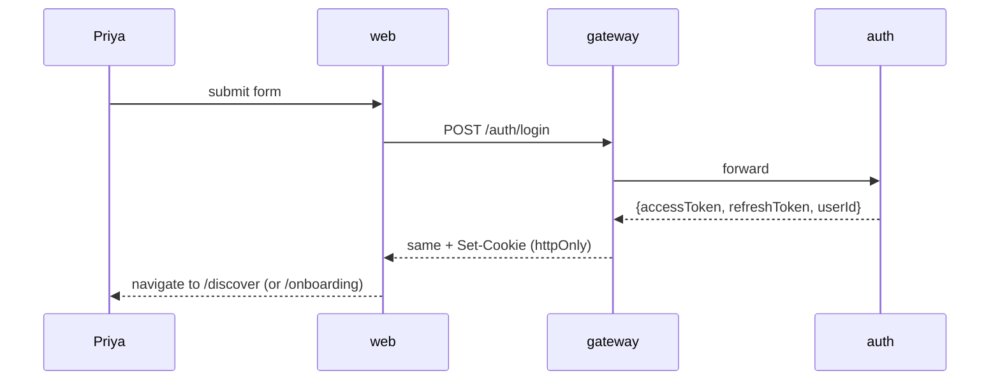
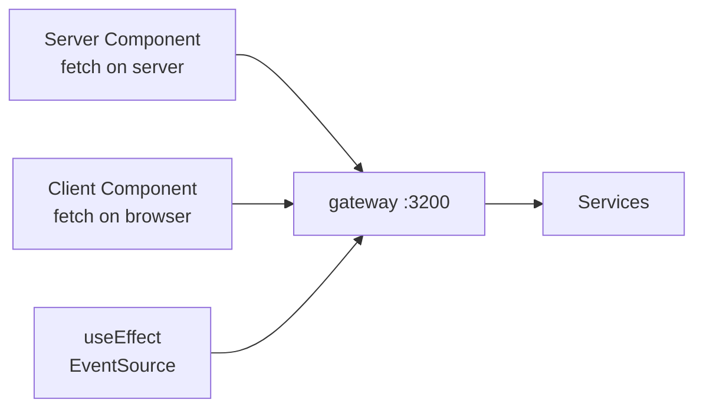

# Frontend — the 9 screens Priya actually touches

Priya doesn't know we have 9 microservices. She knows the app opens to
a stack of profiles, that swiping right sometimes makes a chat appear,
that there's a bell with a number on it, and that a "Feed" tab shows
photos her matches posted.

This document walks through every screen she sees, in the order she
discovers them.

---

## 1. The tech, in one line each

- **Framework:** Next.js 14 with the App Router (the modern file-based
  routing under `app/`). Lives in [services/web/](services/web/).
- **Rendering:** server components by default; client components only
  where Priya needs interactivity.
- **Styling:** Tailwind CSS — utility classes; no CSS files to chase.
- **State:** mostly URL + server state; minimal client state with React
  hooks. No Redux.
- **Talks to:** the gateway only (`NEXT_PUBLIC_API_URL=http://localhost:3200`).
  Never directly to internal services.

---

## 2. The route tree

```
src/app/
├── (auth)/                 ← route group: not signed in
│   ├── login/page.tsx
│   ├── signup/page.tsx
│   └── reset-password/page.tsx
├── (main)/                 ← route group: signed in + onboarded
│   ├── discover/page.tsx
│   ├── matches/page.tsx
│   ├── chat/[chatId]/page.tsx
│   ├── feed/page.tsx
│   ├── stories/page.tsx
│   ├── ai-picks/page.tsx
│   ├── notifications/page.tsx
│   └── profile/page.tsx
├── onboarding/page.tsx
└── layout.tsx
```

Route groups `(auth)` and `(main)` share layouts but apply different
auth guards — `(auth)` redirects signed-in users away; `(main)` redirects
signed-out users to login.

---

## 3. The 9 screens in detail

### 3.1 Login — `/(auth)/login`

What Priya does: types email + password, taps "Sign in".



Tokens are stored in **httpOnly cookies** — JavaScript can't read them,
so an XSS bug can't steal Priya's session.

### 3.2 Onboarding — `/onboarding`

If Priya hasn't completed the 12-question onboarding, the gateway's
**onboarding-complete gate** redirects her here for every `/(main)`
route. The gateway caches the gate result for 60s to avoid hammering
`users` on every page load.

### 3.3 Discover — `/(main)/discover`

The main swipe stack. The page is a server component that pre-fetches
the first 10 candidates so the first card paints instantly.

```tsx
// services/web/src/app/(main)/discover/page.tsx
export default async function Discover() {
  const initial = await fetch(`${API}/social/discover?limit=10`, { ... });
  return <DiscoverStack initial={await initial.json()} />;
}
```

The client component `DiscoverStack` handles swipe gestures, calls
`POST /social/like` or `POST /social/pass`, and pre-fetches the next 10
when 3 remain.

### 3.4 Matches — `/(main)/matches`

A list of people who liked Priya back, newest first. Each row links to
`/chat/[chatId]`.

### 3.5 Chat — `/(main)/chat/[chatId]`

The dynamic segment `[chatId]` is the URL parameter. The page:

1. Server-renders the last 50 messages (`GET /messaging/chats/{id}/messages`).
2. Opens an SSE connection to `GET /events/sse` for live updates.
3. Renders the composer with an opener suggestion from
   `GET /messaging/chats/{id}/suggest` (powered by `messageSuggest`).

### 3.6 Feed — `/(main)/feed`

Infinite scroll of posts. Cursor-based pagination
(`GET /content/feed?cursor=…`). When `ALGO_V4_RANK_ENABLED_FEED=1`,
the order is determined by `feedAugment`.

### 3.7 Stories / Videos — `/(main)/stories`

24h photo stories and short videos. Each story records an impression
via the tracking pipeline (see [TRACKING.md](TRACKING.md)).

### 3.8 AI Picks — `/(main)/ai-picks`

A single curated profile per day, computed overnight by the
`DailyMatchWorker` and surfaced via `GET /social/ai-picks/today`.

### 3.9 Notifications — `/(main)/notifications`

Bell icon with badge count. Polls `GET /notifications/unread/count`
every 30s when the tab is hidden; gets live updates via SSE when open.

---

## 4. How the web app talks to the backend



Three patterns:

1. **Server components** call `fetch()` with the user's cookie
   forwarded; runs on the Next server, never exposes secrets to the
   browser.
2. **Client components** call the same gateway URL from the browser,
   carrying the cookie automatically.
3. **SSE** for live updates — one open connection per tab, kept alive
   by gateway heartbeats every 25s.

---

## 5. State management

We deliberately avoid Redux. Priya's state lives in three places:

- **URL** (`/chat/abc123` — the chat id is in the URL, not state).
- **Server** (the source of truth — refetch when needed).
- **React hooks** (transient: composing text, scroll position).

Result: very few bugs around stale state, fewer "why is X out of sync"
incidents.

---

## 6. Performance

| What                          | Technique                                       |
|-------------------------------|-------------------------------------------------|
| First card paints fast        | Server-component pre-fetch of `discover?limit=10` |
| Images don't jank             | `next/image` with explicit width/height          |
| Bundle stays small            | App Router code-splits per route automatically  |
| Repeat visits feel instant    | RSC payload cached at the edge                  |

Build output is `output: 'standalone'` (Next.js standalone mode) so
the Docker image only ships what's needed to run.

---

## 7. Run it locally

```bash
cd services/web
npm install
NEXT_PUBLIC_API_URL=http://localhost:3200 npm run dev
# open http://localhost:3100
```

---

## 8. Tests

UI is covered by a small Playwright smoke suite (login → discover →
swipe → match → chat) — runs in ~30s in CI.

---

## 9. What changed and why it's better

- **Before:** a React SPA that did all rendering in the browser. First
  card took ~2.5s to paint over 4G.
- **After:** Next.js App Router server-renders the first page; Priya
  sees the first card in **~600ms** over the same 4G connection.
- **Why Priya feels it:** the app opens. Period. No spinners between
  taps. No "loading…" between routes.

---

## 10. If something breaks

| Symptom                              | First check                                                  |
|--------------------------------------|--------------------------------------------------------------|
| Pages flash blank then content       | RSC cache missed — `kubectl logs -l app=web --tail=100`      |
| Login succeeds but redirected back   | Cookie not set — check `NEXT_PUBLIC_API_URL` and CORS        |
| Chat tab not getting live updates    | SSE connection dropped — gateway heartbeats?                 |
