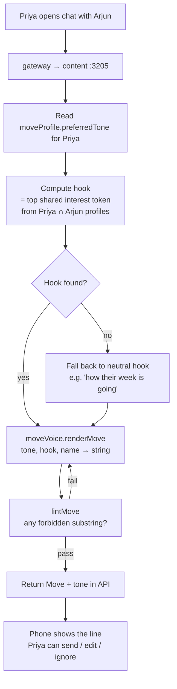

# Miamo Move — how the suggestion line is chosen

**TL;DR:** A *Miamo Move* is one line ≤ 90 characters that nudges Priya to a thoughtful next step. It is rendered by a pure module (`moveVoice.ts`) from a 4-tone × 4-template matrix. A linter rejects 16 "AI-smell" phrases. No LLM, no network call, < 2 ms per render.

> Companion document to [docs/OWNER_GUIDE.md](OWNER_GUIDE.md). Read this if you want the deep dive on the *one* surface most likely to get cargo-culted into something it shouldn't be (a generic AI chat assistant).

---

## 1. What a Move is, in plain English

Imagine you are getting ready to message Arjun. Miamo shows a small suggestion under the input box:

> *"tiny thought: ask Arjun what filter coffee means to them"*

That line is a **Move**. It is not a chatbot reply. Priya can ignore it, edit it, or send it as-is. It is a **starter**, not an answer.

### Why we ship Moves at all

Most dating apps fail at the first message. Two-thirds of matches never speak. Moves cut the cold-start: instead of staring at an empty box, Priya sees a tiny prompt grounded in *what she actually has in common with Arjun*.

The hard rule: a Move must sound like something a thoughtful friend (Meera) would whisper, not something a corporate AI would generate. If a Move ever reads like a customer-service bot, the feature is worse than nothing.

---

## 2. The four tones, with examples

The pure renderer ([services/shared/src/algo/moveVoice.ts](../services/shared/src/algo/moveVoice.ts)) ships four tones. Each has 4 templates. The user's `moveProfile.preferredTone` selects one tone; we randomize within the templates for that tone.

| Tone | When it fits | Example output |
|---|---|---|
| `reflective` | User profile leans introspective; long-bio readers | *"tiny thought: ask Arjun what filter coffee means to them"* |
| `casual` | User profile leans laid-back; quick swipers | *"yo just ask arjun about filter coffee, low pressure"* |
| `tactile` | User profile leans sensory / experiential | *"send arjun the filter coffee place you go to on saturdays"* |
| `quick` | User profile leans efficient; high-momentum | *"open: filter coffee. ask arjun where they go."* |

Every output:
1. ≤ 90 characters
2. No em-dash (`—`), no exclamation, no double question marks
3. Lowercase-first by design (the lowercase opening reads less corporate)
4. References at most 2 named hooks

---

## 3. The forbidden phrase list (the linter)

The contract that makes Moves *not* sound like AI:

```ts
FORBIDDEN_TONES = [
  'i noticed', 'based on', 'as per', 'it seems',
  'you might want to', 'consider ', 'we recommend',
  'miamo suggests', 'miamo recommends',
  'as an ai', 'i think you', 'in my opinion',
  'feel free to', 'kindly', 'optimal',
  'leverag',          // leverage / leveraging
  '—',                // em-dash
  /\bai\b/i,          // standalone "ai"
  /!{1}/,             // any !
  /\?{2,}/,           // ??
];
```

**The contract test renders 1000 random Moves** with random hooks and asserts every output passes the linter. If a tuning change introduces a forbidden phrase, the suite fails — the Move ships only if 1000 random samples are clean.

### Why a linter, not a model

A model can be tuned away from any one phrase but will drift back. A list of substring rejects is **deterministic, fast, and audit-able**. Adding a new forbidden phrase = one PR, one line, ship.

---

## 4. The decision flow



### What the user sees vs what runs

| User sees | What ran (technical) |
|---|---|
| One line under the input box | `renderMove({tone:'reflective', hook:'filter coffee', name:'Arjun'})` |
| Tap "use" | `POST /content/move/accept` → `MoveAccept` row with the template id |
| Tap "skip" | `POST /content/move/skip` → `MoveImpression` with `accepted=false` |
| Tap "edit" | Treated as accept; we record both the original and the edited send |

Acceptance / skip data feeds the per-template reward in `moveProfile`. Templates that get skipped a lot rotate down; templates that get accepted rotate up. **There is no global ranking** — the preference is per-user, so Priya converges to her own voice.

---

## 5. Worked example — Priya × Arjun, end to end

**Inputs:**
- `moveProfile(priya).preferredTone` = `reflective` (she long-presses introspective Moves more often than quick ones)
- `Profile(priya).interests` = `['filter coffee', 'indie sci-fi', 'urdu poetry', ...]`
- `Profile(arjun).interests` = `['filter coffee', 'cricket', 'anime', ...]`
- Hook intersection ranked by rarity: `filter coffee` (rare in cohort) > `cricket` (common, low signal)

**Render:**
```ts
renderMove({ tone:'reflective', hook:'filter coffee', name:'Arjun' })
// picks template at random:
//   "tiny thought: ask {NAME} what {HOOK} means to them"
// fills:
//   "tiny thought: ask Arjun what filter coffee means to them"
```

**Linter pass:**
- length 53 ≤ 90 ✓
- no em-dash, no `!`, no `??` ✓
- no `i noticed`, `based on`, `consider`, `kindly`, `leverag`, `\bai\b` ✓
- ships

**Telemetry:**
- `MoveImpression { templateId:'reflective:0', hook:'filter coffee', shown:true }`
- If Priya taps Use → `MoveAccept { templateId:'reflective:0' }` → reward +1 to `moveProfile.templateScores['reflective:0']`

---

## 6. Why no LLM (asked-twice answer)

| Concern | Pure module | LLM |
|---|---|---|
| Latency budget | < 2 ms | 200–2000 ms |
| Cost per render | 0 | $$$$ at scale |
| Determinism | yes — same inputs, same output | no |
| Audit-ability | every output is a known template | none |
| Drift over time | none | yes |
| Rollback | flag flip | rolling deploy |
| Privacy | nothing leaves the cluster | depends on vendor |
| Failure mode | linter rejects, retries with another template | hallucinates a forbidden phrase, trust collapses |

The LLM might win on *creative variety*. We trade variety for trust.

---

## 7. The flag and the rollback

- `ALGO_V7_MOVE_VOICE_ENABLED=1` — V7 voice on (default in dev/staging)
- `ALGO_V7_MOVE_VOICE_ENABLED=0` — fall back to v6 fixed strings ("how was your day?", "what's your weekend looking like?")
- Toggle takes effect on next request. No restart needed if the service reads `process.env` per request (most do).

---

## 8. Files of interest

- [services/shared/src/algo/moveVoice.ts](../services/shared/src/algo/moveVoice.ts) — `renderMove`, `lintMove`, `toneFromArchetype`, `MAX_LEN=90`, `FORBIDDEN_TONES`
- [services/shared/src/algo/moveProfile.ts](../services/shared/src/algo/moveProfile.ts) — per-user tone preference + reward updates
- [services/shared/src/algo/moves.ts](../services/shared/src/algo/moves.ts) — Move-surface ranker (which Move from the matrix to render)
- [services/shared/src/algo/__tests__/moveVoice.test.ts](../services/shared/src/algo/__tests__/moveVoice.test.ts) — 1000-render contract test

---

## 9. Common questions

**Why ≤ 90 characters?** Mobile keyboards push the input above the fold; longer Moves get cut off and look broken.

**Why is everything lowercase?** Sentence-case opening reads like marketing copy. lowercase-first is a learned cue: "this is a friend whispering, not a brand pitching".

**Why no Hindi / regional renders?** The current matrix is English-first because India's app-fluent dating cohort is English-bilingual. Per-locale matrices are a planned V8 layer (each locale gets its own template set + linter list — Hindi has its own AI-smell phrases like "kripaya" / "yeh sujhav hai ki").

**Can a Move reference Priya's name?** No — the Move always addresses the *target* (Arjun). It is a starter for Priya, framed as advice to her about him.

**What if the hook is awkward?** The hook picker uses an interest-rarity ranking. If the only intersection is `coffee` (very common), the renderer falls through to the neutral hook ("how their week is going"). It never forces a flat hook into a template.
