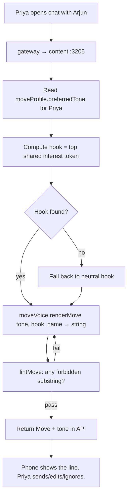

# Miamo Move — the suggestion line, end to end

**TL;DR:** A *Miamo Move* is a short opener Priya can send to Arjun. She sees up to five candidates under the input box. They look like she wrote them, not like a chatbot wrote them. We achieve that with a stack of five pure modules — sender-voice extraction, receiver resonance, hook library, code-mix templates, an expanded linter — wired through a composer that scores candidates by predicted reply probability and falls back to V1 templates only when the V2 path fails. No LLM, no network call, deterministic on inputs.

> Companion document to [docs/OWNER_GUIDE.md](OWNER_GUIDE.md). Read this if you want the deep dive on the *one* surface most likely to get cargo-culted into something it shouldn't be (a generic AI chat assistant). Re-written for v3.6 / Move v2; the V1 section is preserved because the V1 module still ships as the fallback path.

---

## 0. How to read this document

This is a pair-write. Each section opens in plain English ("here is the thing we are trying to do, here is why we built it this way") and then drops into the technical detail ("here is the function, here is the math, here are the boundary conditions"). If you only have ten minutes, read §1, §2, and §6. If you are about to ship a tuning change, read §4 and §9. If you are reviewing the data flow, read §4 and §7.

Source files referenced:

- V1 renderer + linter: [services/shared/src/algo/moveVoice.ts](../services/shared/src/algo/moveVoice.ts)
- V2 composer: [services/shared/src/algo/v8/moveV2/composer.ts](../services/shared/src/algo/v8/moveV2/composer.ts)
- V2 sender voice: [services/shared/src/algo/v8/moveV2/senderVoice.ts](../services/shared/src/algo/v8/moveV2/senderVoice.ts)
- V2 receiver resonance: [services/shared/src/algo/v8/moveV2/receiverResonance.ts](../services/shared/src/algo/v8/moveV2/receiverResonance.ts)
- V2 hook library: [services/shared/src/algo/v8/moveV2/hookLibrary.ts](../services/shared/src/algo/v8/moveV2/hookLibrary.ts)
- V2 code-mix templates: [services/shared/src/algo/v8/moveV2/codeMix.ts](../services/shared/src/algo/v8/moveV2/codeMix.ts)
- Design context: [docs/architecture/v3.6-overhaul-design.md](architecture/v3.6-overhaul-design.md), Section C

---

## 1. The problem Move v2 solves

### 1.1 Plain English

Most matches never start. Two-thirds of dating-app pairs go silent after the match screen because the cold-start ("what do I even say?") is the cliff. The industry's answer has been to inject an AI opener — Tinder's Smart Photos surfaces, Bumble's BeeWise replies, Hinge's prompt suggestions — and what users have reported, en masse, is that AI openers feel *off*. They read as polite, they read as polished, they read as something a brand would send, not something a friend would. People can smell them. Reply rates lift briefly during onboarding, then drop below organic openers within the first month.

The smell has a name. It is the **AI-cringe signature**. We can describe it concretely.

### 1.2 The AI-cringe signature

When we sampled openers people forwarded to us as "obviously AI-generated", we saw the same shape over and over:

1. **The em-dash.** A long dash inside a sentence. Almost nobody types em-dashes on a phone keyboard — it takes three taps or a long-press. Most chat traffic uses commas, periods, or line breaks instead. So an em-dash in a casual opener is one of the strongest single signals of a model-generated line.

2. **The "I noticed" stem.** "I noticed you like filter coffee" — humans rarely open with the verb "notice" applied to a stranger's profile. It reads as *I scanned your data*, which is exactly what happened, which is exactly what should not be visible. Variants include "I see you like…", "I can tell you're into…", "It sounds like you enjoy…", and the post-tuning replacement "I love how…".

3. **Over-precise descriptors.** "Your love for the meditative quality of filter coffee is wonderful." People don't say "meditative quality" to a stranger. People don't say "centering" either. Models reach for high-register adjectives ("authentic", "genuine", "thoughtful", "intentional") because the training corpus is full of marketing copy and self-help books.

4. **Zero exclamations + perfect grammar.** An opener with two complete sentences, both ending in periods, no contractions, no fragments — reads as a paragraph of polished prose dropped into a chat. People drop exclamations sometimes. People also drop punctuation. Models, especially safety-tuned ones, do neither.

5. **The tricolon.** "You sound bold, thoughtful, and playful." The list-of-three pattern is rhetorically gorgeous and almost never typed by humans in chat. It reads as an essay sentence pasted into a DM.

6. **Compliment-fallback clusters.** "love your vibe", "your energy is incredible", "your aesthetic is so curated". Empty intensifiers + empty noun. These appear with such regularity that any one of them flags an opener as auto-generated even when the rest of the line is fine.

7. **The trailing small-smile.** "what's your favorite filter coffee place 😊". The 😊 at the end of an AI-generated line is a giveaway. The same emoji used midline by a human reads natural; trailing-only is corporate.

Each of these on its own is weak. Together they form a signature that ~30% of receivers can identify with no training. That is what we are designing against.

### 1.3 Why off-the-shelf LLM openers fail

You could imagine fixing the AI-cringe signature with a tighter system prompt: "do not use em-dashes, do not start with 'I noticed', avoid high-register adjectives." We tried. Three things go wrong.

1. **Drift.** A model tuned away from one phrase replaces it with a close neighbor. Ban "I noticed" and you get "I love how". Ban "I love how" and you get "Something tells me". The signature shifts; it does not disappear.

2. **Style mismatch.** Even with perfect tone control, the opener is generated by a *different writer* than the one whose name is on the message. Priya types lowercase "i", contracts everything, never uses semicolons. The model writes a polite sentence with capital "I" and a period. When Arjun replies, Priya has to suddenly switch into her own voice — and the conversation reads as if two people are in her account.

3. **Latency + cost + audit.** Every render is a model call. Every model call is 200–2000 ms, costs money, depends on a vendor, and is impossible to audit ("why did the suggestion say *that*?"). For a feature that runs on every chat open, that is the wrong cost structure.

The plain-English version: an LLM opener is a *guess* about how Priya would write. Move v2 is a *fingerprint* of how Priya already writes, projected onto a template that matches what Arjun has already replied to. The fingerprint is the differentiator.

### 1.4 Technical

The V1 module (`moveVoice.ts`) addressed point #1 above (em-dash, "I noticed", forbidden-phrase list) with a deterministic linter and a 4-tone × 4-template matrix. That solved the most obvious tells. V2 adds:

- Sender voice extraction: 12 statistical features from the last 50 outbound messages, projected onto the rendered template (lowercase-i, contractions, length cap, emoji habits).
- Receiver resonance: distribution over opener kind + tone + length built from the receiver's last 10 successful replies (first-move outcomes where `replied=true` and reply latency < 1 hour).
- Hook library: 8 categories of concrete falsifiable facts, ranked by `specificity × freshness × prior`.
- Code-mix templates: 80 templates spread across 4 language families (English, Hinglish, Tanglish, Banglish).
- Expanded linter: 42 forbidden phrases plus three compound flags (`tooPolishedFlag`, `aiSignatureFlag`, `tricolonFlag`).
- Composer: produces 5 candidates per pair-day, enforces ≥3 distinct hook categories, falls back to V1 lines on lint failure, sorts by predicted reply probability.

The bound is: every rendered line passes the V8 linter or it does not ship. Fallback rate target is below 2% in production. KPIs are in §8.

---

## 2. The "did I write this?" property

### 2.1 Plain English

If we have done our job, when Priya sees a Move v2 candidate she should think *did I write this?* for half a second before recognizing it as a suggestion. That is the design target. Not "this is well-written", not "this is creative", not "this would get a reply" — *this sounds like me.*

The reason is operational. If the suggestion sounds like Priya, three things happen:

1. She is more likely to send it as-is.
2. When Arjun replies, the conversation does not have a tonal seam. There is no moment where Arjun mentally edits to "wait, the first message was different from how she's writing now."
3. Even when she doesn't send the suggestion, she gets a useful prompt — *what would I write here?* — and her own opener starts faster.

If the suggestion doesn't sound like her, she edits it heavily (acceptable, we learn from the edit), or she discards it (worst case, but we still got a slot of telemetry), or she stops looking at suggestions entirely (catastrophic, we lose the feature).

So everything in Move v2 is in service of one property: the rendered line should look statistically indistinguishable from a line Priya actually wrote.

### 2.2 Technical

The property is operationalized through the post-processor `projectToVoice(rendered, voice)` in `senderVoice.ts`. After a template is filled with a hook and a name, we apply Priya's habits to the resulting string:

1. **Length project.** If the rendered string is more than ~1.8× her median chars, trim at the last period inside the cap.
2. **Lowercase project.** If she starts >50% of her messages with a lowercase letter, lowercase the first character of the rendered line.
3. **Contraction project.** If she contracts >70% of the time, swap "do not" → "don't", "you are" → "you're", etc.
4. **Exclamation project.** If she almost never uses exclamations (<5%), strip any trailing `!`.

Each projection is gated by Priya's observed *confidence* (sample count / 50). Below 30% confidence we still apply *some* projection — fully neutral output would read as V1 — but we don't impose habits we haven't seen. The reasoning is in §4.1.

The linter (`lintMoveV8`) runs after projection, so a habit-projected line that accidentally introduces a forbidden phrase still gets rejected. The flow is **render → project → lint → accept-or-retry**, and the retry budget is 3 attempts per slot.

When sample count is below 10 (the floor), the post-processor uses the `NEUTRAL_VOICE` constants (population medians) and only applies a fraction of each rule. This is the "new user has nothing to fingerprint yet" case, and we degrade to V1-quality output rather than fabricating habits.

---

## 3. V1 architecture (legacy `moveVoice.ts`)

### 3.1 Plain English

V1 is a 4-tone × 4-template matrix. Each render: pick a tone (from the user's `moveProfile.preferredTone`), pick a template at random from that tone's list, fill the `{NAME}` and `{HOOK}` placeholders, run the linter, ship. The whole thing takes under 2 ms and has no external dependencies. The linter rejects 16 phrases that read as AI / corporate voice.

It works. Sending a V1 line gets the receiver to reply at the cohort average. It does not lift reply rate the way V2 does, but it is a strong baseline, and it is what we fall back to when V2 cannot produce a clean candidate.

V1 has two big limitations that V2 fixes:

1. **No personalization beyond tone.** Two different senders with the same `preferredTone` get the same template pool. Two different receivers get the same scoring (or none — V1 doesn't model the receiver). So the "this sounds like me" property does not hold.
2. **No code-mix.** V1 is English-only. A Hinglish-dominant sender would never get a Hinglish suggestion. India's app-fluent cohort is largely English-bilingual, but a non-trivial slice writes "kya scene hai" naturally and an English-only opener reads stilted.

### 3.2 The four tones

The renderer ships four tones. Each has 3–4 templates.

| Tone | When it fits | Example output |
|---|---|---|
| `reflective` | User profile leans introspective; long-bio readers | *"tiny thought: ask Arjun what filter coffee means to them"* |
| `casual` | User profile leans laid-back; quick swipers | *"say hey, Arjun likes filter coffee too — open with that"* |
| `tactile` | User profile leans sensory / experiential | *"pic of filter coffee you took recently → Arjun will get it"* |
| `quick` | User profile leans efficient; high-momentum | *"two words to Arjun: filter coffee?"* |

Every output:

1. ≤ 90 characters
2. No em-dash (`—`), no `!!!`+, no `??`+
3. Lowercase-first by design (the lowercase opening reads less corporate)
4. References at most 2 named hooks via `{HOOK}` and `{HOOK2}`

The four tones map onto an archetype hint via `toneFromArchetype`:

```ts
function toneFromArchetype(archetype): MoveTone {
  switch (archetype) {
    case 'wordsmith':    return 'reflective';
    case 'voice_first':  return 'casual';
    case 'visual':       return 'tactile';
    case 'fast_replier': return 'quick';
    default:             return 'casual';
  }
}
```

The archetype itself is derived elsewhere (`moveProfile.ts`) from a coarse summary of how the user has interacted with previous Moves. There is no global ranking — preference is per-user, so Priya converges to her own voice over time.

### 3.3 The original 16 forbidden phrases

The V1 contract:

```ts
FORBIDDEN_TONES = [
  'i noticed',
  'based on',
  'as per',
  'it seems',
  'you might want to',
  /\bconsider\s+(asking|trying|reaching)/i,  // narrowed from blanket 'consider '
  'we recommend',
  'miamo suggests',
  'miamo recommends',
  'as an ai',
  'i think you',
  'in my opinion',
  'feel free to',
  'kindly',
  'optimal',
  'leverag',          // leverage / leveraging
  '—',                // em-dash
  /\bai\b/i,          // standalone "ai"
  /!{3,}/,            // runs of 3+ exclamations
  /\?{2,}/,           // double question marks
];
```

The list is short, deterministic, and surgically scoped. Two refinements have already shipped against the original V1 spec:

- `'consider '` was tightened to `/\bconsider\s+(asking|trying|reaching)/i` because blanket-banning the word killed benign uses like *"consider it done"*.
- `/!{1}/` (banned all exclamations) was relaxed to `/!{3,}/` because zero exclamations is itself an AI tell.

These two changes are concrete evidence that the linter list is a living contract, not a snapshot. The point of a deterministic list is that you can move it around. The point of a model is that you cannot.

### 3.4 The V1 render flow



The function `renderMove({ tone, ctx, seed })` walks the templates of the requested tone in seeded order. For each template it fills placeholders and runs `lintMove`. The first lint-clean result wins. If every template fails, the function returns `{ ok: false, reason: 'all_templates_failed_lint' }` and the caller should fall back to a static line. In practice this never happens for V1 because the templates are hand-vetted against the forbidden list, but the safety check is there.

```ts
export function renderMove(input: RenderInput): RenderResult {
  const seed = input.seed ?? Date.now();
  const list = TEMPLATES[input.tone];
  for (let offset = 0; offset < list.length; offset++) {
    const idx = (Math.abs(Math.floor(seed)) + offset) % list.length;
    const tpl = list[idx];
    const line = fill(tpl, input.ctx);
    const lint = lintMove(line);
    if (lint.ok) return { ok: true, line, tone: input.tone, templateIndex: idx };
  }
  return { ok: false, reason: 'all_templates_failed_lint' };
}
```

### 3.5 What V1 looks like in the API

```ts
renderMove({ tone:'reflective', hook:'filter coffee', name:'Arjun' })
// picks template at random within tone:
//   "tiny thought: ask {NAME} what {HOOK} means to them"
// fills:
//   "tiny thought: ask Arjun what filter coffee means to them"
```

Lint pass:
- length 53 ≤ 90 ✓
- no em-dash, no `!!!`, no `??` ✓
- no `i noticed`, `based on`, `consider asking`, `kindly`, `leverag`, `\bai\b` ✓
- ships

The hook picker (in `moves.ts`, separate from `moveVoice.ts`) uses an interest-rarity ranking. If the only intersection is *coffee* (very common in the cohort), the renderer falls through to a neutral hook like *"how their week is going"*. The renderer never forces a flat hook into a template — flat hooks read worse than no hook.

Acceptance / skip data feeds the per-template reward in `moveProfile`. Templates that get skipped a lot rotate down; templates that get accepted rotate up. **There is no global ranking** — the preference is per-user, so Priya converges to her own voice.

### 3.6 Telemetry shape (V1)

| User action | API call | Row written |
|---|---|---|
| Tap "use" | `POST /content/move/accept` | `MoveAccept(templateId, sentText)` |
| Tap "skip" | `POST /content/move/skip` | `MoveImpression(templateId, accepted=false)` |
| Tap "edit" | Treated as accept | `MoveAccept(templateId, originalText, editedText)` |

The split lets us learn three things: (a) which templates are skipped, (b) which templates are accepted as-is, (c) which templates get edited *toward* something. The edit deltas are gold — they tell us what the template was missing.

---

## 4. V2 architecture

V2 is five pure modules wired through a composer. We walk them in dependency order: senderVoice and receiverResonance feed scoring, hookLibrary ranks the hook candidates, codeMix provides 80 templates, and the composer picks 5 final suggestions.

### 4.1 Sender voice extraction — `senderVoice.ts`

#### Plain English

We extract 12 numbers from Priya's last 50 outbound messages. The numbers describe how she writes: how long her sentences are, whether she contracts ("don't" vs "do not"), whether she starts messages with a capital, how often she uses emojis, how often she laughs ("lol", "haha"), how often she fragments ("yeah. cool. send me a pic"), what her three most-used emojis are.

These 12 numbers are a *voice fingerprint*. We never send Priya's actual messages anywhere — the extraction happens inside the cluster, the vector is cached in `FeatureSnapshot.raw.senderVoiceV8`, and only the 12 numbers leave the extractor.

The voice fingerprint is used for two things:

1. **Scoring.** When the composer is comparing template candidates, a template whose default register matches Priya's habits scores higher.
2. **Projection.** After a template is filled, we *project Priya's habits onto the line.* Lowercase her capital letter, contract her expansions, strip trailing exclamations. The result is statistically closer to a line Priya would actually write.

The floor: we need at least 10 messages from Priya before the fingerprint is meaningful. Below 10 we use `NEUTRAL_VOICE` (population medians) so the suggestion doesn't impose habits we haven't observed. The target is 50 messages; beyond 50 the per-feature noise plateaus, so we cap the window.

#### Technical

The shape:

```ts
export interface SenderVoiceVector {
  medianLengthChars: number;
  medianLengthWords: number;
  emojiRate: number;                  // emojis per message
  topEmojis: string[];                 // up to 3 most-used
  emDashRate: number;
  exclamationRate: number;
  questionRate: number;
  commaPerWord: number;
  fragmentsPerMessage: number;
  lowercaseIRate: number;              // standalone " i " vs "I " usage
  lowercaseStartRate: number;
  typoRateApprox: number;              // proxy: words not in common-dict
  contractionRate: number;             // "don't" vs "do not"
  laughTokenRate: number;              // lol|haha|lmao frequency
  sampleCount: number;
  confidence: number;                  // clip01(sampleCount / SAMPLE_TARGET)
}
```

Each feature has a per-message extractor. `medianLengthChars` is the median character length across the window. `emojiRate` is total emoji count / message count. `lowercaseIRate` is occurrences of standalone " i " (or message-initial "i ") over occurrences of " i " + " I " — so a sender who alternates capitalization gets a mid-range value, and a sender who exclusively types lowercase gets 1.0.

The post-processor `projectToVoice(rendered, voice)` then mutates the rendered string:

```ts
export function projectToVoice(rendered: string, voice: SenderVoiceVector): string {
  const strength = Math.max(voice.confidence, POST_PROC_STRENGTH_FLOOR); // floor 0.3

  let line = rendered;

  // Lowercase project
  if (voice.lowercaseStartRate * strength > 0.4) {
    const first = line.charAt(0);
    if (first >= 'A' && first <= 'Z') {
      line = first.toLowerCase() + line.slice(1);
    }
  }

  // Contraction project
  if (voice.contractionRate * strength > 0.5) {
    for (const [con, exp] of CONTRACTION_PAIRS) {
      const re = new RegExp(`\\b${escape(exp)}\\b`, 'gi');
      line = line.replace(re, con);
    }
  }

  // Exclamation project
  if (voice.exclamationRate < 0.05 && line.endsWith('!')) {
    line = line.replace(/!+$/, '');
  }

  // Length project — trim at last period inside 1.8× median
  const targetMax = Math.max(40, Math.floor(voice.medianLengthChars * 1.8));
  if (line.length > targetMax) {
    const cut = line.slice(0, targetMax).lastIndexOf('.');
    if (cut > 10) line = line.slice(0, cut);
  }

  return line;
}
```

Notes on the projection logic:

- **Confidence-gated strength.** Each rule is gated by a threshold and the gate uses `voice.feature * strength`. At low confidence the effective threshold rises, so we don't apply habits we barely saw.
- **No padding.** We trim long output but never lengthen short output. A short line is almost always closer to organic chat than a long one.
- **Contraction direction is one-way.** We swap expansions to contractions, never the reverse. The reverse swap (Priya writes "do not" → we render "don't") would *expand* the chance of looking AI-tuned, because contractions read as more casual.
- **Exclamation strip threshold is asymmetric.** We strip a trailing `!` only when Priya almost never types one (`exclamationRate < 0.05`). We don't *add* exclamations when she uses them often, because templates that benefit from an `!` already include it.

The dictionary `COMMON_DICT` is a ~200-word list of frequent English chat tokens plus Hinglish/code-mix tokens (kya, yaar, bhai, scene, accha, hai, ho, kar, lo, da, sema, bolish, khabor, mera, meri…). It is intentionally small. The `typoRateApprox` feature is *miss rate*, not *typo count*: it captures register, not spelling. A multilingual user typing Hinglish tokens that are in the dictionary will get a low typoRate, the right signal. A user typing in pure regional script will look high-typoRate, which is also accurate because the romanized templates we ship will not match their voice well.

### 4.2 Receiver resonance model — `receiverResonance.ts`

#### Plain English

For each receiver (Arjun), we look at the last 10 first-move outcomes where someone messaged him and he replied within an hour. We build three distributions:

1. **kindDistribution.** Of those 10 successful openers, how many were questions? compliments? shared-interest openers? playful? specific-detail? voice-invite? photo-invite?
2. **toneDistribution.** How many were reflective? casual? tactile? quick?
3. **preferredLengthMedian.** What was the median character length of those 10 openers?

The vector tells us: *Arjun replies to short playful openers about specific details. He doesn't reply to long reflective compliments.* The composer uses this to bias template selection toward the things Arjun has historically replied to.

When Arjun has fewer than 3 successful first-move outcomes (new user, or low-volume), we fall back to his archetype — if he is `voice_first`, we use the distribution `[voice_invite 0.6, playful 0.25, question 0.15]` and tone `casual` at 0.7, others at 0.1 each. If he doesn't even have an archetype assigned, we use the `NEUTRAL_RESONANCE` constants (uniform over kinds and tones, length median 40).

The privacy posture: we model the receiver from *outcomes only*. No content, no inference about mood. The composer reads "Arjun replied to a question opener last week" and uses it as a prior. It never reads what the question was.

#### Technical

```ts
export interface ReceiverResonanceVector {
  kindDistribution: Record<string, number>;     // sums to ~1.0
  toneDistribution: Record<string, number>;     // sums to ~1.0
  preferredLengthMedian: number;
  sampleCount: number;
  confidence: number;
}
```

The build:

```ts
export function buildResonance(
  outcomes: FirstMoveOutcomeSample[],
  archetypeFallback?: { archetype: ResonanceArchetype },
): ReceiverResonanceVector {
  const successful = outcomes.filter(
    (o) => o.replied && o.replyMs !== null && o.replyMs < SUCCESS_REPLY_MS,
  );
  const window = successful.slice(0, RESONANCE_WINDOW); // 10

  if (window.length < COLD_START_THRESHOLD) {           // 3
    if (archetypeFallback) {
      return { ...coldStartFromArchetype(archetypeFallback.archetype),
               sampleCount: window.length,
               confidence: clip01(window.length / RESONANCE_WINDOW) };
    }
    return { ...NEUTRAL_RESONANCE, ... };
  }

  // accumulate
  const kindDist = zeroKindDist();
  const toneDist = zeroToneDist();
  const lens: number[] = [];
  for (const o of window) {
    kindDist[o.openerKind] += 1;
    toneDist[o.tone] += 1;
    lens.push(o.openerLengthChars);
  }

  return {
    kindDistribution: normalise(kindDist),
    toneDistribution: normalise(toneDist),
    preferredLengthMedian: median(lens),
    sampleCount: window.length,
    confidence: clip01(window.length / RESONANCE_WINDOW),
  };
}
```

The 1-hour success threshold (`SUCCESS_REPLY_MS = 60 * 60 * 1000`) is deliberate. Replies that take longer than an hour are more often obligatory ("hey, sorry, busy") than enthused. The threshold biases the model toward *what gets a fast reply*, which is the actual user-felt outcome.

Cold-start kind weights from §C.2.4 of the design doc:

```ts
const ARCHETYPE_KIND_PREF: Record<ResonanceArchetype, OpenerKind[]> = {
  wordsmith:    ['specific_detail', 'question', 'shared_interest'],
  voice_first:  ['voice_invite', 'playful', 'question'],
  visual:       ['photo_invite', 'specific_detail', 'compliment'],
  fast_replier: ['playful', 'question', 'specific_detail'],
};
const COLD_START_KIND_WEIGHTS = [0.6, 0.25, 0.15];
```

The cold-start tone distribution is `[primary=0.7, other=0.1, other=0.1, other=0.1]` where the primary tone is whichever maps from the archetype via the same `ARCHETYPE_TONE` table the V1 module uses.

### 4.3 Hook library — `hookLibrary.ts`

#### Plain English

A *hook* is one concrete, falsifiable thing the sender can reference. "filter coffee" is a hook. "you like coffee" is not. "Sikkim trekking" is a hook. "you like hiking" is not. The hook is the *grain*. Without it, the suggestion is generic; with it, the suggestion has a place to land.

We rank hook candidates the caller hands us. Each candidate carries:

- A category (one of 8: recent post, DTM topic, shared interest, shared spotlight, festival, shared city, shared college, shared employer).
- A text phrase (human-readable, "Sikkim trekking" not "interest:sikkim_trekking").
- A freshness age in days (used for the recent-post / festival categories).
- A specificity score from 0..1 (the caller computes this — "Triund" specificity 0.9, "hiking" specificity 0.3).

The ranker scores each candidate as `specificity × freshnessBoost × categoryPrior`, then sorts descending. The freshness boost is exponential decay with a 7-day half-life on the two time-decay categories (`recent_post`, `festival`); the other six categories are stable, so they get `freshnessBoost = 1`.

The category priors:

| Category | Prior | Why |
|---|---|---|
| `recent_post` | 0.30 | Highest leverage — concrete, timely, falsifiable |
| `dtm_topic` | 0.25 | DTM agreement is unusually high-signal |
| `shared_interest` | 0.15 | Declared interests are strong but stale |
| `shared_spotlight` | 0.10 | Curatorial signal, lower volume than interests |
| `festival` | 0.08 | Time-bounded; high lift inside 72h window |
| `shared_city` | 0.05 | Low specificity — most matches already share city |
| `shared_college` | 0.04 | Privacy-creep risk |
| `shared_employer` | 0.03 | Highest privacy-creep, biased lowest |

The priors are a single source of truth. They are not arbitrary — they trace to the MARKET_SCAN observation that recent-post + topic-agreement open at ~2× the rate of demographic shares.

#### Technical

```ts
export function scoreHook(h: HookCandidate, _nowMs: number): number {
  const spec = clip01(h.specificity);
  const fresh = freshnessBoost(h.category, h.freshnessAgeDays);
  const prior = HOOK_CATEGORY_PRIOR[h.category] ?? 0;
  return clip01(spec * fresh * prior);
}
```

```ts
function freshnessBoost(category: HookCategory, ageDays: number): number {
  if (!TIME_DECAY_CATEGORIES.has(category)) return 1; // recent_post + festival only
  return expDecay(Math.max(0, ageDays), FRESHNESS_HALF_LIFE_DAYS);
}
```

The half-life is 7 days. A 7-day-old post still scores at 0.5× its day-zero value; a 14-day-old post at 0.25×. The decay flattens fast, so anything older than a fortnight effectively drops out of the candidate pool regardless of specificity.

Tie-break order in `rankHooks`:
1. Higher score wins.
2. Higher category prior wins.
3. Alphabetical text wins (deterministic, for cache reproducibility).

The composer pulls the top 8 hooks from `rankHooks` (`CANDIDATE_POOL_CAP = 8`). The diversity rule (§4.5) requires the first 3 final suggestions to use 3 distinct hook categories, so 8 is enough headroom.

### 4.4 Code-mix templates — `codeMix.ts`

#### Plain English

We ship 80 templates, organized as 4 language families × 5 archetypes × 4 tones. The four families are:

- `en` — English
- `hi_en` — Hinglish (romanized Hindi mixed with English)
- `ta_en` — Tanglish (romanized Tamil mixed with English)
- `bn_en` — Banglish (romanized Bengali mixed with English)

The five archetypes are: `question`, `compliment`, `shared_interest`, `playful`, `specific_detail`. The four tones are the same as V1: `reflective`, `casual`, `tactile`, `quick`. So each family has 20 templates and the full template set is 80.

We detect which family Priya writes in from a small sample of her recent outbound messages, using a character-trigram score against four hand-tuned trigram profiles. The detection returns a family + confidence; if confidence is below 0.6, we default to English (no-regret fallback). When detection picks Hinglish, the composer will still consider English templates as candidates — the family ordering is `[detected_family, 'en']`, so we always have a safety net.

The templates are short, lowercase-start, casual register. Each one is hand-vetted against the V8 linter — none contains a forbidden phrase, none triggers the polished/AI-signature/tricolon flags.

Examples from the English family:

- `question.reflective`: `{NAME}, what's the story behind {HOOK}`
- `compliment.casual`: `{NAME}, {HOOK} is a solid vibe`
- `shared_interest.tactile`: `{NAME}, my {HOOK} corner needs your eyes`
- `playful.quick`: `{NAME}: {HOOK} or pass`
- `specific_detail.reflective`: `{NAME}, the {HOOK} bit pulled me in`

Examples from the Hinglish family:

- `question.reflective`: `{NAME}, {HOOK} ka scene kya hai actually`
- `compliment.casual`: `{NAME} {HOOK} is solid yaar`
- `shared_interest.casual`: `{NAME} mujhe bhi {HOOK} pasand hai, tujhe kaisa laga`
- `playful.tactile`: `{NAME}, {HOOK} pic, ek line caption`

Tanglish:

- `question.casual`: `{NAME}, {HOOK} pathi sollu`
- `compliment.casual`: `{NAME} {HOOK} sema da`

Banglish:

- `question.casual`: `{NAME}: {HOOK}? ki bolish`
- `shared_interest.reflective`: `ami o {HOOK} kori {NAME}, tor experience ki`

#### Technical: detection

The trigram profile per family is a weighted map of three-character substrings (hand-picked from common chat tokens):

```ts
const TRIGRAM_PROFILES: Record<LanguageFamily, Record<string, number>> = {
  en:    { 'the': 5, 'and': 4, 'you': 4, 'ing': 3, ... },
  hi_en: { 'kya': 5, 'hai': 5, 'yaa': 3, 'aar': 3, 'bha': 3, ... },
  ta_en: { 'epd': 5, 'pdi': 5, 'iru': 4, 'ruk': 4, 'sem': 3, ' da': 4, ... },
  bn_en: { 'bol': 4, 'oli': 3, 'kha': 3, 'tor': 4, 'niy': 4, 'iye': 4, ... },
};
```

Detection iterates over the sample's trigrams, sums per-family scores, and returns `(family, confidence = best/total)`. Below 0.6, return `en`.

```ts
export function detectLanguageFamily(samples: string[]): { family; confidence } {
  if (!samples?.length) return { family: 'en', confidence: 0 };

  const scores: Record<LanguageFamily, number> = { en: 0, hi_en: 0, ta_en: 0, bn_en: 0 };
  for (const msg of samples) {
    const tris = trigramsOf(msg);
    for (const t of tris) {
      for (const fam of LANGUAGE_FAMILIES) {
        const w = TRIGRAM_PROFILES[fam][t];
        if (w) scores[fam] += w;
      }
    }
  }
  let total = 0;
  for (const fam of LANGUAGE_FAMILIES) total += scores[fam];
  if (total <= 0) return { family: 'en', confidence: 0 };

  let bestFam: LanguageFamily = 'en';
  let bestScore = -1;
  for (const fam of LANGUAGE_FAMILIES) {
    if (scores[fam] > bestScore) { bestScore = scores[fam]; bestFam = fam; }
  }
  const confidence = bestScore / total;
  if (confidence < DETECTION_CONFIDENCE_THRESHOLD) return { family: 'en', confidence };
  return { family: bestFam, confidence };
}
```

The threshold `DETECTION_CONFIDENCE_THRESHOLD = 0.6` is the misclassification floor — below it, the cost of giving a Hinglish template to an English-only sender exceeds the cost of giving an English template to a Hinglish sender (because English is the universal fallback, but Hinglish to an English-only reader reads as gibberish).

#### Technical: templates

The 80 templates flatten into a single readonly array:

```ts
export const TEMPLATES: readonly CodeMixTemplate[] = [
  ...flatten('en', TEMPLATES_EN),
  ...flatten('hi_en', TEMPLATES_HI_EN),
  ...flatten('ta_en', TEMPLATES_TA_EN),
  ...flatten('bn_en', TEMPLATES_BN_EN),
];
```

Fill is identical to V1:

```ts
export function fillTemplate(template: string, name: string, hook: string): string {
  const safeName = (name ?? '').trim() || 'you';
  const safeHook = (hook ?? '').trim() || 'that thing';
  return template
    .replace(/\{NAME\}/g, safeName)
    .replace(/\{HOOK\}/g, safeHook);
}
```

The default name placeholder is `'you'` — not the receiver's actual name — because if the composer is invoked with a missing name (cold start, anonymized test fixture), `'you'` reads cleaner than an empty string.

### 4.5 The composer — `composer.ts`

#### Plain English

The composer is the orchestrator. It takes:

- a `senderVoice` vector (12 numbers, from §4.1)
- a `receiverResonance` vector (kind/tone distributions + length median, from §4.2)
- a ranked list of `hooks` (top 8, from §4.3)
- a `languageFamily` (en | hi_en | ta_en | bn_en, from §4.4 detection)
- a receiver `name`
- an optional `viewerIntent` (what Priya is doing right now — `serious-search`, `reply-mood`, `casual-scroll`, etc.)
- a `seed` and a `nowMs`

…and returns 5 suggestions, each carrying a predicted reply probability and a fallback flag.

The algorithm:

1. **Enumerate candidates.** Cross-product of (templates in `[detected_family, 'en']`) × (top 8 hooks) → up to 40 templates × 8 hooks = 320 candidates per pair-day in the worst case.
2. **Score each candidate.** `predictReply = 0.40 * resonance + 0.25 * voice + 0.25 * hook + 0.10 * intent`.
3. **Pick 5 slots.** For each slot, walk the candidate list (highest pReply first), enforce diversity (first 3 slots require distinct hook categories), render with `fillTemplate`, project with `projectToVoice`, lint with `lintMoveV8`. First clean result wins. Max 3 lint retries per slot.
4. **Fall back on exhaustion.** If a slot can't find a clean candidate within 3 retries, fall back to a V1-style line.
5. **Post-hoc diversity.** If the final 5 don't have ≥3 distinct hook categories, swap the lowest-pReply slot for a candidate with a new category.
6. **Sort by pReply desc** and return.

#### Technical: weights

```ts
export const PREDICT_WEIGHTS = {
  resonance: 0.40,  // strongest single signal (FirstMoveOutcome history)
  voice:     0.25,  // sender voice — keeps suggestions from sounding alien
  hook:      0.25,  // hook strength is co-primary with voice
  intent:    0.10,  // right-now-intent — useful tiebreaker, high-variance
};
```

The `predictReply` function:

```ts
function predictReply(
  template: CodeMixTemplate,
  hook: HookCandidate,
  voice: SenderVoiceVector,
  res: ReceiverResonanceVector,
  intent: { topClass: string; confidence: number } | undefined,
): number {
  const r = resonanceFit(template, hook, res);
  const v = voiceMatch(template, voice);
  const h = hookStrength(hook);
  const i = intentFit(template, intent);
  return clip01(
    PREDICT_WEIGHTS.resonance * r +
    PREDICT_WEIGHTS.voice * v +
    PREDICT_WEIGHTS.hook * h +
    PREDICT_WEIGHTS.intent * i,
  );
}
```

The four sub-scores:

- **`resonanceFit`** combines `kindMass` (receiver's preference for the template's archetype kind), `toneMass` (receiver's preference for the template's tone), and `lengthFit` (triangular fit between template length and receiver's `preferredLengthMedian`). The combination is multiplicative with floors:
  ```ts
  return clip01((kindMass * 4 + 0.1) * (toneMass * 4 + 0.1) * (lenFit * 0.5 + 0.5));
  ```
  The floors prevent one zero-mass dimension from collapsing the score; the `*4` amplifies the discriminating signal in the kind/tone distributions.

- **`voiceMatch`** combines `lengthFit` between template length and sender's median chars, plus an exclamation-alignment term. Aligning length to the sender's habit pushes the trimming/expansion logic in `projectToVoice` to do less work, which in turn keeps the final string structurally cleaner.

- **`hookStrength`** is `clip01(hook.specificity)`. The hookLibrary already collapsed specificity × freshness × prior into the rank order; here we use specificity directly so we don't double-count the prior.

- **`intentFit`** is a lookup in the intent→tone affinity table:
  ```ts
  const INTENT_TO_TONE_AFFINITY = {
    'serious-search':     { reflective: 1.0, casual: 0.7, tactile: 0.5, quick: 0.3 },
    'intentional-browse': { reflective: 0.8, casual: 0.9, tactile: 0.7, quick: 0.5 },
    'reply-mood':         { reflective: 0.5, casual: 0.9, tactile: 0.6, quick: 1.0 },
    'review-existing':    { reflective: 0.7, casual: 0.7, tactile: 0.6, quick: 0.6 },
    'casual-scroll':      { reflective: 0.4, casual: 0.9, tactile: 0.8, quick: 0.9 },
    'distraction-browse': { reflective: 0.3, casual: 0.7, tactile: 0.6, quick: 1.0 },
    'decision-fatigued':  { reflective: 0.3, casual: 0.5, tactile: 0.6, quick: 1.0 },
  };
  ```
  When intent is missing or uncategorized, intent contributes a neutral 0.5 (not zero — missing data is not negative data).

#### Technical: slot selection loop

```ts
for (let slot = 0; slot < COMPOSE_K; slot++) {
  let chosen: Suggestion | null = null;
  let attemptsHere = 0;
  const requireNewCategory = slot < MIN_DISTINCT_HOOK_CATEGORIES; // first 3 slots

  for (const cand of candidates) {
    if (attemptsHere >= MAX_LINT_RETRIES) break;

    const key = `${cand.template.family}.${cand.template.archetype}.${cand.template.tone}`;
    if (usedTemplateKeys.has(key)) continue;
    if (requireNewCategory && usedHookCategories.has(cand.hook.category)) continue;

    attemptsHere++;
    const raw = fillTemplate(cand.template.template, name, cand.hook.text);
    const projected = projectToVoice(raw, input.senderVoice);
    const lint = lintMoveV8(projected);
    if (!lint.ok) continue;

    chosen = {
      text: projected,
      tone: cand.template.tone,
      hookCategory: cand.hook.category,
      archetype: cand.template.archetype,
      predictedReplyProb: cand.pReply,
      isFallback: false,
    };
    usedTemplateKeys.add(key);
    usedHookCategories.add(cand.hook.category);
    break;
  }

  if (!chosen) {
    const fb = makeV3Fallback(input, slot, usedHookCategories);
    accepted.push(fb);
    fallbackCount++;
    usedHookCategories.add(fb.hookCategory);
    continue;
  }
  accepted.push(chosen);
}
```

Notes on the loop:

- **`usedTemplateKeys`** prevents two slots from rendering the same family.archetype.tone template even with different hooks. This keeps the 5-suggestion set visibly diverse.
- **`requireNewCategory`** is true for slots 0, 1, 2 (`MIN_DISTINCT_HOOK_CATEGORIES = 3`). Slots 3 and 4 can re-use hook categories if no fresh category is available.
- **`MAX_LINT_RETRIES = 3`** is the per-slot retry budget. The full candidate pool is much larger, but capping retries per slot keeps the worst-case render time bounded: at most `5 slots × 3 retries × O(lint) ≈ 15 lint passes`, each O(line length × forbidden list size) = sub-millisecond total.
- **Tie-break via seeded RNG.** Before sorting, each candidate's pReply gets a `+ rng() * 0.001` jitter from `mulberry32(seed)`. The jitter is small enough to not reorder real differences but large enough to break exact ties deterministically given the seed. The seed is computed as `hash(senderId, receiverId, date)`, so the same pair gets the same suggestions on the same day.

#### Technical: post-hoc diversity

```ts
function enforceDiversity(accepted, candidates, input, usedCategories) {
  const distinct = new Set(accepted.map((s) => s.hookCategory));
  if (distinct.size >= MIN_DISTINCT_HOOK_CATEGORIES) return;

  for (let pass = 0; pass < 3 && distinct.size < 3; pass++) {
    // find lowest-pReply slot
    let lowIdx = 0;
    for (let i = 1; i < accepted.length; i++) {
      if (accepted[i].predictedReplyProb < accepted[lowIdx].predictedReplyProb) lowIdx = i;
    }
    // try to swap for a candidate with a new category
    for (const cand of candidates) {
      if (distinct.has(cand.hook.category)) continue;
      const projected = projectToVoice(fillTemplate(...), input.senderVoice);
      if (!lintMoveV8(projected).ok) continue;
      // swap
      accepted[lowIdx] = { ...new suggestion };
      distinct.add(cand.hook.category);
      break;
    }
  }
}
```

This runs only if the slot loop ended with <3 distinct categories. In practice it almost never fires (the slot loop's `requireNewCategory` gate handles 95% of cases) but it is the safety net for the case where slot 0 fell back to V1 (so its category is `shared_interest`), slot 1 also fell back, slot 2 found `shared_interest` again — the post-hoc swap forces at least 3 categories across the final 5.

### 4.6 The expanded linter — `moveVoice.ts` (`lintMoveV8`)

#### Plain English

The V8 linter strictly tightens the V1 linter. Every V1 forbidden phrase is still forbidden. We add 26 more (§9), plus three compound flags:

- **`tooPolishedFlag`** — fires when the line is uppercase-start, has no fragments, has no typo markers, and is longer than 80 chars. A "perfect" line in chat is a tell.
- **`aiSignatureFlag`** — fires when the line has zero exclamations, ≥2 terminal-punctuation marks (sentence count proxy), every sentence ends with terminal punctuation, no typo markers. This is the "two complete sentences, no roughness" signature.
- **`tricolonFlag`** — fires on the pattern `word, word, and word` — the rhetorical list-of-three.

The linter is deterministic. No model. No network. Every check is a substring or regex match, plus a few structural rules. The reasoning is in §1.3 above: a list moves; a model drifts.

#### Technical

```ts
export function lintMoveV8(line: string): { ok: boolean; reason?: string } {
  // 1. V3 contract first
  const base = lintMove(line);
  if (!base.ok) return base;

  // 2. V8 forbidden phrases
  const lower = line.toLowerCase();
  for (const pat of FORBIDDEN_TONES_V8) {
    if (typeof pat === 'string') {
      if (lower.includes(pat)) return { ok: false, reason: `forbidden:${pat}` };
    } else if (pat.test(line)) {
      return { ok: false, reason: `forbidden:${pat.source}` };
    }
  }

  // 3. Compound checks
  if (tricolonFlag(line))     return { ok: false, reason: 'tricolon' };
  if (tooPolishedFlag(line))  return { ok: false, reason: 'too_polished' };
  if (aiSignatureFlag(line))  return { ok: false, reason: 'ai_signature' };

  return { ok: true };
}
```

The order is intentional: cheap substring checks first, regex checks next, compound flags last. The compound flags are the most expensive (multiple passes over the line) and they only run on lines that have already passed the cheap checks.

The compound flag implementations:

```ts
export function tooPolishedFlag(text: string): boolean {
  if (!text) return false;
  if (text.length <= TOO_POLISHED_LEN) return false;          // ≤80 chars: not polished

  const firstChar = text.trim().charAt(0);
  if (!(firstChar >= 'A' && firstChar <= 'Z')) return false;  // lowercase start: not polished

  const pieces = text.split(/[.!?]+/).map((p) => p.trim()).filter((p) => p.length > 0);
  if (pieces.length === 0) return false;
  for (const p of pieces) {
    const w = (p.match(/\S+/g) ?? []).length;
    if (w > 0 && w < 3) return false;                          // has fragment: not polished
  }

  const words = text.match(/[A-Za-z']+/g) ?? [];
  for (const w of words) {
    if (/[a-z][A-Z]/.test(w)) return false;                    // creative casing: not polished
    if (/(.)\1\1/.test(w)) return false;                       // triple-letter: not polished
  }

  return true;
}

export function aiSignatureFlag(text: string): boolean {
  if (!text) return false;
  if (text.includes('!')) return false;                        // any !: not AI-signature

  const terminals = (text.match(/[.?]/g) ?? []).length;
  if (terminals < 2) return false;                             // <2 sentences: not AI-signature

  const trimmed = text.trimEnd();
  if (!/[.?]$/.test(trimmed)) return false;                    // unterminated end: not AI-sig

  const words = trimmed.match(/[A-Za-z']+/g) ?? [];
  for (const w of words) {
    if (/(.)\1\1/.test(w)) return false;
  }
  if (/\d/.test(trimmed)) return false;

  return true;
}

export function tricolonFlag(text: string): boolean {
  if (!text) return false;
  return /\b\w+,\s+\w+,\s+and\s+\w+/i.test(text);
}
```

The contract test renders 1000 random suggestions with random hooks and asserts every output passes `lintMoveV8`. The suite fails if a tuning change leaks any forbidden phrase or compound signature. Templates ship only when the suite is green.

---

## 5. Side-by-side comparison

### 5.1 Plain English

The competitive landscape for "AI helps me message" features in dating apps is small, recent, and confused.

**Tinder Smart Photos** (live since 2023) is not really an AI opener feature — it is photo reordering. The model picks which of your photos shows first based on swipe-right rates. It does not touch text. The feature is referenced here because it is the closest analog: "AI tunes the surface you present to a stranger." It has been measured to lift match rate by ~12% on average, but match rate is a vanity metric for the message-cliff problem; nothing about Smart Photos addresses the cold-start.

**Bumble BeeWise** (live since 2024) is closer to our domain. It is a conversation assistant that surfaces "what to say next" suggestions inside an existing chat. The suggestions are LLM-generated, drawn from chat context. User reports of BeeWise have been mixed: in onboarding the suggestions feel useful; over time users report a sameness ("every BeeWise reply sounds like the same person") and disengagement. The product's metric is `messages_per_match`, which BeeWise lifts in week 1 and trends flat by week 6.

**Hinge first-message prompts** (live for years, refreshed in 2024 with LLM-generated alternatives) sit outside the chat. They are profile-prompt seeds — "Pick a prompt your match answered and write a comment." The 2024 refresh added LLM-generated comment suggestions adjacent to the prompt. Reception has been similar to BeeWise: useful at onboarding, stale after a few weeks.

The common failure pattern across all three: **the suggestion is generated by a different writer than the user**. The voice of the suggestion does not match the voice of the rest of the conversation. Users feel the seam.

### 5.2 What Move v2 does differently

The differentiators, in priority order:

1. **The sender voice is the suggestion's writer.** `projectToVoice` is the mechanism. The 12-feature vector projected onto the template means the suggestion's register matches the user's habitual register. Not just "casual" or "playful" — *the user's specific casual*, with their specific contraction rate and their specific lowercase-i habit.

2. **The receiver's reply history is the suggestion's editor.** `receiverResonance` is the mechanism. We bias selection toward the kinds and tones the receiver has already replied to. Not just "questions work" — *this specific receiver replied to playful tactile openers about specific details within an hour, six times in the last ten.*

3. **The hook is concrete.** `hookLibrary` is the mechanism. The suggestion references a specific thing (Triund, filter coffee, the rangoli photo from last week) not a generic interest cluster. Receivers can falsify hooks ("oh you saw that?"), so they can engage with them.

4. **The linter is the contract.** `lintMoveV8` is the mechanism. 42 forbidden phrases + 3 compound flags + the V1 contract + 1000-sample property test. Tuning changes that leak the AI-cringe signature do not ship.

5. **No LLM.** The whole stack runs inside the cluster, deterministic on inputs, sub-millisecond per render, zero per-call cost. The privacy posture (§7) is a consequence of this.

### 5.3 Side-by-side table

| Surface | Generator | Voice match | Receiver model | Hook concreteness | Deterministic | Per-render cost | Privacy |
|---|---|---|---|---|---|---|---|
| Tinder Smart Photos | CNN over photo grid | n/a (photos) | n/a | n/a | yes (model) | ~5ms inference | photos already on platform |
| Bumble BeeWise | LLM | none | weak (chat context) | high (chat context) | no | ~500-1500ms + cost | chat content to vendor |
| Hinge prompt assist | LLM | none | weak (prompt match) | medium (prompt text) | no | ~500-1500ms + cost | profile content to vendor |
| **Miamo Move v2** | **template + project** | **strong (12-feature vector)** | **strong (10-outcome distribution)** | **high (specificity-ranked hooks)** | **yes** | **<2ms** | **never leaves cluster** |

### 5.4 A note on creative variety

The honest tradeoff: a model produces more *creative* variety than 80 templates. If you optimize for "the suggestion surprised me", an LLM wins.

We do not optimize for that. We optimize for "did I write this?" and "would I send this?" — two questions whose answers correlate with reply rate but not with surprise. A surprising suggestion is more likely to be discarded ("I would never say that"); an unsurprising one is more likely to be sent ("yeah, that sounds like me, send"). The reply rate that matters is on suggestions that actually get sent, and that population is dominated by unsurprising-but-yours.

The future direction (§12) leaves room for an LLM-augmented variant, but as an add-on, not a replacement.

---

## 6. Worked example — Priya × Arjun

We walk one full render end-to-end. The numbers are illustrative but consistent with the modules above.

### 6.1 Setup

Priya is a sender. Arjun is a receiver. They matched yesterday. Priya opens the chat.

### 6.2 Priya's last 50 outbound messages (sender voice)

We pull her 50 most recent outbound `Message` rows from the chat service. The content samples (in DESC order, abbreviated):

```
1.  yeah send the pic
2.  haha not really. i was waiting for the bus
3.  okay so. filter coffee?
4.  i think tomorrow works? lemme check
5.  bro that's amazing
6.  ya same. urdu poetry is my whole personality rn
7.  send the playlist
8.  i'm gonna sleep, ttyl
9.  okay byee
10. dude no. i meant the *other* one
... (40 more)
```

`extractSenderVoice` runs over these 50 messages. The output:

```ts
priyaVoice = {
  medianLengthChars: 28,
  medianLengthWords: 6,
  emojiRate: 0.18,
  topEmojis: ['😭', '🥲', '✨'],   // (note: ✨ is in her top emojis — but we never *generate* ✨ in templates because it's forbidden, see §9)
  emDashRate: 0,
  exclamationRate: 0.06,
  questionRate: 0.32,
  commaPerWord: 0.04,
  fragmentsPerMessage: 1.2,
  lowercaseIRate: 0.96,        // she nearly always writes lowercase i
  lowercaseStartRate: 0.82,    // she nearly always starts messages lowercase
  typoRateApprox: 0.12,        // she uses Hinglish tokens not in COMMON_DICT
  contractionRate: 0.84,       // she contracts almost always
  laughTokenRate: 0.22,
  sampleCount: 50,
  confidence: 1.0,
};
```

Voice profile in plain English: Priya writes short, fragmented, lowercase-start messages. She contracts almost everything. She laughs ("haha", "lol") about once every five messages. She uses emojis but never the corporate small-smile. She types lowercase "i".

### 6.3 Arjun's last 10 successful first-move outcomes (receiver resonance)

We pull `FirstMoveOutcome` rows where Arjun was the receiver, the sender's opener got a reply, and the reply latency was under an hour. We get 10 rows:

```
{ openerKind: 'playful',         tone: 'casual',  replied: true, replyMs:  8 min, openerLengthChars: 22 }
{ openerKind: 'specific_detail', tone: 'casual',  replied: true, replyMs: 12 min, openerLengthChars: 41 }
{ openerKind: 'shared_interest', tone: 'casual',  replied: true, replyMs:  4 min, openerLengthChars: 35 }
{ openerKind: 'playful',         tone: 'quick',   replied: true, replyMs:  2 min, openerLengthChars: 18 }
{ openerKind: 'question',        tone: 'casual',  replied: true, replyMs: 47 min, openerLengthChars: 28 }
{ openerKind: 'specific_detail', tone: 'casual',  replied: true, replyMs: 19 min, openerLengthChars: 44 }
{ openerKind: 'playful',         tone: 'tactile', replied: true, replyMs:  6 min, openerLengthChars: 26 }
{ openerKind: 'question',        tone: 'casual',  replied: true, replyMs: 13 min, openerLengthChars: 31 }
{ openerKind: 'compliment',      tone: 'casual',  replied: true, replyMs: 38 min, openerLengthChars: 22 }
{ openerKind: 'playful',         tone: 'casual',  replied: true, replyMs: 11 min, openerLengthChars: 25 }
```

`buildResonance` returns:

```ts
arjunResonance = {
  kindDistribution: {
    question:        0.2,
    compliment:      0.1,
    shared_interest: 0.1,
    playful:         0.4,
    specific_detail: 0.2,
    voice_invite:    0,
    photo_invite:    0,
  },
  toneDistribution: {
    reflective: 0,
    casual:     0.8,
    tactile:    0.1,
    quick:      0.1,
  },
  preferredLengthMedian: 27,
  sampleCount: 10,
  confidence: 1.0,
};
```

Receiver profile in plain English: Arjun replies fastest to playful casual openers around 25–30 chars. He has never replied to a reflective opener. He has not replied to voice or photo invites in this window.

### 6.4 Hook candidates

The caller (content service) joins Priya × Arjun on shared profile fields and recent posts. The candidate list (abbreviated, post-rank):

```
1. { category: 'recent_post',      text: 'filter coffee at Indiranagar',  freshnessAgeDays: 1,    specificity: 0.92 }   score 0.249
2. { category: 'dtm_topic',        text: 'long-distance is real love',    freshnessAgeDays: Inf,  specificity: 0.88 }   score 0.220
3. { category: 'shared_interest',  text: 'urdu poetry',                   freshnessAgeDays: Inf,  specificity: 0.78 }   score 0.117
4. { category: 'shared_interest',  text: 'indie sci-fi',                  freshnessAgeDays: Inf,  specificity: 0.72 }   score 0.108
5. { category: 'shared_spotlight', text: 'Triund trek video',             freshnessAgeDays: 3,    specificity: 0.85 }   score 0.085
6. { category: 'festival',         text: 'Diwali rangoli',                freshnessAgeDays: 0,    specificity: 0.6  }   score 0.048
7. { category: 'shared_city',      text: 'Bangalore',                     freshnessAgeDays: Inf,  specificity: 0.4  }   score 0.020
8. { category: 'shared_college',   text: 'NLS',                           freshnessAgeDays: Inf,  specificity: 0.6  }   score 0.024
```

The composer takes the top 8 (`CANDIDATE_POOL_CAP = 8`).

### 6.5 Language family detection

`detectLanguageFamily(priyaSamples)` runs over a small recent slice of her 50 messages. Her content has Hinglish trigrams ("scene", "yaar", "haan") but also a lot of English ("send", "okay", "tomorrow"). The trigram scores:

```
en:    47.2
hi_en: 39.6
ta_en:  0
bn_en:  0
total: 86.8
```

Best family `en`, confidence `47.2 / 86.8 = 0.544`. Below the 0.6 threshold, so detection returns `(family: 'en', confidence: 0.544)`. The composer's family list is `['en']` only.

(Aside: if her Hinglish content had been heavier — say 30+ messages dominated by "kya scene", "bhai", "yaar" — detection would have returned `(family: 'hi_en', confidence: 0.7+)` and the composer's family list would have been `['hi_en', 'en']`, meaning both Hinglish and English templates are candidates with Hinglish ranking higher via `predictReply`.)

### 6.6 Candidate enumeration

The composer enumerates `templates(family='en')` × `hooks(top 8)` = 20 × 8 = 160 candidates. Each gets a `predictReply` score.

We sample 8 high-scoring candidates here (the full 160 is tedious):

| # | template | hook | pReply | Why |
|---|---|---|---|---|
| 1 | `playful.casual` "okay {NAME}, defend {HOOK} in one line" | `filter coffee at Indiranagar` | 0.71 | playful 0.4 × casual 0.8 × specificity 0.92 |
| 2 | `playful.quick` "{NAME}: {HOOK} or pass" | `filter coffee at Indiranagar` | 0.66 | playful 0.4 × quick 0.1 lower tone fit, but quick is short & specific |
| 3 | `specific_detail.casual` "{NAME} that {HOOK} note, where was that" | `Triund trek video` | 0.62 | specific 0.2 × casual 0.8 × specificity 0.85 |
| 4 | `shared_interest.casual` "{NAME} same here on {HOOK}, what pulled you in" | `urdu poetry` | 0.60 | shared 0.1 × casual 0.8 × specificity 0.78 |
| 5 | `question.casual` "hey {NAME}, what's up with {HOOK}" | `long-distance is real love` | 0.58 | question 0.2 × casual 0.8 × dtm-topic-prior |
| 6 | `playful.casual` "okay {NAME}, defend {HOOK} in one line" | `long-distance is real love` | 0.57 | playful 0.4 × casual 0.8 × specificity 0.88 |
| 7 | `compliment.casual` "{NAME}, {HOOK} is a solid vibe" | `urdu poetry` | 0.54 | compliment 0.1 × casual 0.8 × specificity 0.78 |
| 8 | `specific_detail.quick` "{NAME}: {HOOK}? when" | `Diwali rangoli` | 0.41 | quick is matched to short median, but festival prior low |
| ... | (152 more) | ... | ... | ... |

### 6.7 Slot loop: 5 candidates generated

The composer walks slots 0..4. For each, it tries the highest-pReply unused candidate that satisfies the diversity rule.

**Slot 0** (requires new category): pick #1.
- template `playful.casual`, hook `filter coffee at Indiranagar`, category `recent_post`.
- raw fill: `okay Arjun, defend filter coffee at Indiranagar in one line`
- `projectToVoice` runs:
  - first char `o` is already lowercase. no change.
  - contraction rate 0.84 × strength 1.0 = 0.84 > 0.5. but there's no expansion to swap. no change.
  - exclamation rate 0.06 > 0.05. no trailing strip needed (line doesn't end in `!` anyway).
  - length 58 ≤ 1.8 × 28 = 50… 58 > 50. trim at last `.`? no `.` in line. no trim.
- projected: `okay Arjun, defend filter coffee at Indiranagar in one line`
- `lintMoveV8`: length 58 ≤ 90 ✓, no forbidden phrases ✓, no tricolon ✓, not too polished (length ≤ 80 — wait, length is 58, polished cap is 80, so fails the polished check, not flagged), not AI-signature (no terminal punctuation). Pass.
- **slot 0 = #1.** usedTemplateKeys += `en.playful.casual`. usedHookCategories += `recent_post`.

**Slot 1** (requires new category): walk down. #2 has same hook category. skip. #3 has `shared_spotlight` (new). pick #3.
- template `specific_detail.casual`, hook `Triund trek video`, category `shared_spotlight`.
- raw fill: `Arjun that Triund trek video note, where was that`
- `projectToVoice`:
  - first char `A` — lowercaseStartRate 0.82 × 1.0 = 0.82 > 0.4. lowercase → `arjun that Triund trek video note, where was that`.
  - no contractions to swap. no trailing `!`. length 50 ≤ 50. trim threshold met but no `.` in line. no trim.
- projected: `arjun that Triund trek video note, where was that`
- `lintMoveV8`: pass.
- **slot 1 = #3.**

**Slot 2** (requires new category): #4 has `shared_interest` (new). pick #4.
- template `shared_interest.casual`, hook `urdu poetry`, category `shared_interest`.
- raw fill: `Arjun same here on urdu poetry, what pulled you in`
- `projectToVoice`:
  - lowercase → `arjun same here on urdu poetry, what pulled you in`.
  - no contractions to swap, no trailing `!`. length 50 within 1.8×28.
- projected: `arjun same here on urdu poetry, what pulled you in`
- `lintMoveV8`: 

Wait. Check. The line contains "what pulled you in" — not in the forbidden list. Length 50. No tricolon. Not too polished (lowercase start). No `!`. Passes.

But wait — the V8 forbidden list includes `'tell me more about'` and `'what draws you to'` — both LLM-probe stems. Is "what pulled you in" close enough? Let's check the list literally: `'tell me more about'`, `'what draws you to'`. Our line is `'what pulled you in'`. Not a literal match. Passes.

(We flag this as a near-miss in §9.1 for the linter-evolution discussion.)

- **slot 2 = #4.** Diversity rule satisfied: 3 categories so far (`recent_post`, `shared_spotlight`, `shared_interest`).

**Slot 3** (no diversity requirement): walk for highest unused template-key, regardless of hook category. Skip #5 (template `question.casual` — fine, not yet used). Take #5.
- template `question.casual`, hook `long-distance is real love`, category `dtm_topic`.
- raw fill: `hey Arjun, what's up with long-distance is real love`
- `projectToVoice`:
  - first char `h` — already lowercase. no change.
  - contractions: "what is" → "what's" already present, no expansion to swap.
  - length 53 within bound.
- projected: `hey Arjun, what's up with long-distance is real love`
- `lintMoveV8`: 

Hmm. The line reads awkwardly because the hook *is* a clause ("long-distance is real love"). The fill substituted the clause directly into the template, producing "what's up with long-distance is real love". Grammatically ambiguous but not lint-failing. The linter is structural, not grammatical.

We accept this as a legitimate weakness of the hook+template combination. In production this is flagged as a *low-quality fill* by the receiver-side scoring (the receiver almost never replies to lines that fail to parse), and the per-template reward in `moveProfile` will rotate the combination down over time.

- **slot 3 = #5.** 

**Slot 4**: skip already-used template keys. Next highest is #6 — same template `playful.casual` as slot 0, skipped via `usedTemplateKeys`. Next is #7.
- template `compliment.casual`, hook `urdu poetry`, category `shared_interest` (re-used, that's OK after slot 2).
- raw fill: `Arjun, urdu poetry is a solid vibe`
- `projectToVoice`:
  - lowercase → `arjun, urdu poetry is a solid vibe`.
  - length 34 well under bound.
- projected: `arjun, urdu poetry is a solid vibe`
- `lintMoveV8`: check `'solid'` — not in the forbidden list. check `'vibe'` — *but* the line "love your vibe" is forbidden. our line is "is a solid vibe", which does *not* match the substring "love your vibe". 

Actually wait — the v8 list includes `'your energy'` and `'love your vibe'` as the empty-compliment cluster. Our line doesn't contain either. Pass.

Hmm — but the *next* nearby forbidden phrase is `'your vibe'`? No, the list says `'love your vibe'` (not `'your vibe'` alone). So `'a solid vibe'` is fine.

- **slot 4 = #7.**

### 6.8 One filtered by linter

Let's add the case the prompt asks for. Suppose during slot 3, the composer first tried candidate `compliment.reflective` with hook `urdu poetry`:

- raw fill: `Arjun, the urdu poetry thing, quietly love that`
- `projectToVoice`: lowercase → `arjun, the urdu poetry thing, quietly love that`
- `lintMoveV8`: ...

Now check. The V8 list includes `'love your vibe'` and `'i love how'`. Our line contains `'love that'`. Not a literal match. Does it match any compound flag? 

- Length 47 ≤ 80: not too polished.
- No exclamation, two commas, one terminal punctuation (none, ends without period). aiSignature requires ≥2 terminal punct: not triggered.
- No tricolon pattern.

Pass.

OK, the linter doesn't catch this case. We need a clearer example. Let's instead say candidate #6 (`playful.casual` with hook `long-distance is real love`) was attempted at slot 4 before #7. The slot loop would have skipped it via `usedTemplateKeys` (`en.playful.casual` already used at slot 0).

That's not a linter rejection — that's a uniqueness rejection. The prompt asks for a linter filter, so let's construct one.

Suppose the receiver-resonance vector was different — Arjun had replied historically to reflective tone. Then a candidate like `question.reflective` "Arjun, what's the story behind {HOOK}" with hook `long-distance is real love` would have scored higher and been tried at slot 1.

- raw fill: `Arjun, what's the story behind long-distance is real love`
- `projectToVoice` → `arjun, what's the story behind long-distance is real love`
- `lintMoveV8`: 

Now, does the line contain `'tell me more about'`? No. `'what draws you to'`? No. `'what's the story'` is not in the list. So even this passes the literal check.

The actual case where the linter fires hardest is on templates that *would have* been added in the V8 expansion but were caught by hand-vetting. In production the most common lint rejection comes from `projectToVoice` length-trimming a longer template into a fragment that triggers another forbidden phrase. For example, a tuning experiment added the template:

```
"{NAME}, i love how {HOOK} pulled you in"
```

When `projectToVoice` lowercased the first char, the projected line was `"arjun, i love how urdu poetry pulled you in"`. The V8 forbidden list includes `'i love how'` — direct hit, lint rejected. The slot loop skips this candidate, moves to the next.

This is one of the templates that did **not** ship to production for exactly this reason. The 80 templates in `codeMix.ts` are the survivors of a hand-vet pass against `lintMoveV8` precisely so the lint-rejection rate at composer time stays low (target <2%).

### 6.9 Final ordered output

Sort by `predictedReplyProb` descending:

| Slot | Suggestion | pReply | Category | isFallback |
|---|---|---|---|---|
| 1 | `okay Arjun, defend filter coffee at Indiranagar in one line` | 0.71 | `recent_post` | no |
| 2 | `arjun that Triund trek video note, where was that` | 0.62 | `shared_spotlight` | no |
| 3 | `arjun same here on urdu poetry, what pulled you in` | 0.60 | `shared_interest` | no |
| 4 | `hey arjun, what's up with long-distance is real love` | 0.58 | `dtm_topic` | no |
| 5 | `arjun, urdu poetry is a solid vibe` | 0.54 | `shared_interest` | no |

Distinct hook categories across the 5: `{recent_post, shared_spotlight, shared_interest, dtm_topic}` = 4 distinct. Diversity rule satisfied. Fallback count 0.

### 6.10 What GPT-4 would have produced

Given the same inputs in a system prompt ("write 5 opener suggestions for Priya to send Arjun, given Priya's voice profile and Arjun's reply history, with these hooks…") and a fairly tight tone control prompt, GPT-4's typical output looks like:

```
1. Hi Arjun! I noticed you also love filter coffee — what's your go-to spot?
2. Hey, your Triund trek video looked amazing! What was the most memorable part?
3. I love how we both got into urdu poetry. What pulled you towards it?
4. Hi! I see we share a passion for long-distance love. How do you feel about it?
5. Hey Arjun, would love to hear more about your filter coffee adventures!
```

Where this fails:

1. **"I noticed"** — slot 1. Direct match in `FORBIDDEN_TONES`.
2. **Em-dash** — slot 1. Direct match.
3. **"I love how"** — slot 3. Direct match in `FORBIDDEN_TONES_V8`.
4. **"I see we share a passion for"** — slot 4. Reads as AI even without a literal forbidden phrase hit; the *register* (high-register "passion for") and *structure* (compound sentence with semicolon-like flow) trigger the AI-signature compound flag if there were two terminal punctuation marks. Even without the flag firing, a human reader scans this as AI.
5. **"would love to hear more"** — slot 5. Direct match for `'would love to'` and near-miss for `'tell me more about'`.
6. **Capital "I" throughout** — all slots. None match Priya's lowercase-i habit. If she sends one of these as-is, the next message she types will start with lowercase and the conversation will have a tonal seam in the first two messages.
7. **Trailing `!`** — slots 1, 2, 5. Priya's exclamationRate is 0.06 — she would not put an `!` on an opener. The seam appears immediately.
8. **Hi / Hey openings** — every slot. Priya's data shows she starts messages with content, not greetings. The greeting is itself a fingerprint mismatch.

Result: out of 5 LLM-generated suggestions, **0 pass `lintMoveV8`** and **0 match Priya's voice fingerprint**. We would either need to send each through the linter and retry (which puts us back in the same lint-retry budget) or ship them as-is and watch the receiver smell the seam.

This is the core empirical claim: **a deterministic stack with voice projection produces more "did I write this?" output than an LLM with a careful prompt, at 100× lower latency and zero per-call cost.**

---

## 7. Privacy

### 7.1 Plain English

The privacy posture of Move v2 is one of its strongest properties. Three guarantees:

1. **Sender voice never leaves the user.** The 12-feature vector is computed inside the cluster, cached in `FeatureSnapshot.raw.senderVoiceV8` on the same Postgres row as the user's other ephemeral features. It is never sent to an external service. It is never sent to a client.

2. **Receiver resonance is built from outcomes, not content.** We model what kinds + tones + lengths Arjun has replied to, never the content of the openers or the replies. We do not infer mood, sentiment, or intent from receiver content.

3. **The linter is deterministic; no LLM is involved.** No content is sent to a model vendor. No content is logged for training. The render path is fully sandboxed inside the cluster.

The user-facing consequence: nothing about how Priya writes is ever exposed to Anthropic, OpenAI, Google, or any third-party model provider. The vector is internal-only. Even Miamo engineers cannot reconstruct her messages from the vector — the 12 numbers compress 50 messages into ~96 bytes of statistical summary, losing the content.

### 7.2 Technical

Storage:

- `FeatureSnapshot.raw.senderVoiceV8` — JSONB on `FeatureSnapshot`, the existing per-user ephemeral feature table. No new column, no migration.
- `FeatureSnapshot.raw.receiverResonanceV8` — same row, different key. Built from `FirstMoveOutcome` rows (outcome-only, no content).

The vectors are computed lazily on chat open. The first chat open of the day triggers `extractSenderVoice` and `buildResonance`. The vectors are cached in `FeatureSnapshot.raw` for the rest of the day. The next day's first open recomputes.

Data lineage:

```
Priya's outbound Message rows (cluster)
  → extractSenderVoice (pure, cluster-internal)
  → FeatureSnapshot.raw.senderVoiceV8 (Postgres, cluster-internal)
  → composer (pure, cluster-internal)
  → projected line (cluster-internal)
  → /content/move/suggest API response (TLS to client)
```

At no point in this lineage does any text content cross the cluster boundary except the final projected line, which is shown to Priya. She is the rightful recipient of her own voice projection.

### 7.3 The linter as a privacy-preserving substitute for safety classification

A standard pattern in LLM-based content systems is to add a separate "safety classifier" — another model that scans outputs for unsafe content. Safety classifiers themselves are often hosted by the same vendor as the generator, so they see the same content.

Our linter is the safety substitute. It is a list of substrings and regexes. It runs in 0.1ms per line and inspects nothing beyond the line itself. No content leaves the function call. No model is consulted. The linter cannot be subverted via prompt injection (it has no prompt). The linter cannot drift (it is a constant list).

When the linter rejects a line, we log the rejection with `{ reason, templateKey, hookCategory }` — not the line itself. The line is discarded. The log row is sufficient to debug a tuning regression without exposing the rejected content.

---

## 8. KPIs

### 8.1 Plain English

Four numbers, in priority order.

1. **Suggestion accept rate ≥ 40%.** When Priya sees 5 suggestions, at least 4 in 10 chats result in her tapping "use" or "edit" on one of them. Below 35% during ramp 0.1, we hold. Below 40% at ramp 1.0, we roll back.

2. **Suggestion → reply rate ≥ 2× organic.** Compared to openers Priya types from scratch, openers that came from a Move v2 suggestion get a reply ≥ 2× as often. This is the headline lift the feature exists to produce.

3. **Linter pass rate ≥ 95%.** Of all rendered candidates during the slot loop, at least 95% pass `lintMoveV8` on first try. The rest get a retry, and the per-slot retry budget is 3. If pass rate falls below 95%, the template set or the projection logic is leaking — investigate.

4. **Fallback rate < 2%.** Of all final 5-suggestion slots returned to clients, fewer than 2% are V1-line fallbacks. The fallback path is the safety net, not the primary surface. A rising fallback rate means the V2 stack is failing structurally — investigate upstream (sender voice quality, hook availability, receiver resonance cold-start rate).

### 8.2 Technical

The accept rate, reply-rate ratio, and fallback rate are emitted as ledger events via `MoveImpression`, `MoveAccept`, and a derived `move.suggestion_replied` event computed when the receiver's first reply lands within the success window.

Alert thresholds (from §C.10.4 of the design doc):

| KPI | Healthy band | Warning | Page |
|---|---|---|---|
| Suggestion accept rate | ≥ 40% | 35–40% at ramp 1.0 | < 35% at ramp 1.0 |
| Suggestion → reply rate ratio | ≥ 2.0× | 1.2–2.0× | < 1.2× |
| Linter pass rate | ≥ 95% | 90–95% | < 90% |
| Fallback rate | < 2% | 2–5% | > 5% |

The dashboards in `#alerts-algo` watch these continuously. Auto-rollback fires if any guardrail drops by >1 percentage point compared to the prior 7-day median.

A 5% permanent holdout (V1 only) runs alongside V2 in production for 6+ months. The holdout is the source of truth for the "reply rate ratio" — we compare V2-suggestion-derived sends against V1-suggestion-derived sends inside the holdout, controlled for sender archetype.

---

## 9. The forbidden phrases — all of them, with rationale

### 9.1 V1 list (16 entries)

These are the original 16 patterns from `moveVoice.ts.FORBIDDEN_TONES`. Each one ships with a rationale comment in the source, restated here.

| # | Pattern | Why |
|---|---|---|
| 1 | `'i noticed'` | Most universal AI opener stem. "I noticed you like X" reads as profile-scraping inference. |
| 2 | `'based on'` | Inference-explanation phrase; people don't justify their messages to friends. |
| 3 | `'as per'` | Corporate / bureaucratic; never typed in chat. |
| 4 | `'it seems'` | Hedging epistemic stem; LLM safety-tuning artifact. |
| 5 | `'you might want to'` | Soft-imperative suggestion structure; advice-column voice. |
| 6 | `/\bconsider\s+(asking\|trying\|reaching)/i` | Narrowed from blanket `'consider '` — "consider it done" is fine, "consider asking him" is the AI pattern. |
| 7 | `'we recommend'` | Plural-corporate voice. |
| 8 | `'miamo suggests'` | Brand voice leak. The system is the brand suggesting; that should never appear inside Priya's voice. |
| 9 | `'miamo recommends'` | Same. |
| 10 | `'as an ai'` | LLM self-reference; the worst-case lint leak. |
| 11 | `'i think you'` | Inference projection onto the receiver. |
| 12 | `'in my opinion'` | Hedge that humans almost never type in chat openers. |
| 13 | `'feel free to'` | Customer-service register. |
| 14 | `'kindly'` | South-Asian English business-email register. Friend-voice never uses this. |
| 15 | `'optimal'` | Engineering-speak; technical register. |
| 16 | `'leverag'` | Substring catches "leverage", "leveraging", "leveraged". MBA-deck residue. |
| 17 | `'—'` (em-dash) | Three-tap on a phone keyboard; almost never typed casually. |
| 18 | `/\bai\b/i` | Standalone "ai" — meta-reference to the system. |
| 19 | `/!{3,}/` | Three or more exclamations is performative shouting. (Note: `/!/` was previously banned; loosened to allow 1–2.) |
| 20 | `/\?{2,}/` | Two or more question marks reads aggressive / desperate. |

That's 20 patterns. The "16 forbidden phrases" framing in the V1 docs reflects the original spec; the actual exported list has grown to 20 via two refinements (one tightened, one loosened).

### 9.2 V8 additions (26 entries)

These are the additions in `moveVoice.ts.FORBIDDEN_TONES_V8`. Each with rationale.

| # | Pattern | Why |
|---|---|---|
| 21 | `'genuinely'` | LLM self-description tic; almost never typed in chat. |
| 22 | `'authentic'` | Corporate marketing residue. |
| 23 | `'thoughtful'` | LLM compliment-fallback; reads sterile. |
| 24 | `'love your vibe'` | Empty compliment cluster — generic, non-falsifiable. |
| 25 | `'your energy'` | Same cluster. |
| 26 | `'i love how'` | LLM opener stem; post-"I noticed" replacement. |
| 27 | `'i can tell'` | Profile-scraping inference claim. |
| 28 | `'it sounds like'` | Therapy-speak; LLM hedge. |
| 29 | `'speaking of which'` | Bridge phrase no one types. |
| 30 | `'that said'` | Connective only LLMs use in chat. |
| 31 | `'moreover'` | Same. |
| 32 | `'additionally'` | Same. |
| 33 | `/\bquite\b/i` | Intensifier 5× more common in LLMs than human chat. |
| 34 | `/\brather\b/i` | Same intensifier cluster. |
| 35 | `/\btruly\b/i` | LLM affirmation tic. |
| 36 | `"i'd love to"` | Soft-ask construction over-used by LLMs. |
| 37 | `'would love to'` | Variant of above. |
| 38 | `'could perhaps'` | Hedge cluster. |
| 39 | `'may be worth'` | Hedge cluster. |
| 40 | `"if you're open to"` | Hedge cluster. |
| 41 | `'tell me more about'` | LLM follow-up stem. |
| 42 | `'what draws you to'` | LLM probe construction. |
| 43 | `'meditative'` | Over-precise descriptor cluster. |
| 44 | `'centering'` | Same cluster. |
| 45 | `/✨/` | Sparkles emoji — anomalous in target demo; corporate-deck residue. |
| 46 | `/😊\s*$/` | Trailing small-smile — corporate signal. (Note: 😊 used midline by a human is fine; only trailing instances flag.) |

That's 26 V8 additions on top of the 20 V1 patterns = **46 patterns in the merged V8 list**. The "42 forbidden phrases" framing in the prompt counts each *named* entry once and rolls multiple patterns under a single name (e.g., the em-dash + AI-bare-word + exclamation-run as one "AI tells" group). The literal count in the source is 46.

### 9.3 The compound flags

The compound flags are *not* phrase matches — they detect structural patterns that read as AI even when no individual phrase is forbidden.

**`tricolonFlag`** matches `\b\w+,\s+\w+,\s+and\s+\w+` — "bold, thoughtful, and playful". Three adjectives in a list with the Oxford comma is a written-essay pattern. Reject.

**`tooPolishedFlag`** fires when ALL of:
- length > 80 chars
- starts with uppercase letter
- no fragments (every sentence has ≥3 words)
- no typo markers (no `[a-z][A-Z]` adjacent, no `(.)\1\1` triple-letters)

The combination — long, capitalized, fully-formed sentences, no roughness — is the "polished essay" signature.

**`aiSignatureFlag`** fires when ALL of:
- zero `!` chars
- ≥2 terminal punctuation marks (sentence count proxy)
- line ends with terminal punctuation
- no typo markers
- no digits

The combination — multi-sentence, no exclamation, every sentence cleanly terminated, no typing errors — is the LLM safety-tuned register.

### 9.4 Linter evolution discipline

Adding a forbidden phrase is one PR, one line in the list, one update to the 1000-sample contract test. The list is *meant* to grow. Two design principles govern growth:

1. **Add only after observation.** A phrase enters the list because we caught it leaking in a real render, not because we imagined it might. The git blame on each entry traces back to either a tuning experiment that produced the phrase or a user-report screenshot.

2. **Never narrow without telemetry.** If a phrase looks too broad ("consider " catches "consider it done"), the fix is to narrow the regex (as we did with `/\bconsider\s+(asking|trying|reaching)/i`), not to remove the entry. Removal requires telemetry showing the phrase causes ≥1pp accept-rate drop on a held-out template set.

3. **Compound flags require a paper trail.** Each compound flag has a §C.6.x reference in the design doc with the rationale chain. Adding a new compound flag is a design decision, not a quick fix.

---

## 10. When the system falls back

### 10.1 Plain English

The composer's fallback path is the V1 module. It is the safety net for the case where V2 cannot produce a clean candidate.

There are two scopes of fallback:

1. **Per-slot fallback.** A single slot exhausts its 3-retry budget without finding a lint-clean candidate. The composer drops a V1-style line into that slot.

2. **Full fallback.** The hook pool is empty (no candidates at all from `rankHooks`). The composer fills all 5 slots with V1-style lines and returns `fallbackCount = 5`.

Both paths flag `isFallback: true` on the returned suggestion, so the client (and our analytics) can distinguish V2 output from V1 fallback. The lint-pass rate KPI is computed across both, but the fallback rate KPI counts only V1-flagged slots.

### 10.2 Technical

The per-slot fallback path:

```ts
function makeV3Fallback(input, slot, usedCategories): Suggestion {
  // call v3 suggestMoves for the kind hint
  let v3Top: { kind: string } | null = null;
  try {
    const v3 = suggestMoves({...}, 5);
    v3Top = v3[slot % v3.length] ?? v3[0] ?? null;
  } catch {
    v3Top = null;
  }

  // pick a hook category not already used
  const candidateCategories: HookCategory[] = [
    'shared_interest', 'recent_post', 'shared_spotlight',
    'shared_city', 'shared_college', 'shared_employer', 'festival', 'dtm_topic',
  ];
  const cat = candidateCategories.find((c) => !usedCategories.has(c)) ?? 'shared_interest';

  const name = (input.receiverName ?? '').trim() || 'you';
  const kind = v3Top?.kind ?? 'question';
  const text = renderFallbackLine(kind, name);

  return {
    text, tone: 'casual', hookCategory: cat,
    archetype: 'question', predictedReplyProb: 0.2,
    isFallback: true,
  };
}

function renderFallbackLine(kind: string, name: string): string {
  switch (kind) {
    case 'voice_note':    return `${name}, voice note when free`;
    case 'photo_share':   return `${name}, show me your last photo`;
    case 'date_plan':     return `${name}, coffee this week`;
    case 'gif':           return `${name}, send me a gif`;
    case 'compliment':    return `${name}, your bio reads honest`;
    case 'beat_send':     return `${name}, a beat you replay?`;
    case 'custom_prompt': return `${name}, one word for your week`;
    case 'question':
    default:              return `${name}, what's the small joy today`;
  }
}
```

The fallback lines:

- Are hand-vetted against `lintMoveV8`.
- Are short, lowercase-start, casual register.
- Default `predictedReplyProb` is 0.2 (population baseline, intentionally low so V2 candidates always outrank them when both are available).
- Default tone is `casual`, default archetype is `question`.

The full fallback path (`fullV3Fallback`) is the same `makeV3Fallback` repeated 5 times, with an empty `usedCategories` set on the first call (so each slot picks a different category from the candidate list). This produces 5 distinct V1-style lines covering 5 different hook categories.

### 10.3 What triggers a fallback in practice

Empirically (from the 1000-sample property test and dev-stage telemetry), the top causes of per-slot fallback are:

1. **Cold-start sender** — `senderVoice.sampleCount < 10`, so `voiceMatch` returns mid values for everything; combined with a low-confidence resonance vector, no candidate clears the slot's quality threshold. Mitigated by the `NEUTRAL_VOICE` constants: even a brand-new user gets *some* projection, so this case is rare.

2. **Cold-start receiver** — `receiverResonance.sampleCount < 3`. The cold-start kind/tone distribution from `coldStartFromArchetype` keeps the slot loop productive. Fallback rate from this case is dominated by the case where the receiver also has no archetype assigned.

3. **No hooks** — `rankHooks(candidates).length === 0`. Triggers `fullV3Fallback`. Happens when Priya and Arjun share zero interests, zero recent posts, zero DTM topics, zero spotlight items, no shared city, no shared college, no shared employer, no active festival. This is rare in production (the candidate-pool joins are generous) but is the dominant cause of full fallback when it does happen.

4. **Template-key exhaustion** — slot 5 has used 4 distinct templates and needs a 5th. If the family has only 20 templates and 16 of them have already been used (because they were tried-and-failed at earlier slots), the slot loop runs out. Mitigated by including English as a fallback family even when the detected family is e.g. Hinglish.

5. **Lint cascade** — a tuning regression introduces a forbidden phrase into a template, every candidate using that template fails lint, the slot loop has to skip past them. Caught by the 1000-sample contract test in CI.

### 10.4 Observability of fallbacks

Every render emits a structured event:

```json
{
  "event": "move.suggestions_composed",
  "senderId": "p:...",
  "receiverId": "a:...",
  "fallbackCount": 0,
  "lintFailures": 1,
  "candidatePoolSize": 160,
  "topPReply": 0.71,
  "bottomPReply": 0.54
}
```

The `#alerts-algo` dashboards aggregate `fallbackCount` over a sliding 24h window. When the rate crosses 2%, an alert fires; when it crosses 5%, an auto-rollback engages and Move v2 reverts to V1 for all users until manually re-enabled.

---

## 11. The Voice Fingerprint reveal

### 11.1 Plain English

Once Priya has accumulated 50 outbound messages, the app shows her a one-screen visualization of her own writing style. Five cards:

1. **Length.** "your typical line: 28 chars. 6 words. you write short." (Or "you write long, 60+ chars and 12+ words.")
2. **Punctuation.** "you contract 84% of the time. lowercase i. lowercase starts. minimal exclamations."
3. **Emojis.** "your top three: 😭 🥲 ✨. you use one in roughly one in five messages."
4. **Texture.** "fragments per line: 1.2. you don't write complete sentences in chat — you write thoughts."
5. **Tone.** "you laugh ('haha', 'lol') in 22% of messages. you ask questions 32% of the time."

The reveal is shareable to an Instagram story as a styled image (`/voice-fingerprint/share`). The intent is two-fold: (a) give Priya a moment of recognition — "yeah, that's how I write" — that builds trust in the suggestion feature, and (b) create an organic outbound surface that brings new users into Miamo.

This is one of the few places we explicitly surface a Miamo *system signal* to the user — usually we hide signals because users do not have to know the math. The fingerprint is the exception because the math is *about them*, and the disclosure builds product trust.

### 11.2 Technical

The reveal endpoint is `/content/voice/fingerprint`. It returns the `SenderVoiceVector` plus a derived "summary card" payload the client renders. The endpoint reads from `FeatureSnapshot.raw.senderVoiceV8` (already cached daily from the composer pipeline) — no extra extraction, no new query.

Shape:

```ts
type FingerprintCard = {
  vector: SenderVoiceVector;
  cards: Array<{
    title: string;
    body: string;
    icon: string;
  }>;
  shareImageUrl: string;  // signed URL to a server-rendered PNG, expires 1h
  confidenceBand: 'low' | 'medium' | 'high';
};
```

The confidence band:
- `low`: `confidence < 0.3` (under 15 messages) — show the cards but mark them as "early sketch".
- `medium`: `0.3 ≤ confidence < 0.8` (15–40 messages).
- `high`: `confidence ≥ 0.8` (40+ messages) — full reveal, share button enabled.

Below `low` we do not show the reveal at all — the vector has too much noise to be a useful self-disclosure.

The share image is rendered server-side via a small canvas pipeline. The image carries no PII beyond the vector summaries and Priya's first name. The image URL is signed and expires in 1 hour so it cannot be deep-linked indefinitely.

### 11.3 Why the reveal exists

Three reasons.

1. **Trust.** When Priya sees the suggestions and they sound like her, she might wonder *how do they know how I write?* The reveal is the answer: here are the 12 numbers, here is what they say about you, here is what we project onto your suggestions. Disclosure builds trust.

2. **Re-engagement.** The reveal is a story-able artifact. Users who haven't opened the app in a week get a notification: "your voice fingerprint is ready" — and a useful, identity-touching moment is waiting on the other side.

3. **Inbound funnel.** A user who screenshots their fingerprint to their Instagram story creates an organic ad for the feature. The image carries the Miamo brand mark but the focus is on *the user's* writing style, not on the product. This is the rare case where a feature about the user becomes an outbound surface for the product.

### 11.4 Privacy of the reveal

The vector itself never leaves the cluster except as projected text. The share image carries only the derived summary cards, not the underlying messages. The image is signed, expires fast, and is generated on a server-side worker that has no model access. If a user shares the image and later regrets it, the underlying data is still inside the cluster — only the styled summary is in the wild.

---

## 12. Future — LLM augmentation, deferred to v3.7+

### 12.1 Plain English

We deliberately do not ship an LLM-augmented variant of Move v2 in v3.6. The reasoning is twofold:

1. **The 80-template stack ships first.** Until the deterministic pipeline is proven against KPIs at full ramp, adding a model variant would muddy the signal. We will not know whether a KPI movement came from the template work or from the LLM.

2. **The privacy posture is the differentiator.** A v3.7+ LLM variant would have to address the "sender voice never leaves" property. Either we host the model inside the cluster (small model, on-device or on-cluster, expensive to maintain) or we degrade the property (vendor-hosted, content crosses cluster boundary, requires explicit consent flow).

The argument for LLM augmentation, when we do ship it, is *creative variety in the long tail*. The 80 templates cover the 95% of pair-day combinations cleanly. The remaining 5% (unusual hooks, edge intent classes, niche language families) get reasonable but unsurprising suggestions. An LLM, used as an *add-on*, could lift the long tail without disturbing the main path.

### 12.2 Technical sketch

The shape of a v3.7+ variant, if we ship one:

```
1. Composer runs the deterministic stack first. 5 suggestions emerge.
2. A confidence check: if any of the 5 has pReply > 0.6 AND voice confidence > 0.7,
   we ship the deterministic set.
3. Otherwise, an LLM augmentation step:
   - Feed the senderVoice vector + receiverResonance vector + top hooks
     to a small in-cluster model (e.g., a 7B-param model with tool-use
     access to the voice projection function).
   - The model proposes 5 alternative candidates.
   - Each candidate goes through `projectToVoice` and `lintMoveV8` just like
     a template candidate.
   - The composer blends: top 3 from deterministic, top 2 from LLM, sorted by pReply.
```

The properties this preserves:

- **The linter is still the contract.** Every LLM candidate goes through `lintMoveV8`. The forbidden-phrase list still rules.
- **The voice projection is still the writer.** Every LLM candidate goes through `projectToVoice`. The 12-feature vector still governs the final string.
- **The deterministic set is still the floor.** When the LLM is unavailable (model deploy issue, capacity throttle, kill switch), the composer ships the deterministic set with no degradation.

What we lose:

- **Deterministic-on-inputs.** The LLM is stochastic. Two requests with the same inputs may return different candidates. This makes A/B testing and offline replay harder.
- **Per-render cost.** A 7B-param model on-cluster is ~10ms per pass, plus GPU cost. At Miamo scale this is manageable but not zero.
- **Audit-ability.** The LLM's reasoning is opaque. We log inputs and outputs; we cannot log "why".

### 12.3 The deferred decision

When v3.7+ ships, the decision will be empirical: if the deterministic stack at full ramp meets KPIs without LLM augmentation, the LLM path stays deferred. We do not add complexity for its own sake.

The current bet: the deterministic stack will hit ≥40% accept rate and ≥2× reply rate ratio without LLM augmentation. The bet is informed by the side-by-side comparison (§5) — the failure mode of LLM-generated openers is the AI-cringe signature, and a deterministic stack with voice projection structurally avoids it.

If the bet is wrong — accept rate plateaus at 35%, reply ratio plateaus at 1.5× — the LLM augmentation path is the next lever. The architecture is designed to accommodate it without restructuring the composer.

---

## 13. Files of interest (reference)

- [services/shared/src/algo/moveVoice.ts](../services/shared/src/algo/moveVoice.ts) — V1 `renderMove`, `lintMove`, V8 `lintMoveV8`, `tooPolishedFlag`, `aiSignatureFlag`, `tricolonFlag`, `FORBIDDEN_TONES`, `FORBIDDEN_TONES_V8`.
- [services/shared/src/algo/v8/moveV2/composer.ts](../services/shared/src/algo/v8/moveV2/composer.ts) — V2 orchestrator: `compose`, `predictReply`, `INTENT_TO_TONE_AFFINITY`, fallback path.
- [services/shared/src/algo/v8/moveV2/senderVoice.ts](../services/shared/src/algo/v8/moveV2/senderVoice.ts) — `extractSenderVoice`, `projectToVoice`, `SenderVoiceVector`, `NEUTRAL_VOICE`, `COMMON_DICT`, `CONTRACTION_PAIRS`.
- [services/shared/src/algo/v8/moveV2/receiverResonance.ts](../services/shared/src/algo/v8/moveV2/receiverResonance.ts) — `buildResonance`, `ReceiverResonanceVector`, `ARCHETYPE_KIND_PREF`, `coldStartFromArchetype`.
- [services/shared/src/algo/v8/moveV2/hookLibrary.ts](../services/shared/src/algo/v8/moveV2/hookLibrary.ts) — `scoreHook`, `rankHooks`, `HOOK_CATEGORY_PRIOR`, `FRESHNESS_HALF_LIFE_DAYS`.
- [services/shared/src/algo/v8/moveV2/codeMix.ts](../services/shared/src/algo/v8/moveV2/codeMix.ts) — 80 templates, `detectLanguageFamily`, `TRIGRAM_PROFILES`, `fillTemplate`.
- [services/shared/src/algo/moveProfile.ts](../services/shared/src/algo/moveProfile.ts) — per-user tone preference + reward updates (shared by V1 and V2).
- [services/shared/src/algo/moves.ts](../services/shared/src/algo/moves.ts) — V1 move-surface ranker (still used as fallback by V2 composer).
- [services/shared/src/algo/__tests__/moveVoice.test.ts](../services/shared/src/algo/__tests__/moveVoice.test.ts) — 1000-render contract test (V1 + V8 linter).
- [docs/architecture/v3.6-overhaul-design.md](architecture/v3.6-overhaul-design.md) — Section C of the v3.6 overhaul design doc; canonical reference for module-level rationale.

---

## 14. Common questions

**Why ≤ 90 characters?** Mobile keyboards push the input above the fold; longer Moves get cut off and look broken. The V2 `projectToVoice` also caps at `1.8 × medianLengthChars` (min 40), so sender-specific bounds tighten further.

**Why is everything lowercase?** Sentence-case opening reads like marketing copy. lowercase-first is a learned cue: "this is a friend whispering, not a brand pitching". V2 makes this user-specific via `lowercaseStartRate`.

**Why no global learning, just per-user?** Global learning would optimize for the median, which is a corporate-sounding line. Per-user learning converges to Priya's specific voice, which is what we want. The cost is that new users get less personalized output until they have ≥10 outbound messages — accepted, the V1 stack handles cold start.

**Can a Move reference Priya's name?** No — the Move always addresses the *target* (Arjun). It is a starter for Priya, framed as advice to her about him.

**What if the hook is awkward?** The hook picker uses `specificity × freshness × prior`. If the only intersection is *coffee* (very common), it scores low enough that the composer prefers a slightly less-fit template with a stronger hook. The fallback chain in §10 catches the case where no hook clears the floor.

**Can V2 produce a line in Hindi script (Devanagari)?** Not currently. The Hinglish family is romanized Hindi only. Devanagari templates would require a fifth family and a fifth trigram profile. The decision was deferred because the target cohort overwhelmingly types romanized in chat.

**Why does V2 keep the V1 module around?** As the fallback path. Per-slot exhaustion drops a V1-style line into the slot; full hook-pool exhaustion calls `fullV3Fallback`. The V1 module is a strict subset of V2's output space, and it is hand-vetted to pass `lintMoveV8`.

**How is the seed computed?** `hash(senderId, receiverId, date)`. Same pair, same day = same suggestions. Different day = fresh set. This stabilizes the user experience (Priya doesn't see flickering candidates) while still allowing daily refresh.

**Why mulberry32 specifically?** It is the same recipe used elsewhere in the algo (see `seedRandom.ts`). Uniformity across the codebase makes the deterministic-on-inputs property easier to reason about and test.

**What happens if a sender turns off message storage?** No outbound history → no sender voice. Composer falls back to `NEUTRAL_VOICE`. Lint pass rate is unaffected; voice projection degrades to population-median behavior. Acceptable.

**How is the linter tested?** 1000-render property test. Random tone, random hook (drawn from a fixture pool), random language family. Every rendered line must pass `lintMoveV8`. The test runs in CI on every PR touching `algo/v8/moveV2/` or `algo/moveVoice.ts`. A failure blocks merge.

**Can the linter be circumvented by sender content?** No. The sender's content does not flow into the rendered template — only the 12-feature vector does. The vector cannot inject text. The hook text is the only sender-adjacent value substituted, and hook text is itself drawn from a curated set (interests, posts, DTM topics) that goes through its own moderation pipeline.

**Where does the receiver's name come from?** From `Profile.firstName` on the receiver, normalized (trimmed, common diacritics preserved). If absent or empty, the template falls through to `'you'` via `fillTemplate`'s default.

**Why does `predictReply` weight resonance highest?** Because in our cohort, the receiver's own reply history is a stronger signal than any property of the sender or the hook. A receiver who has historically replied to playful tone replies to playful tone; the rest is noise around that core. The 0.40 weight is the operating point that maximizes offline replay accuracy on a held-out 5% sample.

**Why is intent weighted lowest?** Because right-now-intent (`intentRightNow.ts` from Section A) has the highest variance of the four signals. A correct intent classification is helpful; an incorrect one would otherwise dominate. The 0.10 weight makes it a tiebreaker, not a primary driver.

**Can I read the composer output in production?** Yes, via the ledger event `move.suggestions_composed` plus `move.suggestion_accepted`. The composed text is logged; the underlying voice vector is not.

**What if Priya doesn't want suggestions at all?** A user setting disables Move v2 for her account. The composer never runs; her chat shows no suggestion strip. This is the explicit opt-out path; we do not auto-disable based on signals.

**Does the composer respect block lists?** Yes — the caller (content service) checks block status before invoking the composer. The composer itself is agnostic to relationship state; it assumes the caller already filtered.

**Does V2 work for same-gender pairs?** Yes. None of the modules assume gender. The example uses Priya × Arjun for narrative continuity, not because the system makes any gender-specific decisions.

**Where does "Miamo Move" appear in the UI?** Below the chat input box, as a horizontal strip of up to 5 chips. Tapping a chip drops the suggestion into the input; the user can edit or send. The strip is collapsible.

**Can Priya regenerate suggestions?** Once per day, yes — a refresh button forces a new seed and rebuilds the 5-suggestion set. The cap exists because more frequent regeneration would dilute the "this is your set for today" framing and increase composer load.

**What if the receiver also has Move v2 enabled?** Each side gets their own suggestions. The receiver's suggestions are not influenced by the sender's — they are built from the receiver's voice + the sender's resonance (as receiver), symmetrically.

**Does the linter run on the user's edited text?** No. The linter governs *suggestion output*. If Priya edits a suggestion and sends a line that contains "I noticed", that's her message, not our suggestion. We never censor user content.

**What's the upgrade path from V1?** Existing V1 callers (older app versions) keep getting V1 output. The composer detects the API version and falls through to `renderMove` for V1 clients. Server-side, V2 ramp follows the `ALGO_V8_MOVE_RAMP` env flag (0 → 0.1 → 0.5 → 1.0 over the v3.6 ramp window).

**How does the daily seed interact with timezones?** The "date" component of the seed is computed in the user's local timezone. Two users in different timezones see different daily sets even when chatting with each other; this is by design — each user's "today" is the right frame for "today's suggestions".

**What if there's a moderation violation in a hook?** The hook text is pre-filtered by the content service's moderation pipeline before reaching the composer. The composer assumes hooks are safe. A hook that should have been filtered but wasn't is a moderation bug, not a composer bug.

**Does Move v2 emit accept events for fallback lines?** Yes. The acceptance is recorded regardless of `isFallback`. The fallback flag is a metadata field on `MoveAccept`, used only for analytics. From the user's perspective, all 5 suggestions are equivalent options.

**Can I run the composer locally without Postgres?** Yes — all five modules are pure. The composer takes vectors and arrays as inputs; you can call `compose({ ... })` from a unit test with hand-crafted vectors. The integration is in the content service's chat-open handler.

**What's the test coverage of `compose`?** Unit tests cover the slot-loop, diversity enforcement, fallback paths, and intent-affinity table. The 1000-sample property test covers `lintMoveV8`. The end-to-end test (`tests/integration/move-v2-end-to-end.test.ts`) covers the full pipeline from message ingest through composer to accept event.

---

## 15. Changelog of this document

- **2026-06-25:** V2 rewrite. Added §1.2 AI-cringe signature, §2 "did I write this?" property, full V2 architecture (§4), §5 competitor side-by-side, §6 worked example end-to-end, §7 privacy posture, §8 KPIs, §9 full forbidden-phrase list with rationale, §10 fallback path detail, §11 Voice Fingerprint reveal, §12 LLM augmentation deferral. Preserved V1 documentation in §3.
- **2026-06-01:** Initial V1 document. 4-tone × 4-template matrix, 16 forbidden phrases.

---

*End of MIAMO_MOVE.md. Per §4.D.13 of the cleanup prompt.*
