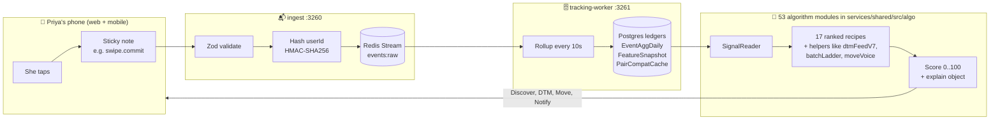
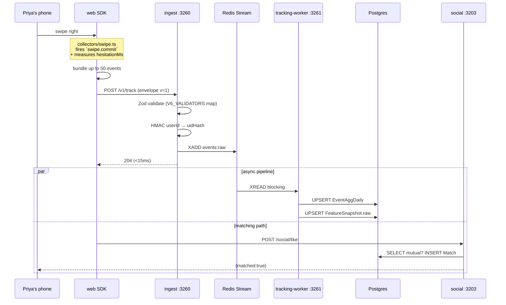
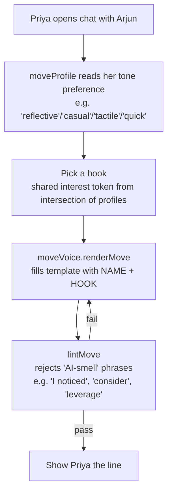
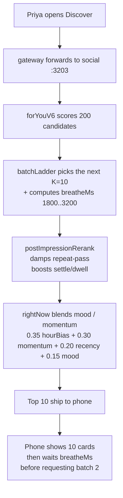
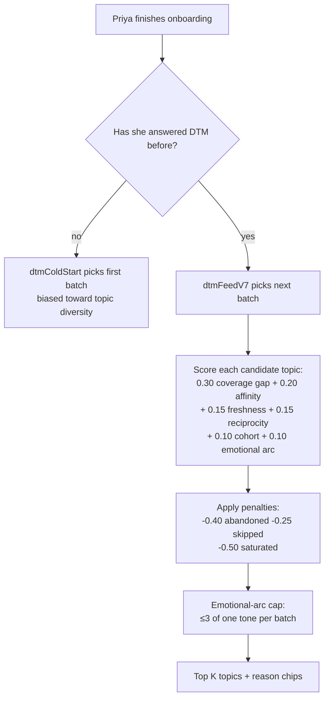
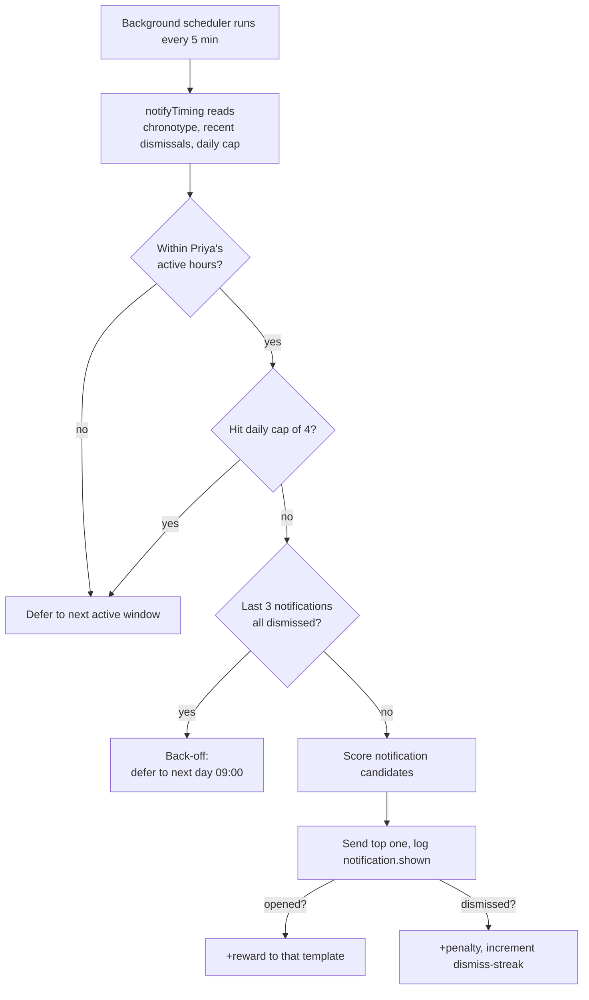

# Owner's guide — how Miamo decides everything

**TL;DR:** Priya taps her phone. Sticky notes (events) fly to a mailbox (`ingest`). A clerk (`tracking-worker`) sorts them into ledgers (Postgres). Pure-function recipes read the ledgers and produce a score for every candidate. The top scores become her Discover stack, her DTM batch, her Miamo Move, her notification time. This document explains every step in plain English first, then technically.

---

## 1. The four layers, drawn once



You will revisit this diagram three times. It is the entire system.

---

## 2. What Miamo learns about you (non-technical)

| What you do | What we remember | Why we care |
|---|---|---|
| Open the app every evening at 9 | "Priya is an evening person" (`chronotype` = evening) | We schedule notifications for evening, not 7 a.m. |
| Read a bio for 4 seconds and then swipe right | "Priya is a *reader* — she stays with cards" | We rank profiles with longer bios higher for her |
| Undo a like within 3 seconds | "She regretted that" — −8 points to that profile and similar ones | We stop showing similar people |
| Skip the same DTM topic twice | "She is not ready for that question" | We push it back 7 days, surface a different topic |
| Reply to a message in <2 minutes | "She is engaged with this match" | We boost that match in her feed |
| Long-press a Move suggestion | "She used the Move" | The phrasing template gets +1 reward; we use it again |

**Important:** Miamo never stores raw search text, raw cursor coordinates, or your exact location. Search becomes a length + hash. Coordinates become 0.1%-of-screen buckets. Location becomes a city.

---

## 3. The lifecycle of one tap (technical)

It's 9:02 p.m. Priya swipes right on Arjun.



**What Priya feels:** the heart turns red instantly (~120 ms total round-trip).

**What happens after:** within 15 minutes, her `FeatureSnapshot.raw` row contains the new `swipe.commit.hesitationMs` p50, the updated `dwellHistogram`, and any `swipe.regret` count. Her next Discover request reads that row and re-ranks accordingly.

---

## 4. The 53 algorithm modules — a map

The shared package has **53 source files** under `services/shared/src/algo/`. They split three ways:

### 4a. The 17 ranked recipes (the public scoring fleet)

These are the ones called by gateway / social / content / notifications to score things:

| Module | Surface | What it scores |
|---|---|---|
| `forYou`, `forYouV6` | Discover | Headline ranker — blends 8 (v4) / 10 (v5) / 12 (v6) ingredients |
| `aiPicks` | Daily picks strip | Ensemble that adds collaborative-filter (`cf`) signals |
| `aiMatch` | "Best match today" | Gold-standard pick, stricter thresholds |
| `active` | Online now | "Likely to reply now" — uses `lastAnyActivityMs` |
| `verified` | Verified-only filter | Boosts identity-verified profiles |
| `serious` | Serious-intent surface | Damps casual-intent candidates |
| `new` | New-on-Miamo | First-7-days boost |
| `cf` | Item-item neighbours | Dwell-weighted shared viewers |
| `dtm`, `dtmV6` | DTM (depth-the-match) | Ranks DTM candidates after both finish |
| `pairCompatV6` | Compatibility score | Cached pair score (0..1) |
| `messageSuggest` | Chat composer | Suggests opener variants |
| `beats` | Beats feed | Audio / micro-content ranker |
| `notifyTiming` | Notifications | Predicts the next good ping moment |
| `searchAugment` | Search results | Re-rank text matches with `forYou` |
| `feedAugment` | Content feed | Adds `filterAffinity` lane |
| `postImpressionRerank` | Discover (after a batch) | Damps repeat-pass; boosts settle/dwell |
| `moves` | Miamo Move surface | Picks which template + hook to render |

Each one is a pure TypeScript function, returns `{score: 0..100, explain: {...}}`, and has a unit test. See [ALGORITHMS.md](ALGORITHMS.md) for weights, examples, and rollback flags.

### 4b. The V6/V7 helpers (composition + learner + voice)

Newer infrastructure that the 17 ranked recipes plug into:

| Module | Purpose |
|---|---|
| `signals` | The single typed `SignalReader` interface every recipe reads through |
| `learner` | Logistic-bandit weight learner (per-user weight profile) |
| `learnerRewards` | Reward shaping (commit / chat / mutual-quality lift) |
| `contextAwareRewards` | Surface- and time-bucketed reward sampling |
| `surfaceLearner` ⭐ V7 | Splits learner state by surface (`discover` vs `dtm`) — different half-lives (14d / 30d) |
| `preferenceSnapshot` | Materialized "what the learner currently thinks" snapshot |
| `discoverPolicy` | Exploration / exploitation policy (epsilon-greedy with decay) |
| `dtmTopics` | Canonical 16-topic taxonomy + tone metadata |
| `dtmAnswerHistory` | Per-topic answer / skip / abandon counts |
| `dtmColdStart` | First-batch DTM picker (no history) |
| `dtmExplain` | Reason-chip generator for DTM batches |
| `dtmFeedV7` ⭐ V7 | Steady-state DTM batch builder (post-cold-start) |
| `batchLadder` ⭐ V7 | "Show 10, breathe, next 10" pagination with momentum-aware delay |
| `rightNow` ⭐ V7 | Sub-millisecond short-horizon mood / momentum signal |
| `moveVoice` ⭐ V7 | Move template renderer + linter (4 tones, 16 templates, AI-smell linter) |
| `moveProfile` | Per-user Move tone preference |
| `consent` | Consent gating (essential / quality / personalization / marketing) |
| `flags` | Env-var feature flags (`v4RankEnabled`, `v5FeatureEnabled`, `v6FeatureEnabled`) |
| `explain` | Common explain-object builder |

### 4c. The math primitives (low-level)

Tiny pure utilities that the recipes share:

`bowyerWatsonDelaunay`, `extendedEuclideanGcd`, `goldenSectionSearch`, `hash`, `lru`, `math`, `pearsonCorrelation`, `polynomialMultiply`, `qrDecompose`, `requestId`, `seedRandom`, `sylvesterEquation`, `trapezoidalRule`, `xorshiftStarRng`.

These are utilities — not user-facing rankers.

---

## 5. How Miamo Move decides what to say (the user's question)

A *Miamo Move* is a single line ≤ 90 characters that nudges Priya toward a thoughtful next step ("ask Arjun what filter coffee means to him"). Decision is in **four pure stages**:



### Why each piece exists (non-technical)

| Piece | What it does in plain English | Why we built it |
|---|---|---|
| **Tone** | Reflective vs casual vs tactile vs quick | Different people respond to different voices. A "casual" person hates a "reflective" Move. |
| **Hook** | A concrete shared word ("filter coffee", "indie sci-fi") | Generic Moves like "ask about her day" feel hollow. Specific ones land. |
| **Template** | The line shape with `{NAME}` and `{HOOK}` slots | Keeps tone consistent across thousands of Moves without sounding scripted. |
| **Linter** | Rejects 16 AI-smell phrases (em-dash, "as an AI", "kindly", etc.) | If a tuning change ever lets a corporate phrase slip out, tests fail loudly — never ships. |

### Worked example (Priya × Arjun)

- `moveProfile.preferredTone` = `reflective`
- Hook from interest intersection = `filter coffee`
- Template chosen at random from 4 reflective templates: `"tiny thought: ask {NAME} what {HOOK} means to them"`
- Render: `"tiny thought: ask Arjun what filter coffee means to them"`
- Linter check: ✅ no em-dash, no "I noticed", no "leverage", under 90 chars
- Shipped to Priya's screen in **< 2 ms**

### Why no LLM

The 4 × 4 template matrix produces ~16 base lines per pair × hook variation = thousands of unique outputs. With AI-smell linter, every output sounds like a thoughtful friend. Adding an LLM would (a) cost money, (b) leak phrases the linter would have to extend forever, (c) introduce latency and a new failure surface. The pure module wins on every axis.

### The flag

`ALGO_V7_MOVE_VOICE_ENABLED=1` enables the V7 voice. `=0` falls back to the v6 string ("How was your day?" defaults). Toggle takes effect on next request.

### Code

- [services/shared/src/algo/moveVoice.ts](../services/shared/src/algo/moveVoice.ts) — `renderMove`, `lintMove`, `toneFromArchetype`, `MAX_LEN`, `FORBIDDEN_TONES`
- [services/shared/src/algo/moveProfile.ts](../services/shared/src/algo/moveProfile.ts) — per-user tone preference
- `__tests__/moveVoice.test.ts` — 1000-render contract test (every output passes the linter)

---

## 6. How Discover decides the next 10 cards (V7)



The "breathe" between batches is *intentional* — it makes Discover feel like a curated playlist rather than infinite scroll. Momentum-aware: if Priya is flicking quickly, breathe shrinks; if she's deliberate, it expands.

### Code

- [services/shared/src/algo/forYouV6.ts](../services/shared/src/algo/forYouV6.ts)
- [services/shared/src/algo/batchLadder.ts](../services/shared/src/algo/batchLadder.ts) — `nextBatch`, `computeMomentum`, `skipBreathe`
- [services/shared/src/algo/rightNow.ts](../services/shared/src/algo/rightNow.ts) — `rightNow`
- [services/shared/src/algo/postImpressionRerank.ts](../services/shared/src/algo/postImpressionRerank.ts)

---

## 7. How DTM decides which questions to ask (V7)



### What "reciprocity" means

A topic has **reciprocity lift** if pairs who both answered it tend to produce **mutual-quality conversations** (≥10 messages over ≥2 days, both sides). Topics that produce real conversation get more airtime. Topics that produce one-sided lectures get less.

### What "emotional arc" means

A batch of 4 questions where all 4 are heavy / reflective is exhausting. The arc cap (`toneCap=3`) forces variety — at most 3 of any one tone per batch.

### Worked example

User has answered 12 of 16 canonical topics. Candidate `family_values` has importance 0.9, last asked 5 days ago, cohort popularity 0.6, reciprocity lift 0.7, no recent abandon/skip:

```
0.30 × coverageGap (1 - 12/16 = 0.25)  → 0.075
0.20 × affinity (importance 0.9)        → 0.180
0.15 × freshness (5/14 days normalised) → 0.054
0.15 × reciprocity (0.7)                → 0.105
0.10 × cohort (0.6)                     → 0.060
0.10 × arc (this tone underused)        → 0.080
                                          ─────
                              raw score = 0.554
                              penalties = 0
                              final     = 0.554
```

Compared to a saturated topic (answered 6 times → −0.50 penalty), this lands top-of-batch.

### Code

- [services/shared/src/algo/dtmFeedV7.ts](../services/shared/src/algo/dtmFeedV7.ts) — `buildDtmFeed`
- [services/shared/src/algo/dtmTopics.ts](../services/shared/src/algo/dtmTopics.ts) — canonical 16-topic taxonomy
- [services/shared/src/algo/dtmColdStart.ts](../services/shared/src/algo/dtmColdStart.ts)
- `__tests__/dtmFeedV7.test.ts`

---

## 8. How notifications decide *when* to ping you



**Concrete defaults:** daily cap = 4. Dismiss back-off = 3 consecutive dismissals → defer to next day 09:00 UTC.

### Code

- [services/shared/src/algo/notifyTiming.ts](../services/shared/src/algo/notifyTiming.ts)

---

## 9. The full ledger — where every signal is stored

| Postgres table | What it holds | Who writes it | Who reads it |
|---|---|---|---|
| `EventAggHourly` | Per-hour per-event-type counts | tracking-worker (every 10s) | tracking-worker (rollup→Daily) |
| `EventAggDaily` | Per-day per-event counts + per-target counts in `meta.targets` | tracking-worker (every 5 min) | `SignalReader.pairBehavior()`, all 17 recipes |
| `FeatureSnapshot` | Per-user materialized signals (chronotype, dwellHistogram, hesitationP50, etc.) | tracking-worker (every 5 min) | every recipe via `SignalReader` |
| `PairCompatCache` | Cached `forYou` score per (uidHash, targetId) pair | social on first compute | social fast-path |
| `UserWeightProfile` (with `surface` discriminator since Phase D) | Logistic-bandit weights per (uidHash, surface) | learner (online updates) | recipes via `applyLearnerRamp` |
| `MoveImpression` / `MoveAccept` | Move telemetry | content/social on Move events | `moveProfile` reward path |
| `ConsentScope` | Per-user per-class consent | users service | every collector + ingest gate |

---

## 10. The flags — how to roll back any layer in 30 seconds

Every algorithm has an env-var flag. Flip it from `1` to `0`, restart (or wait for next request). No code change.

| Flag prefix | Controls |
|---|---|
| `ALGO_V4_RANK_ENABLED_<SURFACE>` | v4 rank path on/off |
| `ALGO_V5_<FEATURE>_ENABLED` | v5 feature on/off |
| `ALGO_V6_<FEATURE>_ENABLED` | v6 feature on/off |
| `ALGO_V6_LEARNER_RAMP_<SURFACE>` | 0..1 ramp for learner influence |
| `ALGO_V7_MOVE_VOICE_ENABLED` | V7 Move voice on/off |
| `ALGO_V7_DTM_FEED_ENABLED` | V7 DTM steady-state batch builder |
| `ALGO_V7_BATCH_LADDER_ENABLED` | "Show 10, breathe, next 10" |
| `ALGO_V7_RIGHT_NOW_ENABLED` | Short-horizon mood blend |

Snapshot of all current flags at runtime: `GET /debug/flags` on any service.

---

## 11. Privacy, in plain English

- **Your user ID never reaches the analytics tables.** It is replaced with an HMAC-SHA256 fingerprint at `ingest`. The HMAC key is rotated quarterly; a rotation invalidates old joins, which is intended.
- **Your search text never leaves the device.** The web SDK hashes it client-side and sends only `{qLen, hashPrefix}`.
- **Your cursor coordinates are bucketed to 0.1% of viewport.** A heat map looks the same; a fingerprint is impossible.
- **Idle / away thresholds are constants** in `attention.ts`: 5s idle, 30s away. No PII.
- **Every event is gated by your consent class** (essential / quality / personalization / marketing). Withdraw any class in settings → that family of events stops being collected on the next session.

---

## 12. Where to go next

| If you want to know… | Read |
|---|---|
| Every event we collect, with payload schemas | [docs/TRACKING.md](TRACKING.md) |
| Every algorithm with weights and worked examples | [docs/ALGORITHMS.md](ALGORITHMS.md) |
| The 11-service shape and how requests flow | [docs/ARCHITECTURE.md](ARCHITECTURE.md) |
| How to deploy, scale, and recover | [docs/DEVOPS.md](DEVOPS.md) and [docs/RUNBOOK.md](RUNBOOK.md) |
| How a Miamo Move is rendered | [docs/MIAMO_MOVE.md](MIAMO_MOVE.md) |
| Security model, threat model, and how secrets flow | [docs/SECURITY.md](SECURITY.md) |
| The product story and Priya's full experience | [MIAMO.md](../MIAMO.md) |
