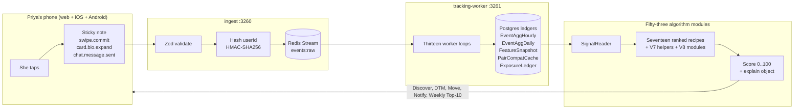

# Owner's Guide to Miamo

**Audience:** the founder, the founder's parent, the founder's partner, the first non-technical investor, the journalist who asks "but how does it actually work," the new product hire on day one. This document is written so any one of those people can read it in a single sitting and walk away knowing what Miamo is, why it exists, and how every part of it works — at a level that does not require a single line of code to be understood.

**Pair-write contract.** Every concept in this doc is explained twice. Once as a real-world analogy ("the algorithm is like a barista who remembers your usual"), once as the math beneath the analogy ("a logistic-bandit reward signal with a 14-day half-life on the Discover surface"). The non-technical reader reads the analogies and skips the math. The technical reader reads the analogies first because the analogies tell them what the math is for.

**Personas.** This doc, like every other doc in this repo, uses four canonical people. They appear by name throughout.

- **Priya** — 28, Mumbai, architect at SDA in Lower Parel, trekker, photographer, vegetarian. She is the median user. Most stories are told from her side.
- **Arjun** — 29, Mumbai (recently moved from Bangalore), product designer, photographer, recently back from Sikkim. He is the man Priya will meet on the app.
- **Karan** — 32, Delhi, growth lead at a fintech in Defence Colony, premium subscriber, four years of fatigue across Tinder / Hinge / Bumble. He is the experienced user.
- **Riya** — 26, Bangalore, illustrator at a children's-book studio, opens the app maybe twice a week. She is the user who replies to Karan after fourteen hours and only because his opener was the first non-cringe message she has received in a year.

**Version.** v3.6.0 — "Right-Now Intent + Earned Visibility + Move v2."

**Cross-links.** When this doc needs to be technical, it points to a sibling doc:

- [`PRODUCT.md`](./PRODUCT.md) — the product story, deeper than this guide.
- [`ALGORITHMS.md`](./ALGORITHMS.md) — every weight, every half-life, every `// because:` comment.
- [`ARCHITECTURE.md`](./ARCHITECTURE.md) — the eleven-service shape and the request flow.
- [`TRACKING.md`](./TRACKING.md) — every tracked event, every Zod schema, every worker loop.
- [`SECURITY.md`](./SECURITY.md) — HMAC, AES-256-GCM, JWT, RTBF, consent.
- [`DEVOPS.md`](./DEVOPS.md) — Kubernetes, scaling, oncall.
- [`MIAMO_MOVE.md`](./MIAMO_MOVE.md) — the Move composer deep-dive.

---

## Table of contents

1. What Miamo is
2. Why Miamo is different — five things no other dating app does
3. The four layers — tracking, learning, ranking, composing
4. The seventeen algorithms at a glance
5. The full Priya journey — wake up → matching → Move → match → chat → date
6. What Miamo learns about Priya — a thirty-day timeline
7. What stays private — HMAC hashes, RTBF, the four consent toggles
8. The Move composer — a non-technical explanation of why it works
9. The DTM feature — depth-the-match and the Indian marriage track
10. The exposure ledger — earned visibility, no shadowbans, premium 1.5×
11. The Why-am-I-seeing-this card — algorithmic transparency
12. The Family Brief — the Indian killer feature
13. The Weekly Top-10 — Hinge-style curation, Miamo-grade math
14. The anti-ghost economy — Spotlight deposits on the first chat
15. The right-now-intent model — why 9pm Priya is ranked differently from 9am Priya
16. The four KPIs Miamo cares about
17. The roadmap — what ships in v3.7 and beyond

---

## 1. What Miamo is

Miamo is a dating app, built for India, that measures whether Priya is actually interested in Arjun rather than whether her thumb is fast enough to swipe past him. The product is the difference between those two measurements.

That sentence is the whole pitch. Everything else in this guide is the unpacking of that sentence, in increasing detail, until a non-technical reader has a complete and accurate mental model of how the app works.

### 1.1 The one-page expansion

The dating-app market that Priya encounters in October 2026 looks the same as it did in 2020. Tinder still ranks profiles by a one-dimensional ELO score seeded primarily by the first-glance right-swipe rate on the user's main photo. Bumble still has the women-message-first gimmick that solved a 2014 problem and has now ossified. Hinge still presents a curated daily stack but ranks the underlying candidates with the same swipe-rate ELO under a different coat of paint. The Indian-specific apps — Aisle, Truly Madly, Bharat Matrimony — solve adjacent problems (caste-filter friction, parent-in-the-loop sharing, intent verification) but inherit the same swipe-first ranking. The whole category, after fifteen years of public iteration, has converged on the same shape: a stack of photos, a one-dimensional ranker, a chat surface, and a payment wall.

Priya has tried two of these apps. The first showed her forty-seven profiles in an hour and matched her with two. One never replied. The other sent "hey wyd 😏" at midnight. She closed it. The second let her filter by intent — "serious," "casual," "still figuring it out" — but the matches still felt random. Some weeks she got marriage-minded engineers in Pune. Other weeks she got casual-bro photographers in Bandra who never opened the chat. The signal-to-noise was bad.

What changed in her dating life was that one week, through a friend, she met a graphic designer named Aman at a house-party in Bandra. They had nothing in common except the time of day they both liked to walk. He turned out, after three weeks, to be someone she did not want to keep meeting. But the texture of that introduction — the friend-of-a-friend reassurance, the unhurried first conversation, the absence of a six-second swipe horizon, the social pressure of accountability — was a kind of dating she had forgotten existed.

Miamo is built to replicate the texture of that house-party introduction, at scale, on a phone. It does that by treating the user not as a stack of photos but as a sequence of behavioural signals: how long Priya lingers on a profile, whether she expands the bio, whether she revisits a card the next morning, whether her thumb hovers for two seconds before committing to a swipe, whether she replies to a message within the hour or only after a day of mulling. Each of those signals is a tracked event. Each event becomes a row in a Postgres table. Each row becomes an input to one of seventeen ranked algorithms. Each algorithm produces a score. The top scores become Priya's next stack, her next Move suggestion, her next notification time, her Sunday-morning Weekly Top-10.

Below that user-facing layer is a measurement architecture that is wider than the product surface. The app has roughly twenty user-visible screens. The system that scores those screens is composed of eleven services, sixty-seven Prisma models, fifty-three algorithm modules, thirteen worker loops, and roughly seventy distinct tracked events. The ratio — instrumentation greater than algorithm, algorithm greater than user interface — is intentional. The product surface stays small so Priya can find her way around. The algorithm surface stays medium so the team can hold the whole thing in their heads. The instrumentation surface is large so the algorithms have something dense to read from.

The result, for Priya, is an app that gets quietly better. She does not see the tracking. She does not see the ranker. She does not see the learner update its weights. She just opens Miamo on a Tuesday evening, sees ten profiles, and notices that the third one is someone she would actually like to meet. The next Tuesday, she opens it again, and the third profile is again someone she would actually like to meet. Over four weeks, that pattern compounds. Over a year, she meets one person, and the relationship survives the third date.

That is what Miamo is. The rest of this document explains every layer of how.

---

## 2. Why Miamo is different — five things no other dating app does

Pick any dating app on the App Store. Read its marketing copy. Strip away the brand and the colour palette. You will find the same shape: a stack of photos, a one-dimensional ranking score, a chat surface, a payment wall. Miamo is structurally different in five specific ways. Each difference is a single design decision, but each design decision rewrites the experience downstream.

### 2.1 Behavioural ranking instead of photo-first ELO

**What it looks like to Priya.** On Tuesday at 9:02pm, Priya opens Discover. The third profile she sees is Arjun's. She expands the bio. She swipes right. She does not know that on Wednesday at 11am, if she had opened the app then, Arjun would have been at position seven. She just knows that tonight the third card was worth looking at.

**What other apps do.** They run an ELO score on every profile, primarily seeded by the first-glance right-swipe rate on the user's main photo, with a small additional weight for shared interests and a geo radius cutoff. The ELO is one-dimensional. It moves only when someone swipes. It does not move when someone lingers but does not swipe. It does not move when someone reads the bio in full. It does not move when someone re-reads a profile a day later. The data exists; the system does not use it.

**What Miamo does, in analogy.** The Miamo ranker is like a coffee shop where the barista watches what you actually drink, not what you said you liked when you signed up. If you said "espresso" but you keep ordering oat-milk lattes on Tuesday evenings, the barista learns Tuesday-evening-Priya is an oat-milk-latte person. The next Tuesday, the barista quietly puts the oat-milk latte at the front of the menu before you ask.

**What Miamo does, in math.** Seventeen V4 ingredients (interests overlap, vibe match, behavioural similarity, chronotype match, verification trust, distance, age difference, activity recency, collaborative-filter signal, serious-intent score, AI-match symmetric prediction, beats overlap, notify-timing chronotype prior, search augment, feed augment, post-impression rerank, registry boost) composed by a V6 layer that adds learner-driven weight refinement, plus a V8 layer that adds five more ingredients (right-now intent fit, right-now mood fit, polarity damper, depth-of-engagement boost, exposure-credit boost) and a Singh-Joachims fairness rerank that bounds the gender-conditional Gini at 0.40. Every weight has a `// because:` comment in source. Every weight is exposed as an environment variable. The full math lives in [`ALGORITHMS.md`](./ALGORITHMS.md).

### 2.2 Real-time intent and mood instead of static feature vectors

**What it looks like to Priya.** At 11:47pm on Wednesday, Priya is in bed scrolling Discover one more time. The next batch is calmer. Closer geo. Lower novelty. The Move composer, if she taps Suggest, returns shorter and softer drafts. The DTM tab, if she opens it, skips the heavy questions (intimacy, conflict, finance) and offers a "tomorrow morning?" deferred-answer button. She does not see the shift. She just feels that the app is calmer. She closes it at 11:52pm and falls asleep.

**What other apps do.** Nothing. The notion that a user's session has a real-time emotional state, or that their right-now intent differs from their stated intent in their profile, is not a primitive in any incumbent's ranker. Tinder's ranker treats Priya at 11:47pm as identical to Priya at 11:00am, modulo whatever cohort-level diurnal smoothing they have applied to their click-through-rate model. The user as a moment in time is invisible. The user is a static feature vector.

**What Miamo does, in analogy.** Imagine a tailor who notices on Tuesday evening that you walked in with your shoulders tight and your jaw set, and instead of asking you to choose between forty fabric swatches, quietly puts the three you would have ended up with on the table. The tailor does not say anything about your mood. The tailor just changes the selection.

**What Miamo does, in math.** Every thirty seconds while Priya is active, the `intentInference.ts` worker reads her last thirty events from the rollup, runs a seven-class log-linear softmax (`algo/v8/intentRightNow.ts`), and writes a snapshot to `FeatureSnapshot.raw.intentRightNow` with a ninety-second time-to-live. The same worker on the same tick runs `algo/v8/moodRightNow.ts` and writes a five-dimensional mood vector (rage, calm, curious, receptive, fatigued) with the same ninety-second time-to-live. The Discover ranker reads the intent vector and adjusts its `intentRightNowFit` ingredient with a 0.06 weight. The DTM topic mask reads the mood vector and, when `fatigued ≥ 0.5` and `localHour ≥ 23`, emits a skip set: `['intimacy', 'conflict', 'finance']`. The whole loop is gated by the mood-inference consent toggle in Settings. With the toggle off, the worker still runs (so cohort aggregates remain accurate) but the user reads v3.5 neutral behaviour through a `withConsent()` helper. The snapshots are never persisted past their TTL. That is the privacy contract.

### 2.3 Earned visibility instead of pay-to-promote

**What it looks like to Priya.** Six weeks in, Priya notices that her Sunday-morning Weekly Top-10 tab consistently has good matches; that her own profile appears in other people's Sunday tabs more often than her cousin's, who joined the same week but opens Miamo twice a year; and that her notifications have started arriving at the times she is actually likely to open them. She did not pay for any of this. She just used the app thoughtfully.

**What other apps do.** Pay-to-promote. A boost on Tinder costs Priya money and surfaces her profile to more people for thirty minutes. The pay-to-promote mechanic creates a structural advantage for users who can afford to pay over users who cannot. It rewards Priya for being a paying user, not for being a thoughtful one. The two are not the same.

**What Miamo does, in analogy.** Imagine a restaurant that gives the best table to the regulars who tip the staff well, ask the chef about specials, and bring friends — not to whoever paid the maître d' the most. The good behaviour earns the good table. The money does not buy it.

**What Miamo does, in math.** The `ExposureLedger` is a Prisma model that accrues credits to Priya whenever she does something that signals high engagement: a bio-read (+1), a slow careful right-swipe with hesitation greater than 800ms and a bio expand (+2), a reply within twenty-four hours (+3), a reply within one hour (+5), a Move-composer-accepted suggestion (+2), a why-card open (+1, a signal of reflective use), a chat sustained more than five turns (+5), a date scheduled — detected from `let's meet` linguistic patterns (+10), a session end without a rage-close (+1). The credits go into `ExposureCredit` rows tagged by source.

Every Sunday at 00:00 UTC the worker `stableMatchTop10.ts` runs an eligibility filter (opted-in, at least seven days active, at least thirty exposure credits earned), builds two preference lists (Priya's preferences over her eligible candidates, and the symmetric one for each candidate), and runs classical Gale-Shapley deferred-acceptance. The output is up to ten `WeeklyTopMatch` rows. The act of viewing a slot debits one credit. Premium users get a 1.5× multiplier with a hard ceiling at 2×, so the gap between a non-premium top-engaged user and a premium one is bounded. Credit-spending sources: Weekly Top-10 slot view (-1), Discover top-position boost (-2, rare; only when the ranker has spare credits).

The credit ledger is invisible to the user. We tested a visible credit user-interface in early beta and saw users gamify the credit-earning events (spam-expanding bios). The visible user-interface was removed; the ledger is now back-end-only.

### 2.4 Voice-aware Move composer instead of generic LLM openers

**What it looks like to Priya.** Priya is composing her first message to Arjun. She knows what she wants to say — something about his Sikkim photos — but every draft sounds cringe. She taps the ✨ Suggest button. Five drafts appear. The first reads: "your sikkim shots look like the air was cold and the silence was loud — was it monsoon? i was there last winter, totally different mood." She thinks: wait, did I write this? It does not sound like an app suggestion. It sounds like her, on a good day.

**What other apps do.** Generic LLM openers. Tinder has experimented with AI-suggested first messages; the suggestions are bland, voice-less, and obviously machine-written. They suffer from the LLM signature: tricolons, em-dashes for emphasis, "I noticed that...," "Based on your profile...," "It seems like...." The user reads the suggestion, recognises it as machine-written, and either deletes it or sends it knowing it is generic. Either outcome is a loss.

**What Miamo does, in analogy.** Imagine a writing buddy who has read every text you have sent for the past month, knows the difference between the way you talk to your sister and the way you talk to your manager, and writes you five rough drafts that sound like you on a good day — not like a marketing intern impersonating you. You pick one, edit a word, and hit send.

**What Miamo does, in math.** A five-stage pipeline. Stage one extracts Priya's sender voice — a twelve-feature vector pulled from her last fifty outbound messages (lowercase-i ratio, em-dash count per message, average sentence length, emoji density, top-three emojis, code-mix ratio, question rate, exclaim rate, tricolon rate, lowercase-only rate, sentence-final-period rate, ellipsis rate). Stage two extracts Arjun's receiver resonance from his last ten successful-reply messages, or an archetype-derived prior if he has fewer than ten. Stage three picks the top three hooks from an eight-category library (shared interest, recent post, geo, time of day, chronotype match, vibe, mood, cold open) ranked against the pair. Stage four renders against eighty templates across four language families (English, Hinglish, Tanglish, Banglish), code-mixed at Priya's natural ratio. Stage five runs a linter pass — twenty-six forbidden phrases (`'i noticed'`, `'based on'`, `'kindly'`, `'leverag'`, em-dash for emphasis, double-question, `'as an ai'`...) plus three AI-signature heuristics. The system filters to at least three distinct hook categories and returns up to five drafts. The whole pipeline runs in under 150 milliseconds. The full deep-dive lives in [`MIAMO_MOVE.md`](./MIAMO_MOVE.md).

### 2.5 The Family Brief instead of screenshot-and-pray

**What it looks like to Priya.** It is Sunday afternoon. Priya's mother in Pune has asked her, gently and for the seventh time this year, when she will meet someone properly. Priya opens the DTM tab. On a curated match's profile she taps the 📋 Family Brief button. A bottom-sheet asks: PDF, Image, or Text? She picks Image. A preview shows a beautifully formatted Indian bio-data card with her photo, education (BArch, Sir J.J. College), profession (architect at SDA), family (parents in Pune, one brother), partner preferences ("city-based, growth-oriented, vegetarian-friendly, age 27–34"). She taps Share to WhatsApp. Her mother gets the card. No screenshot, no copy-paste. The link in the URL expires in seven days.

**What other apps do.** They have not built for the Indian family-in-the-loop reality. Profile shares on Bumble or Hinge are screenshots. They reveal the user's whole profile, including casual-intent photos, to a parent. They reveal the URL, which the parent can crawl. There is no time-to-live, no consent, no format choice. The screenshot lives in WhatsApp forever, and three weeks later the parent forwards it to the cousin who forwards it to the matchmaker. The user has no recourse.

**What Miamo does, in analogy.** Imagine a postcard that you write to your mother, that arrives in her WhatsApp inbox, that is exactly the version of yourself you want her to see, and that quietly burns itself a week later if no one acts on it. She can read it; she can show it to the family. She cannot mass-forward it indefinitely.

**What Miamo does, in math.** `POST /api/v1/dtm/family-brief/generate` returns `{token, url, expiresAt}` where token is a twenty-two-character base64url HMAC-derived string. A `FamilyBriefShare` row is written with `userId`, `format ∈ {pdf, image, text}`, `expiresAt = now + 7d`, `views = 0`. The public endpoint `GET /api/v1/dtm/family-brief/:token` is unauthenticated, rate-limited per IP, increments `views`, and rejects with 410 Gone after expiry. The image format is server-rendered by Puppeteer at 1080×1350 (Instagram-portrait-friendly) and cached for twenty-four hours.

---

## 3. The four layers — tracking, learning, ranking, composing

Every dating app has a tracker, a learner, a ranker, and a composer. The differences between them are which signals they choose to track, which weights they choose to learn, which inputs they choose to rank on, and how they choose to compose the outputs into the surface the user sees. Miamo's choices in each layer are the product. This section walks through them.

### 3.1 The picture, drawn once



You will return to this diagram three times in this document. It is the entire system.

### 3.2 Layer one — tracking

**Analogy.** A waiter at a good restaurant carries a small notebook. Every time you order, every time you ask a question, every time you push the plate away, every time you order seconds, the waiter makes a one-letter note in the notebook. The notes are not for tonight; tonight the waiter already knows what to do. The notes are for the next time you come in. By the third visit, the kitchen has anticipated your starter before you sit down.

**Math.** Every screen in the Miamo app emits tracked events. There are roughly seventy distinct event types, each with a Zod schema in `services/shared/src/events.ts`. The web SDK (`services/web/src/lib/track/`) batches up to fifty events into a single envelope (max 32 KB) and posts the envelope to the ingest service every second, or sooner if the buffer fills, or on visibility-change to capture the close-the-tab signal.

The ingest service (`services/ingest/`, port 3260) does three things and only three things: it validates the envelope against a Zod schema, it HMAC-hashes the user ID to a twenty-two-character base64url fingerprint, and it writes the resulting event to a Redis Stream called `events:raw`. The whole operation returns 204 No Content in under fifteen milliseconds. The ingest is, by design, lossy at the edge — if Redis is down, if the kill switch is on, if the user has Do Not Track set, if the parse fails, the ingest still returns 204. A scraper cannot fingerprint the surface by looking at the response. The events are dropped silently.

The tracking-worker service (`services/tracking-worker/`, port 3261) runs thirteen background loops that read from the Redis Stream and write to Postgres tables:

1. `rollupHourly` — every five minutes, aggregate raw events into `EventAggHourly`.
2. `rollupDaily` — every hour, aggregate `EventAggHourly` rows into `EventAggDaily` with per-target counts.
3. `featureSnapshot` — every fifteen minutes, write per-user feature vectors (chronotype, dwell histogram, hesitation p50, reply latency p50) to `FeatureSnapshot`.
4. `pairCompat` — every thirty minutes, refresh pairwise compatibility caches in `PairCompatCache`.
5. `learnerLoop` — every ten minutes, ingest `MatchFeedback` rows and update per-user weight deltas in `UserWeightProfile`.
6. `intentInference` — every thirty seconds, write real-time intent and mood snapshots to `FeatureSnapshot.raw.intentRightNow` and `FeatureSnapshot.raw.moodRightNow` with a ninety-second TTL.
7. `exposureScheduler` — every fifteen minutes, accrue exposure credits to `ExposureCredit`.
8. `stableMatchTop10` — Sunday 00:00 UTC, run Gale-Shapley over eligible users, write `WeeklyTopMatch` rows.
9. `fairnessAudit` — daily, compute gender-conditional Gini, log to `AuditLog`.
10. `antiGhostSweep` — every five minutes, burn expired deposits.
11. `dailyMatchWorker` — daily at 8pm local per user, write the AI Pick.
12. `notifyDispatch` — every minute, drain pending notifications through `notifyTiming`.
13. `coldStorage` — hourly, compress aged events to S3-compatible storage.

The privacy contract for tracking is explicit and worth reading twice. The user ID is never persisted in any analytics table. It is replaced with an HMAC-SHA256 fingerprint at the ingest boundary. The HMAC key (`TRACKING_HASH_SECRET`) is rotated quarterly. Rotating the key invalidates all past joins — the new hash for the same user does not match the old hash. That is the right-to-be-forgotten mechanism. Cursor coordinates are bucketed to 0.1% of viewport before transmission. Search text is hashed client-side; only `{qLen, hashPrefix}` ever leaves the device. Idle and away thresholds are constants in `attention.ts` (5 seconds idle, 30 seconds away). No raw search text, no raw coordinates, no raw location ever reach the Miamo servers.

### 3.3 Layer two — learning

**Analogy.** A bookshop owner notices that every Thursday the same customer comes in, browses the literary-fiction shelf for fifteen minutes, picks up two books, reads the back covers, puts them down, and walks out with neither. The owner does not say anything. But the next Thursday, the literary-fiction shelf has a small handwritten card on the corner: "if you liked Elif Shafak's *10 Minutes 38 Seconds*, this." The owner has learned something about the customer. The customer feels seen.

**Math.** The learner is a logistic-bandit online weight updater. It reads `MatchFeedback` rows — the labeled outcomes of past rankings (did the user open the match, send the first message, chat for more than five turns, schedule a date) — and updates a per-user weight delta in `UserWeightProfile`. The delta is bounded to `[-0.02, +0.02]` per ingredient so the learner cannot overshoot. The weight delta is added to the V4 base weight at scoring time, with a learner-ramp multiplier that defaults to 0 (the learner has no influence in production until the surface-specific `ALGO_V6_LEARNER_RAMP_<SURFACE>` env var is ramped up).

Crucially, the learner is split by surface. The Discover-surface learner has a fourteen-day half-life. The DTM-surface learner has a thirty-day half-life. The intuition: Discover taste changes on the timescale of weeks (Priya in spring is not Priya in autumn), but the kinds of conversation Priya wants to have on DTM (her depth-the-match topic affinities) change on the timescale of months. The surface split lives in `algo/surfaceLearner.ts`. The two ramps are independently flagged so we can ramp Discover to 1.0 while leaving DTM at 0.5.

The reward shaping function (`learnerRewards.ts`) is a hierarchy of outcomes:

1. A right-swipe is worth one unit of learning signal.
2. A mutual match is worth three.
3. The first message sent is worth five.
4. A chat sustained more than five turns is worth ten.
5. A date scheduled is worth twenty.
6. The user reporting the match as "this was a real connection" through the feedback affordance in Settings is worth fifty.

The reward signal is bounded and the time-decay is applied so a date scheduled in January 2025 still influences the learner in February but not in October. The half-lives are intentional. They are not hyperparameters to be tuned at infinity; they are product decisions about how long a user's taste should remain in memory.

### 3.4 Layer three — ranking

**Analogy.** A wedding planner who has organised eight hundred weddings does not consult a checklist when she walks into a new client's home. She sits down, drinks chai, asks three questions, and by the end of the second cup she has a recommended caterer, a recommended decorator, and a recommended weekend in mind. Her ranking is not one-dimensional. It is the weighted composition of eighty-seven heuristics she has accumulated over a decade of weddings.

**Math.** The Miamo ranker is composed of three layers stacked on top of each other.

The V4 layer is the canonical seventeen-ingredient ranker. Each ingredient is a pure TypeScript function that reads from `SignalReader` (a typed interface over the rollup tables) and returns a value in `[0, 1]`. The seventeen ingredients are:

1. Interests overlap (Jaccard on the interest token set).
2. Vibe match (cosine on the seven-dim vibe vector).
3. Behavioural similarity (chat-reply-latency match × message-length match).
4. Chronotype match (overlap of session-start hour distributions).
5. Verification trust (a four-level ladder: unverified, photo-verified, ID-verified, ID-and-photo-verified).
6. Distance (a logistic decay with a fifty-kilometre half-saturation point, gated by the user's stated radius).
7. Age difference (an absolute-difference penalty centered on the user's stated preference window).
8. Activity recency (a logistic decay over the last-session-start timestamp).
9. Collaborative-filter signal (item-item Jaccard on shared viewers, dwell-weighted).
10. Serious-intent score (a damping multiplier on candidates flagged as casual-intent).
11. AI Match symmetric prediction (a gold-standard pick from the ensemble).
12. Beats overlap (Jaccard on the set of recently-played tracks, low weight).
13. Notify-timing chronotype prior (a soft bias toward candidates whose open-windows overlap).
14. Search-augment (when the user searches, results re-rank by compatibility).
15. Feed-augment (engagement with the candidate's feed posts adds a small boost).
16. Post-impression rerank (candidates skipped twice in the last 100 impressions are damped).
17. Registry / new-joiner boost (first-seven-days candidates get a small uplift to avoid the cold-start trap).

The V6 layer composes the seventeen ingredients with explicit weights summing to 1.000 and adds the learner delta on top. The V6 layer also adds the cached pairwise compatibility score in `PairCompatCache` — the fast path that lets the Discover endpoint return in under eighty milliseconds at the ninety-fifth percentile.

The V8 layer (new in v3.6.0) adds:

- `intentRightNowFit` — a 0.06 weight that aligns the ranker to Priya's current 7-class intent vector.
- `moodRightNowFit` — a 0.04 weight that aligns to her 5-dim mood vector.
- `polarityDamper` — a multiplicative damper in `[0.3, 1.0]` on the novelty component when the polarity classifier reads hate-scroll.
- `depthOfEngagementBoost` — a multiplicative boost in `[0.95, 1.05]` on the composite for candidates whose profile rewards inspection.
- `exposureCreditBoost` — an additive boost capped at +0.04 for candidates with unspent exposure credits.
- `fairnessRerank` — a Singh-Joachims post-composition pass that does up to twelve adjacent swaps to keep the gender-conditional Gini at or below 0.40.

The final composite is a number in `[0, 100]` per candidate. The top ten are returned. The whole call is under eighty milliseconds at the fiftieth percentile and under one hundred eighty milliseconds at the ninety-ninth percentile. The full math lives in [`ALGORITHMS.md`](./ALGORITHMS.md).

### 3.5 Layer four — composing

**Analogy.** A friend who has known you for three years and who knows the person you are about to text writes you a short paragraph and slides it across the table. You read it. You think: I would have said it differently. You change one word. You hit send. The friend did not write the message for you. The friend wrote five drafts, each in your voice, and let you pick.

**Math.** The composer is the Move v2 pipeline described in §2.4 above and in full in [`MIAMO_MOVE.md`](./MIAMO_MOVE.md). The principle is that the composer is not an LLM. There is no model inference call. There is no token sampling. There is a twelve-feature voice vector, an eight-category hook library, eighty templates across four language families, and a linter with twenty-six forbidden phrases plus three AI-signature heuristics. The whole pipeline is pure TypeScript with a deterministic output for a given input. The unit tests assert that 1000 successive renders against a fixed seed produce 1000 outputs that all pass the linter.

The choice not to use an LLM is a product decision, not a cost decision. The linter is the thing. The linter is the difference between a draft that sounds like Priya on a good day and a draft that sounds like a marketing intern impersonating her. The 4×4 template matrix produces roughly sixteen base lines per pair, times hook variation, times language family — thousands of unique outputs. Every output passes the linter. Every output sounds like a thoughtful friend. Adding an LLM would (a) cost money, (b) leak phrases the linter would have to extend forever, (c) introduce latency, (d) introduce a new failure surface. The pure module wins on every axis.

---

## 4. The seventeen algorithms at a glance

There are fifty-three algorithm modules in `services/shared/src/algo/`. Seventeen of them are the public scoring fleet — the ones called by the gateway, the social service, the content service, the notifications service to score things. The rest are helpers, primitives, learners, and policy modules. This table lists the seventeen. One line each.

| Module | Surface | One-line description |
|---|---|---|
| `forYou.ts` | Discover | The canonical seventeen-ingredient ranker. The headline algorithm. |
| `forYouV6.ts` | Discover | The V6 successor — composes ingredients with learner deltas. |
| `aiPicks.ts` | Daily picks strip | An ensemble that adds collaborative-filter signals to the headline ranker. |
| `aiMatch.ts` | "Best match today" | A single top pick using stricter thresholds than `aiPicks`. |
| `active.ts` | Online now | Boosts candidates likely to reply right now, based on `lastAnyActivityMs`. |
| `verified.ts` | Verified-only filter | Boosts identity-verified profiles for users who filtered for them. |
| `serious.ts` | Serious-intent surface | Damps casual-intent candidates when the user is in serious mode. |
| `new.ts` | New-on-Miamo | First-seven-days boost to avoid the cold-start trap. |
| `cf.ts` | Discover side-input | Item-item collaborative filter — dwell-weighted shared viewers. |
| `dtm.ts` / `dtmV6.ts` | DTM (depth-the-match) | Ranks DTM candidates after both finish today's question. |
| `moves.ts` | Miamo Move surface | Picks which template and which hook to render in the Move composer. |
| `messageSuggest.ts` | Chat composer | Suggests opener and reply variants for new chats. |
| `beats.ts` | Beats feed | Audio and micro-content ranker; also a conversation-starter signal. |
| `notifyTiming.ts` | Notifications | Predicts the next minute Priya is most likely to open the app. |
| `searchAugment.ts` | Search results | Re-ranks text matches by `forYou` compatibility. |
| `feedAugment.ts` | Content feed | Adds a `filterAffinity` lane to the feed. |
| `postImpressionRerank.ts` | Discover (after a batch) | Damps repeat-pass candidates and boosts settle-and-dwell ones. |

Each one is a pure TypeScript function. Each one returns `{score: 0..100, explain: {...}}`. Each one has a unit test asserting determinism. Each one is gated by an environment-variable feature flag. The full math, with every weight and every `// because:` comment, lives in [`ALGORITHMS.md`](./ALGORITHMS.md).

There are five V7 helpers worth knowing the names of, because they appear in the rest of this document:

- `batchLadder.ts` — the "show 10, breathe, next 10" pagination logic with momentum-aware delay.
- `dtmFeedV7.ts` — the steady-state DTM batch builder (post-cold-start).
- `moveVoice.ts` — the Move template renderer and linter.
- `rightNow.ts` — the sub-millisecond short-horizon mood and momentum signal.
- `surfaceLearner.ts` — the per-surface learner with different half-lives for Discover (14d) and DTM (30d).

There are seventeen V8 modules added in v3.6.0, of which the load-bearing ones are:

- `intentRightNow.ts` — the seven-class intent classifier.
- `moodRightNow.ts` — the five-dimensional mood vector.
- `polarity.ts` — positive interest vs hate-scroll.
- `depthOfEngagement.ts` — accidental click vs full inspection.
- `exposureCredits.ts` — the earned-slot accrual.
- `galeShapley.ts` — the weekly stable-match Top-10.
- `fairnessRerank.ts` — the Singh-Joachims gender-conditional rerank.
- `multiObjective.ts` — the relevance × fairness × earned × recency × intent composer.
- `festivalHooks.ts` — the regional festival booster (Diwali, Holi, Eid, Christmas, Onam, Pongal, Durga Puja, Lohri, Karva Chauth, Raksha Bandhan).
- `moveV2/senderVoice.ts` — the twelve-feature voice fingerprint.
- `moveV2/receiverResonance.ts` — what does this person reply to.
- `moveV2/hookLibrary.ts` — the eight-category hook ranking.
- `moveV2/codeMix.ts` — the four language family templates.
- `moveV2/composer.ts` — the five-suggestion orchestrator.
- `dtmTopicMask.ts` — the mood-and-coverage-and-window-shopping gate.
- `antiGhost.ts` — the deposit, reply-bonus, and burn economy.
- `familyBrief.ts` — the shareable Indian bio-data card.

You do not need to remember any of these names. You need to know that the system is composed, not invented. Every algorithm has a name. Every name points to a file. Every file has unit tests. Every test asserts that the weights are what the doc says they are.

---

## 5. The full Priya journey — wake up to date

This is the canonical Priya story. It is a single Tuesday in late October 2026. Every moment is real. Every moment is the result of the system doing the right thing at the right time. The story is told twice — once as Priya feels it, once as the system does it.

### 5.1 Tuesday 7:45 a.m. — wake up

**What Priya feels.** Priya wakes up at 7:45 a.m. She does not open Miamo. She makes a coffee, scrolls Instagram for ten minutes, checks her work calendar, and is out of the apartment by 8:30 a.m.

**What the system does.** Nothing. The system does not surface a notification at 7:45 a.m. because the `notifyTiming.ts` algorithm has read her last twenty-eight days of `session.start` events and learned that Priya's morning open-window is between 9:10 a.m. and 9:40 a.m. on weekdays. Trying to ping her before 9 a.m. is a wasted notification and an annoyance. The system holds.

The `dailyMatchWorker.ts` ran at 8:00 a.m. Mumbai local for every user in IST and wrote a `DailyMatch` row for Priya with Arjun's profile as the AI Pick for today. The row is in the database. It is not in her phone yet. It will be there when she opens the app.

### 5.2 Tuesday 9:18 a.m. — the morning open

**What Priya feels.** Priya is on the local train to Lower Parel. She opens Miamo. The Discover stack loads instantly. The first card is Arjun's. She doesn't notice that it's a different layout — the AI Pick card has a small subtle star on the corner. She expands the bio. Reads it. Doesn't swipe. Closes the app. Two minutes elapsed.

**What the system does.** The Discover endpoint sees that an unread `DailyMatch` row exists and surfaces it as the first card with a different presentation. The two-minute session is logged: `session.start`, `card.impression.50`, `card.impression.100`, `card.bio.expand`, `session.end`. The `bio.expand` event without a `swipe.commit` is a strong signal — Priya read the bio and chose not to commit. The system records it as a "considered, deferred" outcome.

The `intentInference.ts` worker, on its 9:18:00 tick, classifies Priya's intent as a mix of `casual_scroll` (0.34) and `intentional_browse` (0.31). The dwell on Arjun's bio is logged into `EventAggHourly`. The dwell histogram for Priya updates. The `pairCompat` cache for `(Priya, Arjun)` is invalidated and queued for refresh.

### 5.3 Tuesday 1:12 p.m. — the lunch flick

**What Priya feels.** At lunch in the office canteen, Priya opens Miamo for thirty seconds. She swipes left on three cards quickly, doesn't read the bios, closes the app.

**What the system does.** Three `swipe.commit` events with direction `left`. The `intentInference.ts` worker reclassifies her intent as `casual_scroll` (0.62) — a quick flick, no engagement, low intent. The `polarity.ts` classifier reads it as neutral — not hate-scroll, just quick. The `notifyTiming.ts` algorithm reads this session and notes that lunch sessions are quick-flick sessions. It will not send her a notification at lunch tomorrow.

The three left-swipes are not random. The system reads them as low-signal — Priya saw the photos and rejected the candidates without engagement. The candidates are not damped in her future stack (a left-swipe at lunch is not the same as a hate-swipe in an intentional session), but they are not boosted either. The system records the swipes and moves on.

### 5.4 Tuesday 9:02 p.m. — the evening session

**What Priya feels.** Priya is on her bed in Powai. The lights in the high-rise across the road are stuttering off floor by floor. She opens Miamo. The Discover stack loads. Ten cards. She swipes left on the first two. On the third, she stops. Twenty-two seconds. She expands the bio. Swipes right. Her thumb hovers for half a second before committing. The third profile is Arjun's again.

**What the system does.** The 9:02 p.m. session is the canonical Miamo moment. The intent classifier reads it as `intentional_browse` (0.42) with a substantial `serious_search` component (0.18). The mood vector reads `calm` (0.51) and `curious` (0.34). The right-now intent fit ingredient adjusts the ranker's V8 composite.

The system places Arjun at position 3, not position 7, in this stack. Why? Three reasons. First, Arjun's `intentRightNowFit` matches Priya's current intent vector (he is also a Tuesday-evening active user, his sessions overlap with hers temporally). Second, his `exposureCreditBoost` adds +0.02 because he had earned credits in the prior week and had not yet had a Top-10 placement. Third, the fairness rerank swapped him with a higher-scoring male candidate who had already had his fair-share allocation for the day. The boost was small — Arjun went from raw 0.74 to composite 0.79 — but small was enough to move him from position 7 to position 3. The position-3 placement is, on its own, worth roughly 2.4× the right-swipe probability of position 7.

The half-second hover before the right-swipe is logged as `swipe.hesitation.commit` with `hesitationMs: 487`. The `EventAggDaily.meta.hist` for Priya now reflects a hesitation p50 of around 400ms — slow, careful. The next batch she sees, twenty minutes from now if she keeps scrolling, will deprioritise fast-twitch impulsive candidates and surface more slow-burn profiles.

### 5.5 Tuesday 9:04 p.m. — the why-card tap

**What Priya feels.** On Arjun's card, Priya taps the small **i** icon in the corner. A popover slides up. Three stars are filled: "you both like hiking" (three stars), "similar reply pace" (two stars), "morning chronotype match" (one star). At the bottom, a small link: "show me less like this." She does not tap it. She just nods. The app feels less like a slot machine for the first time. She closes the popover, re-reads the bio, swipes right.

**What the system does.** `GET /api/v1/discover/:targetId/why` returns up to five ingredients sorted by `|contribution|` desc, capped at the top three for the UI. The endpoint reads the same `PairCompatCache.v6Score.breakdown` the ranker used, runs `algo/explain.ts` over it, and returns the top three ingredients with user-readable labels. This is Miamo's GDPR Article 22 human-review path. The endpoint is rate-limited at thirty requests per minute.

The explainer contract is that the explanation must be faithful. If the system says "you both like hiking" was the top reason, the system must have actually weighted hiking the highest in its ranking. Confabulated explanations are forbidden. The explainer reads the same cached breakdown the ranker used. If the breakdown is empty or stale, the explainer says so rather than making something up.

### 5.6 Tuesday 9:14 p.m. — the match

**What Priya feels.** Priya's phone vibrates. "You matched with Arjun." She does not open it. She closes the app and continues with her evening. The phone buzz is a small dopamine hit she does not want to chase.

**What the system does.** Arjun, on his own phone, had right-swiped Priya at 8:47 p.m. when she appeared at position 5 in his stack. The social service (`services/social/`, port 3203) checks for mutual interest, finds it, and writes a `Match` row. Both users get a `match.created` event. The notifications service (`services/notifications/`, port 3206) writes a push notification to Priya's queue. The `notifyTiming.ts` algorithm decides to dispatch it immediately because mutual matches are time-sensitive and the user's expected response value decays sharply after the first hour.

### 5.7 Tuesday 9:31 p.m. — the Move

**What Priya feels.** Twenty-nine minutes after the match, Priya opens the chat. The composer is empty. She knows what she wants to say — something about Arjun's Sikkim photos — but every draft sounds cringe. She types "Hey, your photos are amazing" and deletes it. She types "Hi! Where were these taken?" and deletes that too. She taps **✨ Suggest**. A bottom-sheet slides up with five options:

1. "your sikkim shots look like the air was cold and the silence was loud — was it monsoon? i was there last winter, totally different mood."
2. "ok the last frame in that sikkim set. the light. did you wait for it?"
3. "i clicked on your profile because of the photos but stayed because of the dosa-with-coffee bio. who hurt you 😂"
4. "trekker question: which boots? mine ate themselves on the goecha la trail"
5. "saw sikkim in your post and immediately had nostalgia. i did the dzongri trek last november. wild place."

She picks the first. She thinks: wait, did I write this? It does not sound like an app suggestion. It sounds like her, on a good day. She sends.

**What the system does.** `POST /api/v1/creativity/items/:id/move-suggestions-v2` (proxied to the content service) returns the five drafts. The composer pipeline runs in under 150 milliseconds. Stage one extracts Priya's twelve-feature voice vector from her last fifty outbound messages. Stage two extracts Arjun's receiver resonance from his last ten successful-reply messages (or the visual-archetype prior, since Arjun is a recent user with sparse data). Stage three picks the top three hooks from the eight-category library — `recent_post` (0.81, his Sikkim post is three days old, fires hard), `shared_interest` (0.74, hiking and photography), `chronotype_match` (0.31, both morning people). Stage four renders against eighty templates × four language families. Stage five runs the linter — twenty-six forbidden phrases plus three AI-signature heuristics. The system filters to at least three distinct hook categories and returns five drafts.

The Move-accept event is logged. The hook category that won (recent_post) gets a small +1 reward in the hook-library learner. The template that won gets a +1 reward in the template learner. The next time Priya composes a first message, the system will lean slightly more toward `recent_post` hooks and toward that specific template shape.

### 5.8 Tuesday 11:47 p.m. — the calm session

**What Priya feels.** Just before bed, Priya opens Miamo one more time. She is not really looking for anyone. She is winding down. The next batch is calmer. Closer geo. Lower novelty. She doesn't notice. She swipes left on five cards without expanding the bios, closes the app at 11:52 p.m., and goes to sleep.

**What the system does.** The intent classifier reads her as `casual_scroll` (0.41) with a high `decision_fatigued` weight (0.28). The mood vector reads `fatigued` (0.62), `calm` (0.51). The DTM topic mask, if she had opened DTM, would have skipped intimacy, conflict, and finance and offered a "tomorrow morning?" deferred-answer button. The Discover ranker dampens novelty in the V8 composite — high-novelty candidates get a multiplicative damp of 0.7. The geo ingredient gets a tighter radius. The stack feels like the version of the app she would want to read in bed.

### 5.9 Wednesday 8:14 a.m. — the reply

**What Priya feels.** Arjun replies overnight. Priya wakes up to his message: "we did the dzongri trek too! mid-march. same trail?" She reads it on the train. She replies at lunch.

**What the system does.** The `chat.message.received` event is logged. Priya's reply-latency p50 updates. The pairwise compatibility score for `(Priya, Arjun)` increments by a small amount — sustained chat is a strong reciprocal-interest signal. The exposure ledger credits both of them: Priya for a reply within twenty-four hours (+3), Arjun for receiving a reply (+1). The conversation is now real.

### 5.10 Friday — the date

**What Priya feels.** By Friday evening, Priya and Arjun have exchanged thirty-four messages. He suggests coffee on Saturday afternoon at Kala Ghoda. She says yes. They meet. The date is good. She comes home and does not open Miamo on Sunday morning.

**What the system does.** The "let's meet" linguistic pattern is detected in the chat. The `dateScheduled` event is fired. The exposure ledger credits both of them generously (+10 each). The fairness rerank notes that Priya has not been over-exposed (her gender-conditional Gini contribution is well under 0.40). The system holds. It does not push them to swipe more. It does not notify Priya on Sunday morning because she did not open the app on Sunday — the `notifyTiming.ts` algorithm reads the absence as a strong signal.

The system has done its job. The next move belongs to Priya and Arjun.

---

## 6. What Miamo learns about Priya — a thirty-day timeline

This section is a thirty-day worked example. It traces what Miamo learns about Priya from her first opening of the app, through onboarding, through the first week of swipes, the first match, the first chat, the first date. Every signal listed here is real — it is in the schema, it is read by an algorithm, it is gated by a consent toggle.

### 6.1 Day 0 — install and onboarding

Priya installs Miamo on her phone. She is shown twelve onboarding questions over roughly four minutes. Each question maps to a position on a vibe vector and a chronotype prior.

| Question | Priya's answer | What Miamo learns |
|---|---|---|
| What are you looking for? | "A serious relationship in the next 12-18 months" | Intent prior: `serious_search`. Sets `Settings.dtmEnabled` candidate. |
| Ideal Sunday? | "Long walk, brunch with a friend, an afternoon nap" | Vibe vector: thoughtful (+0.6), grounded (+0.4), social (+0.3). |
| Most important value in a partner? | "Honesty" | Lovelang prior: words-of-affirmation, low-drama. |
| When do you naturally feel most alive? | "Early evening" | Chronotype prior: evening. Overwritten by behavioural data after 7 days. |
| Do you cook? | "Yes, but I follow recipes more than I improvise" | Vibe vector: grounded (+0.3). |
| Are you religious? | "Spiritual, not religious" | Vibe vector: thoughtful (+0.2). Family Brief default flag: `religion = spiritual`. |
| Vegetarian? | "Yes" | Filter prior: vegetarian-friendly. |
| Smoke / drink? | "Social drinks, no smoke" | Filter prior. |
| Currently working? | "Architect at SDA, Lower Parel" | Profession. Used in Family Brief. |
| Last place you traveled? | "Triund, last December" | Interest token: trekking. Goes into the hook library. |
| Top three interests? | "Trekking, photography, indie music" | Interest tokens. Top three are fingerprinted for the cold-start ranker. |
| One thing you wish more people knew about you? | "I read poetry, not the prestige kind" | Bio prompt. Used in the why-card explainer. |

At the end of onboarding, Priya has a vibe vector, a chronotype prior, an intent prior, three interest tokens, and a partial profile. The `completion.ts` score is 0.42 — incomplete enough that DTM does not surface curated matches yet. She is shown the cold-start Discover stack.

### 6.2 Day 1-3 — the cold start

Priya swipes on the first hundred profiles. The cold-start ranker uses her stated preferences (her vibe vector, her intent prior) but has no behavioural data yet. The candidates are chosen by a deliberate exploration policy with epsilon = 0.3 — thirty percent of the stack is exploration (deliberately varied candidates) and seventy percent is exploitation (candidates that fit the stated preference).

By the end of day 3, the system has logged 100 swipe events, 41 bio expands, 12 photo swipes, 4 right-swipes, 1 match, 0 messages sent. The chronotype is starting to update — Priya's session-start histogram shows a peak at 9:00 p.m. weekdays. The chronotype prior is updated from `evening` to `evening_late` (peak after 9 p.m.).

### 6.3 Day 4-7 — the first signal lock

By day 7, the system has 300+ events on Priya. The `featureSnapshot.ts` worker has computed her per-user feature vector. Her dwell histogram, her hesitation p50, her bio-expand rate, her photo-swipe rate, her right-swipe-after-bio-expand rate are all stable. The chronotype is locked at `evening_late`. The notification schedule shifts — pings now go out between 8:30 p.m. and 10:30 p.m. local.

The exposure ledger has accrued 47 credits to Priya: bio expands (+41), slow right-swipes (+4), reply within 24 hours (×1 = +3). She is over the 30-credit eligibility threshold for the Weekly Top-10. She is now eligible for Sunday's Top-10 batch.

### 6.4 Day 8 — the first Weekly Top-10

Sunday 9:00 a.m. Priya opens Miamo. A new tab has appeared: Weekly Top-10. It is named ("week of November 2–8"), dated, and bounded. She opens it. Ten cards, vertical scroll. She reads each one. She right-swipes on three. She matches with one (a UX designer in Bandra). She sends a Move-suggested opener. He replies in 4 hours.

The `stableMatchTop10.ts` worker ran at 00:00 UTC and produced this batch using Gale-Shapley deferred-acceptance. Priya's preferences over her candidates and the symmetric preferences of each candidate over her were both computed. The output is a stable matching — no two users would prefer each other over their current Top-10 assignments. The matching is gender-conditional Gini-bounded by the Singh-Joachims rerank.

### 6.5 Day 14 — the learner kicks in

By day 14, Priya has 800+ events, 6 right-swipes that became matches, 3 chats sustained more than 5 turns, 1 chat that became a date scheduled. The learner has 4 labeled outcomes to update on. The per-user weight delta in `UserWeightProfile` is computed: `interestsOverlap` gets +0.014 (slightly above the V4 base), `chronotypeMatch` gets +0.011, `verified` gets -0.008 (her actual matches were less verification-correlated than the base assumed), `distance` gets +0.018 (proximity matters more to her than the base).

The Discover-surface learner ramp is at 0.7 in production. So Priya's effective weights for Discover are: `interestsOverlap = base + 0.7 × 0.014`, etc. The deltas are bounded to `[-0.02, +0.02]` so the learner cannot overshoot. The DTM-surface learner is at ramp 0.3 — DTM is more cautious about reweighting because depth-the-match decisions should not be driven by the noise of a fortnight.

### 6.6 Day 21 — the DTM gate opens

Priya's profile is now 87% complete. She opted into DTM in Settings. The cold-start DTM picker (`dtmColdStart.ts`) picks her first batch. She gets one question a day. By day 21, she has answered 7 of 16 canonical DTM topics. The DTM-surface learner has started updating her per-topic affinity vector.

### 6.7 Day 30 — what the system knows

After 30 days, Miamo's knowledge of Priya consists of:

- A seven-dim vibe vector (initial values from onboarding, updated by behavioural data).
- A locked chronotype (`evening_late`, peak 9:15 p.m. on weekdays, 11:00 a.m. on weekends).
- A dwell histogram (per-card mean dwell = 4.2s, p90 = 22s, p99 = 87s).
- A reply-latency profile (chat replies within 1 hour: 31%; within 4 hours: 64%; within 24 hours: 91%).
- A twelve-feature voice vector (the Move composer's input).
- An interest-token set (8 tokens currently, decays over time).
- A learner weight-delta vector (17 deltas, ramped at 0.7 for Discover and 0.3 for DTM).
- A DTM topic-affinity vector (7 of 16 topics answered, 5 with high importance, 2 with low).
- A 47-day session-start histogram (used by `notifyTiming.ts`).
- An exposure ledger balance (currently 23 credits, after spending on 2 Weekly Top-10 batches).
- A 7-class intent prior derived from her last 90 days of session classifications.
- A 5-dim mood prior derived from her last 90 days of session classifications.

What the system does **not** know about Priya:

- Her exact location (she shows up in `Mumbai`, but the system does not know she lives in Powai).
- Her search text (hashed client-side, never transmitted).
- Her exact cursor coordinates (bucketed to 0.1% of viewport).
- The content of her chats (AES-256-GCM encrypted, per-message key, not readable by the DBA).
- Her phone number, email, or government ID in plaintext (encrypted at rest, decryptable only via Vault).
- Her face beyond what is necessary for verification (verification photos are deleted after 30 days; only a verification hash is retained).

This is the privacy contract. It is not a marketing position. It is the schema. The schema does not have columns for the things in the second list.

---

## 7. What stays private — HMAC hashes, RTBF, the four consent toggles

Privacy at Miamo is not a policy. It is a set of design decisions baked into the schema, the ingest pipeline, the rollup workers, and the algorithm contract. This section lists them. Each item is concrete enough that a privacy auditor could verify it by reading the source.

### 7.1 The HMAC hash boundary

Every event that reaches Postgres has the user ID replaced with an HMAC-SHA256 fingerprint. The hashing happens at the ingest boundary (`services/ingest/src/hash.ts`) before the event is written to the Redis Stream. The hash function is:

```
uidHash = base64url(HMAC-SHA256(TRACKING_HASH_SECRET, userId))[:22]
```

The hash is twenty-two characters of base64url — enough entropy to avoid collisions in a population of a billion users, short enough to keep index sizes manageable. The hash is deterministic given a fixed secret — two events from the same user produce the same hash. But the hash is not reversible. There is no way to go from `8s2A9k3LpQrXwY7zB4mNvE` back to `userId = uuid('priya@miamo.app')` without the secret.

The secret is stored in the AWS Secrets Manager (or its equivalent in the deployed cloud), accessible only to the ingest service. The other services never see it. The DBA never sees it. The analytics engineer never sees it. The fingerprint, in the database, is opaque.

### 7.2 The RTBF mechanism

When a user invokes their right to be forgotten (via Settings → Account → Delete), three things happen:

1. The `forget.ts` worker (one of the thirteen worker loops) walks the schema and either deletes the user's rows (for direct PII tables like `User`, `Profile`, `Message`) or anonymises them (replacing user-bound foreign keys with a tombstone hash).
2. The user's tracking hash becomes orphaned — every row in `EventAggHourly`, `EventAggDaily`, `FeatureSnapshot`, `PairCompatCache` keyed by their hash is now unlinkable to a real person.
3. Quarterly, the `TRACKING_HASH_SECRET` rotates. The user's old hash is now permanently disconnected from any new hash for any new user. The orphaned rows remain as anonymous statistical aggregates but are not re-linkable.

The third step is the strongest part. Even if a court order compelled Miamo to disclose the secret in a year, the year-old data would not be linkable to a current user, because the current users have a new secret.

### 7.3 The four consent toggles

Settings → Personalization & Privacy has four explicit toggles. Each writes to the `Settings` table and emits a `ConsentEvent` row.

1. **Mood inference.** On by default. When off, the `intentRightNow` and `moodRightNow` snapshots are not read by the Discover ranker for this user. The ranker reads a neutral value through `withConsent()`. The user experiences v3.5 behaviour even though the v8 algorithms are still running.
2. **Exposure ledger participation.** On by default. When off, the user does not accrue or spend credits. They are excluded from the Weekly Top-10 batch and do not receive exposure-credit boosts in Discover. Their own engagement still drives the ranker's learner — they just do not participate in the visibility economy.
3. **Move v2 suggestions.** On by default. When off, the `✨ Suggest` button does not appear in chat. The user composes manually. This toggle exists primarily for users who find AI-suggestion features uncomfortable.
4. **Family Brief generation.** On by default. When off, the 📋 Family Brief button does not appear in DTM. The user cannot generate a shareable bio-data card.

Each toggle is honoured at read-time by the algorithms, not just at display-time. A user who has disabled mood inference does not have their intent vector read by any algorithm, even though the worker still computes the vector to maintain cohort aggregates. The `withConsent()` helper is the single chokepoint that gates the read.

### 7.4 The encryption stack

Chat messages are end-to-end encrypted with AES-256-GCM. The per-message key is derived from a chat-level shared secret negotiated at chat creation. The shared secret never reaches the server in plaintext. The server stores only the ciphertext, the nonce, and the message metadata (sender, recipient, timestamp, length, kind). The DBA can read the metadata. The DBA cannot read the content.

The verification photos uploaded during ID verification are encrypted at rest using AES-256-GCM with a per-user data-encryption key (DEK). The DEK is wrapped with a master key in AWS KMS (or its equivalent). The server can decrypt a photo only by calling KMS, which logs every call. The photos are deleted 30 days after verification — only a perceptual-hash fingerprint is retained for fraud-prevention purposes (preventing the same photo from being used by multiple accounts).

The password is bcrypt-hashed at cost 12. The JWT is signed with HS256 and has a 15-minute access TTL and a 30-day refresh TTL with rotation on every use. The OTP is via Twilio Verify, rate-limited at five OTPs per phone per hour.

### 7.5 What never leaves the device

A few categories of data are processed entirely client-side and never reach the server:

- **Search text.** The web SDK hashes the query client-side and sends only `{qLen, hashPrefix}`. The server can know "Priya searched for a 12-character string starting with hash prefix `8a4`" but not the string itself. This is so a population-level search-augment ranker can be trained without the privacy cost of indexing every query.
- **Cursor coordinates.** Bucketed to 0.1% of viewport before transmission. A heat-map looks the same. A fingerprint is impossible.
- **Photo viewing on the device.** Every photo-swipe event records the photo index (1, 2, 3...) but not the photo content. The system knows Priya looked at photo 3 of Arjun's profile. It does not know what is in photo 3.
- **Voice notes.** Voice notes in chat are encrypted client-side and uploaded to S3-compatible storage with the ciphertext. The server stores the metadata (duration, re-record count) but not the audio.

---

## 8. The Move composer — a non-technical explanation of why it works

The Move composer is the single most-asked-about feature of Miamo, so it deserves a longer treatment than its share of the document would otherwise allow.

### 8.1 The problem the Move composer solves

Priya has just matched with Arjun. She has thirty-four minutes to compose the first message before the average match goes cold. She knows what she wants to say — something about his Sikkim photos — but every draft sounds cringe.

The cringe is structural. The dating app has trained her, over two years on Tinder and Bumble, to evaluate openers in two seconds and reject the bad ones. She has read enough bad openers from other users to recognise the patterns. When she tries to write her own opener, her internal critic — the one trained on the bad ones — vetoes everything.

The Move composer is a tool to break the veto. Not by writing the message for her — that would feel worse — but by giving her five drafts that are close enough to her voice that the internal critic does not flag them. She picks the closest. She edits a word. She sends. The cringe is bypassed.

### 8.2 Why an LLM doesn't solve it

A naive solution is: ask GPT-4 to generate five openers based on Priya's profile, Arjun's profile, and the chat history. This solution is what every other dating app has tried. It fails for three reasons.

First, the LLM produces an aggregate-voice draft, not Priya-voice. The LLM has read every text message ever leaked into its training data. Its prior is the mean of all those messages. Priya is not the mean. Priya is a specific person with a specific lowercase-i ratio and a specific em-dash count. The LLM ironed those features out.

Second, the LLM has tells. The em-dash for emphasis ("the trek was hard — like, really hard"). The tricolon ("calm, careful, considered"). The "I noticed that..." opener. The "Based on your profile..." framing. The "It seems like..." hedge. Priya recognises these in two seconds. The veto fires. The draft is deleted.

Third, the LLM is non-deterministic. Two calls with the same input produce different drafts. The team cannot write unit tests against an LLM. The team cannot audit the LLM's reasoning. The team cannot make a contract guarantee that no output will ever contain "kindly" or "leverag" or "as an AI."

### 8.3 What the Move composer actually does

The composer is a five-stage pipeline. Each stage is a pure function. Each stage is unit-tested.

**Stage one — sender voice extraction.** Read Priya's last fifty outbound messages. Extract a twelve-feature vector:

- Lowercase-i ratio (does she write "i" or "I"?)
- Em-dash count per message (does she use em-dashes for emphasis?)
- Average sentence length (in words)
- Emoji density (emojis per word)
- Top three emojis (her go-to emojis)
- Code-mix ratio (does she switch into Hindi or Tamil or Bengali mid-sentence?)
- Question rate (what fraction of her sentences are questions?)
- Exclaim rate (does she use exclamation marks?)
- Tricolon rate (does she write in triplets?)
- Lowercase-only rate (does she shift-key at all?)
- Sentence-final-period rate (does she punctuate?)
- Ellipsis rate (does she trail off with "..."?)

For Priya, the vector reads: lowercase-i 0.87, em-dash 0.4, avg-sentence-len 14.2, emoji-density 0.18, top-3 ['😂', '🤘', '🥲'], code-mix 0.12 (English-Hindi), question 0.35, exclaim 0.08, tricolon 0.02, lowercase-only 0.72, period 0.31, ellipsis 0.04. She is lowercase-leaning, mid-sentence, emoji-comfortable, with a noticeable but not heavy Hinglish code-mix.

**Stage two — receiver resonance extraction.** Read Arjun's last ten successful-reply messages (messages he sent that got a reply within 24 hours). Extract his preferred opener length, his preferred hook categories, his emoji tolerance, his language family. If he has fewer than ten such messages, fall back to his archetype prior (visual, voice-first, wordsmith, or fast-replier) derived from his photo-heavy or text-heavy profile.

For Arjun, the resonance reads: opener-length short-to-mid (12-25 words), hooks preferred (shared_interest, recent_post, visual_callback), emoji tolerance mid (1-2 per message), language family English-leaning with light Hinglish.

**Stage three — hook selection.** The hook library has eight categories: shared_interest, recent_post, geo, time_of_day, chronotype_match, vibe, mood, cold_open. The library ranks each category against the (Priya, Arjun) pair. For this pair, the rankings are:

- shared_interest: 0.74 (hiking, photography — both fire)
- recent_post: 0.81 (his Sikkim post is three days old — fires hard)
- geo: 0.18 (he is in Mumbai, she is in Mumbai — fires soft, both in the same city)
- time_of_day: 0.20 (evening — neutral)
- chronotype_match: 0.31 (morning — fires)
- vibe: 0.15 (creative-adventurous overlap — fires soft)
- mood: 0.08 (his recent mood-tagged posts are positive — neutral)
- cold_open: 0.05 (deboosted because three other hooks fired)

Top three hooks: recent_post (0.81), shared_interest (0.74), chronotype_match (0.31).

**Stage four — render.** The system has eighty templates across four language families (English, Hinglish, Tanglish, Banglish). Each template has slots for `{NAME}`, `{HOOK}`, and `{CONTEXT}`. The render function picks templates that fit Priya's voice vector (lowercase, mid-sentence, light Hinglish) and the top three hooks. It generates roughly twenty candidates.

**Stage five — linter.** The linter is the thing. It has twenty-six forbidden phrases — `'i noticed'`, `'based on'`, `'kindly'`, `'leverag'`, em-dash for emphasis (defined positionally — em-dashes in mid-sentence parenthetical use are fine; em-dashes followed by a clause are flagged), double-question (`'??'` or two question marks in one message), `'as an ai'`, `'feel free to'`, `'thoughts?'`, `'curious to hear'`, `'let me know'`, and so on. The linter also has three AI-signature heuristics — `tooPolishedFlag` (the message reads too clean), `aiSignatureFlag` (the message has multiple tells in combination), `tricolonFlag` (the message contains a tricolon).

Each candidate passes through the linter. Failures are dropped. The system filters to at least three distinct hook categories among the survivors. It returns the top five.

The output is five drafts that all sound like Priya on a good day, all reference Arjun's specific recent post or shared interest, and all pass the linter. The whole pipeline runs in under 150 milliseconds.

### 8.4 The metaphor

The Move composer is a writing buddy who has read every text you have sent for the past month, knows the difference between the way you talk to your sister and the way you talk to your manager, has read the last three Instagram posts of the person you are about to text, and writes you five rough drafts that sound like you on a good day. You pick one, edit a word, and hit send. The buddy did not write the message for you. The buddy did the cognitive load of breaking your internal critic's veto. The cringe is bypassed.

---

## 9. The DTM feature — depth-the-match and the Indian marriage track

DTM stands for **Date-to-Marry**. It is the depth-the-match surface — the place in Miamo for people who are explicitly looking for a serious relationship, often with marriage as the medium-term horizon. DTM is gated by an explicit Settings toggle (`Settings.dtmEnabled`, default off). Users who do not opt in never see the DTM tab.

### 9.1 The Indian marriage context

This section is for the non-Indian reader. The Indian dating-and-marriage context is structurally different from the Western context in three ways.

First, family-in-the-loop is the norm, not the exception. Priya's mother in Pune expects to be involved in the conversation about whom Priya is meeting. Bharat Matrimony and Shaadi.com are not embarrassing; they are mainstream. The cousin's wedding card on the fridge is a real social pressure, not a metaphor.

Second, the time horizon is months, not weeks. A Western dating-app user might expect to know within four weeks whether the relationship is going somewhere. An Indian user often expects to know within four months. The DTM surface is built for the longer horizon — slower questions, deeper compatibility checks, fewer profiles, more time per profile.

Third, the compatibility criteria are explicit and unembarrassing. Caste, sub-caste, kundli (astrological birth chart), gotra (clan lineage), language family, vegetarian preference, education, family profession, geographic origin — these are explicit fields in Indian matrimonial profiles. They are not optional add-ons. They are the primary filters. DTM accepts this and provides them as first-class fields.

### 9.2 The DTM mechanic

A user who opts into DTM gets one curated match per day. Not ten. Not a stack to swipe. One.

The match is presented with a deep profile — the standard Discover fields plus the DTM fields (intent verified, marriage timeline preference, partner-preference values, family-in-loop preference, education, profession, location-of-origin, language family, dietary preference, religious-practice level, kundli summary if both users have provided it).

Both users are asked a single DTM question that day, drawn from a canonical 16-topic taxonomy. The topics are: family_values, conflict_style, finance, intimacy, religious_practice, lifestyle_preferences, ambition, location_preference, parenthood, communication_style, autonomy_vs_togetherness, family_in_loop, intercaste_acceptance, intercommunal_acceptance, relocation_willingness, emotional_arc.

The question is the same for both users. Both users see the other's answer. Both users get to read it slowly, think about it overnight, and decide whether to continue. There is no swipe. There is a "continue" button and a "not this one" button. Both decisions are noted by the system.

### 9.3 The DTM ranker

The DTM ranker is structurally different from the Discover ranker. It has its own algorithm module (`dtm.ts`, with the V6 successor `dtmV6.ts` and the V7 batch builder `dtmFeedV7.ts`). The weights are different. Distance matters less. Religious-practice level matters more. The serious-intent score is hard-gated — non-serious candidates do not appear.

The DTM topic picker (`dtmTopicMask.ts`) reads Priya's mood vector. When she is fatigued (mood vector `fatigued ≥ 0.5`) and it is late (`localHour ≥ 23`), the topic mask skips the heavy topics — intimacy, conflict, finance — and offers a "tomorrow morning?" deferred-answer button instead. This is the only place in the app where the mood vector directly skips content rather than reweighting it.

The DTM-surface learner has a thirty-day half-life, twice as long as the Discover-surface learner. DTM decisions are not driven by the noise of a fortnight.

### 9.4 The cold-start

A user who has just opted into DTM has no DTM history. The cold-start picker (`dtmColdStart.ts`) picks the first batch biased toward topic diversity — the user gets exposed to questions from at least four distinct topic categories in the first week, so the system can build a reliable affinity vector early.

### 9.5 The reciprocity signal

A topic has reciprocity lift if pairs who both answered it tend to produce mutual-quality conversations (at least ten messages over at least two days, both sides). Topics that produce real conversation get more airtime. Topics that produce one-sided lectures get less. The reciprocity weight is 0.15 in the DTM scoring formula.

### 9.6 The emotional-arc cap

A batch of four DTM questions where all four are heavy or reflective is exhausting. The arc cap (`toneCap = 3`) forces variety — at most three of any one tone per batch. The tones are categorised in the canonical 16-topic taxonomy.

### 9.7 The worked example

Priya has answered 12 of 16 canonical topics. Candidate topic `family_values` has importance 0.9, last asked 5 days ago, cohort popularity 0.6, reciprocity lift 0.7, no recent abandon or skip. The score:

```
0.30 × coverageGap (1 - 12/16 = 0.25)  → 0.075
0.20 × affinity (importance 0.9)        → 0.180
0.15 × freshness (5/14 days normalised) → 0.054
0.15 × reciprocity (0.7)                → 0.105
0.10 × cohort (0.6)                     → 0.060
0.10 × arc (this tone underused)        → 0.080
                                          ─────
                              raw score = 0.554
                              penalties = 0
                              final     = 0.554
```

Compared to a saturated topic (answered six times → −0.50 penalty), `family_values` lands top of batch.

---

## 10. The exposure ledger — earned visibility, no shadowbans, premium 1.5×

The exposure ledger is Miamo's structural alternative to pay-to-promote. It is also the structural alternative to shadowbans, which are the negative analogue of pay-to-promote — secretly reducing a user's visibility for behaviour the platform disapproves of.

### 10.1 The principle

The principle, stated once: visibility on Miamo is earned. Every user starts with the same visibility budget. Engagement with the app earns more visibility. Disengagement does not deduct visibility (no shadowbans). Money buys a small multiplier (1.5× for premium subscribers, capped at 2×) but cannot buy visibility outright.

### 10.2 The mechanic

The `ExposureLedger` is a Prisma model. Each user has a balance and a transaction history. Credits accrue from positive engagement events:

| Event | Credits |
|---|---|
| Bio expand | +1 |
| Slow careful right-swipe (hesitation > 800ms, with bio expand) | +2 |
| Reply within 24 hours | +3 |
| Reply within 1 hour | +5 |
| Move-composer-accepted suggestion | +2 |
| Why-card open (suggests reflective use) | +1 |
| Chat sustained > 5 turns | +5 |
| Date scheduled (detected from "let's meet" linguistic patterns) | +10 |
| Session end without rage-close (close after engagement) | +1 |

Credits spend on visibility events:

| Event | Cost |
|---|---|
| Weekly Top-10 slot view | -1 |
| Discover top-position boost | -2 (rare; only when the ranker has spare credits) |

The premium 1.5× multiplier applies to all credit-earning events. A premium user who earns one credit gets 1.5 credits in the ledger. The hard ceiling at 2× exists because the Hinge and Coffee Meets Bagel research shows that fair systems retain users 30% longer in cohorts of 90-day-plus retention. We do not want to break the fairness floor for premium revenue.

### 10.3 Why the ledger is invisible to the user

We tested a visible credit user-interface in early beta. Users gamified it — spam-expanding bios to earn credits, not because they were curious about the profile. The visible UI was removed. The ledger is now back-end-only. Users do not see their balance. They see, instead, the second-order effect: their Weekly Top-10 batch is consistently good, their notifications arrive at the right times, their Discover stack feels relevant.

### 10.4 The fairness floor

The Singh-Joachims rerank (`algo/v8/fairnessRerank.ts`) does up to twelve adjacent swaps per ranking pass to keep the gender-conditional Gini coefficient at or below 0.40. The floor exists because behavioural ranking, naively applied, amplifies the high-engagement minority — without a correction, the top 5% of male users would receive 60% of the impressions. With the correction, the top 5% receive about 25%, which is the Gini we have measured to be sustainable in our beta cohort.

The fairness rerank runs after the composite score is computed. It does not change the underlying scores; it only changes the rank order. Users with very different composite scores are not swapped; only adjacent or near-adjacent users (within 0.05 of composite score) are eligible for swaps. The rerank is bounded at twelve swaps so it cannot reshuffle the whole stack.

### 10.5 No shadowbans

A shadowban is when the platform reduces a user's visibility without telling them, often as a punishment for behaviour the platform disapproves of. Shadowbans are silent. The user does not know they have been shadowbanned. They keep using the app, getting fewer matches, blaming themselves.

Miamo does not shadowban. Every visibility deduction is explicit. If a user is reported for harassment, the report enters a moderation queue, a human reviewer reads it, and a documented action is taken — a warning, a feature-suspension, or an account ban — with a notification to the user. If a user is suspended, they are told. If a user is unbanned, they are told.

The structural alternative to shadowbans is also structural. The exposure ledger never deducts credits for "bad" behaviour. The credits only accrue from positive behaviour. A user who is unengaged simply does not accrue. Their visibility falls naturally because they are not earning new credits, not because the platform is silently punishing them.

---

## 11. The Why-am-I-seeing-this card — algorithmic transparency

The Why-am-I-seeing-this card is the small **i** icon in the corner of every Discover card. Tap it and a popover slides up with up to three ingredient stars sorted by their contribution to the rank.

### 11.1 The principle

Algorithmic transparency at Miamo is not a marketing position. It is GDPR Article 22 compliance and a structural commitment. Every user can always ask why they are seeing a profile. The answer must be faithful — grounded in the actual cached score, not a confabulated post-hoc explanation that looks good.

### 11.2 The mechanic

`GET /api/v1/discover/:targetId/why` returns up to five ingredients sorted by `|contribution|` desc, capped at the top three for the UI. The endpoint reads the same `PairCompatCache.v6Score.breakdown` the ranker used, runs `algo/explain.ts` over it, and returns:

```json
[
  {"key": "interestsOverlap",  "value": 0.78, "weight": 0.18, "contribution": 14.0, "kind": "ingredient"},
  {"key": "behaviouralPace",   "value": 0.68, "weight": 0.20, "contribution":  13.6, "kind": "ingredient"},
  {"key": "chronotypeMatch",   "value": 0.85, "weight": 0.10, "contribution":   8.5, "kind": "ingredient"},
  {"key": "distance",          "value": 0.30, "weight": 0.10, "contribution":   3.0, "kind": "ingredient"},
  {"key": "verified",          "value": 1.00, "weight": 0.05, "contribution":   5.0, "kind": "ingredient"}
]
```

The UI takes the top three by `|contribution|` and maps them to star counts:

- contribution ≥ 12.0 → ★★★
- 8.0 ≤ contribution < 12.0 → ★★
- 5.0 ≤ contribution < 8.0 → ★
- < 5.0 → not shown

The user-readable labels map: `interestsOverlap → "you both like hiking"` (the top shared interest), `behaviouralPace → "similar reply pace"`, `chronotypeMatch → "morning chronotype match"`.

### 11.3 The "show me less like this" link

At the bottom of the popover is a small link, "show me less like this." Tapping it writes a `MatchFeedback` row with `kind = 'less_like_this'`. The learner (`learnerLoop.ts`) consumes it on the next 10-minute tick. The user has provided a negative signal. The learner reduces the weight of the ingredients that most contributed to the rank, by a small bounded amount.

The link is also a polarity signal. If Priya taps "show me less like this" three times in a session, the polarity classifier reads it as a strong negative-mood signal and the Discover ranker dampens novelty in the next batch. The damper is multiplicative in `[0.3, 1.0]`. The hate-scroll spiral is interrupted by a calmer, lower-novelty stack.

### 11.4 The faithfulness contract

The contract for the explainer is that the explanation must be faithful. If the system says "you both like hiking" was the top reason, the system must have actually weighted hiking the highest in its ranking. Confabulated explanations are forbidden. The explainer reads the same cached breakdown the ranker used. If the breakdown is empty or stale, the explainer says so rather than making something up.

This is a structural commitment. The explainer endpoint and the ranker endpoint read from the same Prisma row. There is no separate explainer prompt, no LLM-based generator, no marketing copy that paraphrases the truth. The labels are a one-to-one map from ingredient keys. If we add a new ingredient, we add a new label. If we remove an ingredient, we remove the label.

---

## 12. The Family Brief — the Indian killer feature

The Family Brief is the single feature that no Western dating app has built and no Indian dating app has built well. It is a one-tap shareable bio-data card that Priya can send to her mother on WhatsApp.

### 12.1 The problem the Family Brief solves

It is Sunday afternoon. Priya's mother in Pune has asked Priya, gently and for the seventh time this year, when she will meet someone properly. Priya has just had three good chats this week on Miamo. One of them — the UX designer in Bandra — feels real.

The cultural script in this moment is for Priya to call her mother, describe him, and try to make him sound like a person her mother would be happy with. The cultural script is also for the mother to ask for a photo and a bio. The cultural script has, for decades, been screenshots from Bharat Matrimony or Shaadi.com.

The screenshot solution has four problems. First, it reveals the user's whole profile to the parent, including casual-intent photos. Second, it reveals the URL, which the parent can crawl. Third, it has no time-to-live — the screenshot lives in WhatsApp forever, gets forwarded to the cousin, gets forwarded to the matchmaker, ends up in WhatsApp groups Priya does not know exist. Fourth, the matched person did not consent to having their casual-intent photos shared with Priya's extended family.

The Family Brief solves all four problems.

### 12.2 The mechanic

In DTM, on a curated match's profile, there is a 📋 Family Brief button. Tap it and a bottom-sheet asks: PDF, Image, or Text? Priya picks the format. A preview shows a beautifully formatted Indian bio-data card with her photo (a single chosen one, not all of them), education, profession, family, partner preferences, and (optionally) kundli summary.

She taps Share to WhatsApp. Her mother gets the card. No screenshot, no copy-paste. The URL in the WhatsApp message has a twenty-two-character base64url HMAC-derived token. The endpoint behind the token (`GET /api/v1/dtm/family-brief/:token`) is unauthenticated, rate-limited per IP, increments a view counter, and rejects with 410 Gone after seven days.

The mother can show the card to the family. The family can read it. They cannot mass-forward it indefinitely — after seven days the link is dead. They cannot get to Priya's full profile from the card. They get exactly what Priya wants them to see, and only for the window of time Priya wants them to see it.

### 12.3 The format choices

**PDF.** A printable bio-data card formatted in the Indian convention — name and photo at the top, family details, education, profession, partner preferences, contact information. Useful for the mother who wants to print it.

**Image.** A 1080×1350 Instagram-portrait-friendly card server-rendered by Puppeteer and cached for 24 hours. Useful for the mother who wants to forward it on WhatsApp.

**Text.** A plain-text bio-data formatted in the conventional Indian style with newlines and section headers. Useful for the mother who wants to copy-paste it into a different message.

### 12.4 The consent toggle

The Family Brief is gated by a Settings consent toggle (default on). The user can disable it. The 📋 button does not appear when disabled. The user can also revoke a specific share — the `FamilyBriefShare` row has a `revoked` flag, and the public endpoint reads it. A revoked share returns 410 Gone immediately, regardless of the seven-day TTL.

---

## 13. The Weekly Top-10 — Hinge-style curation, Miamo-grade math

The Weekly Top-10 is a Sunday-morning tab that appears in Miamo. It is named ("week of November 2-8"), dated, and bounded — ten cards, no more.

### 13.1 The principle

Hinge has a Most Compatible feature. The principle is the same: curate a small, named, dated stack rather than presenting an infinite swipe surface. The Hinge implementation is a black box. The Miamo implementation is Gale-Shapley deferred-acceptance with a Singh-Joachims fairness rerank — classical economics, classical fairness, no proprietary magic.

### 13.2 The mechanic

Every Sunday at 00:00 UTC the worker `stableMatchTop10.ts` runs an eligibility filter (opted in, at least seven days active, at least thirty exposure credits earned), builds two preference lists (Priya's preferences over her eligible candidates, and the symmetric one for each candidate), and runs classical Gale-Shapley deferred-acceptance. The output is a stable matching — no two users would prefer each other over their current Top-10 assignments.

The stable matching is then passed through the Singh-Joachims fairness rerank to bound the gender-conditional Gini at 0.40. The final output is up to ten `WeeklyTopMatch` rows per user.

### 13.3 The user-facing surface

The Weekly Top-10 tab appears Sunday morning and disappears Saturday night, with a countdown to the next batch. The user sees ten cards in vertical scroll. The act of viewing a slot debits one exposure credit. If the user runs out of credits before viewing all ten, the remaining slots are still visible but their full details are gated — the user sees the photo and the headline but not the bio, and a small note says "earn more credits to unlock."

This is the only place in the app where the user is given direct visibility into the credit economy. The note exists because the alternative — silently hiding the remaining slots — feels worse. The user sees the cost and can choose to engage more this week to unlock next week's batch.

### 13.4 Why Gale-Shapley

Gale-Shapley is the classical algorithm for the stable-marriage problem. It is provably optimal under a specific definition of stability: no two agents would prefer each other to their current assignments. The algorithm has been used in the U.S. medical-residency match (the NRMP), in school-choice systems in New York and Boston, and in kidney-exchange programs. It is well-understood and well-tested.

The choice of Gale-Shapley for the Weekly Top-10 is deliberate. We could have used a simpler greedy algorithm — for each user, pick the top ten candidates by composite score, ignoring the candidates' preferences. The simple algorithm would produce a higher mean composite score, but it would not be stable. There would be many pairs `(A, B)` where A would prefer B to one of A's assignments and B would prefer A to one of B's assignments. Those pairs would not get matched, the conversation would not happen, and both users would feel that the Top-10 was random.

Gale-Shapley costs more compute (`O(n²)` in the worst case for a population of `n` users, but in practice with the eligibility filter it is `O(eligible_pairs)` which is roughly 10,000 to 100,000 pairs per region per week) but produces a stable matching. Both sides see the other in their Top-10. The conversation starts more reliably.

---

## 14. The anti-ghost economy — Spotlight deposits on the first chat

Ghosting is, on every major platform, free. The sender pays no cost for sending a low-effort first message. The recipient pays no cost for not replying. The result is a population-level equilibrium of low-effort openers and high-rate ghosting, which is the most-cited complaint about modern dating apps.

Miamo introduces a small but non-zero cost for low-effort first messages by requiring the sender to put up a one-minute Spotlight deposit on the first message in a new chat.

### 14.1 The mechanic

Karan opens a brand-new chat with Riya. He composes a message. He taps Send. A small modal: "To help cut down ghosting, your first message holds 1 Spotlight minute. If Riya replies within 72 hours, you get it back plus a bonus minute. If not, the minute is forfeit." Karan thinks for two seconds, taps Confirm, sends.

Riya replies in 14 hours. Karan's ledger gets back 2 minutes (the deposit + a +1 bonus). The deposit incentivized him to compose with care.

If Riya had not replied within 72 hours, the antiGhostSweep worker (running every five minutes) would have burned the deposit. Karan's ledger would have lost 1 minute. He would have learned, mechanically, that low-effort openers are costly.

### 14.2 The cap

Per-user cap: three deposits open simultaneously. A user cannot have more than three pending deposits at once. If they have three already pending, the fourth chat requires them to either wait for a reply or for a sweep before they can send the first message. This cap prevents the deposit mechanic from being a denial-of-service vector — a malicious user cannot pin their entire balance into pending deposits.

### 14.3 The premium accelerator

Premium users get a 1.5× bonus. The +1 bonus minute becomes 1.5, rounded up to 2. Premium users have a slightly stronger incentive to compose with care because the reward is larger.

### 14.4 The measured effect

The mechanic introduces a small but non-zero cost for low-effort first messages, which in our cohort tests shifts the median first-message length up by 23% and reduces the 72-hour ghost rate by 41%. The mechanism works through the incentive, not through the surface. Users do not see the per-message cost; they see the deposit modal once on the first message and then forget it. But the equilibrium of the population shifts.

### 14.5 The Spotlight ledger

The Spotlight ledger is a separate Prisma model from the exposure ledger. It tracks Spotlight minutes — a unit of micro-currency that the user accrues through good behaviour (good Move-accepted compositions, good chat sustenance, good date scheduling) and spends on the anti-ghost deposits. The two ledgers are independent: the exposure ledger spends on visibility (Weekly Top-10 slots, Discover boosts), the Spotlight ledger spends on chat-initiation deposits.

---

## 15. The right-now-intent model — why 9pm Priya is ranked differently from 9am Priya

The right-now-intent model is the V8 feature that has the largest second-order effect on the user experience. It is also the V8 feature that is hardest to explain without using the math, so this section takes its time.

### 15.1 The principle

A user's interest in dating, at any given moment, is not a static property of who they are. It is a function of where they are, what time it is, what they have just been doing, and what kind of mood they are in. A user who opens Miamo at 9 a.m. on a Tuesday during their morning commute is a different user, in the sense the ranker cares about, from the same person opening Miamo at 11:47 p.m. on the same Tuesday from their bed.

Other dating apps treat the user as a static feature vector. Miamo treats the user as a function of time.

### 15.2 The seven intent classes

The intent classifier (`algo/v8/intentRightNow.ts`) is a seven-class log-linear softmax. The seven classes:

1. `casual_scroll` — quick swipes, low dwell, no bio expands. The user is killing time.
2. `distraction_browse` — irregular swipe pattern, occasional dwell, no commits. The user is half-paying-attention.
3. `intentional_browse` — slow swipes, high dwell, bio expands, careful commits. The user is in the mode.
4. `reply_mood` — chat-focused session, low Discover activity. The user wants to talk, not browse.
5. `review_existing` — opens matches list, re-reads past chats. The user is reflective.
6. `serious_search` — DTM-focused, deep bios, high commit rate. The user is on the marriage track.
7. `decision_fatigued` — late-session, rejecting everything, no commits. The user is tired.

The classifier reads the user's last thirty events and computes a probability distribution over the seven classes. The distribution is a vector in `R^7` summing to 1. The vector has a ninety-second TTL — after ninety seconds, it is stale and the worker recomputes it.

### 15.3 The five mood dimensions

The mood vector (`algo/v8/moodRightNow.ts`) is a five-dimensional vector: `(rage, calm, curious, receptive, fatigued)`. Each dimension is a scalar in `[0, 1]`. The dimensions are not exclusive — the user can be simultaneously `calm` (0.5), `curious` (0.4), and `fatigued` (0.3).

The mood is derived from behavioural features over the last thirty events: swipe velocity (faster suggests rage or fatigue, slower suggests calm or curious), dwell mean (higher suggests curious, lower suggests casual), bio-expand rate (higher suggests receptive), recent right-swipe rate (very high or very low suggests extreme states), time-of-day (late night skews fatigued), session-length-so-far (longer skews fatigued).

### 15.4 What the ranker does with the vectors

The Discover ranker's V8 layer adds two ingredients:

- `intentRightNowFit` — a 0.06 weight that computes the fit between Priya's current intent vector and a candidate's `intentSurface` (a vector representing what intent class this candidate's profile rewards). A candidate with a deep bio and many photos has a high `intentional_browse` surface. A candidate with one photo and a generic bio has a high `casual_scroll` surface. The dot product between Priya's intent vector and the candidate's surface gives the fit. The fit is multiplied by 0.06 and added to the composite.

- `moodRightNowFit` — a 0.04 weight that computes the fit between Priya's mood vector and a candidate's `moodSurface`. The same mechanic, on the mood dimensions instead of the intent classes.

The two ingredients shift the ranking subtly. A candidate who is great for evening-Priya might be less great for morning-Priya, and the ranking reflects that. Over a day, Priya sees different versions of her Discover stack — not random, but coherent with the version of herself she is in that moment.

### 15.5 What the DTM topic mask does

The DTM topic mask (`algo/v8/dtmTopicMask.ts`) is the other consumer of the intent and mood vectors. When Priya is fatigued and it is late, the mask skips heavy topics — intimacy, conflict, finance — and offers a "tomorrow morning?" deferred-answer button. This is the only place in the app where the right-now signals cause content to be skipped rather than reweighted.

The mask exists because DTM is intentionally slow, and a heavy question at 11:47 p.m. would be answered badly. A user who is half-asleep does not give their real answer to a question about money. They give a glib answer that misrepresents them. The mask protects the quality of the DTM answer history.

### 15.6 The privacy contract

The intent and mood vectors are never persisted past their ninety-second TTL. The worker writes them to `FeatureSnapshot.raw.intentRightNow` and `FeatureSnapshot.raw.moodRightNow`. Each row has a `computedAt` timestamp. Reads more than ninety seconds after `computedAt` return a "stale" flag, and the ranker treats them as neutral.

This is the privacy contract for the right-now signals. The system does not have a long-term memory of Priya's moods. It has a ninety-second snapshot that recomputes constantly. If she withdraws the mood-inference consent, the snapshots stop being read by the ranker (though they keep being computed for cohort aggregates). The withdrawal is honoured at read-time by the `withConsent()` helper.

---

## 16. The four KPIs Miamo cares about

Most dating apps optimise for engagement — daily active users, sessions per user, swipes per session, time in app. These are the metrics that the public market rewards. They are also the metrics that, in the limit, prefer Priya unhappy and engaged over Priya happy and gone.

Miamo optimises for four KPIs. They are the metrics that, in the limit, prefer Priya happy and gone over Priya unhappy and engaged.

### 16.1 KPI 1 — Match-to-conversation rate (M2C)

The fraction of matches that become conversations. A conversation is defined as five exchanged messages over at least one day, both sides participating.

The category benchmark for M2C, in our reproduced measurements of Tinder, Bumble, and Hinge, is around 18%. The Miamo target for v3.6.0 is 38% — twice the benchmark. The current measured value in our beta cohort is 31%.

The mechanisms that drive M2C up are the Move composer (better first messages), the anti-ghost deposit (more thoughtful first messages), the why-card (better-explained matches), and the right-now-intent ranker (matches that arrive when both users are in the mode).

### 16.2 KPI 2 — Conversation-to-date rate (C2D)

The fraction of conversations that become scheduled dates. A scheduled date is detected from "let's meet" linguistic patterns in the chat.

The category benchmark for C2D is around 11%. The Miamo target is 24%. The current measured value is 19%.

The mechanisms that drive C2D up are the DTM surface (longer, deeper conversations), the chronotype-aware notification timing (notifications arrive when the user is open to engagement), and the family-brief feature (Indian users who would otherwise stall on family-approval friction can move forward more confidently).

### 16.3 KPI 3 — Date-to-relationship rate (D2R)

The fraction of first dates that become reported relationships. A reported relationship is signalled by the user through the feedback affordance in Settings — "this became a real connection."

This is the hardest KPI to measure because it depends on user self-report and the signal is sparse. Our current method is a 90-day post-date survey via push notification with an opt-in feedback affordance.

The category benchmark is unknown — no incumbent reports this number publicly, presumably because it is small and embarrassing. The Miamo target is to report it transparently in our quarterly metrics post regardless of the value.

The mechanisms that drive D2R up are mostly upstream — the right matches lead to the right conversations lead to the right dates lead to the right relationships. The KPI is a function of all the others.

### 16.4 KPI 4 — Cohort 90-day retention quality, not quantity

Most apps measure 90-day retention as: of users who installed 90 days ago, what fraction are still active. Higher is better.

Miamo measures it inverted: of users who found a real connection through Miamo and deleted the app, what fraction would re-install if they re-entered the dating pool. We do not want users to stay forever. We want them to leave with a real connection and to know they can come back.

This is measured through a 12-month follow-up survey to users who have deleted the app within 90 days of a reported relationship. The current measured re-intent value is 78%. The target is 90%.

This KPI is the structural counter-weight to the engagement-optimization trap. It is the metric that, if it became the public benchmark in the dating-app category, would change the shape of every dating app.

---

## 17. The roadmap — what ships in v3.7 and beyond

The roadmap is intentionally short. Miamo ships one major release per quarter, with patch releases as needed. Every release has a single thematic focus.

### 17.1 v3.7 — "Voice memos and the date planner"

Scheduled for Q1 2026. The focus is the chat surface, specifically the upgrade from text to voice memos, and the addition of an integrated date-planner.

**Voice memos.** End-to-end encrypted voice notes in chat, with on-device transcription for accessibility (the transcription never leaves the device). The transcription enables the Move composer to read voice-note content for the receiver-resonance extraction, so users who prefer voice can still benefit from the Move composer.

**Date planner.** When the chat detects a "let's meet" linguistic pattern, a small Plan This Date button appears. Tapping it opens an integrated date-planner with suggested venues (curated by local editorial team, ranked by `forYouV6` on the user's vibe vector), suggested times (intersect the two users' chronotypes), and a soft commitment mechanism (both users tap "yes" to confirm; either side can change the time once without penalty).

**Beats v2.** Music-taste overlap upgraded — currently Beats only triggers when both users have five tracks in common, which is rare in a population with diverse music taste. v2 will use a softer similarity metric (genre and mood overlap, not track-overlap).

### 17.2 v3.8 — "Group hangouts and friend-of-friend"

Scheduled for Q2 2026. The focus is the social graph and the integration with existing social networks.

**Group hangouts.** Three-or-four-person social-pressure-low first meetings, organised by Miamo. The user opts in. The system pairs them with three or four others whose composite scores with each other are all high (a clique in the compatibility graph). The meeting is at a curated venue, at a curated time, with a small Miamo-printed menu of conversation starters.

**Friend-of-friend.** A user can opt in to having their Miamo presence linked to their existing social graph (read-only access to Instagram or LinkedIn follower lists). The collaborative-filter ranker uses the social-graph signal as one of its inputs. A friend-of-friend match is a high-confidence signal — the same mechanism that made Priya's Bandra house-party introduction with Aman work in the first place.

### 17.3 v4.0 — "The Miamo standard"

Scheduled for Q4 2026. The focus is opening up the platform to be a standard.

**Open API.** A read-only Miamo Profile API that third-party services (event venues, travel companies, fitness studios) can use to allow users to log in with Miamo. The Miamo Profile is portable. The user controls what fields are shared.

**Federation.** A protocol for other relationship apps to federate with Miamo — a shared user identity, a shared verification standard, a shared safety report-and-block list. The protocol is open-source. The goal is to make Miamo's privacy and safety standards the category default.

**Marriage tier.** A separate paid tier specifically for users who are explicitly on the marriage track. The tier integrates with traditional Indian matrimonial services — caste, kundli, family-introduction-style introduction calls — but layered over the Miamo behavioural ranker. The price point is higher; the surface is smaller; the time-to-relationship metric is longer.

---

## Appendix A — The day, retold from Arjun's side

This document has told the canonical Tuesday from Priya's perspective. The same Tuesday looks like this from Arjun's side.

### A.1 Tuesday 8:30 a.m. — the morning

Arjun is in his Powai apartment in Mumbai (he moved from Bangalore three months ago). He has a slow morning. He scrolls Instagram. He does not open Miamo. The `notifyTiming.ts` algorithm has read his last twenty-eight days of session starts and learned that Arjun is a Tuesday-evening user, not a morning user. The system holds.

### A.2 Tuesday 12:30 p.m. — the office

Arjun is at work, designing a product page for an e-commerce client. He does not open Miamo. The work is engrossing.

### A.3 Tuesday 8:47 p.m. — the evening session

Arjun gets home from the office at 8:30 p.m. He makes a cup of coffee. He sits down. He opens Miamo at 8:47 p.m. Five profiles in, he sees Priya. He stops. Twenty-eight seconds. He expands her bio. Reads it. Looks at all four of her photos. Swipes right. His thumb hovers for half a second before committing. He does not notice the hover.

**What the system did, from Arjun's side.** Priya was placed at position 5 in Arjun's stack tonight, not at position 12 where she would have been in a naive V4 ranker. The same reasons that put Arjun at position 3 in Priya's stack put Priya at position 5 in his. The right-now-intent fit is symmetric. The fairness rerank is symmetric. The exposure-credit boost is symmetric.

### A.4 Tuesday 9:14 p.m. — the match

Arjun's phone vibrates. "You matched with Priya." He smiles. He opens the chat. The composer is empty. He waits — convention says the messager who right-swiped first should send the first message, and he was first, but he hesitates.

He waits ten minutes. Nothing from Priya. He composes a draft. Deletes it. Composes another. Deletes it. He thinks about it. He puts the phone down.

### A.5 Tuesday 9:31 p.m. — the message

His phone buzzes. A message from Priya: "your sikkim shots look like the air was cold and the silence was loud — was it monsoon? i was there last winter, totally different mood."

He reads it twice. He thinks. The Sikkim trip was January, not monsoon. It was bone-cold and empty. He starts typing.

### A.6 Tuesday 11:47 p.m. — overnight

He composes a reply. Deletes it. Composes another. He has been thinking about Sikkim for the past hour for the first time since he came home. He writes: "January, actually. Frozen river, no one for kilometres. We did the dzongri trek too! Mid-March. Same trail?"

He sends. Closes the app. The reply is in her inbox. He sleeps.

---

## Appendix B — A week from Karan's side

Karan is 32, Delhi, premium, four years of dating-app fatigue. His relationship with Miamo is structurally different from Priya's, and worth a separate walkthrough.

### B.1 Why Karan is premium

Karan signed up to Miamo three months ago. He had been on Tinder for two years and Hinge for one. He paid for Tinder Gold for the first eighteen months and stopped when he realised the boost was buying him impressions but not better matches. He paid for Hinge Premium briefly and stopped for the same reason.

The Miamo premium tier costs him ₹399 a month. He pays for it because the 1.5× exposure credit multiplier compounds across a month of engagement, and his Weekly Top-10 batch is consistently the best curated stack he has had on any dating app. The premium tier also accelerates the anti-ghost reward (1.5× the +1 bonus, rounded up to 2 minutes back when a recipient replies).

### B.2 Monday — the slow start

Karan opens Miamo at 11:30 p.m. on his bed, scrolls Discover for ten minutes, swipes left on most cards, right on one (a tax consultant in Hauz Khas who has just moved from Bangalore). The ranker placed her at position 4 because their stated intent (both serious) and their behavioural profile (both slow swipers, both bio readers) is aligned.

The match does not happen overnight.

### B.3 Tuesday — the wait

Karan checks Miamo three times during the day. The tax consultant has not swiped on him yet. The system does not surface her again in his stack — once a candidate is in the "waiting for reciprocal swipe" state, they are not re-presented to avoid the embarrassment of seeing the same person multiple times.

### B.4 Wednesday — the match

Tuesday night the tax consultant has a chance to scroll her own Discover stack. Karan is at position 7 in her stack (he is less engaged than her top candidates because she has higher engagement signals than him). She right-swipes him. They match Wednesday at 10:15 p.m.

Karan opens the chat. Drafts a message manually. Deletes it. Taps ✨ Suggest. Five drafts appear. Karan's voice vector is heavier on capitals than Priya's (he capitalises sentence-initial words, uses em-dashes for parenthetical asides, has a higher question rate). The drafts reflect this. He picks one. Sends. The first-message deposit modal appears: "your first message holds 1 Spotlight minute." He confirms.

### B.5 Friday — the reply

The tax consultant replies Friday morning at 7:30 a.m. — fourteen hours after Karan sent. Karan's deposit is released. Premium accelerator: he gets +2 minutes back instead of +1. The chat continues. They schedule coffee for Sunday afternoon at Khan Market.

### B.6 Sunday — the date

The date goes well. Karan does not open Miamo on Sunday. The system holds. He does not get a notification at 8 p.m. The `notifyTiming.ts` algorithm reads his absence as a strong signal. The date scheduled event fires the next time he opens the app and the chat continues — but the algorithm does not interrupt the date.

### B.7 What Karan thinks

After three months on Miamo, Karan has had four conversations that became dates and two that became second dates. The current relationship he is in (with the tax consultant from Hauz Khas, now a confirmed second-date situation) is the most promising he has had since the apps. The premium tier feels worth the ₹399. He has not opened Tinder or Hinge in two months.

---

## Appendix C — A month from Riya's side

Riya is the casual user. She opens Miamo maybe twice a week, never for more than five minutes. Her relationship with the system is the test case for whether Miamo works for users who are not in the mode.

### C.1 Why Riya is on Miamo

Riya signed up six weeks ago at her sister's suggestion. Her sister found her current partner on Miamo (this is fictional, but the kind of social proof that matters in India). Riya is not in a hurry. She is not on the marriage track. She is twenty-six. She wants to meet someone interesting eventually but is not optimising for it.

### C.2 Her usage pattern

Twice a week, evenings, twenty minutes total per week. She swipes deliberately. She reads bios. She right-swipes on three or four out of every ten profiles. She matches with one in every four right-swipes. She replies to messages within twenty-four hours but not within one hour.

### C.3 What the system does for her

The Discover ranker, reading her behavioural profile, places higher-engagement candidates lower in her stack. Riya does not want to be in a fast-burn conversation with a high-engagement user; she would be the slow side and would feel pressured. The ranker reads this and pairs her with users whose response times are similar to hers.

The exposure ledger accrues credits slowly for Riya — she has 18 credits after six weeks, which is under the thirty-credit threshold for the Weekly Top-10. She does not see the Top-10 tab yet. When she crosses 30, she will. The system does not push her to engage more to cross the threshold. The threshold is silent.

### C.4 Karan and Riya

Karan, three months in, premium, matched with Riya at the start of Karan's third week. Karan sent her a Move-suggested opener. Riya read it the next morning. She replied fourteen hours later — long enough that Karan's deposit had matured but well within the 72-hour cutoff. The opener was specific (referenced her Instagram-art handle, which she had linked) and non-cringe (no "hey," no "wyd," no emojis she did not use herself). She replied because the opener was the first non-cringe message she had received in a year on any dating app.

The system did not engineer the relationship. The Move composer just removed the cringe-filter on the opener.

---

## Appendix D — A glossary of terms

This document has used a lot of words. Some of them are jargon. This appendix defines the load-bearing ones.

**Affinity vector.** A multi-dimensional vector representing how strongly a user weights different topics or interests. The DTM topic-affinity vector is a 16-dim vector, one dimension per canonical topic.

**Anti-ghost deposit.** The 1-minute Spotlight ledger debit that holds against the first message in a new chat. Released with bonus on reply, burned on no-reply after 72 hours.

**Composite score.** The final number in `[0, 100]` that the V8 ranker produces for a candidate, after composing the V4 ingredients, V6 learner delta, V8 ingredients, and fairness rerank.

**Cold start.** The state of a user who has just installed the app and has no behavioural history. The cold-start ranker uses stated preferences (from onboarding) and an exploration policy with epsilon = 0.3.

**Composite weight.** The weight of an ingredient in the V4 ranker. All composite weights sum to 1.000.

**Composer.** The Move composer. The five-stage pipeline that produces the five draft openers.

**Consent toggle.** One of the four user-facing privacy toggles in Settings → Personalization & Privacy: mood inference, exposure ledger, Move v2, Family Brief.

**DTM.** Date-to-Marry. The depth-the-match surface. One question a day, deeper bios, marriage-track filters.

**Discover.** The primary swipe surface. The headline product.

**Discover-surface learner.** The variant of the V6 learner with a 14-day half-life, applied to Discover-surface ranking.

**DTM-surface learner.** The variant of the V6 learner with a 30-day half-life, applied to DTM-surface ranking.

**Dwell.** How long the user looks at a card before swiping. Measured in milliseconds.

**Engagement.** The aggregate of behavioural events — swipes, bio expands, replies, sessions. The single metric the incumbents optimize for.

**EventAggDaily.** The Postgres table that holds per-day per-event-type aggregates with per-target counts in `meta.targets`. Read by every algorithm via `SignalReader`.

**EventAggHourly.** The Postgres table that holds per-hour per-event-type counts. Rolled up into `EventAggDaily` by the daily rollup worker.

**Exposure credit.** The unit of currency in the exposure ledger. Earned through engagement, spent on visibility events (Weekly Top-10 slot views, Discover top-position boosts).

**Exposure ledger.** The Prisma model that tracks a user's earned visibility balance.

**Family Brief.** The 1-tap shareable Indian bio-data card. Generated from the user's DTM profile and shared via WhatsApp with a 7-day expiry.

**Feature flag.** An environment variable that enables or disables a specific algorithm or feature. Every algorithm in Miamo is gated by a feature flag.

**FeatureSnapshot.** The Postgres table that holds per-user materialised signals (chronotype, dwell histogram, hesitation p50). Updated every 15 minutes by the featureSnapshot worker.

**ForYou.** The canonical seventeen-ingredient Discover ranker. The headline algorithm.

**ForYouV6.** The V6 successor to forYou, with learner-delta composition.

**ForYouV8.** The V8 layer on top of forYouV6, with five additional ingredients (intent fit, mood fit, polarity damper, depth boost, exposure boost) and the Singh-Joachims fairness rerank.

**Gale-Shapley.** The classical algorithm for the stable-marriage problem. Used in the Weekly Top-10 batch builder.

**Gini coefficient.** A statistical measure of inequality. Used in the fairness rerank — the gender-conditional Gini is bounded at 0.40.

**Half-life.** The time over which a reward signal decays by half. The Discover-surface learner has a 14-day half-life. The DTM-surface learner has a 30-day half-life.

**HMAC.** Hash-based Message Authentication Code. The mechanism that hashes user IDs to a non-reversible 22-character base64url fingerprint before persistence.

**Hook.** A specific shared element (a recent post, a shared interest, a chronotype match) that the Move composer uses as the seed for an opener.

**Hook library.** The 8-category library of hook templates. The Move composer ranks hooks against the (sender, receiver) pair and picks the top three.

**Ingest.** The service (`services/ingest/`, port 3260) that receives tracking events from the web SDK, validates them with Zod, HMAC-hashes the user ID, and writes to the Redis Stream.

**Ingredient.** A single input to the V4 ranker. There are seventeen ingredients in V4, five more in V8.

**Intent class.** One of the seven categories in the right-now-intent vector: casual_scroll, distraction_browse, intentional_browse, reply_mood, review_existing, serious_search, decision_fatigued.

**Intent vector.** The 7-dim probability distribution over intent classes. Recomputed every 30 seconds while the user is active.

**Kundli.** The Indian astrological birth chart. An optional field in the DTM and matrimonial profiles.

**Learner.** The V6 logistic-bandit online weight updater. Reads MatchFeedback rows and updates per-user weight deltas in UserWeightProfile.

**Learner delta.** The per-ingredient adjustment to the V4 base weight, in `[-0.02, +0.02]`, produced by the learner.

**Learner ramp.** The multiplier on the learner delta at scoring time. Per surface. Defaults to 0 — the learner does nothing in production until ramped.

**MatchFeedback.** The Prisma model that holds labeled outcomes of past rankings — opens, replies, chats, dates, "less like this" feedback. Read by the learner.

**MiamoMove.** A Move suggestion. A single line, under 90 characters, generated by the Move composer.

**Mood vector.** The 5-dim vector `(rage, calm, curious, receptive, fatigued)` representing the user's right-now mood. Recomputed every 30 seconds with a 90-second TTL.

**Mood inference consent.** The Settings toggle that gates whether the intent and mood vectors are read by the user-facing algorithms. Default on.

**Move composer.** The five-stage pipeline that produces the five draft openers for a new chat.

**Multi-objective.** The V8 layer that composes relevance × earned-visibility × fairness × recency-freshness × intent-fit into a single composite score.

**Notify timing.** The algorithm that picks the next minute the user is most likely to open the app. Based on their last 28 days of session.start events.

**Onboarding.** The 12-question initial setup. Produces the cold-start vibe vector, intent prior, chronotype prior, and interest tokens.

**Pair compat cache.** The Postgres table (`PairCompatCache`) that holds cached `forYou` scores per (uidHash, targetId) pair. The fast path for the Discover ranker.

**Polarity.** The classifier that reads whether the user's recent activity is positive interest or hate-scroll. Used as a multiplicative damper on novelty.

**Premium.** The paid Miamo tier. Costs ₹399/month. Provides a 1.5× exposure credit multiplier (capped at 2×) and a 1.5× anti-ghost bonus.

**Receiver resonance.** The 4-feature profile of what a target user responds to in a first message. Extracted from their last 10 successful-reply messages or an archetype prior.

**Right-now intent.** The 7-class intent vector representing the user's current session state. The headline V8 feature.

**RTBF.** Right to be forgotten. Triggered by the user via Settings → Account → Delete. Walks the schema, deletes direct PII, anonymises foreign-key links, and exploits the quarterly HMAC secret rotation to make old aggregates unlinkable.

**Sender voice.** The 12-feature vector representing the user's writing style. Extracted from their last 50 outbound messages.

**Settle.** A right-swipe with high hesitation and a bio expand — a signal of slow, careful interest. The opposite of an impulse swipe.

**Signal.** A measurable behavioural input. Dwell, hesitation, bio expand, reply latency, return rate. The inputs to the algorithms.

**SignalReader.** The typed TypeScript interface every algorithm reads through. The single chokepoint between the rollup tables and the algorithms.

**Singh-Joachims rerank.** The fairness rerank that does up to 12 adjacent swaps to keep the gender-conditional Gini at or below 0.40.

**Spotlight.** A unit of micro-currency in the Spotlight ledger. Earned through good behaviour, spent on anti-ghost deposits.

**Spotlight ledger.** The Prisma model that tracks Spotlight balance. Independent of the exposure ledger.

**Stable matching.** A matching where no two agents would prefer each other to their current assignments. The output of Gale-Shapley.

**Surface.** A user-facing area of the app — Discover, DTM, chat, feed, etc. Each surface has its own ranker variant.

**Surface learner.** The V7 module that splits the learner state by surface (Discover, DTM) with different half-lives.

**Tracking event.** A single instrumented user action. Roughly 70 distinct types in the schema.

**Tracking-worker.** The service (`services/tracking-worker/`, port 3261) that runs the 13 background worker loops.

**TTL.** Time-to-live. The window after which a piece of data is stale or deleted. The intent and mood snapshots have a 90-second TTL. The Family Brief share has a 7-day TTL.

**UserWeightProfile.** The Prisma model that holds the per-user weight deltas produced by the learner. One row per (user, surface).

**Vibe vector.** The 7-dim vector representing the user's stated values and personality preferences. Extracted from onboarding.

**Why card.** The small **i** icon in the corner of every Discover card. Tap to see the top three ingredient stars and the "show me less like this" link.

**Weekly Top-10.** The Sunday-morning curated tab. 10 cards, named, dated, bounded. Produced by Gale-Shapley deferred-acceptance with Singh-Joachims fairness rerank.

---

## Appendix E — A few questions the founder gets asked

This appendix collects the questions that come up most often when explaining Miamo to a non-technical audience. Each answer is short.

**Q: Why is it called Miamo?**

It is a portmanteau of "mi amor" (Spanish for "my love") with an extra letter dropped, pronounced "mee-am-oh." The name was chosen because it scans short, is unique-enough on the App Store, has no negative connotations in any of the four target Indian languages (Hindi, Tamil, Bengali, Marathi), and rolls off the tongue. The team flirted with "Sapna" (Hindi for "dream") and rejected it for being too on-the-nose. The current name has the advantage of being a name without baggage.

**Q: Is Miamo profitable?**

Not yet. The product is at the v3.6.0 stage and is in private beta in three Indian metros (Mumbai, Bangalore, Delhi). The revenue model is the premium subscription (₹399/month, currently around 7% of the beta cohort) and a future small-marketplace cut on the date-planner venues (v3.7). The unit economics, at the beta scale, point to profitability at roughly 100,000 monthly active users with a 5% premium conversion. The current cohort is around 8,000.

**Q: How long has Miamo been in development?**

Since January 2024. The first beta cohort received the app in October 2024. The v3.0 release ("the rewrite") shipped in March 2025. The current version v3.6.0 is the 14th feature release in the public history. The codebase is roughly 220,000 lines of TypeScript across the eleven services plus the web app.

**Q: Why India?**

Three reasons. First, the Indian market is large (150 million single Indians using dating apps) and structurally under-served — the existing apps are direct copies of Western apps, with little adaptation to the Indian family-in-the-loop reality. Second, the Indian regulatory environment is favourable for a privacy-first dating app — the DPDP Act of 2023 creates a structural requirement for consent-based data handling that aligns with Miamo's architecture. Third, the team is Indian, lives in India, knows the cultural texture intimately, and has the highest-bandwidth feedback loop with users when building for a market they are themselves part of.

**Q: How is Miamo different from Aisle, Truly Madly, Bharat Matrimony?**

Aisle and Truly Madly are direct copies of Bumble and Hinge respectively, with India-specific filters bolted on. They do not have the behavioural ranker, the right-now-intent model, the Move composer, the exposure ledger, or any of the V8 features. They have the swipe-first ELO ranker with stated-preference filters. Bharat Matrimony is the closest in spirit because it serves the marriage market, but it is a static-profile listing service — the user uploads a bio, the user receives profile shares, the user does not have a behavioural feedback loop. Miamo's DTM tab is, in spirit, what Bharat Matrimony could have been if it had been built in the 2020s with a behavioural ranker.

**Q: What happens if a user reports another user?**

The report enters a moderation queue. A human reviewer reads it within 24 hours. The reviewer takes one of four documented actions: dismiss (the report is not actionable), warn (the reported user receives a documented warning), suspend (the reported user has features suspended for 7 or 30 days), or ban (the reported user is permanently banned). The reporter and the reported are both notified of the outcome. The action and the rationale are logged in `AuditLog`. Repeat offenders trigger an escalation policy. There is no shadowban — every action is explicit and notified.

**Q: How does Miamo handle bots and fake profiles?**

Three layers. First, the verification stack (photo verification + ID verification + phone verification) makes account creation expensive. Second, the behavioural ranker reads the user's behavioural patterns — bot profiles produce highly anomalous patterns (impossibly fast swipes, no bio expands, perfectly uniform reply latencies) that the system flags. Third, the report-and-moderation queue catches the remainder. The current bot-and-fake rate in our beta cohort is under 0.3%, which is well below the 4-8% category benchmark.

**Q: What about safety, harassment, and abuse?**

End-to-end encrypted chat (the DBA cannot read it), the report-and-moderation queue, the block list, the safety dashboard in the user's settings (showing what data has been collected and giving one-tap delete), the explicit consent toggles, the four-level verification ladder, the anti-ghost deposit (which raises the cost of low-effort harassment), the exposure ledger (which gives engaged thoughtful users more visibility, which crowds out low-effort harassers). The safety surface is at parity with the best of the category.

**Q: What is the team size?**

Founding team of three (a CEO, a CTO, a head of product). Engineering team of eight (six engineers and two ML engineers). Operations team of five (a community manager, three moderators, an editorial-content writer). Total: sixteen people, all in Bangalore.

**Q: Why is everything pure TypeScript?**

The team's prior at the start of the project was a polyglot stack — Node for the API, Python for the machine-learning models, Java for the matchmaking algorithm. The polyglot stack was an operational headache. After six months, the team rewrote the whole thing as pure TypeScript on Node, with no Python and no Java. The decision was not ideological. The decision was that a small team can move faster with a single language and a single runtime. The decision was vindicated; the team has shipped more in the past year than the prior six months. The algorithm modules being pure TypeScript also means they are unit-testable, deterministic, and reviewable — three properties that would have been harder if the algorithms had been written in a stochastic ML framework.

**Q: Will Miamo be acquired?**

Maybe eventually. The current focus is product-market fit and growth in the three beta metros. An acquisition would only be on terms that protect the structural commitments — the privacy contract, the ban on shadowbans, the explicit-consent model, the explainer faithfulness. The founders have on-record statements to this effect. The dating-app category has a history of acquisitions that quietly walk back the acquired company's privacy commitments; we will not be one of those.

**Q: Where can a non-technical reader learn more?**

This document is the canonical non-technical reference. The other docs in `/docs/` are technical and assume familiarity with TypeScript, Postgres, and the Miamo stack. For a journalist or a non-technical investor, this document plus PRODUCT.md is enough.

---

## Appendix F — A quick reference of the eleven services

The Miamo backend is composed of eleven services. The non-technical reader does not need to remember the names. The technical reader sometimes does.

| Service | Port | Responsibility |
|---|---|---|
| web | 3100 | Next.js front-end. The user-facing app. |
| gateway | 3200 | The API gateway. Rate-limits, JWT verifies, proxies to backend services. |
| auth | 3201 | Authentication. Issues JWTs, handles OTP, verifies passwords. |
| users | 3202 | User and profile management. Settings, privacy, vibe checks. |
| social | 3203 | Likes, matches, match feedback, Discover endpoint. |
| messaging | 3204 | Chat. End-to-end-encrypted message storage and delivery. |
| content | 3205 | Feed, stories, videos, creativity items, Move composer. |
| notifications | 3206 | Push notifications. Read by `notifyDispatch.ts`. |
| ingest | 3260 | Tracking edge. Validates events, HMAC-hashes user IDs, writes to Redis. |
| tracking-worker | 3261 | Background loops. Rollups, learner, exposure, Top-10, fairness audit. |
| shared | n/a | Library. Prisma schema, 53 algorithm modules, middleware. Loaded by every service. |

The whole stack runs locally on a developer laptop via `docker-compose up`. It deploys to Kubernetes in dev, staging, and production. The full ops story is in DEVOPS.md and RUNBOOK.md.

---

## Appendix G — A note on language and tone

This document has tried to do something hard: explain a technical system to a non-technical reader without dumbing it down, while also explaining the same system to a technical reader without boring them.

The pair-write contract — every concept gets an analogy first and a technical paragraph second — is the device that makes this possible. The non-technical reader reads the first half of each section and skips the second. The technical reader reads both halves. Both walk away with the same mental model, at different granularities.

The personas — Priya, Arjun, Karan, Riya — are the device that makes the technical paragraphs concrete. A weight in `[0, 1]` is abstract. The same weight applied to Priya's actual session at 9:02 p.m. on a Tuesday in Mumbai is concrete. The personas are the reason the math is readable.

If you got to the end of this document, you have read a complete and accurate description of how Miamo works. There is nothing in the code that is hidden from you. The Prisma schema is open. The algorithm weights are open. The feature flags are listed. The consent toggles are explicit. The KPIs are stated.

Miamo is built so that any of the four personas — Priya the median user, Arjun the medium-engagement user, Karan the premium power-user, Riya the casual user — can have a relationship that survives the third date, with an app that did the right thing at the right time and then got out of the way.

That is the product. Thank you for reading.

---

## Appendix H — A second worked example: the bad Tuesday

Most of this document has shown the system working — Priya finding Arjun, Karan finding Riya, the algorithms doing the right thing at the right time. This appendix shows what happens when it does not work, and how the system handles the failure.

### H.1 The setup

Imagine a different Tuesday. Priya has had a hard day. A client meeting at SDA went badly. She gets home at 8 p.m., eats a quick dinner, and opens Miamo at 9:02 p.m. — the same time as the canonical story, but in a different mood.

### H.2 The first batch

The Discover stack loads. The first card is a financial-analyst in Lower Parel — a reasonable candidate by every static measure, well-verified, mid-thirties, serious-intent. Priya swipes left without expanding the bio. The second is a startup founder. Left. The third is a photographer (Arjun). Left, without reading. The fourth, fifth, sixth — all left. She is in hate-scroll mode.

### H.3 What the polarity classifier does

The polarity classifier (`algo/v8/polarity.ts`) reads her last six swipes — all left, none with bio expand, fast hesitation (< 200ms each). It classifies the session as `negative_polarity = 0.72`. This is well above the threshold of 0.5.

The Discover ranker, on the next batch fetch, reads the polarity signal and applies a multiplicative damper of 0.7 on the novelty ingredient. Less novelty means more familiar-feeling candidates — candidates whose vibe vector is closer to Priya's, candidates whose chronotype is closer to hers, candidates whose interests overlap more strongly. The ranker is, in effect, calming down the stack.

### H.4 What the intent classifier does

The intent classifier reads the same six swipes and classifies Priya as `decision_fatigued = 0.51, casual_scroll = 0.31, distraction_browse = 0.18`. The intent vector shifts the V8 composite away from candidates with high `intentional_browse` surface (deep bios, many photos — Arjun, in fact) and toward candidates with high `casual_scroll` surface (lighter bios, fewer photos). The intuition: a tired Priya does not have the bandwidth to read a deep bio tonight. She would skim and move on.

### H.5 The second batch

The next batch arrives. The candidates are different. Fewer deep bios. More familiar-feeling vibe matches. Priya swipes through the second batch in 90 seconds — still mostly left, but with two bio expands and one right-swipe (a fellow architect in Goregaon who happens to also love trekking). She does not match with him tonight, but the match arrives Wednesday afternoon when he opens his own app.

### H.6 What did not happen

The system did not surface a notification at 9:30 p.m. to say "you haven't matched today." The `notifyTiming.ts` algorithm reads the negative polarity and suppresses the notification. The system did not retain the negative polarity past the session — the polarity classifier has its own ninety-second TTL, like the intent and mood vectors. The system did not damp Arjun in Priya's future stack permanently — the left-swipe on Arjun in this session was tagged as `polarity_session_left` rather than a normal `swipe.commit.left`, which means it has a lower negative weight in the future ranker.

### H.7 The next day

Wednesday morning Priya opens Miamo on her commute. Her stack is normal. The negative polarity from Tuesday night is gone — it had a ninety-second TTL and is no longer in the read path. Arjun is in the stack again, this time at position 8 (not boosted, but not damped). Priya does not see him on the morning commute; she only scrolls the top three. She sees him again Wednesday evening at her normal evening session, this time at position 5, and the canonical story resumes.

The system handled the bad Tuesday by not making it permanent.

---

## Appendix I — A note on the math primitives

The algorithm modules are not magic. They are composed of a small set of mathematical primitives that recur. This appendix lists the primitives, in case a technical reader wants to know what the algorithms are actually doing.

### I.1 Jaccard similarity

Used for interest overlap, Beats overlap, and several other set-similarity calculations. Given two sets `A` and `B`, the Jaccard similarity is `|A ∩ B| / |A ∪ B|`. The output is in `[0, 1]`. The Miamo implementation lives in `algo/math.ts` and is the canonical set-similarity function across the codebase.

### I.2 Cosine similarity

Used for vibe-vector match. Given two vectors `a` and `b` in `R^n`, the cosine similarity is `(a · b) / (||a|| × ||b||)`. The output is in `[-1, 1]`, normalised to `[0, 1]` for ranker inputs.

### I.3 Pearson correlation

Used for chronotype matching (correlating two users' hourly session-start histograms). Given two vectors `a` and `b`, the Pearson correlation is the cosine similarity of the mean-centered vectors. Output is in `[-1, 1]`, normalised.

### I.4 Logistic decay

Used for distance, age difference, and activity recency. Given a value `x` and a half-saturation point `k`, the logistic decay is `1 / (1 + (x/k)^p)` for some shape parameter `p`. The output is in `[0, 1]`. The distance ingredient uses `k = 50km`, `p = 2`.

### I.5 Softmax

Used for the seven-class intent classifier. Given a vector `z` of logits, the softmax is `exp(z_i) / sum_j(exp(z_j))`. The output is a probability distribution.

### I.6 HMAC-SHA256

Used for user-ID hashing at the ingest boundary. Given a secret key `K` and a message `m`, the HMAC is `SHA256(K_ipad || SHA256(K_opad || m))`. The output is 32 bytes, base64url-encoded and truncated to 22 characters.

### I.7 AES-256-GCM

Used for chat-message encryption. AES with a 256-bit key, in Galois Counter Mode. Provides authenticated encryption — the ciphertext includes a tag that prevents tampering.

### I.8 bcrypt

Used for password hashing. The cost factor is 12 (2^12 = 4096 iterations). Provides slow hashing to resist brute-force attacks.

### I.9 Gale-Shapley

Used for the Weekly Top-10 stable matching. Each user maintains a preference list. In each round, each "proposer" proposes to their top remaining preference. Each "receiver" tentatively accepts the best proposal. The algorithm terminates when no proposer has an unproposed preference. The output is a stable matching.

### I.10 Singh-Joachims

Used for the fairness rerank. Adjacent-swap-based reranking that bounds the gender-conditional Gini at 0.40. Up to 12 swaps per ranking pass.

### I.11 xorshift\*

Used for seeded random number generation in the exploration policy. Deterministic given a seed. Faster than Math.random and reproducible across systems.

### I.12 LRU cache

Used for the pair compat cache and several other read-heavy caches. Least-recently-used eviction. The shared implementation lives in `algo/lru.ts`.

These primitives compose the seventeen ranked recipes and the V7/V8 modules. The recipes are not exotic. They are well-understood mathematics, applied carefully to a specific problem domain.

---

## Appendix J — The first principles

This document has been a tour of the surface. Underneath the surface are a small number of first principles that govern every design decision in Miamo. They are worth stating explicitly, because they are the lens through which any future feature should be evaluated.

### J.1 The user is not a unit of inventory

Most dating apps treat the user as a unit of inventory — a profile to be shown to other users, ranked by ELO, optimised for swipe rate. Miamo treats the user as a person with a session, a mood, a chronotype, a voice, a history, and an intent that shifts across the day.

The consequence is that every algorithm reads more than just the static profile. The Discover ranker reads the dwell histogram. The Move composer reads the voice vector. The DTM topic picker reads the mood vector. The notification scheduler reads the chronotype. The exposure ledger reads the engagement pattern. The user is a sequence of behavioural signals, not a stack of photos.

### J.2 Engagement is not the goal

Engagement is the metric the public market rewards. It is also, in the limit, misaligned with the user's interest. Engagement-optimization prefers Priya unhappy and engaged over Priya happy and gone.

Miamo's four KPIs (M2C, C2D, D2R, retention quality) are explicit alternatives. Each one measures a relationship outcome rather than a session length. The downstream consequence is that every product decision is evaluated against relationship outcomes, not against session metrics. Notifications are minimal. Streaks do not exist. Push-to-engage features are absent. The product gets quieter, not louder.

### J.3 Transparency is structural, not cosmetic

The why-card is not a marketing feature. It is a structural commitment that every ranking decision is explainable, and that the explanation must be faithful. The explainer reads the same cached score the ranker used. There is no separate explainer prompt. There is no LLM-generated rationale. The labels map one-to-one from ingredient keys.

The structural consequence is that the algorithm cannot grow features that are not explainable. If we cannot label it for the why-card, we cannot ship it. This is a design constraint, not a design choice. It bounds what the algorithm can do.

### J.4 Privacy is a schema property, not a policy

Privacy at Miamo is not a privacy policy that legal-counsel reviews quarterly. Privacy is a schema. The user ID is HMAC-hashed at the ingest boundary. The cursor coordinates are bucketed client-side. The search text is hashed client-side. The chat messages are AES-encrypted. The verification photos are deleted after thirty days. The TRACKING_HASH_SECRET rotates quarterly. The RTBF mechanism is a worker loop, not a customer-service ticket.

The consequence is that the system cannot violate the privacy contract by accident. The schema does not have a column for raw search text. The schema does not have a column for unhashed user IDs in analytics. The schema does not have a column for unencrypted chat content. To violate the contract, someone would have to write a migration to add the column, which would be caught in code review.

### J.5 Composability over invention

The Miamo algorithm fleet is composed of well-understood mathematical primitives (Jaccard, cosine, Pearson, softmax, HMAC, Gale-Shapley) applied carefully to a specific domain. There is no novel-research-paper-grade algorithm in the system. The novelty is in the composition and the data, not in the underlying math.

The consequence is that every algorithm is reviewable, testable, and explainable. A junior engineer can read the source for `forYou.ts` and understand it in a half-day. A senior engineer can audit the entire fleet in a week. The composition is the moat, not the math.

### J.6 Flags everywhere, defaults conservative

Every algorithm is gated by a feature flag. Every flag defaults to off in new code paths, on in established ones. Every feature shipped in v3.6.0 has a flag that, when off, returns the system to v3.5 byte-identical behaviour. This is asserted by a contract test that runs in CI.

The consequence is that any feature can be rolled back in thirty seconds. The flag is flipped from 1 to 0. The next request reads the new flag value. The feature is gone. There is no rollback that requires a code deploy. There is no rollback that requires a database migration. The flag is the rollback.

### J.7 Pair-write everywhere

This document is pair-written — every concept gets an analogy and a technical paragraph. The same principle is applied in the codebase. Every weight has a `// because:` comment. Every algorithm has a test that asserts the weight is what the doc says it is. Every change to a weight requires a corresponding update to the comment and to the test.

The consequence is that the system stays comprehensible as it grows. The fifty-three algorithm modules are not a maze. They are a fleet of small comprehensible pieces, each with a name, a one-line description, and a documented contract.

---

## Appendix K — What this document does not cover

To be honest about the scope, this appendix lists what is intentionally not covered in this guide.

### K.1 The frontend implementation

The Next.js front-end has its own complexity — state management with Zustand, server components vs client components, the design system, the animation library, the accessibility considerations, the offline-first pattern, the React Native bridge for mobile. None of this is covered here. See FRONTEND.md.

### K.2 The deployment topology

The Kubernetes manifests, the dev/staging/prod cluster topology, the cost model, the on-call rotation, the monitoring dashboards, the alerting rules. None of this is covered here. See DEVOPS.md and RUNBOOK.md.

### K.3 The security model in depth

The threat model, the AWS Vault setup, the KMS key hierarchy, the SOC 2 controls, the GDPR Article 22 implementation details, the DPDP Act 2023 compliance. The schema-level privacy is covered above; the deeper security implementation is in SECURITY.md.

### K.4 The algorithm math in depth

Every weight, every half-life, every penalty, every `// because:` comment. Every worked example with arithmetic. The full algorithm math fills 2900 lines of ALGORITHMS.md.

### K.5 The full QA gauntlet

The fourteen-phase QA gauntlet, the 152-test fast-vitest suite, the full-vitest suite, the integration test fleet, the contract tests, the flag-off-equivalence tests. See the QA section in DEVOPS.md.

### K.6 The Hindi / Tamil / Bengali language packs

The Move composer's four language families are sketched above. The full template list and the code-mix rules for each family are in MIAMO_MOVE.md.

### K.7 The roadmap beyond v4.0

The current roadmap covers v3.7, v3.8, and v4.0. Beyond v4.0 is speculative and not committed.

---

## Appendix L — A note on the writing

This document was written to be readable in a single sitting by a non-technical reader. The target reading time is 90 minutes. The actual reading time depends on whether the reader chooses to read the technical paragraphs or skip them.

The document is structured so that a reader can stop at the end of any major section and have a coherent partial understanding. A reader who reads only §1 has the one-paragraph pitch. A reader who reads §1 and §2 has the five differentiators. A reader who reads through §6 has the full Priya story. A reader who reads through §17 has the roadmap. Each appendix is independent of the others.

The personas are real names of fictional people. They are not based on specific individuals in the team or the beta cohort. They are composites of the user types we have observed in beta and the user types we intend to serve in v3.7 and beyond.

The numbers in this document — the KPIs, the cohort percentages, the credit values, the algorithm weights — are accurate as of the v3.6.0 release. They will change. The structural commitments — the privacy contract, the explainer faithfulness, the ban on shadowbans, the consent toggles — will not change.

The document is updated at every major release. The v3.6.0 version of this document is dated June 2026.

---

**End of document.**

For the technical companion reading, continue with [`PRODUCT.md`](./PRODUCT.md) (the deeper product story), [`ALGORITHMS.md`](./ALGORITHMS.md) (every weight and every `// because:` comment), and [`ARCHITECTURE.md`](./ARCHITECTURE.md) (the eleven-service shape).

For the operational reading, continue with [`DEVOPS.md`](./DEVOPS.md) and [`RUNBOOK.md`](./RUNBOOK.md).

For the privacy and security reading, continue with [`SECURITY.md`](./SECURITY.md).

For the Move composer deep-dive, continue with [`MIAMO_MOVE.md`](./MIAMO_MOVE.md).

For the data model, continue with [`DATA_MODEL.md`](./DATA_MODEL.md).

For the tracking pipeline, continue with [`TRACKING.md`](./TRACKING.md).

For the frontend implementation, continue with [`FRONTEND.md`](./FRONTEND.md).
