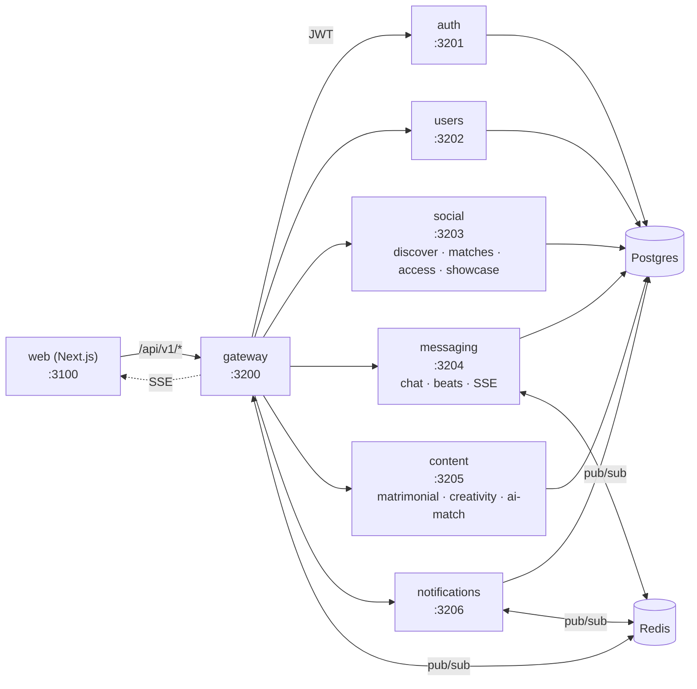

# Miamo — Services Map & Algorithm Index

One-page reference for **how the services connect, what each does, and where the algorithms live**. For deep schemas, payloads, and code walk-throughs see [`ARCHITECTURE.md`](ARCHITECTURE.md) and each `services/<name>/README.md`.

---

## 1. Topology



Every browser request is `web → gateway → service`. Direct service-to-service hops are blocked at the network policy; cross-service data sharing happens via the **shared Postgres** (single schema, namespaced models) and **Redis pub/sub** for fan-out.

---

## 2. Services at a glance

| Service | Port | Owns (Prisma models) | Talks to | README |
|---|---|---|---|---|
| `gateway` | 3200 | — | all services + Redis | [`services/gateway/README.md`](../services/gateway/README.md) |
| `auth` | 3201 | `User`, refresh tokens | Postgres | [`services/auth/README.md`](../services/auth/README.md) |
| `users` | 3202 | `Profile`, `Photo`, `Prompt`, `Interest`, completion | Postgres | [`services/users/README.md`](../services/users/README.md) |
| `social` | 3203 | `Like`, `MiamoMove`, `Match`, `AccessGrant`, `ShowcaseItem` | Postgres, content (peek), notifications (push) | [`services/social/README.md`](../services/social/README.md) |
| `messaging` | 3204 | `Conversation`, `Message`, `Beat`, presence | Postgres, Redis | [`services/messaging/README.md`](../services/messaging/README.md) |
| `content` | 3205 | `MatrimonialProfile`, `CreativityItem`, `AIScore` | Postgres | [`services/content/README.md`](../services/content/README.md) |
| `notifications` | 3206 | `Notification` | Postgres, Redis (push), gateway SSE | [`services/notifications/README.md`](../services/notifications/README.md) |
| `web` | 3100 | UI only | gateway | [`services/web/README.md`](../services/web/README.md) |
| `shared` | — | algorithms, schemas, completion, visibility | imported by all | — |

Shared infra: **Postgres** (`miamo-postgres`), **Redis 7** (cache + pub/sub).

---

## 3. Cross-service flows

### 3.1 Sign-up → Discover

```
register (auth) → setAuth → users.createProfile
  → web routes to /onboarding
  → user fills cards → users.PATCH /profiles/me + uploads
  → users./completion >= 60% (casual) or 75% (DTM)
  → gateway requireOnboarded passes → /discover or /serious-mode unlocked
```

### 3.2 Miamo Move → Match → Chat

```
discover card → web.api.sendMiamoMove
  → gateway → social POST /discover/move
  → social writes MiamoMove + checks mutual
    → on mutual: create Match + emit "match.created"
    → notifications subscribes → writes Notification + pushes via gateway SSE
  → web receives SSE → toast + Matches badge
  → user opens Match → messaging.createConversation → Chat
```

### 3.3 DTM access request

```
DTM browse card → web.api.requestAccess
  → social POST /matrimonial/access/request
  → AccessGrant(status=PENDING) + notification
  → target accepts → status=GRANTED → visibility.ts reveals phone/email
```

See [`ACCESS_CONTROL.md`](ACCESS_CONTROL.md) for the full state machine.

### 3.4 Onboarding gate (`requireOnboarded`)

```
any /api/v1/{discover,matches,ai-match,messages,beats,showcase,access}
  → gateway looks up users./profiles/me/completion (60s cache, fail-open)
  → score < threshold → 403 { code: 'ONBOARDING_INCOMPLETE', dtm, missing[] }
  → web.api 403 interceptor → window.location = '/onboarding'
```

Threshold = **60% for casual** (`Profile.seriousMode=false`), **75% for DTM**. Tunables: `services/shared/src/completion.ts`.

---

## 4. Algorithm index

All algorithms live in **`services/shared/`** and are imported by the service that needs them. They are pure (React-free, framework-free) so they are unit-tested in isolation.

| Concern | File | Function(s) | Used by |
|---|---|---|---|
| Profile completion score | `shared/src/completion.ts` | `computeCompletionScore`, `scoreCasual`, `scoreDtm` | users, gateway |
| Field visibility tiers | `shared/src/visibility.ts` | `getFieldVisibility`, `applyVisibility` | users, social, content |
| Field metadata + icon names | `shared/src/fieldMeta.ts` | `IconName` union, `FIELD_META` | web (FieldIcon) |
| Option icons (chips) | `shared/src/optionIcons.ts` | `iconForOption`, `GENDER_OPTIONS`, `INTEREST_ICONS` | web (IconChipMulti, IconOptionGrid) |
| Compatibility / scoring | `shared/algorithms.ts` | `scoreCompatibility`, `interestOverlap`, `numerology*` | social, content |
| AI match ranking | `shared/ml-engine.ts` | `rankCandidates`, `embed*` | content |
| Activity heuristics | `shared/activity-analyzer.ts` | `summarizeActivity` | content (AI suggestions) |
| Cache helpers | `shared/cache.ts` | TTL `Map`-based cache | gateway, users |
| Audit logging | `shared/src/audit.ts` | `logAudit` | all services |
| Structured logger | `shared/src/logger.ts` | `logger` (pino) | all services |

---

## 5. Database

Single Postgres database, one Prisma schema per service (each service runs its own migrations against the same DB, models namespaced by ownership). Canonical schema is `services/shared/prisma/schema.prisma`; per-service schemas mirror only the slice they touch.

- Migrations: `services/shared/prisma/migrations/` (run via `docker/migrate.Dockerfile`).
- Seed (demo users + DTM): `services/shared/prisma/seed.ts` and `services/content/prisma/seed-dtm.ts`.
- Local check: `scripts/db-check.sh`.

---

## 6. Real-time (SSE)

Gateway hosts `GET /api/v1/events/stream` (per-user channel). Backend services emit by POSTing to internal `/internal/push-event` on the gateway, which fans out to the connected client. Used for: notifications, message arrival, beat updates, match.created.

---

## 7. Where to look next

- **Bring up locally:** root [`README.md`](../README.md) → "Quick Start".
- **System internals (deep):** [`ARCHITECTURE.md`](ARCHITECTURE.md).
- **DTM access control state machine:** [`ACCESS_CONTROL.md`](ACCESS_CONTROL.md).
- **Showcase feature:** [`SHOWCASE.md`](SHOWCASE.md).
- **UI tokens / brand:** [`DESIGN_PROMPT.md`](DESIGN_PROMPT.md).
- **Per-service contracts:** the README inside each `services/<name>/`.
