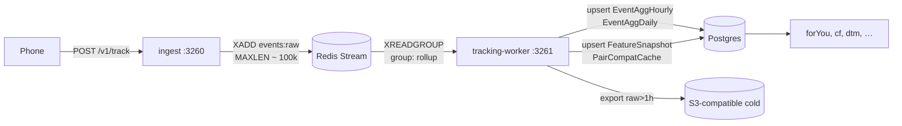

# Tracking — the complete catalogue

> The exhaustive reference for everything Miamo records about user behaviour.
> Every event name, every payload field, every Postgres table this pipeline
> writes, every helper that turns raw clicks into algorithm signals.

It's 9:02pm. Priya opens the app. Over the next 30 seconds her browser
will fire **47 tracking events** — session start, three page views, twelve
profile-card impressions, four dwell samples, two scroll-depth marks,
one swipe, one match, eleven cursor samples, one click on the chat
icon, one form focus, one form submit, one message send, one web-vitals
report, one heartbeat. Each one lands in a table the ranking algorithms
later read.

This document tells you what every one of those events is, what it
carries, and what it becomes.

---

## Table of contents

1. [The contract — envelope + event shape](#1-the-contract)
2. [The complete event catalogue (50 events in 10 families)](#2-the-complete-event-catalogue)
3. [Context every event carries](#3-context-every-event-carries)
4. [What the phone actually does (the SDK)](#4-what-the-phone-actually-does)
5. [The pipeline — ingest → Redis Stream → worker](#5-the-pipeline)
6. [The worker jobs (rollup, feature, compat, embed, daily, cold)](#6-the-worker-jobs)
7. [What lands in Postgres (every features table)](#7-what-lands-in-postgres)
8. [Derived signals — chronotype, attention profile, vibe](#8-derived-signals)
9. [Privacy, hashing, consent, right-to-be-forgotten](#9-privacy)
10. [Timing budget and lag SLOs](#10-timing-budget)
11. [Adding a new event (5-step recipe)](#11-adding-a-new-event)
12. [If something breaks](#12-if-something-breaks)
13. [What changed and why it's better](#13-what-changed-and-why-its-better)

---

## 1. The contract

Every payload from the browser is an **envelope** carrying up to 50
events. Both shapes are defined in
[services/shared/src/track/events.ts](services/shared/src/track/events.ts)
and validated by Zod in [services/ingest/src/validate.ts](services/ingest/src/validate.ts).

```ts
type TrackEnvelope = {
  ctx: ContextHeader;       // who/where/when, see §3
  evts: TrackEvent[];       // 1..50 events
};

type TrackEvent = {
  e:   string;              // event name from catalog, ≤48 chars
  t:   number;              // client timestamp (Date.now() at emit)
  n:   number;              // monotonic ordinal inside the session
  p?:  Record<string, any>; // optional payload, ≤ envelope budget
  tid?: string;             // optional target id (the thing acted on)
  tt?:  string;             // optional target type: 'user'|'card'|'message'|…
  d?:  number;              // optional duration in ms (≤24h)
};
```

Hard limits enforced by Zod:

| Limit                       | Value     |
|-----------------------------|-----------|
| `SCHEMA_VERSION`            | `1`       |
| `MAX_EVENTS_PER_BATCH`      | **50**    |
| `MAX_ENVELOPE_BYTES`        | **32 KB** |
| event-name length           | 1–48      |
| `n` (session ordinal)       | 0–1,000,000 |
| `d` (duration ms)           | 0–86,400,000 |

Mismatched schema versions are rejected — `ingest` returns `400` with
`schema version mismatch`.

---

## 2. The complete event catalogue

50 event names live in
[services/shared/src/track/events.ts](services/shared/src/track/events.ts)
under `TrackEventName`. Below is every one, grouped by family, with the
payload it carries and the algorithm signal it feeds.

### 2.1 Session, device, consent (4)

| Event                | Payload (`p`)                                  | Feeds                       |
|----------------------|------------------------------------------------|-----------------------------|
| `session.start`      | `{}`                                           | session counters, chronotype|
| `session.heartbeat`  | `{focus?: boolean}` every 25s                  | liveness, dwell             |
| `session.end`        | `{reason: 'pagehide'\|'visibility'}` + `d`     | session duration            |
| `consent.update`     | `{scopes: string[]}`                           | gates worker reads          |

### 2.2 Navigation (3)

| Event           | Payload                            | Feeds                          |
|-----------------|------------------------------------|--------------------------------|
| `page.view`     | `{path, ref?}`                     | screen funnel, attention profile|
| `page.leave`    | `{path}` + `d` (time on page)      | dwell, bounce, chronotype       |
| `route.change`  | `{from, to}`                       | navigation graph                |

### 2.3 Engagement primitives (9)

| Event              | Payload                                       | Feeds                                   |
|--------------------|-----------------------------------------------|-----------------------------------------|
| `impression`       | `{slot, position}` + `tid`                    | candidate exposure (impressionsLast48h) |
| `dwell`            | `{tid}` + `d`                                 | attention, fatigue penalty              |
| `scroll.depth`     | `{maxPct: 0..100}`                            | feedAugment, postImpressionRerank       |
| `scroll.idle`      | `{idleMs}`                                    | rage detection                          |
| `click`            | `{x, y, tag}` + `tid?`                        | searchAugment, feedAugment              |
| `click.rage`       | `{count, withinMs}` + `tid?`                  | UX-quality signal (rageClickRate)       |
| `click.dead`       | `{tag}` + `tid?`                              | UX-quality signal                       |
| `cursor.sample`    | `{x, y}` (5/s while moving)                   | attention profile                       |
| `visibility.change`| `{state: 'hidden'\|'visible'}`                | session.end fallback                    |

### 2.4 Forms (4)

| Event         | Payload                                  | Feeds                  |
|---------------|------------------------------------------|------------------------|
| `form.focus`  | `{name, field}`                          | onboarding funnel       |
| `form.change` | `{name, field, valid: boolean}`          | onboarding funnel       |
| `form.submit` | `{name, ok: boolean}`                    | onboarding completion   |
| `form.error`  | `{name, field, code}`                    | onboarding failure modes|

### 2.5 Performance and errors (3)

| Event             | Payload                                                            | Feeds            |
|-------------------|--------------------------------------------------------------------|------------------|
| `perf.web_vitals` | `{lcp?, fid?, cls?, fcp?, ttfb?, inp?}`                            | perf dashboards   |
| `error.js`        | `{msg, stack?, lineno?, colno?, src?}`                             | error tracking    |
| `error.network`   | `{url, status, durMs}`                                             | error tracking    |

### 2.6 Discover / swipe / match (4)

| Event                  | Payload                                            | Feeds                              |
|------------------------|----------------------------------------------------|------------------------------------|
| `discover.card_view`   | `{position, source: 'forYou'\|'cf'\|'new'\|…}` + `tid` | impressionsLast48h, exposure       |
| `discover.swipe`       | `{dir: 'right'\|'left'\|'super', position}` + `tid` | PairCompatCache prior, moves, cf   |
| `discover.match`       | `{from: 'mutual'\|'aiPicks'\|'dtm'}` + `tid`        | aiPicks, aiMatch                   |
| `discover.boost_view`  | `{boostType}` + `tid`                              | analytics                          |

### 2.7 Messaging (6)

| Event              | Payload                                  | Feeds                              |
|--------------------|------------------------------------------|------------------------------------|
| `msg.thread_open`  | `{chatId}` + `tid` (= peer userId)        | responseRate, replySpeed (active)  |
| `msg.compose_start`| `{chatId, suggested: boolean}` + `tid`    | messageSuggest acceptance          |
| `msg.send`         | `{chatId, len, hasMedia}` + `d` (typing)  | beats, replySpeed                  |
| `msg.read`         | `{chatId, count}`                         | responseRate                        |
| `msg.reaction`     | `{chatId, kind}`                          | engagement signal                   |
| `msg.voice_record` | `{chatId}` + `d` (record duration)        | engagement signal                   |

### 2.8 Profile and albums (5)

| Event                    | Payload                                  | Feeds                          |
|--------------------------|------------------------------------------|--------------------------------|
| `profile.view`           | `{from: 'discover'\|'chat'\|'search'}` + `tid` | exposure, searchAugment        |
| `profile.edit`           | `{fields: string[]}`                     | completeness                    |
| `album.upload`           | `{count}`                                | completeness                    |
| `album.view`             | `{position}` + `tid`                     | exposure                        |
| `album.unlock_request`   | `{tid}`                                  | trust / intent signal           |

### 2.9 DTM / vibe / persona (5)

| Event                  | Payload                                       | Feeds                              |
|------------------------|-----------------------------------------------|------------------------------------|
| `dtm.question_view`    | `{topic, qid}`                                | DtmVector                          |
| `dtm.answer`           | `{topic, qid, value, weight}`                 | DtmVector, serious (dtmDepth)      |
| `dtm.complete`         | `{topic, scoreVector: number[]}`              | DtmVector, serious                 |
| `vibe.check_start`     | `{}`                                          | vibe momentum                      |
| `vibe.check_complete`  | `{vector: number[]}`                          | aiPicks (vibeMomentum)             |

### 2.10 Beats / moves / date (5)

| Event              | Payload                                      | Feeds                          |
|--------------------|----------------------------------------------|--------------------------------|
| `beats.play`       | `{beatId, genres: string[]}` + `d`           | beats algo (genreFit, tempoFit)|
| `beats.skip`       | `{beatId, atMs}`                             | novelty signal                  |
| `moves.play`       | `{moveKind, pairId}`                         | moves (notRepeating)            |
| `date.plan_open`   | `{}`                                         | engagement                      |
| `date.plan_save`   | `{when, where, kind}`                        | engagement                      |

### 2.11 Custom (1)

| Event   | Payload                  | Feeds                              |
|---------|--------------------------|------------------------------------|
| `custom`| `{name: string, ...}`    | analytics catch-all (no algo use)  |

**Total: 50 named events** + `custom`. Adding a new one is a 5-step
recipe (§11).

---

## 3. Context every event carries

`ContextHeader` is attached **once per envelope** (so one transmission of
50 events sends context once). Defined in `events.ts` and validated by
`ContextSchema` in `validate.ts`.

| Field   | Type           | Meaning                                                 |
|---------|----------------|---------------------------------------------------------|
| `v`     | number = 1     | Schema version. Mismatch → 400.                          |
| `did`   | string 8–64    | Device id (persistent cookie, never reset).             |
| `sid`   | string 8–64    | Session id (regenerated per visit).                     |
| `uid`   | string ≤64?    | User id, only after login.                              |
| `path`  | string ≤512?   | Current URL path (query-string stripped of PII).         |
| `ref`   | string ≤256?   | Referrer hostname only (no path or query).               |
| `loc`   | string ≤16?    | ISO locale, e.g. `en-IN`.                                |
| `tzo`   | number?        | Timezone offset in minutes.                              |
| `vw`    | number?        | Viewport width in CSS pixels.                            |
| `vh`    | number?        | Viewport height in CSS pixels.                           |
| `dpr`   | number?        | Device pixel ratio (1, 1.5, 2, 3).                       |
| `ua`    | string ≤128?   | UA client hint — brand + major only, no full UA string.  |
| `cs`    | string[] ≤8?   | Consent scopes granted at emit time.                     |

**What we deliberately do not collect:** full User-Agent string, IP
address (stripped at the load balancer), email, name, location below
city. Path query strings are scrubbed of tokens.

---

## 4. What the phone actually does

The web SDK in `services/web/src/track/` does five things:

1. **Batches.** Up to 50 events or 32KB, flushed every 2.5s or on
   `visibilitychange`/`pagehide`.
2. **Throttles `cursor.sample`** to ≤5/s and only while moving.
3. **Coalesces `dwell`** — only emits after a card has been in the
   viewport ≥800ms.
4. **Detects rage clicks** locally — ≥3 clicks within 800ms on the
   same element fires one `click.rage`.
5. **Falls back to `sendBeacon`** on `pagehide` so the last batch
   survives a tab close.

A blocked or offline `ingest` does **not** stall the UI — the SDK keeps
the batch in `localStorage` and retries on next visit.

---

## 5. The pipeline



### 5.1 The bouncer (`ingest`)

`POST /v1/track`, in order:

1. Zod-validate envelope + every event (`EnvelopeSchema`).
2. Reject mismatched `SCHEMA_VERSION`.
3. Stamp `uidHash` if `uid` present:
   `uidHash = HMAC-SHA256(TRACKING_HASH_SECRET, uid) → base64url → first 22 chars`.
4. `XADD events:raw * payload <json> MAXLEN ~ 100000`.
5. Return `204` in `~3ms p50, <15ms p99`.

Source: [services/ingest/src/server.ts](services/ingest/src/server.ts).

Failure modes (configurable to fail-closed for prod; fail-open in dev):

- Redis down → `events_dropped_total++`, response still 204 (events lost).
- Schema mismatch → 400.
- Body too big → 413.
- Invalid HMAC envelope signature → 401 (when `INGEST_REQUIRE_SIG=1`).

### 5.2 The conveyor belt (`events:raw`)

A Redis Stream — append-only log with cooperative consumer groups.

- Stream key: `events:raw` (`TRACKING_STREAM_KEY`).
- Approximate max length: `~100_000` (oldest dropped when exceeded).
- Consumer group: `rollup` (`TRACKING_GROUP`).
- Consumer name: `<HOSTNAME>-<pid>` — each worker pod gets a unique
  consumer; XACKs prevent double-processing.
- Read batch: `XREADGROUP COUNT 500 BLOCK 2000ms`.

If all workers die, events queue until `MAXLEN` is hit. With 100k cap
and ~270k events/sec at peak, that's ~370ms of buffer — workers must
recover fast or events drop.

### 5.3 The worker (`tracking-worker`)

One process running multiple loops; each loop reads from
[services/tracking-worker/src/](services/tracking-worker/src/).

---

## 6. The worker jobs

| File                       | Job              | Cadence       | Configurable via                |
|----------------------------|------------------|---------------|---------------------------------|
| `rollup.ts`                | RollupConsumer   | continuous    | `TRACKING_READ_*`               |
| `feature.ts`               | FeatureAggregator| 5 min default | `FEATURE_INTERVAL_MS`           |
| `compat.ts`                | CompatWriter     | 15 min        | `COMPAT_INTERVAL_MS`            |
| `embeddings.ts`            | EmbeddingWorker  | 30 min        | `EMBED_INTERVAL_MS`             |
| `enrich.ts`                | EnrichmentWorker | 60 min (flag) | `ALGO_V4_WORKERS_ENABLED`       |
| `daily-match.ts`           | DailyMatchWorker | 24 h          | `DAILY_MATCH_INTERVAL_MS`       |
| `cold-store.ts`            | ColdStore        | 1 h           | `COLD_STORE_INTERVAL_MS`        |
| `forget.ts`                | RightToBeForgotten| on-request    | DELETE endpoint                |
| `buckets.ts`               | (helpers)        | —             | percentile + distinct counters  |

### 6.1 RollupConsumer (`rollup.ts`)

The hot path. Steps:

1. `XREADGROUP COUNT=500 BLOCK=2s` from `events:raw`.
2. For each event, derive `(uidHash, eventName, hourBucket, dayBucket)`.
3. Buffer counts and `durSum` in memory.
4. Every `ROLLUP_FLUSH_MS` (default 10s): bulk-upsert into
   `EventAggHourly` and `EventAggDaily`.
5. On success, `XACK group` the message ids.
6. On DB failure, **do not XACK** — message redelivers next read.

**Key insight:** raw events do **not** sit in Postgres long. We aggregate
in flight. Postgres only ever sees compact `(uid, evt, hour) → count`
rows.

### 6.2 FeatureAggregator (`feature.ts`)

Every 5 min reads the last 24h of `EventAggDaily` for users with
activity, derives lightweight features (§8), writes one
`FeatureSnapshot` row per user.

### 6.3 CompatWriter (`compat.ts`)

Every 15 min picks pairs that had recent interaction (swipe, view,
match) and writes `PairCompatCache` rows used as the `forYou`
cache-hit fast path (30-min freshness).

### 6.4 EmbeddingWorker (`embeddings.ts`)

Every 30 min refreshes per-user profile embeddings used by
`feedAugment` and `searchAugment`.

### 6.5 DailyMatchWorker (`daily-match.ts`)

Once per day (`03:00 UTC` by default) computes `aiMatch` top-1 per
user and writes the `DailyMatch` row.

### 6.6 ColdStore (`cold-store.ts`)

Once per hour: dumps `events:raw` entries older than 1h to S3-compatible
storage, then trims the stream.

### 6.7 Right-to-be-forgotten (`forget.ts`)

`DELETE /v1/users/:uidHash` (internal). Deletes that uidHash from
`EventAggHourly`, `EventAggDaily`, `FeatureSnapshot`, and erases
embeddings + DTM vectors.

---

## 7. What lands in Postgres

| Table                  | Owner            | Granularity                    | Used by                           |
|------------------------|------------------|--------------------------------|-----------------------------------|
| `EventAggHourly`       | tracking-worker  | (uidHash, evt, hour)            | feature aggregator                 |
| `EventAggDaily`        | tracking-worker  | (uidHash, evt, day)             | feature aggregator                 |
| `EventTargetAgg`       | tracking-worker  | (uidHash, targetHash, evt, day) | cf (collaborative filter)          |
| `FeatureSnapshot`      | tracking-worker  | (uidHash, snapshotAt)           | every ranking algo via SignalReader|
| `PairCompatCache`      | tracking-worker  | (viewerHash, candidateHash)     | forYou cache-hit                   |
| `DtmVector`            | content/tracking | per user, per topic              | dtm, serious                       |
| `DailyMatch`           | social           | (uid, day)                      | AI Picks screen                    |
| `ProfileEmbedding`     | tracking-worker  | (uid, modelVersion)              | feedAugment, searchAugment          |
| `ConsentScope`         | users            | (uid, scope, grantedAt)          | gates every read                   |

All schemas in [services/shared/prisma/schema.prisma](services/shared/prisma/schema.prisma).

---

## 8. Derived signals

`FeatureAggregator` produces these per-user fields from the aggregates.
They are the heart of how dumb events become smart rankings.

### 8.1 `chronotype` (string, nullable)

Looks at counts per hour-of-day across the last 24h.

```ts
const morning = hours 5..12    // post-coffee India
const day     = hours 12..18
const evening = hours 18..23
const night   = hours 23..5

if peak / total > 0.45  → use peak name
else                    → 'mixed'
```

If `total < 5` events → returns `null` (we don't have enough data yet).

Real example for Priya (last 24h):
```
morning=42, day=18, evening=160, night=4, total=224
peak=evening, 160/224 = 0.71 > 0.45 → chronotype='evening'
```

### 8.2 `attentionProfile` (string, nullable)

Reads `dwell` durations and `scroll.depth` patterns to classify
`'reader' | 'scanner' | 'browser' | 'mixed'`. `messageSuggest` uses
this to pick opener kinds.

### 8.3 `rageClickRate` (number, 0..1)

`click.rage` count / total click count over 7 days. UX-quality signal;
used in the operations dashboard, not in ranking.

### 8.4 `impressionsLast48h` (integer)

Number of `discover.card_view` events Priya generated viewing this
candidate in the last 48h. Used directly in `forYou`'s fatigue penalty.

### 8.5 `priorCount` (integer)

Count of (Priya, Arjun) interactions of any kind. Used as a smoothing
prior in `forYou`.

### 8.6 `pairCompat` (cached final score, 0..1)

`PairCompatCache.finalScore` — the cached `forYou` score for this
pair, 30-min fresh.

---

## 9. Privacy

### 9.1 Hashing

Every user-identifying value is hashed before leaving `ingest`:

```ts
uidHash = HMAC-SHA256(TRACKING_HASH_SECRET, userId).digest('base64url').slice(0, 22)
targetHash = HMAC-SHA256(TRACKING_HASH_SECRET, targetId).digest('base64url').slice(0, 22)
```

- **Deterministic** so we can still group "all of Priya's events".
- **One-way** so a DB dump leaks no identity.
- **Truncated to 22 chars (132 bits)** — collision-free at our scale.

**Never rotate `TRACKING_HASH_SECRET`** — it would orphan all
historical hashes from new ones.

### 9.2 Consent scopes

The `ConsentScope` table stores per-user grants:

| Scope             | What it unlocks                                        |
|-------------------|--------------------------------------------------------|
| `analytics`       | aggregate counters only                                 |
| `personalization` | use her events in her own ranking                       |
| `social_signals`  | use her events as a CF neighbour for other users        |
| `ml_enrichment`   | optional embedding / enrichment workers may read her    |

`SignalReader` checks scopes on every read. Missing scope → that input
defaults to its neutral value (`0.5` for cosine-style, `0` for counts).

### 9.3 Right-to-be-forgotten

`DELETE /v1/users/:uidHash` runs `forget.ts` which deletes from
`EventAggHourly`, `EventAggDaily`, `EventTargetAgg`, `FeatureSnapshot`,
`PairCompatCache` (both sides), `DtmVector`, `ProfileEmbedding`.

Completes in `<10s` for a user with 6 months of history.

### 9.4 What we deliberately don't track

- Full UA string (only brand+major hint).
- IP address (stripped at the LB before reaching `ingest`).
- URL query strings beyond known-safe keys.
- Anything from a user whose `analytics` scope is `false`.

---

## 10. Timing budget

| Step                                                    | Target  | Typical |
|---------------------------------------------------------|--------:|--------:|
| Phone batches, sendBeacon, → ingest                     | <50ms   | 20ms    |
| Ingest validate + XADD                                  | <15ms   | 3ms     |
| Stream → worker pickup                                  | <2s     | 200ms   |
| RollupConsumer flush to `EventAggHourly`                | 10s     | 10s     |
| FeatureAggregator computes new `FeatureSnapshot`        | 5min    | ~3min   |
| CompatWriter refreshes `PairCompatCache`                | 15min   | ~12min  |
| Visible to `forYou` next read                           | <16min  | <15min  |

Translation: an event Priya generates at 21:02 is influencing her
Discover ranking by **21:17 at the latest** (typically by 21:15).

---

## 11. Adding a new event

5 steps, no exceptions:

1. **Add the name** to `TrackEventName` in
   [services/shared/src/track/events.ts](services/shared/src/track/events.ts).
2. **Document the payload** in the `TrackEventPayloadMap` interface (or
   `{}` if payload-less).
3. **Wire the SDK** emission — usually a hook in
   `services/web/src/track/collectors/`.
4. **(If aggregable)** add a branch in `rollup.ts` mapping to a bucket
   and an `EventAggDaily` row.
5. **(If feeds an algo)** add to `registerAlgo({ usesEvents: [...] })`
   in the relevant `services/shared/src/algo/<algo>.ts`.

`ingest` is intentionally schema-loose — adding events doesn't require
redeploying it.

---

## 12. If something breaks

| Symptom                                           | First check                                                       | Likely cause                                   |
|---------------------------------------------------|-------------------------------------------------------------------|------------------------------------------------|
| Algorithms ignoring recent behaviour              | `redis-cli XINFO GROUPS events:raw` — is `lag` growing?           | tracking-worker dead or DB write failing       |
| `events:raw` length climbing past 100k             | `redis-cli XLEN events:raw`                                       | worker can't keep up — scale replicas          |
| `ingest` returns 400 schema mismatch               | check SDK version vs `SCHEMA_VERSION`                              | SDK shipped before worker upgrade               |
| Some users have no signals                        | check their `ConsentScope` rows                                    | scope `analytics` or `personalization` missing |
| `chronotype` returns `null` for active user        | check `EventAggDaily` count for that user (<5?)                    | seasonal lull or events being dropped          |
| Hashes don't join between hourly and snapshot      | `TRACKING_HASH_SECRET` rotated                                     | **Restore the old secret immediately.**        |
| Dropped events counter rising                     | `GET /metrics` on ingest — `events_dropped_total`                  | Redis OOM or unreachable                       |

---

## 13. What changed and why it's better

- **Before:** every "track this" call was a synchronous Postgres insert
  in the user's request path. Under load the inserts queued, the
  request timed out, and we lost events anyway.
- **After:** events go to a tiny `ingest` service that XADDs to a
  durable Redis Stream in `<15ms`. Postgres only sees aggregates,
  not raw events. A consumer group lets us run as many worker pods as
  we need without double-processing. Schema is versioned; SDK and
  worker can roll independently.
- **Why Priya feels it:** her swipes never hitch. Even during traffic
  spikes the UI stays responsive. And her Discover ranking learns from
  her recent behaviour in **under 15 minutes**, not "by tomorrow".

---

Read next:
- [docs/ALGORITHMS.md](docs/ALGORITHMS.md) — what the algorithms do with these features.
- [services/tracking-worker/README.md](services/tracking-worker/README.md) — the worker service in detail.
- [services/ingest/README.md](services/ingest/README.md) — the edge ingest service.
