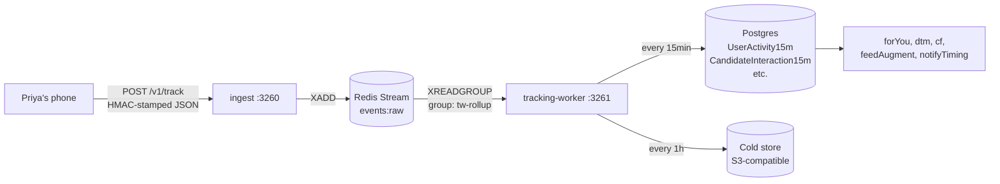

# Tracking — how we learn what Priya likes without watching her

It's 9:02pm. Priya opens Miamo. Over the next 30 seconds her phone
silently fires 8 small JSON messages to a service called `ingest`. By
9:17pm those messages have been folded into a single row that says
"Priya was actively swiping between 9:00 and 9:15pm". The next time
the `forYou` algorithm runs, it knows.

This document explains how that pipeline works — in plain English first,
with real numbers, then with code paths.

---

## 1. A real 30-second timeline

```
21:02:14  Priya opens Miamo                 → event "session_start"
21:02:15  Discover loads, she sees Arjun    → event "impression"   target=arjun
21:02:18  She taps Arjun's photo            → event "card_open"    target=arjun, dwellMs=3000
21:02:24  She swipes his 4 extra photos     → event "photo_view" × 4
21:02:31  She taps the heart                → event "like"         target=arjun
21:02:32  Match toast appears               → event "match_shown"
21:02:40  She opens the chat                → event "chat_open"    chatId=abc123
21:02:44  She starts typing                 → event "compose_start"
```

8 events in 30 seconds. Multiply by 1M concurrent users at peak and
you're at **~270k events per second**. The pipeline below makes that
not a problem.

---

## 2. The pipeline in one picture



Five parts, each does one job. Let's walk them.

---

## 3. The phone — what gets sent

Every event the phone fires has the same shape (validated by Zod in
[services/ingest/src/server.ts](services/ingest/src/server.ts)):

```json
{
  "event": "like",
  "target": "arjun-user-id",
  "context": { "screen": "discover", "position": 2 },
  "ts": 1748376151000,
  "sessionId": "s_4xz…",
  "hmac": "a8f1c2…"
}
```

The phone holds two secrets locally:
- a per-install **session token** (random UUID)
- the **HMAC signing key** (handed out at login)

It signs every event with HMAC-SHA256 so `ingest` can verify the event
came from a real session, not a script-kiddie hitting the URL.

---

## 4. `ingest` — the bouncer at the door

`ingest` is a deliberately tiny stateless service. Its only job is to
say *yes* or *no* in **under 15 milliseconds**, regardless of how busy
Postgres is.

What it does, in order, for every request:

1. **Validate shape** with Zod (rejects malformed JSON).
2. **Verify HMAC** against the session secret (rejects forgeries).
3. **Stamp user fingerprint:** `userHash = HMAC-SHA256(TRACKING_HASH_SECRET, userId)`.
4. **XADD** the event to Redis Stream `events:raw`.
5. **Return 204 No Content** — phone never waits for processing.

No database write. No HTTP call out. Just Redis. That's why it's fast.

---

## 5. The conveyor belt — Redis Streams

A **Redis Stream** is an append-only log inside Redis. Think of it as a
conveyor belt:

- **Producers** (one per `ingest` pod) drop events on one end with
  `XADD events:raw * event=like target=… ts=…`.
- **Consumers** (the `tracking-worker` pods) read from the other end as
  a **consumer group** (`group=tw-rollup`). Each event is delivered to
  exactly one worker.
- If a worker crashes mid-batch, the events it hadn't acknowledged stay
  on the belt and get re-delivered to another worker.
- If the *whole* worker fleet is down, events queue up on the belt.
  Default retention: 1M events or 24h, whichever first. (We've never
  hit the limit.)

This is why we can deploy or restart `tracking-worker` mid-day with
zero event loss.

---

## 6. The worker — what it actually does

`tracking-worker` (port 3261, exposes `/healthz` and `/v4/status`) runs
**one consumer + 7 background jobs**:

| Job                | Cadence    | What it does                                              |
|--------------------|-----------:|-----------------------------------------------------------|
| RollupConsumer     | continuous | Reads events:raw, buffers by 15-min bucket                 |
| FeatureAggregator  | 15 min     | Writes UserActivity15m, CandidateInteraction15m            |
| CompatWriter       | 15 min     | Recomputes compat scores for active pairs                  |
| EmbeddingWorker    | 30 min     | Refreshes profile embeddings for changed users             |
| EnrichmentWorker   | 60 min     | Optional ML enrichment (flag: `ALGO_V4_WORKERS_ENABLED`)   |
| DailyMatchWorker   | 24 h       | Computes the next-day `DailyMatch` for each user           |
| ColdStore          | 1 h        | Moves raw events older than 1h to S3-compatible cold store |

All cadences are configurable via env vars (see the service README).

---

## 7. The 15-minute rollup, with real numbers

Take Priya's 8 events from §1 plus 10 more (impressions, scrolls)
during the same 15-min window. That's **18 raw rows** for Priya alone.

After `FeatureAggregator` runs, those 18 rows become **1 row** in
`UserActivity15m`:

```json
{
  "userHash": "a8f1c2d4…",
  "bucket":   "2026-05-27T21:00:00Z",
  "sessions": 1,
  "impressions": 12,
  "card_opens": 4,
  "likes": 1,
  "chat_opens": 1,
  "compose_starts": 1,
  "messages_sent": 0,
  "engagementScore": 0.31
}
```

Multiply across 50,000 active users in that window:

```
raw rows         ≈ 3,140,000  (~63 events per active user per 15min)
rollup rows       =    50,000  (1 per user per bucket)
compression ratio  =     ~63×
```

Plus a similar rollup keyed on `(viewer, candidate)` for
`CandidateInteraction15m` — also ~50k rows per bucket. The algorithms
read from these aggregate tables, not from the raw stream. That's how
`forYou` can score 200 candidates in <40ms.

---

## 8. Privacy — why we don't store "Priya"

Every event stores `userHash`, never the raw user id, never email,
never name. The hash is:

```
userHash = HMAC-SHA256(TRACKING_HASH_SECRET, userId)
```

Two important properties:
1. **One-way.** Even with the events table dumped, an attacker cannot
   reverse `userHash` back to `userId` without `TRACKING_HASH_SECRET`.
2. **Deterministic.** Same userId always produces the same userHash,
   so we can still group "all of Priya's events" together for rollup.

**Never rotate `TRACKING_HASH_SECRET` once any events exist.** Rotating
it would make every old userHash unjoinable to the new ones — you'd
effectively wipe Priya's history.

---

## 9. Consent and right-to-be-forgotten

Priya can opt out of tracking in Settings. When she does:
- The phone stops calling `/v1/track` entirely (decided client-side).
- A server-side flag `users.User.trackingConsent = false` makes
  `tracking-worker` skip her hash when aggregating.
- A delete request (`DELETE /users/me/tracking-data`) issues
  `DELETE FROM UserActivity15m WHERE userHash = …` and similar across
  every features table.

See [services/shared/src/algo/consent.ts](services/shared/src/algo/consent.ts).

---

## 10. End-to-end timing budget

| Step                                | Target  | Typical |
|-------------------------------------|--------:|--------:|
| Phone → Ingest (network)            | <50ms   | 20ms    |
| Ingest processing (validate+XADD)   | <15ms   | 3ms     |
| Stream → Worker pickup              | <2s     | 200ms   |
| Worker buffer → 15-min flush        | (cadence)| 15min  |
| Visible to algorithm next read      | <16min  | ~15min  |

Translation: an event Priya generates at 9:02pm is influencing her
Discover ranking by **~9:17pm at the latest**.

---

## 11. Run it locally

```bash
docker compose up -d redis postgres ingest tracking-worker
# fire a test event
curl -X POST http://localhost:3260/v1/track \
  -H 'content-type: application/json' \
  -d '{"event":"impression","target":"arjun","ts":1748376151000,"sessionId":"s_x","hmac":"…"}'
# returns: 204
# inspect the stream
redis-cli XLEN events:raw
redis-cli XRANGE events:raw - + COUNT 5
```

---

## 12. What changed and why it's better

- **Before:** the phone called the same Postgres-backed service as
  everything else, and writes occasionally timed out under load —
  losing events.
- **After:** events go to a dedicated tiny `ingest` service that drops
  them on a durable Redis Stream in <15ms. Postgres is written to in
  batches by the worker, not by every phone tap. Zero event loss
  through restarts.
- **Why Priya feels it:** her Discover feed reflects what she actually
  does on the app, within ~15 minutes, even at peak traffic — and her
  taps never freeze the app waiting for tracking to ACK.

---

## 13. If something breaks

| Symptom                                       | First check                                                |
|-----------------------------------------------|------------------------------------------------------------|
| Algorithms ignoring recent behaviour          | `redis-cli XINFO GROUPS events:raw` — lag growing?         |
| `ingest` returning 401                        | HMAC mismatch — check `TRACKING_HASH_SECRET` is identical  |
| `events:raw` size exploding                   | worker dead — `kubectl logs -l app=tracking-worker --tail=50`|
