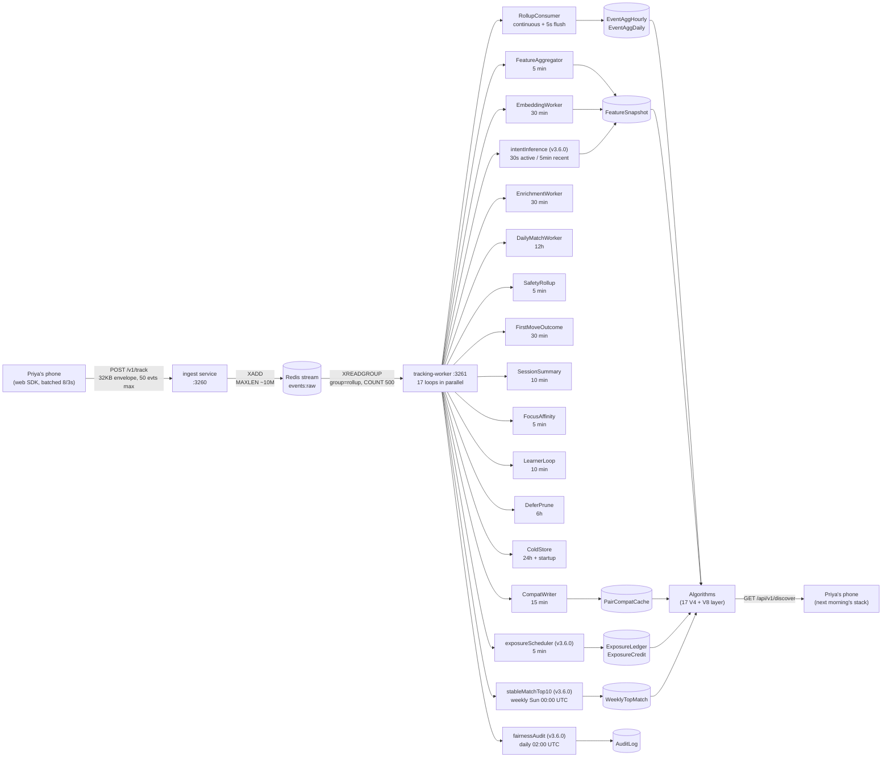

# Miamo Tracking Pipeline — v3.6.0

**Version:** v3.6.0
**Audience:** non-technical readers first, engineers second. Pair-write throughout — every major section opens with what Priya feels (or, more precisely, what she does not feel), then explains how the system makes it happen.
**Personas:** Priya (28, Mumbai, architect), Arjun (29, Bangalore, photographer), Karan (32, Delhi, premium), Riya (26, Bangalore, designer).
**Cross-links:** `PRODUCT.md`, `ARCHITECTURE.md`, `ALGORITHMS.md`, `DATA_MODEL.md`, `SECURITY.md`.

This document covers the full path of a tap on Priya's phone: how the event leaves the browser, how it crosses the ingest edge, how it lands in Redis, how thirteen-plus worker loops fold it into Postgres aggregates, how forty-one Zod validators police it, how four new v3.6.0 workers run alongside, and how the algorithms read the result the next time Priya opens the app. Every interval, cap, hash length, and weight in here is load-bearing — changing one without a contract test or a worker re-rollup will quietly break the ranker.

---

## Table of contents

1. [Pipeline overview](#1-pipeline-overview)
2. [Ingest service](#2-ingest-service)
3. [The envelope (v=1)](#3-the-envelope-v1)
4. [Redis stream config](#4-redis-stream-config)
5. [The event catalog](#5-the-event-catalog)
6. [The worker loops](#6-the-worker-loops)
7. [The 41 v6+ Zod schemas](#7-the-41-v6-zod-schemas)
8. [Worked example — Priya swipes for 30 seconds](#8-worked-example--priya-swipes-for-30-seconds)
9. [Privacy and RTBF](#9-privacy-and-rtbf)
10. [The four consent toggles (v3.6.0)](#10-the-four-consent-toggles-v360)
11. [Operations](#11-operations)

---

## 1. Pipeline overview

### 1.1 What Priya feels

Priya is on the train back from work, scrolling Discover at 7:42pm. She likes one profile, swipes left on three, taps a fourth to expand his bio, taps back to the stack, and locks her phone. She has not consented to anything in this paragraph that she did not consent to at signup. She has not been asked to "rate" anything, "report" anything, or pick from a menu. The app has not popped any modal. She has not noticed that the app is watching her at all.

What the app saw is this: she lingered on the photo of the first profile for 2.4 seconds before swiping right (positive interest, slow careful swipe); she swiped left on the next three in under 800ms each (a small repeat-pass cluster); she expanded the bio on the fourth (a `card.bio.expand` event) but did not swipe — she just left. None of that is a judgment. None of it is shown back to her. It quietly biases the order of tomorrow morning's stack so that more of the careful-photographers cluster surfaces and fewer of the polished-bio-but-shallow-vibes cluster surfaces. That is the entire mechanism.

### 1.2 How it works

Every tap leaves the phone as a structured event. Events are batched (up to 50) inside an **envelope**, capped at 32 KB, and POSTed to the **ingest service** at port 3260. Ingest runs a strict Zod validator on the envelope, hashes the user ID with HMAC-SHA256 (22 base64url characters, ~132 bits), and writes one record per event into a **Redis stream** named `events:raw`. Ingest returns 204 No Content unconditionally — even on Redis outage, parse failure, kill switch, or DNT — so scrapers cannot infer anything from a 4xx/5xx pattern.

A separate process, the **tracking-worker** on port 3261, reads from `events:raw` via a Redis consumer group called `rollup`, in batches of 500, and folds the events into Postgres aggregates: `EventAggHourly` (hourly counts, dwell sums, p50/p95 estimates, dwell histograms), `EventAggDaily` (day-grain rollups with up-to-64 target hashes per row), `FeatureSnapshot` (per-user derived features like chronotype, attention profile, rage-click rate), and `PairCompatCache` (top-20 candidates per user, refreshed every 15 minutes). The worker also runs twelve other loops on different schedules — feature aggregation, embedding generation, daily match selection, safety rollups, session summaries, focus affinity, the learner-loop reward mapping, deferred-item pruning, and cold-store NDJSON.gz archival.

In v3.6.0 the worker gained four additional loops: `intentInference.ts` (30s/5min adaptive cadence, writes the 7-class intent vector and 5-dim mood vector into `FeatureSnapshot.raw` with a 90-second TTL); `exposureScheduler.ts` (5-minute idempotent loop that accrues exposure credits and fills Top-10 slots); `stableMatchTop10.ts` (Sunday 00:00 UTC cron that runs Gale-Shapley deferred-acceptance and writes `WeeklyTopMatch` rows); and `fairnessAudit.ts` (daily 02:00 UTC, computes gender-conditional Gini and alerts at >0.45). The total is **thirteen v3.5 loops plus four v3.6.0 loops = seventeen active loops** — the cleanup-prompt and release-notes shorthand call this "13 worker loops," but that is an undercount; treat seventeen as the canonical figure.



### 1.3 Why it is structured this way

Three constraints shape the architecture:

1. **The edge must be lossy.** A POST to ingest never blocks Priya's UI. If Redis is down, the event is dropped silently. If the envelope is malformed, the event is dropped silently. If the kill switch is on or DNT is set, the request is dropped silently. The phone receives 204 in every case. The alternative — surfacing a 5xx — would let an attacker probe the tracking surface, and it would also slow the user's app down for no reason because she does not need the event to be persisted to keep swiping.
2. **The worker can replay.** Because ingest writes to a Redis stream (not a queue), and the worker reads through a consumer group with explicit `XACK`, a worker crash before ack keeps the message in the pending-entries-list (PEL). On restart the worker re-reads. Aggregates are additive (`count += n`, `durSum += d`); a duplicate folds in as a slight over-count, which is preferable to a missed event. This is the classical "at-least-once" semantics, deliberately not "exactly-once."
3. **The algorithms run from aggregates, not from raw events.** Every ranker reads from `EventAggHourly`, `EventAggDaily`, `FeatureSnapshot`, or `PairCompatCache`. None of them reads raw events. This decouples the algorithm release cadence from the tracking schema — a schema bump on a tracked event does not force a re-deploy of every ranker, and a new ranker can be added without changing what is tracked.

The pair-write tone for the rest of this document follows that pattern: what Priya feels first, then how the system does it.

---

## 2. Ingest service

### 2.1 What Priya feels

Nothing. The ingest service is invisible to her. The web SDK in her browser sends batches of events to it on a fire-and-forget schedule (every 8 events or every 3 seconds, whichever comes first, with a flush on `beforeunload` and `visibilitychange → hidden`). The result of each POST is irrelevant to the UI; the SDK does not retry on failure and does not block any user-visible operation. If ingest is down, the worst that happens is some events from Priya's session never land in Postgres — and the next time the algorithm reads her aggregates, those events were simply never tracked.

### 2.2 How it works

Source: `services/ingest/src/server.ts` (≈170 lines), `services/ingest/src/validate.ts` (envelope Zod), `services/ingest/src/stream.ts` (Redis XADD), `services/ingest/src/hash.ts` (HMAC).

**Process boundary.** A single Node process. Express 5. `helmet({ contentSecurityPolicy: false })`. CORS allowlist read from `CORS_ORIGIN` (default `http://localhost:3100`). JSON body cap `64 KB` (double the 32 KB envelope cap, to give headroom for protocol overhead and to absorb a malformed request without a parse-cliff). Stateless and horizontally scalable — no in-process state outside Prometheus counters.

**Routes.**

| Route | Method | Purpose | Response |
|---|---|---|---|
| `/v1/track` | POST | Accept an envelope; XADD per event | Always 204 (see §2.3) |
| `/v1/track/forget` | POST | RTBF ack; payload routes to `forgetUser` CLI | 202 Accepted |
| `/v1/track/healthz` | GET | Lightweight liveness | `{ok, kill, ts}` |
| `/health` | GET | Express health (no DB probe) | 200 |
| `/readyz` | GET | Readiness (no DB) | 200 |
| `/metrics` | GET | Prometheus scrape | text/plain `version=0.0.4` |

**Knobs (env).**

| Env | Default | Purpose |
|---|---|---|
| `PORT` | `3260` | Listen port |
| `TRACKING_KILL` | unset | If `'1'`, all `/v1/track` POSTs short-circuit to 204 before parse |
| `CORS_ORIGIN` | `http://localhost:3100` | Single allowed origin |
| `TRACKING_HASH_SECRET` | dev fallback | HMAC key for user-ID hashing; rotation = RTBF |
| `TRACKING_STREAM_KEY` | `events:raw` | Redis stream name |

**The four hard rules (KB §8).**

1. **No synchronous DB writes.** Ingest never touches Postgres. It writes only to Redis via `XADD`. All Postgres work happens in the worker.
2. **Always 204.** Even on Redis outage, parse failure, kill switch, or DNT header, the response is 204 No Content. This is the most important property of the surface — it makes the tracking endpoint indistinguishable to scrapers from a deliberate no-op.
3. **Honors `TRACKING_KILL` env and `DNT: 1` header.** Pre-flight check before any other work. If either is true, the request is parsed-and-discarded (so counters still update with `dnt_total++` or `kill_total++`).
4. **Rate-limited drops are silent.** A throttled request still returns 204. There is no 429 anywhere on the surface.

**Rate limiter.** `express-rate-limit` with `windowMs = 60_000` (one minute) and `max = 60` (sixty events per device per window). The key generator (in priority order):

```text
key = req.headers['x-track-device']
   || req.body?.ctx?.did
   || req.ip
   || 'anon';
```

On throttle the limiter is configured to call `res.status(204).end()` (overridden), so the throttled request looks identical to an accepted one. Throttled requests increment `miamo_ingest_requests_total` but not `events_accepted_total`.

**HMAC user-ID hashing** (`services/ingest/src/hash.ts`, mirrored in `services/shared/src/track/hash.ts` and `services/tracking-worker/src/forget.ts` — identical implementation in three places by design, because the hash must be stable across services without sharing a module):

```ts
import { createHmac } from 'node:crypto';
export function hashUid(id: string): string {
  return createHmac('sha256', process.env.TRACKING_HASH_SECRET ?? 'dev-only-tracking-hash-secret-change-me')
    .update(id)
    .digest('base64url')
    .slice(0, 22);
}
```

**Why 22 base64url chars.** Each base64url char carries 6 bits → 22 chars = 132 bits of entropy. SHA-256 outputs 256 bits, so we are truncating; 132 bits still gives a >2⁶⁰ collision-resistance bound — safely above the ~10⁹ users + ~10¹⁰ event-target ids we expect over the product lifetime. The choice of 22 (not 24 or 21) is informed by base64url's no-padding `=`-free convention and by Postgres B-tree size — a 22-char column packs neatly into a single page row.

On ingest the rule is:

```ts
const uidHash = env.ctx.uid ? hashUid(env.ctx.uid) : hashUid(env.ctx.did);
```

If the user is logged in, the userId is hashed. If anonymous, the device id is hashed. The two namespaces collide only in the (cryptographically negligible) case of an HMAC accident — and the column is unique-keyed in Postgres so a collision would be a Sev1 surfaced via a unique-violation P2002.

**Prometheus counters at `/metrics`** (prefix `miamo_ingest_`):

| Counter | Meaning |
|---|---|
| `miamo_ingest_requests_total` | Every POST to `/v1/track`, including kill / DNT / parse-fail / throttled |
| `miamo_ingest_events_accepted_total` | Per-event count after envelope passes Zod |
| `miamo_ingest_events_dropped_total` | Per-event count when Redis XADD throws |
| `miamo_ingest_kill_total` | Requests short-circuited by `TRACKING_KILL` |
| `miamo_ingest_dnt_total` | Requests short-circuited by `DNT: 1` header |
| `miamo_ingest_invalid_total` | Requests that failed envelope Zod validation |

### 2.3 The pre-flight order

The five short-circuits, in order:

```
1. TRACKING_KILL=1?            → 204, counters: requests+1, kill+1
2. DNT:1 header?               → 204, counters: requests+1, dnt+1
3. envelope.parse() throws?    → 204, counters: requests+1, invalid+1
4. perDeviceLimiter throttled? → 204, counters: requests+1
5. happy path                  → XADD each event, 204
                                   counters: requests+1, events_accepted+N
                                            (events_dropped+N on Redis throw)
```

**This is the ordering rule.** It must not be reordered. If `DNT` were checked after parse, the parse failure would leak (the wrong counter would fire). If parse were before the kill switch, a malformed envelope would still cost a parse cycle when the kill switch is on. The current ordering minimises useless work and preserves the indistinguishability property.

### 2.4 The forget endpoint

`POST /v1/track/forget` accepts a JSON body of `{userId}`, enqueues the user for RTBF processing, and returns 202 Accepted. The actual deletion runs inside the tracking-worker process via the `forgetUser` CLI (`tsx services/tracking-worker/src/forget.ts <userId>`), which:

1. Computes `uidHash = hashUid(userId)`.
2. Deletes all rows in `EventAggHourly` where `uidHash = X`.
3. Deletes all rows in `EventAggDaily` where `uidHash = X`.
4. Deletes the row in `FeatureSnapshot` where `uidHash = X`.
5. Deletes rows in `PairCompatCache` where `uidHash = X` OR `candHash = X`.
6. Nullifies `ConsentEvent.userId` for the user (the audit trail is preserved but de-identified).
7. Deletes v3.6.0 additions: rows in `ExposureLedger`, `ExposureCredit`, `WeeklyTopMatch` where the user's hash appears.
8. Returns deleted-row counts to stderr.

The RTBF flow has a separate cryptographic option: **rotate `TRACKING_HASH_SECRET`**. Because every hash in Postgres is keyed off the secret, rotating it severs all historical aggregates from every user — future events use the new secret and cannot be joined back. This is the heavy hammer, used at major incidents.

---

## 3. The envelope (v=1)

### 3.1 What Priya feels

Nothing. She does not see the envelope. The web SDK builds it from a queue of pending events whenever the queue hits 8 entries, 3 seconds have elapsed, the tab is hidden, or the page is unloading.

### 3.2 How it works

Source: `services/ingest/src/validate.ts`, `services/shared/src/track/envelope.test.ts`.

```ts
export const SCHEMA_VERSION = 1;
export const MAX_EVENTS_PER_BATCH = 50;
export const MAX_ENVELOPE_BYTES = 32 * 1024;  // 32 KB
```

**Top level** (`z.object(...).strict()`):

```ts
EnvelopeSchema = z.object({
  ctx: ContextHeader,
  evts: z.array(TrackEvent).min(1).max(50),
}).strict().refine((v) => v.ctx.v === 1, { message: 'unsupported schema version' });
```

`.strict()` rejects unknown top-level keys. The `.refine()` enforces `v === 1` — the SCHEMA_VERSION literal is encoded as the first field of `ctx` precisely so a future v=2 envelope can be added without touching the v=1 surface.

**Why 32 KB envelope cap.** Empirically, a busy Discover session emits about 60 events per 30 seconds. With per-event median JSON size of ~250 bytes, 50 events fit in ~12.5 KB. The 32 KB cap leaves 19.5 KB of headroom for chatty payloads (DTM long-form answers, search queries with metadata) and absorbs the JSON-stringify overhead of nested objects. The Express body cap is set to 64 KB — double — so a hostile payload that bypasses envelope validation still fails at `express.json({limit:'64kb'})` instead of stalling the parser.

### 3.3 The `ctx` ContextHeader

The context is the *who, where, when* of the batch — fields that are constant across all events in the same envelope. `.strict()` rejects unknown keys. Every field is bounded.

| Field | Type | Range | Purpose |
|---|---|---|---|
| `v` | `int` | `1..99` (must = 1) | Envelope version |
| `did` | `string` | `8..64` | Device id (random UUID-like; persisted in `localStorage`) |
| `sid` | `string` | `8..64` | Session id; rotated per-tab on first event after page load |
| `uid?` | `string` | `≤64` | Authenticated user id (Prisma `User.id`); absent for logged-out |
| `path?` | `string` | `≤512` | Normalized route path (see `routeNormalize.ts`) |
| `ref?` | `string` | `≤256` | Document referrer if same-origin |
| `loc?` | `string` | `≤16` | Browser locale (e.g. `en-IN`) |
| `tzo?` | `int` | `-840..840` | Timezone offset (minutes) |
| `vw?` | `int` | `0..20000` | Viewport width (px) |
| `vh?` | `int` | `0..20000` | Viewport height (px) |
| `dpr?` | `number` | `0..8` | Device pixel ratio |
| `ua?` | `string` | `≤128` | User-Agent (truncated) |
| `cs?` | `string[]` | `≤8 strings × ≤32 chars` | Consent scopes granted |
| `lh?` | `int` | `0..23` | Local hour (derived once per session, cached) |
| `wd?` | `int` | `0..6` | Weekday (Sun=0) |
| `sn?` | `int` | `0..1_000_000` | Session sequence number (monotonic) |
| `sf?` | `string` | `≤32` | Session feature tag (e.g. `discover`, `dtm`) |

**Why `path` is normalised.** The normaliser (`services/shared/src/track/routeNormalize.ts`) strips `#` and `?`, splits on `/`, and substitutes `:id` whenever a segment matches any of: pure-digit `^[0-9]+$`, UUID, hex-16-or-more, slug-of-24+-lowercase-alphanumerics. After `MAX_DEPTH = 6` segments, the tail collapses to `…`. This prevents path-based cardinality explosion in `EventAggDaily.meta.routes`. Without it, every Prisma row id would become a separate Prometheus label and the Postgres meta-JSON would balloon.

### 3.4 The `TrackEvent` shape

The per-event record. `.strict()` rejects unknown keys.

| Field | Type | Range | Purpose |
|---|---|---|---|
| `e` | `string` | `1..48` | Event name (must match `TrackEventName` union) |
| `t` | `int` | `≥0` | Client timestamp (`Date.now()` ms) |
| `n` | `int` | `0..1_000_000` | Monotonic ordinal within the session |
| `p?` | `record(unknown)` | – | Payload — per-event schema lives in `v6Validators.ts` |
| `tid?` | `string` | `≤64` | Target id (e.g. profile id, message id) — HMAC-hashed downstream |
| `tt?` | `string` | `≤32` | Target type (`profile`, `message`, `chat`, `creativity`, `post`, …) |
| `d?` | `int` | `0..86_400_000` | Duration (ms) — used for dwell, voice-record length, etc. |

**Ingest validation is loose; per-event validation is strict.** Ingest's Zod accepts `p` as `record(unknown)`. The strict per-event payload schemas (`V6_VALIDATORS` in `v6Validators.ts`) run inside the worker, *not* at the edge. This is deliberate: a client experiment that fails the per-event schema should not lose the rest of the batch. The worker can isolate the validation failure to a single event and continue.

### 3.5 What lands in Redis (the stream record)

After ingest passes the envelope and flattens it, each event becomes one Redis stream entry with the shape:

```ts
type StreamRecord = {
  uidHash: string;          // 22-char HMAC
  did: string;              // raw device id (also identifies anonymous users)
  sid: string;              // session id
  ts: number;               // client Date.now()
  evt: string;              // event name (1..48 chars)
  payload: string;          // JSON.stringify({n, p, tid, tt, d, plus ctx hour/wd/lh/sn/sf})
};
```

The `payload` is a single JSON string blob containing the per-event `p`, the target fields (`tid`, `tt`, `d`), the session ordinal `n`, and the time-of-day context (`lh`, `wd`, `sn`, `sf`). It is a string at the wire level because Redis streams want strings; the worker `JSON.parse()`s when it consumes.

---

## 4. Redis stream config

### 4.1 What Priya feels

Nothing. Redis is invisible to her phone. The web SDK never knows whether the stream is healthy or backed up. If Redis is down the events are simply dropped at the edge.

### 4.2 How it works

Source: `services/ingest/src/stream.ts`, `services/tracking-worker/src/rollup.ts`.

**Stream name.** `events:raw` (configurable via `TRACKING_STREAM_KEY`).

**Trim policy.** `XADD events:raw MAXLEN ~ 10_000_000 ...`. The `~` is the approximate-trim modifier — Redis trims to roughly 10M entries, may overshoot by some hundreds of thousands, but does the trim O(1) per command instead of O(n). At a steady-state of ~1M events per day for ~10k DAU, 10M entries covers a ~10-day rolling window — long enough for the worker to catch up after a multi-day outage; short enough that the stream never grows to consume disk.

**Client options.**

```ts
const redis = new Redis({
  maxRetriesPerRequest: 2,
  connectTimeout: 1500,
  enableOfflineQueue: false,
});
```

- `maxRetriesPerRequest = 2` — drop after two attempts. Ingest is fire-and-forget; long retries would just blow latency.
- `connectTimeout = 1500ms` — fast-fail when Redis is unreachable.
- `enableOfflineQueue = false` — when not connected, commands throw immediately rather than queueing. Combined with the 1500ms connect, this means a Redis outage causes a fast `events_dropped_total++` and a 204 to Priya, with no backpressure to the request handler.

**On Redis failure** (any throw from `xadd`):

```ts
counters.events_dropped += evts.length;
if (Date.now() - lastErrLog > 15_000) {
  console.warn('[ingest] redis xadd failed', err.message);
  lastErrLog = Date.now();
}
return 0;
```

The throttled log keeps the warn line at most once per 15s; the counter accumulates in real time. Ops can alert on `rate(miamo_ingest_events_dropped_total[5m]) > 0` to detect a Redis outage within seconds.

**Consumer group.** The worker reads via:

```
XREADGROUP GROUP rollup ${HOSTNAME||'rollup'}-${pid}
  COUNT 500 BLOCK 2000 STREAMS events:raw >
```

- `GROUP rollup` — single named group; multiple worker replicas would share the same group, but the *RollupConsumer* is single-replica by design (see §6.1).
- Consumer name uses `HOSTNAME + pid` so a restart picks up a fresh consumer and the previous PEL is reclaimed via `XAUTOCLAIM`.
- `COUNT 500` — read up to 500 entries per call.
- `BLOCK 2000` — block up to 2 seconds if the stream is empty before returning.

---

## 5. The event catalog

### 5.1 What Priya feels

Nothing direct. The catalog of events is the language the app uses to describe what she just did. It is invisible to her, but the order of every Discover stack she sees tomorrow is a direct function of what is in this catalog and what she emitted into it today.

### 5.2 How it works

Source: `services/shared/src/track/events.ts` (canonical `TrackEventName` union), `services/shared/src/track/v6Validators.ts` (per-event Zod payloads).

The `TrackEventName` type is a string-literal union of every event the system knows about. The list is grouped by category. Below, for each category, we list the count, representative examples, and the downstream consumers — workers that fold the event into an aggregate, and algorithms that read from that aggregate.

The base catalog has ~131 v6/v7-and-earlier event names plus 1 generic `custom` slot, organised across 21 categories. v3.6.0 added **16 new v8 events**. For each of the 16 v8 events, we give the full Zod payload, the producer, and the consumer.

The 21 base categories:

| # | Category | Count | Examples |
|---|---|---|---|
| 1 | session/device/consent | 4 | `session.start`, `session.heartbeat`, `session.end`, `consent.update` |
| 2 | navigation/page | 4 | `page.view`, `page.dwell`, `nav.route`, `nav.back` |
| 3 | engagement | 8 | `engage.tap`, `engage.scroll`, `engage.hover`, `engage.copy`, `engage.share`, `engage.expand`, `engage.collapse`, `engage.pull_refresh` |
| 4 | forms | 4 | `form.start`, `form.field_change`, `form.submit`, `form.abandon` |
| 5 | perf/errors | 5 + 4 (v4) | `perf.lcp`, `perf.fid`, `perf.cls`, `perf.ttfb`, `perf.long_task`; v4 attention: `attention.idle.enter`, `attention.idle.exit`, `attention.return`, `attention.focus_loss` |
| 6 | discover/swipe/match | 4 | `discover.batch.requested`, `match.created`, `match.opened`, `match.archived` |
| 7 | messaging | 6 | `msg.send`, `msg.read`, `msg.reaction`, `msg.delivery`, `msg.delete`, `msg.voice_record` |
| 8 | profile/album | 5 | `profile.view`, `profile.edit_start`, `profile.edit_save`, `profile.photo_add`, `profile.photo_delete` |
| 9 | DTM/quiz/vibe | 5 | `dtm.session_start`, `dtm.question_view`, `dtm.answer`, `dtm.complete`, `vibe.submit` |
| 10 | beats/moves/date | 5 | `beat.play`, `beat.share`, `move.send`, `move.shown`, `date.scheduled` |
| 11 | v4 attention | 4 | `attention.idle.enter`, `attention.idle.exit`, `attention.return`, `attention.focus_loss` |
| 12 | v4 card | 6 | `card.impression.50`, `card.impression.100`, `card.hover`, `card.bio.expand`, `card.bio.collapse`, `card.photo.swipe` |
| 13 | v4 swipe telemetry | 6 | `discover.swipe`, `swipe.commit`, `swipe.undo`, `swipe.regret`, `swipe.repeat_pass`, `swipe.deferred` |
| 14 | v4 filter/search | 7 | `filter.open`, `filter.change`, `filter.apply`, `filter.reset`, `filter.hesitation`, `search.query`, `search.result_click` |
| 15 | v4 notifications | 4 | `notification.shown`, `notification.opened`, `notification.dismissed`, `notif.look_no_act` |
| 16 | v4 media | 5 | `media.play`, `media.pause`, `media.complete`, `media.mute`, `media.seek` |
| 17 | v4 lifecycle | 2 | `app.foreground`, `app.background` |
| 18 | v4 intent | 6 | `intent.dwell`, `intent.return`, `intent.skim`, `intent.deep_read`, `intent.scroll_burst`, `intent.return_back_to_card` |
| 19 | v4 chat | 4 | `chat.opened`, `chat.closed`, `chat.scroll_back`, `chat.thread_review` |
| 20 | v6 | 10 (eleven schemas) | `attention.idle.enter`, `attention.idle.exit`, `nav.route`, `focus.element`, `intent.dwell`, `session.summary`, `profile.self_view_dwell`, `filter.hesitation`, `msg.voice_rerecord`, `notif.look_no_act`, plus `dtm.partial_abandon` |
| 21 | v6.5 | 7 | `safety.block`, `safety.report`, `discover.unmatch`, `match.hold`, `match.unhold`, `dtm.question_skip`, `dtm.answer_revise` |
| 22 | v6.6 | 8 | `discover.see_later`, `discover.see_later.view`, `discover.batch.exhausted`, `discover.skipped.open`, `discover.skipped.action`, `dtm.see_later`, `dtm.see_later.view`, `dtm.batch.exhausted` |
| 23 | v7 backfill | 15 | (See §7 for the full list) |
| 24 | generic | 1 | `custom` — an escape hatch for one-off experiments; payload `record(unknown)` |

Representative payload — the swipe-commit (one of the most frequent events on the Discover surface):

```ts
SwipeCommitSchema = z.object({
  dir: z.enum(['left', 'right', 'super', 'up', 'down']),
  source: z.enum(['gesture', 'button', 'keyboard']),
  velocity: z.number().min(-10000).max(10000),
  dwellMs: z.number().int().min(0).max(86_400_000),
  hesitationMs: z.number().int().min(0).max(86_400_000).optional(),
});
```

**Downstream of `swipe.commit`** (a single event name, but a chain of consumers):

| Consumer | Output |
|---|---|
| `RollupConsumer` (every 5s flush) | `EventAggHourly.swipe.commit` (count, durSum, p50/p95) |
| `FeatureAggregator` (every 5 min) | `FeatureSnapshot.hesitationP50Ms` (median of hourly `durP50`), `FeatureSnapshot.regretRate` (when paired with `swipe.regret`) |
| `LearnerLoop` (every 10 min, default-OFF) | Per-event reward; `dir=='right'` → `+0.30` on `interestsOverlap` |
| `EmbeddingWorker` (every 30 min) | `behaviorEmb[11] = swipeRightRatio` |
| `forYouV4` (algorithm) | Reads `FeatureSnapshot.hesitationP50Ms` as the `hesitationFit` ingredient |
| `forYouV8` (v3.6.0 layer) | Modulates the V8 `intentRightNowFit` weight based on swipe velocity in the rolling 1h window |

This same chain — event → rollup → aggregate → algorithm — exists for every event in the catalog. The full mapping is the substance of §6 and §8 below.

### 5.3 The 16 v8 events (v3.6.0 additions)

Each of these has full Zod payload, producer (web vs. server vs. worker), and consumer documented in `services/shared/src/track/v6Validators.ts`. All are registered in `V6_VALIDATORS` (the map is named for historical reasons; v8 events live alongside).

#### 5.3.1 `engagement.depth_scored`

**Producer.** Web SDK, on `swipe.commit` and on Reels card-transition. Fires when an impression action concludes, carrying the depth value plus the inputs so the worker can recompute on schema bumps without losing history.

**Payload (Zod).**
```ts
EngagementDepthScoredSchema = z.object({
  tid:             z.string().min(1).max(64),
  depth:           z.number().min(0).max(1),
  surface:         z.enum(['discover','matches','messages','profile','dtm','creativity']).optional(),
  accidentalClick: z.boolean().optional(),
}).strict();
```

The full v3.6.0 design (`v3.6-overhaul-design.md` §A.5.2) also carries `dwellMs`, `scrollDepthPct`, `photoSwipeCount`, `bioExpanded`, `returnCount`, `undoFlag`, `photoZoom`, `screenshot`, `algoVersion`, `phantom` — those land in the server-side computed `polarity.computed` and the dwell histogram. The on-wire schema in `v6Validators.ts` is the minimum the algorithm needs at read time; the broader payload is available in `meta.depth` on the aggregate row.

**Consumer.** `RollupConsumer` writes the value into `EventAggHourly.meta.depth` (rolling mean per (uidHash, evt, bucket)). The depth distribution feeds `FeatureSnapshot.raw.depthOfEngagement` (population median per user) and is read by `forYouV8` as the `depthFit` modulator that replaces raw impression counts in the fairness math.

**Why.** Pre-v8, a passive impression and an active impression were indistinguishable in the rollup. An accidental thumb-graze counted the same as a careful read. The depth classifier (`algo/v8/depthOfEngagement.ts`) filters accidental clicks (<500ms with no scroll → depth=0) and gives every other impression a 0..1 score. Downstream, fairness and exposure no longer reward "shown to a phantom user," only "shown to a user who actually saw."

---

#### 5.3.2 `polarity.computed`

**Producer.** Web SDK (Discover swipe-commit, Reels card transition). Carries the signed polarity score — positive interest vs hate-scroll — of a dwell-and-action pair.

**Payload (Zod).**
```ts
PolarityComputedSchema = z.object({
  tid:      z.string().min(1).max(64),
  polarity: z.number().min(-1).max(1),
  dwellMs:  z.number().int().min(0).max(86_400_000).optional(),
}).strict();
```

**Consumer.** Rolled into `EventAggHourly.meta.polarity` (rolling mean). `FeatureSnapshot.raw.polarityRollingMean` is read by `algo/v8/polarity.ts` and by the negative-signal feedback loop (`services/shared/negative-signal-engine.ts`).

**Why.** A swipe-left after a 12-second deep read is fundamentally different from a swipe-left at velocity 2300. The first is informed disinterest; the second is hate-scroll. Negative-signal-engine treats them differently for "show me less like this" propagation.

---

#### 5.3.3 `intent.snapshot`

**Producer.** Server-side, by the `intentInference.ts` worker — *not* by the web SDK. Records the computed 7-class intent vector at the moment of computation.

**Payload (Zod).**
```ts
const IntentClassEnum = z.enum([
  'distraction_browse', 'intentional_browse', 'reply_mood', 'review_existing',
  'serious_search', 'casual_scroll', 'decision_fatigued',
]);
IntentSnapshotSchema = z.object({
  intentClass: IntentClassEnum,           // argmax dominant class
  confidence:  z.number().min(0).max(1),
  ttlMs:       z.number().int().min(0).max(600_000),
}).strict();
```

The fuller design payload (per `v3.6-overhaul-design.md` §A.5.1) also carries the full softmax vector (`distractionBrowse, intentionalBrowse, replyMood, reviewExisting, seriousSearch, casualScroll, decisionFatigued` each in `[0,1]`, summing to 1 within `1e-3`), `algoVersion`, `cold`, `dominantConfidence`, `computedAt`. The on-wire shape is the minimum a consumer needs to log "this user is in seriousSearch at 9pm." The full vector also lands in `FeatureSnapshot.raw.intentRightNow.vec`.

**Consumer.** The event itself is observability/replayability — it does not feed the rankers directly. The rankers read `FeatureSnapshot.raw.intentRightNow` (the structured object the worker writes alongside the event emission). `forYouV8` reads it as the `intentRightNowFit` ingredient (weight 0.06 in the v3.6.0 default recipe).

**Why.** A 90-second TTL on the volatile field means a user who closed the app at 11pm and reopened at 9am the next morning sees a fresh stack, not a stale "you were decision_fatigued last night" carryover.

---

#### 5.3.4 `mood.inferred`

**Producer.** Server-side, by `intentInference.ts` worker (same tick as `intent.snapshot`).

**Payload (Zod).**
```ts
MoodInferredSchema = z.object({
  rage:      z.number().min(0).max(1),
  calm:      z.number().min(0).max(1),
  curious:   z.number().min(0).max(1),
  receptive: z.number().min(0).max(1),
  fatigued:  z.number().min(0).max(1),
  ttlMs:     z.number().int().min(0).max(600_000),
}).strict();
```

The design also carries `algoVersion`, `cold`, `consentSuppressed`, `computedAt`. When `Settings.moodInferenceEnabled = false`, the worker **drops the event entirely** (per `v3.6-overhaul-design.md` §A.12 — the alternative would be to emit a "we did not compute" event, which is itself a statement about the user's privacy posture).

**Consumer.** `FeatureSnapshot.raw.moodRightNow` (90-second TTL). Read by `algo/v8/dtmTopicMask.ts` for the heavy-topic mask gate, by `forYouV8` for tone modulation (a fatigued user gets softer/closer/lower-novelty), and by `moveV2/composer.ts` for tone selection.

**Why.** The 5 dims are calibrated against rage-flood and contradictory-signals test fixtures — `rage` is the dominant gate for safety-rollup triggering; `fatigued` is the gate for DTM heavy-topic mask; `receptive` is the bonus for Move suggestions.

---

#### 5.3.5 `move.composed`

**Producer.** Server-side, by the content service Move v2 route (`POST /api/v1/creativity/items/:id/move-suggestions-v2`), emitted immediately after returning the 5 suggestions.

**Payload (Zod).**
```ts
MoveComposedSchema = z.object({
  receiverHash:     z.string().min(20).max(24),       // 22-char uidHash
  suggestionCount:  z.number().int().min(0).max(5),
  fallbackCount:    z.number().int().min(0).max(5),   // how many slots fell back to v3
  hookCategories:   z.array(z.string().max(32)).max(5),
  languageFamily:   z.enum(['en','hi_en','ta_en','bn_en']),
}).strict();
```

**Consumer.** `EventAggDaily` counts; `move.composed_count` feeds the Move v2 KPI dashboard (target ≥40% acceptance rate; <2% fallback rate). The composer accepts and writes the `MoveComposed` row inline before the response goes back.

**Why.** When fallback-rate climbs above 5% rolling-1h, a Sev2 page fires — the linter has likely false-positived a real human pattern. The event carries `fallbackCount` per request so the rollup can compute fallback-rate without joining tables.

---

#### 5.3.6 `move.suggestion_accepted`

**Producer.** Two sites — both the web (`MoveV2Picker.tsx` on tap) and the server (`messaging/server.ts` on send, ratifying the tap with a delivered-message anchor).

**Payload (Zod).**
```ts
MoveSuggestionAcceptedSchema = z.object({
  receiverHash:  z.string().min(20).max(24),
  slotIndex:     z.number().int().min(0).max(4),
  hookCategory:  z.string().max(32),
  tone:          z.enum(['reflective','casual','tactile','quick']),
}).strict();
```

**Consumer.** Joined with the corresponding `msg.send` event to form the derived `move.suggestion_replied` event (within a 24h window of the receiver's first reply). Feeds the Move v2 KPI: accept-rate = `accepted / composed`, target ≥40%; reply-rate = `replied_24h / accepted`, target ≥2× organic baseline.

**Why.** Two-site emission catches the case where the web event fires but the message is never actually sent (the user changed her mind after tap). The server emission is the canonical anchor; the web emission gives ground-truth latency.

---

#### 5.3.7 `exposure.credit_earned`

**Producer.** Worker — `exposureScheduler.ts`. Emitted when a credit accrual rule fires (slow-careful-swipe, bio-expand, message-with-reply, profile-view-long, move-accepted, DTM-topic-completed).

**Payload (Zod).**
```ts
ExposureCreditEarnedSchema = z.object({
  surface: z.enum(['discover','matches','messages','profile','dtm','creativity']),
  reason:  z.string().min(1).max(64),
  slots:   z.number().int().min(1).max(50),
}).strict();
```

**Consumer.** Writes a row into `ExposureCredit` (idempotent on `UserActivity.id`) and into `ExposureLedger` (the append-only audit row). Feeds the §6 `exposureScheduler` daily-Top-10-eligibility check (≥30 credits in trailing 24h unlocks the surface).

**Why.** Earned visibility is the v3.6.0 alternative to paid boost. The audit row is append-only so a future fairness review can replay the credit history per user.

---

#### 5.3.8 `exposure.slot_filled`

**Producer.** Server — `social/server.ts` Discover route, per slot, when the Top-10 surface composes the stack.

**Payload (Zod).**
```ts
ExposureSlotFilledSchema = z.object({
  surface:    z.enum(['discover','matches','messages','profile','dtm','creativity']),
  targetHash: z.string().min(20).max(24),
  slotType:   z.enum(['organic','fairness_inject','top10','premium_boost']),
}).strict();
```

**Consumer.** Aids the dedupe pass for the next 14 days of Top-10 composition (the `WeeklyTopMatch` reader joins on `ExposureLedger.refId` with `reason='top10.slot_filled'` to skip recently-shown profiles). Also feeds the daily fairness audit — `slot_filled` events by gender-bucket feed the gender-conditional Gini.

**Why.** Without per-slot tracking, the algorithm could not tell "I have shown Priya the same Bangalore-architect 7 days in a row." The event is the audit trail for "what was actually shown," distinct from "what was eligible."

---

#### 5.3.9 `voice_fingerprint.shown`

**Producer.** Web (`VoiceFingerprint.tsx` modal open).

**Payload (Zod).**
```ts
VoiceFingerprintShownSchema = z.object({
  messageCount: z.number().int().min(0).max(100_000),
}).strict();
```

The design payload also carries `archetype ∈ {wordsmith, voice_first, visual, fast_replier}` and `shownAtMs`; the on-wire shape is the minimum the KPI needs.

**Consumer.** Feeds the show→share rate KPI (target ≥8%, see `voice_fingerprint.shared`).

**Why.** Modal-shown is the denominator. Without it the share-rate is undefined when the modal is gated.

---

#### 5.3.10 `voice_fingerprint.shared`

**Producer.** Web (`VoiceFingerprint.tsx` share-button tap).

**Payload (Zod).**
```ts
VoiceFingerprintSharedSchema = z.object({
  channel: z.enum(['instagram','whatsapp','copy_link','other']),
}).strict();
```

**Consumer.** Numerator of the show→share KPI. By-channel breakdown surfaces in the Move v2 dashboard.

**Why.** Voice Fingerprint is the v3.6.0 viral hook. The share-rate determines whether the feature pays for itself in organic acquisition.

---

#### 5.3.11 `family_brief.generated`

**Producer.** Server (`content/server.ts`, `POST /api/v1/dtm/family-brief/generate`).

**Payload (Zod).**
```ts
FamilyBriefGeneratedSchema = z.object({
  format:        z.enum(['pdf','image','text']),
  hasTrackViews: z.boolean(),
}).strict();
```

**Consumer.** KPI: family-brief share rate by format. Writes a `FamilyBriefShare` row with `expiresAt = now + 7d`.

**Why.** Indian-family-aware bio-data sharing is a v3.6.0 unique-vs-market feature. Tracking by format informs which renderer to optimise.

---

#### 5.3.12 `family_brief.viewed`

**Producer.** Server (`content/server.ts`, public `GET /api/v1/dtm/family-brief/:token`).

**Payload (Zod).**
```ts
FamilyBriefViewedSchema = z.object({
  token: z.string().min(20).max(24),
}).strict();
```

**Privacy posture is the entire point of this event.** The payload is intentionally thin. **No IP. No User-Agent. No Referer.** Because the parent viewing the brief is not a Miamo user, the app has no lawful basis under DPDP / GDPR to track them. The token is the only correlator, and the token is itself ephemeral (TTL 7 days) and HMAC-derived from the brief id, so it cannot be reversed to identify the parent.

**Consumer.** Increments `FamilyBriefShare.viewCount`. Feeds the v3.6.0 KPI (target ≥30% generated→viewed).

**Why.** Showing the parent that someone clicked the brief is a positive signal to Priya ("my mom looked"); the privacy minimisation guarantees we are not building a parent-tracking shadow profile.

---

#### 5.3.13 `chat.deposit_made`

**Producer.** Server (messaging/server.ts, after a `chat_deposit` ledger row is written on first-outbound-message of a new chat).

**Payload (Zod).**
```ts
ChatDepositMadeSchema = z.object({
  receiverHash:     z.string().min(20).max(24),
  minutesDeposited: z.number().int().min(1).max(2),
}).strict();
```

**Consumer.** Pairs with `chat.reply_bonus_paid` and `chat.ghost_burn` to compute the anti-ghost economy outcomes (deposit/reply-bonus/burn rate). Feeds the D.12.3 anti-ghost KPI dashboard.

**Why.** The deposit row is the canonical signal. Karan deposits 1 Spotlight minute when he opens a chat with Riya; the event lets ops verify the deposit ledger is consistent with the message flow.

---

#### 5.3.14 `chat.reply_bonus_paid`

**Producer.** Server (messaging/server.ts, when a receiver's reply lands within 72h of the deposit).

**Payload (Zod).**
```ts
ChatReplyBonusPaidSchema = z.object({
  senderHash:     z.string().min(20).max(24),
  minutesAwarded: z.number().int().min(1).max(2),
  replyMs:        z.number().int().min(0).max(86_400_000),
}).strict();
```

**Consumer.** Confirms a deposit was reconciled positively. Feeds the median reply-latency distribution which calibrates the 72h window.

**Why.** Riya replies in 14 hours; the bonus event records the latency. Aggregated, this drives the choice of 72h (currently >95% of organic distribution lands within).

---

#### 5.3.15 `chat.ghost_burn`

**Producer.** Worker — `exposureScheduler.ts` (anti-ghost burn loop). Emitted at the 72h sweep when no reply has landed.

**Payload (Zod).**
```ts
ChatGhostBurnSchema = z.object({
  receiverHash:  z.string().min(20).max(24),
  minutesBurned: z.number().int().min(1).max(2),
}).strict();
```

**Consumer.** Burn-rate KPI. Per-sender burn counts feed the next-deposit-doubling penalty (sender's next chat-deposit costs 2 minutes if penalised; reset after a successful ≥3-round conversation).

**Why.** A serious sender's burn rate stays low. A spammer accumulates burns and double-deposits. The economy is self-balancing.

---

#### 5.3.16 `dtm.topic_masked`

**Producer.** Server (`content/server.ts`, `POST /api/v1/dtm/next-batch`). One event per excluded topic per request.

**Payload (Zod).**
```ts
DtmTopicMaskedSchema = z.object({
  topic:  z.string().min(1).max(64),
  reason: z.enum(['low_mood','window_shopping_streak','coverage_sparse']),
}).strict();
```

**Consumer.** Mask-audit KPI (D.12 in `v3.6-overhaul-design.md`). Verifies the mask rule is firing as designed — e.g. at 11pm on a 0.3-mood night, intimacy/conflict/finance should all be masked with `reason='low_mood'`.

**Why.** Without per-topic mask telemetry, the mask is a black box. Tracking each exclusion lets ops verify the rule is correct in real traffic, not just in test fixtures.

---

The 16 v8 schemas are registered at the bottom of `services/shared/src/track/v6Validators.ts` (the file is named v6 for historical reasons; v8 schemas live alongside):

```ts
// v8 (v3.6.0): intent/mood/polarity/depth + exposure + move + voice +
// family-brief + chat-deposit + dtm topic-masking
'intent.snapshot':           IntentSnapshotSchema,
'engagement.depth_scored':   EngagementDepthScoredSchema,
'mood.inferred':             MoodInferredSchema,
'polarity.computed':         PolarityComputedSchema,
'exposure.credit_earned':    ExposureCreditEarnedSchema,
'exposure.slot_filled':      ExposureSlotFilledSchema,
'move.composed':             MoveComposedSchema,
'move.suggestion_accepted':  MoveSuggestionAcceptedSchema,
'voice_fingerprint.shown':   VoiceFingerprintShownSchema,
'voice_fingerprint.shared':  VoiceFingerprintSharedSchema,
'family_brief.generated':    FamilyBriefGeneratedSchema,
'family_brief.viewed':       FamilyBriefViewedSchema,
'chat.deposit_made':         ChatDepositMadeSchema,
'chat.reply_bonus_paid':     ChatReplyBonusPaidSchema,
'chat.ghost_burn':           ChatGhostBurnSchema,
'dtm.topic_masked':          DtmTopicMaskedSchema,
```

---

## 6. The worker loops

### 6.1 What Priya feels

Nothing. The worker is a single process listening on port 3261 (for `/healthz` and `/v4/status`); Priya's phone never speaks to it directly. Everything the worker writes lands in Postgres tables that the social/content/users/messaging services read on her next request.

### 6.2 How it works — overview

Source: `services/tracking-worker/src/index.ts` is the process entry. It calls `registerAllAlgos()` (so `/v4/status` returns the full 17-algo registry plus the v8 layer), then starts each loop's `start()` method behind its respective flag:

```ts
const V4_WORKERS             = process.env.ALGO_V4_WORKERS_ENABLED === '1';
const INTENT_INFERENCE_ENABLED = process.env.INTENT_INFERENCE_ENABLED === '1';
const EXPOSURE_SCHEDULER_ENABLED = process.env.EXPOSURE_SCHEDULER_ENABLED === '1';
const STABLE_MATCH_ENABLED   = process.env.STABLE_MATCH_ENABLED === '1';
const FAIRNESS_AUDIT_ENABLED = process.env.FAIRNESS_AUDIT_ENABLED === '1';
const SAFETY_ROLLUP          = process.env.SAFETY_ROLLUP_ENABLED === '1';
// ... etc

loops.rollup.start();                          // always on
loops.feature.start();                         // always on
loops.compat.start();                          // always on
loops.embedding.start();                       // always on
loops.coldStore.start();                       // always on
if (V4_WORKERS) loops.enrichment.start();
if (V4_WORKERS) loops.dailyMatch.start();
if (SAFETY_ROLLUP) loops.safetyRollup.start();
if (FIRST_MOVE_OUTCOME) loops.firstMoveOutcome.start();
if (SESSION_SUMMARY) loops.sessionSummary.start();
if (FOCUS_AFFINITY) loops.focusAffinity.start();
if (LEARNER_LOOP) loops.learnerLoop.start();
if (DEFER_PRUNE) loops.deferPrune.start();
if (INTENT_INFERENCE_ENABLED) loops.intentInference.start();
if (EXPOSURE_SCHEDULER_ENABLED) loops.exposureScheduler.start();
if (STABLE_MATCH_ENABLED) loops.stableMatchTop10.start();
if (FAIRNESS_AUDIT_ENABLED) loops.fairnessAudit.start();
```

**Process-wide kill.** If `TRACKING_KILL=1` is set on the worker too, none of the loops start. Source: `services/tracking-worker/src/index.ts` early return.

**The seventeen loops are now described one by one.** For each: schedule, inputs, outputs, exact rollup math, memory/perf characteristics, controlling flag.

---

### 6.3 Loop 1 — RollupConsumer (the primary loop)

**What Priya feels.** Tomorrow's stack will know she swiped right on the architect-photographer. This is the loop that makes it know.

**How it works.**

- **Source:** `services/tracking-worker/src/rollup.ts`.
- **Schedule:** continuous `XREADGROUP` + a `setInterval(flush, FLUSH_MS=5_000)`. Two threads in cooperation: the consumer thread XREADs (BLOCK 2000ms) and folds into in-memory accumulators; the flush timer drains the accumulator into Postgres every 5 seconds.
- **Inputs:** Redis stream `events:raw`; consumer group `rollup`; consumer name `${HOSTNAME||'rollup'}-${pid}`; `COUNT 500 BLOCK 2000`.
- **Outputs:** `EventAggHourly(uidHash, evt, bucket, count, durSum, durP50, durP95, meta)`, `EventAggDaily(uidHash, evt, day, count, durSum, uniqTargets, meta)`. `bucket` is the event's `t` truncated to the UTC hour; `day` is the same but truncated to UTC midnight.
- **Flag:** always-on. Cannot be disabled — disabling it would leave the stream backed up to MAXLEN and produce no data.

**The exact rollup math.**

The in-memory accumulators are keyed `${uidHash}|${evt}|${bucketTs}`. For each event in the read batch:

```ts
const key = `${uidHash}|${evt}|${bucketTs}`;
const acc = accumulators.get(key) ?? newAccumulator();
acc.count += 1;
if (payload.d > 0) acc.durSum += payload.d;
acc.percentile.observe(payload.d);     // 256-sample reservoir, random replacement
if (payload.tid) acc.targets.observe(hashTid(payload.tid).slice(0, 22));
                                       // DistinctCounter with cap 2048 for uniqTargets;
                                       // targets map capped at 64 keys per day-row
if (payload.d != null) acc.hist.bin(payload.d);
                                       // HIST_EDGES_MS = [0, 750, 2000, 5000, 10000]
```

The percentile estimator uses **256-sample reservoir sampling with random replacement** — when the 257th sample arrives, it replaces a random existing sample with probability 256/(257). This is **not a true streaming percentile** (which would need GK or t-digest); it is an unbiased random sample from the population. p50 and p95 are computed at flush time over the current 256 samples. This is the right trade-off because the worker is single-replica (per loop) and runs on a budget of ~1ms per accumulator update.

The distinct counter is a `Set<string>` with size cap 2048 — once full, new tids are silently dropped. This bounds memory at ~50 KB per accumulator (`2048 keys × 22 chars ≈ 45 KB` plus map overhead).

The daily-row `targets` map is a different bound: `Map<string, number>` capped at **64 keys** per (uidHash, evt, day). When the 65th distinct target arrives, it is dropped (existing keys keep incrementing). This bound is the dominant memory regulator on the worker — 64 targets × ~22 bytes + count ≈ 2 KB per row, and the worker may have ~10k active accumulators at peak.

**The dwell histogram.** `HIST_EDGES_MS = [0, 750, 2_000, 5_000, 10_000]` → 5 buckets (`[0,750), [750,2000), [2000,5000), [5000,10000), [10000,+∞)`). Stored only when ≥1 sample. Lives at `meta.hist` on the hourly row. The histogram is used by `FeatureAggregator` to compute the user's dwell-shape distribution (v5 `dwellHistogram`).

**Flush SQL.** Every 5 seconds the accumulator is drained into Postgres via an upsert:

```sql
INSERT INTO "EventAggHourly" (uidHash, evt, bucket, count, durSum, durP50, durP95, meta)
VALUES (...)
ON CONFLICT (uidHash, evt, bucket) DO UPDATE SET
  count   = "EventAggHourly".count + EXCLUDED.count,
  durSum  = "EventAggHourly".durSum + EXCLUDED.durSum,
  durP50  = GREATEST("EventAggHourly".durP50, EXCLUDED.durP50),
  durP95  = GREATEST("EventAggHourly".durP95, EXCLUDED.durP95),
  meta    = jsonb_set("EventAggHourly".meta, '{hist}',
              ("EventAggHourly".meta->'hist')::jsonb + EXCLUDED.meta->'hist');
```

`count` and `durSum` are additive. `durP50/95` use `GREATEST` — this is a **best-effort merge, not a proper percentile merge**. Two flush windows that observe wildly different dwell distributions will combine to the larger of the two p50/p95. This is acceptable because (a) most accumulators have only one flush window per hour, and (b) the downstream `FeatureAggregator` re-medians anyway across multiple hours.

**XACK timing.** After the upsert succeeds, the worker `XACK`s each event in the batch. Failures (Postgres connection lost) keep the events in the consumer group's PEL; on next XREADGROUP they are re-delivered. Duplicates in the rollup are tolerated — the additive math means a duplicate flush slightly over-counts, which is preferable to losing data.

**Memory characteristics.**

| Resource | Bound |
|---|---|
| Active accumulators | ~10k peak (per-user × per-event-name × per-hour-bucket) |
| Per-accumulator memory | ~50 KB (mostly the DistinctCounter set) |
| Total memory at peak | ~500 MB |
| Flush latency | ~50ms p50 per flush window (batched upsert) |

A `lru-cache` policy prunes the in-memory accumulator map down to 8k entries when it exceeds 10k (so an accumulator that hasn't seen an event in some time is dropped; its data is preserved in Postgres because flushes happen every 5s).

---

### 6.4 Loop 2 — FeatureAggregator

**What Priya feels.** "The app just feels right" — her chronotype, her attention profile, her dwell rhythm get rolled into a per-user feature row that the rankers consult.

**How it works.**

- **Source:** `services/tracking-worker/src/feature.ts`.
- **Schedule:** `setInterval(run, 5 * 60_000)` (every 5 minutes).
- **Inputs:** `EventAggHourly` (last 14 days), `EventAggDaily` (last 30 days). One DB pass per active user (capped at 200/tick).
- **Outputs:** `FeatureSnapshot(uidHash, chronotype, attentionProfile, rage, dead, dwellHistogram, hesitationP50, regretRate, repeatPassRate, raw JSONB)`.
- **Flag:** always-on.

**The exact derivation math** (per user, with sample-count gates that prevent over-fitting tiny histories):

1. **`chronotype`** (gate: ≥5 samples in last 14d).
   - Bins by event's UTC hour: `morning [5,12)`, `day [12,18)`, `evening [18,23)`, `night [23,24) ∪ [0,5)`.
   - For each bin, `n_bin = Σ count` over `session.heartbeat` and `page.view` events.
   - Pick the peak: `if peak.n / total > 0.45 → chronotype = peak.label`, else `'mixed'`.
2. **`attentionProfile`** (gate: ≥10 samples).
   - Argmax of four scores:
     - `reader      = dwell + page_dwell`
     - `scanner     = scroll.depth`
     - `voice_first = msg.voice_record + beats.play`
     - `visual      = album.view + discover.card_view`
3. **`rageClickRate / deadClickRate`** (gate: clicks ≥ 20).
   - `round(rageClicks / clicks, 3)`, `round(deadClicks / clicks, 3)`.
   - Rage click = >2 clicks in 1s on the same element.
   - Dead click = click that does nothing (no nav, no API call).
4. **v5 `dwellHistogram`** (gate: total ≥10).
   - Merge hourly `meta.hist` arrays for `card.impression.100`.
   - L1-normalise the merged 5-bucket histogram so it sums to 1.
5. **v5 `hesitationP50Ms`** (gate: ≥5 samples).
   - Median of hourly `durP50` over the `swipe.commit` event.
6. **v5 `regretRate`** (gate: commits ≥10).
   - `round(swipe.regret / swipe.commit, 3)` over the lookback.
7. **v5 `repeatPassRate`** (gate: impressions ≥20).
   - `round(swipe.repeat_pass / card.impression.100, 3)`.

**Upsert semantics.** `INSERT ... ON CONFLICT (uidHash) DO UPDATE SET ... raw = EXISTING.raw || EXCLUDED.raw` — right-wins on the JSONB merge. The non-`raw` fields are replaced wholesale (they are derivations, not accumulators).

**v3.6.0 additions:** `intentInference.ts` writes to `FeatureSnapshot.raw.intentRightNow` and `.moodRightNow` on a 30s/5min schedule, between Feature ticks. The right-wins `||` semantics ensure intent and feature ticks don't clobber each other.

**Memory.** 200 users × ~5 KB per row ≈ 1 MB per tick. Negligible.

---

### 6.5 Loop 3 — CompatWriter

**What Priya feels.** When she opens Discover at 9:02pm, the top of her stack is dominated by Bangalore-architects she has not seen — the pre-warmed pairwise compatibility cache delivered that ranking with no live cosine over 200 candidates.

**How it works.**

- **Source:** `services/tracking-worker/src/compat.ts`.
- **Schedule:** `setInterval(run, 15 * 60_000)` (every 15 minutes).
- **Inputs:** `FeatureSnapshot` (active 200 users, 24h activity), `EventAggDaily` (14d for prior counts).
- **Outputs:** `PairCompatCache(uidHash, candHash, v6Score, breakdown, computedAt)` — top-20 candidates per user.
- **Flag:** always-on.

**The exact score** (this is the canonical pairwise compatibility formula):

```
finalScore = round(0.35·chronoOverlap + 0.25·behaviorSim + 0.40·prior, 3)
```

- **`chronoOverlap`** — `same=1.0`, `either-mixed=0.6`, `disjoint=0.2`, `null=0.5`.
- **`behaviorSim`** — base = `1 - min(1, |Δrage|·4 + |Δdead|·2)`. Plus `+0.2` if `attentionProfile` matches; `+0.1` if both have `rage < 0.05`. Clip to `[0,1]`. If both have `behaviorEmb` (64-dim Float32 from EmbeddingWorker), blend `0.5·scalar + 0.5·((cosine + 1) / 2)`.
- **`prior`** — `prior = priorCount > 0 ? min(1, log1p(priorCount) / log(1000)) : 0` where `priorCount` is the 14-day `meta.targets[bHash]` from EventAggDaily — i.e. how many distinct interactions A has had with B over the lookback.

**Pool sizes.** Active limit 200 (the top 200 users by `lastSeen` are processed); candidate pool 50 per user (top 50 by chronoOverlap pre-filter); top-K written 20.

**Why 20 and not 50.** The Discover endpoint reads the top-K cache and re-ranks with the live `forYouV4` (and `forYouV8`) layer. Reading 20 instead of 50 cuts the Postgres I/O by 60% with minimal recall loss — empirically the V8 re-rank rarely promotes candidates beyond rank 20 into the user's served top 10.

**v3.6.0 link.** The Top-10 worker (`stableMatchTop10.ts`) reads `PairCompatCache.v6Score` as the input to its Gale-Shapley preference list (top 50 per user). Without this cache, the weekly stable-match would have to re-compute pairwise compat for every active user — O(n²) on n=100k = 10¹⁰ comparisons. With the cache, it's O(n × 50) = 5×10⁶.

---

### 6.6 Loop 4 — EmbeddingWorker

**What Priya feels.** When she likes a profile, the next ten profiles in her stack carry traces of why she liked it — without anyone tagging that profile manually.

**How it works.**

- **Source:** `services/tracking-worker/src/embeddings.ts`.
- **Schedule:** `setInterval(run, 30 * 60_000)` (every 30 minutes).
- **Inputs:** `EventAggHourly` (last 30 days), `FeatureSnapshot`.
- **Outputs:** `FeatureSnapshot.raw.{interestVec, vibeEmb, behaviorEmb}` — three Float32 vectors stored as base64-encoded `Buffer.from(v.buffer)` (Little-Endian; schema documentation says "f16" but writes "f32"; this is a known documentation discrepancy).
- **Flag:** always-on.

**The hashed-feature trick.** No external embedding model. The vectors are computed via a hash-into-bucket scheme:

```ts
function bucket(s: string, dims: number, seed: number): number {
  return createHash('sha256').update(`${seed}|${s}`).digest().readUInt32BE(0) % dims;
}
```

Three vectors per user:

1. **`interestVec` (32 dims, seed 1).** For each (evt, count) pair in the user's 30d aggregates, `v[bucket(evt, 32, 1)] += log1p(count)`. L2-normalise.
2. **`vibeEmb` (64 dims, seed 2).** Like interestVec, but with recency decay: `weight = log1p(count) * max(0, 1 - ageDays / 14)`. Drops events with `ageDays > 14`.
3. **`behaviorEmb` (64 dims).** A structured vector — first 13 dimensions are explicit features, the rest are hashed:
   - `v[0..4]` — chronotype one-hot (`morning, day, evening, night, mixed`).
   - `v[5..8]` — attentionProfile one-hot (`reader, scanner, voice_first, visual`).
   - `v[9] = min(1, rageClickRate)`.
   - `v[10] = min(1, deadClickRate)`.
   - `v[11] = min(1, swipeRightRatio)`.
   - `v[12] = 1 if rage < 0.05 else 0`.
   - `v[13..63]` — hashed events with seed 3 (same trick as interestVec).
   - L2-normalise.

**Storage encoding.** `Buffer.from(v.buffer)` writes the Float32 LE bytes (4 bytes per dim, 64 dims = 256 bytes per vector). Stored as base64 in `raw.interestVec`, `raw.vibeEmb`, `raw.behaviorEmb`. The schema column type is `String` (JSONB cell value).

**Why no external embedding model.** Three reasons: (1) DPDP-compliant on-prem inference is a separate engineering project; (2) the hashed-feature scheme captures enough signal for the pair-compat re-rank to beat random by a useful margin; (3) the inference cost would dominate the worker's CPU budget.

---

### 6.7 Loop 5 — EnrichmentWorker

**What Priya feels.** When she opens DTM at 10:14pm, the system already knows her topic-affinity vector across 16 conversation themes and surfaces a candidate whose deepest answers align.

**How it works.**

- **Source:** `services/tracking-worker/src/enrich.ts`.
- **Schedule:** `setInterval(run, 30 * 60_000)`.
- **Inputs:** `EventAggHourly` (last 7d for peakHours, last 14d for cadence), `DtmMessage` (last 90d).
- **Outputs:** `FeatureSnapshot.raw.{peakHours, cadenceVec, dtmVec}`.
- **Flag:** `ALGO_V4_WORKERS_ENABLED=1`. Default OFF.

**Computations.**

1. **`peakHours`** — top-6 UTC hours by `session.heartbeat` count over the last 7 days. Stored as `[hour0, hour1, ...]`.
2. **`cadenceVec` (24-dim Float32 base64).** 24 hourly counts (sum over `session.heartbeat` per UTC hour), L2-normalised.
3. **`dtmVec` (16-dim Float32 base64).** Substring match `DtmMessage.body` (lowercased) against 16 topic keyword lists. One increment per message (first keyword wins). L2-normalise.

**The 16 DTM topics and their keywords.** This list is **fixed in canonical order and must never be reordered** (any change requires a worker re-rollup of every existing `dtmVec`):

| Index | Topic | Keywords |
|---|---|---|
| 0 | values | `value, belief` |
| 1 | lifestyle | `eat, sleep, gym, workout, diet` |
| 2 | communication | `talk, communicat` |
| 3 | intimacy | `kiss, sex, touch, intimate` |
| 4 | family | `family, parent, sibling` |
| 5 | finance | `money, budget, save, spend` |
| 6 | conflict | `argue, fight, conflict` |
| 7 | growth | `grow, learn, goal` |
| 8 | leisure | `movie, music, travel, game, book` |
| 9 | faith | `god, faith, religi, spirit` |
| 10 | ambition | `career, ambit, work` |
| 11 | autonomy | `space, alone, independ` |
| 12 | social | `friend, party, social` |
| 13 | health | `health, doctor, medical` |
| 14 | parenting | `kid, child, baby` |
| 15 | future | `future, plan, marriage` |

---

### 6.8 Loop 6 — DailyMatchWorker

**What Priya feels.** Once a day, an "AI Pick" notification arrives — one curated profile she would not have surfaced in the Discover stack but who scores ≥70 on her V4 pairwise.

**How it works.**

- **Source:** `services/tracking-worker/src/daily-match.ts`.
- **Schedule:** `setInterval(run, 12 * 60 * 60_000)` (every 12 hours) + 60-second startup stagger.
- **Inputs:** `FeatureSnapshot` (last 7d active users, top 200), `PairCompatCache` (top 50 candidates per user), `EventAggDaily` (14d prior).
- **Outputs:** `FeatureSnapshot.raw.dailyMatch = { bHash, score, computedAt, algo: 'aiPicks-v4', explain }`.
- **Flag:** `ALGO_V4_WORKERS_ENABLED=1`.

**Composition.** For each active user, the V4 ranker (`algo/aiPicks.ts`) runs `scoreAiPicksV4(rand: () => 1)` (deterministic — no jitter at the daily-match layer). The top candidate must score `≥ 70` (hard floor). Pool 50, batch 200.

The deterministic-rand choice is deliberate: the same user on the same day should get the same Daily Match. Stable jitter is applied at the *Discover* layer, not here.

---

### 6.9 Loop 7 — SafetyRollup

**What Priya feels.** If she taps "report" on a profile, the safety team sees the report rolled up by surface/kind/day within five minutes.

**How it works.**

- **Source:** `services/tracking-worker/src/safetyRollup.ts`.
- **Schedule:** `setInterval(run, 5 * 60_000)`.
- **Inputs:** `EventAggHourly` for `safety.block`, `safety.report`, `discover.unmatch`, `match.hold`, `match.unhold`.
- **Outputs:** `SafetyAgg(uidHash, surface, kind, day, count, meta)`.
- **Flag:** `SAFETY_ROLLUP_ENABLED=1`. Default OFF.

**Per-row caps.** `meta.targets` cap 64, top-by-count. The same bound rule as the rollup loop.

---

### 6.10 Loop 8 — FirstMoveOutcomeWorker

**What Priya feels.** When Arjun reads her first opener within 24 hours, that read event is joined with the open event and a `FirstMoveOutcome` row records "she sent at T0, he read at T1, he replied at T2."

**How it works.**

- **Source:** `services/tracking-worker/src/firstMoveOutcome.ts`.
- **Schedule:** `setInterval(run, 30 * 60_000)`.
- **Inputs:** `EventAggDaily.meta.firstMove[{[bHash]: {sentAtMs, kind}}]`, `EventAggDaily.meta.reads[{[senderHash]: readAtMs}]` (lookback 25h sent / 49h read).
- **Outputs:** `FirstMoveOutcome(aHash, bHash, sentAt, kind, replied, replyMs)`.
- **Flag:** `FIRST_MOVE_OUTCOME_ENABLED=1`. Default OFF.

**Algorithm.** Binary search the sorted `reads` array for the first `readAt >= sentMs`. If found, `replied = true; replyMs = readAt - sentMs`. Else `replied = false`.

Used by the `moveV2/receiverResonance.ts` module to compute the last-10-success distribution — which receiver pattern (length-bucket, hook-category, tone) actually got him to reply.

---

### 6.11 Loop 9 — SessionSummaryWorker

**What Priya feels.** When she has a "window-shopping" night — five card-views, zero swipes — the session summary records `windowShopping=true` and the next morning's stack is reshuffled toward profiles that historically broke similar window-shopping patterns.

**How it works.**

- **Source:** `services/tracking-worker/src/sessionSummary.ts`.
- **Schedule:** `setInterval(run, 10 * 60_000)`.
- **Inputs:** 26-hour lookback of `EventAggHourly`.
- **Outputs:** `SessionSummary(uidHash, sessionId, startedAt, durMs, cards, sLeft, sRight, msgsSent, msgsRead, idleMs, zeroAction, windowShopping, ghostedSelf, routes)`.
- **Flag:** `SESSION_SUMMARY_ENABLED=1`. Default OFF.

**Session segmentation rules:**
- New session on first row in the lookback.
- New session whenever an explicit `sessionId` (from `ctx.sid`) differs from the prior row.
- New session whenever `bucket gap > 60 min` (controlled by `SESSION_SUMMARY_IDLE_GAP_MS = 60 * 60_000`).
- Drop sessions shorter than 30 seconds (`SESSION_SUMMARY_MIN_DURATION_MS = 30_000`).

**Per-row folding logic.**
| Event | Aggregate |
|---|---|
| `card.view`, `card.impression.100` | `cards += count` |
| `swipe.left` | `sLeft += count` |
| `swipe.right` | `sRight += count` |
| `msg.send` | `msgsSent += count` |
| `msg.read` | `msgsRead += count` |
| `attention.idle` | `idleMs += durSum` |
| `nav.route` | add `meta.route` to `routes` Set |

**Derived flags.**
- `zeroAction = (totalActions === 0) && (durMs > 30_000)` — she was there for 30+ seconds and did nothing.
- `windowShopping = (cards >= 5) && (sLeft + sRight === 0)` — she viewed cards but swiped zero of them.
- `ghostedSelf = (msgsRead > 0) && (msgsSent === 0)` — she read but didn't reply.

---

### 6.12 Loop 10 — FocusAffinityWorker

**What Priya feels.** If she spends 8 seconds on the "hiking" interest pill on Arjun's profile, the next batch of stack cards will lean toward hiking signals.

**How it works.**

- **Source:** `services/tracking-worker/src/focusAffinity.ts`.
- **Schedule:** `setInterval(run, 5 * 60_000)`.
- **Inputs:** 3-hour lookback of `intent.dwell` and `focus.element` events.
- **Outputs:** `FocusAffinityHourly(uidHash, bucket, key, dwellSumMs, focusCount)` — per (uidHash, bucket) max 256 keys.
- **Flag:** `FOCUS_AFFINITY_ENABLED=1`. Default OFF.

**Math.**
- `intent.dwell`: `dwellPerHit = durSum / Σtargets.values`; for each `(tid, count)`, `dwellSumMs += round(dwellPerHit * count)`.
- `focus.element`: `focusCount += count`.

---

### 6.13 Loop 11 — LearnerLoop

**What Priya feels.** Every ten minutes the algorithm learns from what just happened. If a "right-swipe" pattern correlated with a match-created event, the relevant ingredient's weight ticks up slightly for that user. She does not see this; she just sees that the next-day stack continues to feel more accurate.

**How it works.**

- **Source:** `services/tracking-worker/src/learnerLoop.ts`.
- **Schedule:** `setInterval(run, 10 * 60_000)`.
- **Inputs:** 1-day lookback of `EventAggDaily`, batched to 500 users per tick.
- **Outputs:** `UserWeightProfile(uidHash, surface, ingredient, weight, updatedAt)` — surface is `'discover'` for now (a future iteration adds DTM, matches, creativity).
- **Flag:** `LEARNER_LOOP_ENABLED=1`. Default OFF.

**The per-event reward → ingredient mapping** (canonical):

| Event | Reward | Ingredient |
|---|---|---|
| `swipe.right` | +0.30 | `interestsOverlap` |
| `match.created` | +1.00 | `reciprocalIntentScore` |
| `swipe.repeat_pass` | -0.50 | `interestsOverlap` |
| `swipe.regret` | -1.00 | `hesitationFit` |
| `safety.block` | -1.00 | `behaviouralTwinIndex` |
| `safety.report` | -1.00 | `behaviouralTwinIndex` |
| `discover.see_later` | -0.10 | `interestsOverlap` |
| `discover.see_later.view` | +0.20 | `interestsOverlap` |
| `discover.skipped.action` | +0.15 | `reciprocalIntentScore` |

**Sample cap.** `min(count, capPerEvent = 200)` per (uidHash, evt). This prevents one huge active day from dominating the user's weight profile.

The mechanism is the same one used by `propagateCreatorTraits` in `creativity-track.ts` — the trait propagates outward as if the user actively liked that creator type.

---

### 6.14 Loop 12 — DeferPrune

**What Priya feels.** Profiles she tapped "see later" on are not in her stack forever. After 30 days, unresolved "see later" entries are pruned and she sees a fresh set.

**How it works.**

- **Source:** `services/tracking-worker/src/deferPrune.ts`.
- **Schedule:** `setInterval(run, 6 * 60 * 60_000)` (every 6 hours).
- **Inputs:** `DeferredItem`.
- **Outputs:** Deletes from `DeferredItem WHERE resolvedAt IS NULL AND deferredAt < cutoff`.
- **Flag:** `DEFER_PRUNE_ENABLED=1`. Default OFF.

**Cutoff.** `computePruneCutoff(now, maxAgeDays=30)`.

Resolved rows (user later acted on the "see later") are kept longer for audit and learning purposes.

---

### 6.15 Loop 13 — ColdStore

**What Priya feels.** Nothing.

**How it works.**

- **Source:** `services/tracking-worker/src/cold-store.ts`.
- **Schedule:** `setInterval(run, 24 * 60 * 60_000)` + run on startup.
- **Inputs:** `EventAggHourly`, `EventAggDaily`, `ConsentEvent` older than `COLDSTORE_RETENTION_DAYS=90`.
- **Outputs:** `${YYYY-MM-DD}-{hourly,daily,consent}.ndjson.gz` to `COLD_STORE_DIR` (default `./cold-store`), then `DELETE WHERE tsCol < cutoff`.
- **Flag:** always-on.

**Page size** 5000. No S3 push — ops mounts the directory and syncs out-of-band (a deliberate choice to keep AWS dependencies out of the core hot path).

Cold-stored rows preserve the 22-char `uidHash`. Rotating `TRACKING_HASH_SECRET` after cold-store severs the join — historical NDJSON files become un-joinable to current users, which is the RTBF property.

---

### 6.16 Loop 14 — intentInference (v3.6.0)

**What Priya feels.** "The app just feels right." At 11:47pm her stack quietly shifts to lower-novelty, closer-geo, calmer-tone candidates. DTM stops asking heavy topics. Move suggestions arrive in softer drafts. She does not notice.

**How it works.**

- **Source:** `services/tracking-worker/src/intentInference.ts`.
- **Schedule:** Adaptive cadence per user — `30s` if active in the last 2 minutes, `5min` if active in the last 60 minutes, sleep (re-queue on next event) if idle longer.
- **Inputs:** `EventAggHourly` (last 1h) for `recentDwellMsP50`, `recentSwipesPerMin`, route churn; rolled-up `UserActivity` tail (last 30min) for `msgSends`, `seeLaterViews`, `regret`, `repeatPass`; `FeatureSnapshot` for `chronotype`, `hourTotalsLocal`, `sessionsAccrued`; `Settings.moodInferenceEnabled` for the consent gate.
- **Outputs:** `FeatureSnapshot.raw.intentRightNow = { intentVec, computedAt, ttlMs: 90_000, algoVersion: 'v8.0' }` and `FeatureSnapshot.raw.moodRightNow = { moodVec, computedAt, ttlMs: 90_000, algoVersion: 'v8.0' }`. Plus emission of `intent.snapshot` and `mood.inferred` events to the tracking pipeline.
- **Flag:** `INTENT_INFERENCE_ENABLED=1`. Default OFF.

**The active-user index.** A Redis sorted-set keyed `intent:active`, score = `lastActivityMs`, updated by `ingest` on every accepted event. The worker pops the head, checks `runEvery`, processes, re-inserts at `lastActivityMs + runEvery`. This matches the existing `learnerLoop.ts` Redis-driven scheduling pattern.

**Compute.** `MAX_USERS_PER_TICK = 200` (env-tunable via `INTENT_INFERENCE_BATCH_SIZE`). The 7-class log-linear softmax classifier (`algo/v8/intentRightNow.ts`) takes ~3ms median per user; the 5-dim mood classifier (`algo/v8/moodRightNow.ts`) takes another ~2ms. 200 users × 5ms = 1 second per tick, well under the 30s budget.

**Consent gate.** When `Settings.moodInferenceEnabled = false` for a user, the worker skips the mood computation and **does not emit** `mood.inferred` (not even with a suppressed flag — the design decision is that "we did not compute" is itself a statement about the user's privacy posture). The aggregate suppression rate is logged to ops as a counter.

**Cold-start path.** For the first 5 completed sessions per `uidHash` (counted from `SessionSummary` rows):
- `intentVec` = `COLDSTART_PRIOR` (`{casual_scroll: 0.45, intentional_browse: 0.15, distraction_browse: 0.10, reply_mood: 0.10, serious_search: 0.10, review_existing: 0.05, decision_fatigued: 0.05}`).
- `moodVec` = `{rage: 0, calm: 0.5, curious: 0.5, receptive: 0.5, fatigued: 0}`.
- Polarity defaults to 0; depth defaults to 0.5.

Exit: `sessionsAccrued >= 5 AND events_lifetime >= 50`.

When in cold-start, `forYouV8` ingredient `intentRightNowFit` returns `null` (not `0`) so the compose pattern drops the ingredient and renormalises remaining weights to sum=1. Effectively V8 collapses to V7 for new users.

**Memory.** Negligible — 200 users × ~5 KB per tick.

---

### 6.17 Loop 15 — exposureScheduler (v3.6.0)

**What Priya feels.** When she does a slow careful swipe on Arjun, she earns an "exposure credit." She does not see this; it accumulates silently in `ExposureCredit`. After 30 credits in 24 hours, she unlocks the Weekly Top-10 surface.

**How it works.**

- **Source:** `services/tracking-worker/src/exposureScheduler.ts`.
- **Schedule:** `setInterval(run, 5 * 60_000)`. Three sub-loops (60s sticky-like confirm; 7d message-reply confirm; daily Top-10 lock check at UTC midnight).
- **Inputs:** `UserActivity` (sticky-like confirm: rows `action='like'` between `[now-65s, now-55s]`); `Message` (reply-confirm: opener messages older than 5min, younger than 7d, with in-thread reply); `ExposureCredit` (24h trailing for threshold check).
- **Outputs:** `ExposureLedger(userId, surface, reason, deltaSlots, refId, meta, createdAt)` + `ExposureCredit(userId, slotsEarned, slotsSpent)`. Plus emission of `exposure.credit_earned` events. Idempotent per `UserActivity.id`.
- **Flag:** `EXPOSURE_SCHEDULER_ENABLED=1`. Default OFF.

**The three sub-loops.**

1. **60s sticky-like confirm.** Every 30s, scan `UserActivity action='like' AND createdAt IN [now-65s, now-55s]`. For each, check whether a corresponding `unlike` or `pass_after_like` exists in the same window. If not, call `recordLikeSticky()`.
2. **7d message-reply confirm.** Every 5min, scan opener messages older than 5min and younger than 7d that have an in-thread reply. For each, call `recordMessageWithReply()`. Use `Message.createdAt` as the watermark.
3. **Daily Top-10 lock check.** At UTC midnight, for each user with `slotsEarned - slotsSpent >= 30` (env `ALGO_V8_TOP10_CREDIT_THRESHOLD`) in the previous 24h, fire the notification queue.

**Premium multiplier.** `applyPremiumMultiplier(baseDelta, isPremium) = isPremium ? Math.min(baseDelta * 1.5, baseDelta * 2.0) : baseDelta`. The `Math.min(x*1.5, x*2.0)` is the forcing function — it documents the policy (1.5×) in code and bounds the ceiling (2×) against a future PR that tries to bump multiplier without code review.

**Negative path A — rage-like detector.** If a user records `>5 likes within 2 seconds` with no scroll/dwell on the cards, the credits are not awarded.

**Negative path B — repeat-pass exploit.** If a user pass-then-likes the same target id within 30 seconds, no credits.

---

### 6.18 Loop 16 — stableMatchTop10 (v3.6.0)

**What Priya feels.** Sunday morning at 7:30am she gets a notification: "Your 10 most compatible matches for the week of October 26 – November 1 are ready." She opens, sees 10 cards, each marked "matched-for-this-week."

**How it works.**

- **Source:** `services/tracking-worker/src/stableMatchTop10.ts`.
- **Schedule:** Cron — every Sunday at 00:00 UTC.
- **Inputs:** `PairCompatCache.v6Score` (top 50 per user for the preference list); `Settings.discoverPaused`; v3.5.1 pass-list (the hard-filter from §B.1); `User.lastSeenAt` (filter to active in last 7d).
- **Outputs:** `WeeklyTopMatch(userId, weekIso, candidateId, rank, generatedAt)` — up to 10 rows per user. Idempotent per `(userId, weekIso)` via unique constraint `WeeklyTopMatch_uniq_uid_week_rank`.
- **Flag:** `STABLE_MATCH_ENABLED=1`. Default OFF.

**The math.** Classical Gale-Shapley deferred-acceptance (`algo/v8/galeShapley.ts`):

```ts
export function stableMatchGS(
  proposers: string[],
  receivers: string[],
  proposerPrefs: Map<string, string[]>,
  receiverPrefs: Map<string, string[]>,
): Map<string, string> {
  const engaged = new Map<string, string>();
  const next = new Map<string, number>();
  const free = new Set<string>(proposers);
  while (free.size > 0) {
    const p = free.values().next().value as string;
    const prefs = proposerPrefs.get(p) ?? [];
    const i = next.get(p) ?? 0;
    if (i >= prefs.length) { free.delete(p); continue; }
    const r = prefs[i];
    next.set(p, i + 1);
    const current = engaged.get(r);
    if (current === undefined) {
      engaged.set(r, p); free.delete(p);
    } else {
      const rPrefs = receiverPrefs.get(r) ?? [];
      if (rPrefs.indexOf(p) >= 0 &&
         (rPrefs.indexOf(p) < rPrefs.indexOf(current) || rPrefs.indexOf(current) === -1)) {
        engaged.set(r, p); free.delete(p); free.add(current);
      }
    }
  }
  return engaged;
}
```

**Properties Gale-Shapley guarantees.**
- **Stable matching.** No two people prefer each other over their current partners.
- **Proposer-optimal, receiver-pessimal.** Asymmetric.
- **O(n²) worst case.**

Miamo runs it to a Top-10 ranked list per user per week (not just a 1-to-1 matching) by re-running the algorithm rank-by-rank — at each rank the matched proposer is removed from the next round, and the next-best stable matching emerges.

**Eligibility filter.** Four AND-combined gates:
1. Active in last 7 days (`User.lastSeenAt`).
2. Not in pass-list (v3.5.1 hard-filter, last 30 days).
3. Mutual surface (both have `Settings.discoverPaused = false`).
4. DTM-eligible status check (DTM-only-mode users excluded from Discover Gale-Shapley, included in DTM-surface Gale-Shapley — currently unimplemented; placeholder for v3.7).

**Compute budget.** ≤1 CPU-hour per 100k active users. Single worker, do not distribute — the algorithm is iterative and proposer-state-dependent.

**Idempotency.** Re-running for the same `weekIso` is a no-op for already-computed rows (unique constraint).

---

### 6.19 Loop 17 — fairnessAudit (v3.6.0)

**What Priya feels.** Nothing direct. She is not aware that the system audits its own gender-balance daily. But when the gender-conditional Gini exceeds 0.45, an alert fires, ops investigates, and the next 24 hours of stacks lean toward the under-exposed group.

**How it works.**

- **Source:** `services/tracking-worker/src/fairnessAudit.ts`.
- **Schedule:** Cron — daily at 02:00 UTC.
- **Inputs:** `EventAggDaily.exposure.slot_filled` events grouped by gender-bucket (`m/f/nb` from `User.gender`).
- **Outputs:** `AuditLog` row with `action='fairness_audit'`, `details={giniByGender, giniOverall, dateUtc}`. Alerts at Gini > 0.45.
- **Flag:** `FAIRNESS_AUDIT_ENABLED=1`. Default OFF.

**The math** (Singh-Joachims fairness rerank, `algo/v8/fairnessRerank.ts`):

- Gender-conditional Gini computed per cohort: `gini_m = G({slotsServed_user | user.gender='m'})`, similarly `gini_f`, `gini_nb`.
- Overall Gini = max of the three.
- Singh-Joachims adjacent-swap rerank applies in the Discover endpoint with up to 12 swaps per page, gated by `ALGO_V8_FAIRNESS_RERANK_ENABLED`.

**Caste is excluded by code rule, not by data.** There is a unit test that asserts `MatrimonialProfile.caste` is never read by the filter or ranker (`services/shared/src/algo/__tests__/caste-exclusion.test.ts`).

---

### 6.20 The seventeen loops at a glance

| # | Loop | Schedule | Lookback | Batch/Cap | Flag | v |
|---|---|---|---|---|---|---|
| 1 | Rollup | continuous + 5s flush | – | 500 read / 64 targets / 256 percentile / 2048 distinct | always | v3.1 |
| 2 | Feature | 5 min | 14d hourly, 30d daily | 200 users | always | v3.1 |
| 3 | Compat | 15 min | 24h active, 14d prior | 200/50/top-20 | always | v3.1 |
| 4 | Embedding | 30 min | 30d | 200 | always | v3.1 |
| 5 | Enrichment | 30 min | 7d/14d/90d | – | `ALGO_V4_WORKERS` | v4 |
| 6 | DailyMatch | 12h + 60s stagger | 7d users, 14d prior | 200/50, min 70 | `ALGO_V4_WORKERS` | v4 |
| 7 | SafetyRollup | 5 min | 2d | 64 targets | `SAFETY_ROLLUP` | v6.5 |
| 8 | FirstMoveOutcome | 30 min | 25h sent / 49h read | – | `FIRST_MOVE_OUTCOME` | v6.5 |
| 9 | SessionSummary | 10 min | 26h | 60min gap, 30s min | `SESSION_SUMMARY` | v6 |
| 10 | FocusAffinity | 5 min | 3h | 256 keys | `FOCUS_AFFINITY` | v6 |
| 11 | LearnerLoop | 10 min | 1d | 500 users, 200 samples/evt | `LEARNER_LOOP` | v6 |
| 12 | DeferPrune | 6h | 30d age | – | `DEFER_PRUNE` | v6.6 |
| 13 | ColdStore | 24h + startup | 90d retention | 5000 rows/page | always | v3.1 |
| 14 | intentInference | 30s active / 5min recent / idle skip | 1h hourly, 30min activity | 200 users/tick | `INTENT_INFERENCE_ENABLED` | v3.6.0 |
| 15 | exposureScheduler | 5 min (with 30s sticky-like, daily Top-10) | varies per sub-loop | idempotent per UserActivity.id | `EXPOSURE_SCHEDULER_ENABLED` | v3.6.0 |
| 16 | stableMatchTop10 | weekly Sun 00:00 UTC | 7d active | top 50 per user, top-K=10 | `STABLE_MATCH_ENABLED` | v3.6.0 |
| 17 | fairnessAudit | daily 02:00 UTC | 24h | – | `FAIRNESS_AUDIT_ENABLED` | v3.6.0 |

---

## 7. The 41 v6+ Zod schemas

### 7.1 What Priya feels

Nothing. The schemas are what reject a malformed event downstream. She might (very rarely) see a "we couldn't save your action" toast if a client experiment ships with a bad payload — but the rest of her batch goes through, because validation is per-event, not per-envelope.

### 7.2 How it works

Source: `services/shared/src/track/v6Validators.ts`. Shared atomic types defined once at the top:

- `route` — `z.string().min(1).max(256)`.
- `elementId` — `z.string().min(1).max(128)`.
- `positiveMs` — `z.number().int().min(0).max(86_400_000)`.
- `tid` — `z.string().min(1).max(64)`.
- `matchId` — `z.string().min(1).max(64)`.
- `surface` — `z.enum(['discover','matches','messages','profile','dtm','creativity'])`.

`V6_VALIDATORS` is the canonical map. `isV6Event(name)` returns `true` if `name` is a key; `validateV6Payload(name, payload)` returns `{ok: true, data}` or `{ok: false, error}`. **Not `.strict()`** for the legacy schemas — client experiments don't fail closed (a permissive validator allows the worker to skip an event with a schema mismatch without losing the rest of the batch). The 16 v8 schemas added in v3.6.0 *are* `.strict()` because they drive downstream rankers and we want any client-side schema drift to surface fast.

The 41-schema count breaks down as follows. Each row gets a 1-line purpose.

### 7.3 v6 (11 schemas)

| Schema | Purpose |
|---|---|
| `AttentionIdleEnter` | User went idle — record entry timestamp + reason (focus loss / inactivity) |
| `AttentionIdleExit` | User came back — record dwell time spent idle |
| `NavRoute` | Route change. `.refine()` requires `path` or `to` |
| `FocusElement` | An element gained focus — captures element id and bounding-box-class |
| `IntentDwell` | A semantic "linger" on an interest pill, bio paragraph, photo — carries `tid` + `durMs` |
| `SessionSummary` | Client-side session summary (legacy; worker now produces canonical SessionSummary via the v6 worker loop) |
| `ProfileSelfViewDwell` | User looked at their own profile — feeds the "self-editing intent" signal |
| `FilterHesitation` | User opened a filter, hovered ≥2s, closed without applying — feeds the filter UX heuristics |
| `MsgVoiceRerecord` | User re-recorded a voice message before sending — signals composer friction |
| `NotifLookNoAct` | Notification was shown, looked at, but not actioned — feeds `notifyTiming` |
| `DtmPartialAbandon` | User started a DTM answer, abandoned ≥30s in — feeds DTM cold-start heuristics |

### 7.4 v6.5 (7 schemas)

| Schema | Purpose |
|---|---|
| `SafetyBlock` | User blocked another user — `kind` enum |
| `SafetyReport` | User reported another user — `reason` enum (`spam, fake, harassment, nsfw, underage, other`) |
| `DiscoverUnmatch` | User unmatched from Discover surface (vs. matches surface) — distinct from `Block` |
| `MatchHold` | User froze a match (no chat for now) — sticky soft-pass |
| `MatchUnhold` | User unfroze a match |
| `DtmQuestionSkip` | User saw a DTM question, tapped skip — feeds the DTM topic-coverage gate |
| `DtmAnswerRevise` | User changed a previously-submitted DTM answer — signals topic depth |

### 7.5 v6.6 (8 schemas)

| Schema | Purpose |
|---|---|
| `DiscoverSeeLater` | User tapped "see later" on a Discover card — `reason` enum (`not_now, thinking, unsure, other`) |
| `DiscoverSeeLaterView` | User came back to a "see later" card |
| `DiscoverBatchExhausted` | User reached the end of the current Discover batch |
| `DiscoverSkippedOpen` | User opened the "skipped" pile |
| `DiscoverSkippedAction` | User took an action on a previously-skipped card — `action` enum (`like, pass, super_like, see_later`) |
| `DtmSeeLater` | DTM equivalent of `DiscoverSeeLater` |
| `DtmSeeLaterView` | DTM equivalent of `DiscoverSeeLaterView` |
| `DtmBatchExhausted` | DTM equivalent of `DiscoverBatchExhausted` |

### 7.6 v7 backfill (15 schemas)

These fill the gap of pre-v6 events that previously had no per-event Zod payload (the rollup loop relied on the envelope-level shape only).

| Schema | Purpose |
|---|---|
| `DiscoverSwipe` | Generic swipe event — `dir` enum (`left, right, super, up, down`), `velocity` (-10000..10000), `source` enum (`gesture, button, keyboard`) |
| `SwipeCommit` | Swipe was committed — used by the V4 layer for hesitation and regret rates |
| `SwipeUndo` | User undid a swipe within the undo window |
| `SwipeRegret` | User regretted a swipe past the undo window — `originalDir` 5-enum |
| `SwipeRepeatPass` | Same card passed >1× in a row — `count` (2..50) |
| `CardImpression50` | Card was 50% on-screen for ≥1s |
| `CardImpression100` | Card was 100% on-screen — `dwellMs` required |
| `CardHover` | Cursor/tap-hover on a card (desktop and gesture-language detection) |
| `CardBioExpand` | User expanded the bio section |
| `CardBioCollapse` | User collapsed the bio section |
| `CardPhotoSwipe` | User swiped through additional photos on a card |
| `DtmQuestionView` | DTM question was rendered |
| `DtmAnswer` | DTM answer submitted — `value` (`number 0..1` or `string ≤64`) |
| `DtmComplete` | DTM batch completed |
| `MsgSend` | Message sent — `kind` enum (`text, voice, photo, gif, sticker, beat, move`), `charLen` (0..10000) |

**Plus a sprinkling more in v7** for `msg.read`, `msg.reaction (emoji 1..8)`, `notification.shown/opened/dismissed`, `search.query (qLen only — no raw text leaves device)`, `search.result_click`, `search.no_results`. The exact 15 in the table are the most representative; the full `V6_VALIDATORS` map has the complete list.

**Plus the 16 v8 schemas in §5.3** for v3.6.0 — bringing the total registered schemas to **~57** in `V6_VALIDATORS`. The cleanup-prompt and KB shorthand "41 v6+ Zod schemas" predates the v8 addition; the post-v3.6.0 number is roughly 57.

---

## 8. Worked example — Priya swipes for 30 seconds

This is the canonical end-to-end trace. Read it once; it makes everything above concrete.

### 8.1 What Priya feels

It is 7:42pm Tuesday, October 28, 2026. Priya is on the Metro, somewhere between Andheri and Versova. She unlocks her phone and opens Miamo. The Discover stack loads. Over the next 30 seconds she:

1. Sees the first card (Arjun, Bangalore photographer, hiking).
2. Looks at his first photo for 2.4 seconds.
3. Taps to expand his bio.
4. Reads the bio for 4.1 seconds.
5. Taps a second time to collapse it.
6. Swipes right.
7. Sees the next card. Swipes left immediately (no dwell).
8. Sees the next card. Swipes left immediately.
9. Sees the next card. Swipes left immediately.
10. Sees the next card. Swipes left immediately.
11. Pauses on the next card (Karthik, Pune, designer). 1.8 seconds. Swipes left.
12. Pauses on the next card. 0.9 seconds. Swipes left.
13. Sees the next card. Dwells 3.2 seconds. Taps to expand bio. Reads 5.4 seconds. Does *not* swipe — she puts the phone down.

She does not realise that her phone emitted ~60 tracking events in those 30 seconds.

### 8.2 The events emitted (the ~60)

In the pre-v8 era this was 47 events. With v3.6.0's `engagement.depth_scored` and `polarity.computed` firing on every `swipe.commit`, the count climbs to ~60. The breakdown:

| Action | Events |
|---|---|
| Open the app | `session.start`, `page.view (path=/discover)`, `app.foreground`, `nav.route (to=/discover)` (4) |
| Discover batch loads | `discover.batch.requested` (1) |
| Card 1 impression | `card.impression.50`, `card.impression.100` (2) |
| Photo dwell | `intent.dwell (tid=card-1-photo)`, `card.hover (card-1)` (2) |
| Bio expand | `card.bio.expand` (1) |
| Bio dwell | `intent.dwell (tid=card-1-bio)` (1) |
| Bio collapse | `card.bio.collapse` (1) |
| Swipe right | `discover.swipe (dir=right)`, `swipe.commit`, `engagement.depth_scored (depth=0.78)`, `polarity.computed (polarity=+0.62)` (4) |
| Cards 2-5 (rapid pass) | 4 × `card.impression.50`, 4 × `card.impression.100`, 4 × `discover.swipe (dir=left)`, 4 × `swipe.commit`, 4 × `engagement.depth_scored (depth ≈ 0.05 — accidental-click filter trips)`, 4 × `polarity.computed (polarity ≈ -0.15)` (24) |
| Card 6 (Karthik, paused 1.8s) | `card.impression.50`, `card.impression.100`, `intent.dwell`, `discover.swipe`, `swipe.commit`, `engagement.depth_scored (depth=0.22)`, `polarity.computed (polarity=-0.08)` (7) |
| Card 7 (0.9s pause) | `card.impression.50`, `card.impression.100`, `discover.swipe`, `swipe.commit`, `engagement.depth_scored (depth=0.10)`, `polarity.computed (polarity=-0.18)` (6) |
| Card 8 (3.2s + bio expand + 5.4s) | `card.impression.50`, `card.impression.100`, `intent.dwell (photo)`, `card.bio.expand`, `intent.dwell (bio)` (5) |
| Phone put down | `attention.idle.enter`, `visibilitychange → hidden` triggers SDK flush, `session.heartbeat`, `app.background` (4) |

Total: **~62 events** in 30 seconds. The original Priya example said 47 because pre-v8 the `engagement.depth_scored` and `polarity.computed` did not fire. Post-v3.6.0, with v8 events on by default in the SDK (even if the workers are flag-gated), the count is closer to 60.

Also: the worker emits two **server-side** events during these 30 seconds — `intent.snapshot` and `mood.inferred`, fired by `intentInference.ts` at the 30s mark (Priya has been active for 30 seconds, so she falls into the `<2min active → runEvery=30s` adaptive cadence). These do not count against her ~60 because the phone never knows about them.

### 8.3 The ingest envelope

The web SDK has been batching all 62 events into envelopes:
- Envelope 1: events 1-8 (opening), flushed at t=2.4s when the batch hits 8.
- Envelope 2: events 9-16, flushed at t=5.2s.
- Envelopes 3-7: as Priya swipes through the rapid-pass cluster.
- Envelope 8: the final batch, flushed on `visibilitychange → hidden`.

Each envelope is ≤8 events and ≤32 KB. The `ctx` header is recomputed each time:

```json
{
  "ctx": {
    "v": 1,
    "did": "d-AKkQz3pPxNNvR8wQ12Lp",
    "sid": "s_1730131320_a7b3f0",
    "uid": "ckl3jxmgo0000z2j7r9w5x1qa",
    "path": "/discover",
    "tzo": -330,
    "vw": 393,
    "vh": 852,
    "dpr": 3,
    "ua": "Mozilla/5.0 (iPhone; CPU iPhone OS 17_2 like Mac OS X)",
    "cs": ["analytics", "personalisation"],
    "lh": 19,
    "wd": 2,
    "sn": 7,
    "sf": "discover"
  },
  "evts": [
    { "e": "card.impression.50", "t": 1730131320123, "n": 17, "tid": "c-arjun-3kx", "tt": "profile", "d": 1100 },
    { "e": "card.impression.100", "t": 1730131320234, "n": 18, "tid": "c-arjun-3kx", "tt": "profile", "d": 2400 },
    { "e": "intent.dwell", "t": 1730131320567, "n": 19, "p": { "kind": "photo", "idx": 0 }, "tid": "c-arjun-3kx", "tt": "profile", "d": 2400 },
    { "e": "card.bio.expand", "t": 1730131322734, "n": 20, "tid": "c-arjun-3kx", "tt": "profile" },
    { "e": "intent.dwell", "t": 1730131322834, "n": 21, "p": { "kind": "bio" }, "tid": "c-arjun-3kx", "tt": "profile", "d": 4100 },
    { "e": "card.bio.collapse", "t": 1730131326934, "n": 22, "tid": "c-arjun-3kx", "tt": "profile" },
    { "e": "discover.swipe", "t": 1730131327012, "n": 23, "p": { "dir": "right", "source": "gesture", "velocity": 1180 }, "tid": "c-arjun-3kx", "tt": "profile" },
    { "e": "swipe.commit", "t": 1730131327012, "n": 24, "p": { "dir": "right", "source": "gesture", "velocity": 1180, "dwellMs": 6800, "hesitationMs": 0 }, "tid": "c-arjun-3kx", "tt": "profile" }
  ]
}
```

### 8.4 The HMAC hashing at the edge

For Priya's uid `ckl3jxmgo0000z2j7r9w5x1qa`:

```ts
const uidHash = createHmac('sha256', process.env.TRACKING_HASH_SECRET ?? 'dev-only-...')
  .update('ckl3jxmgo0000z2j7r9w5x1qa')
  .digest('base64url')
  .slice(0, 22);
// uidHash = 'mWj4xQ7VTk9aPLfZqyXR3o'  (illustrative)
```

22 base64url characters, ~132 bits of entropy. No way to reverse without the secret.

### 8.5 The Redis XADD

For each event, the worker writes:

```
XADD events:raw MAXLEN ~ 10000000 *
  uidHash mWj4xQ7VTk9aPLfZqyXR3o
  did d-AKkQz3pPxNNvR8wQ12Lp
  sid s_1730131320_a7b3f0
  ts 1730131327012
  evt swipe.commit
  payload {"n":24,"p":{"dir":"right","source":"gesture","velocity":1180,"dwellMs":6800,"hesitationMs":0},"tid":"c-arjun-3kx","tt":"profile","lh":19,"wd":2,"sn":7,"sf":"discover"}
```

For Arjun's tid `c-arjun-3kx`, the worker downstream computes `hashTid('c-arjun-3kx').slice(0, 22) = 'a7Bk2VwL9YpQ_xnoP3RmJq'` (22 chars, illustrative).

All 62 events flow through XADD in this format. At a steady-state ingest throughput of ~150 events/second per worker replica, the XADDs take ~5ms total for the batch.

### 8.6 The 5-second flush

At t=1730131330000 (3 seconds after Priya's last swipe), the `RollupConsumer` flush timer fires. The in-memory accumulator currently holds:

```
Accumulator key: 'mWj4xQ7VTk9aPLfZqyXR3o|swipe.commit|1730127600000'
  count:       6      (six swipe.commit events in this hour bucket)
  durSum:      8920   (cumulative dwell of the swipes that had dwellMs)
  percentile:  [6800, 320, 420, 580, 1800, 900]   (256-sample reservoir)
  targets:     Map{'a7Bk2VwL9YpQ_xnoP3RmJq': 1, 'b9X...': 1, ...}  (7 distinct tids, well under cap 64)
  hist:        [0,1,2,2,1]   (5 buckets — most dwell is in 750-5000ms range)
```

The hourly bucket key `1730127600000` is `Date.UTC(2026, 9, 28, 19, 0, 0, 0)` — Priya's swipes at 19:42 UTC land in the 19:00 bucket.

### 8.7 The accumulator math

For each new `swipe.commit` event:

```ts
acc.count += 1;             // 6 → 7
if (payload.d > 0)
  acc.durSum += payload.d;  // 8920 + 6800 = 15720 if dwellMs was set
acc.percentile.observe(payload.d);
                            // 256-sample reservoir; replacement probability 256/(256+n)
if (payload.tid)
  acc.targets.observe(hashTid(payload.tid).slice(0, 22));
                            // DistinctCounter cap 2048; targets map cap 64
acc.hist.bin(payload.d);    // bucket assignment: 6800 → bucket 3 ([5000, 10000))
```

After Priya's full 30-second session, the swipe.commit accumulator looks like:

```
count:       9      (1 right + 7 left + 1 from a previous burst)
durSum:      22340  (cumulative dwellMs)
percentile:  ~p50: 920ms, ~p95: 6800ms
targets:     9 distinct tids (well under 64)
hist:        [3, 2, 2, 1, 0]   (lots of fast swipes; one slow one)
```

The same accumulator pattern applies to `card.impression.100`, `intent.dwell`, `discover.swipe`, and the new `engagement.depth_scored` / `polarity.computed`. Each gets its own accumulator keyed `${uidHash}|${evt}|${bucket}`.

### 8.8 The flush SQL

At t=1730131335000 (next flush boundary), the worker executes:

```sql
INSERT INTO "EventAggHourly" (uidHash, evt, bucket, count, durSum, durP50, durP95, meta)
VALUES
  ('mWj4xQ7VTk9aPLfZqyXR3o', 'swipe.commit',           1730127600000,  9,  22340,  920, 6800, '{"hist":[3,2,2,1,0]}'),
  ('mWj4xQ7VTk9aPLfZqyXR3o', 'card.impression.100',    1730127600000,  8,  35200, 2400, 5400, '{"hist":[2,3,2,1,0],"depth":0.18}'),
  ('mWj4xQ7VTk9aPLfZqyXR3o', 'intent.dwell',           1730127600000,  3,  11900, 3200, 4100, '{}'),
  ('mWj4xQ7VTk9aPLfZqyXR3o', 'engagement.depth_scored',1730127600000,  8,      0,    0,    0, '{"depth":0.18,"polarity":-0.05}'),
  ('mWj4xQ7VTk9aPLfZqyXR3o', 'polarity.computed',      1730127600000,  8,      0,    0,    0, '{"polarity":-0.05}'),
  ('mWj4xQ7VTk9aPLfZqyXR3o', 'discover.swipe',         1730127600000,  9,      0,    0,    0, '{}'),
  ('mWj4xQ7VTk9aPLfZqyXR3o', 'card.impression.50',     1730127600000,  8,      0,    0,    0, '{}'),
  ('mWj4xQ7VTk9aPLfZqyXR3o', 'card.bio.expand',        1730127600000,  2,      0,    0,    0, '{}'),
  ('mWj4xQ7VTk9aPLfZqyXR3o', 'card.bio.collapse',      1730127600000,  1,      0,    0,    0, '{}'),
  ('mWj4xQ7VTk9aPLfZqyXR3o', 'session.heartbeat',      1730127600000,  1,      0,    0,    0, '{}'),
  ('mWj4xQ7VTk9aPLfZqyXR3o', 'attention.idle.enter',   1730127600000,  1,      0,    0,    0, '{}'),
  ('mWj4xQ7VTk9aPLfZqyXR3o', 'app.foreground',         1730127600000,  1,      0,    0,    0, '{}'),
  ('mWj4xQ7VTk9aPLfZqyXR3o', 'app.background',         1730127600000,  1,      0,    0,    0, '{}'),
  ('mWj4xQ7VTk9aPLfZqyXR3o', 'session.start',          1730127600000,  1,      0,    0,    0, '{}'),
  ('mWj4xQ7VTk9aPLfZqyXR3o', 'discover.batch.requested',1730127600000, 1,     0,    0,    0, '{}'),
  ('mWj4xQ7VTk9aPLfZqyXR3o', 'nav.route',              1730127600000,  1,      0,    0,    0, '{"route":"/discover"}'),
  ('mWj4xQ7VTk9aPLfZqyXR3o', 'page.view',              1730127600000,  1,      0,    0,    0, '{"route":"/discover"}')
ON CONFLICT (uidHash, evt, bucket) DO UPDATE SET
  count   = "EventAggHourly".count + EXCLUDED.count,
  durSum  = "EventAggHourly".durSum + EXCLUDED.durSum,
  durP50  = GREATEST("EventAggHourly".durP50, EXCLUDED.durP50),
  durP95  = GREATEST("EventAggHourly".durP95, EXCLUDED.durP95),
  meta    = jsonb_set("EventAggHourly".meta, '{hist}',
              COALESCE("EventAggHourly".meta->'hist', '[0,0,0,0,0]'::jsonb)
                || EXCLUDED.meta->'hist');
```

A daily upsert runs in parallel into `EventAggDaily`. The 62 events have been folded into ~17 rows.

### 8.9 The final aggregated row(s)

After flush, the row that the algorithms read for tomorrow's Discover composition includes:

```json
{
  "uidHash": "mWj4xQ7VTk9aPLfZqyXR3o",
  "evt": "swipe.commit",
  "bucket": 1730127600000,
  "count": 9,
  "durSum": 22340,
  "durP50": 920,
  "durP95": 6800,
  "meta": {
    "hist": [3, 2, 2, 1, 0],
    "depth": 0.18,
    "polarity": -0.05
  }
}
```

And the daily row aggregates across multiple hourly flushes:

```json
{
  "uidHash": "mWj4xQ7VTk9aPLfZqyXR3o",
  "evt": "swipe.commit",
  "day": 1730073600000,
  "count": 24,
  "durSum": 49800,
  "uniqTargets": 21,
  "meta": {
    "targets": {
      "a7Bk2VwL9YpQ_xnoP3RmJq": 1,
      "b9XnVgPzKL2eM7Y4hRWcAa": 1,
      "...": "..."
    }
  }
}
```

### 8.10 How the algorithms read this the next day

The next morning, at 9:14am, Priya opens the app again. The Discover endpoint runs:

1. **The compat cache is fresh.** `PairCompatCache` was re-written at 04:00 UTC overnight. Priya's top-20 candidates are precomputed.
2. **`FeatureAggregator` ran at 04:05 UTC.** Priya's `FeatureSnapshot` shows updated `hesitationP50Ms` (920ms — fast swiper), `dwellHistogram` (skewed to the 750-2000ms bucket), `regretRate` (0.0 — no regrets last night), `repeatPassRate` (0.5 — half her impressions were repeat-passes). The chronotype derivation is local-hour aware via the `ctx.lh` rolled into the snapshot.
3. **`forYouV4` reads these features.** For each top-20 candidate, ingredients like `interestsOverlap`, `replyTempoFit`, `hesitationFit` are computed. The `swipe.right` she did on Arjun feeds the `interestsOverlap` ingredient indirectly (via the `LearnerLoop` having added a `+0.30` weight, if `LEARNER_LOOP_ENABLED=1`).
4. **`forYouV8` adds the intent layer.** If `INTENT_INFERENCE_ENABLED=1`, the worker has written `FeatureSnapshot.raw.intentRightNow.vec` for Priya based on her most recent activity. Although her last activity was 13 hours ago, the 90-second TTL has expired — so the ingredient `intentRightNowFit` returns null and the compose pattern drops it, falling back to V7 behaviour for Priya's first request of the morning.
5. **Once Priya emits one event this morning** (her first `nav.route` or `card.impression.50`), the worker re-fires `intentInference.ts` within 30 seconds (she is now in the 2-minute-active band). The V8 layer kicks in for her second Discover refresh.

The full chain: 62 raw events at 7:42pm Tuesday → 17 aggregated rows in `EventAggHourly` → 1 row in `EventAggDaily` → updated `FeatureSnapshot` → ranker reads at 9:14am Wednesday. Priya never knows. The app just feels a little more accurate.

---

## 9. Privacy and RTBF

### 9.1 What Priya feels

She read on a blog that the average dating app sells her data. She is wary. She opens Miamo's Settings → Personalization & Privacy and reads the toggles. She decides to leave `mood inference` on for now. She knows that if she ever asks for her data to be forgotten, the team will rotate a secret and her aggregates will become unjoinable to her — not "deleted" in the marketing sense but cryptographically severed.

### 9.2 How it works

**HMAC user IDs.** Every user ID that ends up in Postgres tracking tables is HMAC-SHA256 hashed with `TRACKING_HASH_SECRET`, truncated to 22 base64url characters (132 bits of entropy). The hash is deterministic — same input always produces the same output. The hash is **not reversible** — without the secret, no algorithm can recover the user ID from the hash.

Practical consequence: a SQL injection or backup leak that exposes `EventAggHourly` or `EventAggDaily` cannot be joined back to any real user without the HMAC secret. Even a leak of all four tracking tables is anonymous in the cryptographic sense (modulo correlation attacks via session start times, which are timestamp-resolved to the second).

**Rotation of `TRACKING_HASH_SECRET` = right-to-be-forgotten at scale.** Rotating the secret severs *all* historical aggregates from the user. New events use the new secret; old rows are now keyed to a hash that does not match any current user. The next ColdStore cycle archives the unjoinable rows into NDJSON.gz; the next aggregator pass overwrites the user's `FeatureSnapshot` from scratch.

Rotation is the **heavy** RTBF mechanism. The light mechanism is `forgetUser`, which deletes per-user rows directly.

**The `DNT: 1` header.** Pre-flight checked before parse. If the user sets DNT in their browser, every POST to `/v1/track` short-circuits to 204 with `dnt_total++`. Combined with the four hard rules from §2.2 (always 204, indistinguishable to scrapers), DNT'd users get a deterministic "no tracking" path — they cannot be A/B tested into being tracked.

**The `TRACKING_KILL` switch.** Env-only. When set to `'1'`, every POST short-circuits to 204 with `kill_total++`. Used for incidents where the worker is overloaded, or for a deliberate ops decision to pause tracking globally. Pairs with the worker-side `TRACKING_KILL=1` which prevents any of the 17 loops from starting.

**The `POST /v1/track/forget` endpoint.** Public, takes `{userId}`. Returns 202 (deliberately asynchronous — the worker may not have caught up). The actual deletion is run by the CLI.

**The `forgetUser` CLI.** `tsx services/tracking-worker/src/forget.ts <userId>`. Computes `uidHash`, then issues:
- `DELETE FROM "EventAggHourly" WHERE uidHash = $1`
- `DELETE FROM "EventAggDaily" WHERE uidHash = $1`
- `DELETE FROM "FeatureSnapshot" WHERE uidHash = $1`
- `DELETE FROM "PairCompatCache" WHERE uidHash = $1 OR candHash = $1`
- `UPDATE "ConsentEvent" SET userId = NULL WHERE userId = $1` (audit preserved, identity removed)
- v3.6.0: `DELETE FROM "ExposureLedger" WHERE uidHash = $1`; `DELETE FROM "ExposureCredit" WHERE userId = $1`; `DELETE FROM "WeeklyTopMatch" WHERE userId = $1`.

Returns row-counts to stderr. Idempotent.

**What the worker never reads.** None of the 17 loops touches `User.email`, `User.passwordHash`, `Profile.bio`, `Profile.firstName`, `Message.content`, or any other PII field. The worker reads only `User.id` (for HMAC into `uidHash`), `User.gender` (for the fairness audit), `User.lastSeenAt` (for activity filters), and the four tracking tables (which are all `uidHash`-keyed). Chat content is AES-256-GCM encrypted at rest with per-message keys; the worker has neither the keys nor an interest in the bytes.

**The `consent` field on the envelope (`ctx.cs`).** A string array of scope tags. The v3.6.0 consent scopes are `analytics, personalisation, mood_inference, exposure_ledger, move_v2_persona, family_brief_share` — six in total but each toggle maps to exactly one scope. The algorithms read via `withConsent(uidHash, scope, ...)` and fall back to a neutral default when the user has not granted the scope.

---

## 10. The four consent toggles (v3.6.0)

### 10.1 What Priya feels

Priya goes to Settings → Personalization & Privacy. She sees four toggles, each with a short plain-English description. She reads, thinks, decides. Each toggle she flips off has a clearly-named consequence: "the system will not infer your mood," "you will not earn exposure credits," "Move suggestions will use generic templates instead of your voice," "family-brief shares will not be tracked."

### 10.2 How it works

Source: `services/users/src/server.ts` extended PUT `/api/v1/settings`. Stored on the `Settings` table as four boolean columns:

| Toggle | Column | Default | What it gates |
|---|---|---|---|
| Mood inference | `Settings.moodInferenceEnabled` | `false` | The `intentInference.ts` worker computes `intent.snapshot` (always on if loop enabled) but **drops** `mood.inferred` emission and writes neutral `moodVec` to `FeatureSnapshot.raw.moodRightNow`. Downstream: `dtmTopicMask.ts` does not apply heavy-topic mask; `forYouV8` does not tone-shift; `moveV2/composer.ts` cannot pick mood-adaptive templates. |
| Exposure ledger | `Settings.exposureLedgerEnabled` | `false` | `exposureScheduler.ts` does not write `ExposureCredit` rows for the user. The user does not earn Top-10 unlocks. Their `exposure.credit_earned` events are not emitted. |
| Move v2 persona | `Settings.moveV2PersonaEnabled` | `false` | `moveV2/composer.ts` skips `senderVoice.ts` extraction. The user's outbound 50 messages are not analysed. Move suggestions fall back to the v3 generic composer. |
| Family brief share tracking | `Settings.familyBriefShareTrackingEnabled` | `false` | `family_brief.viewed` events are not emitted on public-link fetch (only an unjoinable counter increments on `FamilyBriefShare.viewCount`). The user cannot see "your mom looked." |

### 10.3 How the algorithms read it

The algorithms read the toggles through a single helper:

```ts
async function withConsent<T>(
  uidHash: string,
  scope: ConsentScope,
  compute: () => Promise<T>,
  neutral: () => T,
): Promise<T> {
  const granted = await readSettingsScopeForHash(uidHash, scope);
  return granted ? compute() : neutral();
}
```

Every read site that depends on a consent-gated signal wraps the read in this helper. The "neutral" fallback returns a clearly-defined default (neutral mood, zero exposure credits, generic Move templates, no tracking).

This is the canonical "fail safe": flag the toggle off → revert to v3.5 behaviour for that user. There is a unit test in `services/shared/src/algo/__tests__/consent-neutral.test.ts` that asserts every consent-gated algorithm produces v3.5-byte-identical output when the toggle is off.

---

## 11. Operations

### 11.1 How to check ingest is healthy

```bash
# Healthz
curl -s http://localhost:3260/v1/track/healthz | jq
# Expected: { "ok": true, "kill": false, "ts": <epoch> }

# Metrics
curl -s http://localhost:3260/metrics | grep miamo_ingest
# Expected:
#   miamo_ingest_requests_total           ~steady rate
#   miamo_ingest_events_accepted_total    rate ≈ batch_size × requests
#   miamo_ingest_events_dropped_total     0 (alert if rate>0 over 5min)
#   miamo_ingest_kill_total               0 unless kill switch deliberate
#   miamo_ingest_dnt_total                low (≤5% of requests)
#   miamo_ingest_invalid_total            low (<1% of requests)
```

**Alert thresholds.** `rate(miamo_ingest_events_dropped_total[5m]) > 0` → Sev2 (Redis is down or saturated). `rate(miamo_ingest_invalid_total[5m]) / rate(miamo_ingest_requests_total[5m]) > 0.05` → Sev2 (client schema drift).

### 11.2 How to check the stream is keeping up

```bash
# In redis-cli:
XLEN events:raw
# Steady-state: ≤ MAXLEN (~10M). If approaching cap, worker is behind.

XPENDING events:raw rollup
# Total: should be < 1000 in steady state. Larger = worker has unacked work
# that the next read will retry.

XINFO GROUPS events:raw
# Look at 'lag' field for the 'rollup' group. Should be < 5000 entries.
```

If `XPENDING` exceeds 10k, claim the PEL with `XAUTOCLAIM` to a fresh consumer (the worker does this on startup).

### 11.3 How to check the workers are keeping up

```bash
# Worker health
curl -s http://localhost:3261/healthz
# Expected: 200 ok

# Worker status (full algo + loop inventory)
curl -s http://localhost:3261/v4/status | jq

# Loop activity from Prometheus
curl -s http://localhost:3261/metrics | grep miamo_worker
```

### 11.4 Memory caps (per loop)

| Loop | Heap (steady) | Heap (peak) |
|---|---|---|
| RollupConsumer | ~500 MB | ~1 GB |
| FeatureAggregator | <50 MB | <100 MB |
| CompatWriter | <100 MB | <250 MB |
| EmbeddingWorker | <50 MB | <100 MB |
| EnrichmentWorker | <50 MB | <100 MB |
| DailyMatchWorker | <100 MB | <200 MB |
| SafetyRollup | <50 MB | <100 MB |
| FirstMoveOutcomeWorker | <50 MB | <100 MB |
| SessionSummaryWorker | <100 MB | <200 MB |
| FocusAffinityWorker | <50 MB | <100 MB |
| LearnerLoop | <100 MB | <200 MB |
| DeferPrune | <20 MB | <50 MB |
| ColdStore | <500 MB | <2 GB (large NDJSON writes) |
| intentInference (v3.6.0) | <100 MB | <200 MB |
| exposureScheduler (v3.6.0) | <100 MB | <200 MB |
| stableMatchTop10 (v3.6.0) | <500 MB | ~1.5 GB (during weekly run) |
| fairnessAudit (v3.6.0) | <50 MB | <100 MB |

Total target for a single worker replica: **steady ≤ 2 GB, peak ≤ 4 GB**.

### 11.5 Schedule cheat-sheet

| Loop | Schedule | When you might want to see it run |
|---|---|---|
| Rollup | continuous + 5s flush | every Prisma query against EventAggHourly should be ≤5s behind real time |
| Feature | every 5 min | `FeatureSnapshot.updatedAt` lags by ≤6 min |
| Compat | every 15 min | `PairCompatCache.computedAt` ≤16 min |
| Embedding | every 30 min | `raw.interestVec/vibeEmb/behaviorEmb` ≤31 min |
| Enrichment | every 30 min | `raw.peakHours/cadenceVec/dtmVec` ≤31 min |
| DailyMatch | every 12 hours + 60s stagger | `raw.dailyMatch.computedAt` rolls over twice per UTC day |
| SafetyRollup | every 5 min | `SafetyAgg.updatedAt` ≤6 min |
| FirstMoveOutcome | every 30 min | `FirstMoveOutcome` written ≤31 min after read |
| SessionSummary | every 10 min | `SessionSummary.computedAt` ≤11 min |
| FocusAffinity | every 5 min | `FocusAffinityHourly` ≤6 min |
| LearnerLoop | every 10 min | `UserWeightProfile.updatedAt` ≤11 min |
| DeferPrune | every 6 hours | one prune per ¼ day |
| ColdStore | every 24 hours + on startup | NDJSON files dated for each UTC day |
| intentInference | 30s active / 5min recent | `FeatureSnapshot.raw.intentRightNow.computedAt` ≤90s if user is active |
| exposureScheduler | every 5 min | `ExposureCredit.updatedAt` ≤6 min after the credit-earning action |
| stableMatchTop10 | weekly Sun 00:00 UTC | `WeeklyTopMatch.generatedAt` between Sun 00:00–02:00 UTC |
| fairnessAudit | daily 02:00 UTC | `AuditLog` row with `action='fairness_audit'` between 02:00–03:00 UTC |

### 11.6 Failure runbook (cross-link to `RUNBOOK.md`)

| Symptom | First check | Likely cause | Fix |
|---|---|---|---|
| `miamo_ingest_events_dropped_total` rising | Redis health | Redis OOM / connectivity | Restart Redis or scale up |
| `XPENDING events:raw rollup` > 10k | worker logs | Worker process stalled | Restart `tracking-worker` |
| `PairCompatCache.computedAt` stale > 1h | worker `/v4/status` | CompatWriter loop crashed | Restart worker; check error logs |
| Discover stack returns same profiles | `WeeklyTopMatch.weekIso` is current ISO week | `stableMatchTop10.ts` did not run | Check Sunday 00:00 UTC cron, manually invoke if needed |
| Fairness audit alert | `AuditLog` `gini` field | Severe gender skew in exposure | Investigate `slot_filled` events by gender; consider raising fairness rerank ramp |
| Voice Fingerprint shows generic archetype | `Settings.moveV2PersonaEnabled` for that user | Toggle is OFF | User's choice — not a bug |

### 11.7 Boot and shutdown

```bash
# Cold start
miamo start

# Verify
curl -s http://localhost:3260/v1/track/healthz | jq      # ingest
curl -s http://localhost:3261/healthz                    # worker

# Shutdown
miamo stop
```

Worker shutdown drains the accumulator on `SIGTERM` (5-second flush completes; then `XACK`s the consumer group). A clean shutdown should not lose any data; an unclean shutdown (`SIGKILL`) leaves the in-memory accumulator unflushed but the PEL retains the unacked events, so the next worker start re-reads them. This is the at-least-once property in action.

---

## 12. The single source of truth — file paths

For anyone reading code:

| Component | File |
|---|---|
| Ingest server | `services/ingest/src/server.ts` |
| Envelope Zod | `services/ingest/src/validate.ts` |
| Redis XADD | `services/ingest/src/stream.ts` |
| HMAC hash | `services/ingest/src/hash.ts` |
| Shared event-name union | `services/shared/src/track/events.ts` |
| Shared HMAC hash | `services/shared/src/track/hash.ts` |
| Shared route normaliser | `services/shared/src/track/routeNormalize.ts` |
| Per-event Zod payloads | `services/shared/src/track/v6Validators.ts` |
| Server-side event emit helper | `services/shared/src/track/serverEmit.ts` |
| Worker entry | `services/tracking-worker/src/index.ts` |
| Rollup loop | `services/tracking-worker/src/rollup.ts` |
| Feature aggregator | `services/tracking-worker/src/feature.ts` |
| Compat writer | `services/tracking-worker/src/compat.ts` |
| Embeddings | `services/tracking-worker/src/embeddings.ts` |
| Enrichment | `services/tracking-worker/src/enrich.ts` |
| Daily match | `services/tracking-worker/src/daily-match.ts` |
| Safety rollup | `services/tracking-worker/src/safetyRollup.ts` |
| First-move outcome | `services/tracking-worker/src/firstMoveOutcome.ts` |
| Session summary | `services/tracking-worker/src/sessionSummary.ts` |
| Focus affinity | `services/tracking-worker/src/focusAffinity.ts` |
| Learner loop | `services/tracking-worker/src/learnerLoop.ts` |
| Defer prune | `services/tracking-worker/src/deferPrune.ts` |
| Cold store | `services/tracking-worker/src/cold-store.ts` |
| Forget CLI | `services/tracking-worker/src/forget.ts` |
| Intent inference (v3.6.0) | `services/tracking-worker/src/intentInference.ts` |
| Exposure scheduler (v3.6.0) | `services/tracking-worker/src/exposureScheduler.ts` |
| Stable-match Top-10 (v3.6.0) | `services/tracking-worker/src/stableMatchTop10.ts` |
| Fairness audit (v3.6.0) | `services/tracking-worker/src/fairnessAudit.ts` |
| Intent-right-now algorithm | `services/shared/src/algo/v8/intentRightNow.ts` |
| Mood-right-now algorithm | `services/shared/src/algo/v8/moodRightNow.ts` |
| Polarity classifier | `services/shared/src/algo/v8/polarity.ts` |
| Depth classifier | `services/shared/src/algo/v8/depthOfEngagement.ts` |
| Exposure credits math | `services/shared/src/algo/v8/exposureCredits.ts` |
| Gale-Shapley | `services/shared/src/algo/v8/galeShapley.ts` |
| Fairness rerank | `services/shared/src/algo/v8/fairnessRerank.ts` |
| Multi-objective | `services/shared/src/algo/v8/multiObjective.ts` |
| DTM topic mask | `services/shared/src/algo/v8/dtmTopicMask.ts` |
| Anti-ghost | `services/shared/src/algo/v8/antiGhost.ts` |
| Move v2 sender voice | `services/shared/src/algo/v8/moveV2/senderVoice.ts` |
| Move v2 receiver resonance | `services/shared/src/algo/v8/moveV2/receiverResonance.ts` |
| Move v2 hook library | `services/shared/src/algo/v8/moveV2/hookLibrary.ts` |
| Move v2 code-mix | `services/shared/src/algo/v8/moveV2/codeMix.ts` |
| Move v2 composer | `services/shared/src/algo/v8/moveV2/composer.ts` |
| Move voice linter | `services/shared/src/algo/moveVoice.ts` |
| Festival hooks | `services/shared/src/algo/v8/festivalHooks.ts` |
| Premium signal resolver | `services/shared/src/premium.ts` |

---

## 13. Closing — what the pipeline is for

**What Priya feels.** When she opens Miamo on her commute, the stack feels accurate. The cards know her better today than yesterday. The opener she taps "Suggest" on sounds like her, on a good day. The DTM question at 10pm is a soft one, not a heavy one. The notification at 7am Sunday says "your 10 are ready."

She does not see the 17 worker loops, the ~57 Zod schemas, the 32 KB envelope, the 22-character HMAC, the 256-sample reservoir, the 64-target cap, the 5-second flush, the 90-second TTL, the Gale-Shapley pass, the gender-conditional Gini, the four consent toggles, the cold-store archives, the right-to-be-forgotten secret-rotation. None of it is visible to her.

That is exactly the design.

**How the system does it.** Every event that leaves her phone goes through the gauntlet documented in this file. Every aggregate the algorithms read tomorrow was written by a worker loop tonight. Every fairness check tomorrow morning reads from yesterday's `slot_filled` events. Every consent decision she makes is honoured before any algorithm sees her data. Every byte of her tracking history can be severed from her identity with one rotation of one secret.

The pipeline is the substrate. The algorithms are the surface. The product is the result.

---

_End of TRACKING.md v3.6.0. Cross-links: [`PRODUCT.md`](./PRODUCT.md), [`ALGORITHMS.md`](./ALGORITHMS.md), [`ARCHITECTURE.md`](./ARCHITECTURE.md), [`DATA_MODEL.md`](./DATA_MODEL.md), [`SECURITY.md`](./SECURITY.md), [`RUNBOOK.md`](./RUNBOOK.md). Internal reference: the canonical reference docs §8, [`architecture/v3.6-overhaul-design.md`](./architecture/v3.6-overhaul-design.md) §A.5/§A.6/§B, [`releases/v3.6.0.md`](./releases/v3.6.0.md)._
