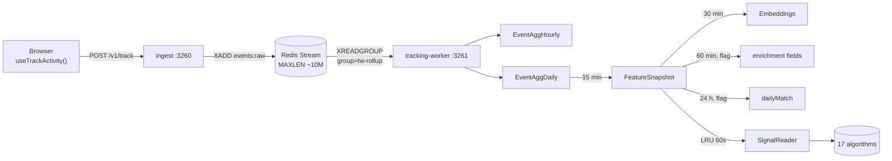

# Tracking

The end-to-end pipeline that turns browser actions into features the v4 algorithms can score.

## 1. Pipeline

## 2. Browser SDK

[services/web/src/hooks/useTrackActivity.ts](services/web/src/hooks/useTrackActivity.ts).

- In-memory queue, `BATCH_SIZE = 8`, `FLUSH_INTERVAL = 3 s`.
- Flush triggers: queue full / timer / `beforeunload` / `visibilitychange=hidden` (via `navigator.sendBeacon`).
- Per-tab `sessionId` in `sessionStorage`.
- Always silent failure — tracking never affects the user.
- Dual-write bridge into the v3.1 SDK (`services/web/src/lib/track/*`) for transitional A/B.

## 3. Event taxonomy

| Surface | Event name | Emitted by |
|---|---|---|
| Page | `page_view` | `useTrackPageView` on mount |
| Page | `page_dwell` | `useTrackPageView` on unmount (dwell > 2 s) |
| Page | `scroll_depth` | `useTrackScrollDepth` on unmount |
| Generic | `button_click` | `trackClick(elementId, meta?)` |
| Discover | `discover.card_view` | impression on Discover card |
| Discover | `discover.swipe` | like / pass / super, with `{direction, targetType, targetId, hasMessage}` |
| Discover | `filter_change` | filter panel updates |
| Match | `match_action` | accept / decline / unmatch |
| Messages | `message.send` | with `{kind, length, replyTo}` |
| Messages | `message_read` | when a chat is opened |
| Beats | `beats.send`, `beat_send/receive/play/like` | beat lifecycle |
| Notifications | `notification_click` | bell or push tap |
| Content | `content_engage` | like / comment / share / hide / report on feed/story/creativity |
| Photos | `photo_view` | carousel dwell per photo |
| Stories | `story_view` | with `{completionRate, durationMs}` |
| Search | `search_query` | with `{query, type, resultCount}` |
| Settings | `settings_change` | with `{key, newValue}` |
| Love Language | `lovelang.answer`, `lovelang.complete` | per-question + summary |
| Compat | `compat.answer` | per-question |
| Consent | `consent.update` | banner decision |

Every event is `{action, targetType, targetId?, metadata?, durationMs?}`. The browser sends them as `{events: [...]}` so a single HTTP roundtrip can carry up to 8.

## 4. Ingest service

[services/ingest/src/server.ts](services/ingest/src/server.ts). Port `3260`.

- **`POST /v1/track`** — Zod-validates each event ([validate.ts](services/ingest/src/validate.ts)), HMAC-hashes the uid ([hash.ts](services/ingest/src/hash.ts) → `TRACKING_HASH_SECRET`), `XADD events:raw` with `MAXLEN ~ 10M` (approximate trim). Returns `204` even if Redis is down. Per-device rate limit 60/min (silent drop on exceed).
- **`GET /v1/track/healthz`** — liveness + kill flag.
- **`POST /v1/track/forget`** — GDPR right-to-erasure acknowledgement. Actual deletion happens in the worker via `npm run forget` CLI.
- **`GET /metrics`** — Prometheus text: `track_requests_total`, `track_events_accepted_total`, `track_events_dropped_total`, `track_dnt_total`.

Gate flags:

| Env | Effect |
|---|---|
| `TRACKING_KILL=1` | All `/v1/track` returns 204 without queueing |
| `Do-Not-Track: 1` header | Same as above for that request |
| `TRACKING_STREAM_KEY` | Override stream name (default `events:raw`) |
| `TRACKING_STREAM_MAXLEN` | Approximate trim length (default `10000000`) |

## 5. Tracking-worker

[services/tracking-worker/src/index.ts](services/tracking-worker/src/index.ts). Port `3261` (health only).

Consumers started on boot (unless `TRACKING_KILL=1`):

| Consumer | Source | Sink | Cadence |
|---|---|---|---|
| `RollupConsumer` | Redis Stream `events:raw` (group `tw-rollup`, member `$HOSTNAME`) | `EventAggHourly`, `EventAggDaily` | continuous, batches of 10 k or 30 s |
| `FeatureAggregator` | `EventAggDaily` | `FeatureSnapshot.raw` | every 15 min |
| `CompatWriter` | `EventAggDaily` | `UserActivity` (legacy backward-compat) | every 15 min |
| `EmbeddingWorker` | `FeatureSnapshot` | `Embeddings` table | every 30 min |
| `EnrichmentWorker` (flag) | `FeatureSnapshot` | enriched fields in `FeatureSnapshot.raw` | every 60 min |
| `DailyMatchWorker` (flag) | `FeatureSnapshot` + `PairCompatCache` | `FeatureSnapshot.raw.dailyMatch` | every 24 h, +60 s on boot |
| `ColdStore` | old events | archived partition | every 1 h |

Consumer groups guarantee exactly-once semantics across replicas. Today the worker runs as a single replica to avoid double-aggregation; if scaled, each pod auto-shards by Redis Stream partition.

## 6. One event end-to-end (worked example)

User taps "Discover" at `T0`.

1. **T0**: `useTrackPageView('/discover')` enqueues `{action:'page_view', targetType:'page', metadata:{page:'/discover'}, ts:T0}`.
2. **T0+3s** (or 8 events): browser POSTs to `/api/v1/activity/track` (gateway proxies to `/v1/track` on ingest).
3. **T0+3.01s**: ingest validates, HMACs the uid (`uidHash = base64url(HMAC-SHA256(uid, TRACKING_HASH_SECRET))[:22]`), `XADD events:raw * uidHash <hash> action page_view targetType page metadata <json>`. Returns 204.
4. **T0+3.05s**: `RollupConsumer.XREADGROUP` picks up the entry, increments `EventAggHourly{uidHash, evt:'page_view', hourBucket}.count`. After 30 s flushes the batch in one COPY.
5. **T0+~5 min**: `EventAggDaily` row for today rolls up to include this event.
6. **T0+~15 min**: `FeatureAggregator` reads recent daily aggregates, recomputes `FeatureSnapshot.raw.peakHours` for this user.
7. **Next request**: when this user opens Discover again, `PrismaSignalReader.features(myHash)` hits the LRU (60 s TTL); on cold reads the row is now warm with the updated `peakHours`. `forYou.chronoOverlap` reads it; the resulting score reflects the new behaviour.

End-to-end: behaviour ⇒ feature ≈ 15 minutes p95. The user request path waits for none of it.

## 7. Privacy

- Tracking tables (`EventAggDaily`, `FeatureSnapshot`, `PairCompatCache`) store **only `uidHash`**. Raw user IDs never enter the analytics plane.
- `TRACKING_HASH_SECRET` is the join key. Never rotate it — doing so orphans every historical row.
- Consent: client-side `ConsentBanner` sets a cookie; the SDK won't queue until the user decides. Backend honours `Do-Not-Track: 1`. Operators have a global kill switch (`TRACKING_KILL=1`).
- GDPR delete: `services/tracking-worker$ npm run forget -- --uid <uid>` HMACs the uid, then `DELETE` from every tracking table.

## 8. Operating notes

- **Backpressure**: Redis Stream is bounded by `MAXLEN ~ 10M`. At ~5 KB/event that's ~50 GB of buffer — plenty for hours of outage.
- **Lag**: `GET /v4/status` reports the live algo inventory; for stream lag use `XPENDING events:raw tw-rollup`.
- **Idempotency**: events are not deduped at ingest; each browser-side enqueue gets a ULID and the worker upserts by `(uidHash, evt, hourBucket)`.
- **Kill switch**: `TRACKING_KILL=1` on **ingest** stops new writes; on **tracking-worker** stops all consumers and workers.

## 9. What changed & why it's good

- **Before:** Tracking calls were synchronous POSTs that hit Postgres directly from the user request path. Bursts of events caused write contention; outages of analytics rolled into the user-facing latency.
- **After:** Browser batches (8 / 3 s); ingest is a thin Zod + HMAC + XADD layer that always returns 204; tracking-worker chews the stream into bounded-cardinality aggregates; algorithms read warm features via a 60 s LRU.
- **Why it matters:** User latency is constant whether tracking is healthy or not. Analytics can be replayed during incidents from the stream. Privacy is enforced by construction: only `uidHash` ever enters the analytics tables.
