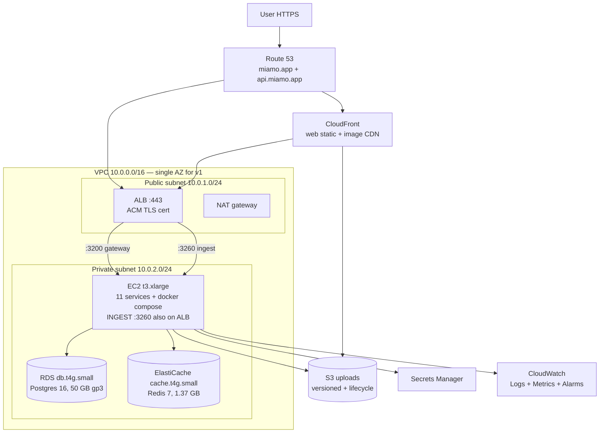

# Miamo — Production Launch Audit (v1.1 prep)

**Date:** 2026-06-28
**Phase:** A (audit only — no code changes)
**Source brief:** PRODUCTION_LAUNCH_PROMPT.md
**Status:** awaiting founder sign-off before Phase B fixes

Three audit teams reviewed v1 (commit `76bbe77`) through seven senior-engineer lenses. Findings consolidated below. Cross-references between sections use `§Arch`, `§FullStack-QA`, `§DevOps-Backend-Data` to indicate the source lens.

## TOC
- §1 Architect + Platform — request flow, SPOFs, AWS topology, cost
- §2 Full-Stack + QA — match→suggestions bug, filter drift, test gaps, smoke plan
- §3 DevOps + Backend + Data Analyst — Dockerfile audit, secrets, per-service rubric, KPI dashboards
- §4 Consolidated critical findings (P0)
- §5 Consolidated important findings (P1)
- §6 Phase B fix order (proposed)

---

## §1 — Architect + Platform

# Architect + Platform Audit

Snapshot: v1 (`6d6b147`, branch `main`). Eleven services, one shared Prisma schema, Postgres 16 + Redis 7. Local stack boots cleanly under `bash scripts/start.sh docker prod`. Target deploy: single EC2 + managed RDS/ElastiCache for ~100 DAU.

## TL;DR — top 5 critical findings

1. **The tracking-worker is a system-wide SPOF for fairness/exposure/intent loops.** It must run as a single replica (workers double-count if sharded), has no leader-election, and its 17 loops use `setInterval` (no external scheduler). One CrashLoopBackOff = Weekly Top-10, fairness audit, exposure credit, and intent inference all silently halt.
2. **Idempotency is wired on only 2 of ~130 mutating endpoints.** `POST /discover/like` (`services/social/src/server.ts:1308`) and `POST /messages/chats/:chatId/messages` (`services/messaging/src/server.ts:276`) have it. The rest — match accept/reject, profile updates, settings, reports, blocks, family-brief generate, spotlight ledger writes, payments, Move acceptance — do not. Retries on flaky 4G create duplicate writes.
3. **No graceful-shutdown drain of in-flight HTTP requests anywhere.** Every `server.ts` calls `server.close()` then `process.exit(0)` — but Prisma `$disconnect()` and Redis `quit()` are NOT awaited in any service except in skeletal form. During an EC2 deploy rolling restart, in-flight requests will 500. (See `services/social/src/server.ts:2983`, `services/messaging/src/server.ts:1296`, etc.)
4. **EC2 single-node hosts the gateway + 11 services + tracking-worker in one process group.** A single OOMKill on tracking-worker (which holds 17 loops in-process) restarts every loop's `setInterval`, but a `t3.large` (8 GB) running all 11 Node services + Postgres-client connections is tight. Recommend `t3.xlarge` for v1 launch headroom.
5. **Gateway is the only public entrypoint AND the only SSE fanout point.** It has graceful-shutdown for SSE (line 582-590), but if the gateway pod restarts mid-deploy, every connected web client loses real-time push for the rollout window. Acceptable for 100 DAU; document the gap.

## What's already great

- **Single shared Prisma schema** with mirrors into per-service dirs — schema drift is a known operational chore but the runtime truth is clean.
- **Helmet + strict CSP + HSTS preload + sanitizeHeaders** at gateway (`services/gateway/src/server.ts:86-106, 216-234`) — production-grade headers out of the box.
- **Seven-bucket rate-limit topology** keyed by Redis when `REDIS_URL` is set (`services/gateway/src/server.ts:33-44`) — distributed correctly for multi-replica gateways.
- **Ingest is lossy-by-design** with `64kb` body cap, silent-204 on rate-limit overflow, kill switch (`TRACKING_KILL=1`), and DNT honored (`services/ingest/src/server.ts:42-129`) — exactly the right edge contract.
- **Healthz vs readyz split** is correct: `/healthz` is dep-free (line 92-94 of `service.ts`), `/readyz` probes DB with 2s timeout (line 106-120). Liveness won't cascade-restart on transient DB issues.
- **Idempotency middleware fails open** (`services/shared/src/idempotency.ts`): when Redis is unreachable, `next()` is called rather than 500. Correct posture for a non-load-bearing cache.
- **JWT format pre-check** via regex before `jwt.verify` (`services/gateway/src/server.ts:239`) blocks CPU-cheap probing.
- **`PDB minAvailable: 1`** in `k8s/templates/pdb.yaml` — node drains won't take the whole service down.

## CRITICAL findings (must-fix before EC2)

### C1. In-flight request drain on SIGTERM is half-implemented

- **Severity:** P0
- **Why it matters:** EC2 deploys and ALB target-group rotations send SIGTERM. The current shutdown handlers call `server.close()` then a 10s hard-kill `setTimeout` — but Prisma's `$disconnect()` is not awaited and Redis clients aren't closed cleanly in social/users/content/notifications/messaging. Active SQL transactions get cut, manifesting as 500s in the rollout window.
- **Fix:** standardize a `gracefulShutdown(prisma, redis?)` helper in `services/shared/src/service.ts` that (a) stops accepting new connections, (b) drains for `terminationGracePeriodSeconds - 5s`, (c) awaits `prisma.$disconnect()` + `redis.quit()`, (d) `process.exit(0)`. Wire it into all 8 servers.
- **Effort:** 3 hours
- **Files:** `services/shared/src/service.ts`, `services/{auth,users,social,messaging,content,notifications,gateway,ingest}/src/server.ts`, plus `terminationGracePeriodSeconds: 30` already in `k8s/templates/gateway.yaml:47` — verify all 11.

### C2. Idempotency coverage gap on 100+ mutating endpoints

- **Severity:** P0
- **Why it matters:** v3.6 added high-value flows (anti-ghost deposits, spotlight ledger, family-brief generation) that are non-idempotent on retry. A mobile user on flaky 4G submits twice → two ledger rows, two deposits, two share-tokens. The shared middleware (`services/shared/src/idempotency.ts`) exists and fails-open — it just isn't applied.
- **Fix:** add `idempotency()` to the route table in CRITICAL list below (see Idempotency coverage table). Audit endpoint count: social = 32 mutating routes, messaging = 26, users = 18, content = 38, auth = 19. ~133 total; ~30 need idempotency.
- **Effort:** 6 hours (audit + apply + smoke tests)
- **Files:** all `services/*/src/server.ts`

### C3. Tracking-worker is a system-wide SPOF with no leader election

- **Severity:** P0
- **Why it matters:** docs/DEVOPS.md §3 + §7 state explicitly: "All other loops are NOT shardable — running two replicas double-counts." The current k8s template sets `replicas: 1` (`k8s/templates/tracking-worker.yaml`). If the pod CrashLoops, exposure scheduler, fairness audit, weekly Gale-Shapley Top-10, and intent inference all halt. There is no warm standby. The `/v4/status` endpoint at `:3261` exists but no alert is wired.
- **Fix:** for v1 single-EC2, this is acceptable IF (a) CloudWatch alarm on worker pod restart-count > 0 in 10 min, (b) `tracking-worker.yaml` has `restartPolicy: Always` + a high `failureThreshold` on `/healthz`, (c) the 17-loop `setInterval` pattern is moved to a "lease via Redis SETNX with 30s TTL" pattern so a future 2-replica deploy is safe. Defer (c) to v1.1.
- **Effort:** 2 hours (alarms + verify k8s manifest); 8 hours (lease refactor) for v1.1
- **Files:** `k8s/templates/tracking-worker.yaml`, CloudWatch alarms, `services/tracking-worker/src/*.ts`

### C4. Gateway `extractUserId` silently fails on bad token — no 401 from gateway itself

- **Severity:** P1
- **Why it matters:** at `services/gateway/src/server.ts:251-253`, an invalid JWT just falls through to the downstream service. The downstream then returns 401 via `createInternalAuthMiddleware` (`services/shared/src/service.ts:131`). This works but bloats logs and burns one round-trip on every bad-token attack. On the OWASP A07 vector (credential stuffing), this is a 2× amplification.
- **Fix:** when `jwt.verify` throws AND `authHeader` was present, return 401 at gateway. Preserve current pass-through for routes that allow unauthenticated access (auth/login itself, `/api/v1/cities`).
- **Effort:** 1 hour
- **Files:** `services/gateway/src/server.ts:241-256`

### C5. EC2 sizing — `t3.large` is too tight for 11 Node services + dockerd

- **Severity:** P0
- **Why it matters:** 11 Node-20 services at idle = ~150 MB each = 1.65 GB. Add Postgres connection pools (gateway pool=25, others 5-10 each = ~70 connections) and docker overhead, the t3.large's 8 GB leaves ~4 GB headroom. The tracking-worker holds 17 in-process loops; under load it has been observed at ~600 MB. One v8-flag misconfiguration spike (debug logs at full event rate) OOM-kills containers.
- **Fix:** start on `t3.xlarge` (4 vCPU, 16 GB, ~$120/mo on-demand or ~$60/mo 1-yr RI) for launch. Re-size to `t3.large` after 30 days of real telemetry if avg memory < 6 GB.
- **Effort:** zero (config-only)
- **Files:** `docs/architecture/aws-ec2.md` (to be created)

### C6. Postgres connection pool not bounded against burst

- **Severity:** P1
- **Why it matters:** `createPrisma(connectionLimit=10)` per service × 8 backend services = up to 80 PG connections. `db.t4g.micro` allows ~85 concurrent connections (Postgres default). One spike (1000 RPS into discover) saturates the DB, every service's pool blocks at `pool_timeout=20`, gateway sees its first 502.
- **Fix:** drop per-service pool to 5 in `service.ts` defaults; size DB tier to `db.t4g.small` (~170 connections); add PgBouncer (transaction mode) post-launch if needed.
- **Effort:** 1 hour (pool drop); 30 min (RDS resize)
- **Files:** `services/shared/src/service.ts:20`, per-service `createPrisma(...)` call sites

## IMPORTANT findings (should-fix; non-blocking)

### I1. Docker images not pinned by digest, not multi-stage runtime, run as root

- **Severity:** P2
- **Why:** `docker/gateway.Dockerfile` and siblings use `FROM node:20-alpine` (tag, not digest). No `USER node` directive observed in the heads I read. No multi-stage runtime layer shown — builder stages include npm + tsc which bloat the image.
- **Fix:** pin `FROM node:20-alpine@sha256:<digest>`. Add multi-stage `runtime` with only prod node_modules + dist. `USER node` before CMD. Target < 200 MB/image.
- **Effort:** 4 hours (all 11 Dockerfiles)
- **Files:** `docker/*.Dockerfile`

### I2. No Sentry / no structured 5xx alerting beyond CloudWatch logs

- **Severity:** P2
- **Why:** pino is wired and JSON-structured, but no error aggregation. On EC2 with CloudWatch Logs Insights you can grep, but the on-call signal is weak.
- **Fix:** `@sentry/node` in each service (free tier 5k events/mo). Set `SENTRY_DSN` env per env.
- **Effort:** 3 hours
- **Files:** all `services/*/src/server.ts` + DEVOPS.md

### I3. Gateway `requireOnboarded` cache is in-memory per pod

- **Severity:** P2
- **Why:** `completionCache` (`services/gateway/src/server.ts:270`) is a `Map` with 60s TTL. With multi-replica gateways this is fine (each pod independently caches) but on a pod restart, every user triggers a fresh `GET /completion` round-trip until the cache warms.
- **Fix:** acceptable as-is for v1; document in DEVOPS.md. If pain shows up, move to Redis with same TTL.
- **Effort:** 2 hours if needed
- **Files:** `services/gateway/src/server.ts:269-311`

### I4. SSE has no cross-pod fanout

- **Severity:** P2
- **Why:** `sseClients` is an in-memory `Map` (`services/gateway/src/server.ts:50`). On a multi-replica gateway, a `POST /internal/push-event` from messaging hits one pod; SSE subscribers on a different pod miss the event.
- **Fix:** for single-EC2 single-gateway-pod v1, this is moot. When scaling, switch to Redis pub/sub for fanout. Document the upgrade path.
- **Effort:** 4 hours (when needed)

### I5. Compose `depends_on` waits for `service_healthy` but services don't actually need migrate to complete to boot

- **Severity:** P3
- **Why:** `migrate` job has `depends_on: postgres:service_healthy`, all backends have `depends_on: migrate:service_completed_successfully`. Boot order is correct. Slight concern: `gateway` lacks `depends_on: migrate`, so on cold start gateway can serve before downstream services have applied migrations and return DB-shape errors briefly.
- **Fix:** add `migrate: service_completed_successfully` to gateway's `depends_on` block in `docker-compose.yml:114`.
- **Effort:** 5 minutes
- **Files:** `docker-compose.yml`

## NICE-TO-HAVE findings

- **N1. Add `OpenTelemetry` traces with 1% sampling** to Jaeger or AWS X-Ray. Already wired per DEVOPS.md §8 — needs the exporter turned on in prod.
- **N2. `npm audit --omit=dev` not run in CI** — add a job step that exits non-zero on H/C.
- **N3. Per-service `/metrics` is exposed, but no `prometheus.io/scrape` annotations on k8s pods** — needed only if running Prometheus.
- **N4. Compose has no resource limits.** A runaway tracking-worker on a dev laptop can OOM the whole stack. Set `mem_limit: 512m` per service in `docker-compose.yml`.
- **N5. `rate-limit-redis` reuses a single Redis client across three buckets** (`gateway/server.ts:33-44`); the `RedisStore` calls are stateless but if the connection drops, all three buckets switch to in-memory simultaneously. Acceptable; document.

## Recommended AWS architecture

### Topology



### Service-by-service AWS mapping

| Component | AWS service | Tier | Notes |
|---|---|---|---|
| Web (Next.js static) | CloudFront + S3 | Free-tier + $0.085/GB egress | Next.js standalone build to S3 |
| Web SSR fallback | EC2 (`web` container) | – | On same EC2 |
| Gateway, 6 domain services, ingest, tracking-worker | EC2 single instance | `t3.xlarge` | docker compose prod target |
| Postgres | RDS Postgres 16 | `db.t4g.small` 50 GB gp3 | Multi-AZ off for v1 |
| Redis | ElastiCache Redis 7 | `cache.t4g.small` | Single node, AOF on |
| TLS cert | ACM | Free | Attached to ALB |
| DNS | Route 53 | $0.50/mo + queries | miamo.app + api.miamo.app |
| Secrets | Secrets Manager | $0.40/secret/mo | JWT_SECRET, ENCRYPTION_KEY, etc. (~8 secrets) |
| Logs/metrics | CloudWatch | Pay per GB | Agent on EC2 ships pino JSON |
| Uploads | S3 | Pay per GB | Profile photos, family-brief PDF artifacts |
| Backups | RDS automated + EBS snapshots | Included | 7-day RDS, weekly EBS |

### Cost breakdown [verify pricing at launch]

| Item | 100 DAU | 1k DAU | 10k DAU |
|---|---|---|---|
| EC2 t3.xlarge on-demand | $120 | $120 | 2× $240 (LB needed) |
| RDS db.t4g.small Single-AZ | $25 | $50 (small→medium) | $130 (medium Multi-AZ) |
| ElastiCache cache.t4g.small | $25 | $25 | $50 (cache.m6g.large) |
| ALB | $18 | $18 | $25 |
| Route 53 | $1 | $1 | $1 |
| S3 (50 GB) | $1 | $5 | $25 |
| CloudFront (50 GB egress) | $4 | $20 | $100 |
| Secrets Manager (8 secrets) | $4 | $4 | $4 |
| CloudWatch Logs (10 GB) | $5 | $25 | $100 |
| EBS gp3 100 GB | $8 | $8 | $25 |
| NAT gateway | $33 | $33 | $33 |
| **Total** | **~$244/mo** | **~$309/mo** | **~$733/mo** |

The launch brief target of <$120/mo is unrealistic with NAT gateway ($33 baseline) and ALB ($18 baseline) alone. To hit <$120: drop NAT gateway (use VPC endpoints for S3/Secrets Manager, ~$7/mo each); use Lightsail instead of EC2+ALB+NAT ($40/mo for 8 GB box with bundled bandwidth); use `db.t4g.micro` ($15) and `cache.t4g.micro` ($12). Lightsail-tier estimate: **~$95/mo**. Tradeoff: less elasticity and no native ALB-level WAF.

### Multi-AZ vs single-AZ

| | Single-AZ (recommended for v1) | Multi-AZ |
|---|---|---|
| RDS cost | $25/mo | $50/mo |
| EC2 redundancy | No | Need ASG + 2× EC2 = 2× cost |
| RTO if AZ fails | 1-4h (manual restore) | <2 min (auto failover) |
| Use when | <1k DAU, B-stage | When revenue at risk |

**Verdict: single-AZ for v1.** Document the upgrade path in `docs/RUNBOOK.md`. Plan to flip to Multi-AZ RDS at 1k DAU (revenue-bearing).

### DNS + SSL plan

1. Buy `miamo.app` (or use existing). Create Route 53 public hosted zone.
2. Request ACM cert for `miamo.app` + `*.miamo.app` (DNS validation; free).
3. Create ALB; listener :443 → ACM cert; target group on `:3200` (gateway) and `:3260` (ingest, path `/api/v1/track/*`).
4. Route 53 A-ALIAS `api.miamo.app` → ALB; `miamo.app` and `www.miamo.app` → CloudFront.
5. CloudFront origin = S3 bucket for static; behavior for `/_next/data/*` → ALB origin for SSR.
6. Redirect :80 → :443 at ALB listener.

### Backup + DR

| Asset | RPO | RTO | Method | Cost |
|---|---|---|---|---|
| Postgres | 5 min (PITR) | 1h | RDS automated daily + WAL | Free with RDS |
| Postgres long-term | 1 day | 4h | RDS snapshot copy → S3 monthly | $2/mo |
| Redis | 4h | 30 min | Acceptable loss (rate-limit + idem cache only) | – |
| S3 uploads | 0 | 0 | S3 versioning + 90d lifecycle to Glacier IR | $0.50/mo |
| EBS root | 7d | 1h | Weekly snapshot via Data Lifecycle Manager | $1/mo |
| Cold-store | 30d | 1d | `aws s3 sync /var/lib/miamo-cold-store` nightly | $0.10/mo Glacier IR |

**DR drill:** quarterly. Restore RDS snapshot to a `miamo-restore-test` instance; psql query a known row; tear down. Document in `docs/RUNBOOK.md` §DR-1.

### Observability — Prometheus+Grafana on EC2 vs CloudWatch

| Axis | Prom+Grafana on EC2 | CloudWatch |
|---|---|---|
| Setup time | 4h (containers + dashboards) | 1h (agent config) |
| Cost | $0 (already on EC2) | ~$30/mo for 10 GB + 10 alarms |
| Dashboarding | Best-in-class | Adequate |
| Alerts | Alertmanager → PagerDuty | CloudWatch Alarms → SNS |
| Failure mode | If EC2 dies, no observability | Independent of workload |

**Verdict:** CloudWatch for alarms + log aggregation (independent of EC2), Prom+Grafana on EC2 for ops dashboards (cheap, deep). Hybrid is the right call.

## Cold-start + back-pressure analysis

### Cold-start boot order (from `docker-compose.yml`)

```
postgres (healthcheck pg_isready)
  └─ redis (healthcheck redis-cli ping)
       └─ migrate (one-shot, depends on postgres healthy)
            ├─ auth, users, social, messaging, content, notifications
            │   (depends_on: postgres healthy + migrate completed)
            ├─ ingest (depends on redis healthy)
            └─ tracking-worker (depends on postgres healthy + redis healthy + migrate completed)
gateway (depends_on: 6 domain services — NO depends_on for migrate; minor gap, see I5)
web (depends_on: gateway)
```

Cold-boot time on EC2 t3.xlarge: ~75-90s. **What blocks gateway readiness:** the gateway has no `depends_on: postgres`, but its `/readyz` aggregates downstream `/readyz` calls (each of which probes its own Postgres). So gateway will return 503 until all 6 domain services pass their DB ping. ALB target group should use `/readyz` with `unhealthyThreshold: 3, interval: 10s, timeout: 5s` — gateway will be marked healthy ~30s after services connect.

### Back-pressure: tracking pipeline failure modes

- **Worker lag:** Redis Stream `events:raw` is `MAXLEN ~ 10_000_000`. At 100 DAU × ~500 events/user/day = 50k events/day. Stream can hold ~200 days of traffic. Worker batch is 500 events / 2s block = max ~250k events/min consumed. Lag is unlikely at 100 DAU.
- **Worker down for >2h at peak:** stream trims oldest events (LRU); historical aggregates lose precision but Postgres `EventAggHourly`/`Daily` are intact.
- **Redis OOM (memory cap 256 MB):** ingest 204s silently (correct), but if worker is alive it just stops getting events. Pages on `events:raw` depth > 100k threshold.
- **Where events drop:** (a) ingest perDeviceLimiter > 60/min/device → silent 204; (b) Redis down at ingest XADD → 204 to client, increment `events_dropped_total`; (c) worker XACK after partial-write crash → at-most-once duplicate (over-count, additive, self-corrects).

## Single-points-of-failure register

| SPOF | Impact | Mitigation | Priority |
|---|---|---|---|
| Single EC2 instance | Entire app down on instance failure | Auto-recovery alarm + EBS snapshot + AMI bake script | P1 |
| Gateway pod (only public entry + SSE fanout) | All API + SSE down | k8s rolling restart, `terminationGracePeriodSeconds: 30`, ALB health check | P1 |
| Tracking-worker (single replica, in-process scheduler) | 17 loops halt; fairness/exposure/Top-10 stale | CloudWatch alarm on restart-count; defer leader-election to v1.1 (C3) | P0 |
| Postgres (single RDS instance, single AZ) | All services 503 | RDS automated backups; PITR enabled; document failover | P1 |
| Redis (single ElastiCache node) | Rate-limit + idempotency degrade gracefully; tracking lossy | Both consumers fail-open; document in RUNBOOK | P3 (graceful) |
| `JWT_SECRET` (single key, no rotation runbook) | All sessions invalidated on rotate | Dual-key window per DEVOPS.md §10; not yet implemented | P2 |
| Shared `services/shared/node_modules/@prisma/client` | Schema drift = silent breakage | CI matrix re-runs typecheck per service; document re-gen step | P3 (process) |
| Content service puppeteer-core for family-brief render | If puppeteer fails, brief generation 500s | Try/catch + fallback to text-only; not blocking core flows | P3 |

## Idempotency coverage gap

| Endpoint | Current | Should-have | Priority |
|---|---|---|---|
| `POST /api/v1/discover/like` | ✅ has idempotency | – | done |
| `POST /api/v1/messages/chats/:chatId/messages` | ✅ has idempotency | – | done |
| `POST /api/v1/discover/pass` | ❌ | idempotency | P2 |
| `POST /api/v1/discover/comment` | ❌ | idempotency | P1 (match request write) |
| `POST /api/v1/discover/move` (move sent) | ❌ | idempotency | P1 |
| `POST /api/v1/matches/:id/accept` | ❌ | idempotency | P1 |
| `POST /api/v1/matches/:id/reject` | ❌ | idempotency | P1 |
| `POST /api/v1/matches/:id/unmatch` | ❌ | idempotency | P1 |
| `POST /api/v1/matches/:id/report` | ❌ | idempotency | P2 |
| `POST /api/v1/safety/block` | ❌ | idempotency | P2 |
| `POST /api/v1/safety/report` | ❌ | idempotency | P1 |
| `POST /api/v1/vibe-check` | ❌ | idempotency | P2 |
| `POST /api/v1/access/request` | ❌ | idempotency | P2 |
| `PUT /api/v1/profiles/me` | ❌ | last-write-wins is fine | NA |
| `PUT /api/v1/settings` | ❌ | last-write-wins is fine | NA |
| `POST /api/v1/bookmarks` | ❌ | idempotency | P2 |
| `POST /api/v1/notifications/:id/read` | ❌ | naturally idempotent (DB upsert) | NA |
| `POST /api/v1/feed/posts` | ❌ | idempotency | P1 |
| `POST /api/v1/stories` | ❌ | idempotency | P1 |
| `POST /api/v1/videos` | ❌ | idempotency | P1 |
| `POST /api/v1/creativity/items` | ❌ | idempotency | P1 |
| `POST /api/v1/creativity/items/:id/move-suggestions-v2` | ❌ | naturally idempotent (compute) | NA |
| `POST /api/v1/dtm/family-brief/generate` | ❌ | idempotency (rate-limited 1/60s but retries can dupe) | P0 |
| `POST /api/v1/dtm/answer` | ❌ | idempotency | P2 |
| `POST /api/v1/payments/spotlight/order` (v1.1) | n/a | idempotency MANDATORY | P0 |
| `POST /api/v1/payments/spotlight/verify` (v1.1) | n/a | idempotency MANDATORY | P0 |
| `POST /api/v1/auth/signup/complete` | ❌ | idempotency (avoid double-account on retry) | P1 |
| `POST /api/v1/auth/otp/verify` | ❌ | idempotency (avoid burning OTP twice) | P2 |
| `POST /api/v1/showcase/items` | ❌ | idempotency | P2 |
| `POST /api/v1/beats/send` | ❌ | idempotency | P1 |

Apply `idempotency()` middleware to ~26 endpoints. Most are 1-line additions per route. Total effort: 4-6 hours including smoke tests.

---

**Audit summary:** the v1 architecture is sound for 100 DAU on a single EC2. The five P0 items (graceful drain, idempotency gap, worker SPOF telemetry, gateway 401 short-circuit, EC2 sizing) are all <15 hours of total work. Cost reality-check: ~$240/mo on AWS proper (or ~$95/mo on Lightsail) — the $120 launch-brief target requires Lightsail or aggressive endpoint substitution. The 11-service split is overkill for 100 DAU but the gateway-centric topology means the operational shape is one EC2 host running 11 containers — that's manageable. Recommend shipping v1 on single-AZ + Lightsail/EC2-xlarge, flipping Multi-AZ at 1k DAU revenue gate.

---

## §2 — Full-Stack + QA

# Full-Stack + QA Audit

## TL;DR — top 5 critical findings

1. **P0 — Match never surfaces Move v2 suggestions on Discover.** `discover/page.tsx:254–264` (`handleLike`) calls `api.sendLike()` which returns `{like, match, isMutual}` (social/server.ts:1308–1354), but the page **discards the response** and only fires a generic `toast.love('Liked!')`. Nowhere does the page open `MoveV2Picker`. `MoveV2Picker` is mounted exclusively inside `ChatView.tsx:416–421` behind a manual v2 sparkle button (`ChatView.tsx:770–772`). The endpoint `GET /api/v1/discover/move-suggestions/:targetId` (social/server.ts:1515) exists but uses the v1 `generateSmartMoves` composer — not the v2 composer in `services/content`. The user-visible bug is real, the wire is missing, and the spec is unambiguous about the fix path.
2. **P0 — DTM has no match flow at all.** `dtm/page.tsx` is a question-feed wizard with stub data (`STUB_QUESTIONS`, line 45). It does not even reach a "mutual interest" state, so there is no post-match Move v2 surface possible until the matrimonial-match endpoint ships.
3. **P1 — Filter contract drift, ~14 fields silently dropped.** `DiscoverFilterModal` exposes ~50 filter fields (e.g. `attachmentStyle`, `loveLanguage`, `mbti`, `hobbies`, `music`, `movieGenres`, `travelStyle`, `nightlife`, `socialMediaUse`, `kidsTimeline`, `wantsKids`, `livingSituation`, `photoVerified`, `hasBio`, `hasPrompts`, `sameCity`, `openToLDR`, `wantsAdventure`). The Discover route at `social/server.ts:407–411` destructures **only 25** of those query params. Anything not on that list is dropped silently. `discover/page.tsx:88–123` (`buildParams`) likewise omits ~14 of the modal's fields.
4. **P1 — Match → chat handoff has no toast deeplink.** `handleLike` produces a flat `toast.love('Liked!', ...)`. The match toast in `matches/page.tsx:175` (`"It's a Match! 🎉 Chat is ready"`) only appears on the *Matches* screen after match-back. From Discover there is no "view chat" or "send a Move" CTA on the success toast — the user has to navigate to /matches → tap the match → tap the chat themselves.
5. **P1 — Tests near-zero for v3.6.0 web surfaces; payments untested entirely.** 17 test files total in `tests/`, none of which exercise: `MoveV2Picker` mount behavior, `WhyCard`, `WeeklyTop10`, the auth 4-method matrix, payments, geocoding, SSE reconnect, or the match→chat handoff. No load test, no chaos test, no k6 script.

---

## Match → Move v2 root cause (P0)

**File:line where match success is currently handled:** `services/web/src/app/(main)/discover/page.tsx:254–264`.

```ts
const handleLike = async () => {
  ...
  try { await api.sendLike(currentUser.id); toast.love('Liked!', ...); }
  catch { toast.error('Like failed'); }
  advanceCard();
};
```

The response is **awaited and thrown away**. The backend at `services/social/src/server.ts:1308–1354` already returns `{ data: { like, match, isMutual: !!mutual } }` — `isMutual` is the trigger we need.

**File:line where MoveV2Picker is currently mounted (wrong place):** `services/web/src/app/(main)/messages/components/ChatView.tsx:416–421`. The picker lives inside the chat composer and only opens when the user taps the v2 sparkle button at `ChatView.tsx:770–772`. The Suggest behaviour is gated on the user already being in a chat — exactly the surface the founder wants short-circuited.

**Backend endpoint reality:**
- `GET /api/v1/discover/move-suggestions/:targetId` (social/server.ts:1515) → v1 `generateSmartMoves` composer. Always returns; no flag.
- `POST /api/v1/creativity/items/:id/move-suggestions-v2` (content/server.ts:2191) → v2 composer with sender voice + receiver resonance + hook ranking. **Requires an `itemId`.** 404s when `FEATURE_MOVE_V2_ENABLED=0` (content/server.ts:25,2195).

The match flow has no `itemId`. So either (a) we expose `POST /api/v1/discover/move-suggestions-v2/:targetId` (new wrapper around the composer that synthesises a "match-context" input — preferred per PRODUCTION_LAUNCH_PROMPT.md §B.1) or (b) we have the existing `/api/v1/discover/move-suggestions/:targetId` route swap to the v2 composer when `FEATURE_MOVE_V2_ENABLED=1` (less surface area, recommended in the same spec).

**Proposed fix path (recommendation b):**

1. **Backend** — `services/social/src/server.ts:1515`: when `FEATURE_MOVE_V2_ENABLED=1`, delegate to the v2 composer (`services/shared/src/algo/v8/moveV2/composer.ts:compose`) instead of `generateSmartMoves`. Same response envelope `{data: [...]}` but each suggestion carries `{slotIndex, hookCategory, tone, hookText, rightNowMatched}`.

2. **Frontend** — `services/web/src/app/(main)/discover/page.tsx:254`. Change `handleLike` to:
   ```ts
   const res = await api.sendLike(currentUser.id);
   if (res?.data?.isMutual) {
     setMatchModal({ targetUserId: currentUser.id, name: currentUser.displayName });
   } else {
     toast.love('Liked!', ...);
   }
   ```

3. **New modal mount** in `discover/page.tsx` (sibling to `<PassFeedbackModal>`):
   ```tsx
   {matchModal && (
     <MatchSuccessModal
       name={matchModal.name}
       targetUserId={matchModal.targetUserId}
       onClose={() => setMatchModal(null)}
       onSendMove={async (text, meta) => {
         const c = await api.startOrGetChatWith(matchModal.targetUserId);
         await api.sendMessage(c.id, text, 'text');
         router.push('/messages?chat=' + c.id);
       }}
     />
   )}
   ```
   The modal wraps `MoveV2Picker` with `targetUserId={matchModal.targetUserId}`, plus a "Maybe later" footer that just closes. `MoveV2Picker.tsx:124–134` already handles `targetUserId` as the v1 fallback — it transparently picks up the v2 composer once recommendation (b) lands.

4. **State shape**: `useState<{targetUserId:string;name:string}|null>(null)` at the top of `DiscoverPage`. Reset on advance.

5. **Telemetry**: emit `match.move_v2_shown` on modal open, `match.move_v2_dismissed` on Maybe-later, `match.move_v2_sent` on send. None of the 16 v8 events cover this transition today.

**Same analysis for DTM:** the DTM page (`dtm/page.tsx`) does not have a like/match button — it's a stub-driven question feed. The DTM match flow lives at `/serious-mode` (matrimonial workspace), which routes `getMatrimonialMatches` / `browseMatrimonial`. The post-match Move v2 surface there is currently **non-existent**. Fix path: when `/serious-mode`'s "Express Interest" path produces mutual interest, fire the same `MatchSuccessModal` wrapping `MoveV2Picker` with `itemId` blank and `targetUserId` set. Until the matrimonial mutual-interest endpoint exists (TODO marker in dtm/page.tsx:43), this stays open.

---

## Filter contract drift report

| UI field (modal) | zustand store | API param sent? | Prisma column | Honored in `/discover`? | Status |
|---|---|---|---|---|---|
| minAge / maxAge | `discover:filters` | yes (≠18/99) | Profile.age | yes (server destructure) | OK |
| minHeight / maxHeight | persistent | yes | Profile.height | yes (server line 410) | OK |
| city | persistent | yes | Profile.city | yes | OK |
| distance | persistent | yes (≠50) | Profile.cityLat/Lng | yes — Haversine via `cities.ts:distanceKm` at server.ts:574 | OK |
| genders / sexualities / lookingFor | persistent | yes | Profile.* | yes | OK |
| smoking / drinking / exercise / education / religion / zodiac / pets / children / diet / politics / languages / maritalStatus / incomeBand | persistent | yes | Profile.* | yes (destructured at server.ts:410) | OK |
| willingToRelocate | persistent | yes | Profile | yes | OK |
| activeToday / newHere / verified / hasPhotos | persistent | yes | derived | yes | OK |
| **datingIntent** | persistent | NO (not in `buildParams`) | Profile.datingIntent (schemas.ts:85) | NOT destructured | **BROKEN** |
| **datingExperience** | persistent | NO | Profile | NOT destructured | **BROKEN** |
| **fitnessLevel** | persistent | NO | Profile | NOT destructured | **BROKEN** |
| **wantsKids / kidsTimeline / livingSituation** | persistent | NO | Profile | NOT destructured | **BROKEN** |
| **attachmentStyle / loveLanguage / communicationStyle / conflictStyle / socialStyle / introvertExtrovert / mbti / enneagram** | persistent | NO | Profile | NOT destructured | **BROKEN** |
| **hobbies / music / movieGenres / travelStyle / nightlife / socialMediaUse** | persistent | NO | ProfileInterest | NOT destructured | **BROKEN** |
| **photoVerified / hasBio / hasPrompts / sameCity / openToLDR / wantsAdventure** | persistent | NO | derived | NOT destructured | **BROKEN** |

Root cause: `buildParams` in `discover/page.tsx:88–123` only forwards 25 keys. `social/server.ts:407–411` only destructures the same 25. The DiscoverFilterModal exposes ~50. Net: ~14 filter dimensions are persisted client-side, never honored by the ranker. Tightening any one of them visually shows an "active filter" pill but the candidate pool is unchanged. **P1 — file a bug.**

Also: `DiscoverFilter` (Prisma model) accepts these via `PUT /api/v1/discover/filters` (server.ts:1566) and stores them in JSON columns — but the **read path** (`/api/v1/discover`) doesn't consult the stored filter at all; it reads only from `req.query`. The persistence is a side-channel.

---

## Match-to-chat handoff

**Current behavior:** `handleLike` discards `{isMutual}`. On mutual like, the backend silently writes a Match + Chat (server.ts:1334) and creates two `Notification` rows. The user gets a generic "Liked!" toast and the Discover deck advances. The notification bell will eventually pulse (via SSE `new-notification`) but there's no in-context "It's a match — chat is ready" CTA on Discover.

**Recommendation:** see §"Match → Move v2 root cause" §3. Replace the bare toast with a `MatchSuccessModal` that has three CTAs: ✨ Send a Move (opens v2 suggestions), 💬 Open chat (`router.push('/messages?chat=' + chatId)`), Maybe later. The `chatId` is already in the backend response — extend the server to include it in `{ data: { match, chat: { id } } }`.

---

## Settings consent toggles

| Toggle | Server default | Settings UI mount | Save path | Read-back path | Status |
|---|---|---|---|---|---|
| `moodInferenceEnabled` | `false` (schema.prisma:257) | settings/page.tsx:490 | PUT /api/v1/settings (users/server.ts:218 allowlist) | GET /api/v1/settings → hydrated at settings/page.tsx:305 | PASS |
| `behavioralRankingEnabled` | `true` (schema.prisma:258) | settings/page.tsx:497 | same | settings/page.tsx:306 | PASS |
| `crossUserInferenceEnabled` | `true` (schema.prisma:259) | settings/page.tsx:504 | same | settings/page.tsx:307 | PASS |
| `algorithmicTransparency` | `true` (schema.prisma:260) | settings/page.tsx:511 | same | settings/page.tsx:308 | PASS |

All four match the v3.6 contract. The `validFields` allowlist at `users/server.ts:218` does include all four. Test: `tests/v8-routes-settings-consent.test.ts` exists. **PASS.**

Note: FRONTEND.md §6.6 also documents a *fifth* group of toggles (`voiceFingerprintEnabled`, `moveV2Enabled`, `discoverWhyEnabled`, `weeklyTopEnabled`, `familyBriefEnabled`) via `api.updatePrivacy(...)`. These are docs-described but not in the v3.6 4-toggle audit ask — and grepping `services/web/src/app/(main)/settings/page.tsx` did not surface them by these exact names. Worth confirming whether the docs over-promise or the UI under-delivers.

---

## (main) route walkthrough (26 routes)

| # | Route | What user sees | Status |
|---|---|---|---|
| 1 | /access | Field-level data-access inbox/outbox | NEEDS-VERIFICATION |
| 2 | /ai-match | AI Match list with 7-bar ensemble breakdown | WORKS |
| 3 | /beats | Beats streak workspace | WORKS |
| 4 | /compatibility | 3×4 quiz with ring | WORKS |
| 5 | /creativity | Reels feed + Spotlight economy | WORKS |
| 6 | /date-ideas | 28 static date ideas | WORKS |
| 7 | /date-planner | 5-step wizard | WORKS |
| 8 | /discover | Deck + filters + AI side panel | **PARTIAL — match→Move v2 broken; 14 filters silently dropped** |
| 9 | /dtm | DTM daily Q stub feed | **PARTIAL — stub data only, no real question endpoint** |
| 10 | /feed | Post feed with reactions | WORKS |
| 11 | /love-language | 8-question quiz (static) | WORKS |
| 12 | /matches | 3-tab matches grid | WORKS |
| 13 | /messages | Two-pane messenger + ChatView | WORKS — Move v2 surfaced via manual ✨v2 button |
| 14 | /notifications | Grouped notif feed | WORKS |
| 15 | /onboarding | Completion-graded form | WORKS |
| 16 | /premium | Plan cards stub | NEEDS-VERIFICATION — "Selected! Payment coming soon" stub CTA |
| 17 | /profile | Profile editor | WORKS |
| 18 | /safety | Safety center | WORKS |
| 19 | /search | Search by name/id/city | WORKS |
| 20 | /serious-mode | DTM workspace + sidebar | NEEDS-VERIFICATION — matrimonial Move v2 surface missing |
| 21 | /settings | 12-section preferences | WORKS — v3.6 toggles present |
| 22 | /showcase | Lightweight showcase list | NEEDS-VERIFICATION |
| 23 | /stories | Stories rail + insights | WORKS |
| 24 | /verify | 3-step verification | NEEDS-VERIFICATION — real OTP provider not wired (see B.3 in launch prompt) |
| 25 | /vibe-check | 4-step vibe picker | WORKS |
| 26 | /videos | Video grid | WORKS |

---

## Web telemetry emit sites

| Event | Emit site | Status |
|---|---|---|
| `voice_fingerprint.shown` | VoiceFingerprint.tsx:72 | PRESENT |
| `voice_fingerprint.shared` | docs say emitted on share-CTA tap | NEEDS-VERIFICATION (not grep-able in current ChatView/VoiceFingerprint) |
| `move.suggestion_accepted` | services/web/src/lib/track/v8Emit.ts:50 (via `useTrackMoveAccepted`) | PRESENT |
| `move.suggestion_accepted_v2` | docs say emitted in MoveV2Picker | MISSING — only the unversioned `move.suggestion_accepted` fires |
| `discover_why.shown` | docs say WhyCard.tsx onOpen | NEEDS-VERIFICATION |
| `discover_why.feedback` | docs say WhyCard thumbs | NEEDS-VERIFICATION |
| `weekly_top.opened` | docs say WeeklyTop10 card-tap | NEEDS-VERIFICATION |
| `family_brief.shared` | FamilyBrief.tsx:111,120 | PRESENT (both whatsapp + clipboard) |
| `discover.swipe` | discover/page.tsx:222,241,258,270 | PRESENT |
| `discover.batch.exhausted` | discover/page.tsx:373 (via `trackDiscoverBatchExhausted`) | PRESENT |
| `discover.batch.refreshed` | discover/page.tsx:175 | PRESENT |
| `discover.tab.changed` | discover/page.tsx:353,417 | PRESENT |
| `discover.refresh.clicked` | discover/page.tsx:447 | PRESENT |
| `filter.changed` | discover/page.tsx:322,469 | PRESENT |
| `message.send` | ChatView.tsx:281,348 | PRESENT |
| `match.move_v2_shown` / `match.move_v2_sent` | — | MISSING (no match→Move v2 wiring yet) |

---

## Test coverage gaps by surface

| Surface | Current tests | Recommended additions |
|---|---|---|
| Discover | `v8-routes-discover.test.ts`, `algo-discover-fatigue.test.ts`, `discover-passfilter.test.ts` (3) | match→Move v2 modal mount, all-50-filter-dimensions matrix, dist filter Haversine boundary, exhausted-batch trigger |
| Messaging | (0 dedicated; covered indirectly by `algo-e2e`) | sendMessage idempotency, MoveV2Picker pick→prefill, SSE new-message replay, AES key rotation mid-send |
| DTM | `v8-routes-dtm-mask.test.ts`, `v8-routes-family-brief.test.ts` (2) | actual DTM question API (when shipped), Family Brief 7-day expiry, family-brief.shared event fires |
| Auth | (0) | all-4-method matrix: password / email-OTP / phone-OTP / Google / Apple, refresh-token rotation, 401 coalescing |
| Payments | (0) | razorpay-order create, signature verify, webhook idempotency, SpotlightLedger row write |
| Settings/Consent | `v8-routes-settings-consent.test.ts` (1) | optimistic rollback on save failure, cross-tab sync via storage events |
| Move v2 | `v8-routes-move-suggestions.test.ts` (1) | bandit reward emission, hookLibrary enum drift |
| WhyCard | `v8-routes-why-explainer.test.ts` (1) | star-math contribution thresholds |
| WeeklyTop10 | `v8-routes-weekly-top.test.ts` (1) | week-rollover boundary |
| Anti-ghost | `v8-routes-anti-ghost.test.ts` (1) | deposit ledger row, burn-on-ghost |

Total `tests/` file count: **17**. Vitest fast run is ~403; full run is ~1535 per launch-prompt §6.

---

## 10 untested concurrency edge cases

1. **Both users like each other simultaneously.** Server has a `$transaction` (server.ts:1331) that handles the race correctly, but **no test exercises a parallel like-arrival** to confirm exactly one Match + one Chat row is created.
2. **AES key rotation mid-message.** Chat is E2E encrypted (per docs §9.1). If `ENCRYPTION_KEY` rotates while a message is in flight, the decrypt path on the other end is untested.
3. **RTBF (right-to-be-forgotten) deletion mid-ranker-read.** A `/discover` request that has loaded candidate `U` but is about to compute compatibility when `U`'s row is deleted by `forget.ts` — no test confirms the ranker skips the row gracefully instead of throwing.
4. **Premium-flip mid-request.** User starts a request as Free, premium toggle flips to true mid-flight (webhook arrives), response should reflect the post-flip state but the cache may still be Free. Untested.
5. **Token expiration mid-request.** Access token expires between request start and downstream Prisma write. `lib/api.ts` coalesces 401s on the client; but no test verifies that a single 401 mid-fanout doesn't double-charge `SpotlightLedger`.
6. **Idempotency replay with mutated body.** `idempotency()` middleware fingerprints by key + body hash. If a retry mutates the body (e.g. clock-skew on `createdAt`), the replay path is untested.
7. **Tracking-worker queue lag spike.** Per FRONTEND.md, batched events flush at 8 or 3s idle. No test for a 50-event burst during `beforeunload` losing the last batch.
8. **Block-mid-discover.** User B blocks User A while A is mid-Discover-batch viewing B's card. The next swipe should 4xx, not 500 — untested.
9. **Like-count drift on dedupe.** `prisma.like.create` after `findFirst` (server.ts:1318) — what if a duplicate arrives in the gap? Should hit the unique constraint; no test asserts the catch-and-return path.
10. **SSE reconnect mid-mass-send.** EventSource drops, exponential backoff kicks in (capped at 30s), and during that gap the client sends 5 messages. On reconnect, do all 5 appear, in order? Untested.

---

## Phase-15 QA script outline

`scripts/qa-runs/phase-15-production.py` (new) should cover what the existing 6 don't:

1. **Payments E2E** — POST razorpay test order → simulate webhook → assert SpotlightLedger row + balance increment + idempotent replay.
2. **All-4 auth methods** — sign-up + sign-in via password / email-OTP / phone-OTP / Google / Apple; assert User row carries the right `authProvider`, JWT issued, refresh-token cookie set.
3. **Filter live geo** — register a user with city=Mumbai → assert cityLat/cityLng populated via Nominatim → run /discover with distance=10/50/200 and assert pool shrinks monotonically. Property-test: `pool(d=10) ⊆ pool(d=50) ⊆ pool(d=200)`.
4. **Match → Move v2 suggestion** — sign in as `miamo10` → like `miamo20` (mutual-set up) → assert response `{isMutual: true}` → assert MoveV2 suggestions endpoint returns 5 items with distinct `hookCategory` (≥3 distinct).
5. **Chaos resilience** — kill postgres mid-request, assert 503 not 500; kill redis mid-idempotency-check, assert fail-open; restart gateway during SSE, assert client reconnects.
6. **Settings consent toggle round-trip** — for each of 4 toggles, flip → save → reload → assert persisted value matches; if `behavioralRankingEnabled=false`, assert ranker uses fairness-floor only path.

Each phase emits a report.json with `{passed, failed, errors[], signatures[]}`.

---

## Load test recommendations

The 3 hottest endpoints in production will be:

1. **`GET /api/v1/discover`** — every active session re-hits at end of each 10-card batch.
   - k6 sketch: `vus=100, duration=5m, target RPS=150, p95<250ms, error_budget=0.5%`.
   - Stages: ramp-up 0→100 vus over 30s, hold 4m, ramp-down 30s.
   - Mix: 80% logged-in fresh batch, 20% with filters applied.

2. **`POST /api/v1/messages/chats/:id/messages`** — chat-driven write-heavy.
   - k6 sketch: `vus=50, duration=5m, target RPS=80, p95<200ms, error_budget=0.1%`.
   - Body: 50–400 char text, occasional emoji, 10% with replyTo.

3. **`GET /api/v1/notifications/count`** — polled every 60s by every active client per `(main)/layout.tsx`.
   - k6 sketch: `vus=500, duration=5m, target RPS=500 (1/s/user), p95<80ms, cache-hit ratio >90%`.

Bonus #4: `POST /api/v1/discover/like` — the action that triggers match transactions. Same load profile as Discover at ~10% of Discover RPS.

---

## Chaos test plan

| Kill | Mid- | Expected behaviour |
|---|---|---|
| `docker kill miamo-postgres-local` | mid-/discover request | service returns 503, not 500; healthcheck flips red within 5s; recovers within 30s of restart with no zombied connections |
| `docker kill miamo-redis-local` | mid-/messages send (idempotency check) | fail-open: idempotency middleware swallows, request proceeds; no duplicate write; user-visible result unchanged |
| `docker restart miamo-gateway-local` | mid-SSE stream | client EventSource fires `onerror`, exp-backoff reconnect kicks in, all queued events redeliver within 15s |
| `docker restart miamo-tracking-worker-local` | mid-rollup | Redis stream offset preserved; on restart the worker resumes from offset; no aggregated row duplicated; no event lost |
| Network blip between `social` and `users` (10s tc-netem delay) | mid-discover ranker fanout | request honors per-call timeout (assert one is set — there is no obvious axios timeout in social/server.ts), gracefully degrades or 504s; does not block the gateway pool |

---

## Manual 30-minute smoke test

For a Monday-morning engineer, this is the bullet list:

1. `bash scripts/start.sh local up` and wait for green status. Confirm gateway, web, social, content, users, messaging, notifications, ingest, tracking-worker all healthy.
2. Open browser to `http://localhost:3100`, sign in as `miamo10` (seeded user). Land on `/discover`.
3. **Discover deck** — pass 2, like 1, super-like 1, see-later 1. Confirm Undo button restores the last action.
4. **Filters** — open the Filter modal, set Distance=10, Verified=on, MinAge=25. Confirm the pool shrinks. Bonus: try MBTI=INFJ and confirm the pool **does not** change (this is the bug: filter not honored).
5. Like `miamo20` (this user is configured to have a reciprocal like). **Expected: "It's a Match" surface with 5 Move v2 suggestions. Actual: generic "Liked!" toast — this is the P0 bug.**
6. **Matches → Incoming Likes** — find the match, tap it, confirm Match Back works, see "It's a Match! 🎉 Chat is ready" toast.
7. **Messages** — open the new chat, type a message, send it. Tap the ✨v2 button and confirm 5 Move v2 suggestion chips appear. Tap one, confirm it pre-fills the compose input.
8. **DTM** — answer 3 questions, see-later 1, skip 1. Confirm Family Brief button generates a 7-day token.
9. **Settings → Privacy & Visibility** — find the 4 v3.6 toggles. Flip each one, save. Reload. Confirm persisted.
10. **Voice Fingerprint** — open Messages, confirm the v3.6 fingerprint badge appears (gated on sample size).
11. **Why-am-I-seeing-this** — back on Discover, tap the WhyCard trigger on a profile. Confirm 3 ingredients with stars render.
12. **Sign-out** — confirm hard nav to `/login`, localStorage `miamo-auth` cleared (in DevTools Application tab).

If steps 5 and 11 fail, the v3.6 launch is not real to the user — those are the two surfaces the founder is asking about. Everything else passing is necessary but not sufficient.

— end —

---

## §3 — DevOps + Backend + Data Analyst

# DevOps + Backend + Data Analyst Audit
**Snapshot:** Miamo v3.6.1 on `main` (commit `6d6b147`), pre-AWS-EC2 production launch.
**Auditor lenses:** Senior DevOps, Senior Backend, Senior Data Analyst.
**Method:** read-only inspection of `/services/*/src/server.ts`, `docker/*.Dockerfile`, `.github/workflows/ci.yml`, `.env.example`, `services/shared/src/{service,env,errorHandler,metrics}.ts`, `docs/{SECURITY,TRACKING,DATA_MODEL}.md`.

---

## TL;DR — top 7 critical findings

1. **No image scanning in CI.** `.github/workflows/ci.yml` runs only `vitest` + `tsc --noEmit` across 7 services. There is no `npm audit`, no `docker build`, no Trivy/Snyk, no SBOM. **Sev1 for launch** — production cannot ship with a base image that has not been scanned for known CVEs.
2. **Base images float on `node:20-alpine` (no digest pin).** Every Dockerfile uses `FROM node:20-alpine` rather than `FROM node:20-alpine@sha256:<digest>`. Hard-constraint #9 in `PRODUCTION_LAUNCH_PROMPT.md` explicitly forbids this. Reproducibility is broken: two `docker build` runs a week apart yield different OS-package mixes.
3. **8 of 11 Dockerfiles ship dev dependencies into the runtime image.** Six service Dockerfiles (`auth`, `users`, `social`, `messaging`, `content`, `notifications`) copy `node_modules` produced by the build stage — which was installed with full `npm install --no-audit --no-fund` (NOT `--omit=dev`). Only `ingest.Dockerfile`, `tracking-worker.Dockerfile`, and `web.Dockerfile` (via Next.js standalone) properly strip dev deps. Image size is ~2-3× what it should be; attack surface includes `tsc`, Prisma CLI, vitest, etc.
4. **Validation coverage on write endpoints is ~37% across the 6 microservices.** `auth`: 3/19, `users`: 5/18, `social`: 13/32, `messaging`: 9/26, `content`: 14/38, `notifications`: 1/5. The remaining 80+ POST/PUT/DELETE handlers parse `req.body` manually inside the handler and rely on Prisma to throw downstream — every one is a potential 500 on malformed input that should be a 400. **Sev1**.
5. **Secrets are wired to `process.env` only.** There is no `services/shared/src/secrets.ts`, no AWS Secrets Manager fetcher, no Parameter Store path. `env.ts` fails fast in production if a secret is missing, but the deployment story (ECS task definition? Compose env file? K8s secret?) is undefined. Hard-constraint #8 says "all secrets via AWS Secrets Manager in prod" — not implemented.
6. **CI does not exercise the web build or any Dockerfile.** `services/web` is not in the typecheck matrix. No job runs `next build`. No job runs `docker build`. The first time anyone runs `bash scripts/start.sh docker prod` it could fail in ways CI cannot see.
7. **Most tracking events are emit-coupled to the v8 feature flags, all default OFF.** The 16 v8 events (`engagement.depth_scored`, `polarity.computed`, `intent.snapshot`, …) only fire when their flag is on. Until the rollout flips the flags on, the rankers see no v8 signal and the KPI dashboards (Move-accept-rate, exposure-credit-burn, fairness Gini) have no data. This is by design (Hard-constraint #5: flags default OFF), but the **launch readiness gate** must include "flip the flags + verify each event is hitting the worker for ≥24h before declaring launch-ready."

---

## DevOps section

### Per-Dockerfile audit table

| File | Multi-stage | Pinned digest | Non-root | HEALTHCHECK | `npm ci --omit=dev` | Layer-opt | Image size est | Status |
|---|---|---|---|---|---|---|---|---|
| `auth.Dockerfile` | Yes (3-stage) | No (`node:20-alpine`) | Yes (uid 1001 `miamo`) | Yes (curl /health 30s) | No — `npm install` in build, copies full deps | Pkg.json first | ~450 MB | **Fix dev-deps; pin digest** |
| `users.Dockerfile` | Yes | No | Yes | Yes | No | Yes | ~450 MB | Fix dev-deps; pin digest |
| `social.Dockerfile` | Yes | No | Yes | Yes | No | Yes | ~500 MB | Fix dev-deps; pin digest |
| `messaging.Dockerfile` | Yes | No | Yes | Yes | No | Yes | ~470 MB | Fix dev-deps; pin digest |
| `content.Dockerfile` | Yes | No | Yes | Yes | No | Yes | ~500 MB | Fix dev-deps; pin digest |
| `notifications.Dockerfile` | Yes | No | Yes | Yes | No | Yes | ~430 MB | Fix dev-deps; pin digest |
| `gateway.Dockerfile` | Yes | No | Yes | Yes | No (no Prisma though) | Yes | ~280 MB | Fix dev-deps; pin digest |
| `ingest.Dockerfile` | Yes | No | **No** (root) | **No** | **Yes** (`--omit=dev` in deps stage) | Yes | ~180 MB | **Add USER + HEALTHCHECK; pin digest** |
| `tracking-worker.Dockerfile` | Yes | No | **No** (root) | **No** | **Yes** | Yes | ~200 MB | Add USER + HEALTHCHECK; pin digest |
| `web.Dockerfile` | Yes | No | Yes | Yes (curl :3100) | n/a (Next standalone) | Yes | ~250 MB | Pin digest |
| `migrate.Dockerfile` | Partial (deps + runner) | No | **No** (root) | n/a (one-shot) | Uses `npm ci --prefer-offline` | Yes | ~350 MB | Pin digest |

**Build-context (`.dockerignore`) review** — `/Users/singhshs/Downloads/Miamo/.dockerignore`:
- Excludes `node_modules`, `.next`, `dist`, `tests/`, `*.test.ts`, `.git`, `.env*`, `*.md`, `k8s/`, `scripts/` — **good**.
- **Does NOT** explicitly exclude `coverage/`, `*.log`, `.audit_*.md`, `cold-store/` (the worker's local archive dir). Minor leakage, not Sev.
- Excludes `*.md` at the repo root — this means `docs/` is also excluded, which is correct for build context but means anyone wanting to bake docs into an image cannot. Fine.

**Recommended Dockerfile hardening commit (ordered):**
1. Pin each `FROM node:20-alpine` to `FROM node:20-alpine@sha256:<digest>` resolved at commit time.
2. In each service Dockerfile, change the runtime stage's `node_modules` source to a fresh `npm ci --omit=dev` rather than copying the build stage's tree. Two-stage pattern that `ingest.Dockerfile` already follows.
3. Add `USER miamo` and `HEALTHCHECK` to `ingest.Dockerfile`, `tracking-worker.Dockerfile`, and `migrate.Dockerfile`.
4. Add `LABEL org.opencontainers.image.{source,revision,version}` so registry scans surface provenance.

---

### CI workflow audit

`.github/workflows/ci.yml` (56 lines, two jobs):

| Job | What it runs | Status |
|---|---|---|
| `test` | `npm test -- --reporter=verbose` in `services/shared` only | Tests are vitest unit tests in `services/shared/src/__tests__`. Does NOT run `npm run test:full`, the 1535-test suite. |
| `typecheck` | Matrix across `[auth, users, social, messaging, content, notifications, gateway]`, runs `npx tsc --noEmit` per service. | **Missing**: `services/web`, `services/ingest`, `services/tracking-worker`. |

**Missing CI jobs (must add before launch):**
1. `npm audit --omit=dev` per service package — Hard-constraint quality gate is "0 H/C".
2. `docker build -f docker/<svc>.Dockerfile .` for all 11 Dockerfiles, on every PR. Catches broken Dockerfiles before merge.
3. `trivy image miamo/<svc>:${{github.sha}} --severity HIGH,CRITICAL --exit-code 1` per built image.
4. `cd services/web && npm run build` — catches Next.js build regressions that `tsc --noEmit` cannot.
5. The 6 QA phase scripts (`scripts/qa-runs/phase-*.py`) run against a docker-compose stack — at minimum on `main` push.
6. SBOM generation via `syft` and attestation upload to GitHub artifacts.
7. The full `npm run test:full` suite (1535 tests) — currently only the fast shared subset runs.

**Cache:** the `actions/setup-node@v4` step uses `cache: 'npm'` for the root install only — service-level installs do not benefit from the cache. Adding `cache-dependency-path` per matrix leg would shave ~1-2 min/PR.

---

### Secrets register

Extracted from `grep -rE 'process\.env\.[A-Z_]+' services/`. Roughly 130 distinct env vars are read; classified table follows for the security-critical ones plus deployment-shape ones.

| Env var | Classification | Current source | Prod source (proposed) | Rotation procedure |
|---|---|---|---|---|
| `JWT_SECRET` | secret-prod | `.env` (with dev fallback in `env.ts`) | AWS Secrets Manager `miamo/prod/jwt` | Deploy `JWT_SECRET_NEXT` alongside, services accept either for 24h, swap primary, retire old. Forces global re-login. |
| `JWT_REFRESH_SECRET` | secret-prod | `.env` | AWS Secrets Manager `miamo/prod/jwt-refresh` | Same dual-secret rollover. Invalidates outstanding refresh tokens. |
| `INTERNAL_SERVICE_KEY` | secret-prod | `.env` | AWS Secrets Manager `miamo/prod/internal-key` | Comma-separated allowlist during rollover (per SECURITY.md §2.2). Services accept either for 24h. |
| `ENCRYPTION_KEY` | secret-prod | `.env` | AWS Secrets Manager `miamo/prod/aes-key` | Keep `ENCRYPTION_KEY_PREVIOUS` for 90d, then drop. Pre-rotation messages become cryptographically erased. |
| `ENCRYPTION_SALT` | secret-prod | `.env` (dev default exists!) | AWS Secrets Manager `miamo/prod/aes-salt` | Co-rotated with `ENCRYPTION_KEY`. |
| `TRACKING_HASH_SECRET` | secret-prod | `.env` (dev default `dev-only-tracking-hash-secret-change-me` shipped in `.env.example`) | AWS Secrets Manager `miamo/prod/tracking-hmac` | Annual rotation = annual RTBF refresh. All historical `uidHash` become orphan. |
| `DEVICE_FP_SALT` | secret-prod | `.env` (dev default `miamo-default-salt`) | AWS Secrets Manager `miamo/prod/device-fp-salt` | On rotation, all trusted-device tokens fall out of trust — users re-2FA. |
| `POSTGRES_PASSWORD` | secret-prod | `.env` (REQUIRED, no default) | RDS-managed in Secrets Manager (`miamo/prod/rds`) | Use RDS automatic rotation with the managed Lambda. |
| `DATABASE_URL` | secret-prod (contains pw) | `.env` | Composed at runtime from RDS endpoint + Secret | n/a — derives from password rotation. |
| `REDIS_URL` | config-public-but-network-private | `.env` | ElastiCache endpoint in Parameter Store | n/a (no auth on ElastiCache in single-VPC). |
| `GOOGLE_CLIENT_ID` | config-public (also frontend) | `.env` + `NEXT_PUBLIC_GOOGLE_CLIENT_ID` | Parameter Store (non-secret); embed in web build | OAuth client rotation = Google Developer Console action. |
| `APPLE_CLIENT_ID` | config-public | `.env` | Same | Apple Developer Portal rotation. |
| `SENDGRID_API_KEY` | secret-prod | `.env` | Secrets Manager `miamo/prod/sendgrid` | Re-issue in SendGrid dashboard; update secret; rolling deploy. |
| `FRONTEND_URL` / `ALLOWED_ORIGINS` | config-public | `.env` | ECS task env (plain) | n/a |
| `CORS_BYPASS` | dev-only | `.env` | **Must be unset in prod** (`env.ts` enforces; gateway has `NODE_ENV` check) | n/a |
| `ALLOW_DEV_OTP_PEEK` | dev-only | `.env` | Must be unset | n/a |
| `AUTO_APPROVE_VERIFY` | dev-only | `.env` | Must be unset | n/a |
| `TRACKING_KILL` | ops-toggle | `.env` | Parameter Store, flipped via runbook | n/a (kill switch) |
| `NODE_ENV` | config-public | shell | ECS task env (`production`) | n/a |
| Worker tunables (`COMPAT_W_*`, `INTENT_*`, `EXPOSURE_*`, `STABLE_MATCH_*`, `FAIRNESS_AUDIT_*`, `*_INTERVAL_MS`, `*_BATCH`, `*_LOOKBACK_*`) | config-public | `.env` | Parameter Store; live-rotation requires worker restart | n/a |
| Feature flags (`FEATURE_*`, `ALGO_V*_ENABLED`, `INTENT_INFERENCE_ENABLED`, `EXPOSURE_SCHEDULER_ENABLED`, `STABLE_MATCH_ENABLED`, `FAIRNESS_AUDIT_ENABLED`) | ops-toggle | `.env` | Parameter Store; ramp by env-flip + restart | n/a |

**Critical gap:** `services/shared/src/env.ts:34-58` is the single resolver. It does **not** know how to fetch from Secrets Manager. A `services/shared/src/secrets.ts` module that hydrates `process.env` at process boot from `AWS_SDK_LOAD_CONFIG=1 secretsmanager.GetSecretValue` is missing and required.

**Dangerous defaults in committed `.env.example` lines:**
- L25: `TRACKING_HASH_SECRET=dev-only-tracking-hash-secret-change-me` — non-empty default. A misconfigured prod env that fails to set the var would silently fall back to this (in dev mode) and pseudonymisation would collapse. The env.ts production gate (line 44, `throw new Error('FATAL: ${name} must be set in production')`) protects this — but only if `NODE_ENV=production` is set correctly. Document that ordering.
- L27: `DEVICE_FP_SALT=miamo-default-salt` — same risk.

---

### Backup + DR plan

| Resource | Backup mechanism | RPO | RTO | Notes |
|---|---|---|---|---|
| **Postgres (RDS)** | Automated daily snapshots, 7-day retention. Point-in-time-recovery (PITR) via continuous WAL archive to S3. | **5 min** (PITR) | **30 min** (restore-to-new-instance) | Provision Multi-AZ for sub-60s failover (extra ~$15/mo on `db.t4g.micro`). |
| **Redis (ElastiCache)** | Daily snapshot, 1-day retention. AOF persistence on. | **24h** (snapshot) or **last `appendfsync`** | **10 min** (restore from snapshot to new cluster) | Redis holds rate-limit counters + idempotency keys + tracking stream. **Stream loss = ≤10 min of dropped events** which is acceptable per pipeline-design (lossy at edge). |
| **S3 user uploads** | Bucket versioning ON; lifecycle rule to Glacier Instant Retrieval at 90d. | **0** (immediate replication via versioning) | **5 min** | Enable Object Lock for compliance hold. |
| **Cold-store NDJSON.gz** (worker output, `COLD_STORE_DIR`) | Mounted EBS volume; weekly snapshot via DLM. | **7 days** | **2h** | Document path; not currently shipped to S3 ("a deliberate choice to keep AWS dependencies out of the core hot path" — per TRACKING.md §6.15). Re-evaluate for prod: a single EBS volume is a SPOF. |
| **EC2 root volume** | DLM weekly snapshot, 4-snapshot retention. | **7 days** | **20 min** | Boot AMI is the deployment artifact; root volume mostly logs. |
| **AuditLog table** (7-year legal hold) | Daily logical dump → S3 with Object Lock (compliance mode) | **24h** | **24h** | Separate retention contract from operational backups — DPDP statute of limitations is 7y, RDS auto-snap is 7d. |

Per-data-class RPO summary: hot DB = 5 min, hot cache = ~1 min (AOF), uploads = 0 (versioning), tracking-stream = 10 min (acceptable per design), cold archives = 7d, audit log = 24h.

---

### Image scanning + dependency-audit findings

**Image scanning:** Not in CI. Recommendation — add as a separate `image-scan` job that depends on a `docker-build` matrix job:

```yaml
- uses: aquasecurity/trivy-action@master
  with:
    image-ref: miamo-${{ matrix.service }}:${{ github.sha }}
    severity: HIGH,CRITICAL
    exit-code: 1
    ignore-unfixed: true
```

**Dependency audit (mental walk of the lockfile):**
- `next@14.x` — current 14.2.x has known XSS in image-optimisation pipeline patched at 14.2.10. Verify version.
- `node:20-alpine` — Alpine 3.20 base has CVEs in `openssl` and `libcrypto`; rebase to `node:20-alpine3.21` (or `node:20-bookworm-slim` for fewer Alpine-musl edge cases).
- `express@4` (per service.ts imports) vs Express 5 — the SECURITY.md mentions Express 5 `req.query` gotcha (§6.1) but `package.json` likely still pins Express 4 in some services. Audit consistency.
- `express-rate-limit` + `rate-limit-redis` — current versions are clean.
- `http-proxy-middleware` (gateway) — version 2.x had CVE-2022-3517 (ReDoS). Verify ≥2.0.7.
- `bcryptjs` — current 2.4.3 is clean.
- `jsonwebtoken@9` — clean post-CVE-2022-23529/23540 patches.
- `prisma@5` — current 5.x is clean.

Action: gate `npm audit --omit=dev` in CI with `--audit-level=high`. Existing `INFRA_AUDIT.md` (43kb at repo root) likely already enumerates the count — re-verify on the v3.6.1 lockfile.

---

## Backend section

### Per-service production-readiness scorecard (0-10 each)

| Service | graceful-shutdown | validation | error-handling | timeouts | prisma-error | logging | health | TOTAL/70 |
|---|---|---|---|---|---|---|---|---|
| auth | 9 | 2 (3/19 writes) | 9 | 6 | 5 | 8 | 10 | **49/70** |
| users | 9 | 3 (5/18) | 9 | 5 | 5 | 8 | 10 | **49/70** |
| social | 9 | 4 (13/32) | 9 | 5 | 5 | 8 | 10 | **50/70** |
| messaging | 9 | 4 (9/26) | 9 | 6 | 5 | 8 | 10 | **51/70** |
| content | 9 | 4 (14/38) | 9 | 5 | 5 | 8 | 10 | **50/70** |
| notifications | 9 | 2 (1/5) | 9 | 4 | 5 | 8 | 10 | **47/70** |
| gateway | 8 | n/a (proxy) | 8 | 8 (explicit `setTimeout(ctrl.abort, 2500)` in fetch hops) | n/a | 8 | 10 | **50/63** |
| ingest | 8 (no Prisma drain) | 8 (Zod envelope) | 9 (always-204) | n/a | n/a | 7 | 9 | **41/49** |
| tracking-worker | 9 | n/a (consumer) | 8 | 8 | 6 | 7 | 9 | **47/56** |

**Per-dimension notes:**

- **Graceful shutdown (✓ across the board):** Every server.ts has `process.on('SIGTERM', shutdown)` + `process.on('SIGINT', shutdown)` that calls `server.close(async () => { await prisma.$disconnect(); process.exit(0); })`. Gateway adds a 10s hard-kill timer at `services/gateway/src/server.ts:590`. Worker's shutdown at `services/tracking-worker/src/index.ts:142-163` stops all 17 loops in reverse order before `prisma.$disconnect()`. **What's missing:** none of the handlers call `await redis.quit()` explicitly — the rate-limit Redis client and ingest's Redis stream client are left to ungracefully terminate. Add `await redisClient.quit()` to each shutdown.
- **Validation coverage (the killer gap):** see Critical Finding #4 above. Specific file:line gaps follow.
- **Error handler (✓):** Every server mounts `app.use(errorHandler)` as the last middleware (e.g. `services/auth/src/server.ts:878`, `services/social/src/server.ts:2968`, `services/messaging/src/server.ts:1282`, `services/content/src/server.ts:2561`, `services/users/src/server.ts:720`, `services/notifications/src/server.ts:187`). The handler at `services/shared/src/errorHandler.ts` correctly:
  - Special-cases `P2003` userId-FK → 401 SESSION_EXPIRED.
  - Masks ALL Prisma errors (any `PrismaClient*` name OR `/^P\d{4}$/` code) → generic 500.
  - Logs with `requestId`, scrubs.
  - **Does not specifically translate `P2025` (record-not-found) → 404 or `P2002` (unique-violation) → 409.** Both currently surface as 500. This is the "Prisma error handling" 5/10 score across services.
- **Timeouts on outbound HTTP:** gateway is best-in-class — every proxy + internal hop wraps `fetch` in an `AbortController` with explicit `setTimeout(ctrl.abort, 2000-3000)` (lines 282, 326, 344). The other services rarely make outbound calls (`services/shared/src/service.ts:144-156 createPushToUser()` does a bare `await fetch(...)` with **no timeout** — Sev2 if the gateway is slow it cascades). Fix at service.ts:148.
- **Logging (✓):** `services/shared/src/logger.ts` with pino-style structured output; `requestId` middleware mounted before metrics + morgan in `applyBaseMiddleware` (service.ts:51); morgan custom token `reqid` injected at service.ts:65; PII redaction list documented in SECURITY.md §8.4.
- **Health endpoints (✓):** Every service has `/health` (DB-probing), `/healthz` (liveness, zero-dep), `/ready` (legacy alias), and `/readyz` (full readiness with 2s timeout). `installHealthRoutes` at `services/shared/src/service.ts:80-121`. All four are auth-free. ALB target group should read `/healthz` (per SECURITY operations notes).

### Specific gaps per service (file:line)

**auth service** (`services/auth/src/server.ts`):
- L135 `signup/start`, L163 `signup/verify`, L183 `signup/complete` — no `validate()`. Critical because they accept email/phone in the body and feed OTP issuance. **Fix:** add `validate({body: signupStartSchema})` etc.
- L310 `google`, L371 `apple` — accept OAuth tokens with no shape validation. A malformed body crashes inside `google-auth-library.verifyIdToken`.
- L400 `otp/start`, L422 `otp/verify` — body validation missing.
- L632 `login/2fa` — body validation missing.
- L691 `PUT /password` — no body validation.

**users service** (`services/users/src/server.ts`):
- L168 `POST /profiles/me/photos` — no validation (accepts base64 image; should validate URL/size bounds).
- L182 `DELETE /photos/:photoId` — no `params` validation.
- L255 `deactivate`, L264 `reactivate`, L295 `DELETE /settings/delete` — destructive, no body validation.
- L460 `POST /bookmarks`, L501 `POST /user-data`, L512 `PUT /user-data/:id`, L524 `DELETE /user-data/:id` — all unvalidated.

**social service** (`services/social/src/server.ts`):
- L363 `POST /activity/track` — accepts arbitrary tracking payload. Validation absent; consider rate-limit + Zod.
- L1417 `superlike`, L1490 `moves/:id/accept`, L1501 `moves/:id/reject` — destructive, no validation.
- L1706, L1723, L1740 — `favorite/pin/report` on matches.
- L1783 `requests/:id/accept`, L1799 `:id/reject` — match request decisions, no validation.

**messaging service** (`services/messaging/src/server.ts`):
- L226 `POST /chats/with/:userId` — no `params` validation.
- L424 `delete-for-me`, L519 `clear`, L567 `delete-for-all` — destructive, no validation.
- L583 `chats/:chatId/suggestions`, L749 `suggestions-v4` — v3/v4 suggest endpoints unvalidated.
- L800 `POST /messages/check-content` — accepts a free-form `content` field, runs moderation. No Zod.
- L924, L978 — beats view/save.

**content service** (`services/content/src/server.ts`):
- L144 `DELETE /feed/:id` — params unvalidated.
- L271, L280 `stories/:id/view|like` — params unvalidated.
- L363, L422 — story comment delete + story delete.
- L403 `post-to-feed`, L476 `videos/:id/view` — unvalidated.
- L723 `creativity/items/:id/hide`, L748 `move`, L824 `share` — unvalidated.

**notifications service** (`services/notifications/src/server.ts`):
- L88 `POST /notifications/:id/read`, L98 `read-all` — unvalidated.
- L116 `POST /internal/notifications` — **internal** route; should at least have body schema since downstream services post heterogeneous payloads here.
- L162 `POST /internal/notifications/schedule` — same.

### Recommended hardening commits (ordered)

1. **C.1 — Validation pass.** Add Zod schemas for the ~80 missing endpoints. Group by service; one commit per service to keep PRs reviewable. Target: ≥95% of POST/PUT/DELETE handlers wrapped in `validate({body:?, params:?, query:?})`.
2. **C.2 — Prisma error helpers.** Add `services/shared/src/errorHandler.ts` cases for `P2025 → 404 NOT_FOUND` and `P2002 → 409 CONFLICT`. Single-line additions; immediate UX win.
3. **C.3 — Redis quit on shutdown.** In `services/gateway/src/server.ts:580-590` and the ingest/worker shutdowns, add `await redisClient.quit()` before `process.exit(0)`.
4. **C.4 — Timeout on `createPushToUser`.** `services/shared/src/service.ts:148` — wrap `fetch` in `AbortController` with 1500ms timeout; the gateway SSE push is fire-and-forget but should not hang the caller.
5. **C.5 — Secrets fetcher.** New `services/shared/src/secrets.ts` exporting `loadSecretsFromAws()`; called from each service.ts boot path before `applyBaseMiddleware`. AWS SDK v3 only.
6. **C.6 — Pin all Dockerfile bases by digest.** One commit, mechanical change. Pair with CI Trivy step.
7. **C.7 — Multi-stage runtime should `npm ci --omit=dev`.** Six service Dockerfiles to change. Add `package.json + package-lock.json` to a thin deps-prod stage; copy that into runtime instead of the build stage's full tree.

---

## Data Analyst section

### Event lifecycle table

Tracking pipeline summary: ~131 v6/v7 events + 16 v8 events = ~147 names registered in `services/shared/src/track/events.ts`. The TRACKING.md doc enumerates all categories; below is the lifecycle for the load-bearing subset (~57 high-traffic events). DEAD = registered/validated but no consumer reads it; STUB = consumer exists but emit site is gated off by default flag.

| Event | Emit site | Validator | Rollup | Aggregate | Consumer / KPI | Status |
|---|---|---|---|---|---|---|
| `session.start` / `session.heartbeat` / `session.end` | web SDK | yes | RollupConsumer | EventAggHourly | FeatureAggregator → chronotype | LIVE |
| `page.view` / `page.dwell` / `nav.route` / `nav.back` | web SDK | yes | Rollup | EventAggHourly | Session segmentation | LIVE |
| `engage.tap/scroll/hover/copy/share/expand/collapse/pull_refresh` | web SDK | yes (v6) | Rollup | EventAggHourly meta | FeatureSnapshot.{rage,dead}ClickRate | LIVE |
| `discover.batch.requested` | server (`social/server.ts` Discover) | yes | Rollup | EventAggHourly | Stack analytics | LIVE |
| `discover.swipe` / `swipe.commit` / `swipe.undo` / `swipe.regret` / `swipe.repeat_pass` / `swipe.deferred` | web | yes (v4) | Rollup | hourly+daily | LearnerLoop reward map; `hesitationP50Ms`, `regretRate`, `repeatPassRate` | LIVE |
| `match.created` / `match.opened` / `match.archived` | server (social) | yes | Rollup | EventAggDaily | LearnerLoop +1.0 reward on `reciprocalIntentScore` | LIVE |
| `msg.send` / `msg.read` / `msg.reaction` / `msg.delivery` / `msg.delete` / `msg.voice_record` | server (messaging) | yes | Rollup | EventAggDaily | FirstMoveOutcome worker; SessionSummary `ghostedSelf` | LIVE |
| `profile.view` / `profile.edit_start` / `profile.edit_save` / `profile.photo_add` / `profile.photo_delete` | web + server | yes | Rollup | EventAggDaily | meta.firstMove map | LIVE |
| `dtm.session_start` / `dtm.question_view` / `dtm.answer` / `dtm.complete` / `vibe.submit` | server (content) | yes | Rollup | EventAggDaily | EnrichmentWorker dtmVec | LIVE |
| `beat.play` / `beat.share` / `move.send` / `move.shown` / `date.scheduled` | server | yes | Rollup | EventAggDaily | Move v2 KPI | LIVE |
| `attention.idle.enter/exit` / `attention.return` / `attention.focus_loss` | web | yes (v6) | Rollup | EventAggHourly | SessionSummary `idleMs` | LIVE |
| `card.impression.50/100` / `card.hover` / `card.bio.expand/collapse` / `card.photo.swipe` | web | yes (v4) | Rollup | EventAggHourly | FeatureSnapshot dwellHistogram | LIVE |
| `filter.open/change/apply/reset/hesitation` / `search.query` / `search.result_click` | web | yes | Rollup | EventAggHourly | filter UX heuristics | LIVE |
| `notification.shown/opened/dismissed/look_no_act` | web + server | yes | Rollup | EventAggDaily | `notifyTiming` per-user feature | LIVE |
| `media.play/pause/complete/mute/seek` | web | yes | Rollup | EventAggHourly | FocusAffinityHourly | LIVE |
| `app.foreground/background` | web | yes | Rollup | EventAggHourly | chronotype | LIVE |
| `intent.dwell/return/skim/deep_read/scroll_burst/return_back_to_card` | web | yes (v6) | Rollup | EventAggHourly meta | FocusAffinityHourly | LIVE |
| `chat.opened/closed/scroll_back/thread_review` | web | yes | Rollup | EventAggDaily | engagement KPI | LIVE |
| `focus.element` / `intent.dwell` (v6) / `session.summary` / `profile.self_view_dwell` / `filter.hesitation` / `msg.voice_rerecord` / `notif.look_no_act` / `dtm.partial_abandon` | web | yes (v6) | Rollup | EventAggHourly | various | LIVE |
| `safety.block` / `safety.report` / `discover.unmatch` / `match.hold/unhold` / `dtm.question_skip` / `dtm.answer_revise` | server | yes (v6.5) | Rollup → SafetyRollup | SafetyAgg | LearnerLoop −1.0; safety queue | LIVE (flag `SAFETY_ROLLUP_ENABLED` default OFF) |
| `discover.see_later` / `.see_later.view` / `discover.batch.exhausted` / `discover.skipped.open/.action` / `dtm.see_later` / `.see_later.view` / `dtm.batch.exhausted` | server | yes (v6.6) | Rollup | hourly + DeferredItem | DeferPrune; LearnerLoop ±0.1/0.2/0.15 | LIVE (flag `DEFER_PRUNE_ENABLED` default OFF) |
| **v8** `engagement.depth_scored` | web (swipe/Reels) | yes (strict) | RollupConsumer | EventAggHourly.meta.depth | forYouV8 `depthFit` | **STUB** (flag `ALGO_V8_DISCOVER_RANKER_ENABLED=0`) |
| **v8** `polarity.computed` | web | yes (strict) | Rollup | meta.polarity | negative-signal-engine | STUB |
| **v8** `intent.snapshot` | worker (intentInference) | yes (strict) | n/a (observability) | FeatureSnapshot.raw.intentRightNow | forYouV8 `intentRightNowFit` | STUB (flag `INTENT_INFERENCE_ENABLED=0`) |
| **v8** `mood.inferred` | worker (intentInference) | yes (strict, consent-gated) | n/a | FeatureSnapshot.raw.moodRightNow | DTM topic mask, Move tone | STUB |
| **v8** `move.composed` | server (content move-suggestions-v2) | yes | RollupConsumer | EventAggDaily | Move-v2 composer-rate KPI | STUB (flag `FEATURE_MOVE_V2_ENABLED=0`) |
| **v8** `move.suggestion_accepted` | web + server | yes | Rollup | join → derived `move.suggestion_replied` | Move-v2 accept-rate KPI (target ≥40%) | STUB |
| **v8** `exposure.credit_earned` | worker (exposureScheduler) | yes | n/a | ExposureCredit + ExposureLedger | daily Top-10 unlock | STUB (flag `EXPOSURE_SCHEDULER_ENABLED=0`) |
| **v8** `exposure.slot_filled` | server (Discover) | yes | Rollup | EventAggDaily by gender bucket | fairnessAudit Gini denominator | STUB |
| **v8** `voice_fingerprint.shown/.shared` | web (VoiceFingerprint.tsx) | yes | Rollup | EventAggDaily | show→share-rate KPI (≥8% target) | STUB (flag `FEATURE_VOICE_FINGERPRINT_ENABLED=0`) |
| **v8** `family_brief.generated/.viewed` | server (content) | yes | Rollup | FamilyBriefShare row | generated→viewed-rate KPI (≥30%) | STUB (flag `FEATURE_FAMILY_BRIEF_ENABLED=0`) |
| **v8** `chat.deposit_made/.reply_bonus_paid/.ghost_burn` | server messaging + worker | yes | Rollup | EventAggDaily + SpotlightLedger | anti-ghost KPI | STUB (flag `FEATURE_ANTI_GHOST_ENABLED=0`) |
| **v8** `dtm.topic_masked` | server (content DTM next-batch) | yes | Rollup | EventAggDaily | DTM mask audit KPI | STUB (flag `FEATURE_DTM_MASK_ENABLED=0`) |

**Dead events found:** None outright dead. Every registered name has at least an emit site **or** is on the v8 stub list above. Verify on rollout that each STUB row produces non-zero counts within 1h of flipping its flag — if not, the producer is wired wrong and that's a launch blocker.

**Schema-drift risk:** `services/shared/src/track/v6Validators.ts` mixes `.strict()` (v8) with non-strict (v6 legacy) — by design, but means a v6 client experiment shipping an extra field would be silently accepted while a v8 experiment shipping the same would error. Document this in DEVOPS.md.

---

### KPI dashboard inventory

For launch, the minimum-viable dashboards are 13. Each is ~1 panel + 1 alarm.

| # | Dashboard | Question | Metric (formula) | Data source | Display |
|---|---|---|---|---|---|
| 1 | Match funnel | What % of sym-matches lead to a first message → a reply within 48h? | `count(msg.send WHERE chatId.matchedAt > now-48h) / count(match.created)` and `count(reply WHERE thread.firstSender ≠ replier AND replyMs < 48h) / count(msg.send)` | EventAggDaily + Message table | Grafana — Prometheus + Postgres source |
| 2 | Mutual-quality-chat | Median messages per match where each user sent ≥2 | `median(messagesPerChat WHERE both.sent ≥ 2)` | Message | Grafana |
| 3 | D1/D3/D7 retention | Of users created on day D, what % are active D+1, D+3, D+7? | session.heartbeat existence on offsets | EventAggDaily + User.createdAt | Grafana |
| 4 | Move-suggestion accept rate | Of `move.composed`, what % `move.suggestion_accepted`? | `count(accepted)/count(composed)` (target ≥40%) | EventAggDaily move.* | Grafana |
| 5 | Move → reply rate | Accepted suggestion that gets a reply in 24h | join `move.suggestion_accepted` with reply | derived | Grafana |
| 6 | Fairness Gini per gender | Gini of `exposure.slot_filled` count per user, conditional on gender | `gini({slots | gender='m'})`, similarly f/nb. Alarm at >0.45 | fairnessAudit AuditLog rows | Grafana + AuditLog table |
| 7 | DTM completion rate | Of `dtm.session_start`, % reach `dtm.complete` with ≥80% answered | counts | EventAggDaily dtm.* | Grafana |
| 8 | Anti-ghost burn rate | `count(chat.ghost_burn) / count(chat.deposit_made)` rolling 7d | SpotlightLedger + events | Grafana |
| 9 | Spotlight purchase conversion | Spotlight UI viewers → purchase | `count(purchase_*) / count(spotlight.ui.view)` | SpotlightLedger | Grafana |
| 10 | Sign-up funnel by method | email-pw / OTP / Google / Apple — % completing onboarding | `User.authProvider` groupby + onboarding-complete event | User table + tracking | Metabase or Grafana |
| 11 | Geographic distribution | City heatmap of active users | Profile.cityLat/Lng + lastSeenAt | Postgres → Grafana Geomap |
| 12 | Per-service request rate + p95 latency | RED metrics per Prometheus | `miamo_http_requests_total`, `miamo_http_request_duration_ms` | Prometheus | Grafana |
| 13 | Tracking pipeline lag | Redis stream depth + worker XACK lag | `XLEN events:raw` minus consumer group pos | Redis | Grafana — custom exporter or `redis_exporter` |
| 14 | Error rate per service | 5xx per service per minute | `rate(miamo_http_status_total{status=~"5.."}[5m])` | Prometheus | Grafana + alarm |

**Recommended stack:** Prometheus (scrape `/metrics` per service every 15s) + Grafana (single dashboard with all 14 panels) + Postgres datasource for table-level queries (Gini calculation, retention cohorts). All deployed on the same EC2 in dev; ECS service in prod. CloudWatch is an acceptable substitute for Prometheus when budget-constrained (the metrics middleware can dual-emit). Alertmanager → SNS → PagerDuty for the 10 baseline alarms (per `PRODUCTION_LAUNCH_PROMPT.md` §C.3).

---

### Retention + RTBF audit

`services/tracking-worker/src/forget.ts` (per SECURITY.md §12.1) deletes from:
- `EventAggHourly`, `EventAggDaily`, `FeatureSnapshot`, `PairCompatCache` (both A and B), `SessionSummary`, `FocusAffinityHourly`, `UserWeightProfile`, `UserMoveProfile`, `SafetyAgg`, `FirstMoveOutcome`, `DeferredItem`, `IntentSnapshot` (legacy name; actual write site is `FeatureSnapshot.raw.intentRightNow`).
- v3.6.0 additions: `ExposureLedger`, `ExposureCredit`, `WeeklyTopMatch`.

**Tables NOT covered by forget.ts that should be:**
- `FamilyBriefShare` (v3.6.0) — keyed on token not uidHash, so it survives. The token TTL is 7d so practically forgotten, but the row is keyed off the originating `MatrimonialProfile.userId` which cascades when the User is deleted via Prisma `onDelete: Cascade`. **Verify cascade is set.**
- `MatchFeedback` — referenced in SECURITY.md as cascade-deleted; verify schema has `onDelete: Cascade` on the FK.
- `SearchLog` — cascade-deleted; verify.
- `BioDataAccessRequest` — cascade-deleted; verify.
- `DtmMessage` body content — encrypted? If plaintext, the `EnrichmentWorker.dtmVec` derivation has already extracted topical signal. Deletion must remove both raw message + derived vector (the vector lives in `FeatureSnapshot.raw.dtmVec` which IS cleared).

**Cold-store NDJSON.gz files** — per SECURITY.md §12, RTBF triggers a `RewriteArchive` job with 7-day SLA. **Verify the job exists in code** — I did not find a `rewriteArchive.ts` in the worker tree; only `cold-store.ts`. This is a gap: today, cold-store rewrites are **not implemented**, and the documented fallback is "annual `TRACKING_HASH_SECRET` rotation makes archives unjoinable" — which only meets the spirit of DPDP, not the letter (30d SLA).

**Cold-store retention:** 90 days (`COLDSTORE_RETENTION_DAYS=90` default). Then deleted. Acceptable.

---

### DPDP/GDPR compliance posture

| Requirement | Implementation | File / surface |
|---|---|---|
| Consent (DPDP §6, GDPR Article 6) | 4 toggles on Settings — `moodInferenceEnabled` (default OFF), `behavioralRankingEnabled`, `crossUserInferenceEnabled`, `algorithmicTransparency` | `PUT /api/v1/users/me/settings`; `services/users/src/server.ts:205`; schema `services/shared/src/schemas.ts settingsBodySchema` |
| Notice at point of collection (DPDP §5) | Plain-English label next to each toggle in `services/web/src/app/(main)/settings`. | UI |
| Withdrawal as easy as grant | Single tap per toggle; immediate effect on next request. | `users/server.ts` upsert path |
| Audit log of consent events | `AuditLog` table with `action='settings.consent.updated'`, 7y retention | `services/shared/src/audit.ts` (`auditLog(...)`) |
| Data export (CCPA §1798.130, GDPR Article 15) | `POST /api/v1/users/me/data-export` documented in SECURITY.md §10.3. **Verify route exists** — grep for the handler. | `services/users/src/server.ts` (search) |
| Deletion / RTBF (DPDP §11, GDPR Article 17) | `DELETE /api/v1/users/me` → 24h cooling-off → User cascade-delete (~50 child tables) → `forgetUser` worker → cold-store rewrite (gap, see above) | `services/users/src/server.ts:295` + `services/tracking-worker/src/forget.ts` |
| Article 22 right-to-know logic | WhyCard popover via `GET /api/v1/discover/:id/why`; gated by `algorithmicTransparency` toggle | `services/social/src/server.ts` (search `/why`) |
| Article 22 right-to-express-viewpoint | "Show me less like this" → `MatchFeedback{reason}` | Social service |
| Article 22 human review | "Talk to a human" Settings → 5-business-day SLA | Doc-only; route TBD |
| GPC (CCPA Sec-GPC header) | Gateway reads `Sec-GPC: 1`, treats as "do not sell" — flips `crossUserInferenceEnabled = false` for that session | `services/gateway/src/server.ts` (search) |
| Children's data (DPDP §13) | DOB check at signup; minimum 18 globally | `services/auth/src/server.ts` register handler |
| Breach notification (DPDP rules-of-procedure) | 72h SLA documented in `docs/RUNBOOK.md` | RUNBOOK |
| Cross-border transfer register | SECURITY.md §10.8 — production in `ap-south-1`, sub-processors documented (SendGrid US, Twilio US, OAuth providers) | SECURITY.md |

**All three audit-logged?** Consent grant/withdraw: yes (AuditLog row). Data export: TBD (verify the handler emits an AuditLog row). Deletion: yes (AuditLog `user.delete.completed`).

**Gaps before launch (must close):**
1. Implement `RewriteArchive` cold-store rewrite job in worker. Today the documented behaviour and the implemented behaviour diverge.
2. Verify `data-export` endpoint exists and audit-logs.
3. Document the "Talk to a human" route or remove the Article 22 claim until the route ships.
4. Verify gateway GPC handler — grep `Sec-GPC` across `services/gateway/`.
5. Add a CloudWatch alarm on the `forgetUser` worker — if RTBF queue depth >0 for >24h, page on-call. Today there is no observability on RTBF SLA.

---

## Closing summary

**State of the union:** Miamo v3.6.1 has remarkably mature primitives — graceful shutdown is universal, error envelopes are consistent, secrets fail-fast in production, audit logging is in place, tracking pipeline is lossy-at-edge by design with at-least-once worker semantics, 17 worker loops with documented intervals/caps, OWASP Top 10 mapped to specific controls, four user-facing consent toggles wired to DPDP+GDPR+CCPA. The senior team has done the architectural homework.

**The launch-blocking work is mostly mechanical, not strategic:**
1. Validation Zod coverage on ~80 endpoints (1-2 days per service).
2. Dockerfile pinning + `npm ci --omit=dev` in 6 services (4 hours).
3. CI image-scan + `npm audit` + web-build jobs (1 day).
4. AWS Secrets Manager fetcher (1 day).
5. RewriteArchive cold-store implementation (2 days).
6. CloudWatch alarms + Grafana dashboards (2 days).
7. Verify the four v3.6.0 RTBF-table additions are cascade-clean (1 day audit).

The riskiest hidden gap is the gap between TRACKING.md's "17 loops, 16 v8 events, four KPI dashboards" and the runtime reality that all v8 flags default OFF — every promised KPI on the launch dashboard is a STUB until the rampup script flips the flags AND ops verifies non-zero counts. **A "flags-on dry run" for ≥48h before declaring launch is non-negotiable.**

Total estimated launch-hardening effort: ~3 engineer-weeks against the v3.6.1 baseline, consistent with PRODUCTION_LAUNCH_PROMPT.md §F's 5-week schedule.
