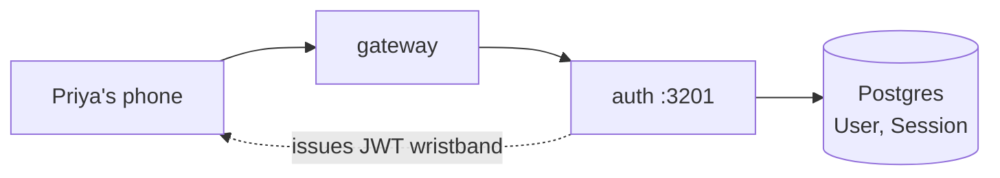

# auth

> The bouncer at the door — checks IDs, hands out wristbands, and remembers who is here.

## 1. The story (60 seconds)

Priya types her email and password, taps "Sign in", and a second later
she's on the Discover screen. Two weeks later her laptop is stolen; she
opens Miamo from a new phone, changes her password, and every old
session — including the one on the stolen laptop — stops working
immediately. Both of those moments are this service.

## 2. What this service is (in one picture)



## 3. What it can do (the menu)

| When Priya does this…              | …the app calls                         | …and gets back                          | Source |
|------------------------------------|----------------------------------------|-----------------------------------------|--------|
| Signs up                           | `POST /auth/signup`                    | `{accessToken, refreshToken, userId}`   | [src](services/auth/src/server.ts) |
| Logs in                            | `POST /auth/login`                     | same as above                           | [src](services/auth/src/server.ts) |
| Refreshes her session              | `POST /auth/refresh`                   | new `{accessToken}`                     | [src](services/auth/src/server.ts) |
| Changes password (revokes all)     | `POST /auth/password`                  | `{ok: true}` + all sessions deleted     | [src](services/auth/src/server.ts) |
| Logs out                           | `POST /auth/logout`                    | `204 No Content`                        | [src](services/auth/src/server.ts) |

## 4. The data it remembers

- **`User`** — one row per person. Holds email, bcrypt password hash, `emailVerified`, `deletedAt`.
- **`Session`** — one row per active login. Holds `refreshToken` hash, device info, `expiresAt`.

Schema lives in [services/shared/prisma/schema.prisma](services/shared/prisma/schema.prisma).

## 5. Who it talks to

- **Postgres** — its own `User` and `Session` tables only.
- Nobody else outbound. Auth is leaf.

## 6. The knobs (configuration)

| Env var                | What it does (plain English)                              | Example                             | What breaks if wrong                       |
|------------------------|-----------------------------------------------------------|-------------------------------------|--------------------------------------------|
| `DATABASE_URL`         | Where Postgres lives                                       | `postgresql://miamo:miamo@db:5432/miamo` | Service can't start                      |
| `JWT_SECRET`           | Signs the 15-min access wristband (JWT)                    | 32+ random bytes                    | Rotating it logs everyone out             |
| `JWT_REFRESH_SECRET`   | Signs the 30-day refresh wristband                         | 32+ random bytes                    | Same — invalidates refresh tokens         |
| `BCRYPT_COST`          | How slow to hash passwords (defaults to 12)                | `12`                                | Lower = brute-force easier; higher = login slow |
| `PORT`                 | Listen port                                                | `3201`                              | Gateway can't reach it                    |

## 7. A real example, end-to-end

Priya signs up.

> "Her phone POSTs her email + password to the gateway."
> ```bash
> curl -X POST http://localhost:3200/auth/signup \
>   -H 'content-type: application/json' \
>   -d '{"email":"priya@example.com","password":"trekL0ver!"}'
> ```
> "Gateway forwards to auth. Auth bcrypts the password, inserts a User row,
> issues a 15-min JWT and a 30-day refresh token."
> ```json
> {
>   "userId": "usr_priya",
>   "accessToken": "eyJhbGciOiJIUzI1NiIs…",   // 15 min
>   "refreshToken": "eyJhbGciOiJIUzI1NiIs…"   // 30 days
> }
> ```
> "Phone stores both as httpOnly cookies. Next request to any service
> carries the access token; gateway verifies it and forwards."

## 8. Run it on your laptop

```bash
docker compose up -d postgres
cd services/auth && npm install && npm run dev
```

## 9. How we know it works (tests)

- **`auth.test.ts`** — wrong password is rejected; right password returns a token; expired access token returns 401; refresh issues a new access token; password change deletes all sessions.

## 10. If something breaks

| Symptom                                  | First check                                    |
|------------------------------------------|------------------------------------------------|
| Every login returns 401                  | `JWT_SECRET` mismatch between auth and gateway |
| Signup hangs                             | bcrypt cost too high or DB unreachable         |
| Password change doesn't invalidate session| `Session` table delete failed — check logs    |

## 11. What changed and why it's better

- **Before:** one long-lived JWT (30d). A stolen cookie meant a month of risk.
- **After:** 15-min access + revocable 30-day refresh. Password change revokes everything.
- **Why Priya feels it:** if she changes her password, the stolen laptop is locked out instantly — not in 30 days.
