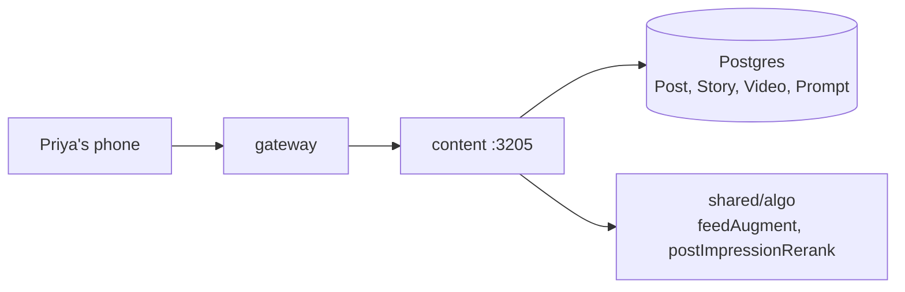

# content

> The "scroll while you wait for a match" surface — feed, stories, videos, creativity prompts.

## 1. The story (60 seconds)

Priya has swiped through her batch. She taps the Feed tab. A photo of
Arjun's latest hike appears at the top — not the newest post in the
system, but the one most relevant to her. She watches a 15-second
story of Meera cooking pasta. She taps a creativity prompt: "Two truths
and a lie about your weekend." All of those surfaces are this service.

## 2. What this service is (in one picture)



## 3. What it can do (the menu)

| When Priya does this…              | …the app calls                             | …and gets back                | Source |
|------------------------------------|--------------------------------------------|-------------------------------|--------|
| Opens Feed                         | `GET /content/feed?cursor=`                | 20 posts + nextCursor          | [src](services/content/src/server.ts) |
| Posts something                    | `POST /content/posts`                      | `{id, createdAt}`              | [src](services/content/src/server.ts) |
| Lists Stories                      | `GET /content/stories`                     | array of active stories         | [src](services/content/src/server.ts) |
| Views Videos                       | `GET /content/videos?cursor=`              | array of short videos           | [src](services/content/src/server.ts) |
| Answers creativity prompt          | `POST /content/prompts/{id}/answer`        | `{id}`                          | [src](services/content/src/server.ts) |

## 4. The data it remembers

- **`Post`** — text/photo posts.
- **`Story`** — 24h photo stories (auto-expire).
- **`Video`** — short video metadata + URLs.
- **`CreativityPrompt`**, **`PromptAnswer`** — daily prompts and answers.

## 5. Who it talks to

- **shared/algo** — `feedAugment` (re-rank feed), `postImpressionRerank` (penalise ignored authors).
- **Postgres** — its own tables.

## 6. The knobs (configuration)

| Env var                              | What it does                                   | Example | What breaks                            |
|--------------------------------------|------------------------------------------------|---------|----------------------------------------|
| `DATABASE_URL`                        | Postgres                                       | …       | service won't start                     |
| `ALGO_V4_RANK_ENABLED_FEED`           | If `'1'`, feed re-ranked; else chronological   | `'1'`   | feed falls back to newest-first         |
| `PORT`                                | Listen port                                    | `3205`  | gateway can't reach                     |

## 7. A real example, end-to-end

> ```bash
> curl -H 'authorization: Bearer eyJ…' \
>   'http://localhost:3200/content/feed?cursor=0&limit=20'
> ```
> "Content fetches ~200 recent posts from people Priya follows, asks
> feedAugment to re-rank, returns the top 20."
> ```json
> {
>   "items": [
>     { "id":"p_1", "author":"usr_arjun", "text":"…trek...", "imageUrl":"…" }
>   ],
>   "nextCursor": "p_1"
> }
> ```

## 8. Run it on your laptop

```bash
docker compose up -d postgres
cd services/content && npm install && npm run dev
```

## 9. How we know it works (tests)

- **`feed.test.ts`** — pagination cursor is stable; blocked authors filtered.
- **`stories.test.ts`** — expired (>24h) stories never returned.
- **`prompts.test.ts`** — answer is rejected if prompt expired.

## 10. If something breaks

| Symptom                            | First check                                  |
|------------------------------------|----------------------------------------------|
| Feed shows the same order for all   | `ALGO_V4_RANK_ENABLED_FEED='0'`              |
| Stories never expire                 | cron/cleanup job for `Story.expiresAt`       |
| Video URLs broken                    | upstream CDN config                          |

## 11. What changed and why it's better

- **Before:** feed was `ORDER BY createdAt DESC`. Active authors crowded out the people Priya cared about.
- **After:** `feedAugment` re-ranks by `affinity + recency + engagement + diversity`.
- **Why Priya feels it:** the posts she actually wants to see are near the top, even if they're 6h old.
