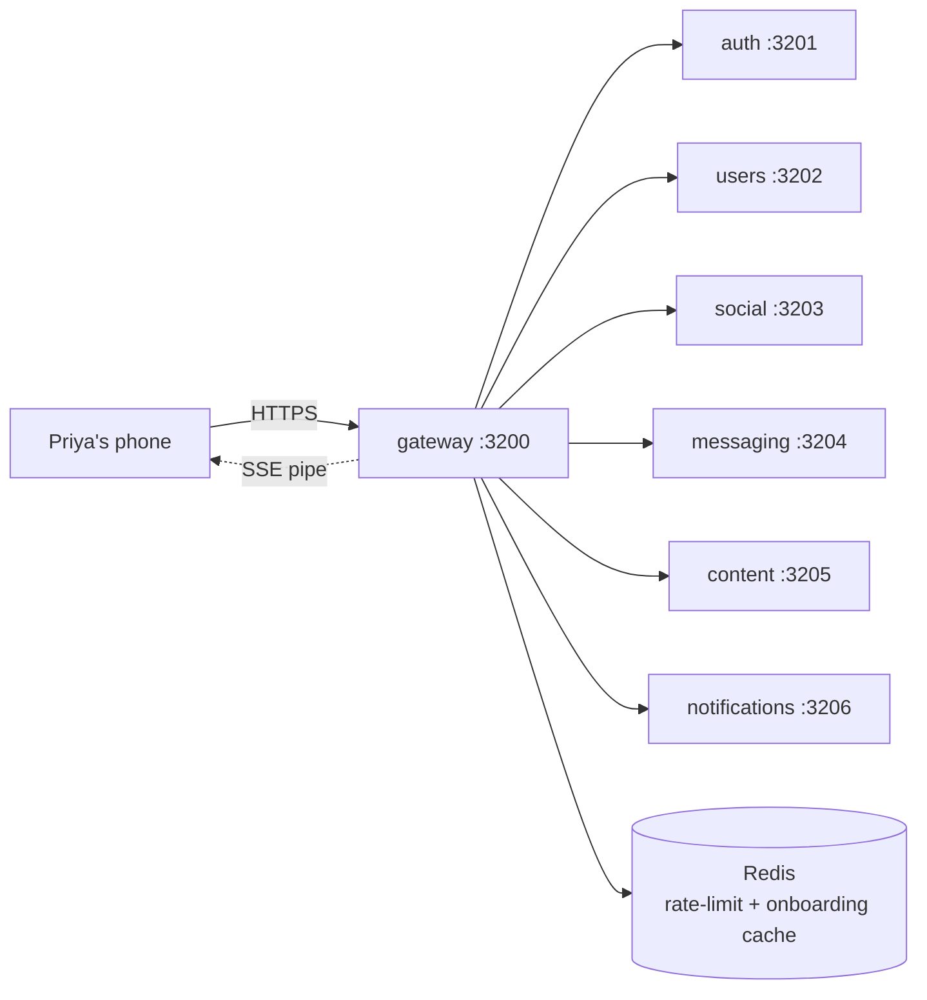

# gateway

> The single front door. Everything Priya's phone sends goes through here first.

## 1. The story (60 seconds)

Priya's phone never talks directly to `auth`, `social`, `messaging`, or
any other internal service. It only talks to `gateway`. Gateway checks
her wristband (JWT), makes sure she's not hammering us (rate-limit),
makes sure she's done onboarding before letting her into Discover,
forwards her request to the right service, and keeps an SSE pipe open
so live updates can stream back. One door. One firewall. One audit log.

## 2. What this service is (in one picture)



## 3. What it can do (the menu)

| When Priya does this…                  | …the gateway does                                  | Source |
|----------------------------------------|----------------------------------------------------|--------|
| Any `/auth/*` call                     | forward to `auth`, no JWT required                  | [src](services/gateway/src/server.ts) |
| Any other `/svc/*` call                | check JWT, onboarding gate, rate-limit, then forward | [src](services/gateway/src/server.ts) |
| Opens `/events/sse`                    | keep connection open; route per-user events down it | [src](services/gateway/src/server.ts) |
| (Internal) `POST /internal/sse/publish`| push event to user's open SSE connection            | [src](services/gateway/src/server.ts) |

## 4. The data it remembers

Nothing in Postgres. Two stateful caches in Redis:

- **Rate-limit counters** — `rl:{ip|user}:{route}` with 60s TTL.
- **Onboarding cache** — `cache:onboard:{userId}` with 60s TTL (so we don't hammer `users` on every page load).

## 5. Who it talks to

- **Every backend service** (proxy).
- **Redis** (rate-limit, cache).
- **users** (to check onboarding-complete, once every 60s per user).

## 6. The knobs (configuration)

| Env var                  | What it does                                       | Example                 | What breaks                                |
|--------------------------|----------------------------------------------------|-------------------------|--------------------------------------------|
| `JWT_SECRET`             | Verifies user wristbands                            | (matches auth's)        | every authed request returns 401            |
| `INTERNAL_SERVICE_KEY`   | Stamps internal calls to backends                   | random 32 bytes         | backends reject our calls                    |
| `REDIS_URL`              | Rate-limit + cache store                            | `redis://redis:6379`    | rate-limit fails open (configurable)         |
| `RATE_LIMIT_PER_IP`      | Cap per IP per route per minute                     | `60`                    | too low = real users 429; too high = no protection |
| `RATE_LIMIT_PER_USER`    | Cap per user per route per minute                   | `30`                    | same                                         |
| `AUTH_URL`, `USERS_URL`, `SOCIAL_URL`, `MSG_URL`, `CONTENT_URL`, `NOTIF_URL` | Upstream service URLs | `http://auth:3201` | requests time out                |
| `PORT`                   | Listen port                                         | `3200`                  | phone can't reach                            |

## 7. A real example, end-to-end

Priya likes Arjun.

> "Phone hits the gateway."
> ```bash
> curl -X POST http://localhost:3200/social/like \
>   -H 'authorization: Bearer eyJ…' \
>   -d '{"targetId":"usr_arjun"}'
> ```
> Gateway pipeline, in order:
> 1. Rate-limit check (Redis INCR + EXPIRE). 60 req/min per IP, 30/min per user on writes. If exceeded → `429`.
> 2. JWT verify (HS256 with `JWT_SECRET`). If invalid → `401`.
> 3. Onboarding gate. If `cache:onboard:usr_priya` says incomplete → `403 onboarding_required`.
> 4. Forward to `http://social:3203/like` with `X-User-Id` and `X-Internal-Key` headers.
> 5. Return the response body unchanged.
>
> Total gateway overhead: **~5ms p95**.

## 8. Run it on your laptop

```bash
docker compose up -d redis auth users social messaging content notifications
cd services/gateway && npm install && npm run dev
```

## 9. How we know it works (tests)

- **`auth.test.ts`** — missing JWT → 401; expired JWT → 401; valid → forwarded.
- **`rate-limit.test.ts`** — 31st write in 60s → 429.
- **`onboarding.test.ts`** — unboarded user blocked from `/social/*`.
- **`sse.test.ts`** — internal publish reaches the right connection.

## 10. If something breaks

| Symptom                                  | First check                                          |
|------------------------------------------|------------------------------------------------------|
| All requests 502                          | one or more upstream URLs wrong/unreachable          |
| All requests 401 after deploy             | `JWT_SECRET` mismatch between auth and gateway       |
| Users randomly 429                        | rate-limit thresholds too tight                      |
| Live updates stop showing                 | SSE heartbeat dropped — check 25s keep-alive         |

## 11. What changed and why it's better

- **Before:** the phone called each service directly. Adding rate-limit or auth meant changing every service.
- **After:** one door, one place for rate-limit, JWT, onboarding gate, and SSE fan-out.
- **Why Priya feels it:** consistent behaviour across the app. When we add a new safety check, it lights up everywhere at once — no service is "the one we forgot".
