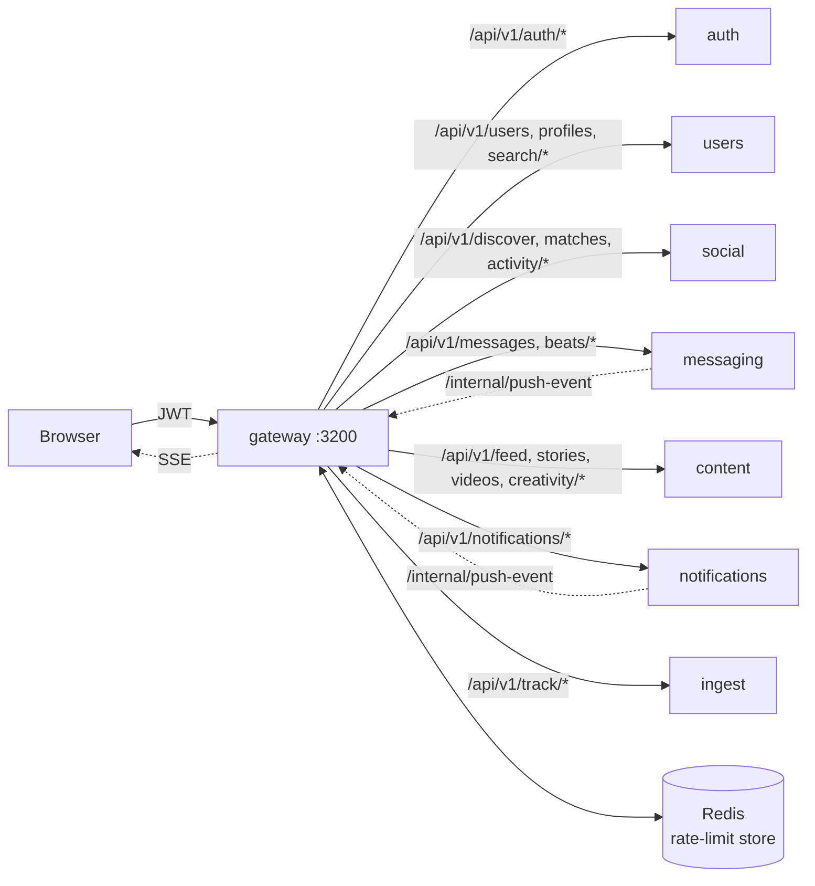

# gateway

## 1. Purpose

The single ingress for the browser. Verifies JWTs, enforces onboarding gates, rate-limits, sanitises headers, proxies to domain services, fans out Server-Sent Events to connected clients, and exposes aggregate health.

## 2. Mental model



Stateless and proxy-only — owns no Prisma model. The SSE registry is the only in-process state (per-user → connection map, 10 conn / user, multi-tab).

## 3. Public surface

| Method | Path | Auth | Purpose | Source |
|---|---|---|---|---|
| GET | `/healthz` | none | Liveness | [server.ts](src/server.ts#L314) |
| GET | `/readyz` | none | Aggregate downstream ready | [server.ts](src/server.ts#L319) |
| GET | `/health` | none | Full report incl. each service | [server.ts](src/server.ts#L334) |
| GET | `/api/v1/events/stream` | bearer (JWT via header or `?token=`) | SSE stream, 25 s heartbeat | [server.ts](src/server.ts#L357) |
| POST | `/internal/push-event` | `x-internal-key` | Fan-out to SSE subscribers of a user | [server.ts](src/server.ts#L419) |
| POST | `/api/v1/activity/track` | bearer | Forward to social `/activity/track` | [server.ts](src/server.ts#L428) |
| PROXY | `/api/v1/auth/**` | mixed | → auth | [server.ts](src/server.ts#L492) |
| PROXY | `/api/v1/track/**` | none (rate-limited) | → ingest (pathRewrite `/v1/track`) | [server.ts](src/server.ts#L487) |
| PROXY | `/api/v1/users/**`, `/profiles/**`, `/search/**`, `/bookmarks/**`, `/user-data/**`, `/settings/**` | bearer | → users | [server.ts](src/server.ts#L495) |
| PROXY | `/api/v1/discover/**`, `/matches/**`, `/activity/**`, `/safety/**`, `/vibe-check/**`, `/ai-match/**` | bearer + onboarded | → social | [server.ts](src/server.ts#L503) |
| PROXY | `/api/v1/messages/**`, `/beats/**` | bearer + onboarded | → messaging | [server.ts](src/server.ts#L512) |
| PROXY | `/api/v1/feed/**`, `/stories/**`, `/videos/**`, `/creativity/**` | bearer | → content | [server.ts](src/server.ts#L516) |
| PROXY | `/api/v1/notifications/**` | bearer | → notifications | [server.ts](src/server.ts#L524) |

## 4. Data model

None. Reads no DB tables directly. Reads `Profile.completionScore` via a cached HTTP call to users.

## 5. Dependencies

| Talks to | Why | How |
|---|---|---|
| auth, users, social, messaging, content, notifications, ingest | proxy | HTTP |
| users | onboarding gate (cached 60 s) | HTTP |
| Redis | distributed rate-limit store; SSE coordination optional | `redis` v4 client |

## 6. Configuration

| Env | Default | Purpose |
|---|---|---|
| `PORT` | `3200` | HTTP port |
| `REDIS_URL` | — | Distributed rate-limit store (memory fallback if absent) |
| `JWT_SECRET`, `JWT_REFRESH_SECRET`, `INTERNAL_SERVICE_KEY` | — | JWT verify + internal call auth |
| `AUTH_SERVICE_URL` | `http://localhost:3201` | Upstream |
| `USER_SERVICE_URL` | `http://localhost:3202` | Upstream |
| `SOCIAL_SERVICE_URL` | `http://localhost:3203` | Upstream |
| `MESSAGING_SERVICE_URL` | `http://localhost:3204` | Upstream |
| `CONTENT_SERVICE_URL` | `http://localhost:3205` | Upstream |
| `NOTIFICATION_SERVICE_URL` | `http://localhost:3206` | Upstream |
| `INGEST_SERVICE_URL` | `http://localhost:3260` | Upstream |
| `ALLOWED_ORIGINS`, `FRONTEND_URL` | `http://localhost:3100` | CORS allowlist |
| `CORS_BYPASS` | `false` | Dev-only any-origin |
| `TRACKING_KILL` | `0` | Block `/v1/track` proxy |
| `NODE_ENV` | `production` | Dev mode enables CORS_BYPASS check |

## 7. Worked example — a Discover request

```
Browser:   GET /api/v1/discover  Authorization: Bearer eyJ...
Gateway:   sanitizeHeaders → JWT regex pre-check → jwt.verify(HS256)
           rate-limit (discover: 20/min) via Redis
           extractUserId → req.headers['x-user-id'] = '<uid>'
           extractUserId → req.headers['x-internal-key'] = '<INTERNAL_SERVICE_KEY>'
           requireOnboarded → GET users /api/v1/profiles/me/completion (60s cache hit)
           proxy → http://social:3203/api/v1/discover
Social:    returns ranked candidates
Gateway:   strips x-internal-key from response; gzip; back to browser
```

## 8. Local dev

```bash
cd services/gateway
npm run dev      # tsx watch src/server.ts → :3200
curl :3200/health
```

## 9. Tests

None at the gateway level. Smoke via `bash scripts/api-test.sh <TOKEN>`.

## 10. Failure modes & operational notes

- **Auth header > 2 KB** → rejected before `jwt.verify` (protection against header-bomb attacks).
- **Redis down** → rate-limit falls back to in-memory (per-pod). Distributed limits become per-pod limits.
- **Downstream slow** → proxy timeouts surface as `504`. Check `/health` for the slow downstream.
- **SSE connection limit** = 10 per user. Excess connections are rejected; the SDK retries.
- **CSP** is strict (`defaultSrc: ["'self'"]`, `base-uri: ['none']`). Any new inline script will be blocked.

## 11. What changed & why it's good

- **Before:** Each service handled its own auth, CORS, and rate-limit. Auth bugs needed N deploys.
- **After:** One gateway owns auth, CORS, rate-limit, sanitisation, SSE, and the onboarding gate. Domain services trust a single `x-user-id` header.
- **Why it matters:** Security policy lives in one file; downstream services have no JWT code. Rolling a new rate limit is a one-service deploy.
