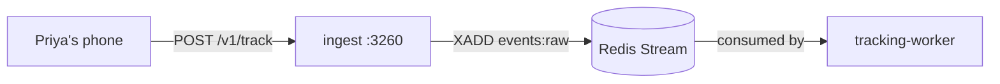

# ingest

> The mail slot for tracking events. Phones drop JSON in; we promise a 204 in under 15ms and worry about processing later.

## 1. The story (60 seconds)

Priya's phone fires 8 small events as she scrolls Discover for 30
seconds. Each one is `POST /v1/track`. Each one takes the phone less
than 15ms round-trip. Her swipes never wait for tracking to ACK. The
events queue on a Redis Stream, and the `tracking-worker` picks them
up at its own pace.

## 2. What this service is (in one picture)



## 3. What it can do (the menu)

| When Priya's phone does this…   | …the app calls         | …and gets back  | Source |
|---------------------------------|------------------------|-----------------|--------|
| Fires a tracking event          | `POST /v1/track`       | `204 No Content`| [src](services/ingest/src/server.ts) |
| Fires a batch of events         | `POST /v1/track/batch` | `204`            | [src](services/ingest/src/server.ts) |
| Health check                    | `GET /healthz`         | `200 {ok:true}`  | [src](services/ingest/src/server.ts) |

## 4. The data it remembers

**None.** Stateless service. The only state is the Redis Stream
`events:raw` which it appends to, never reads.

## 5. Who it talks to

- **Redis** (XADD only).

## 6. The knobs (configuration)

| Env var                  | What it does                                  | Example                | What breaks                              |
|--------------------------|-----------------------------------------------|------------------------|------------------------------------------|
| `REDIS_URL`              | Where events go                                | `redis://redis:6379`   | every request 500s                        |
| `TRACKING_HASH_SECRET`   | HMAC key for userHash                          | 32+ bytes              | **rotation breaks all historical joins**  |
| `STREAM_NAME`            | Defaults to `events:raw`                       | `events:raw`           | worker reads wrong stream                 |
| `STREAM_MAXLEN`          | Approximate cap on stream length               | `100000`               | Redis OOM if too high; data loss if too low |
| `PORT`                   | Listen port                                    | `3260`                 | phone can't reach                         |

## 7. A real example, end-to-end

> ```bash
> curl -X POST http://localhost:3260/v1/track \
>   -H 'content-type: application/json' \
>   -d '{
>     "event":"impression",
>     "target":"usr_arjun",
>     "context":{"screen":"discover","position":2},
>     "ts":1748376151000,
>     "sessionId":"s_4xz",
>     "hmac":"a8f1c2d4e6…"
>   }'
> # ← 204 No Content in ~3ms
> ```
> Inspect the stream:
> ```bash
> redis-cli XLEN events:raw
> redis-cli XRANGE events:raw - + COUNT 1
> ```

## 8. Run it on your laptop

```bash
docker compose up -d redis
cd services/ingest && npm install && npm run dev
```

## 9. How we know it works (tests)

- **`validation.test.ts`** — malformed JSON → 400.
- **`hmac.test.ts`** — invalid HMAC → 401.
- **`enqueue.test.ts`** — valid event lands on `events:raw` with userHash stamped.
- **`latency.test.ts`** — p99 < 15ms under 1k req/s synthetic load.

## 10. If something breaks

| Symptom                              | First check                                  |
|--------------------------------------|----------------------------------------------|
| Every request 500                     | Redis unreachable                            |
| Every request 401                     | `TRACKING_HASH_SECRET` mismatch with phone   |
| Stream growing unbounded              | tracking-worker dead (see its README)         |

## 11. What changed and why it's better

- **Before:** tracking events went to the same Postgres-backed service as everything else. Under load, writes timed out and we lost events.
- **After:** dedicated stateless edge service writes only to a durable Redis Stream in <15ms. Zero event loss on restarts.
- **Why Priya feels it:** her taps never freeze waiting for tracking. Even during traffic spikes, the UI stays responsive.
