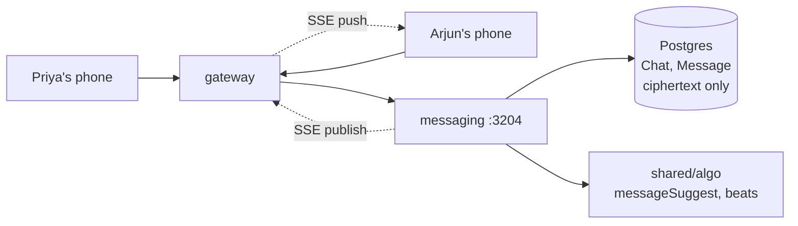

# messaging

> Private encrypted chats — what Priya and Arjun actually say to each other.

## 1. The story (60 seconds)

Priya and Arjun match. The chat opens with a friendly suggested
opener: "Hampta Pass — was the river crossing scary?". She edits it,
adds a laughing emoji, sends. Two hundred milliseconds later Arjun's
phone (which had the chat tab open) shows the message. By message 20,
the app quietly shows them a "vibe match" badge — their reply tempos
have aligned.

## 2. What this service is (in one picture)



## 3. What it can do (the menu)

| When Priya does this…                  | …the app calls                               | …and gets back                  | Source |
|----------------------------------------|----------------------------------------------|---------------------------------|--------|
| Lists her chats                        | `GET /messaging/chats`                       | array of chat summaries          | [src](services/messaging/src/server.ts) |
| Opens a chat                           | `GET /messaging/chats/{id}/messages?cursor=` | last 50 decrypted messages       | [src](services/messaging/src/server.ts) |
| Gets an opener suggestion              | `GET /messaging/chats/{id}/suggest`          | `{text: "Hampta Pass — was…"}`   | [src](services/messaging/src/server.ts) |
| Sends a message                        | `POST /messaging/chats/{id}/messages`        | `{id, sentAt}`                   | [src](services/messaging/src/server.ts) |
| Sees vibe-match badge                  | `GET /messaging/chats/{id}/beats`            | `{vibeMatch: true}`              | [src](services/messaging/src/server.ts) |

## 4. The data it remembers

- **`Chat`** — one row per pair (created when they match).
- **`Message`** — one row per message: `{chatId, senderId, iv, ciphertext, authTag, createdAt}`. **Plaintext is never stored.**

## 5. Who it talks to

- **Postgres** — its own tables.
- **shared/algo** — `messageSuggest` (opener), `beats` (vibe).
- **gateway** — pushes live updates via internal SSE publish endpoint.

## 6. The knobs (configuration)

| Env var                                  | What it does                                       | Example     | What breaks                                |
|------------------------------------------|----------------------------------------------------|-------------|--------------------------------------------|
| `DATABASE_URL`                            | Postgres                                           | …           | service won't start                         |
| `ENCRYPTION_KEY`                          | Master key for AES-256-GCM                         | 32+ bytes   | **Rotation breaks every old message**       |
| `ENCRYPTION_SALT`                         | Salt for scrypt key derivation                     | random      | **Rotation breaks every old message**       |
| `INTERNAL_SERVICE_KEY`                    | Verifies social's internal calls                   | …           | new chats can't be created                  |
| `ALGO_V4_RANK_ENABLED_MESSAGING`          | Enables opener suggestion endpoint                  | `'1'`       | suggest endpoint returns empty               |
| `ALGO_V4_RANK_ENABLED_BEATS`              | Enables vibe-match badge                            | `'1'`       | badge never shows                            |
| `PORT`                                    | Listen port                                         | `3204`      | gateway can't reach                          |

## 7. A real example, end-to-end

Priya sends a message.

> ```bash
> curl -X POST http://localhost:3200/messaging/chats/cht_abc123/messages \
>   -H 'authorization: Bearer eyJ…' \
>   -H 'content-type: application/json' \
>   -d '{"text":"Hey, where was that trek photo taken?"}'
> ```
> "Messaging generates a fresh 12-byte IV, encrypts the text with
> AES-256-GCM, stores `{iv, ciphertext, authTag}`, publishes an SSE
> event so Arjun's open tab updates."
> ```json
> { "id": "msg_x1y2", "sentAt": "2026-05-27T15:34:22Z" }
> ```

## 8. Run it on your laptop

```bash
docker compose up -d postgres
cd services/messaging && npm install && npm run dev
```

## 9. How we know it works (tests)

- **`crypto.test.ts`** — encrypt then decrypt round-trips; tampered ciphertext fails auth tag verification.
- **`messages.test.ts`** — message persisted, pagination by cursor works, can't read another user's chat.
- **`suggest.test.ts`** — produces a non-empty opener when profile has interests.

## 10. If something breaks

| Symptom                                  | First check                                      |
|------------------------------------------|--------------------------------------------------|
| Messages decode to garbage                | `ENCRYPTION_KEY` / `ENCRYPTION_SALT` rotated?    |
| Messages save but Arjun doesn't see them  | SSE pipe to gateway broken — check logs          |
| Suggest endpoint always returns empty     | `ALGO_V4_RANK_ENABLED_MESSAGING='0'`              |

## 11. What changed and why it's better

- **Before:** messages stored as plaintext. Any DB read could leak chats.
- **After:** AES-256-GCM with per-message IV and auth tag. Even our DBAs cannot read.
- **Why Priya feels it:** she can have hard, honest conversations knowing they are private — full stop.
