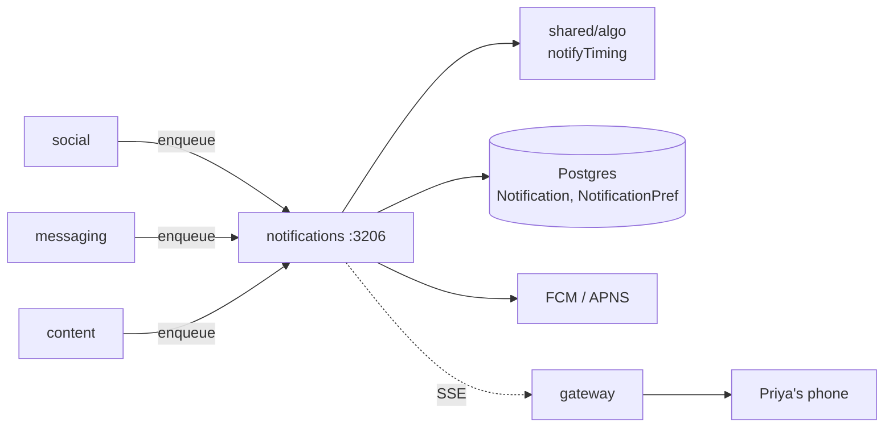

# notifications

> The bell with the badge. The reason Priya opens the app at 8:15am instead of forgetting it for a week.

## 1. The story (60 seconds)

It's 8:14am Tuesday. Priya's `notifyTiming` histogram says she opens
the app between 8 and 9 on Tuesdays. At 8:15 her phone buzzes:
*"Arjun replied to your message."* She taps, the chat opens, she
replies before her coffee is ready. At midnight while she sleeps,
nothing buzzes. That's this service doing its job.

## 2. What this service is (in one picture)



## 3. What it can do (the menu)

| When Priya does this…                       | …the app calls                          | …and gets back                    | Source |
|---------------------------------------------|-----------------------------------------|-----------------------------------|--------|
| Opens the bell                              | `GET /notifications`                    | last 50 notifications              | [src](services/notifications/src/server.ts) |
| Checks unread count (poll when tab hidden)  | `GET /notifications/unread/count`       | `{count: 3}`                       | [src](services/notifications/src/server.ts) |
| Marks all read                              | `POST /notifications/read-all`          | `204`                              | [src](services/notifications/src/server.ts) |
| Edits notification prefs                    | `PUT /notifications/prefs`              | updated prefs                      | [src](services/notifications/src/server.ts) |
| (Internal) social enqueues a "match" notif  | `POST /internal/notifications/enqueue`  | `{id, scheduledFor}`               | [src](services/notifications/src/server.ts) |

## 4. The data it remembers

- **`Notification`** — `{userId, type, payload, scheduledFor, deliveredAt, readAt, nextNotifyAt}`.
- **`NotificationPref`** — per-user channel prefs (push on/off, types muted).

## 5. Who it talks to

- **shared/algo** — `notifyTiming` picks the delivery minute.
- **gateway** — SSE publish for live bell-badge updates.
- **FCM / APNS** — push to phones.

## 6. The knobs (configuration)

| Env var                                          | What it does                                  | Example | What breaks                       |
|--------------------------------------------------|-----------------------------------------------|---------|-----------------------------------|
| `DATABASE_URL`                                    | Postgres                                      | …       | service won't start                |
| `INTERNAL_SERVICE_KEY`                            | Verifies social/msg internal enqueues         | …       | enqueue returns 403                |
| `ALGO_V4_RANK_ENABLED_NOTIFICATIONS`              | If `'1'`, use notifyTiming; else send ASAP    | `'1'`   | nudges arrive at random hours      |
| `FCM_SERVER_KEY` / `APNS_KEY`                     | Push provider credentials                     | …       | pushes silently dropped            |
| `PORT`                                            | Listen port                                   | `3206`  | gateway can't reach                |

## 7. A real example, end-to-end

Social tells notifications "Arjun got a match from Priya".

> ```bash
> # internal call, requires X-Internal-Key
> curl -X POST http://notifications:3206/internal/notifications/enqueue \
>   -H 'x-internal-key: $INTERNAL_SERVICE_KEY' \
>   -d '{"userId":"usr_arjun","type":"match","payload":{"from":"Priya"}}'
> ```
> "Notifications inserts a row, asks notifyTiming for the best minute,
> sets `scheduledFor=2026-05-27T08:15:00Z`. A worker scans every 60s
> and delivers ready rows."
> ```json
> { "id":"n_77", "scheduledFor":"2026-05-27T08:15:00Z" }
> ```

## 8. Run it on your laptop

```bash
docker compose up -d postgres
cd services/notifications && npm install && npm run dev
```

## 9. How we know it works (tests)

- **`enqueue.test.ts`** — without internal key returns 403; with key, row inserted.
- **`timing.test.ts`** — scheduledFor is within the next 24h.
- **`prefs.test.ts`** — muted type is never delivered.

## 10. If something breaks

| Symptom                              | First check                                |
|--------------------------------------|--------------------------------------------|
| No notifications arriving             | worker scanning? `kubectl logs -l app=notifications` |
| Notifications at 3am                  | `ALGO_V4_RANK_ENABLED_NOTIFICATIONS='0'`   |
| Push delivered but no in-app row      | DB insert failed — check Postgres logs     |

## 11. What changed and why it's better

- **Before:** every match/message sent a push immediately. Notifications at midnight. Users muted us.
- **After:** `notifyTiming` schedules to the user's most-likely-open minute, falls back to silence if no good slot.
- **Why Priya feels it:** her phone buzzes when she's about to look at it, not when she's sleeping.
