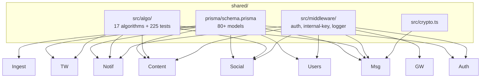

# shared

> Not a service. A library. The Prisma schema for the whole product, the 17 ranking algorithms, the middleware everyone reuses.

## 1. The story (60 seconds)

When `social` needs to know how to rank Arjun for Priya, it imports
`forYou` from here. When `messaging` needs to encrypt a chat, it
imports the crypto helper from here. When *any* service needs to query
the database, it uses the same Prisma client generated from the
schema that lives here. One source of truth, used by everyone.

## 2. What this library is (in one picture)



## 3. What's inside (the menu)

| Path                                     | What it is                                                |
|------------------------------------------|-----------------------------------------------------------|
| `prisma/schema.prisma`                    | The whole DB schema — 80+ models                          |
| `prisma/seed.ts`                          | Demo users, posts, matches for local dev                  |
| `src/algo/`                               | 17 algorithms (see [docs/ALGORITHMS.md](docs/ALGORITHMS.md)) |
| `src/algo/__tests__/`                     | 225 unit tests, run in ~1.2s                              |
| `src/middleware/internalAuth.ts`          | Verifies `X-Internal-Key`                                  |
| `src/middleware/jwt.ts`                   | Verifies JWT for backend services                          |
| `src/logger.ts`                           | Central logger with secret redaction                      |
| `src/audit.ts`                            | Append-only audit log helper                              |
| `src/cache.ts`                            | Redis cache helpers                                       |
| `src/ml-engine.ts`                        | Optional ML enrichment                                    |
| `src/activity-analyzer.ts`                | Aggregation helpers for `tracking-worker`                 |
| `src/algorithms.ts`                       | Legacy algos wrapper (kept for compatibility)             |

## 4. The data it owns (the whole schema)

All 80+ models live in `prisma/schema.prisma`. Highlights:

- **`User`, `Profile`, `Session`, `Setting`** — auth + users
- **`Like`, `Pass`, `Match`, `Chat`, `Message`, `DailyMatch`** — social + messaging
- **`Post`, `Story`, `Video`, `CreativityPrompt`, `PromptAnswer`** — content
- **`Notification`, `NotificationPref`** — notifications
- **`UserActivity15m`, `CandidateInteraction15m`, `CompatScore`, `ProfileEmbedding`** — tracking-worker feature tables

## 5. Who uses it

**Every other service.** That's the point.

## 6. The knobs (configuration)

This library reads no env vars directly; the services that consume it
provide their own. The library defines the **shape** that services
configure.

## 7. A real example

A service consumes `forYou`:

```ts
import { forYou } from '@miamo/shared/algo/forYou';
import { SignalReader } from '@miamo/shared/algo/signals';

const reader = new SignalReader(prisma);
const viewer = await reader.read(priyaId);
const candidates = await reader.readMany(candidateIds);

const scored = candidates.map(c => ({
  candidate: c,
  score: forYou(viewer, c)
})).sort((a, b) => b.score - a.score);

return scored.slice(0, 10);
```

## 8. Run the tests

```bash
cd services/shared
npm install
npm test          # 225 tests, ~1.2s
```

## 9. How we know it works

- **`__tests__/forYou.test.ts`** — score in [0,1], monotonic in each input.
- **`__tests__/aiPicks.test.ts`** — only returns a pick when threshold met.
- **`__tests__/hash.test.ts`** — `userHash` deterministic and one-way.
- **`__tests__/lru.test.ts`** — cache eviction order.
- (…225 in total across 17 algo files + helpers)

## 10. If something breaks

| Symptom                              | First check                                       |
|--------------------------------------|---------------------------------------------------|
| Build error "Prisma client outdated"  | `npx prisma generate` after schema change         |
| Algo returns NaN                      | a signal was `null` — verify SignalReader query   |
| Migration conflict                    | two devs added a migration with the same date    |

## 11. What changed and why it's better

- **Before:** every service had its own Prisma client and re-implemented common middleware. Schema drift was a real problem.
- **After:** one schema, one Prisma client, one set of algorithms, one logger. All consumed via TypeScript imports — type safety across services.
- **Why Priya feels it:** consistent behaviour. A rule (like "blocked users never appear in any list") only needs to be implemented once and applies everywhere.
