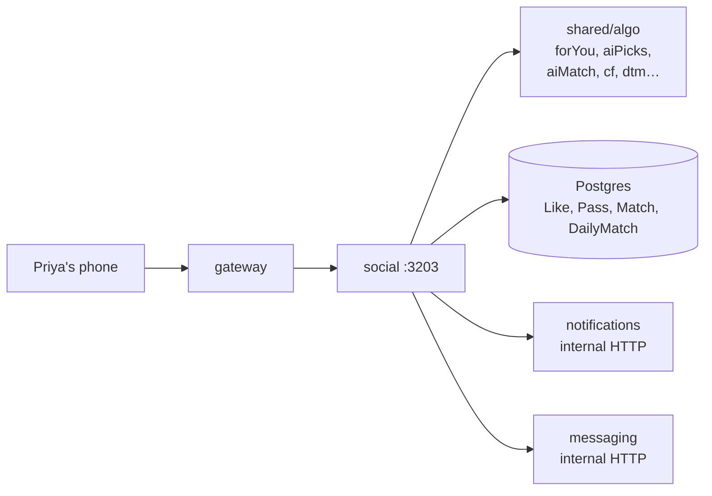

# social

> The heart of dating — who shows up in Discover, who matches with whom, who pairs up for AI Match.

## 1. The story (60 seconds)

Priya opens Discover. She sees Arjun's smiling trek photo. She swipes
right. The screen flashes "It's a match!" and a chat appears in her
Matches tab. Tomorrow morning the app shows her one curated AI Pick:
Meera, who shares 8 of her 10 interests. Every one of those moments is
this service.

## 2. What this service is (in one picture)



## 3. What it can do (the menu)

| When Priya does this…              | …the app calls                            | …and gets back                       | Source |
|------------------------------------|-------------------------------------------|--------------------------------------|--------|
| Loads Discover                     | `GET /social/discover?limit=10`           | array of ranked candidates           | [src](services/social/src/server.ts) |
| Likes Arjun                        | `POST /social/like` `{targetId}`          | `{matched: true, chatId}` if mutual  | [src](services/social/src/server.ts) |
| Passes on Rohan                    | `POST /social/pass` `{targetId}`          | `204`                                | [src](services/social/src/server.ts) |
| Sees today's AI Pick               | `GET /social/ai-picks/today`              | `{userId, score, reason}`            | [src](services/social/src/server.ts) |
| Sees AI Match suggestions          | `GET /social/ai-match`                    | array of symmetric matches           | [src](services/social/src/server.ts) |
| Runs vibe-check (chat-style intro) | `POST /social/vibe-check`                 | `{compatibility: 0.78}`              | [src](services/social/src/server.ts) |

## 4. The data it remembers

- **`Like`** — one row per (viewer → target) like.
- **`Pass`** — one row per (viewer → target) pass.
- **`Match`** — one row per mutual-like pair.
- **`DailyMatch`** — overnight-computed daily pick per user.

## 5. Who it talks to

- **shared/algo** for ranking (`forYou`, `aiPicks`, `aiMatch`, `cf`, `dtm`, `new`, `active`, `verified`, `serious`, `moves`).
- **messaging** — on match, opens a chat room (internal HTTP).
- **notifications** — on match, enqueues "you have a new match" for Arjun.
- **Postgres** — its own tables + read-only access to `User`/`Profile`.

## 6. The knobs (configuration)

| Env var                                    | What it does                                          | Example | What breaks                              |
|--------------------------------------------|-------------------------------------------------------|---------|------------------------------------------|
| `DATABASE_URL`                              | Postgres                                              | …       | service won't start                       |
| `INTERNAL_SERVICE_KEY`                      | Verifies internal calls + used to call notif/msg      | …       | matches don't create chats / notifs       |
| `ALGO_V4_RANK_ENABLED_DISCOVER`             | If `'1'`, Discover uses v4 ranking; else chronological| `'1'`   | Discover ranking falls back               |
| `ALGO_V4_RANK_ENABLED_AIMATCH`              | If `'1'`, AI Match endpoint is live                   | `'0'`   | endpoint returns 404                      |
| `ALGO_V4_WORKERS_ENABLED`                   | Read-only flag — informs which features are populated | `'1'`   | DTM-based picks may be empty               |
| `PORT`                                      | Listen port                                           | `3203`  | gateway can't reach                       |

## 7. A real example, end-to-end

Priya likes Arjun (he already liked her).

> ```bash
> curl -X POST http://localhost:3200/social/like \
>   -H 'authorization: Bearer eyJ…' \
>   -H 'content-type: application/json' \
>   -d '{"targetId":"usr_arjun"}'
> ```
> "Social inserts the Like, finds Arjun's earlier Like, creates a Match
> and a Chat, fires a notification to Arjun, returns the chatId."
> ```json
> { "matched": true, "chatId": "cht_abc123", "matchedAt": "2026-05-27T15:32:11Z" }
> ```

## 8. Run it on your laptop

```bash
docker compose up -d postgres messaging notifications
cd services/social && npm install && npm run dev
```

## 9. How we know it works (tests)

- **`discover.test.ts`** — returns N candidates, never includes self, never includes blocked users.
- **`like.test.ts`** — non-mutual like returns `matched:false`; mutual returns `matched:true` with chatId.
- **`ai-picks.test.ts`** — returns at most one pick per user per day.
- **`vibe-check.test.ts`** — compatibility score is always in [0,1].

## 10. If something breaks

| Symptom                              | First check                                          |
|--------------------------------------|------------------------------------------------------|
| Discover returns 0 candidates         | filters too tight (age/distance) or DB has no users  |
| Match happens but no chat appears     | messaging unreachable — check internal HTTP logs     |
| AI Picks always empty                 | `ALGO_V4_WORKERS_ENABLED='0'` so DailyMatch is stale |

## 11. What changed and why it's better

- **Before:** Discover was `ORDER BY last_active DESC`. Everyone saw the same order.
- **After:** 17 algorithms in shared/algo, each behind a flag. Discover is personalised within 15 min of using the app.
- **Why Priya feels it:** the people she actually swipes right on start showing up at the top, fast.
