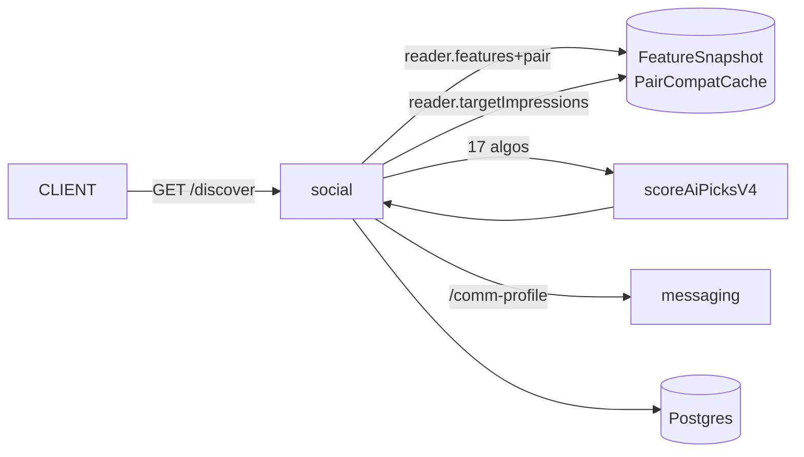

# social

## 1. Purpose

The matching engine: discover, likes/passes, matches, Miamo Moves, vibe checks, safety reports, and the daily AI Match endpoint. Largest service in the repo (~2300 LoC) and the heaviest consumer of the v4 algo system.

## 2. Mental model



On every read, social loads candidates, asks `SignalReader` for features and pair-compatibility, runs `scoreAiPicksV4`, applies `postImpressionPenalty`, and returns ranked candidates with `explain`. Writes the resulting impression event to the tracking pipeline via the browser SDK.

## 3. Public surface

| Method | Path | Purpose | Source |
|---|---|---|---|
| POST | `/api/v1/activity/track` | Forward activity from gateway | [server.ts](src/server.ts#L315) |
| GET | `/api/v1/activity/analysis` | Behavioural cluster, temporal pattern | [server.ts](src/server.ts#L327) |
| GET | `/api/v1/discover` | Ranked candidates (v4 when flag on) | [server.ts](src/server.ts#L358) |
| POST | `/api/v1/discover/:id/like` | Insert Like; create Match on mutual | server.ts |
| POST | `/api/v1/discover/:id/pass` | Insert pass | server.ts |
| POST | `/api/v1/discover/:id/comment` | Like/pass with note | server.ts |
| POST | `/api/v1/discover/:id/move` | Send Miamo Move (opener) | server.ts |
| GET | `/api/v1/matches`, `/incoming` | Active matches, incoming likes | server.ts |
| POST | `/api/v1/matches/:id/{favorite,pin,report}` | Match actions | server.ts |
| POST | `/api/v1/matches/incoming/:userId/match-back[-move]` | Reciprocate | server.ts |
| POST | `/api/v1/ai-match/suggestions` | Daily AI Match candidate(s); reads `reader.dailyMatch` | server.ts |
| POST | `/api/v1/vibe-check` | Save vibe (mood/energy/intent/topics) | server.ts |
| POST | `/api/v1/safety/report` | Report user | server.ts |
| GET | `/api/v1/discover/filters`, PUT | DiscoverFilter CRUD | server.ts |

## 4. Data model

Writes: `Like`, `Match`, `MatchRequest`, `MatchFeedback`, `UserActivity`, `VibeCheck`, `Report`, `Block`, `MiamoMove`, `DiscoverFilter`. Reads: `User`, `Profile`, `FeatureSnapshot`, `PairCompatCache`.

## 5. Dependencies

| Talks to | Why | How |
|---|---|---|
| Postgres | matches, likes, activity | Prisma |
| messaging | `GET /api/v1/messages/comm-profile/:userId`, `/sent-texts/:userId?limit=10` (for Move generation) | HTTP |
| `services/shared/src/algo/*` | 17 algos | in-process |
| `PrismaSignalReader` | feature + pair lookups | in-process |
| ML state cache | per-user bandit + LRU caches | in-process + UserData persistence |

## 6. Configuration

| Env | Default | Purpose |
|---|---|---|
| `PORT` | `3203` | HTTP port |
| `DATABASE_URL` | — | Postgres |
| `INTERNAL_SERVICE_KEY` | — | Internal-call auth |
| `MESSAGING_SERVICE_URL` | `http://localhost:3204` | Comm-profile lookup |
| `ALGO_V4_RANK_ENABLED_DISCOVER` | `0` | Switch discover to v4 ensemble |
| `ALGO_V4_RANK_ENABLED_AIMATCH` | `0` | Switch AI Match to v4 |
| `ALGO_V4_RANK_ENABLED_DEEPCOMPAT` | `0` | Use v4 dtm for compat surface |

## 7. Worked example — Discover with v4 enabled

```
1. Gateway → GET /api/v1/discover (x-user-id=<uid>)
2. Load my Profile + DiscoverFilter; query candidate pool (e.g. 60 users)
3. aHash = reader.hashOf(uid); cHashes = candidates.map(reader.hashOf)
4. me = reader.features(aHash); pairs = reader.pairCompat(aHash, cHashes)
   imp = reader.targetImpressions(aHash, cHashes, 7)
5. For each candidate c:
     inputs = { me, cand=reader.features(cHash), pair=pairs.get(cHash),
                intent, distance, age, interests, prior, impressions=imp.get(cHash) }
     sub = { forYou, cf, active, serious, affinity, vibe, explore }
     { score, explain } = scoreAiPicksV4({ ...inputs, sub })
     penalty = postImpressionPenalty(impressions, secsSinceLast)
     c._rank = max(0, score - penalty)
6. Sort by _rank desc; attach `explain` and `algo: 'v4'` tag; return 24 items
```

## 8. Local dev

```bash
cd services/social
npx prisma generate --schema=../shared/prisma/schema.prisma
npm run dev
# Toggle v4 locally
ALGO_V4_RANK_ENABLED_DISCOVER=1 npm run dev
```

## 9. Tests

Algo tests at the workspace root cover the 17 rankers ([tests/algo-e2e.test.ts](../../tests/algo-e2e.test.ts), `algo-discover-fatigue.test.ts`, `algo-feed-augment.test.ts`).

## 10. Failure modes & operational notes

- **SignalReader cold cache** → first request after deploy ~280 ms p50. Warms to ~120 ms in seconds.
- **DailyMatch not set** → `/ai-match` falls back to top of `scoreAiPicksV4`. No user-visible error.
- **Messaging unavailable** → Move generation uses neutral defaults (logs a warning, returns generic opener).
- **Bandit state out of sync** → loaded lazily from UserData. Worst case: cold start ranking.

## 11. What changed & why it's good

- **Before:** Discover ranker was a 600-line function that imported Prisma and emitted scores with no `explain`. A/B was a code branch and a deploy.
- **After:** Discover dispatches to `scoreAiPicksV4` behind a flag; the algo reads features through `SignalReader`; every score returns `explain`; a daily background worker pre-computes the top pick.
- **Why it matters:** Support can answer "why this card?" from a single response payload. Ramps are one env var. Tests run without a DB.
