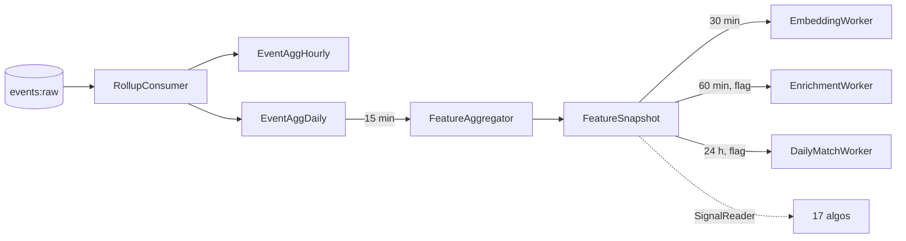

# tracking-worker

## 1. Purpose

The async backbone of the tracking pipeline. Consumes the Redis Stream `events:raw`, aggregates into `EventAggHourly`/`EventAggDaily`, materialises `FeatureSnapshot` every 15 min, refreshes embeddings every 30 min, and runs the v4 background workers (`EnrichmentWorker` 60 min, `DailyMatchWorker` 24 h). Exposes `/v4/status` for ops visibility.

## 2. Mental model



A single-replica HTTP server on `:3261` exposing only `/healthz` and `/v4/status`. Most work happens in tick loops.

## 3. Public surface

| Method | Path | Purpose | Source |
|---|---|---|---|
| GET | `/healthz` | `{ok, kill, v4Workers, algos:<count>}` | [index.ts](src/index.ts#L57) |
| GET | `/v4/status` | live algo inventory + flag values | [index.ts](src/index.ts#L59) |

## 4. Data model

Writes `EventAggHourly`, `EventAggDaily`, `FeatureSnapshot`, `Embeddings`, `PairCompatCache`, `CfNeighbourCache`, `UserActivity` (legacy compat). Reads everything via Prisma + raw SQL for hot paths.

## 5. Dependencies

| Talks to | Why | How |
|---|---|---|
| Redis | `XREADGROUP events:raw tw-rollup` | `ioredis` |
| Postgres | aggregates + snapshots | Prisma + raw SQL |
| All 17 algos | imported for side-effect registration (visible in `/v4/status`) | in-process |

## 6. Configuration

| Env | Default | Purpose |
|---|---|---|
| `PORT` | `3261` | HTTP port (health/status only) |
| `DATABASE_URL` | — | Postgres |
| `REDIS_URL` | — | Stream source |
| `TRACKING_HASH_SECRET` | — | Verify uidHash consistency (do NOT rotate) |
| `TRACKING_KILL` | `0` | Set `1` to stop **all** consumers/workers |
| `TRACKING_STREAM_KEY` | `events:raw` | Stream name |
| `HOSTNAME` | (pod name) | Consumer-group member name |
| `ALGO_V4_WORKERS_ENABLED` | `0` | Start EnrichmentWorker + DailyMatchWorker |

## 7. Source files

| File | Purpose |
|---|---|
| `src/index.ts` | Bootstrap, health server, worker orchestration |
| `src/rollup.ts` | Stream consumer + aggregate flush |
| `src/feature.ts` | EventAggDaily → FeatureSnapshot (15 min) |
| `src/compat.ts` | EventAggDaily → UserActivity (legacy) |
| `src/embeddings.ts` | Behavioural embedding writer (30 min) |
| `src/enrich.ts` | EnrichmentWorker (peak hours / cadence / DTM vec) |
| `src/daily-match.ts` | DailyMatchWorker (12 h tick after +60 s warm-up) |
| `src/cold-store.ts` | Archive old events (1 h) |
| `src/forget.ts` | CLI: purge by uidHash for GDPR |
| `src/__tests__/` | Vitest unit tests |

## 8. Cadence summary

| Worker | Cadence | Reads | Writes |
|---|---|---|---|
| RollupConsumer | continuous (block 1s, flush 30s or 10k events) | Redis Stream | EventAggHourly/Daily |
| FeatureAggregator | 15 min | EventAggDaily | FeatureSnapshot |
| CompatWriter | 15 min | EventAggDaily | UserActivity (legacy) |
| EmbeddingWorker | 30 min | FeatureSnapshot | Embeddings |
| EnrichmentWorker (flag) | 60 min | FeatureSnapshot | FeatureSnapshot.raw enrichment |
| DailyMatchWorker (flag) | 24 h | FeatureSnapshot + PairCompatCache | FeatureSnapshot.raw.dailyMatch |
| ColdStore | 1 h | EventAgg* | archive |

## 9. Worked example — DailyMatchWorker tick

```
1. SELECT uidHash, raw FROM FeatureSnapshot
     WHERE updatedAt > now() - interval '7 days'
     LIMIT 200;
2. For each uidHash:
     candHashes = top-50 from PairCompatCache by finalScore
     scored = candHashes.map(c => scoreAiPicksV4({ ..., rand: ()=>1 }))
     best = scored.find(s => s.score >= 70) ?? null
3. If best:
     UPDATE FeatureSnapshot
       SET raw = raw || jsonb_build_object(
         'dailyMatch', jsonb_build_object(
           'bHash', best.bHash,
           'score', best.score,
           'computedAt', now()
         ))
       WHERE uidHash = $1;
```

## 10. Local dev

```bash
cd services/tracking-worker
npm run dev                       # tsx watch src/index.ts
# enable v4 workers locally:
ALGO_V4_WORKERS_ENABLED=1 npm run dev
curl :3261/v4/status | jq
```

GDPR purge:
```bash
npm run forget -- --uid <userId>
```

## 11. Tests

Vitest in `src/__tests__/` for rollup, feature, compat, embeddings, enrich, daily-match. Pure functions; no DB required.

## 12. Failure modes & operational notes

- **Stream lag** → `redis-cli XPENDING events:raw tw-rollup`. If a poison message blocks the group, `XACK` it manually.
- **DailyMatchWorker writes nothing** → expected when no candidate scores ≥ 70. Web `/ai-match` falls back to top of `scoreAiPicksV4`.
- **Scaling** — current design is single-replica to avoid double-aggregation. To scale, ensure rollup uses one consumer per Redis Stream partition.
- **Algo inventory missing entries** → check `src/index.ts` imports — every algo module must be imported here to register.

## 13. What changed & why it's good

- **Before:** Features were computed inline on every Discover request; no inventory of which rankers were live; no daily AI pick.
- **After:** Features are warm in `FeatureSnapshot`; `/v4/status` enumerates all 17 algos; `DailyMatchWorker` pre-computes the best pick once per day.
- **Why it matters:** Read latency is bounded; ops can see the live ranker set without grepping; AI Match opens instantly because the answer is already in the row.
