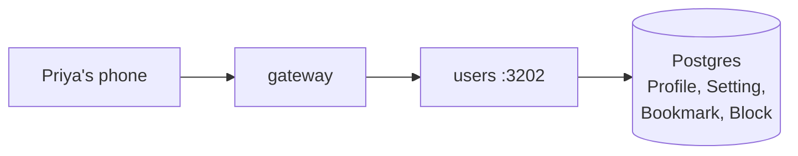

# users

> Priya's photo, her bio, her settings, her "looking for", and the search box.

## 1. The story (60 seconds)

Priya finishes login. The first thing she does is tap "Edit profile",
upload a new trek photo, and set her interest to "Photography,
Hiking, Coffee". A week later she searches "vegetarian, Mumbai, 25–32"
and saves three profiles to bookmarks. All of that is this service.

## 2. What this service is (in one picture)



## 3. What it can do (the menu)

| When Priya does this…                  | …the app calls                       | …and gets back                       | Source |
|----------------------------------------|--------------------------------------|--------------------------------------|--------|
| Views her profile                      | `GET /users/me`                      | `{profile, settings}`                | [src](services/users/src/server.ts) |
| Edits profile                          | `PATCH /users/me`                    | updated profile                       | [src](services/users/src/server.ts) |
| Saves settings (notif prefs, etc.)     | `PUT /users/me/settings`             | updated settings                      | [src](services/users/src/server.ts) |
| Searches users                         | `GET /users/search?q=…&city=…`       | `[{id, displayName, photo}]`         | [src](services/users/src/server.ts) |
| Bookmarks Arjun                        | `POST /users/me/bookmarks/{arjunId}` | `204`                                | [src](services/users/src/server.ts) |
| Blocks Rohan                           | `POST /users/me/blocks/{rohanId}`    | `204` + hides from Discover          | [src](services/users/src/server.ts) |

## 4. The data it remembers

- **`Profile`** — display name, bio, photos, age, city, interests.
- **`Setting`** — notification prefs, discoverability, tracking consent.
- **`Bookmark`** — Priya saved Arjun for later.
- **`Block`** — Priya never wants to see Rohan again.

## 5. Who it talks to

- **Postgres** — only its own tables.
- Read by `gateway` for the onboarding-complete check (with a 60s cache so we don't spam it).

## 6. The knobs (configuration)

| Env var                | What it does                                  | Example       | What breaks                       |
|------------------------|-----------------------------------------------|---------------|-----------------------------------|
| `DATABASE_URL`         | Postgres connection                            | (see auth)    | service won't start               |
| `INTERNAL_SERVICE_KEY` | Required header from internal callers         | random 32 bytes | gateway/social calls return 403 |
| `PORT`                 | Listen port                                    | `3202`        | gateway can't reach               |

## 7. A real example, end-to-end

Priya searches "Mumbai, vegetarian, 26–34".

> ```bash
> curl -H 'authorization: Bearer eyJ…' \
>   'http://localhost:3200/users/search?city=Mumbai&diet=veg&ageMin=26&ageMax=34&limit=20'
> ```
> "Gateway forwards. Users runs a Prisma query with index on (city, diet, age), returns up to 20 hits."
> ```json
> [
>   {"id": "usr_arjun", "displayName": "Arjun", "city": "Bangalore", "age": 30},
>   {"id": "usr_meera", "displayName": "Meera", "city": "Delhi",    "age": 32}
> ]
> ```

## 8. Run it on your laptop

```bash
docker compose up -d postgres
cd services/users && npm install && npm run dev
```

## 9. How we know it works (tests)

- **`profile.test.ts`** — edit returns 200; invalid input rejected by Zod.
- **`search.test.ts`** — city + diet filter returns matching users only.
- **`bookmarks.test.ts`** — duplicate bookmark is idempotent (no error).

## 10. If something breaks

| Symptom                              | First check                                |
|--------------------------------------|--------------------------------------------|
| `/users/me` returns 401               | gateway's JWT verify failing — token expired? |
| Search slow                           | Postgres index on (city, diet, age) present? |
| Onboarding redirect loop              | `Setting.onboardingComplete` flag value      |

## 11. What changed and why it's better

- **Before:** profile was inside the auth service; one DB lock could freeze logins.
- **After:** split out, scales independently, dedicated indexes for search.
- **Why Priya feels it:** searches return in <100ms even when 50k users are logging in at the same time.
