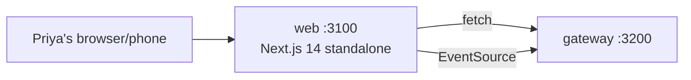

# web

> Everything Priya sees. The Next.js 14 app at <http://localhost:3100>.

## 1. The story (60 seconds)

Priya opens her browser to miamo.app. Within 600ms she sees Arjun's
trek photo — not a spinner, not a skeleton, the actual first card. She
swipes right, the heart turns red instantly, a "It's a match!" toast
appears, and a chat icon lights up in her bottom nav. The whole thing
feels native. It's not — it's a server-rendered React app, but the
design makes it feel that way.

## 2. What this service is (in one picture)



Web is the **only** service Priya's browser talks to. Web is the
**only** service that talks to the gateway from the user's behalf
(via cookie-forwarded fetch).

## 3. What it contains (the menu)

| Route group   | Routes                                                           |
|---------------|------------------------------------------------------------------|
| `(auth)`      | `/login`, `/signup`, `/reset-password`                            |
| `(main)`      | `/discover`, `/matches`, `/chat/[chatId]`, `/feed`, `/stories`, `/ai-picks`, `/notifications`, `/profile` |
| (top-level)   | `/onboarding`                                                    |

Full breakdown in [docs/FRONTEND.md](docs/FRONTEND.md).

## 4. The data it stores

Nothing on a server. All persistence is in the backend through the
gateway. Client state lives in three places:
- URL (chat id, search params)
- Server (re-fetch when needed)
- React hooks (transient composer text, scroll position)

## 5. Who it talks to

- **gateway** (HTTP + SSE). That's it.

## 6. The knobs (configuration)

| Env var                              | What it does                                       | Example                       | What breaks                  |
|--------------------------------------|----------------------------------------------------|-------------------------------|------------------------------|
| `NEXT_PUBLIC_API_URL`                 | Base URL for browser-side fetches                  | `http://localhost:3200`       | every API call fails          |
| `INTERNAL_API_URL`                    | Same URL from server-side context (often identical)| `http://gateway:3200`         | SSR fetches fail              |
| `PORT`                                | Listen port                                        | `3100`                        | not reachable                 |

## 7. A real example, end-to-end

Priya hits `/discover`.

> 1. Next.js renders the Discover page on the server.
> 2. Server component calls `fetch(API + '/social/discover?limit=10')` with Priya's cookie.
> 3. Gateway → social → returns 10 ranked candidates.
> 4. Server renders the first card; HTML sent to browser.
> 5. Browser hydrates; subsequent swipes are client-side `fetch`.

## 8. Run it on your laptop

```bash
# bring up the backend
docker compose up -d gateway auth users social messaging content notifications postgres redis

# run web in dev mode
cd services/web
npm install
NEXT_PUBLIC_API_URL=http://localhost:3200 npm run dev
# open http://localhost:3100
```

## 9. How we know it works (tests)

- **Playwright smoke**: login → discover → swipe right → match toast → open chat → send message. Runs in ~30s in CI.

## 10. If something breaks

| Symptom                                  | First check                                                 |
|------------------------------------------|-------------------------------------------------------------|
| Pages flash blank then content            | RSC cache miss — `kubectl logs -l app=web --tail=100`       |
| API calls failing in browser              | `NEXT_PUBLIC_API_URL` not set at build time                  |
| Login OK then bounced back to login       | Cookie not set — cross-origin / CORS issue                  |
| Live updates not arriving in chat tab     | SSE connection dropped — check gateway heartbeats           |

## 11. What changed and why it's better

- **Before:** React SPA, full client-side render. First card took ~2.5s on 4G.
- **After:** Next.js 14 App Router with server components. First card paints in ~600ms.
- **Why Priya feels it:** the app opens. No spinner. She's swiping before she'd have stopped tapping the app icon on the old version.
